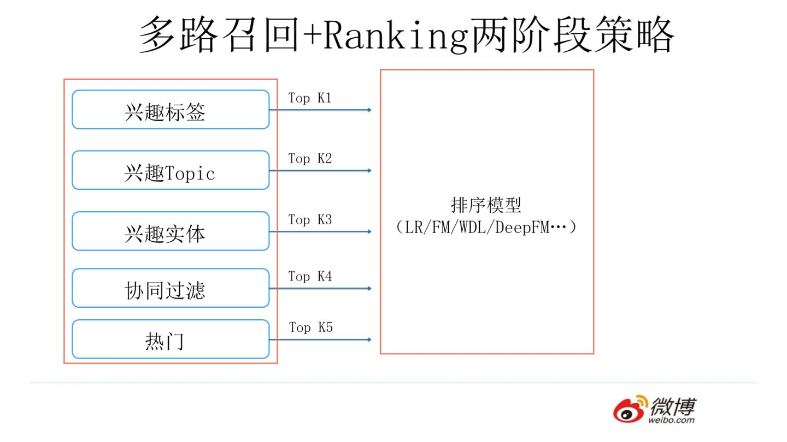
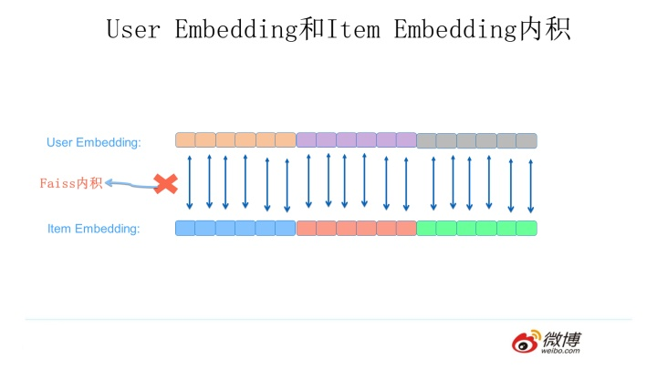

作者：张俊林
链接：https://zhuanlan.zhihu.com/p/59528983
来源：知乎
著作权归作者所有。商业转载请联系作者获得授权，非商业转载请注明出处。

美剧《权力的游戏》中，宗教刺客团体“无面者”成员之一的贾昆，在他和艾莉亚·史塔克分别之际，将一枚特殊的小硬币交给了艾莉亚，并教会艾莉亚一句话，原话是这样的：

​     “Valar Morghulis （凡人皆有一死） 

​      Valar Dohaeris （凡人皆须侍奉）

”

但他并未详细解释硬币的用途和这句话的意思。硬币是用来做何用的呢？读完这篇文章你自会知晓答案。至于这句话，前半句好理解，就是字面意思，后半句比较深奥，我也不太懂，我猜大概跟老子说的“天地不仁，以万物为刍狗”意思有点类似吧。

其实仔细想想，上面这句话送给我们见到的各式算法模型也蛮适合，某个算法甲在某年某月被某人乙发明出来，我们发明出来它，当然也没有事先征求它个人的意见。这就仿佛，我们每个人，明知道这世间事，十有九苦，不也没有征求孩子们的个人意愿，他们，也包括我们自己，就这么硬生生地被拉入充斥各色人等的人世间，红尘翻滚，遍尝疾苦，作为补偿，生活也许会回馈些许短暂的欢乐，以让我们继续有动力去面对新的难题。

你再想想，算法模型的诞生不也一样吗？它们出生后，如果人们觉得它有用，那它就安心本分地做好自己的工作，好好地服务你我他，如果哪天冒出更活力四射青春逼人的新模型，你觉得它没什么大用了，不也弃之如敝履吗？我们每个人不也是他人疾苦的来源之一吗？

正所谓：

​    模型皆有一死；

   模型皆须侍奉。

好像也挺有道理的，你说是吗？

我们说回主题，这篇文章介绍如何用FFM模型来做推荐系统的统一召回。算是召回模型系列四篇的第二篇，之前在“[推荐系统召回四模型之：全能的FM模型](https://zhuanlan.zhihu.com/p/58160982)”中，介绍了一些基本知识，以及如何用FM模型做统一召回，又及，FM模型是否可以做一体化的单阶段推荐模型。本文为了能够看起来也独立成篇，所以很多前篇文章的基础知识点，仍然会保留。如果比较熟悉的读者，可以直接跳到“**用FM/FFM模型做召回意味着什么**”部分看起。

这个召回模型系列文章的缘起，来自于我对下列两个不太符合常规做法的推荐技术问题的思考，下面再次复述一遍：

 第一个问题：我们知道在个性化推荐系统里，第一个环节一般是召回阶段，而召回阶段工业界目前常规的做法是多路召回，每一路召回可能采取一个不同的策略。那么打破常规的思考之一是：**是否我们能够使用一个统一的模型，将多路召回改造成单模型单路召回策略？**如果不能，那是为什么？如果能，怎么做才可以？这样做有什么好处和坏处？

第二个问题：我们同样知道，目前实用化的工业界的推荐系统通常由两个环节构成，召回阶段和排序阶段，那么为什么要这么划分？它们各自的职责是什么？打破常规的另外一个思考是：**是否存在一个模型，这个模型可以将召回阶段和排序阶段统一起来，就是把两阶段推荐环节改成单模型单环节推荐流程**？就是说靠一个模型一个阶段把传统的两阶段推荐系统做的事情一步到位做完？如果不能，为什么不能？如果能，怎么做才可以？什么样的模型才能担当起这种重任呢？而在现实世界里是否存在这个模型？这个思路真的可行吗?

 本文主要探讨FFM模型是否能够解决上述两个问题。我仍然会先简单介绍下推荐系统整体架构以及多路召回的基本模式，然后说明下FFM模型基本思想，之后探讨FFM模型是否能够解决上面提到的两个非常规问题，如果能，该怎么解决？纯属个人思考，非经验分享，天马行空，谬误难免。

------

## **工业界推荐系统整体架构是怎样的**

一个典型的工业级推荐系统整体架构可以参考上图，一般分为在线部分，近线部分和离线部分。

对于在线部分来说，一般要经历几个阶段。首先通过召回环节，将给用户推荐的物品降到千以下规模；如果召回阶段返回的物品还是太多，可以加入粗排阶段，这个阶段是可选的，粗排可以通过一些简单排序模型进一步减少往后续环节传递的物品；再往后是精排阶段，这里可以使用复杂的模型来对少量物品精准排序。对某个用户来说，即使精排推荐结果出来了，一般并不会直接展示给用户，可能还要上一些业务策略，比如去已读，推荐多样化，加入广告等各种业务策略。之后形成最终推荐结果，将结果展示给用户。

对于近线部分来说，主要目的是实时收集用户行为反馈，并选择训练实例，实时抽取拼接特征，并近乎实时地更新在线推荐模型。这样做的好处是用户的最新兴趣能够近乎实时地体现到推荐结果里。

对于离线部分而言，通过对线上用户点击日志的存储和清理，整理离线训练数据，并周期性地更新推荐模型。对于超大规模数据和机器学习模型来说，往往需要高效地分布式机器学习平台来对离线训练进行支持。

因为粗排是可选的，对于大多数推荐系统来说，通常在线部分的主体分为两个阶段就够，第一个阶段是召回，第二个阶段是排序。因为个性化推荐需要给每个用户展现不同的信息流或者物品流，而对于每个用户来说，可供推荐的物品，在具备一定规模的公司里，是百万到千万级别，甚至上亿。所以对于每一个用户，如果对于千万级别物品都使用先进的模型挨个进行排序打分，明显速度上是算不过来的，资源投入考虑这么做也不划算。从这里可以看出，召回阶段的主要职责是：从千万量级的候选物品里，采取简单模型将推荐物品候选集合快速筛减到千级别甚至百级别，这样将候选集合数量降下来，之后在排序阶段就可以上一些复杂模型，细致地对候选集进行个性化排序。

 从上面在线推荐两阶段任务的划分，我们可以看出，召回阶段因为需要计算的候选集合太大，所以要想速度快，就只能上简单模型，使用少量特征，保证泛化能力，尽量让用户感兴趣的物品在这个阶段能够找回来；而排序阶段核心目标是要精准，因为它处理的物品数据量小，所以可以采用尽可能多的特征，使用比较复杂的模型，一切以精准为目标。

------

## **多路召回怎么做**

目前工业界推荐系统的召回阶段一般是怎么做的呢？可以用一句江湖气很重的话来总结，请您系好安全带坐稳，怕吓到您，这句话就是：“一只穿云箭，千军万马来相见”。听起来霸气十足是吧？我估计看过古惑仔电影的都熟悉这句话，黑帮集结打群架的时候喜欢引用这句名言，以增加气势，自己给自己打气。如果和推荐系统对应起来理解，这里的“穿云箭”就是召回系统，而千军万马就是各路花式召回策略。

目前工业界的推荐系统，在召回阶段，一般都采取多路召回策略。上图展示了一个简化版本的例子，以微博信息流排序为例，不同业务召回路数不太一样，但是常用的召回策略，基本都会包含，比如兴趣标签，兴趣Topic，兴趣实体，协同过滤，热门，相同地域等，多者几十路召回，少者也有7／8路召回。

对于每一路召回，会拉回K条相关物料，这个K值是个超参，需要通过线上AB测试来确定合理的取值范围。如果你对算法敏感的话，会发现这里有个潜在的问题，如果召回路数太多，对应的超参就多，这些超参组合空间很大，如何设定合理的各路召回数量是个问题。另外，如果是多路召回，这个超参往往不太可能是用户个性化的，而是对于所有用户，每一路拉回的数量都是固定的，这里明显有优化空间。按理说，不同用户也许对于每一路内容感兴趣程度是不一样的，更感兴趣的那一路就应该多召回一些，所以如果能把这些超参改为个性化配置是很好的，但是多路召回策略下，虽然也不是不能做，但是即使做，看起来还是很Trick的。有什么好办法能解决这个问题吗？有，本文后面会讲。

------

## **用FM/FFM模型做召回意味着什么**

本文的主体是春节期间写完的，但是这个部分是最近加进来的，因为我发现第一篇介绍FM模型做召回的文章发出去后，很多人反馈有些地方看不懂。这让我一度感到FM那篇文章写得有些失败，通俗易懂一直是我写文章的首要追求，有时候宁肯为了保证这点，牺牲掉很多公式的表达。因为据说每加进一个公式，读者就会跑掉一半。每当我写到公式部分的时候，都会下意识地数数公式数量，当发现读者都已经跑光了的时候，我一般回头会把公式都默默地删掉。说远了，这里增加这个部分，是考虑到上篇介绍FM做召回的文章读者的疑惑，先做些背景说明，以增进理解。

首先，第一个问题是：FM/FFM模型一般是作为典型的Ranking阶段的模型，怎么理解用它来做召回这件事情呢？

  上图是目前最常见的多路召回+Ranking的两阶段推荐策略，上面讲过不多说。

如果我们想把一般用来做排序的模型，比如FM、FFM，用来做召回模型。那么一种比较温柔地做法，参考上图，就是用模型作为一路新的召回策略，或者用模型召回代替掉原先多路召回的一路或者几路召回，这是温柔派的做法。

你说了，我生性比较凶猛，堪比猛禽，那么怎么做呢？像上图这么做，用FM/FFM模型代替掉所有原先的多路召回策略。本文明显主要目的之一是这个，从这里好像你很容易推断我也是猛禽派的代表是吧？

你又说了，刚才那个做法也还算温柔吧，我属于飞越疯人院那种风格的，是不是可以做得更生猛些？可以啊，向上图这么做推荐，就是用一个模型把召回和排序两个阶段的事情全做掉。这也是本文要探讨的另外一个要点。嗯，此时，聪明的你肯定又推论出了什么真理是吧？

上面说的是有困惑的第一个点，可能我之前没讲明白用排序模型做召回是什么意思；第二个问题是：FM/FFM做排序的话，大家都很熟悉怎么用了，那么用这些模型做召回，对它有什么和做排序不同的要求吗？其实把FM/FFM模型用在召回和Ranking这两个不同阶段，差别还是蛮大的。

如果是在排序阶段使用FM/FFM或者其他模型，因为此时用户已知，要排序的具体是哪篇文章也知道（通过召回阶段拉回来少量的文章），都在模型面前摆着，此时模型的任务是要判断用户是否对某篇文章感兴趣，所以用户特征和物料特征可以同时作为模型的输入。

而如果是在召回阶段使用FM/FFM模型，首先面临的问题是：我们现在只知道是哪个用户在浏览，用户特征都是全的，但是面对的判断对象是千万量级的文章，汪洋大海，人民战争，而不是某篇具体的文章。模型的任务是：只拿着用户特征，去千万量级的文章库里找出一小批用户可能感兴趣的文章出来，而且速度要够快。这个要求就稍微刁钻一些。

这是它们最大的不同，一个不同是召回阶段要计算的数据量巨大；另外一个不同是貌似我们手头只有用户特征，此时如何应用模型呢？所以你可以看出来，在召回阶段，使用某个具体的模型，比排序阶段使用这个模型的应用条件更苛刻，需要满足一定的模式，才能把某个模型用到召回阶段。那么，怎么做呢？

上图展示了一个通用的在召回阶段使用模型的思路，尽管具体采用的模型不同，但是基本都是在这个框架下运转的：因为用户特征和物料特征不能同时作为模型的输入，那么我们需要对它们分别处理。具体做法是，采用某个模型，离线把用户特征打包成用户embedding，代表用户兴趣向量；同时可以离线或者近乎在线地把物料特征也单独打包，打成物料embedding，需要将两类特征分离。

在使用模型的时候，对于每个用户以及每个物品，我们可以按照上述方法，将每个用户的兴趣向量离线算好，存入在线数据库中比如Redis（用户ID及其对应的embedding），把物品的向量逐一离线算好，存入Faiss(Facebook开源的embedding高效匹配库)数据库中。

当用户登陆或者刷新页面时，可以根据用户ID取出其对应的兴趣向量embedding，然后和Faiss中存储的物料embedding做内积/Cosine等不同类型的计算，按照得分由高到低返回得分Top K的物料作为召回结果。提交给第二阶段的排序模型进行进一步的排序。

所以你看到了，在召回阶段是如何使用模型的：首先用户特征和物品特征需要分离打包，这个包怎么打？才能符合FM/FFM的计算原则？这是一个问题。然后通过Faiss解决数据量太大计算速度慢的问题，所以速度问题可以认为已经被解决了。剩下的问题就是Faiss的对用户兴趣embedding和物料embedding做内积计算，这种计算结果，是否符合FM/FFM模型的计算原则？或者其它模型的计算原则？这个也是关键。想明白上述一个问题一个关键，那么完全可以采用新模型来做这个事情。

此为背景解释，下面进入模型相关内容。

------

## **什么是FFM模型**

FFM的全称是Field-aware FM，直观翻译过来，就是能够意识到特征域(Field)的存在的FM模型。那么FFM模型是有第六感吗？它怎么能够感知到特征域的存在呢？这里先不解释，后面会说明。我们先看个例子。

上图是一个人造的广告CTR的数据例子，代表的意思是在某个网站（Publisher）上刊登一则广告（Advertiser），某个用户（用户性别特征Gender）是否会点击某条广告的数据。这个例子中假设包含三个特征域（Field）:网站Publisher(可能的特征值是ESPN、Vogue、NBC)、广告（可能的特征值是Nike、Adidas、Gucci）和性别特征Gender(可能的特征值是Male、Female)。由这个例子可以看出组合特征的重要性：如果在体育网站ESPN上发布Nike的广告，那么100次展现，80次会被点击，而20次不会被点击。意味着组合特征（Publisher=”ESPN” and Advertiser=”Nike”）是个很强的预测用户是否点击的二阶组合特征。上图同时展示了一条用户点击记录。

我们用这个例子来说明FFM的基本思想，FM模型可以看做是FFM模型的一个特例，所以在说明FFM模型思想之前，我们先用上述例子说明FM的思想，然后通过和FM模型的对比，很容易理解FFM模型的基本思路。

FM模型在做二阶特征组合的时候，对于每个二阶组合特征的权重，是根据对应两个特征的Embedding向量内积，来作为这个组合特征重要性的指示。当训练好FM模型后，每个特征都可以学会一个特征embedding向量，参考上图。当做预测的时候，比如我们接收到上面例子的数据，需要预测用户是否会点击这条广告，则对三个特征做两两组合，每个组合特征的权重，可以根据两个对应的特征embedding内积求得，对所有组合特征求和后，套接Sigmoid函数即可做出二分类预测。

对于FM模型来说，每个特征学会唯一的一个特征embedding向量，注意，在这里，和FFM的最大不同点冒出来了。为了更容易向FFM模型理解过渡，我们可以这么理解FM模型中的某个特征的embedding：拿Vespn这个特征作为例子，当这个特征和其它特征域的某个特征进行二阶特征组合的时候，不论哪个特征域的特征和Vespn特征进行组合，Vespn这个特征都反复使用同一个特征embedding去做内积，所以可以理解为Vespn这个特征在和不同特征域特征进行组合的时候，共享了同一个特征向量。

沿着这个思路思考，我会问出一个问题：我们可以改进下FM模型吗？怎么改进？下图给个提示。

如果你对算法敏感的话，你可以这么回答我：既然FM模型的某个特征，在和任意其它特征域的特征进行组合求权重的时候，共享了同一个特征向量。那么，如果我们把这个事情做地更细致些，比如Vespn这个特征，当它和Nike（所属特征域Advertiser）组合的时候用一个特征embedding向量，而当它和Male(所属特征域Gendor)组合的时候，使用另外一个特征embedding向量，这样是否在描述特征组合的时候更细腻一些？也就是说，当Vespn这个特征和属于Advertiser这个域的特征进行组合的时候，用一个特征embedding；和属于Gendor这个特征域的特征进行组合的时候，用另外一个特征embedding。这意味着，如果有F个特征域，那么每个特征由FM模型的一个k维特征embedding，拓展成了（F-1）个k维特征embedding。之所以是F-1，而不是F，是因为特征不和自己组合，所以不用考虑自己。

这样行吗？

嗯，你说的很有道理，是的，这其实就是FFM模型的基本思想。所以从上面两个图的示意可以看出，为何说FM模型是FFM模型的特例。

我们再回头看下刚才那个点击数据的例子，看看在FFM场景下是怎样应用的，上图展示了这个过程。因为这个例子有三个特征域，所以Vespn有两个特征embedding，当和Nike特征组合的时候，用的是针对Advertisor这个特征域的embedding去做内积；而当和Male这个特征组合的时候，则用的是针对Gendor这个特征域的embedding去做内积。同理，Nike和Male这两个特征也是根据和它组合特征所属特征域的不同，采用不同的特征向量去做内积。而两两特征组合这个事情的做法，FFM和FM则是完全相同的，区别就是每个特征对应的特征embedding个数不同。FM每个特征只有一个共享的embedding向量，而对于FFM的一个特征，则有（F-1）个特征embedding向量，用于和不同的特征域特征组合时使用。

从上面的模型演化过程，你可以体会到，为何这篇文章的标题将FFM模型称为笨重，它笨重在哪里？说它笨重，是和FM模型相比较而言的。我们可以推出，假设模型具有n个特征，那么FM模型的参数量是n*k（暂时忽略掉一阶特征的参数），其中k是特征向量大小。而FFM模型的参数量呢？因为每个特征具有（F-1）个k维特征向量，所以它的模型参数量是(F-1)*n*k，也就是说参数量比FM模型扩充了(F-1)倍。这意味着，如果我们的任务有100个特征域，FFM模型的参数量就是FM模型的大约100倍。这其实是很恐怖的，因为现实任务中，特征数量n是个很大的数值，特征域几十上百也很常见。另外，我们在上一篇介绍FM模型的文章里也讲过，FM模型可以通过公式改写，把本来看着是n的平方的计算复杂度，降低到 ![[公式]](imgs/equation-20200319111824209) 。而FFM无法做类似的改写，所以它的计算复杂度是 ![[公式]](imgs/equation-20200319111826932) ，这明显在计算速度上也比FM模型慢得多。所以，无论是急剧膨胀的参数量，还是变慢的计算速度，无论从哪个角度看，相对FM模型，FFM模型是略显笨重的。

正因为FFM模型参数量太大，所以在训练FFM模型的时候，很容易过拟合，需要采取早停等防止过拟合的手段。而根据经验，FFM模型的k值可以取得小一些，一般在几千万训练数据规模下，取8到10能取得较好的效果，当然，k具体取哪个数值，这其实跟具体训练数据规模大小有关系，理论上，训练数据集合越大，越不容易过拟合，这个k值可以设置得越大些。

上面是对FFM模型基本思想的说明，下面我们讨论如何用FFM模型做召回。

------

## **如何用FFM做召回模型**

如果要做一个实用化的统一召回模型，要考虑的因素有很多，比如Context上下文特征怎么处理，一阶项特征怎么加入等。为了能够更清楚地说明，我们先从简易模型说起，然后逐步加入必须应该考虑的元素，最后形成一个实用化的FFM版本的召回模型。  

不论是简化版本FFM召回模型，还是完全化版本，首先都需要先做如下两件事情：

第一，离线训练。这个过程跟在排序阶段采用FFM模型的离线训练过程是一样的，比如可以使用线上收集到的用户点击数据来作为训练数据，线下训练一个完整的FFM模型。在召回阶段，我们想要的其实是：每个特征和这个特征对应的训练好的（F-1）个embedding向量。这个可以存好待用。

第二，如果将推荐系统做个很高层级的抽象的话，可以表达成学习如下形式的映射函数：

![[公式]](imgs/equation-20200319111826896) 

 意思是，我们利用用户（User）相关的特征，物品(Item)相关的特征，以及上下文特征（Context,比如何时何地用的什么牌子手机登陆等等）学习一个映射函数F。学好这个函数后，当以后新碰到一个Item，我们把用户特征，物品特征以及用户碰到这个物品时的上下文特征输入F函数，F函数会告诉我们用户是否对这个物品感兴趣。如果他感兴趣，就可以把这个Item作为推荐结果推送给用户。

说了这么多，第二个我们需要做的事情是：把特征域划分为三个子集合，用户相关特征集合，物品相关特征集合以及上下文相关的特征集合。而用户历史行为类特征，比如用户过去点击物品的特征，可以当作描述用户兴趣的特征，放入用户相关特征集合内。至于为何要这么划分，后面会讲。

做完上述两项基础工作，我们可以试着用FFM模型来做召回了。

**1.简易版FFM召回模型**

我们先来尝试着构建一个简易版的FFM召回模型。 

在本文前面，我新增加了一节内容，专门叙述了如果想要使用类似FM/FFM这种排序模型来做召回，面临哪些约束，以及要解决的一个问题和一个关键点。那么如果你现在的任务是使用FFM模型来做召回，这个问题以及关键点怎么解决？建议你可以想想。下面是我思考的方案。

**1.1问题：如何根据FFM计算原则构建用户Embedding以及物品Embedding**

上文简单叙述过，用排序模型做召回的特点。其实，你可以这么理解：把FM/FFM等模型用来做召回，看做原先的“召回+排序”两阶段过程中的第二个过程前置，放到召回阶段来做排序。它本质上其实就是希望同时将两阶段过程用同一个阶段吸收掉。

只是因为召回阶段面临的待处理物料数量太大，所以依赖一种高效的计算模式，而这个目前看不是问题，成熟的方案就是Faiss的Embedding匹配的模式，速度应该是足够实用化的。

所以问题就转换成了：如何根据某个模型的计算标准，打出对应的用户侧Embedding，以及物品侧的Embedding。于是，我们可以将召回阶段的FM/FFM或者其它模型看成是一种受约束的排序过程，这里的“约束”，指的是需要明确将FM/FFM召回模型划分为两个阶段：首先需要离线将用户侧特征和物品侧特征进行分离编码，然后在线快速embedding匹配的时候完成模型计算过程。这不像传统的排序阶段使用FM/FFM模型，此时，两侧特征可以同时作为模型的输入，明显更灵活，受约束更小。所以，我们可以把召回阶段采用这种排序模型看成一种受约束的排序。

我们的主题是利用FFM模型做召回。于是问题转换成了：如何根据FFM模型的计算原则，打出对应的用户侧Embedding，以及物品侧Embedding。怎么做呢？

我用一个极度简化的例子来说明这个过程：假设在这个例子中，我们只使用五个特征域，用户侧采用两个特征域U1和U2，而物品侧采用三个特征域I1,I2和I3。当面对具体数据实例的时候，对应特征域下会有一个对应的特征值存在。对于某个具体的特征值f1来说，根据FFM的计算原则，它在离线训练阶段会学会4个对应的embedding向量，分别在这个特征和其它特征域的特征进行特征组合的时候使用。

首先，要意识到，**我们当前的任务是希望通过FFM模型来做用户任意特征和物品任意特征的组合**。

对于用户侧的两个特征，我们取出它们分别用于和对应的三个物品侧特征域组合时要用的embedding向量。比如对于U1来说，我们分别将这三个特征embedding称为U11/U12/U13，U11的两个下标数字的含义是：这是第1个用户侧的特征域U1和第1个物品侧特征域I1进行组合时使用的特征embedding。U12则是第1个用户侧的特征域U1和第2个物品侧特征域I2进行组合时使用的特征embedding。如此处理，于是每个用户侧的特征取出三个特征向量，每个物品侧的特征取出两个特征向量。形成上图的结构。

根据FFM的计算规则，如果我们希望计算用户侧和物品侧的两两特征组合，需要将特征向量求内积时的对应关系建立起来，图中箭头标出了对应关系。你可能看着有点乱，但是对应关系里面隐藏着一个规律，你可以找找这个规律看。提示下：你可以看看U和I特征向量下标编号，有什么规律性的对应关系吗？U12<-->I21、U23<-->I32……，嗯，我估计你看出来了，规律就是<Uij,Iji>。

上面那张图的特征向量之间的对应关系，看着确实有点让人眼花缭乱，那么能否让它们的对应关系看上去更简洁直接一些呢？很简单，只需要把物品侧的特征向量重新排下顺序即可。这个重排序的过程，可以看做是：对原先顺序排列的物品侧特征向量矩阵，做了一个转置操作。这样，每个物品侧的特征向量，就和需要求内积的对应用户侧特征向量，形成了整齐的一一对齐的效果了。具体过程参考上图。

我们讲过，模型做召回，要解决的问题是：如何利用FFM原则打出对应的用户侧embedding和物品侧embedding。前面两段所讲的，是根据FFM原则，对应的特征向量应该如何对齐的过程，而如果向量对齐后，怎么打出两个embedding向量？很简单，把刚才对齐的二维向量拉平，顺序concat连接，就形成了展开的一维的用户embedding和物品embedding。

然后，我们可以把每个物品的embedding离线存入Faiss，用户embedding离线算好，放在内存数据库中。当用户登录或者刷新时，在线根据用户的embedding向量，通过Faiss的快速查询功能，根据内积往回拉取top K物品，返回的物品就是根据FFM模型计算得分最高的推荐结果。

**1.2关键点：用户Embedding和物品Embedding内积计算符合FFM计算原则吗**

这样，其实就已经完成了一个简易版本的FFM召回模型。我们考虑下之前说的关键点：

两个拉长版本的User Embeding和Item Embedding，通过Faiss内积计算，最后的得分，是否和标准的FFM计算结果等价？

两者很显然是等价的，<U,I>内积的操作是两个长向量对应位的数值相乘，然后求和，所以拉长向量匹配版本和分拆成子项分别求内积再求和，数值是一样的，从上图示例可以很容易看出这一点。

从上述说明可以看出，此时我们获得了一个基础版本的FFM召回模型，这个版本的召回模型，只考虑了U和I特征的相互组合，其它的因素还没考虑。

此时应该回头再想想我们的标题：沉重的FFM。为什么我说FFM沉重呢？你可以算算这个拉平的embedding向量的长度。假设在我们的实际任务中，用户侧有50个特征域（M=50），物品侧有50个特征域(N=50)，每个特征向量的大小k=10，可以很容易推断出用户和物品的embedding长度，它的 size=M*N*K=50*50*10=25000，两万五千，“苦不苦，想想红军两万五，累不累，想想革命老前辈”，如果把一个数值位换成一里地，那快赶上长征的距离了。而这对于Faiss来说，如果物品库比较大，速度明显是跟不上的。

一种直观减小embedding长度的方法是把k值往小放，比如k=2或者4。如果只是使用FFM模型做召回，这个策略是可行的，反正召回阶段不用特别准，推荐结果的准确性靠第二个排序阶段来来保证，召回阶段原则上能把好的物料找回来即可。即使这样，embedding size=50*50*2=5000，长度也还是很长，虽说比不上长征的里程，但是明显比苏小妹的脸还是要长的。

另外一种思路是把特征域数量降下来，比如M=N=10，就是说用户和物品两侧各有10个特征域，这样的话embedding size=10*10*2=200。嗯，这个基本可以实用化了。如果只是将FFM用来做召回，虽说受限严重，但这么做，也不是不可以。

但是，我希望FFM不仅能够不受特征域数量限制地做召回，而且最好它还能一阶段地把排序也做掉，所以靠上面两个手段，是不能从根本上解决问题的。有什么加速策略吗？我想了两个方法，后面会分别介绍。

我们先把速度问题往后放一放，等会再谈。先一步一步优化这个FFM召回模型。

上面介绍的FFM召回模型，只是个简易版本，和标准FFM模型相比，很多内容它还没有考虑进来，比如用户侧或物品侧内部特征组合问题，一阶项如何引入的问题以及如何融入场景上下文特征问题，如果再将这三者引入，此时应该怎么做呢？

**2.加入用户侧及物品侧内部特征组合**

上小节所述内容，本质上是在计算用户侧任意特征和物品侧任意特征之间的两两特征组合。到这里你发现，如果希望在召回阶段完整复现FFM模型，还需要考虑用户侧内部两两特征组合，以及物品侧内部两两特征组合。

至于用户侧或者物品侧内部的两两特征组合的计算方法，可以仿照上述计算用户侧和物品侧特征组合的方法，也可以按照标准的FFM计算流程计算，总之方式比较灵活。关键的问题是：假设用户侧的内部特征两两组合得分Score(User_i*User_j)及Score(Iem_i*Item_j)算出来后，如何把它们集成进入那两个长长的用户embedding和物品embedding中？

可以如上图所示去做，在用户的二阶项embedding后添加两位：一位就是用户侧内部特征组合得分，在对应的物品侧位置，增加一位，值设置为1。这样的话，在Faiss做内积的过程中，就将用户侧内部特征组合得分计入；类似地，在物品侧也可以如此炮制。这样就将U和I的内部特征组合融入FFM召回模型中了，FM模型也是一样的道理。

理论上来说，如果是只用FM/FFM模型做召回，用户侧内部的特征组合对于返回结果排序没有影响，所以可以不用加入。物品侧内部特征之间的特征组合可能会对返回的物品排序结果有影响，可以考虑引入这种做法，把它统一加进去。而如果是希望用FM/FFM模型一阶段地替代掉“多路召回+Ranking”的两阶段模式，则可以考虑完全复现FM/FFM模型，如此，应将两侧的内部特征组合都考虑进去。（本小节内容是最近新加入的，这一部分的做法及使用场景是在最近的讨论中，微博机器学习团队佘青云同学想出来的，在此表示感谢）

**3.如何加入一阶项**

  我们知道，标准的FM/FFM公式中是包含一阶项的，也就是LR模型。如果我们根据上节方法所述，做出了用户侧和物品侧的二阶项embedding，此时，想要把一阶项加入FM/FFM召回模型，应该怎么做呢？

其实很简单，上图展示了一种做法，在用户侧的embedding中增加两位，第一位是属于用户特征域的特征对应的一阶项累加和，相应地，在物品侧对应位置增加一位，设置值为1，这样在Faiss求内积的过程中，就把用户侧的一阶项引入了。类似地，也可以如此加入物品侧的一阶项。

还有一种做法，如上图所示，不做用户侧和物品侧的一阶项求和，而是直接将用户侧及物品侧对应特征的一阶权重拼接到二阶项的embedding后。同样的，对应的物品侧或用户侧相应位置设置为1。这样，也可以在Faiss求内积过程中，把一阶项算入得分中。

微博在业务中的实践表明，如果采取FM召回模型，对于有些应用来说，一阶项对于最终效果有明显影响，所以在用FM/FFM做召回的时候，是需要将一阶项考虑进去的，这可能是个别一阶特征比较重要导致的。我们在Criteo数据集合的实验结果也证明：如果是FM模型，一阶项是有用的，去掉一阶项，只保留二阶项，AUC大约会掉1个绝对百分点，对于CTR来说，这个差距还是很明显的；而如果是采用DeepFM模型，则FM部分是否保留一阶项对最终结果没有什么影响，这说明DNN的隐层有效地将一阶项的作用吸收掉了。（这一小节也是最近新加入的，感谢微博机器学习团队黄通文同学补充的Criteo实验数据，以及马柏樟/邸海波同学在微博正文页推荐业务中测试FM统一召回模型时，提供的业务数据表现和一些建议）

**4.如何加入场景上下文特征**

我们上面说过，抽象的推荐系统除了用户特征及物品特征外，还有一类重要特征，就是用户发生行为的场景上下文特征（比如什么时间在什么地方用的什么设备在刷新），而上面逐步改进版本的FFM召回模型还没有考虑这一块。

之所以把上下文特征单独拎出来，是因为它有自己的特点，有些上下文特征是近乎实时变化的，比如刷新微博的时间，再比如对于美团嘀嘀这种对地理位置特别敏感的应用，用户所处的地点可能随时也在变化，而这种变化在召回阶段就需要体现出来。所以，上下文特征是不太可能像用户特征离线算好存起来直接使用的，而是用户在每一次刷新可能都需要重新捕获当前的特征值。动态性强是它的特点。

而考虑进来上下文特征，如果我们希望构造和标准的FFM等价的召回模型，就需要多考虑两个问题：

问题一：既然部分上下文特征可能是实时变化的，无法离线算好，那么怎么实时地将它融入上文所述的FFM召回计算框架里？

问题二：我们需要考虑上下文特征C和用户特征U之间的特征组合，也需要考虑C和物品特征I之间的特征组合。上下文特征有时是非常强的特征。那么，如何做能够将这两对特征组合考虑进来呢？

我们可以这么做：

首先，由于上下文特征的动态性，所以给定用户UID后，可以在线查询某个上下文特征对应的（F-1）个embedding向量，F是任务特征域的个数。这（F-1）个特征向量可以分成三组：一组是用于拿Context特征和用户特征域的特征进行特征组合用的，在我们上面给的例子里，有两个；第二组是拿Context特征和物品特征域的特征进行特征组合用的，我们的例子里这个数目是三；第三组是Context特征用于自身内部特征组合用的，这个我们先忽略，因为它的做法和上文所述的用户侧及物品侧求内部特征组合的做法是一样的。

为了简化说明，我们假设只有一个Context特征，于是它对应了（6-1）=5个embedding向量，其中2个是用于和用户侧特征进行组合的，3个是用于和物品侧特征进行组合的。我们把它们拆分成两组，如上图所示。

然后，我们来计算上下文特征和用户侧特征如何进行特征组合。如上图所示，其实这个过程和上文讲的用户侧与物品侧的FFM特征组合过程是一样的。物品侧和上下文侧特征找到对应的embedding向量做内积计算即可。这里不展开讲，如果不理解的话再回头看下上面的叙述。因为这两类特征都在用户发生访问行为的时候能获得，不依赖和物品发生关系，所以这个过程可以在用户侧在线计算完成。

这个内积数值代表用户特征和上下文特征的二阶特征组合得分，算好备用。

再然后，我们来计算上下文特征和物品侧特征的特征组合，如上图所示。其实很好理解，就相当于在做用户侧特征与物品侧特征组合的时候，在用户侧新加入了几个特征，无非这几个特征是Context特征，而其实不是用户侧的特征，但是做法是完全一样的。这样，就可以将Context特征打入用户侧embedding以及物品侧embedding，于是Context和物品的特征组合问题就解决了。

利用这个用户侧embedding，用Faiss通过内积方式取出Top K物品。通过这种方式取出的物品同时考虑到了用户和物品的特征组合<U,I>，以及上下文和物品的特征组合<C,I>。

假设返回的Top K物品都带有内积的得分Score1，再考虑上一步<U,C>的得分Score，将两者相加对物品重排序（<U,C>因为跟物品无关，所以其实不影响物品排序，如果是召回阶段使用FM/FFM，是可以不考虑引入的），就得到了最终结果。而这个最终结果，在遵循FFM计算原则的基础上，考虑了U/I/C两两之间的特征组合。当然，我们可以把上面说的一阶项以及<U,U>/<I,I>内部特征组合也融入这个系统。

于是我们通过这种手段，构造出了一个完整的FFM召回模型。这个召回模型通过构造user embedding，Context embedding和Item embedding，以及充分利用类似Faiss这种高效embedding计算框架，就构造了高效执行的和FFM计算完全等价的召回系统。

前文提过，FFM按照上述方法做，打出来的两个embedding长度太长，可能影响Faiss的效率。下面提供两个可能的提速方案。

**5.沉重的FFM：并行拉取提速策略**

如果用上述方法做FFM召回模型，有可能被拉平的用户embedding以及物品embedding长度太长，这会导致Faiss提取速度变慢，以致这个方法因为速度太慢而变得不可行。那么一种比较直接的提速想法就是：把太长的用户embedding打断成连续片段，物品embedding也相应地打断，同一个物品的embedding片段分别存在不同的Faiss数据库中，这样由于减少了embedding的长度，所以会极大加快Faiss的提取速度。

在结果返回时，对每个User Embedding片段拉回的Item子集合进行合并，同一个物品，把各自的片段内积得分累加，就得到了这个物品相对用户的FFM最终得分，很容易推断，这种片段得分累加策略，和作为整体计算长向量内积，两者得分是相同的。按照这个得分对返回的物品重排序，于是就得到了最终计算结果。这是一种典型的并行策略。

虽然，理论上，这个方案能够处理相当长的embedding匹配问题。但是，这个方案有个问题：并不能保证返回结果的最终排序和真实排序是一致的。因为有可能某个综合总得分较高的物品没有被从任何一个Faiss子数据库拉回来，比如这个物品每个片段的得分都不太高也不太低的情况，是可能发生这种漏召回的情况的。

**6.沉重的FFM：（FM+FFM）混合提速策略**

本系列文章中，上篇在介绍FM召回模型的时候，可以看出，它的一个特别简洁的方式是把用户侧的特征embedding累加，以及物品侧的特征embedding累加，所以FM打出来的两个embedding长度，只跟k相关，跟特征数目没关系，无论多少特征，embedding size恒等于k。所以看着特别简洁，效率也高。

那么FFM是否能够参照FM的思路，把一部分特征的embedding累加起来，通过这种方式来减小用户侧或物品侧的embedding大小呢？我觉得，结论是这样的：如果你坚持做一个原汁原味版的FFM，是不可能存在类似的特征合并的，因为用户侧和物品侧的做内积的embedding向量都是一一对应的，且无公共因子项可提出，所以没有可能进行特征embedding合并。

但是，如果我们不是原教旨FFM主义分子，一定坚持计算过程完全符合FFM计算原则，那么这个事情还是可以做的。参考上图，我觉得可以这么做：不同用户侧的特征，对应Fileds的向量直接累加；而在物品侧，则是属于同一个特征域的向量直接累加。这样可以保证用户embedding和物品embedding大小一致。这样的话，用户侧和物品侧的embedding size=M*K，比如M=50,K=10，那么长度是500，这样的长度还是可以把速度做起来的。

如果参照上面的做法，这其实等价于做了这么个事情：用户侧的特征仍然坚持了FFM的计算原则，就是每个特征针对其它不同特征域的组合，采用了不同的特征向量；但是，物品侧的特征向量，因为同一个特征域的（F-1）个特征域合并成一个，类似于这里采取的是FM的特征embedding思路。所以，这个方法看上去貌似是一个处于FFM和FM模型之间的一种混合模型。至于效果的话，我估计应该比FM好，比FFM不如，很可能也介于两者之间。当然，这只是我的分析结论。实际效果如何要通过实验来证明。

上面是按照合并物品侧的同一个特征域的特征向量角度来做的。完全也可以反过来，就是去合并用户侧的同一个特征域的特征向量。而如果是那样，则embedding size=N*K。

好了，经过了一系列补充特性，以及一些性能优化方案，我们就得到了一个完整版本的FFM召回模型。上面所讲都是说如何用FFM模型来做召回，那么下面我们开始探讨本文开头提出的第一个问题：如何用FFM召回模型统一多路召回策略？

------

## **如何利用FFM模型做统一的召回模型**

上文书提到过，目前工业界推荐系统在召回阶段，大多数采用了多路召回策略，比如典型的召回路有：基于用户兴趣标签的召回；基于协同过滤的召回；基于热点的召回；基于地域的召回；基于Topic的召回；基于命名实体的召回等等，除此外还有很多其它类型的召回路。

现在我们来探讨下第一个问题：在召回阶段，能否用一个统一的模型把多路召回招安？就是说改造成利用单个模型，单路召回的模式？具体到这篇文章，就是说能否利用FFM模型来把多路召回统一起来？

在回答上述问题之前，我估计你会提出疑问：目前大家用多路召回用的好好的，为啥要多此一举，用一个模型把多路召回统一起来呢？这个问题非常好，我们确实应该先看这么做的必要性。

**1.统一召回和多路召回优缺点比较**

我们先来说明下统一召回和多路召回各自的优缺点，我觉得使用统一召回模式，相对多路召回有如下优点：

首先，采用多路召回，每一路召回因为采取的策略或者模型不同，所以各自的召回模型得分不可比较，比如利用协同过滤召回找到的候选Item得分，与基于兴趣标签这一路召回找到的候选Item得分，完全是不可比较的。这也是为何要用第二阶段Ranking来将分数统一的原因。而如果采取统一的召回模型，比如FM/FFM模型，那么不论候选项Item来自于哪里，它们在召回阶段的得分是完全可比的。

其次，貌似在目前“召回+Ranking”两阶段推荐模型下，多路召回分数不可比这个问题不是特别大，因为我们可以依靠Ranking阶段来让它们可比即可。但是其实多路召回分数不可比会直接引发一个问题：对于每一路召回，我们应该返回多少个Item是合适的呢？如果在多路召回模式下，这个问题就很难解决。既然分数不可比，那么每一路召回多少候选项K就成为了超参，需要不断调整这个参数上线做AB测试，才能找到合适的数值。而如果召回路数特别多，于是每一路召回带有一个超参K，就是这一路召回多少条候选项，这样的超参组合空间是非常大的。所以到底哪一组超参是最优的，就很难定。其实现实情况中，很多时候这个超参都是拍脑袋上线测试，找到最优的超参组合概率是很低的。

而如果假设我们统一用FM/FFM模型来做召回，其实就不存在上面这个问题。这样，我们可以在召回阶段做到更好的个性化，比如有的用户喜欢看热门的内容，那么热门内容在召回阶段返回的比例就高，而其它内容返回比例就低。所以，可以认为各路召回的这组超参数就完全依靠FM模型调整成个性化的了，很明显这是使用单路单模型做召回的一个特别明显的好处。

 再次，对于工业界大型的推荐系统来说，有极大的可能做召回的技术人员和做Ranking的技术人员是两拨人。这里隐含着一个潜在可能会发生的问题，比如召回阶段新增了一路召回，但是做Ranking的哥们不知道这个事情，在Ranking的时候没有把能体现新增召回路特性的特征加到Ranking阶段的特征中。这样体现出来的效果是：新增召回路看上去没什么用，因为即使你找回来了，而且用户真的可能点击，但是在排序阶段死活排不上去。也就是说，在召回和排序之间可能存在信息鸿沟的问题，因为目前召回和排序两者的表达模式差异很大，排序阶段以特征为表达方式，召回则以“路／策略／具体模型”为表达方式，两者之间差异很大，是比较容易产生上述现象的。

 但是如果我们采用FM/FFM模型来做召回的话，新增一路召回就转化为新增特征的问题，而这一点和Ranking阶段在表现形式上是相同的，对于召回和排序两个阶段来说，两者都转化成了新增特征问题，所以两个阶段的改进语言体系统一，就不太容易出现上述现象。

上面三点，是我能想到的采用统一召回模型，相对多路召回的几个好处。但是是不是多路召回一定不如统一召回呢？其实也不是，很明显多路召回这种策略，上线一个新召回方式比较灵活，对线上的召回系统影响很小，因为不同路召回之间没有耦合关系。但是如果采用统一召回，当想新增一种召回方式的时候，表现为新增一种或者几种特征，可能需要完全重新训练一个新的FM/FFM模型，整个召回系统重新部署上线，灵活性比多路召回要差。

上面讲的是必要性，讲完了必要性，我们下面探讨如何把多路召回改造成单路召回。

**2.如何将多路召回融入FFM召回模型**

其实，用FFM模型统一多路召回，和FM模型统一多路召回，基本是一样的，只有些许不同。

我们以目前不同类型推荐系统中共性的一些召回策略来说明这个问题，以信息流推荐为例子，传统的多路召回阶段通常包含以下策略：协同过滤，兴趣分类，兴趣标签，兴趣Topic，兴趣实体，热门物品，相同地域等。这些不同角度的召回策略都是较为常见的。

我们再将上述不同的召回路分为两大类，可以把协同过滤作为一类，其它的作为一类，协同过滤相对复杂，我们先说下其它类别。

对于比如兴趣分类，兴趣标签，热门，地域等召回策略，要把这些召回渠道统一到FM/FFM模型相对直观，只需要在训练FM/FFM模型的时候，针对每一路的特性，在用户特征端和物品特征端新增对应特征即可。比如对于地域策略，我们可以把物品所属地域（比如微博所提到的地域）和用户的感兴趣地域都作为特征加入FM/FFM模型即可。兴趣标签，Topic，兴趣实体等都是类似的。所以大多数情况下，在多路召回模式下你加入新的一路召回，在FM/FFM统一召回策略下，对应地转化成了新增特征的方式。

然后我们再说协同过滤这路召回。其实本质上也是将一路召回转化为新加特征的模式。我们以前提到过：本质上MF模型这种典型的协同过滤策略，是FM模型的一个特例，而FM模型又是FFM模型的特例，所以其实MF模型也是FFM模型的特例。MF可以看作在FM/FFM模型里只有User ID和Item ID这两类（Fields）特征的情形。意思是说，如果我们将user ID和Item ID作为特征放入FFM模型中进行训练，那么FFM模型本身就是包含了协同过滤的思想的。

当然，对于超大规模的网站，用户以亿计，物品可能也在千万级别，如果直接把ID引入特征可能会面临一些工程效率问题以及数据稀疏的问题。

FM要想把ID特征融入，应该是可行的，因为毕竟每个特征只需要学习一个k维大小特征向量，虽然ID数量大，但是总还是能接受。但是，如果是在FFM召回模型中融入ID特征，你会发现这里有个严重的问题：因为每个特征要包含（F-1）个k维特征向量，这对于FFM来说，ID特征会有超量的参数需要学习。比如假设F=101,k=10，UID有1亿个不同ID。这意味着光UID特征，就需要1000亿参数，这个……估计你会被吓退。所以，感觉FFM是很难把协同特征引入的，除非，事先通过其它方法对ID进行协同embedding编码，在FFM中直接使用，而不作为它的参数。否则，这在参数量以及存储量上来说，是很难做到的。

 在具体实施统一多路召回的时候，可以沿着这个路径逐步替换线上的多路召回：先用FM/FFM模型替换一路召回，线上替换掉；再新加入某路特征，这样上线，就替换掉了两路召回；如此往复逐渐把每一路召回统一到一个模型里。这是比较稳的一种替换方案。当然如果你是个猛人，直接用完整的FFM召回模型一步替换掉线上的各路召回，也，未尝不可。只要小流量AB测试做好也没啥。

------

## **FFM模型能将召回和排序阶段一体化吗**

我们在前文讲过，召回和排序各司其职。召回主要考虑泛化性并把候选物品集合数量降下来；排序则主要负责根据用户特征／物品特征／上下文特征对物品进行精准排名。

那么，我们现在可以来审视下本文开头提出的第二个问题了：FFM模型能否将常见的两阶段模型一体化？即是否能将实用化的推荐系统通过FFM召回模型简化为单阶段模型？意思是推荐系统是否能够只保留FFM召回这个模块，绕过后续的排序阶段，FFM召回模块按照得分排序直接作为推荐结果返回。我们可以这么做吗？

这取决于FFM召回模型是否能够一并把原先两阶段模型的两个职责都能承担下来。这句话的意思是说，FFM召回模型如果直接输出推荐结果，那么它的速度是否足够快？另外，它的精准程度是否可以跟两阶段模型相媲美？不会因为少了第二阶段的专门排序环节，而导致推荐效果变差？如果上面两个问题的答案都是肯定的，那么很明显FFM模型就能够将现有的两阶段推荐过程一体化。

在本系列的第一篇介绍FM召回模型的文章里，分析结论是：FM模型无论在推荐精准性，还是推荐速度方面，应该是能够同时承载两阶段模型的功能的。

那么FFM召回模型也可以担任类似的重任吗？我的答案是：It Depends。要看情况，跟应用的复杂情况有关。

如果从推荐的精准性角度考虑，假设我们能够把排序阶段的特征都引入FFM召回模型，那么应该能够得到等价的排序结果，这个很好理解，因为这等于你在召回部分复制了一个完全相同的FFM排序模型，类似于把排序功能前置到了召回阶段，所以推荐精准度基本等价。

看着好像这个事情是能做的是吧？其实不然。

在前文我们分析过如何用FFM模型来做召回模型，你会再次发现FFM模型的特性，就是太沉重。这种“沉重性”在召回阶段，表现为：用FFM模型打出来的用户Embedding长度太长，如果用户侧有M个特征域，物品侧有N个特征域，单个特征embedding向量大小为K,先不考虑上下文特征域，打出来的用户Embedding size=M*N*K。而这个长度是很容易失控的。

如果这个长度太长，意味着单机版本的Faiss速度肯定是跟不上的，那这个事情就得搁浅。而如果长度可以接受，Faiss速度OK，那么这事情就能成。所以关键是这个M*N*K到底有多长。于是问题转换成了：M、N和K，各自大约有多大？

我们拿一个工业级的CTR数据Criteo来说明（4500万数据，39个特征域，为了好计算，我们假设是40个特征域）。先说K，这是单个特征向量的大小，在Criteo这种工业级的数据规模下，实验证明，K=8效果最好。如果FFM模型只是用在召回阶段，后面还会再接上排序模型，也就是两阶段模式，k主观随意设置小点，比如2到4，问题不太大，因为推荐的精准性还可以依赖排序模型来保证。而现在我们对FFM模型的期待更多，希望它一步把排序也做掉，于是这个k就不能调小，就得是8，否则推荐效果受影响。

再来说M和N，我们假设仍然是这个数据集，它有40个域，我们再假设这些特征域在用户侧和物品侧平分，就是:M=N=20。

于是我们可以算出，如果用FFM模型来做Criteo数据的召回模型，打出来的用户侧embedding大小为：M*N*k=20*20*8=3200。如果采用单机版本的Faiss做，这速度估计是跟不上的。如果采用上文讲的对用户侧embedding分布式切割的思路，比如把这个embedding切成10份，那么速度应该是能接受的，但是前面也说过，这可能对推荐精度有损失。

当然，我们也可以采取上文提到的（FM+FFM）嫁接版本来做，如果是这样，打出来的用户侧embedding size=M*K或N*K。对应Criteo数据来说，这个长度就是160，这对于Faiss来说，速度绝对不是问题，所以是可以充当一体化模型的。但是效果估计比不了原汁原味版本的FFM。

另外，如果排序包含ID特征，估计FFM召回模型也比较难以承担这个重任。

从上面这个实际例子来看，是否能使用FFM模型来做一体化推荐模型？这个问题的答案其实取决于任务复杂度，也就是特征域的个数，很明显结论是：如果特征域数量比较少，那么FFM模型是可行的，如果特征域数量比较多，则这事情做不了。除非，你愿意采取embedding分段切割模式损失精度，或者采取（FM+FFM）嫁接版本，而这也可能会损失精度。

当然，上面都是分析结果，并非实测，所以不能确定实际应用起来也能达到上述理论分析的效果。

------

## **尾声**

在本文开头，我提到过一枚硬币的故事。贾昆非常看好艾莉亚，认为她会成为最出色的无面者，也即刺客，想带走艾莉亚去狭海对面，但被艾莉亚拒绝了。贾昆给了艾莉亚一枚旧硬币，并告诉她，如果有朝一日她要找他，可以把这枚旧硬币交给布拉佛斯的任何一个人，并对他说“Valar Morghulis”。

两人自此分别，长久未见。在此期间，少女艾莉亚四处漂泊，历经苦厄，当有一天，发现家国残破，亲人或离散无音讯，或死亡不可追。世界虽大，无处容身，想起了贾昆曾经说过的话，于是远涉重洋来到传说中的布拉佛斯，在码头，她将硬币递给一位船夫，并说：“凡人皆有一死”。船夫应答：凡人皆须侍奉，之后将艾莉亚带到布拉夫斯的黑白之院。开门的是一位须发皆白的老人，一番谈话后，当老人撕下面具的时候，露出了贾昆的真面容。艾莉亚惊诧疑惑地问到：“你究竟是谁？”贾昆缓声回答：“无名之辈（No One），而这也是你的宿命”。从跨入黑白之院的大门起，艾莉亚步入了只属于她自己的，历尽艰险，追求成为“No One”的无尽宿命中。