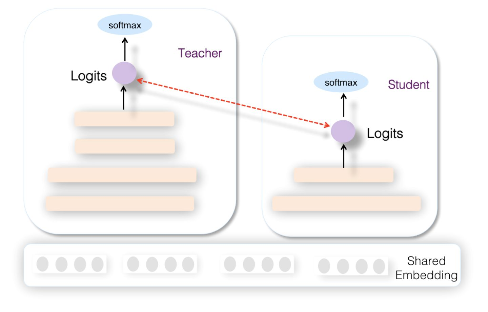

# 知识蒸馏在推荐系统的应用

随着深度学习的快速发展，优秀的模型层出不穷，比如图像领域的ResNet、自然语言处理领域的Bert，这些革命性的新技术使得应用效果快速提升。但是，好的模型性能并非无代价的，你会发现，深度学习模型正在变得越来越复杂，网络深度越来越深，模型参数量也在变得越来越多。而这会带来一个现实应用的问题：将这种复杂模型推上线，模型响应速度太慢，当流量大的时候撑不住。

知识蒸馏就是目前一种比较流行的解决此类问题的技术方向。一般知识蒸馏采取Teacher-Student模式：将复杂模型作为Teacher，Student模型结构较为简单，用Teacher来辅助Student模型的训练，Teacher学习能力强，可以将它学到的暗知识（Dark Knowledge）迁移给学习能力相对弱的Student模型，以此来增强Student模型的泛化能力。复杂笨重但是效果好的Teacher模型不上线，就单纯是个导师角色，真正上战场挡抢撑流量的是灵活轻巧的Student小模型。比如Bert，因为太重，很难直接上线跑，目前很多公司都是采取知识蒸馏的方法，学会一个轻巧，但是因为被Teacher教导过，所以效果也很好的Student模型部署上线。

## **知识蒸馏典型方法**

目前知识蒸馏已经成了独立研究方向，各种新技术层出不穷。但是如果粗略归纳一下的话，主流的知识蒸馏技术有两个技术发展主线：Logits方法及特征蒸馏方法。

我们先简单说明下Logits方法的思路。在介绍之前，首先得明白什么是Logits。 我们知道，对于一般的分类问题，比如图片分类，输入一张图片后，经过DNN网络各种非线性变换，在网络接近最后一层，会得到这张图片属于各个类别的大小数值 ![[公式]](imgs/equation-20201101120657139) ，某个类别的 ![[公式]](https://www.zhihu.com/equation?tex=z_i) 数值越大，则模型认为输入图片属于这个类别的可能性就越大。什么是Logits? 这些汇总了网络内部各种信息后，得出的属于各个类别的汇总分值 ![[公式]](https://www.zhihu.com/equation?tex=z_i) ，就是Logits, i代表第i个类别， ![[公式]](https://www.zhihu.com/equation?tex=z_i) 代表属于第i类的可能性。因为Logits并非概率值，所以一般在Logits数值上会用Softmax函数进行变换，得出的概率值作为最终分类结果概率。Softmax一方面把Logits数值在各类别之间进行概率归一，使得各个类别归属数值满足概率分布；另外一方面，它会放大Logits数值之间的差异，使得Logits得分两极分化，Logits得分高的得到的概率值更偏大一些，而较低的Logits数值，得到的概率值则更小。上图中的公式 ![[公式]](imgs/equation-20201101120657301) ，就是一个变体的Softmax公式，如果把T拿掉或令T=1，则是个标准的Softmax公式， ![[公式]](https://www.zhihu.com/equation?tex=z_i) 就是第i个类别的Logits数值， ![[公式]](https://www.zhihu.com/equation?tex=q_i) 是Logits数值经过Softmax变换后，归属于第i个类别的概率值。

知道了什么是Logits后，我们来说什么是Logits蒸馏方法。假设我们有一个Teacher网络，一个Student网络，输入同一个数据给这两个网络，Teacher会得到一个Logits向量，代表Teacher认为输入数据属于各个类别的可能性；Student也有一个Logits向量，代表了Student认为输入数据属于各个类别的可能性。最简单也是最早的知识蒸馏工作，就是让Student的Logits去拟合Teacher的Logits，即Student的损失函数为：

![[公式]](imgs/equation-20201101120657369)

其中， ![[公式]](imgs/equation-20201101120657398) 是Teacher的Logits， ![[公式]](imgs/equation-20201101120657609) 是Student的Logits。在这里，Teacher的Logits就是传给Student的暗知识。

Hinton在论文Distilling the Knowledge in a Neural Network中提出了称为Softmax Temperature的改进方法，并第一次正式提出了“知识蒸馏”的叫法。Softmax Temperature改造了Softmax函数（公式参考上图），引入了温度T，这是一个超参数。如果我们把T设置成1，就是标准的Softmax函数，也就是极端两极分化版本。如果将T设大，则Softmax之后的Logits数值，各个类别之间的概率分值差距会缩小，也即是强化那些非最大类别的存在感；反之，则会加大类别间概率的两极分化。Hinton版本的知识蒸馏，让Student去拟合Teacher经过T影响后Softmax得到的，其实也是让Student去学习Teacher的Logits，无非是加入T后可以动态调节Logits的分布。Student的损失函数由两项组成，一个子项是Ground Truth，就是在训练集上的标准交叉熵损失，让Student去拟合训练数据，另外一个是蒸馏损失，让Student去拟合Teacher的Logits：

![[公式]](imgs/equation-20201101120657617)

H是交叉熵损失函数， ![[公式]](imgs/equation-20201101120657503) 是Student模型的映射函数， ![[公式]](imgs/equation-20201101120657721) 是Ground Truth Label， ![[公式]](imgs/equation-20201101120657398) 是Teacher的Logits， ![[公式]](imgs/equation-20201101120657609) 是Student的Logits， ![[公式]](imgs/equation-20201101120657727) 是Softmax Temperature函数， ![[公式]](imgs/equation-20201101120657737) 用于调节蒸馏Loss的影响程度。

一般而言，温度T要设置成大于1的数值，这样会减小不同类别归属概率的两极分化程度，因为Logits方法中，Teacher能够提供给Student的额外信息就包含在Logits数值里。如果我们在蒸馏损失部分，将T设置成1，采用常规的Softmax，也就是说两极分化严重时，那么相对标准的训练数据，也就是交叉熵损失，两者等同，Student从蒸馏损失中就学不到任何额外的信息。

另外一种大的知识蒸馏思路是特征蒸馏方法，如上图所示。它不像Logits方法那样，Student只学习Teacher的Logits这种结果知识，而是学习Teacher网络结构中的中间层特征。最早采用这种模式的工作来自于自于论文：“FITNETS：Hints for Thin Deep Nets”，它强迫Student某些中间层的网络响应，要去逼近Teacher对应的中间层的网络响应。这种情况下，Teacher中间特征层的响应，就是传递给Student的暗知识。在此之后，出了各种新方法，但是大致思路还是这个思路，本质是Teacher将特征级知识迁移给Student。因为介绍各种知识蒸馏方法不是我们的主题，这里不展开了，我们尽快切入主题。

## **知识蒸馏在推荐系统中的三个应用场景**

我们知道，工业界常见推荐系统一般有三个级联的过程：召回、粗排以及精排。召回环节从海量物品库里快速筛选部分用户可能感兴趣的物品，传给粗排模块，粗排环节通常采取使用少量特征的简单排序模型，对召回物料进行初步排序，并做截断，进一步将物品集合缩小到合理数量，向后传递给精排模块，精排环节采用利用较多特征的复杂模型，对少量物品进行精准排序。其中，粗排环节根据具体应用可选可不选。

那么，在这种串行级联的推荐体系中，知识蒸馏可以应用在哪个环节呢？假设我们在召回环节采用模型排序（FM／FFM／DNN双塔等模型），那么知识蒸馏在上述三个环节都可采用，不同环节采用知识蒸馏的目的可能也不太相同。也就是说，精排、粗排以及模型召回环节都可以采用知识蒸馏技术来优化现有推荐系统的性能和效果，这里的性能指的线上服务响应速度快，效果指的推荐质量好。

- **精排环节采用知识蒸馏**

为何在精排环节采用知识蒸馏？我们知道，精排环节注重精准排序，所以采用尽量多特征，复杂模型，以期待获得优质的个性化推荐结果。但是，这同时也意味着复杂模型的在线服务响应变慢。若承载相同流量，需要增加在线服务并行程度，也就意味着增加机器资源和成本，比如，DNN 排序模型相对LR／FM等非深度模型，在线推理速度下降明显。此时，我们面临两难选择：要么上简单模型，但是付出的代价是推荐效果不如复杂模型好；要么上复杂模型，虽说效果是提高了，但是要付出额外的机器等资源及成本。有什么技术方案能够在两者之间做个均衡么？就是说，希望找到一个模型，这个模型既有较好的推荐质量，又能有快速推理能力。我们可以实现这一目标么？可以的，在精排环节上知识蒸馏模型即可。

上图展示了如何在精排环节应用知识蒸馏：我们在离线训练的时候，可以训练一个复杂精排模型作为Teacher，一个结构较简单的DNN排序模型作为Student。因为Student结构简单，所以模型表达能力弱，于是，我们可以在Student训练的时候，除了采用常规的Ground Truth训练数据外，Teacher也辅助Student的训练，将Teacher复杂模型学到的一些知识迁移给Student，增强其模型表达能力，以此加强其推荐效果。在模型上线服务的时候，并不用那个大Teacher，而是使用小的Student作为线上服务精排模型，进行在线推理。因为Student结构较为简单，所以在线推理速度会大大快于复杂模型；而因为Teacher将一些知识迁移给Student，所以经过知识蒸馏的Student推荐质量也比单纯Student自己训练质量要高。这就是典型的在精排环节采用知识蒸馏的思路。至于具体蒸馏方法，后文会介绍。当然，你也可以根据前文介绍的经典知识蒸馏方案，自己试着想想应该怎么做。

对于精排环节来说，我觉得，知识蒸馏比较适合以下两种技术转换场景：

一种是排序模型正在从非DNN模型初次向DNN模型进行模型升级；在超大规模数据场景下，从非DNN模型切换到DNN模型，切换成本和付出的时间因素可能比你预想得要高，尤其是线上服务环节，切换到DNN模型导致大量增加在线服务机器成本，这对于很多公司来说是无法接受的。如果在做模型升级的时候采取知识蒸馏方案，导致的效果是：相对线上的非DNN模型，即使上一个蒸馏小模型，效果也可能是有提升的，同时在线服务占用资源能降下来（相对直接上个复杂DNN模型），在线服务速度快，所以可以明显降低模型升级的成本，这样可以相对容易地切换到DNN版本排序模型上来。

第二种情况是：目前尽管线上已经采用了DNN 排序模型，但是模型还非常简单，这个也有利用知识蒸馏优化效果的空间；这种情形下，现有在线模型的服务速度可能是足够快的，因为在线服务模型还比较简单，即使换成Student小模型，在这方面估计也差不太多。但是，可以期待通过知识蒸馏提升线上模型的推荐质量。我们可以离线训练一个复杂但是效果明显优于线上简单DNN排序模块的模型作为Teacher，然后通过知识蒸馏，训练一个可以代替目前线上模型的Student小模型。如果这样，是有可能在响应速度不降的前提下，模型效果上有所提升的。所以，感觉这种情况也比较适合采用蒸馏模型。

而对于其它情形，比如目前线上已有较为复杂的DNN排序系统的业务或者公司，至于是否要上知识蒸馏，则需要面临一个权衡：采用知识蒸馏，线上服务模型从复杂模型切换成小模型，肯定可以明显提高线上QPS，减少服务资源，效率提升会比较大；但是，有可能推荐质量比线上的大模型会有下掉。所以，业务场景是否接受这种指标的临时下降？这个问题的答案决定了不同的选择，在有些业务场景下，这是需要好好考虑考虑的。不同业务环境可能会作出不同的选择。

- **模型召回以及粗排采用知识蒸馏**

在模型召回环节，或者粗排环节，采取知识蒸馏的方案，是非常自然的一个想法拓展，而且非常合算。目前，这块基本看不到完全公开细节的技术资料，所以本文我重点谈谈在这块可能采用的技术，和几位同学讨论出若干可能的方案会列在后面，感兴趣的同学可以尝试一下，在这里是很容易作出收益的，所以特别值得关注与尝试，相信这块用好了，会对完成你的KPI有帮助。

这里所谓的合算，怎么理解呢？因为召回或者粗排环节，作为精排的前置环节，有自己承担的独特职责，需要在准确性和速度方面找到一个平衡点，在保证一定推荐精准性的前提下，对物品进行粗筛，减小精排环节压力。所以，这两个环节本身，从其定位来说，并不追求最高的推荐精度，就算模型效果比精排差些，这也完全不成问题，毕竟在这两个环节，如果准确性不足可以靠返回物品数量多来弥补。而模型小，速度快则是模型召回及粗排的重要目标之一。这就和知识蒸馏本身的特点对上了，所以在这里用是特别合算的。

那么，召回或者粗排怎么用蒸馏呢？如果我们如上图所示，用复杂的精排模型作为Teacher，召回或粗排模型作为小的Student，比如FM或者双塔DNN模型等，Student模型模拟精排环节的排序结果，以此来指导召回或粗排Student模型的优化过程。这样，我们可以获得满足如下特性的召回或者粗排模型：首先，推荐效果好，因为Student经过复杂精排模型的知识蒸馏，所以效果虽然弱于，但是可以非常接近于精排模型效果；其次，Student模型结构简单，所以速度快，满足这两个环节对于速度的要求；再次，通过Student模型模拟精排模型的排序结果，可以使得前置两个环节的优化目标和推荐任务的最终优化目标保持一致，在推荐系统中，前两个环节优化目标保持和精排优化目标一致，其实是很重要的，但是这点往往在实做中容易被忽略，或者因条件所限无法考虑这一因素，比如非模型召回，从机制上是没办法考虑这点的。这里需要注意的一点是：如果召回模型或者粗排模型的优化目标已经是多目标的，对于新增的模型蒸馏来说，可以作为多目标任务中新加入的一个新目标，当然，也可以只保留单独的蒸馏模型，完全替换掉之前的多目标模型，貌似这两种思路应该都是可以的，需要根据具体情况进行斟酌选择。

由以上分析，可见，召回或粗排环节的知识蒸馏方案，看上去貌似是为召回和粗排环节量身定制的推荐系统优化技术选项，对于召回或者粗排优化来说，应该是必试的一个技术选项。

下面我们讨论下在推荐系统里，在各个环节采用知识蒸馏的可能的具体方法。精排蒸馏有三篇公开文献可供参考，而召回或粗排方面的蒸馏技术，很少见相关公开资料，所以后面列的多数是我和几位同学讨论的方案，除个别方法有实践结果外，大多方法仍处于设想阶段，目前并未落地，所以不能保证有效性，这点还需要注意。

## **精排环节蒸馏方法**

目前推荐领域里，在精排环节采用知识蒸馏，主要采用Teacher和Student联合训练（Joint Learning）的方法，而目的是通过复杂Teacher来辅导小Student模型的训练，将Student推上线，增快模型响应速度。

如上图所示，所谓联合训练，指的是在离线训练Student模型的时候，增加复杂Teacher模型来辅助Student，两者同时进行训练，是一种训练过程中的辅导。从网络结构来说，Teacher和Student模型共享底层特征Embedding层，Teacher网络具有层深更深、神经元更多的MLP隐层，而Student则由较少层深及神经元个数的MLP隐层构成，两者的MLP部分参数各自私有。对于所有训练数据，会同时训练Teacher和Student网络，对于Teacher网络来说，就是常规的训练过程，以交叉熵作为Teacher的损失函数。而对于Student网络来说，损失函数由两个部分构成，一个子项是交叉熵，这是常规的损失函数，它促使Student网络去拟合训练数据；另外一个子项则迫使Student输出的Logits去拟合Teacher输出的Logits，所谓蒸馏，就体现在这个损失函数子项，通过这种手段让Teacher网络增强Student网络的模型泛化能力。也即：

![[公式]](imgs/equation-20201101120657861)

H是交叉熵损失函数， ![[公式]](imgs/equation-20201101120657503) 是Student模型的映射函数， ![[公式]](imgs/equation-20201101120657721) 是Ground Truth Label， ![[公式]](imgs/equation-20201101120657398) 是Teacher的Logits， ![[公式]](imgs/equation-20201101120657609) 是Student的Logits， ![[公式]](imgs/equation-20201101120657737) 用于调节蒸馏Loss的影响程度。

这个模型是阿里妈妈在论文“Rocket Launching: A Universal and Efficient Framework for Training Well-performing Light Net”中提出的，其要点有三：其一两个模型同时训练；其二，Teacher和Student共享特征Embedding；其三，通过Logits进行知识蒸馏。对细节部分感兴趣的同学可以参考原始文献。

爱奇艺在排序阶段提出了双DNN排序模型，可以看作是在阿里的rocket launching模型基础上的进一步改进。如上图所示，Student和Teacher共享特征Embedding参数层，Student模型在损失函数中加入了拟合Teacher输出阶段的Logits子项，这两点和rocket launching是类似的。主要改进有两点：首先，为了进一步增强student的泛化能力，要求student的隐层MLP的激活也要学习Teacher对应隐层的响应，这点同样可以通过在student的损失函数中加子项来实现。但是这会带来一个问题，就是在MLP隐层复杂度方面，Student和Teacher是相当的，我们说过，一般知识蒸馏，老师要比学生博学，那么，在这个结构里，Teacher相比student，模型复杂在哪里呢？这引出了第二点不同：双DNN排序模型的Teacher在特征Embedding层和MLP层之间，可以比较灵活加入各种不同方法的特征组合功能，通过这种方式，体现Teacher模型的较强的模型表达和泛化能力。

爱奇艺给出的数据对比说明了，这种模式学会的student模型，线上推理速度是Teacher模型的5倍，模型大小也缩小了2倍。Student模型的推荐效果也比rocket launching更接近Teacher的效果，这说明改进的两点对于Teacher传授给Student更强的知识起到了积极作用。更多信息可参考：[双 DNN 排序模型：在线知识蒸馏在爱奇艺推荐的实践](https://link.zhihu.com/?target=https%3A//www.infoq.cn/article/pUfNBe1o6FwiiPkxQy7C)

## **召回／粗排环节蒸馏方法**

上面介绍了阿里和爱奇艺在精排方面的两个知识蒸馏应用工作，目前知识蒸馏应用在推荐领域的公开资料很少，虽说上面两个工作是应用在精排，目的是加快线上模型推理速度，但是稍微改进一下，也可以应用在召回模型以及粗排模型。

假设我们打算使用上述方案改造召回或者粗排模型，一种直观的想法是：我们基本可以直接参照rocket launching的方案稍作改动即可。对于粗排或者召回模型来说，一般大家会用DNN双塔模型建模，只需要将粗排或召回模型作为Student，精排模型作为Teacher，两者联合训练，要求Student学习Teacher的Logits，同时采取特征Embedding共享。如此这般，就可以让召回或粗排模型学习精排模型的排序结果。快手曾经在AICon分享过在粗排环节采取上面接近rocket launching的蒸馏技术方案，并取得了效果。

因双塔结构将用户侧和物品侧特征分离编码，所以类似爱奇艺技术方案的要求Student隐层学习Teacher隐层响应，是很难做到的。粗排尚有可能，设计简单网络DNN结构的时候不采取双塔结构即可，召回环节几无可能，除非把精排模型也改成双塔结构，可能才能实现这点，但这样可能会影响精排模型的效果。

但是，问题是：我们有必要这么兴师动众，为了训练召回或粗排的蒸馏模型，去联合训练精排模型么？貌似如果这样,召回模型对于排序模型耦合得过于紧密了，也有一定的资源浪费。其实我们未必一定要两者联合训练，也可以采取更节省成本的两阶段方法。

- **召回蒸馏的两阶段方法**

在专门的知识蒸馏研究领域里，蒸馏过程大都采取两阶段的模式，就是说第一阶段先训练好Teacher模型，第二阶段是训练Student的过程，在Student训练过程中会使用训练好Teacher提供额外的Logits等信息，辅助Student的训练。

私以为，精排环节貌似还是联合训练比较好，而召回或粗排环节采取两阶段模式估计更有优势。为什么这么说呢？你可以这么想：如果我们的目的是希望训练一个小的Student精排模型，貌似没有太大的必要采取两阶段训练过程，因为无论是联合训练也好，还是两阶段训练也好，反正一大一小两个模型都需要完整训练一遍，消耗的资源类似。而如果联合训练，则还可以应用特征embedding共享、隐层响应学习等更多可选的技术改进方案。所以貌似没有太大必要改成两阶段的模式。

但是，如果是召回模型或粗排模型作为Student，则情况有所不同。首先，比如隐层响应等技术手段，本来召回或粗排Student模型就无法使用（粗排如果不用双塔，而是简单DNN模型，还是可以的），所以联合训练相对两阶段训练增加的好处不明显。至于Student和Teacher特征Embedding共享，如果是在两阶段模式下，则可以改为使用Teacher训练好的特征Embedding初始化Student的特征，这样貌似损失也不大，所以两阶段模式相对联合训练模式，在效果方面并无明显劣势。另外，因为我们希望召回或者粗排模型学习精排模型，而一般而言，我们能够拿到一个已经训练好的精排模型，比如最近上线的精排模型，既然这样，我们可以直接用当前已训练好的精排模型，让它把用于召回模型的训练数据跑一遍，给每个训练数据打上Logits信息，然后，就可以按照与联合训练完全一样的方式去训练召回蒸馏模型了，优化目标是Ground Truth子目标和Logits蒸馏子目标。上图展示了这一过程。这样做，明显我们节省了精排Teacher的联合训练迭代成本。不过，这种方法是否有效不确定，感兴趣的同学可以尝试一下，不过推论起来应该是能保证效果的。

上面的方法，还是模仿精排蒸馏方式，无非改成了相对节省资源的两阶段模式。这里我们关心另外一个问题：对于召回蒸馏Student模型来说，是否一定要优化那个Ground Truth子目标？这可能要分情况看。按理说，蒸馏模型带上Ground Truth优化目标肯定效果要好于不带这个子目标的模型。如果我们的召回模型或者粗排模型是单目标的，比如就优化点击，那么明显还是应该带上Ground Truth优化目标。但是，事实上，很可能我们手上的召回模型或粗排模型已经是多目标的了，那么这种情况下，其实蒸馏Student模型就没有太大必要带Ground Truth优化目标，因为多目标已经各自做了这个事情了。这种情况下，独立优化蒸馏目标，然后将其作为多目标的一个新目标加入召回或粗排模型比较合适。

所以，我们下面介绍的方案，就抛掉Ground Truth优化目标，单独优化蒸馏目标。如果根据蒸馏Student模型是否需要参考Teacher提供的Logits信息来对方法进行分类，又可以进一步划分为参考Logits信息的方案，和不参考Logits信息的方案。按理说，参考Logits信息效果应该好些，但是，这样Student仍然对Teacher有依赖，而不参考Logits信息的方案比较独立，基本不需要精排模型的直接介入，所需信息直接可以在常规的推荐系统Log里拿到，实现起来更具简单和独立性。而且，如果精排模型已经是多目标的，可能很难获得那个Logits数值，但是我们能够拿到精排模块的排序结果，这意味着Student在优化蒸馏目标的时候，就已经朝着多目标进行优化了，是一种在召回或粗排进行非精细化多目标方向优化的一种简洁手段，所以有额外的好处。如果出于上述目的，此时明显用非Logits方案更从容。综合而言，从效果考虑，应该考虑引入Logits，从独立性和简洁性角度，可以参考非Logits方案。这可能与现实场景相关。

- **Logits方案**

在召回或者精排采用知识蒸馏，此时，精排模型其实身兼二职：主业是做好线上的精准排序，副业是顺手可以教导一下召回及粗排模型。所以，其实我们为了让Teacher能够教导Student，在训练Student的时候，并不需要专门训练一遍Teacher精排模型，因为它就在线上跑着呢。而且我们抛开了Ground Truth优化子目标，所以不需要Teacher对训练数据都过一遍，而只需要多做一件事情：线上精排模型在输出排序结果的时候，对于当前判断<User,Item,Context>实例，除了给出是否点击等判断外，只要把对应优化目标的Logits数值输出，并计入Log即可。这样，召回或粗排模型可以直接使用训练数据中记载的Logits，来作为Student的训练数据，训练蒸馏模型，上图展示了这一过程。所以，综合看，这种Logits方案，是更节省计算资源的方案。当然，上述都是我的个人推论，实际效果如何，还需要做对比实验才能说明问题。

- **Without-Logits方案**

另外一类方法可以进一步减少Student对Teacher的依赖，或适用于无法得到合理Logits信息的场合，即Student完全不参考Logits信息，但是精排作为Teacher，怎么教导Student呢？别忘了，精排模型的输出结果是有序的，这里面也蕴含了Teacher的潜在知识，我们可以利用这个数据。也就是说，我们可以让Student模型完全拟合精排模型的排序结果，以此学习精排的排序偏好。我们知道，对于每次用户请求，推荐系统经过几个环节，通过精排输出Top K的Item作为推荐结果，这个推荐结果是有序的，排在越靠前的结果，应该是精排系统认为用户越会点击的物品。

那么，我们其实可以不用Logits，粗排或者召回环节的Student的学习目标是：像精排模型一样排序。这时，精排模型仍然是Teacher，只是传给召回或粗排模型的知识不再是Logits，而是一个有序的列表排序结果，我们希望Student从这个排序结果里面获取额外的知识。如果这样的话，对于目前的线上推荐系统，不需要做任何额外的工作，因为排序结果是会记在Log里的（也可以用推荐系统在精排之后，经过Re-ranker重排后的排序结果，这样甚至可以学习到一些去重打散等业务规则），只要拿到Log里的信息，我们就可以训练召回或粗排的Student蒸馏模型。

也就是说，对于召回或者粗排模型来说，它看到了若干精排的排序结果列表，精排模型的知识就蕴含在里面，而这可以作为Student模型的训练数据来训练蒸馏模型。很明显，这是一个典型的Learning to Rank问题。我们知道，对于LTR问题，常见的优化目标包括三种：Point Wise、Pair Wise和List Wise。于是，我们可以按照这三种模式来设计召回模型或粗排模型的蒸馏学习任务。其中，下面文中提到的Point Wise方式我们已亲试有效，至于Pair Wise和List Wise蒸馏，仍需实验才能证明是否有效。

**Point Wise蒸馏**

在Point Wise优化目标下理解召回模型蒸馏，就是说，我们把精排模型的有序输出结果作为训练数据，把学习目标看作一个二分类问题，通过这种方式试图学习精排模型的排序偏好。这种情况下，分类模型的正负例如何设定呢？我们不能把精排模型输出结果列表里用户行为过的Item作为正例，因为这样你等于在学比如点击或者互动等用户行为模型，而不是在学精排模型的排序偏好。一般而言，可以这么做：假设精排每次返回N个结果，我们取列表前Top K的排序靠前的结果，将其指定为正例，位置K之后的例子，作为负例。意思是通过排名最高的一部分数据，来学习精排模型的排序偏好。这样，我们就可以拿这些非标注的排序结果来训练召回模型。当然，这里的K是个超参，怎么定更合理，可能需要实验来确定。上图展示了这一做法。

通过这种方式，我们就可以让召回模型从精排模型的排序列表中学到排序偏好知识，达成知识蒸馏的目标。这种做法，有个可以改进的点：上述切分正负例的方法，并未强调物品排序位置。比如假设K值取5，就是排名前5的物品作为正例，之后的作为负例。正例中排名Rank 1的物品，和排名Rank 4的物品，都各自作为一条正例，没有差别。但是，我们知道，Rank 1应该排名比Rank 4更高，但模型训练过程并没有利用这个信息。我们可以通过对正例引入Loss Weight的简单处理方法来引入这一信息，比如引入一个跟位置相关的Weight函数：

![[公式]](imgs/equation-20201101120657979)

其中，Rank Position是Item的排名名次，将其作为变量引入函数，以此映射函数的数值作为正例的Loss Weight，负例Loss Weight权重与常规训练一样，可认为缺省Loss Weight权重为1。在具体设计这个函数的时候，指导思想是：希望这个函数能做到，排名越靠前的正例，对应的Loss Weight越大。将这个Loss Weight引入损失函数中，就可以让模型更关注排名靠前的物品。比如，我们可以这么定义函数：

![[公式]](imgs/equation-20201101120658064)

这里，Position是排名位置，比如Rank Position=1，则Position=1；Rank Position=4，则Position=4;通过这种定义，就能使得排名靠前的正例，对应的Loss Weight越大，而a可以作为调节权重，来放大或者缩小排名位置的影响。当然，这里还可以引入其它各种花样的Loss Weight定义方法。

热门微博尝试了上述思路FM版本的蒸馏召回模型（多目标召回模型基础上增加蒸馏召回目标），线上AB测试效果，在时长、点击、互动等多个指标都有2+%到6+%之间的不同程度的提升作用，目前正在尝试更多变体模型。

**Pair Wise蒸馏**

如果我们用Pair Wise Loss的方式来看待召回模型优化问题，可以这么思考：精排的排序结果是有序列表，在列表内随机任意抽取两个Item，都能维持序关系。那么很明显，我们可以构造成对的训练数据，以Item为正例，以排在Item后面任意某个Item作为负例，以此方式构造训练数据来训练模型。在推荐领域，最常用的Pair Wise Loss是BPR损失函数，于是我们可以如法炮制，如上图所示，假设对于排在第三位的Item作为正例，可以抽取排名在其之后的Item，构造足够多的成对训练数据，以此目标来优化召回模型，使得模型可以学会Item间的序列关系。

对<Pos,Neg>成对的训练数据，BPR损失函数希望某个预测系统能够对正例的得分要高于负例的得分，具体计算方法如上图所示，因为是个基础概念，此处不展开介绍。

论文Ranking Distillation: Learning Compact Ranking Models With High Performance for Recommender System 提出了使用Point Wise和Pair Wise Loss来使用Teacher的输出结果训练Student的方法，文中说貌似上面这种BPR的Loss会导致Student训练不稳定有时不收敛，所以这种模式还需要进一步探索成功路径。Ranking Distillation里采用的Point Wise Loss方式是比较成功的，不过和上文介绍的Point Wise有个区别:对于Teacher输出的结果，选择Top K的Item作为正例，没有选取负例；另外Student引入了Ground Truth作为Loss子项。文中还提出了几种比较有意思的Position Loss Weight方法。对具体细节感兴趣的同学可以参考。

**List Wise蒸馏**

Point Wise Loss将学习问题简化为单Item打分问题，Pair Wise Loss对能够保持序关系的训练数据对建模，而List Wise Loss则对整个排序列表顺序关系建模。List Wise Loss经常被用在排序问题中，但是有个现实困难是训练数据不好做，因为排序列表里每个Item的价值需要人工标注。

我们来考虑下召回蒸馏模型的List Wise Loss优化目标怎么做的问题。既然我们能拿到大量精排给出的有序列表，貌似我们是不缺训练数据的，但是这里隐藏着个潜在的问题，问题等会我们再说。我们先说个应用案例，Instagram的推荐系统在初排阶段采用知识蒸馏的方法，使用精排作为Teacher来指导Student的优化，Student的优化目标用的是NDCG，这是一种非常常用的List Wise Loss函数，对Instagram推荐系统感兴趣的同学可以参考文章：[Instagram 推荐系统：每秒预测 9000 万个模型是怎么做到的？](https://link.zhihu.com/?target=https%3A//baijiahao.baidu.com/s%3Fid%3D1652407416850500704%26wfr%3Dspider%26for%3Dpc)

不过遗憾的是，上述文章并未说明是具体怎么做的，只能靠我们自己来摸索一下。其实细想一下，在这里用NDCG来学习精排输出的有序列表，这面临待解决的问题：用NDCG是有前提条件的，有序列表中的每个Item，都需要带有一个价值分。比如对于搜索排序来说，最相关Item是5分，次相关Item是4分，类似这种分数，这一般是人工标注上的，而List Wise Loss就希望排序系统能够将列表整体获得的价值分最大化。上面我们提到存在的问题就是：精排系统只给出了Item之间的排序关系，每个Item并没有提供对应的价值分。

那么，如果想用NDCG或者类似的其它List Wise 损失函数，怎样才能得到列表内每个Item的价值分呢？人工打标注显然是不现实的。这里，感觉可以利用一下精排系统输出的Logits信息，假设我们可以设计一个函数：

![[公式]](imgs/equation-20201101120658085)

这个函数以Logits分数为输入变量，将其映射到比如1分到5分几档上，Logits得分越大，则对应档次分越高。如果我们能做到这点，就可以使用List Wise损失函数来训练召回或粗排模型了。这个函数定义有各种可能的方法，这里不展开，各位有兴趣的同学可以试试。

如果我们想更简单点，不用Logits分数，那么有更加简单粗暴的方法，比如强行将有序列表排在Top 5的Item设置成5分，排在6到10位置的Item赋予4分…..类似这种。这等价于这么定义F函数的：

![[公式]](imgs/equation-20201101120658174)

这个公式充分展示了工业界的简单暴力算法美学，我相信类似的公式充斥于各大公司的代码仓库角落里。

**联合训练召回、粗排及精排模型的设想**

如果我们打算把知识蒸馏这个事情在推荐领域做得更彻底一点，比如在模型召回、粗排以及精排三个环节都用上，那么其实可以设想一种“一带三”的模型联合训练方法。

如上图所示，我们可以设计一个很复杂但是效果很好的排序模型作为Teacher，然后和召回、粗排、精排三个Student联合训练，精排Student可以使用Logits以及隐层特征响应等各种手段优化，追求效果好前提下的尽可能速度快，召回和粗排Student则追求在模型小的前提下追求效果尽可能好。因为排序Teacher比较复杂，所以能够提供尽可能好的模型效果，通过它来带动三个环节蒸馏模型的效果，而模型速度快则是蒸馏方法的题中应有之意。

这样做有不少好处，比如可以一次训练，多环节收益；再比如可以最大程度上保持推荐系统各个环节的目标一致性等；做起来又不太难，所以看上去是个可行的方案。

最后，归纳下全文，推荐系统在各个环节采取知识蒸馏方法，是可能达到提升推荐质量的同时，提高推荐系统速度的，一举两得，比较容易产生效益，所以是值得深入探索及应用的。

致谢：上面列的很多想法是在和几位同学的讨论中形成或完善的，感谢微博机器学习佘青云、王志强等同学提出的思路和建议。