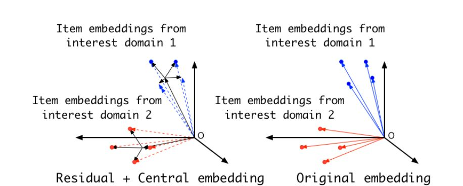
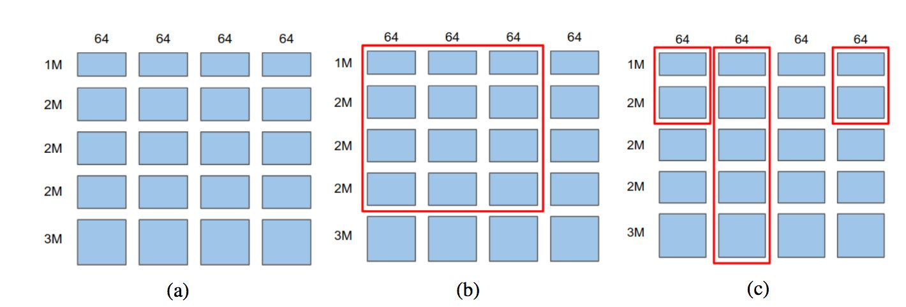

# 推荐系统中稀疏特征Embedding的优化表示方法

推荐或者CTR预估任务有一个很突出的特点：存在海量稀疏特征。海量意味着数量巨大，稀疏意味着即使在很大的训练数据里，大量特征出现频次也非常低，这往往是由于引入了大量ID类特征带来的。对于DNN 排序系统，是否能够找到好的特征Embedding表达方式，对于系统效果是至关重要的。

虽然说，如何更好地表征稀疏特征对于模型的泛化能力至关重要，但是，关于这块的研究，除了经典的特征Onehot到稠密Embedding映射模式外，之前并未太受到重视，最近一年开始逐步涌现出一些相关工作。对于序列行为中的Item Embedding，拥有怎样性质的Embedding表达方式是较好的？对于非行为序列的推荐模型，关于特征Embedding，大家常规采用的做法是：将特征的Embedding Size作为超参，通过手工测试来寻找好的Embedding大小。然而，是否否有更好的方式？这些都是悬而未决的问题。

本文介绍两个与稀疏特征Embedding相关的很好的工作，一篇来自于阿里妈妈发表于DLP-KDD2019的论文，回答了第一个问题（DLP-KDD2020 研讨会集中探讨大规模稀疏条件下可落地的推荐广告等技术方案，目前正在征集稿件过程中，欢迎赐稿。对，这里是广告，如果太精简，看广告不过瘾的话，文末还有）；另外一篇来自于谷歌，尝试解决第二个问题。

**用户行为序列中的Item Embedding**

用户行为是推荐系统中很有价值的可利用信息，一般我们可以以用户实施过行为的一系列物品，作为某个用户兴趣的表征，通常采用遵循时间序的Item ID队列作为行为序列的输入。由于工业界应用中物品数量巨大，所以大多数Item是稀疏的。而我们关心的一个问题是：对于用户行为序列中的Item ID来说，拥有什么性质的Embedding表达方式是好的？Res-embedding for Deep Learning Based Click-Through Rate Prediction Modeling回答了这个问题。

Res-embedding首先在理论上证明了：神经网络CTR模型的泛化误差，与Item 在Embedding空间的分布密切相关，如果用户相近兴趣的各Item，在Embedding空间中的envelope 半径越小，也就是说，相同兴趣Item之间在embedding空间中越紧致，形成的簇半径越小，则模型泛化误差越小，也就是模型的泛化能力越好。这个结论是很有意义的。因为可以用这一结论，在训练过程中约束Item Embedding，让其满足一定条件，以此来增加模型能力。在此结论基础上，Res-embedding提出了一个较为通用的方法：对于相近用户兴趣的Item Embedding，我们让它由两部分叠加构成，一个是属于这个兴趣内的所有Item共享的兴趣中心Central Embedding，另外一个是Item自身的一个残差Residual Embedding:

Item Embedding=Central Embedding + Residual embedding

因为Central Embedding大家共享，是相同的，那么只要约束残差Residual Embedding的数值变动范围能在一个较小的范围内，自然就能保证达成上述目标，以此来泛化模型性能。下图比较形象地展示了这一做法：

由图中可看出，如果采取这种约束方式，与不做约束相比，可以保证相近兴趣Item Embedding形成的类簇具备较小的半径，由此增加模型泛化性能。

但是，我们是无法事先获知某个Item隶属于哪个用户兴趣的，如何获得Item与簇中心Central Embedding的隶属关系呢？Res-embedding提出在用户共访Item图上的三种具体方法，包括一种GNN的方法，这里不展开讲了，感兴趣的同学可以参考原文。

**非行为序列类推荐任务中的特征Embedding**

对于CTR任务来说，存在海量稀疏特征，导致DNN 排序模型中绝大多数参数是由特征Embedding构成的。那么，如何更有效得优化特征Embedding表达对于模型能力就至关重要。

我们先设想一个比较完美的特征Embedding分配方案，如果它存在，应该是这个样子的：对于高频出现的特征，能够分配给它较长的Embedding大小，使其能更充分地编码和表达信息；而对于低频的特征，则希望分配较短的Embedding，因为对于低频特征，它在训练数据中出现次数少，如果分配了较长的Embedding更容易出现过拟合现象，影响模型泛化性能。而对于那些极低频的特征，基本学不了什么知识，反而会带来各种噪音，那么我们可以不分配或者让它们共享一个公有Embedding即可。

上面说的设想，只是一个期望，那么具体怎么做才能达到这点呢？谷歌在Neural Input Search for Large Scale Recommendation Models（NIS）文中提出用强化学习来实施这一目标。具体而言，不同的Embedding分配方案，形成了搜索空间，它使用ENAS来在搜索空间中找到最佳的Embedding分配方案。细节不表，只说思路，下图展示的例子基本能够说明问题：

常规的特征Embedding，一般是给所有特征一个固定大小的Embedding Size，而为了能够更灵活地表达不同的Embedding分配方案，NIS把特征Embedding二维空间切割成Block，如图中(a)所示，纵坐标是特征维度，比如共有10 Million个特征，则划成1M/2M/2M/2M/3M几段，而横坐标则是Embedding Size维度，最长允许256 bit，按照64 bit为单位，划分成4段。这样就形成了Embedding的二维Block结构，不同的Block组成，就构成了不同的Embedding分配方案。

常规的Embedding方案，一般Embedding Size是个超参，需要手工去尝试，而NIS也可以提供最佳Embedding Size的搜索，就是图中(b)所示，从左上角作为起点，划出各种红色矩形框，不同大小的矩形框就是不同的分配方案。纵坐标里红框外的特征共享同一个Embedding，等价于没有给它分配，而分配了Embedding的所有特征，Embedding Size是相同大小的。所以对于这种情况，ENAS的决策点在于：哪些特征值得分配空间，以及最优的Embedding Size应该是多大。

尽管这样能够代替手工试探Embedding Size，但是仍未能达成完美Embedding分配方案的需求，我们还希望高频有效特征，能够分配更长的Embedding Size，而信息含量比较少的特征，则只分配较少Embedding Size甚至不分配。在这个Block框架下，如何达成这一点呢，参考图中(c)图，我们只需要在b的基础上，在列也就是Embedding Size维度，进行多步决策即可，首先对于第一列64 Bit，划出一个矩形框，代表1M+2M的那些特征，分配了64bit的Embedding空间，每一列依次这样做决策，即可实现不同特征分配不同长度的目的。比如图中所示，进行了4步决策后，1M+2M的特征，分配了64*3个bit的Embedding Size，而剩余的特征，则分配了64bit的Embedding Size。如此这般，即可实现我们希望达成的目标。

我们可以分析下，图中(c)方案的决策或者搜索空间有多大，很明显每一步有5种选择，有4个决策步骤，所以决策空间大小为5的4次方，就是说有这么多种分配方案，而ENAS通过某个分配方案在验证集数据下的AUC评价指标表现，以及方案耗费Embedding空间大小，来评估每个决策方案的优劣程度。我们肯定是鼓励验证集合指标表现好，耗费空间少的方案，而强化学习的Reward就是这个思路来设计的。通过这种模式，即可设计强化学习方案来寻找出最优的Embedding方案。而试验结果也说明了通过这种方式可以较明显地提升推荐模型的泛化能力。当然，应该有其它的具体实现方案，而很明显，如何实现上文所述的完美分配方案，是很值得探索的方向。

上面介绍了两种稀疏特征Embedding的优化思路，两者其实也是可以结合的。而探寻更好的稀疏表达方式，我相信对于DNN推荐系统来说至关重要，是值得花精力深入探索的。