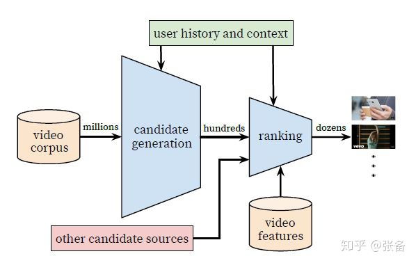
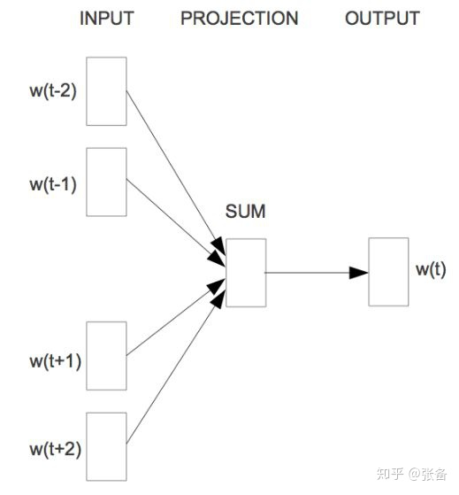
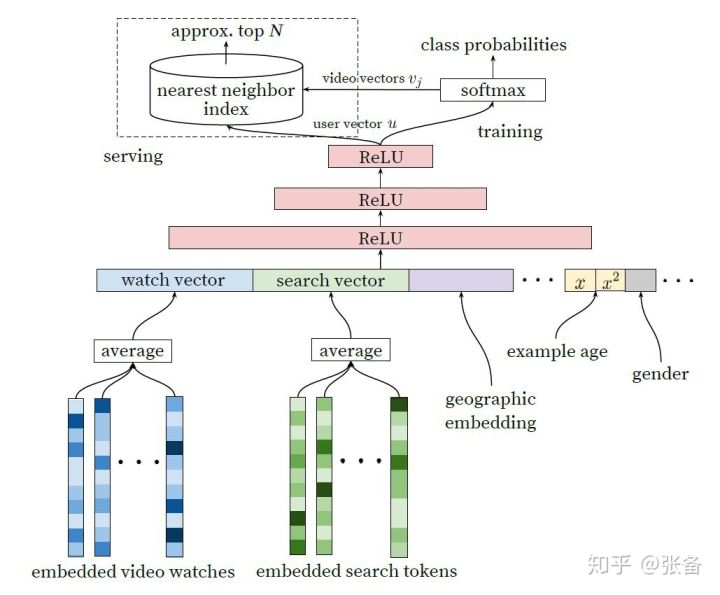
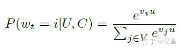
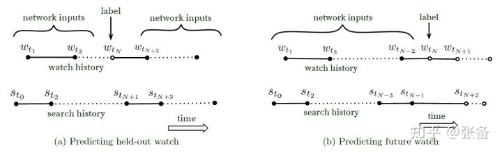
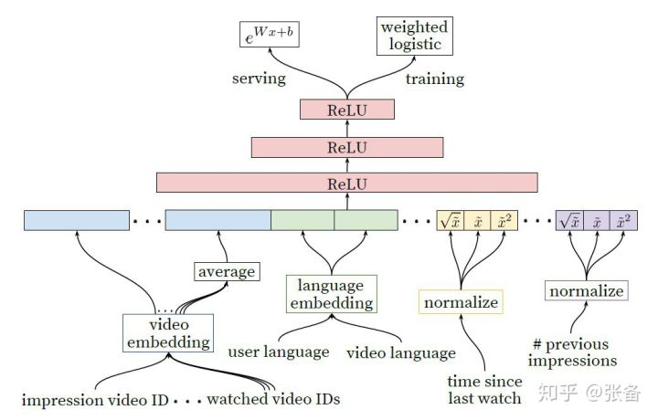

# 解读Youtube推荐算法

随着深度学习的火热，越来越多的问题都开始尝试采用深度学习算法来解决，包括推荐算法。16年的时候，谷歌公开了Youtube的推荐算法，Deep Neural Networks for YouTube Recommendation([https://static.googleusercontent.com/media/research.google.com/zh-CN//pubs/archive/45530.pdf](https://link.zhihu.com/?target=https%3A//static.googleusercontent.com/media/research.google.com/zh-CN//pubs/archive/45530.pdf))，采用了深度学习算法，在效果上超越了最常用的矩阵分解算法。这篇文章介绍了Youtube的推荐算法架构，还有视频场景的一些经验，以及算法上的技巧。虽然这篇文章距今已经过去两年多，但是其中的一些经验和技巧，仍然值得借鉴。本文接下来会分三部分进行介绍，首先是做一个总体的介绍，第二部分介绍召回算法，第三部分介绍排序算法。

一，概括

相对于一般的场景，Youtube的推荐存在三大困难，一是数据规模庞大，用户量大，视频也多，一些在小数据集上效果不错的算法在Youtube上效果一般；二是不断有大量新视频上传，需要解决视频的冷启动问题；三是数据有噪声，用户的行为非常稀疏且只有隐反馈，视频的描述信息混乱且不规范，因此需要算法对于噪声数据有较强的鲁棒性。第一点正好满足深度学习吃数据的特点，第二点文中提出了针对性的解决办法。

整个推荐架构分为两部分，召回和排序，如图1所示。第一个蓝色的漏斗就是召回算法，从百万级数量的视频物料库中筛选出几百个视频。除了这里采用的深度学习召回算法，还可以加入其他的召回视频源，如图中的红色方格，一起送给排序算法。因为计算量大，所以召回算法不可能也没必要采用所有特征，因此召回算法只采用了用户行为和场景特征。排序算法使用了更多的特征，给每个候选视频计算一个分数，并且按照分数从高到低排序，从几百个视频里边再筛选和排序出几十个视频推荐给用户。在对算法进行评估时同时采用了离线指标和在线AB test，并且以AB test作为主要的评估指标。

图1

二，召回算法

在讲召回算法之前，先岔开话题讲一下word2vec。在做NLP任务时，如何将文本或者文本中的一字一句，表示成结构化的，计算机能够理解的形式是第一步。经常采用方法的就是word2vec，就是将所有的word表示成低维稠密的向量embedding。有一种无监督训练方法叫CBOW(连续词袋模型)，如图2所示。对词袋中每个词都初始化一个随机向量，对于每一个句子，设置一个固定长度窗口在句子上滑动，抠掉窗口中间的词w(t)，通过句子中前面和后面的词来预测或者分类w(t)，网络输出端是一个所有词的分类器，通过训练得到每个词的embedding，这样得到的词向量就携带了词的语义信息。

图2

Youtube的召回算法也采用了类似的思路。将预测问题转化为一个softmax分类问题，通过用户的浏览记录和场景信息，判断下一个要看的是视频库中哪一个视频，通过训练使每个视频都得到了一个向量表示。具体的召回算法架构如图3所示。输入特征包括用户的历史观看记录，历史搜索记录，人口学特征等，将这些特征连接起来作为输入。历史观看记录是一个视频序列，其中每个视频都用一个向量v表示，将视频序列的向量求平均作为历史观看记录的输入。网络的最后一层输出作为一个用户表示向量u，用来表示用户的偏好和场景信息。将u和所有的候选视频向量v做点积，输入给softmax做分类，如图4中公式所示。向量u和v的维度都是256。

图3

图4

我们来介绍下模型的输入特征。首先是观看列表，包含最近的50条观看视频。然后是搜索记录，同样也是50条最近的搜索记录，采用和历史观看记录同样的处理方法。将用户的搜索记录处理为unigram（就是一个word）或者bigram（两个相邻的word）的元素，构成词袋。对词袋也采用embedding向量表示，对序列的embedding求平均表示搜索记录的输入。还加入了人口学特征，包括用户的地理位置和设备型号，都采用embedding的方式表示；性别和登录状态用0和1二值表示；对于连续特征，年龄归一化到[0,1]；这些特征有利于对新用户的冷启动。

除了上面这些特征，还有一个特征——example age，应该是表示视频上传时间。youtube每秒会上传大量新视频，而且用户通常更喜欢新视频，但是推荐算法往往会推荐老视频，因为算法的输入都是些历史记录。加入这个特征，能够让模型知道视频的上传时间，从而能够模拟视频发布之后的时间热度。

召回算法已经描述完了，看起来很简单，但是其中有大量的经验和技巧，下面一条一条进行介绍。

1）正样本的选择。虽然youtube中有显示反馈，比如点赞，调查问卷之类的，但是显示反馈的数据量太少。因此在训练数据中只采用隐式反馈，完整地看完一个视频作为一个正样本。

2）负样本的选择。召回算法需要从百万级的视频库中进行筛选，如果每次都做一个百万类别的分类，计算量非常庞大，因此每次只采样几千个负样本，并通过设置权重来进行修正。这样每次分类的类别数就只有几千。

3）训练样本不仅来自于youtube，站外的观看记录也会加入训练。

4）对于每个用户都生成同样数量的训练样本，避免一些观看记录过多的用户对模型产生更大的影响。

5）如果用户刚刚根据某个关键词搜索完视频，接着就去推送相关的视频，用户可能并不感兴趣，因此需要打乱搜索记录序列。

6）一些协同过滤算法在训练时预测某一次行为，既用到了之前的行为，也用到了之后的行为，如图5(a)所示，空心圆点表示待预测视频，实心圆点表示这条记录之前和之后的观看记录和搜索记录，就像图2中word2vec的训练一样。但是对于短视频或者新闻来说，用户的兴趣可能会发生变化，比如刚开始看的时候，可能会广泛涉猎，随后会慢慢聚焦到某一些主题上去。图5(a)的训练方法泄露了用户未来的信息。通过试验证明，只利用待预测行为之前的历史记录做训练效果更好，如图5(b)所示。

图5

上面描述的是召回算法的训练，为了满足时延要求，在进行实际的召回计算时采用的是另外一种做法，如图3中左上角虚线框所示，对于每个用户向量u，对视频库中的所有视频根据向量v做最近邻算法，得到top-N的视频作为召回结果。

三，排序算法

在图1中可以看到，除了上一章节描述的召回算法，还有其他召回来源，不同的来源无法直接比较，排序算法可以对所有召回视频单独计算分数，并且按照分数高低排序推荐给用户。对于每个用户，排序阶段只需要计算几百个视频，相对于召回算法，视频数量大幅减少，因此除了之前召回算法用到的特征，可以采用更多的特征，做更精细化的处理。排序算法仍然采用DNN架构，如图6所示。

图6

最左边的特征是待曝光的视频，右边是其他的输入特征，排序算法采用了几百个特征。作者发现最有用的特征还是用户的历史行为，比如，待预测的视频来自于哪个主题，用户在这个主题上看了多少视频，用户上一次看这个主题是什么时候。召回算法的输出也可以作为特征，比如，视频来自哪个召回源，召回算法计算的分数是多少。

所有特征分为类别特征和连续特征。类别特征都采用embedding向量表示。对视频生成一个词袋vocabulary，按照点击率对视频从高到底排序，取top-N的视频进入词袋，避免过于庞大的视频规模。对于搜索记录采用同样的处理方法。另外，不在词袋中的值都用0向量表示。在设计embedding维度时，维度大小与词袋中元素数量的对数成比例。

对于连续特征，需要进行规范化normalization。根据连续特征的分布，采用直方图均衡化的方式，将特征值映射到[0,1]，使得映射值在[0,1]均匀分布。直方图均衡化在图像上早有应用，映射之后让像素点的值均匀分布在[0,255]之间，我之前有篇博客介绍过直方图均衡化算法，可以参看一下（[https://blog.csdn.net/Zhangbei_/article/details/47680411](https://link.zhihu.com/?target=https%3A//blog.csdn.net/Zhangbei_/article/details/47680411%EF%BC%89%E3%80%82%E5%AF%B9%E4%BA%8E%E8%A7%84%E8%8C%83%E5%8C%96%E5%90%8E%E7%9A%84%E7%89%B9%E5%BE%81x%EF%BC%8C%E5%90%8C%E6%97%B6%E5%8A%A0%E4%B8%8Ax%E7%9A%84%E4%BA%8C%E6%AC%A1%E9%A1%B9%E5%92%8C%E5%BC%80%E6%96%B9%E9%A1%B9%E4%BD%9C%E4%B8%BA%E8%BE%93%E5%85%A5%EF%BC%8C%E5%A6%82%E5%9B%BE6%E6%89%80%E7%A4%BA%EF%BC%8C%E4%BB%A5%E5%A2%9E%E5%BC%BA%E7%89%B9%E5%BE%81%E5%92%8C%E7%AE%97%E6%B3%95%E6%A8%A1%E5%9E%8B%E7%9A%84%E8%A1%A8%E8%BE%BE%E8%83%BD%E5%8A%9B%E3%80%82))。对于规范化后的特征x，同时加上x的二次项和开方项作为输入，如图6所示，以增强特征和算法模型的表达能力。

最后再介绍一下算法的目标函数。如果以点击率作为目标，可能会存在标题党，或者用户被封面图吸引，但是点开之后用户并不感兴趣。而观看时长能够真实地捕获用户的兴趣，因此youtube的预测期目标是观看时长。具体如何操作？训练集中包含正样本和负样本，正样本是用户点击并且观看的视频，负样本是曝光之后没有点击的视频。训练时采用交叉熵loss，并且对正负样本的loss设置不同的权重，负样本设置单位权重，正样本用观看时长作为权重，如图6中输出端training支线的weighted logistic。在预测时，用指数函数作为激活函数计算期望观看时长，如图6中的serving支线。

到此就介绍完了，如有疑问，欢迎探讨，如果文中有纰漏，也欢迎指教。