# 深入解读Airbnb推荐算法

18年Airbnb——爱彼迎公布了他们的房源推荐算法，并且成为2018年kdd最佳论文，论文标题 Real-time Personalization using Embeddings for Search Ranking at Airbnb（[https://www.kdd.org/kdd2018/accepted-papers/view/real-time-personalization-using-embeddings-for-search-ranking-at-airbnb](https://link.zhihu.com/?target=https%3A//www.kdd.org/kdd2018/accepted-papers/view/real-time-personalization-using-embeddings-for-search-ranking-at-airbnb)）。论文详细描述了Airbnb的推荐算法的细节，针对他们的场景下，对已有的算法做了专门的优化。原文描述的非常详细，本文按照我的理解，分成3个部分对原文中核心的内容进行介绍。

## **一，房源embedding**

基本思路还是借鉴了word2vec中的skip-gram算法，将每个房源都用一个向量embedding来表示，但是做了一些细节上的修改。简单介绍一下skip-gram，对于语料库中的句子，设置一个窗口在每一个句子上滑动，用窗口中央的word，去预测滑动窗口内其他的word，通过这种方式，来训练出所有word的embedding。房源embedding的训练采用了类似的方式，把每个用户连续点击过的房源视作一个句子，每个房源当做word，训练出房源的embedding。

先来描述下训练集的构建，对每个登录用户，将所有点击过的房源当做一个点击会话click session，并且按照时间先后做排序。如果两次点击之间超过30分钟，则将会话进行分割，分割成若干条会话。去掉会话中的误点击和时间比较短的点击，具体操作是过滤掉查看时长在30秒之内的房源记录。最后只保留房源数量大于等于2的会话记录，构成会话训练集S。所有的会话记录会分为两类，一类是以预订房源作为终止的，叫做预订会话（booked session）；另一类不包含房源预订的，叫做查看会话（exploratory sessions）。后文会有介绍，针对两种类型的会话，训练目标会有不同。按照文章的描述，训练集大概会有8亿条点击会话。

房源embedding的训练如图1所示，最上面一行橙色方块是某个用户连续点击过的房源记录，包含了11条点击房源记录。滑动窗口大小是m，通过中间的房源，预测左右两侧的m个房源。除了点击房源，最右侧还有一个预订房源，如上文所述，只有在预订会话中才包含预订房源。

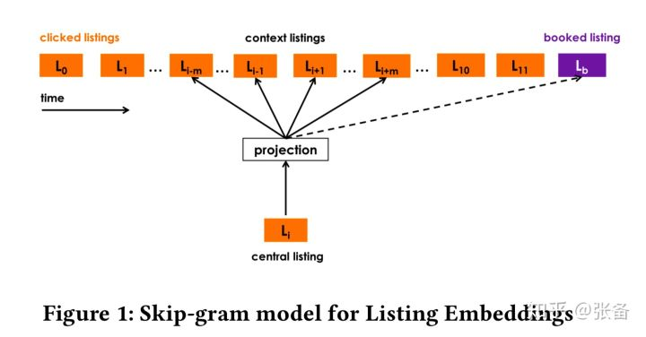图1

图2是房源embedding训练的目标函数，要求最大化目标函数。里边包含4项，我们一项一项来进行介绍。其中， ![[公式]](imgs/equation-20201105115257471) 表示当前房源l的embedding， ![[公式]](imgs/equation-20201105115257539) 表示周围的房源c的embedding，不带'表示输入embedding，带'表示输出embedding。第1项是对正样本集合的目标函数， ![[公式]](imgs/equation-20201105115257518) 表示正样本，l和c都是用户点击过的房源。第2项是负样本集合的目标函数，为了减少计算量，避免对所有房源都进行计算，负样本 ![[公式]](imgs/equation-20201105115257544) 通过对所有房源进行随机采样得到。第3项就是图1中的预订房源 ![[公式]](imgs/equation-20201105115257528) 的目标函数，这个目标函数是全局的，表示说无论窗口在该会话中怎么滑动，这个目标函数始终存在。这样设计的原因是点击会话中的所有房源，可能都跟这个最终预订房源相关。上文中我们说过训练数据有两类，分别是预订会话和查看会话，预订会话包含预订房源，采用图2的公式计算；查看会话不包含预订房源，因此在训练时，没有第3项。最后介绍第4项。当用户确定旅行目的地之后，搜索或浏览的房源都在目的地附近，因此正样本 ![[公式]](https://www.zhihu.com/equation?tex=D_p) 中的房源大部分都在同一个地点或城市，而负样本 ![[公式]](https://www.zhihu.com/equation?tex=D_n) 是从所有房源中随机采样得到的，大概率会来自其他不同的地方。这样的正负样本，无法很好地对同一个地方的房源进行区分，因此又增加了一个负样本集合 ![[公式]](imgs/equation-20201105115257582) ，是从当前房源l所在的地方随机抽样得到。

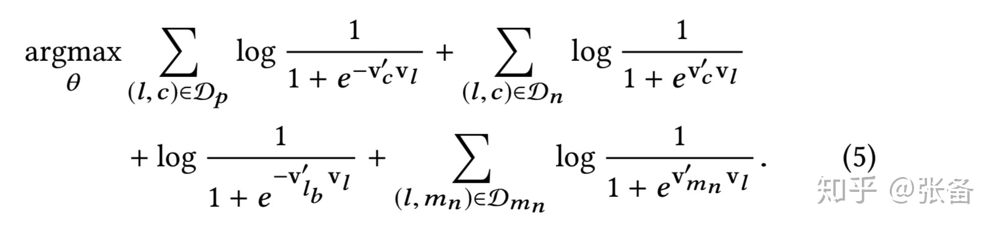图2

Airbnb的工程师对450万个房源学习出embedding，因为Airbnb在推荐时采用的是在线实时计算，所以embedding的维度大小设置在试验效果和服务器内存之间做了折中，最终设置为32。可以看到，相比以往在NLP任务上词向量动辄几百上千的维度大小，这个维度可以说是非常小了。训练数据采用的是滑动时间窗口的方式生成，时间跨度为几个月，采用最近几个月的数据，不断加入新数据，丢掉旧数据，每天都对所有数据进行一次全量的离线训练，作者称效果要好于增量训练。所以每天的房源embedding都会变化，但是并不影响使用，因为最终使用的是向量之间的余弦相似度，而不是向量本身。

作者对学习到的embedding从多个维度进行了评估。首先查看embedding是否编码了地理位置信息，对embeddings做k-means聚类，并且对聚类结果标记颜色，查看聚类效果和地理位置是否一致。如图3所示，展示了美国California的房源聚类效果，可以看到地理位置接近的房源都被聚类到了一起。另外，通过实验确认，同一房源类型（包括整个房源，独立房间，合住房间3类）的平均相似度要高于不同房源类型的相似度，同一价格区间的平均相似度高于不同价格区间。有一些特征是难以量化的，比如建筑风格，作者通过可视化的方式进行查看，如图4所示，左侧是一个树屋，右侧是搜索到最相似的k个房源，同样也是树屋。作者查看了树屋，船屋，海景房等，都能够找到建筑风格相似的房源。

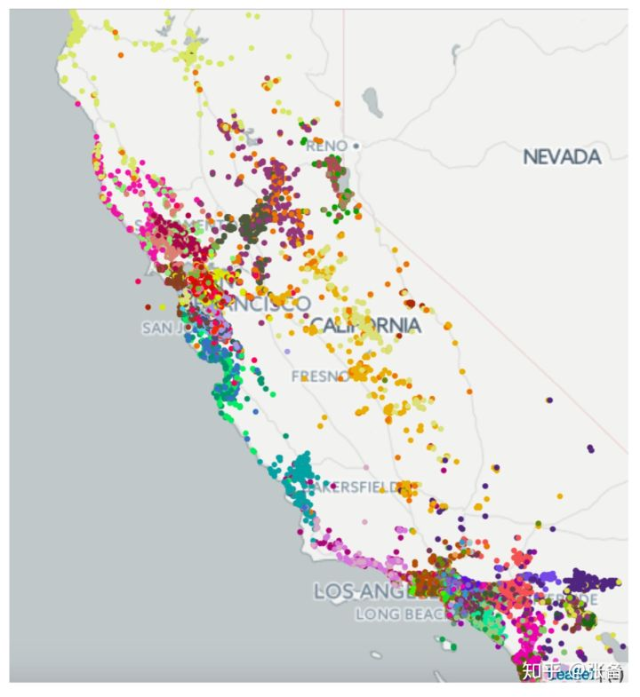图3

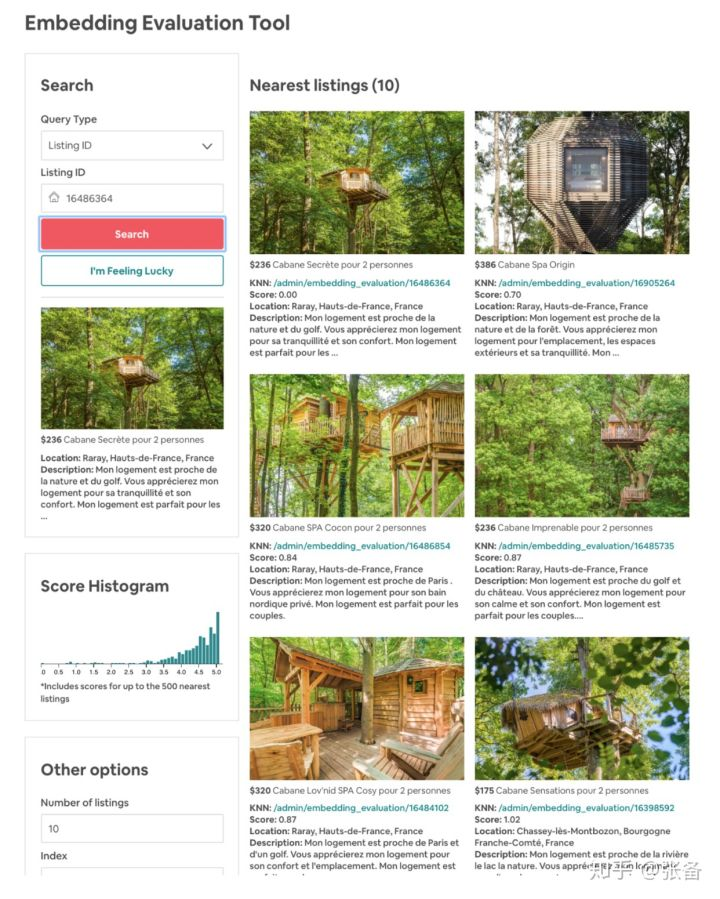图4

最后再介绍一下embedding的用途，有3个用途。一个是用于搜索排序，如何使用会在第三部分详细描述，这里暂时略过。第二个是用于相似房源的推荐，根据embedding计算出其他房源与当前房源的余弦相似度，取最接近的房源推荐给用户，如图5所示。最后一个用途就是用于新房源的冷启动。房主上传新房源时需要上传3个特征，位置，价格，房源类型（包括整个房源，独立房间，合住房间3个类别）。在和新上传房源具有相同类型和相同价格区间的房源中，找到3个地理位置最接近的房源，用这3个房源的embedding求平均作为新房源的embedding。

图5

## **二，房源类型和用户类型的embedding**

当老用户想要再次预订房源的时候，可以利用该用户之前的预订行为，给他推荐相似类型的房源。有一个问题是，老用户的多次预订可能是在不同的地方或者城市。但是上面学习到的房源的embedding，很难去比较不同地方的房源的相似性。跨地区的房源相似性，还是需要通过一个用户的多次预订来学习。因此可以构建预订会话的训练集来学习embedding。但是直接采用这个思路训练存在几个问题，1）预订行为相比点击行为要稀疏很多，训练数据集太少；2）很多用户只有一次预订记录，无法构成训练会话；3）每个房源需要出现5到10次，才足以学习到一个好的embedding，但是很多房源的预订次数不足5到10次。为了解决这些问题，作者提出了一个新的思路，不再对单独的每一个房源学习embedding，而是根据特征对房源进行归类，对每个房源类型学习到embedding。类似地，对用户做归类，学习用户类型的embedding。

先介绍如何对房源进行归类。房源的特征如图6所示，每个特征都按照类别或者区间划分成不同的buckets，如第一行中的1，2，3，...。某个房源满足以下特征，在美国，整个房源，平均每晚价格60.8美元，平均单人次每晚价格29.3美元，5次浏览，全部5星评价，容纳2人，1张床，1个卧室，1个浴室，100%的接受率，对应的bucket在图6中用绿色标出。则房源类型为US_lt1_pn3_pg3_r3_5s4_c2_b1_bd2_bt2_nu3，字母对应相应特征的单词首字母缩写，数字对应相应的bucket。这是一个多对一的映射，即多个房源会被映射到同一个房源类型。这样就解决了单个房源预订次数太少的问题。需要注意的是，随着预订次数增加，房源的某些特征可能发生变化，导致房源类型也可能会发生改变。

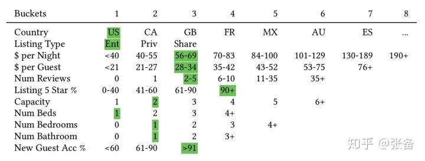图6

生成用户类型方法和房源类型是一致的，用户的特征如图7所示，每个特征都按照类别或区间划分成不同的buckets。这里同样是多对一的映射，可能会将多个用户映射到同一个用户类型。随着用户消费行为的改变，同一个用户也可能有多个不同的用户类型。

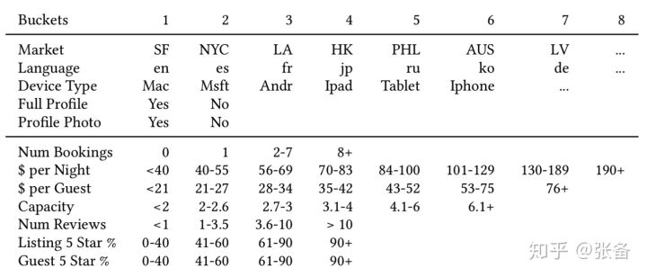

在同一向量空间中训练房源类型和用户类型的embedding。用户的每次预订，都构成一个元组(user_type, listing_type)，包含用户类型和房源类型。将每个用户的所有预订的元组，按照时间顺序排列生成预订会话session，用户类型和房源类型交替排列，然后按照skip-gram的方式进行训练，如图8所示。

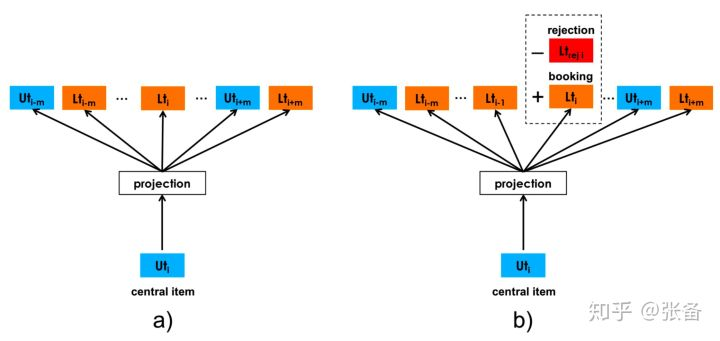

目标函数如图9中的公式所示，上一个公式表示当前输入是用户类型，下一个公式表示当前输入是房源类型。目标函数包含3项，第1项表示正样本集合的目标函数， ![[公式]](imgs/equation-20201105115257594) 表示正样本集合，即用户预订过的房源类型，或者该用户的其他用户类型。第2项表示负样本的目标函数， ![[公式]](imgs/equation-20201105115257708) 是随机抽取的用户类型或者房源类型。最后介绍第3项。点击行为仅仅反应了用户的偏好，但是预订不仅反应用户的偏好，还反应了房东的偏好。因为在Airbnb的场景下，房东可以接受用户对房源的预订，也可以拒绝预订。可以利用房东的拒绝行为，在向量空间中编码房东的偏好，在推荐中增加预订几率的同时，减少拒绝的发生。在第3项中， ![[公式]](imgs/equation-20201105115257610) 表示用户被拒绝的元组(user_type, listing_type)的集合。

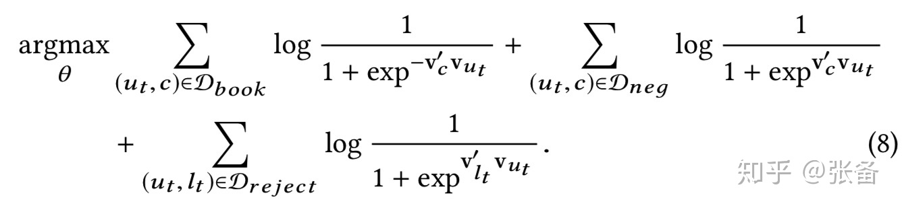

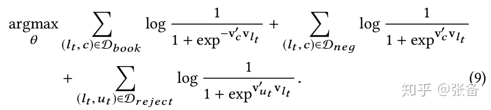图9

关于房源类型和用户类型的训练，训练集中有50万个用户类型和50万个房源类型，有5千万个会话，embedding维度大小设置为32，滑动窗口m设置为5。

论文中多次提到，第一部分介绍的房源embedding，主要描述用户的短期兴趣或行为，而这部分介绍的房源类型和用户类型embedding，主要用于捕获用户的长期兴趣。

讲完了房源类型和用户类型，到底如何利用房源类型和用户类型的embedding？作者介绍，Airbnb上99%的预订都来自于搜索排序和相似房源推荐这两个渠道，而房源类型和用户类型的embedding主要就用于搜索排序算法。在上一部分介绍的单个房源的embedding，既用于相似房源的推荐，也用在了搜索排序算法。第三部分会重点介绍搜索排序算法。

## **三，房源搜索排序**

作者将房源搜索排序问题当做一个回归问题来解决，去拟合标签。标签包括{0, 0.01, 0.25, 1, -0.4}，0表示房源有曝光但是没点击，0.01表示用户点击了房源，0.25表示用户联系了房东但是并没有预订，1表示房源预订成功，-0.4表示房东拒绝了用户的预订。采用的是GBDT（Gradient Boosting Decision Trees）算法。输入特征包括房源特征，用户特征，搜索特征，和交叉特征几个类别，总共104个特征。房源特征包括价格，房源类型，房间数目，拒绝率等。用户特征包括用户的平均预订价格等。查询特征包括入住人数，租住天数等。交叉特征是多个特征的组合，包括搜索位置和房源位置的距离，入住人数和房源容纳人数的差异，房源价格和用户历史预订的平均价格的差异等。模型训练完成后以在线的方式运行，用户搜索之后，对候选房源打分，并按照分数降序排列展示给用户。

介绍一下上文中生成的embedding是如何应用到房源搜索排序算法中的。将用户最近两周有行为的房源做个分类，一共包括6个类别，1）用户击过的房源，用 ![[公式]](imgs/equation-20201105115257612) 表示；2）用户点击并且停留时长超过60秒的房源，表示长点击房源，用 ![[公式]](imgs/equation-20201105115257614) 表示；3）曝光却没有点击的房源，用 ![[公式]](imgs/equation-20201105115257645) 表示；4）用户加入收藏的房源，用 ![[公式]](imgs/equation-20201105115257659) 表示；5）用户联系过房东但是却未预订的房源，用 ![[公式]](imgs/equation-20201105115257675) 表示；6）用户在过去两周内预定过的房源，用 ![[公式]](imgs/equation-20201105115257683) 表示。将候选房源与上述6个类别的房源计算相似度，作为特征加入到搜索排序模型中，如图10的前6个特征，EmbClickSim, EmbSkipSim等。这些数据都是用的用户最近两周的行为，表示用户的短期兴趣。

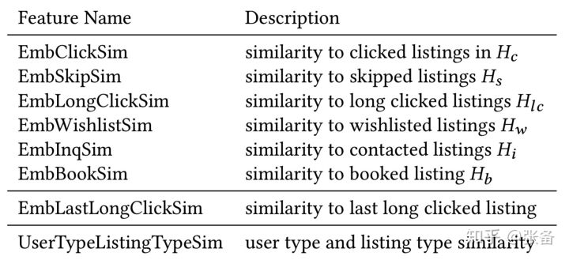图10

具体如何计算，我们以 ![[公式]](imgs/equation-20201105115257612) 为例进行介绍，其他5个类别的计算方法相同。对于每个类别，根据城市再一次进行划分，比如![[公式]](https://www.zhihu.com/equation?tex=H_c)中的房源来自于New York和Los Angeles两个城市，将![[公式]](https://www.zhihu.com/equation?tex=H_c)划分为![[公式]](imgs/equation-20201105115257752)和![[公式]](imgs/equation-20201105115257760)。将 ![[公式]](https://www.zhihu.com/equation?tex=H_c%28NY%29) 中所有房源的embedding求平均，作为centroid embedding，然后计算当前候选房源与centroid embedding的余弦相似度。类似的，计算候选房源与 ![[公式]](https://www.zhihu.com/equation?tex=H_c%28LA%29) 的centroid embedding的余弦相似度。最后，取两个相似度的最大值作为EmbClickSim。如果 ![[公式]](https://www.zhihu.com/equation?tex=H_c) 中的房源来自于两个以上城市，也是相同的计算方法。

图10中的第7个特征是EmbLastLongSim，计算候选房源与最后一次长点击房源的余弦相似度。图10中最下一行特征是UserTypeListingTypeSim，一个用户可能会有多个用户类型embedding，取当前的用户类型embedding，和候选房源的房源类型embedding计算余弦相似度，结果即为UserTypeListingTypeSim。

在图11中，第2列coverage显示了每个特征的覆盖度，可以看到，UserTypeListingTypeSim, EmbClickSim和EmbSkipSim的覆盖度较高。第3列显示了特征的重要程度，分母表示一共有104个特征，分子表示该特征的重要程度排名。

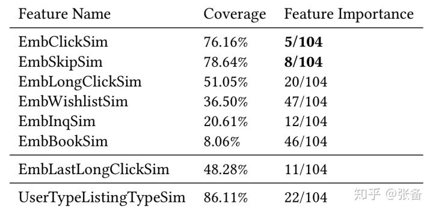

到此，算法就介绍完了。如果文中有什么纰漏，欢迎指正。如有疑问，也欢迎探讨。本文也同时发布到csdn上，欢迎围观，[深入解读Airbnb推荐算法 - Zhangbei_的博客 - CSDN博客](https://link.zhihu.com/?target=https%3A//blog.csdn.net/Zhangbei_/article/details/87821401)。