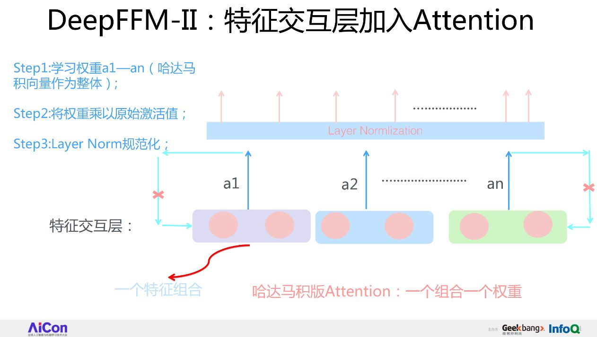

作者：张俊林
链接：https://zhuanlan.zhihu.com/p/67795161
来源：知乎
著作权归作者所有。商业转载请联系作者获得授权，非商业转载请注明出处。

**本文是我18年12月在AICon（全球人工智能与机器学习大会）的讲稿，感谢极客邦的同学，几乎一字不落地把演讲内容转成了文字，我在这个基础上简单修正了一些内容。**/

大家好，先简单自我介绍一下，我叫张俊林，目前在微博机器学习团队负责AI Lab的日常工作，主要是推动一些业界新技术应用到业务里去。

今天我们主要介绍一下，FFM模型和它的深度学习模型版本，以及我们在这个基础上改造的两个模型。这页PPT是我要跟大家分享的一个提纲。

首先，我会给大家介绍一下大规模推荐系统的整个流程框架和其中一些比较核心的技术点。

第二，我们知道，做推荐系统的Rank模型会面临一个选择：是用传统模型还是用目前比较火的深度学习模型。所以我会简单地介绍一下这两大类模型的发展历程，包括它们各自的特点。

第三，传统的线性模型，我们聚焦在FFM模型上。FFM模型有它的优点，也有它的问题，所以针对它的问题，我会介绍一个我们提出的一个改进的版本，我把它叫做“双线性FFM模型”。

另外，我也会大致介绍一下，典型的深度学习模型有哪些，他们各自的特点是什么、使用场景是什么。

最后，我会介绍一下DeepFFM，这可以认为是我们针对FFM做的神经网络版本的进一步改进版本，至于它是怎么做的，效果怎么样，我在后面会重点介绍。

## 大规模推荐系统介绍

首先进入第一部分，大规模推荐系统的介绍。

推荐系统大家实际都非常熟悉了，因为大家现在都用手机App，我觉得只要是上网的话，70%的时间你一定会受到推荐系统的影响，只不过你可能没有意识到它的存在。

举几个典型的例子：网易云音乐的音乐推荐，我个人觉得网易音乐的推荐做得是相当不错的；此外还有豆瓣的电影推荐、阿里商品推荐等等，我这里只列了几个比较典型的例子，主要是大家可能平常比较关注的一些场景。

## 以微博为例：常见推荐系统场景

因为我来自于微博，所以我简单地介绍一下，在微博有哪些场景是应用推荐、CTR以及排序任务的。

典型的有三个场景。你如果刷微博就会看到，第一个就是关系流Feed排序。最早的关注流Feed排序是按时间排序的，但后来因为国外的Facebook、Twitter都陆续上了机器学习的ranking机制，所以说现在微博的关系流实际是加了机器学习排序的。可是时间因素在其中还是起着很关键的作用，这种场景对于机器学习模型虽然有使用，但是有限制，限制就是排序对时间权重的依赖还是比较高。

另外一个是热门流。这个是比较典型的、完全个性化的一个流，因为它给用户的推荐是不需要用户关注的，只要认为通过用户过去的点击行为，判断其可能对什么感兴趣，就会给用户推荐，这是一个完全个性化的信息流。

此外，还有正文页的推荐。用户点开一个微博进去之后，下面会推荐一个用户可能感兴趣的微博，这是一个附属的推荐场景。

这三个场景在微博上是典型的信息流排序，或者是推荐的使用场景。

## 以微博为例：大规模推荐系统架构

我们以微博的推荐系统为例，来简单介绍一下：现在工业级的大规模推荐系统是怎么来做推荐架构和推荐流程的。

尽管我说是以微博为例，但是我可以肯定的说，目前工业界90%的推荐系统就是这个结构，只不过可能在有些具体算法和实施方式上有些区别，但是架子大都是这个架子。

我简单捋一下这个过程。

首先它分为两大部分，最上面那部分是在线推荐部分，底下部分是离线部分。

先说在线部分。我们习惯把微博叫做物料库，实际就是item，物料库的规模会比较大，一般会先过召回模块，为什么要走召回？做过推荐的人都很清楚：要给微博的每一个用户在热门流推出个性化的信息流，假设一天新发的微博条数以亿计算，再加上历史的条数，任何一个人登上微博去刷热门流，都需要算几亿条微博给这一个人。如果不增加召回环节，直接部署排序模型，这个计算量是很巨大的，速度上根本算不过来。

召回的目的很简单，就是把个性化的推荐item数目降下来。召回等于说把用户可能感兴趣的物料进行一些缩减，缩到一定的数量范围里面，但是还要跟用户兴趣相关。如果如果召回Item的数量还是比较多，可以部署一个粗排模块，用简单的排序模型再筛选一下，Item数量就可以再往下减一减，然后进入精排环节。因为到这一步已经经过两轮筛选，对于某个用户来说，剩下的物料已经不多了。所谓精排的意思就是：在此基础上可以加一些复杂模型，精制地给把少量微博根据用户兴趣排一排序，把用户真正感兴趣的内容排到前面去。

 之后还有业务逻辑。比如说要把已读的微博内容过滤掉，需要考虑推荐结果的多样性以及其它各方面的业务逻辑。

我们会捕捉用户行为，举个例子，用户看过哪些微博、反馈过哪些微博、互动过哪些微博，这些行为就被收集起来，对于实时的用户行为，我们一般会部署一个实时的模型，可以实时地更新在线模型，这体现在：召回可以改成实时的模式，包括ranking也可以改造成实时的模式。

所谓实时的意思就是：用户刷了一条微博，或者互动了一条微博，立刻就在刷出下一条微博的时候，体现出用户刚才这个行为了。

当然还会计算离线模型，因为这个模型它的训练数据更充分、更精准。通过这种方式，我们会定期地更新线上的这三个模型，这就是典型的工业界做大规模推荐系统的整体流程。

正如我上面所讲的，这个框架是大多数做推荐的公司的推荐业务基本框架，只不过可能几个关键环节使用的具体技术方法不同而已。

## 线上推荐系统的两个阶段

现在我们来细致地看一下在线部分。

我刚才说了三个过程：召回、粗排、精排，但是最常见的还是两个阶段的，就这张图展示的。

第一阶段，召回，第二阶段，排序。我再重复一下：召回是用来做什么的，它的特点是什么，ranking在干什么，我觉得搞推荐系统，先要把这些事搞明白。

\#### 召回阶段

我刚刚也提到了，首先是因为面临的侯选数据集非常大，而最根本的要求是速度快，因为要求速度快，所以就不能部署太复杂的模型。另外要使用少量的特征，这是召回阶段的特性。召回阶段要掌握一点：怎么快怎么来，但是也要兼顾用户兴趣。简单来说，召回会把大量的物料减到几百上千的量级，然后扔给后面的ranking阶段。

\#### 排序阶段

它和召回阶段的特性完全不一样，ranking阶段只有一点需要记住：模型要够准，这是它的根本。此外，因为这一阶段处理的数据量比较少了，所以就可以部署复杂模型，就可以使用我能想到的任意有用的特征，但归根结底是为了一件事：怎么排得准。

## 排序模型：工业界算法的演进路线

CTR模型、推荐模型发展的历史很久了，举个例子，百度部署广告系统，同时也部署了CTR的预估系统，到目前为止应该有十几到二十年的经验了。那么我们要归纳一下，公司做推荐的话，模型是按照一个什么样的轨迹发展的。下面PPT展示了这个发展过程。

最早的是规则。什么叫规则？这个规则可能和你想的规则不太一样，比如说给用户推荐最热门的内容，这是一种规则，此外还可以添加很多其他的规则。规则的好处是什么？特别简单，如果想通过一个规则去做推荐，三天就能上线，效果也不会特别差，训练速度快，而且还可能不需要有监督地去训练。但是如果后来的规则越来越多的话，问题就出现了，它们会相互冲突，系统的综合效果，很难往上提升，因为对于系统来说，很难有个明确的优化目标，这是问题所在。

在早期的规则推荐之后，业内一般会用LR，也就是逻辑回归。LR之后，一般就是LR加GBDT。所有的CTR模型，它的核心就是有效特征的选择，以及有效的特征组合的发现和利用。所以，怎么有效解决特征组合的问题，是个引领技术发展的纲领，CTR或者排序模型的发展路径就按照这个方向发展。

LR的特性是可以人工做特征组合，但是人工做特征组合有个问题：需要投入相当大的人力才可以做好。那么GBDT相对LR来比的话，有什么好处？GBDT可以**半自动化**地做一些特征组合，于是LR后面大家就用LR+GBDT模型，能够半自动地做特征组合了，不完全依赖人工。

再往后发展就是FM。FM跟LR+GBDT区别又是什么？它可以**全自动化**地做特征组合。那么从特征组合的角度讲，又有什么新的特点呢？很简单，我们用FM的时候，因为一般因为计算量的问题，只做二阶特征组合。那么什么叫二阶特征组合？很好理解，举个例子，比如两个特征，一个特征是性别，假设“性别=女”，另外一个特征是时间，假设“时间=双十一”，这两个特征如果组合到一起，你会发现是一个非常强的指示，是用户会不会买东西的一个特征，这就叫二阶组合特征，因为有两个单特征进行组合。

再往后，也就是现在这个阶段，大家都在讲DNN排序模型。那么DNN相对FM有什么好处？除了一阶和二阶特征外，它可以捕获三阶特征、四阶特征、五阶特征等更高阶的特征组合； FM一般来说很难捕获高阶的特征，DNN典型的特点就是可以捕获更高阶的特征。按照这个路线往后捋，你要把握核心的一点是：特征组合自动化，包括更高阶的特征怎么融合进去，这是CTR模型进化的总体方向。

通过上面这个PPT，我再把后面要讲的内容捋一捋：

- 第一部分我会先介绍下排序模型的发展；

- 第二部分会介绍一下经典的线性排序模型有哪些，特性是什么；

- 第三部分会讲我们针对FFM提出的改进的“双线性FFM”模型；

- 第四部分，我们讲一下ranking模型的发展趋势。目前来说，有两种演化的分支，一个就是以W&D做为起点的演化分支，另外一个以Deep&Cross做为起点的演化分支；

- 第五部分，也是最后一部分，我们对排序模型第一个演化分支也做了一个改进模型。核心思想是，FFM模型怎么做成深度网络版本的，我们给出了一个新的改进版本的神经网络FFM模型。

## 线性排序模型：从LR到FFM模型

我先介绍一下线性模型。大家可能都有些机器学习的基础，这应该是有监督模型中最简单的一个。

所谓线性模型，比如说要做CTR，很好理解，看这个公式：

xi就是某个特征值，意思要给每个特征学习一个对应的权重：wi，最终的模型预测值就是所有的特征值乘以这个权重，加起来求和，这就是最简单的线性模型。

一般我们做LR，会在上面求和基础上，套一个sigmoid函数，也就是上图中黄色的曲线，因为线性模型取值范围已经不可控，可以无限大，所以不好用。通过S形函数把它压到0和1之间，我就可以判断，是正面的结果还是负面的结果，LR就是这样的过程。

那么线性模型有什么优点和缺点呢？首先它简单，所以好理解，上线快，速度快，这是它典型的优点。尽管我们到了深度学习时代了，但事实上，很多公司还在用LR，因为它确实很好用。但它也有问题，我刚才讲了一句话：CTR模型的核心是特征组合，但是你从上图的公式里看不到任何特征组合的迹象：单个特征乘以权重，特征间的关系没有被考虑，这就是LR最大的一个缺点。线性模型有这个问题，它不能够捕获特征组合，所以要改造一下这个公式，把特征组合揉进来。

特征组合要怎么组合？任意两个特征的组合，可以把一个特征组合当作一个新特征，但既然它是新特征，它也要学个权重，下图公式中标红的**wi,j**就是这个特征组合的权重。

这样，我们就能把组合特征显式地、简单的揉进了这个公式，所以它的好处是：现在能够捕获两两特征组合。其实这么做，它也有问题，刚才我们这么改过来的模型本质是SVM，它的问题是特征组合的泛化能力弱，于是我们可以进一步对它进行如下修改。

上面PPT中的公式，前面还是一样，就是LR模型，后面的也是体现了任意两个特征组合，和刚才公式唯一的区别在：**原先的wi,j，换成了vi和vj的点积**。vi和vj又是什么含义呢？vi的意思是：对于xi这个特征来说它会学到一个embedding向量，特征组合权重是通过两个单特征各自的embedding的内积呈现的，因为它内积完就是个数值，可以代表它的权重，这其实就是FM模型。

SVM泛化能力弱，FM的泛化能力强。

在FM之后，我们再改进一个新版本，就是FFM模型。我先定性地说下这个模型：它的效果比FM好，但是问题在于，参数量太大。

首先， FFM模型的特性是什么？

举例来说，有三个特征fields，这是一个在线投广告的应用场景，比如说我要往ESPN这个网站投广告，第一个特征Publisher是要投放广告的网站是谁，第二个特征是这个广告主（Advertisor）是谁，本例中假设是Nike；第三个特征，阅读者（Gender）是谁，阅读者的性别是男性（male）；那么他会不会点击？这个例子中是会点击；那么我们在这个例子上再想，FFM在做什么事？

首先这个公式做了任意两个特征组合，它的特性是要把任意一个特征学成embedding，这就是刚才讲的FM的做法，那么FFM是怎么做的呢？ 

FFM是FM的一个特例，它更细致地刻画了这个特征。首先它做了任意两个特征组合，但是区别在于，怎么刻划这个特征？FM只有一个向量，但FFM现在有两个向量，也就意味着同一个特征，要和不同的fields进行组合的时候，会用不同的embedding去组合，它的参数量更多。对于一个特征来说，原先是一个vector，现在会拓成F个vector，F是特征fields的个数，只要有跟其它特征的任意组合，就有一个vector来代表，这就是FFM的基本思想。

对于FFM的某个特征来说，会构造F个vector，来和任意其他的fields组合的时候，各自用各自的。它有什么特点呢？首先，FFM相对FM来说，参数量扩大了F倍，效果比FM好，但是要真的想把它用到现实场景中是有问题的，而问题同样在于参数量太大。参数量太大导致做起来特别耗内存，特别慢，所以我们的改进目标是把FFM模型的参数量降下来，并且效果又能达到FFM的效果。于是我们改了一个新模型，我把它叫“双线性FFM模型”。

## FFM模型改进版：双线性FFM（Bilinear-FFM）模型

下面我们介绍一下双线性FFM怎么做的，这是18年5月份左右，我们（张俊林&黄通文）在改进FFM的过程中尝试出的一个有效的改进模型。这个图基本就显示原理了：

因为每个特征现在有F个vector来表示它的参数空间，每个特征都需要跟上F个vector，一般CTR任务中的特征数量是非常大的，所以FFM的参数量就异常地大。能不能把跟每个特征走的参数矩阵，抽出它们的共性，所有特征大家一起共享地来用这个参数？如果你一起用的话，就能够共享这个参数矩阵，你就能把参数量降下来，这就是我们讲的双线性FFM的核心思想。vi,vj还是跟FM一样，还是用一个vector来表达，但是把两个特征交互的信息放在共享参数里面去学，这就是双线性FFM的核心思想。

我刚才讲了一个简单的思路，理论上里面还有些变化点，比如这个共享参数矩阵W怎么设计？这是有些学问在里面的。我们可以有三种选择。

类型1，不论有多少个特征，大家都共享同一个W，这是参数量最小的一种形式。W的参数量是K×K，K就是特征embedding的size。

还有什么改进的方法吗？能不能每个fields给一个不同的W呢？应该是可以的，我们在类型2就用到了这个方法，有12个Fields，就有12个W，每个Fields，各自学各自的W。

还可以拓展，就是类型3。我们知道，Fields还可以组合，有12个不同Fields，就有12×12种Fields间的组合，如果每个组合给一个W，这就能更加细化地描述特征组合了。

所以这里可以有有三种不同的W定义。此外还可以有一个变化点，即可以加入Layer Norm，我们试过，加入Layer Norm影响比较大。

我们看一下结果。

暂时不说刚才几个改进模型，先说几个基础模型：LR、FM、FFM。这是我们在Criteo和Avazu两个数据集上做的实验，这两个数据集是工业级，大约在四千到四千五百万的CTR数据。

先说LR和FM，可以从数据里面看出来，FM是显著优于LR的，这两个数据都是这样。首先要确认一点，不要期望太高。你期待提了五个点、十个点，在CTR里，尤其是这两个数据集合，你是见不到这种现象的，在很多大规模数据集合里，AUC能升一个点就是非常显著的一个增加。FFM跟FM比，AUC从0.7923到0.8001，也是显著提升的，这是这三个模型的特性。

上面说过，双线性FFM的共享参数矩阵W有三种类型。这三个类型中哪个效果好？双线性FFM的AUC达到了0.7995，Fields组合效果是最好的，接近于FFM，但稍微低一点。还有个变化点，可以加入Layer Norm，同样加到了那三个模型里面去，最好的效果达到了0.8035，已经超过FFM，而且效果比较显著。

所以我们可以下结论：双线性FFM的推荐效果是可以达到与FFM相当，或者说超过FFM的性能的，而且Layer Norm对这个事情有明显的提升作用。

我们来估算一下，改进的双线性FFM模型，它的参数量跟FFM比是什么情况？如果说我们用Criteo这个4500万的数据集，它有230万个特征，39个Fields，假设embedding size是10，如果用FFM就会有8.97亿的参数量，而用双线性FFM，FM部分是大概2300万的参数，刚才三个改进模型中，类型一100个参数，类型二3900个参数，类型三15万参数，与FFM相比，参数差了38倍，但性能两者是相当的，这就是这个模型的价值所在。

总结一下双线性FFM模型：它的性能接近于FFM，但是参数量是FFM模型的2.6%，这是它的优点所在。

## 深度排序模型：从Wide&Deep到XDeepFM模型

下面我介绍一下深度模型，首先介绍一下它的发展历程。

所有的深度学习，做CTR的模型时都会有DNN的部分，没有例外。什么含义呢？特征输进去，然后把它转换成embedding，上面套两个隐层进行预测，这是所有模型公有的一部分。

我把现在这个深度CTR模型会分成了两大类。从结构来说，第一类我把它叫并行结构，它有DNN结构外的另外一个组件，我管它叫FM Function，它捕捉特征的两两组合，两者关系看上去是个并行的，所以我把它叫并行结构。

除了并行还能怎么修改这个结构？可以把它搞成串行的，前面一样是onehot到embedding特征编码，然后用FM Function做二阶特征组合，上面套两个隐层做多阶特征捕获，这是串行结构。典型的模型包括：PNN、NFM、AFM都属于这种结构。

如果再归纳一下，你会发现深度排序模型，现在有朝两个研究路线走的趋势。这两条演进路线怎么走的呢？

第一条路线，提出新型的FM Function，就是怎么能够设计一个新的FM Function结构，来更有效地捕获二阶特征组合，比如说典型的模型包括Wide&Deep，DeepFM，NeuralFFM等，就是用来做这个的。

第二条演进路线，就是显式地对二阶、三阶、四阶···K阶组合进行建模。目前的研究结论是这样的：对CTR捕获二、三、四阶都有正向收益，再捕获五阶以上就没什么用了。典型的代表模型是DeepCross、xDeepFM。

针对这两条演进路线，我会各自介绍两到三个代表系统。

第一个代表系统：Wide&Deep，这个系统我相信大家都听说过。

Wide&Deep的结构是什么呢？实际上就是我画的并行结构，右边就是DNN部分，左边的FM Function用的是线性回归。我个人认为，Wide&Deep是相对原始的模型，LR有的问题它也有，特征组合需要人去设计，Wide&Deep也有这样的问题。

我们可以改进一下。DeepFM模型，它相对Wide&Deep做出了什么改进呢？很简单，其实就是把FM Function的LR换成了FM，就能自动做特征组合了，这就是DeepFM。如果想部署深度模型，我建议可以考虑这个模型，这是目前效果最好的基准模型之一。而且我认为DeepFM是个目前技术发展阶段，完备的深度CTR模型。所谓完备，是指的里面的任意一个构件都有用，都不能少，但是如果再加新东西，感觉意义又没那么大，或者太复杂了工程化有难度。完备是从这个角度说的。

第二条路线的两个代表是：Deep& Cross和xDeepFM。Deep&Cross用来做什么？显式地做高阶特征组合。就是说设计几层神经网络结构，每一层代表其不同阶的组合，最下面是二阶组合，再套一层，三阶组合，四阶组合，一层一层往上套，这就叫显式地捕获高阶特征组合，Deep&Cross是最开始做这个的。

xDeepFM是微软2018年发的一篇新论文，它是用来把二阶、三阶、四阶组合一层一层做出来，但无非它用的是类CNN的方式来做这个事的。这是第二个路线的两个代表。尽管这个符合模型发展趋势，我个人认为这种模型太复杂，真正部署上线成本比较高，不是优选方案。

接着来讲一下，我对深度CTR模型的个人看法。

首先可以看到，现在所有的模型结构趋同，要么并行，要么串行，几乎没有例外，这其实是能侧面反映出一些问题的，至于是什么你可以考虑考虑；第二，输入问题基本解决了，基本都是onehot和embedding做映射。模型的核心所在是二阶特征组合怎么设计网络结构。几乎所有的方法，或者大多数方法变化点集中在这。另外就是通过多层网络，显式地做二、三、四阶，这是目前的一个趋势。再有，多模态融合肯定也是个大趋势，在这个场景下，深度学习是有其不可替代的作用的。为什么这样？你可以考虑一下，其实原因很简单。

## DeepFFM模型

最后介绍一个改进版本的DeepFFM。

首先我抛给大家一个问题：刚才我们讲了，FFM模型有它的对应版本，是DeepFM模型，那么问题来了：能不能设计一个模型神经网络版的FFM？肯定是可以的。

我先给出一个前导模型：NeuralFFM，这是2017年南京大学杨毅等人提的，他们在参加腾讯的竞赛中提出了这个模型，这个模型效果比较好，是单模型的第三名。我们对这个模型做了一个改进，把它叫做DeepFFM。

先说一下NeuralFFM模型怎么做的，这是我刚才抛给大家问题的解答。

要做一个神经网络版的FFM模型该怎么做？先把它想成DeepFM，再想怎么把FM部分改成FFM。如果是DeepFM，一个特征、一个vector，然后在上面做两两特征组合，这就是DeepFM的思路。FFM区别在哪里？一个特征现在不是一个vector，是F个vector，在两两做特征组合的时候，需要做特征交叉，这不就是深度的FFM模型吗？很简单，NeuralFFM就是这个思想。

但是这里有个变化点。两个特征进行组合的时候，可以用内积做，也可以用哈达马积做，这是有区别的。什么是内积呢？就是两个向量，每个位置对应的相乘求和，表示一个数值；哈达马积怎么做的呢？它比内积少做了一步，把对应的位置相乘，乘完之后不进行求和。

我们这个DeepFFM是怎么改进的呢？在特征交互层，也就是两两特征在这组合，我们加了一个Attention，也就是一个注意力模型进去。两两特征组合有很多，但是有的组合特征比较重要，有的没那么重要，怎么体现这个思想？给每个特征组加个权重就可以。怎么给权重？加个Attention就可以了。这就是我们DeepFFM的核心思想。当然，我本人认为这种给特征组合权重的方式意义不大，所以就简单试了试，包括AFM，也是类似思想，所以意义也不大，个人意见。我自黑起来是有很高水平的，不过这次是真心话。

至于什么是Attention，时间原因不介绍了，不懂的可以自己去查。Attention是个必备基础知识，无论在推荐还是NLP里都是这样。

再回头讲，我们是怎么改进的，也就是怎么给特征组合做Attention的。在特征交互层，我们先给出个内积版Attention，这是一个特征组合，组合完是一个值，我给每个两两特征组合的值都加个权重a1-an，加完权重之后，再把权重乘到值里，再加上Layer Norm，往上面DNN的隐层去走，这是第一个改进版本。

有没有新的改进版本？肯定有，前面说过，不仅有内积，还有哈达马积。哈达马积是说两个特征组合完之后是个向量，这是一个特征组合，里面有若干个神经元，但它整体代表一个特征组合。我给组合完的vector整体加个权重a1-an，每个都加权重，一样再乘回来，上面再套LN，这就是哈达马积版本。

那么，能不能继续改进？我刚才是把它当作一个整体求Attention，还可以把每一位拆开，每个位都加Attention，每个位上面套层LN，这就是第三个版本。

来看一看实验结果。先看刚才讲的几个深度典型模型的代表是什么效果？

DeepFM，我们实际测过，想改造其它模型把指标做得比它高得明显，这是很不容易的；xDeepFM是3个基础模型中效果最好的；NeuralFFM和DeepFM比，在这个数据集上并没有很大提高，比原来稍有一点提升，但是在Avazu上是有明显提升的；DeepFFM什么效果呢？下面标红这三个，尤其是第二个模型做到0.8091，也就是说在所有的模型里面效果最好的，当然，提升也比较有限在Avazu来说也是效果最好的。

## 总结

最后总结一下。

今天讲了大规模推荐系统是怎么构成的：包括召回加ranking，我们的主要内容放在ranking阶段；之后，我回顾了一下线性模型，重点提到了双线性模型，它的特点是可以在参数量极小的情况下，性能达到类似于FFM的效果；然后，我给大家分享两个深度模型的演进路线，以及改进版本的DeepFFm，效果目前来看还是比较好的。当然，我个人不认为FFM模型是个好的实用化的往线上部署的模型，当然，这是另外一个话题。