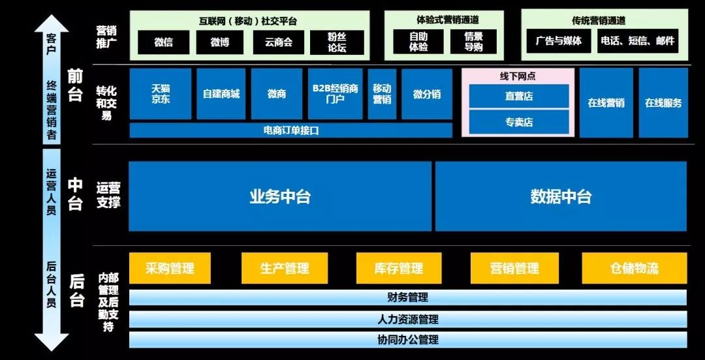
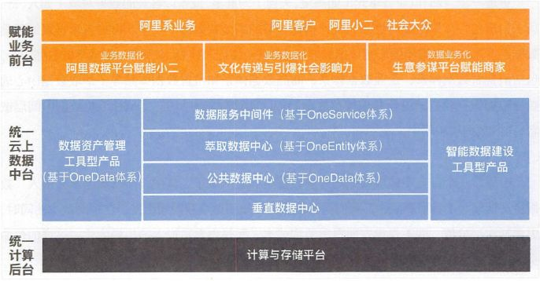
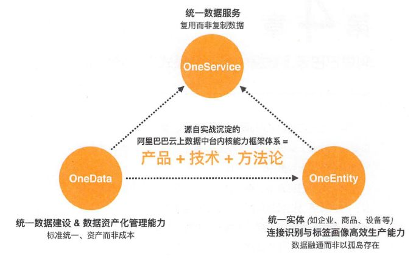
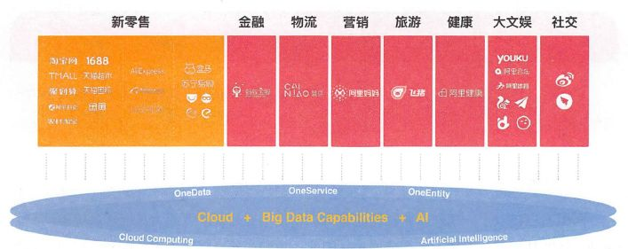
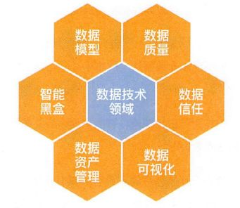
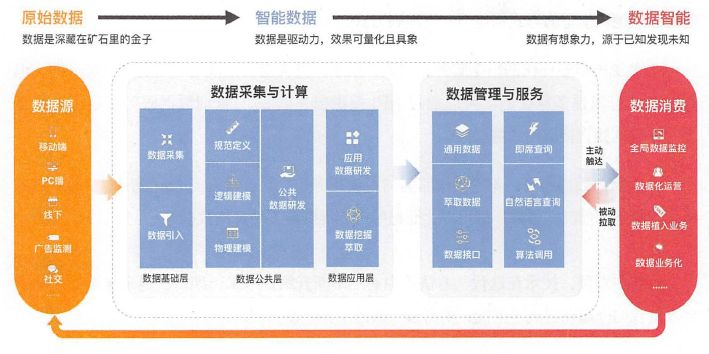
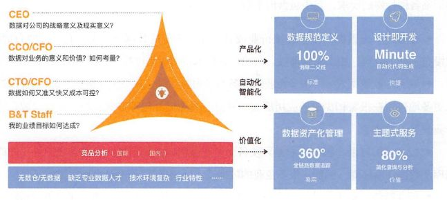
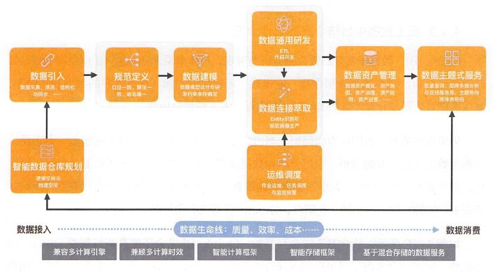
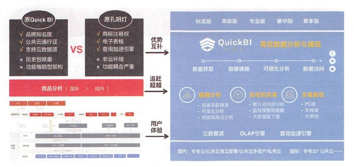

# 阿里专家，一篇讲透“业务数据双中台”架构，ppt干货分享！

本文整理了阿里专家在技术大会上的分享，以PPT图片+文字的方式呈现给各位社区读者。如果你觉得对你有帮助，请转发朋友圈、点“在看”，你的支持是我们坚持写下去的动力。

01

阿里业务数据双中台架构图

阿里中台主要体现为由业务中台和数字中台并肩构成的双中台，并肩扛起了所有前台业务。

业务中台将后台资源进行抽象包装整合，转化为前台友好的可重用共享的核心能力，实现了后端业务资源到前台易用能力的转化。

数据中台从后台及业务中台将数据流入，完成海量数据的存储、计算、产品化包装过程，构成企业的核心数据能力，为前台基于数据的定制化创新和业务中台基于数据反馈的持续演进提供了强大支撑。

业务中台与数据中台相辅相成、互相支撑，一起构建起了战场强大的后方炮火群和雷达阵。

02

阿里数据中台赋能业务全景图

在架构图中，看到最下面的内容主要是数据采集和接入，按照业态接入数据（比如淘宝、天猫、盒马等），把这些数据抽取到计算平台；通过OneData体系，以“业务板块+分析维度”为架构去构建“公共数据中心”。

基于公共数据中心在上层根据业务需求进行建设：消费者数据体系、企业数据体系、内容数据体系等。

经过深度加工后，数据就可以发挥其价值被产品、业务所用；最后通过统一的数据服务中间件“OneService”提供统一数据服务。

03

阿里数据中台三大体系

经过多年实战，沉淀出了阿里云上数据中台内核能力框架体系：产品+技术+方法论。

OneData致力干统一数据标准，让数据成为资产而非成本；OneEntity致力于统一实体，让数据融通而以非孤岛存在；OneService致力于统一数据服务，让数据复用而非复制。 

这三大体系不仅有方法论，还有深刻的技术沉淀和不断优化的产品沉淀，从而形成了阿里巴巴云上数据中台内核能力框架体系。

04

阿里数据中台及赋能业务模式支撑

阿里数据中台，经历了所有阿里生态内业务的考验，包括新零售、金融、物流、营销、旅游、健康、大文娱、社交等领域。

数据中台除了建立起自已的内核能力之外，向上赋能业务前台，向下与统一计算后台连接，融为一体。

05

数据中台六大数据技术领域

前文提到，在建设阿里数据公共层之初，规划了六大数据技术领域，即数据模型领域、存储治理领域、数据质量领域、安全权限领域、平台运维领域、研发工程领域。

而在阿里数据公共层建设项目第二阶段完成存储治理领域，已经被扩大到资源治理领域，进而升级到数据资产管理领域，安全权限领域，升级到数据信任领域，因为很多工作已经在产品中实现，平台运维领域不再作为一个数据技术领域被推进，数据模型领域与数据质量领域还在持续推进中，不过增加了许多新的内涵，智能黑盒领域则是新起之秀。

由此可见，数据技术领域不是一成不变的，而是随着业务的发展和技术的突破不断扩大、 升华的。

06

数据中台建设方法论

一、数据中台建设方法论体系的全局

(1)    全流程一体化：即从数据采集到数据服务实现全链路通。在产品层面，不会让用户在不同使用阶段来回切换于不同产品。

(2)向上多样化赋能场景：不仅要有通用产品，还要有行业产品及尊享产品。应向不同的应用场虽和用户，提供差异化服务。

(3) 向下屏蔽多计算引擎：不管是哪里的云计算服务，都应该尽可能兼容甚至屏蔽的，让用户在应用时感觉简单。

(4) 双向联动：在构建大数据及服务业务应用与创新的过程中，业务和技术是需要协同互动的，而不是一方是另一方的资源这种单向关系。

二、OneData体系方法论

OneData体系方法论至少包括：数据标准化、技术内核工具化、元数据驱动智能化3个方面。

三、OneEntity体系方法论

OneEntity体系方法论至少包括：技术驱动数据连接、技术内核工具化、业务驱动技术价值化3个方面。

四、OneService体系方法论

OneService体系方法论至少包括：主题式数据服务、统一但多样化的数据服务、跨源数据服务3个方面。

07

数据中台产品化服务

在推进阿里数据公共层建设之初，就意识到业务与技术“背靠背"、双向联动的重要性。

在推进阿里巴巴数据公共层建设时，虽然当时在业务上虽然有了几个月的缓冲时间，但维稳业务支持并不是停止业务支持，基本等同于“开着飞机换高能引擎”，虽然有时间和机会，但要快、很、准。

08

数据中台核心产品Dataphin

Dataphin是一款PaaS产品，致力于一站式解决智能数据构建与管理的全链路诉求。具体来说，Dataphin而向各行各业的大数据建设、管理及应用诉求，一站式提供从数据接入到数据消费的全链路的大数据能力，包括产品、技术和方法论等，助力客户打造智能大数据体系，以驱动创新。

09

Dataphin的PaaS服务

Dataphin在赋能阿里生态内外的驱动力下，到底要关注哪些痛点与核心诉求？在Dataphin沉淀过程中，还要考虑哪些因素？Dataphin在解决这些问题的过程中，提供了哪些独树一帜的核心能力？上图所示的正是Dataphin在沉淀过程中考虑的各种因素，以及相应的核心能力输出。

10

数据中台核心产品Quick BI

大数据构建与管理完毕之后，需要利用Quick BI这一智能数据与可视化组件将数据背后的价值展现在人们面前。

Quick BI的可视化能力也不容小觑，内设地图、柱图、雷达图等21种数据图表，任何场景下的报表展示均毫无压力。特别令人惊喜的是Quick BI 特有的类Excel的电子表格功能，它足以让企业数据分析人员兴奋不已，不仅延续了本地化操作的经验，也更加贴合中国式复杂报表的制作需求。

