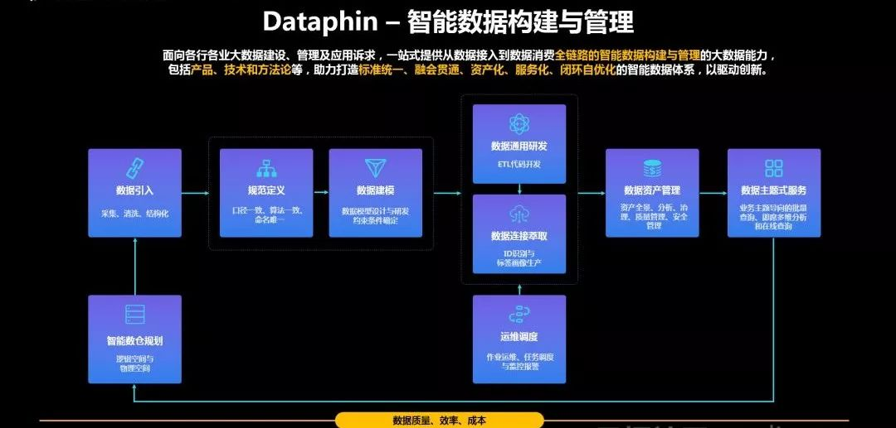

# 阿里数据科学家一次讲透数据中台，15页PPT精华，速转走！

阿里大数据和人工智能科学家 行在，阿里公共数据平台负责人 罗金鹏，在云栖大会、Data Tech等大会中分享到：阿里的“双中台+ET”数字化转型方法论及成果，以及阿里数据中台产品OneData、OneID、OneService、Dataphin的建设实践。

本文整理了其中15页PPT精华浓缩，下面我们跟随技术大咖，一起来学习阿里数据中台的建设方法论、建设实践、组织中台如果支撑数据中台、以及数据中台建设分哪些步骤等等。

01

阿里数据中台全景图

阿里数据中台在架构的组成上，呈现了一个“四横三纵”的结构，底层的基础设施来自于阿里云平台。

四横。在这张架构图中，从下往上看，最下面的内容主要数据采集和接入，按照业态接入数据（比如淘宝、天猫、盒马等），我们把这些数据抽取到计算平台；通过OneData体系，以“业务板块+分析维度”为架构去构建“公共数据中心”。

基于公共数据中心在上层根据业务需求进行建设：消费者数据体系、企业数据体系、内容数据体系等。

（图片来源：云栖社区）

经过深度加工后，数据就可以发挥其价值被产品、业务所用；最后通过统一的数据服务中间件“OneService”提供统一数据服务。

三纵。为保证阿里巴巴整个数据体系的快速、高效、高质量数据接入，需要有一套智能数据研发平台来实现，将理论及实践过程，通过一整套的工具体系及研发流程去保障落地，确保每一个团队，每一个BU，通过统一规则去建设数据体系；同时，当数据多了以后最直接问题就是成本，因此我们还建立了统一的数据质量管理平台。

02

阿里“双中台”共同支撑的“大中台+小前台架构”

阿里云的大数据和人工智能科学家--行在，在访谈中提到，阿里中台主要体现为由业务中台和数字中台并肩构成的双中台，并肩扛起了所有前台业务。

业务中台将后台资源进行抽象包装整合，转化为前台友好的可重用共享的核心能力，实现了后端业务资源到前台易用能力的转化。

数据中台从后台及业务中台将数据流入，完成海量数据的存储、计算、产品化包装过程，构成企业的核心数据能力，为前台基于数据的定制化创新和业务中台基于数据反馈的持续演进提供了强大支撑。

（点击图片可放大）

业务中台与数据中台相辅相成、互相支撑，一起构建起了战场强大的后方炮火群和雷达阵。

03

阿里数据中台OneData体系

OneData是阿里数据中台的核心，阿里公共数据平台负责人罗金鹏介绍，OneData体系建立的集团数据公共层，从设计、开发、部署和使用上保障了数据口径的规范和统一，实现数据资产全链路管理，提供标准数据输出。

统一数据标准是一项非常复杂的工作，譬如，针对UV这一相同的指标，在统一之前阿里内部竟然有10多种数据定义。据介绍，OneData数据公共层总共对30000多个数据指标进行了口径的规范和统一，梳理后缩减为3000余个。

在DT时代，数据暴增对存储计算成本带来很大的挑战。据罗金鹏介绍在没有建设统一的数据公共层时，阿里内部服务器需求量会在5年之后达到现在的100倍之多。而经过数据公共层的统一建设，5年后的服务器需求量相对会节约90%。

阿里数据中台之OneData也并非是“一次成型”的，它经历了三个阶段的能力演进：
第一阶段：完全应用驱动的时代。这个时期主要将数据以与源结构相同的方式同步到Oracle，那时候的数据架构只有两层ODS+DSS，严格说来基本只有一个ODS层，也基本没有模型方法体系。

第二阶段：随着阿里业务的快速发展，数据量也在飞速增长，性能已经是一个较大问题，希望通过一些模型技术改变烟囱式的开发模型，消除一些冗余，提升数据的一致性，所以阿里引入了Greenplum。

第三阶段：引入以hadoop为代表的分布式存储计算平台，确立第三代模型架构（OneData），核心CDM层都采用多维模型。选择了以Kimball维度建模为核心理念的模型方法论，同时对其进行了一定的升级和扩展，构建了阿里集团的数据架构体系。

04

数据中台PasS层Dataphin

（图片来源：云栖社区）

在整个数据中台模式中，PasS层产品Dataphin如引擎般存在，下到规划数仓，上至输出主题式服务。

有了Dataphin之后，种种数据问题弹指间即可迎刃而解，它既可以保证数据标准规范定义、数据模型设计即自动化开发、主题式数据服务即时生成。

同时还能提供数据资产化管理的门户，有效降低数仓建设门槛，也提高生产效率、降低生产成本，轻松实现让数据从成本中心真正变成价值中心，且可量化呈现。

05

Quick BI助力云上企业数据分析

大数据构建与管理完毕之后，我们需要利用Quick BI这一智能数据与可视化组件将数据背后的价值展现在人们面前。

Quick BI扭转了当初重度依赖专业数据分析人才的局面，能够赋予一线业务人员智能化的分析工具，真正的做到了“数据化运营”让数据产生价值。

现在，越来越多的企业开始数据上云，也有的行业如政府、金融因为严苛的安全需求而自建本地数据库，导致企业出现数据分散式存储的状况。而Quick BI却可以链接各种数据源，满足云上和本地的不同需求，整合为可被统一调度的数据集。

06

阿里大数据能力框架

阿里巴巴提出的数据中台模式，正是为解决问题而生，并通过实践形成了统一全域数据体系，实现了计算存储累计过亿的成本降低、响应业务效率多倍提升、为业务快速创新提供坚实保障。
全域数据采集与引入：以需求为驱动，以数据多样性的全域思想为指导，采集与引入全业务、多终端、多形态的数据。
标准规范数据架构与研发：统一基础层、公共中间层、百花齐放应用层的数据分层架构模式，通过数据指标结构化规范化的方式实现指标口径统一。
连接与深度萃取数据价值：形成以业务核心对象为中心的连接和标签体系，深度萃取数据价值。
统一数据资产管理：构建元数据中心，通过资产分析、应用、优化、运营四方面对看清数据资产、降低数据管理成本、追踪数据价值。
统一主题式服务：通过构建服务元数据中心和数据服务查询引擎，面向业务统一数据出口与数据查询逻辑，屏蔽多数据源与多物理表。

极大的丰富和完善了阿里巴巴大数据中心，OneData、OneID、OneService渐趋成熟并成为上至CEO、下至一线员工共识的方法论体系。

07

阿里数据中台演进的四个阶段

阿里巴巴的数据处理经历了四个阶段，分别是：

一.  数据库阶段，主要是OLTP（联机事务处理）的需求；

二.  数据仓库阶段，OLAP（联机分析处理）成为主要需求；

三.  数据平台阶段，主要解决BI和报表需求的技术问题；

四.  数据中台阶段，通过系统来对接OLTP（事务处理）和OLAP（报表分析）的需求，强调数据业务化的能力。

08

数据中台的建设步骤

第一，组织架构升级。比如以前负责数据的部门或团队往往缺乏话语权，面对业务需求往往是被动的接受的角色，这让一切数据中台的想法化为泡影，需要为数据中台团队授权。

第二，工作方式的改变。现在很多企业的数据团队的主要工作内容就是项目管理、需求管理等等，当一个项目完成后又投入到下一个项目，做好一个需求后又开始负责下一个需求，这样的工作确实非常锻炼人的组织、协调能力，但这样能力的提升与工作时间的长短并不是呈线性增长的，虽然增加了项目和需求管理经验，但并不能在某一个专业领域得到知识和经验的沉淀，随着时间的流逝，越来越多的人会失去最初的工作积极性和创造性，事实上，数据人员只有深入的研究业务、数据和模型，端到端的去实践，打造出数据中台，才是最大的价值创造，才能使得持续创新成为可能

第三，角色的转换。数据中台的团队要从传统的支撑角色逐步向运营转变，不仅在数据上，在业务上也要努力赶超业务人员，中台人员要逐步建立起对于业务的话语权，不仅仅是接受需求的角色，更要能提出合理的建议，能为业务带来新的增长点，比如数据驱动营销。

第四，适合企业特点。好的中台是当你深入了解业务、产品、系统、组织，而且不仅了解今天在哪里，还要了解过去是怎么演变而来，未来又会怎么演化。只有当了解所有的东西之后，才能做出较好的中台架构设计。

09

阿里中台建设方法论

中台建设的基础协议

就是要根据我们对商业的理解，把一些基础协议梳理出来。例如什么是业务？什么是业务身份？各个业务领域的边界是什么？每个领域提供的基础服务是什么？再在这些思想的指导下去建立业务平台化的实施标准和业务管控标准。

中台的基础设施：中心化控制单元

就是运营平台，它主要由协议标准、能力地图、业务需求结构分解、全局业务身份、业务全景图、业务度量等构成。能让我们有一个地方纵观全局，把控细节。

10

阿里的组织中台：数据中台的组织保证

亚当斯密出版了《国富论》，与此同时，瓦特改良了蒸汽机，社会大分工理论与工业革命相生相伴，在人类文明史上写下了浓墨重彩的一笔。

金字塔式的科层制，伴随着工业文明成为组织的核心底层逻辑，在强调秩序和大规模高效率生产的工业时代，甚至是强调如臂使指的军队组织，科层制（官僚制）是保证自上而下的命令得到有力执行的高效组织架构。

随着互联网时代的到来，消费者的需求被极大释放，工业时代的大规模生产方式受到了挑战，转而向“大规模定制”的生产方式转型，传统的科层制是建立在大规模生产基础上的，因此也面临组织模式转换，向扁平化、自组织的方式转变。

而中台建设真正困难的是组织上的重构，这往往是大家有意无意避而不谈的。

中台战略的成功、能否实现技术架构与组织架构的匹配，是一道绕不过去、但必须要迈过的门槛。从阿里成立共享事业部，海尔的人单合一、职能并联，到近期大家关注的腾讯的组织架构重构都是这些企业在这方面做出的努力。

11
本文要点小结

1、阿里数据中台全景图。阿里数据中台在架构的组成上，呈现了一个“四横三纵”的结构，底层的基础设施来自于阿里云平台。
2、阿里“双中台”共同支撑的“大中台+小前台”架构。业务中台与数据中台相辅相成、互相支撑，一起构建起了战场强大的后方炮火群和雷达阵。
3、阿里数据中台OneData体系。OneData体系建立的集团数据公共层，从设计、开发、部署和使用上保障了数据口径的规范和统一，实现数据资产全链路管理，提供标准数据输出。
4、数据中台PasS层Dataphin。PasS层产品Dataphin如引擎般存在，下到规划数仓，上至输出主题式服务。
5、Quick BI助力云上企业数据分析。能够赋予一线业务人员智能化的分析工具，真正的做到了“数据化运营”让数据产生价值。
6、阿里大数据能力框架。数据中台极大的丰富和完善了阿里巴巴大数据中心，OneData、OneID、OneService渐趋成熟并成为上至CEO、下至一线员工共识的方法论体系。
7、阿里数据中台演进的四个阶段。数据库、数据仓库、数据平台、数据中台。
8、数据中台的建设步骤。组织架构升级、工作方式的改变、角色的转换、适合企业特点。
9、阿里中台建设方法论。中台建设和基础协议、中心化操控单元。

10、阿里的组织中台：数据中台的组织保证。阿里人力三支柱、公共事业部的组织架构升级。
