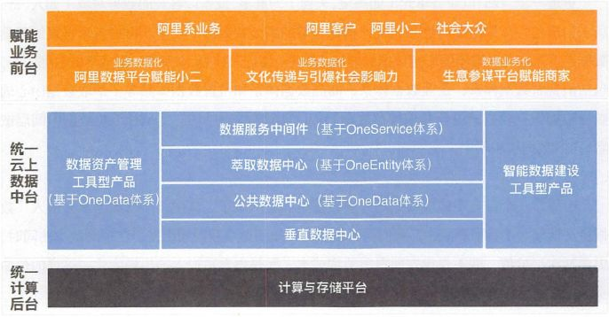
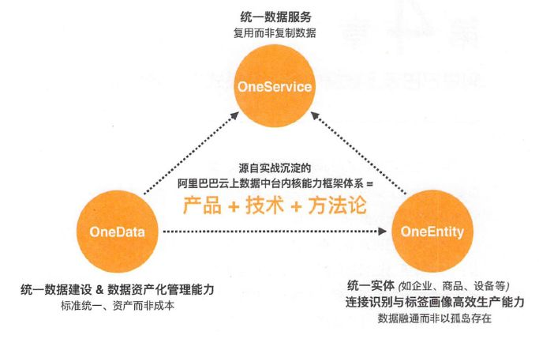
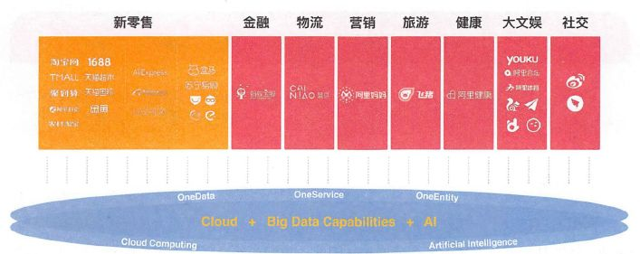
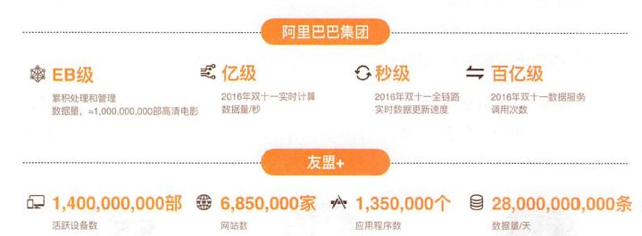
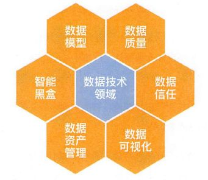
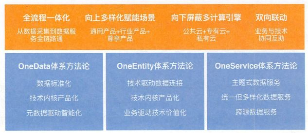
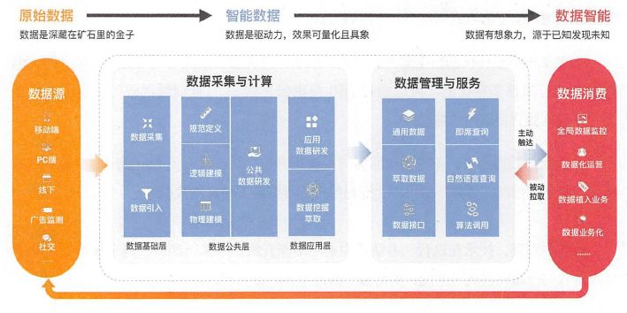
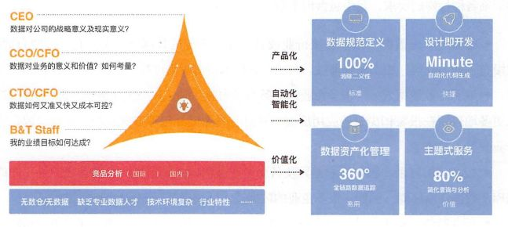
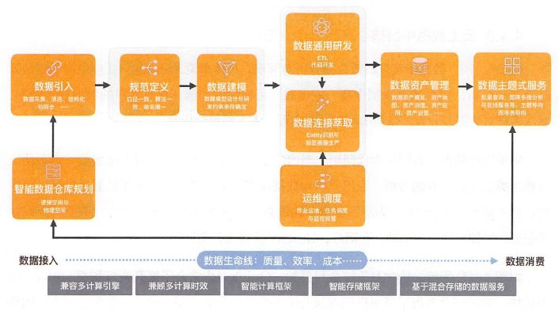
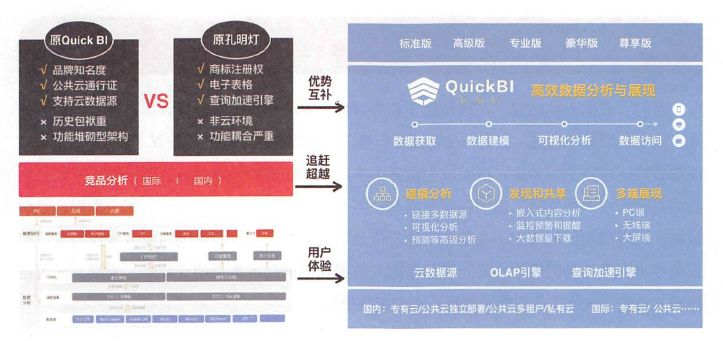

# 10张图解密阿里数据中台 

阿里数据中台建设过程、方法论、主要核心的产品、技术架构等等，对技术圈来说一直非常神秘。并且，阿里已经将中台建设方法论形成了解决方案，向行业输出，这也导致了阿里中台相关资料、对外界的分享，都趋于严格控制。

本文，讲解阿里数据中台建设之道，透过 10 张图，全面细致解读阿里数据中台建设原理、实践。

0 1

**阿里数据中台赋能业务全景图**

在架构图中，看到最下面的内容主要是数据采集和接入，按照业态接入数据（比如淘宝、天猫、盒马等），把这些数据抽取到计算平台；通过 OneData 体系，以「业务板块+分析维度」为架构去构建「公共数据中心」。

基于公共数据中心在上层根据业务需求进行建设：消费者数据体系、企业数据体系、内容数据体系等。

经过深度加工后，数据就可以发挥其价值被产品、业务所用；最后通过统一的数据服务中间件「OneService」提供统一数据服务。

0 2

**阿里数据中台三大体系**

经过多年实战，沉淀出了阿里云上数据中台内核能力框架体系：产品+技术+方法论。

历经阿里生态内各种实战历练后，云上数据中台从业务视角而非纯技术视角出发，智能化构建数据、管理数据资产，并提供数椐调用、数据监控、数据分析与数据展现等多种服务。

承技术启业务，是建设智能数据和催生数据智能的引擎。在 OneData、OneEntity、OneService 三大体系，特别是其方法论的指导下，云上数据中台本身的内核能力在不断积累和沉淀。在阿里巴巴，几乎所有人都知道云上数据中台的三大体系，如上图所示。

OneData 致力于统一数据标准，让数据成为资产而非成本；OneEntity 致力于统一实体，让数据融通而以非孤岛存在；OneService 致力于统一数据服务，让数据复用而非复制。

这三大体系不仅有方法论，还有深刻的技术沉淀和不断优化的产品沉淀，从而形成了阿里巴巴云上数据中台内核能力框架体系。

0 3

**阿里数据中台及赋能业务模式支撑**

阿里数据中台，经历了所有阿里生态内业务的考验，包括新零售、金融、物流、营销、旅游、健康、大文娱、社交等领域。

数据中台除了建立起自已的内核能力之外，向上赋能业务前台，向下与统一计算后台连接，融为一体。

0 4

**数据中台技术的数字表现**

今天，阿里处理的数据量已达 EB 级，相当于 10 亿部高清电影的存储量。在 2016 年双十一当天，实时计算处理的数据量达到 9400 万条/秒。而从用户产生数据源头采集、整合并构数据、提供数据服务，到前台展现完成仅需 2.5 秒。

「友盟+」是阿里把收购的几家数据公司整合升级后，组成的一家数据公司。这里仅以 2017 年「友盟+」对外公开的部分指标为例，其中的数据覆盖 14 亿部活跃设备、685 万家网站、135 万个应用程序，日均处理约 280 亿条数据，这一切都建立在阿里强大的数据处理技术底座之上。

0 5

**数据中台六大数据技术领域**

前文提到，在建设阿里数据公共层之初，规划了六大数据技术领域，即数据模型领域、存储治理领域、数据质量领域、安全权限领域、平台运维领域、研发工程领域。

而在阿里数据公共层建设项目第二阶段完成存储治理领域，已经被扩大到资源治理领域，进而升级到数据资产管理领域，安全权限领域，升级到数据信任领域，因为很多工作已经在产品中实现，平台运维领域不再作为一个数据技术领域被推进，数据模型领域与数据质量领域还在持续推进中，不过增加了许多新的内涵，智能黑盒领域则是新起之秀。

由此可见，数据技术领域不是一成不变的，而是随着业务的发展和技术的突破不断扩大、 升华的。

0 6

**数据中台建设方法论**

**一、数据中台建设方法论体系的全局**

**(1)全流程一体化：**即从数据采集到数据服务实现全链路通。在产品层面，不会让用户在不同使用阶段来回切换于不同产品。

例如，用户要做实体识别、用户标签画像等，如果要依赖的数据在另外一个产品中, 甚至需要使用风格迥异的产品来完成，则用户会不知所措。所以，以数据建设为例，要实现数据从采集到标准化、实体识別、标签画像及最终面向应用的一站式服务。

**(2)向上多样化赋能场景：**不仅要有通用产品，还要有行业产品及尊享产品。应向不同的应用场景和用户，提供差异化服务。

例如，阿里数据中台向用户提供的数据产品，就包括数据工具、专题分析、 应用分析、数据决策这四个层次的产品和服务。

**(3) 向下屏蔽多计算引擎：**不管是哪里的云计算服务，都应该尽可能兼容甚至屏蔽的，让用户在应用时感觉简单。

在阿里 10 年大数据建设历程中，数据建设的底座依赖至少经历了 Oracle— GP-Hadoop —阿里云计算平台的变化过程。很多大数据应用与创新者也一定会面临类似的变化。

所以，对于产品和服务，需要连同生态合作伙伴一起努力实现屏蔽多种计算引擎，不管底座是阿里云公共云，还是阿里云专有云，还是自建的私有云，都可以在此之上构建数据并实现平滑切换。

**(4) 双向联动：**在构建大数据及服务业务应用与创新的过程中，业务和技术是需要协同互动的，而不是一方是另一方的资源这种单向关系。

一般来说，对于业务需要技术的协同这一点，人们很容易理解，但对于技术同样也需要业务的协同这一点，人们可能就不太容易理解。例如，要对消费者进行识别、刻画、触达和服务，则需要业务部门在业务前台按照数裾技术规范和标准进行布点，以便采集到数据，以及需要业务人员与技术人员一起讨论刻画消费者标签的关键因素，并确定哪些标签符合业务线的价值诉求。

**二、OneData体系方法论**

OneData 体系方法论至少包括：数据标准化、技术内核工具化、元数据驱动智能化 3 个方面。

**(1)数据标准化。**要从源头实施数据标准化，而非在数据研发之后，基于数据指标梳理的数据字典实施数据标准化。因为，只有每一个数据都是唯一的，数据模型才能稳定、可靠，数据服务才是靠谱、可信的。

**(2)技术内核产品化。**所有的规范、标准等，如果没有一个全流程的工具作为保障, 则无法实现真正意义上的全链路通，因此，我们首先推进技术内核全面工具化。

**(3)元数据驱动智能化。**前文提到，阿里正在持续努力实现数据建模后的自动化代码生成，以及保障其实现和运行的智能计算与存储框架。为什么阿里能做这件事情？其中一个重要原因就是，在源头对每个元数据进行了规范定义，尽可能实现数据的原子化和结构化，并将其全部存在元数据中心里。这些元数据对于计算、调度、存储等意义非凡，因此有望实现从人工到半自动化，进而实现智能化。

**三、OneEntity体系方法论**

OneEntity 体系方法论至少包括：技术驱动数据连接、技术内核工具化、业务驱动技术价值化 3 个方面。

**(1)技术驱动数据连接。**OneEntity 要实现实体识别，首先依赖很强的实体识别技术，所以要用技术来驱动数据连接。

**(2)技术内核产品化。**产品化是目标，其发展过程不是一蹴而就的。一定要往这个方向努力，否则每一次进行标签画像（哪怕是类似的标签），都要通过人力重复做一次，这实在是一件让人非常痛苦的事情。所以，要高效地进行实体识别、用户画像，工具化是一条必由之路。当然，全部工具化总是很难实现的，一定还有工具无法替代人脑的部分，所以，努力追求的是将人脑智慧尽可能沉淀在工具型产品中。

**(3)业务驱动技术价值化。**正如前文所述，将数据从孤岛变得融通，进而实现高价值，是需要业务来驱动的。在此过程中，再一次体现了业务和技术要「背靠背」「你情我愿」地进行双向联动的。

**四、OneService体系方法论**

OneService 体系方法论至少包括：主题式数据服务、统一但多样化的数据服务、跨源数据服务 3 个方面。

**(1)主题式数据服务。**举一个例子，假设用户想要看的是「会员」这个主题下的数据，至于「会员」主题背后有 1000 张物理表还是 2000 张物理表，他都不关心。而主题式数据服务要做的是，从方便用户的视角出发，从逻辑层面屏蔽这 1000 张甚至是 2000 张物理表，以逻辑模型的方式构建而非物理表方式。

**(2)统一但多样化的数据服务。**例如，双十一当天上百亿次的调用服务是统一的，但获取形式可以是多样化的，可以通过 API 提供自主的 SQL 查洵数据服务，也可以通过 API 提供在线直接调用数椐服务。

**(3)跨源数据服务。**不管数据服务的源头在哪里，从数据服务的角度出发，都不应该将这些复杂的情况暴露给用户，而是尽可能地屏蔽多种异构数据源。

业务在发展，技术在迭代，方法论也必然不断升级，在实战中沉淀、丰富云上数据中台建设方法论。

0 7

**数据中台产品化服务**

在推进阿里数据公共层建设之初，就意识到业务与技术「背靠背」、双向联动的重要性。

在推进阿里巴巴数据公共层建设时，虽然当时在业务上虽然有了几个月的缓冲时间，但维稳业务支持并不是停止业务支持，基本等同于“开着飞机换高能引擎”，虽然有时间和机会，但要快、很、准。

0 8

**数据中台核心产品Dataphin**

Dataphin 是一款 PaaS 产品，致力于一站式解决智能数据构建与管理的全链路诉求。具体来说，Dataphin 向各行各业的大数据建设、管理及应用诉求，一站式提供从数据接入到数据消费的全链路的大数据能力，包括产品、技术和方法论等，助力客户打造智能大数据体系，以驱动创新。

智能大数据体系的建设，极大地丰富和完善了阿里巴巴大数据中心，OneData、 OneEntity、OneService 三大体系也渐趋成熟，并成为阿里巴巴中上至 CEO、下至一线员工共识的三大体系。

Dataphin 将指导解决所有与大数据体系建设有关的 OneData、OneEntity、OneService 体系方法论，及其在解决阿里巴巴数据公共层建设，及后续数据体系建设中的实际问题的具体做法全部沉淀下来。

0 9

**Dataphin的PaaS服务**

Dataphin 在赋能阿里生态内外的驱动力下，到底要关注哪些痛点与核心诉求？在 Dataphin 沉淀过程中，还要考虑哪些因素？Dataphin 在解决这些问题的过程中，提供了哪些独树一帜的核心能力？上图所示的正是 Dataphin 在沉淀过程中考虑的各种因素，以及相应的核心能力输出。

阿里生态内遇到的很多痛点和诉求，阿里生态外的各行业客户也会面临，具体介绍如下。

**(1)CEO关心数据对公司的战略意义及现实意义：**这份数据是准确的吗？早上一起床就能看到数据吗？在数据上的投入产出比是怎样的？……

**(2)CCO/CFO关心数据对业务的意义和价值，以及如何考量：**大数据能助力全局监控,进而辅助投资决策吗？每一条业务线运营都能用同一份数据吗？大数据如何助力数据化运营并无处不在地深入业务？大数据是否会提升业务运营的效率和效果，以及如何考量？……

**(3)CTO/CFO关心如何让数据又准又快又成本可控：**成本消耗是否在可控范围内？在技术资源上还有多少优化、提升的空间？技术人才的研发、维护投入是否有改进和提升空间？……

**(4)—线业务人员关心数据对自己达成业务目标的作用：**我能又准又快地看数据和用数据吗？我的数据需求能否得到快速、无差异的响应？这些数据能否帮助我提升业绩，及时反映业务的完成进度？……

**(5)—线技术人员关心如何既优又超前地提供服务：**计算是否够快，存储是否够优？代码开发是否可以提速，线上任务是否可维护？技术是否有可能在满足业务的同时主动赋能业务？……

10

**数据中台核心产品Quick BI**

大数据构建与管理完毕之后，需要利用 Quick BI 这一智能数据与可视化组件将数据背后的价值展现在人们面前。

Quick BI 扭转了当初重度依赖专业数据分析人才的局面，能够赋予一线业务人员智能化的分析工具，真正的做到了「数据化运营」让数据产生价值。