# 阿里技术专家：技术中台/移动中台/研发中台，16页PPT一次讲透！

阿里中间件高级技术专家 钟华、高级技术专家 泠茗、中间件技术专家 玄难，在公开分享和访谈中提到阿里技术中台建设实践，包括：技术中台、移动中台、业务数据双中台、研发中台、组织中台等等。

本文整理了其中的PPT精华部分进行讲解，供大家学习参考。

01

阿里技术中台

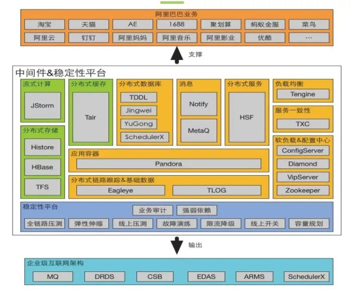

（图片来源：阿里技术参考图册）

技术中台，就是将使用云或其他基础设施的能力，以及应用各种技术中间件的能力，进行整合和包装。过滤掉技术细节，提供简单一致、易于使用的应用技术基础设施的能力接口，助力前台和业务中台数据中台的快速建设。

阿里的技术中台，包括：

流式计算

JStorm是一个分布式实时计算引擎，调度器分配一个worker 来跑任务，进行任务全生命周期的托管。

分布式存储

Tair（Key/Value结构数据存储系统）

Histore（分布式海量数据场景下OLAP分析型数据库产品）

Hbase

TFS（分布式文件存储）。

分布式数据库

TDDL（分布式数据库中间）

精卫（取名自“精卫填海”，基于MySQL数据库的数据复制组件）

愚公（数据自动迁移引擎，异构数据源迁移）

SchedulerX（分布式任务调度）。

消息

Notify

MeteQ

分布式服务

HSF（High Speed Framework，分布式服务框架，当时阿里内部选择了HSF，放弃了dubbo）。

负载均衡

Tengine（是基于 Nginx 开发的轻量级开源 Web 服务器,作为阿里巴巴七层流量入口的核心系统）。

应用容器

Pandora（是淘宝网中间件团队打造的，基于HSF隔离技术构建的全新一代隔离容器）。

软负载&配置中心

ConfigServer（主要提供非持久配置的发布和订阅）

Diamond（是一个持久配置管理中间件，可以实现分布式场景下，中心化的持久配置管理，同时也支持基于发布订阅模型配置动态变更推送）

VipServer（天枢，通过集中式的配置向客户提供路由信息，以非网关的形式实现负载均衡功能）

Zookeeper。

分布式链路跟踪&基础数据

Eagleye（鹰眼，通过收集和分析在不同的网络调用中间件上的日志埋点，可以得到同一次请求上的各个系统的调用链关系，有助于梳理应用的请求入口与服务的调用来源、依赖关系）

TLOG（是一个分布式的，可靠的，对大量数据进行收集、分析、展现的的系统）。

02

阿里移动中台EMAS

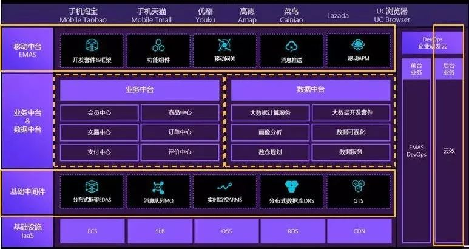

阿里巴巴高级技术专家泠茗，分享到，阿里的移动中台是构建在业务&数据中台之上，为更好更快地利用中台能力、快速迭代移动端产品，又生生地挤出（或是说沉淀）出了一个新的中台层。

移动中台建立在业务数据双中台之上，更靠近移动前端战场，我们可以类比成战场上的坦克群，近距离支撑一线战场。

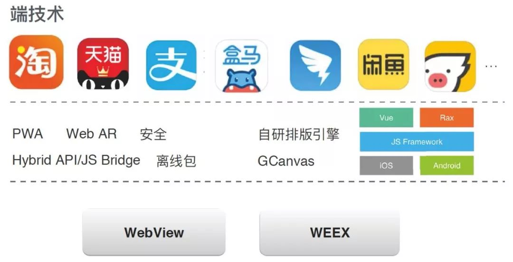

在端技术方面，采用RN搭建技术框架，支持Hybrid，并且自研了排版引擎，包含安全组件、离线数据、JS桥接框架等，支撑了淘宝、天猫、支付宝、盒马、咸鱼、飞猪、钉钉等App应用。

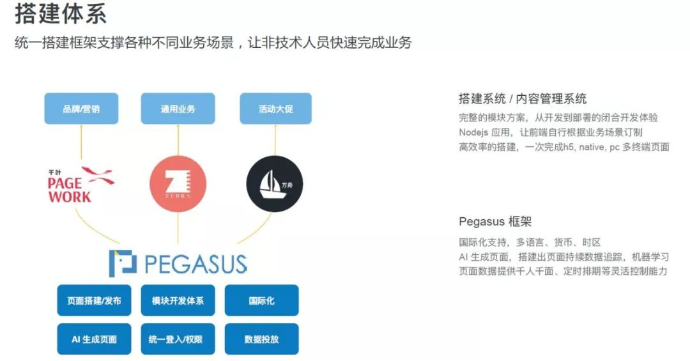

移动中台，通过搭建移动框架体系，支持各种不同业务场景，让非技术人员快速完成业务，集成了AI生成页面、模块开发体系、国际化、统一登入/权限等，支持对业务的快速响应。

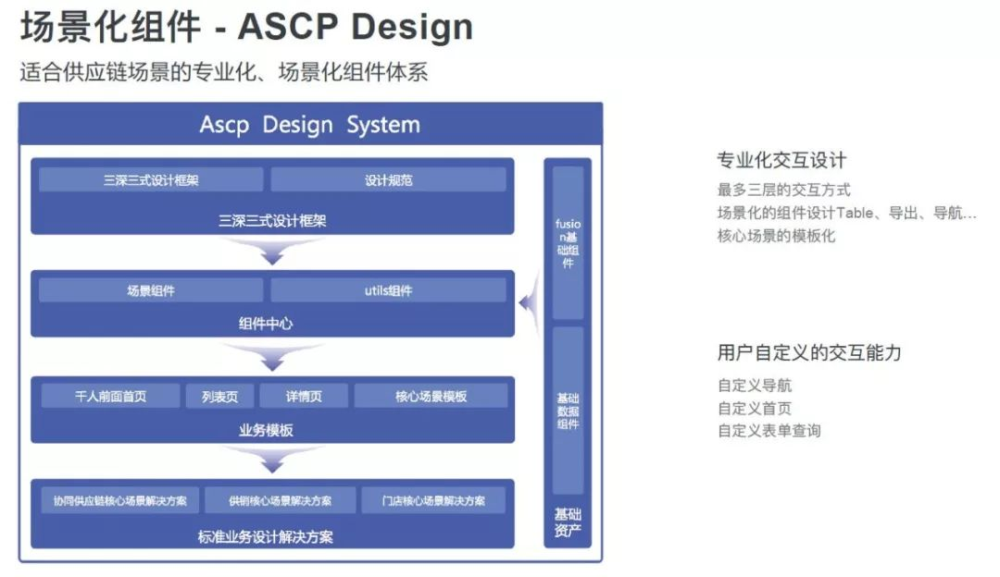

移动中台不仅提供前端技术框架，还支持后台系统快速搭建，通过场景化组件体系，提供三深三式设计框架、场景组件、适合供应链系统的组件解决方案。

03

阿里的研发中台

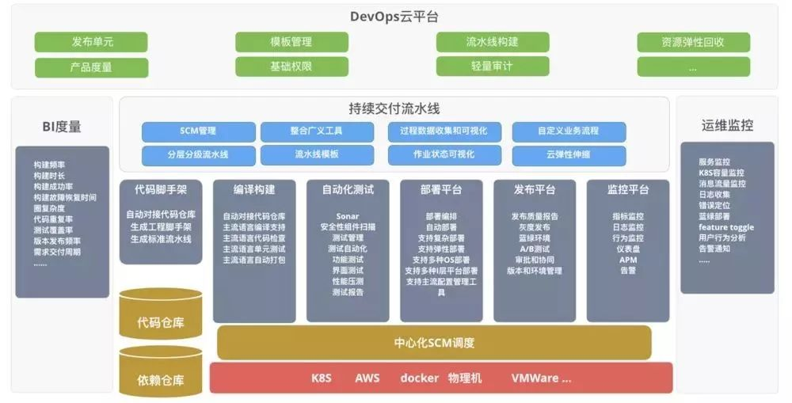

研发中台，主要关注与开发效能管理，软件开发是一项工程，涉及到管理、流程、测试、团队协作等方面。如何将企业的开发流程最佳实践沉淀成可重用的“能力”，从而助力创新性应用的快速开发迭代，也是我们看到的很多企业正在做的事情。

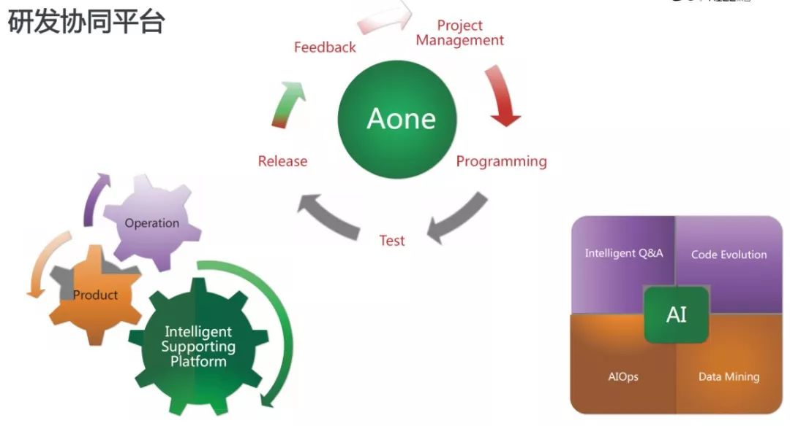

如果说技术中台为前台应用提供了基础设施重用的能力，那研发中台就为前台应用提供了流程和质量管控以及持续交付的能力。

阿里效能部，一直致力于集团研发效能的提升，通过工具、规范、体系给各业务线开发团队赋能。

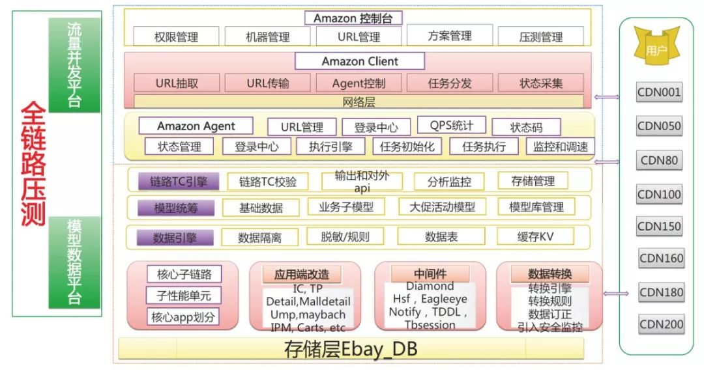

研发中台，其中不得不提的是“全链路压测”平台Amazon，每年“双11”前夕承载着大量压测任务，提供了全量线上压测、混沌工程等复杂场景下的压测实践。

04

阿里数据中台

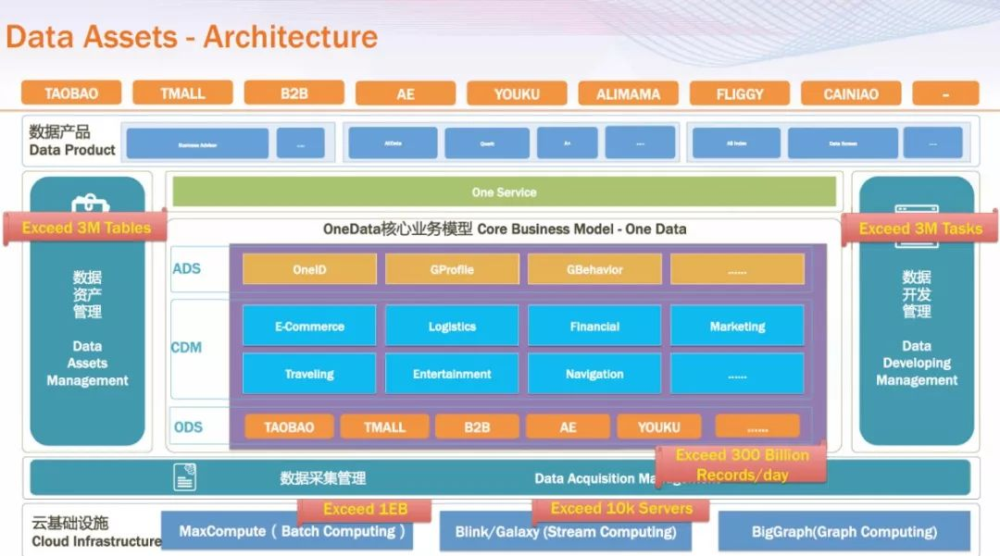

阿里数据中台产品包括：OneData、OneID、OneService、Dataphin等等。数据中台的内容在上期文章中详细讲过，感兴趣的同学可以查看文末链接前往阅读。

05

阿里的业务、数据“双中台”

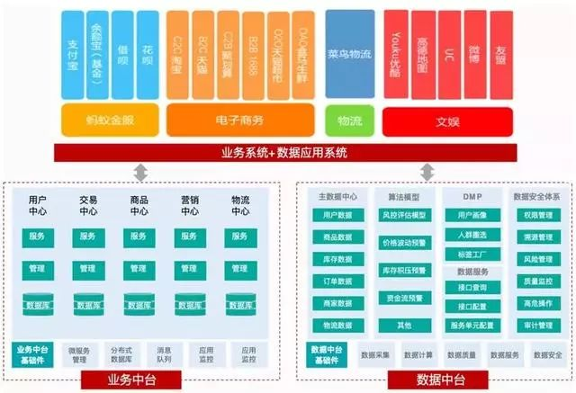

古谦在云栖大会《企业核心业务数字化转型最佳实践》分享，阿里的数据业务双中台堪称经典。从图中可见，阿里中台主要体现为由业务中台和数字中台并肩构成的双中台，并肩扛起了所有前台业务。

业务中台将后台资源进行抽象包装整合，转化为前台友好的可重用共享的核心能力，实现了后端业务资源到前台易用能力的转化。

数据中台从后台及业务中台将数据流入，完成海量数据的存储、计算、产品化包装过程，构成企业的核心数据能力，为前台基于数据的定制化创新和业务中台基于数据反馈的持续演进提供了强大支撑。

业务中台与数据中台相辅相成、互相支撑，一起构建起了战场强大的后方炮火群和雷达阵。

06

组织中台让阿里致胜千里

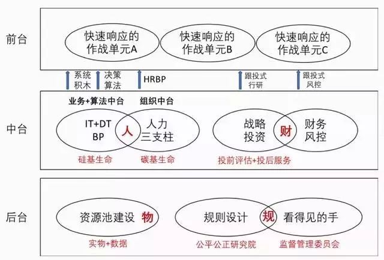

组织结构是企业的生命底色，企业作为组织生命，生命天生追求稳定性，个性化的消费者天生追求个性与多样性，在两者的对立统一中，如何建立一个兼具稳定性和多样性的组织生命体是我们探讨的核心命题。

而中台建设真正困难的是组织上的重构，这往往是大家有意无意避而不谈的。

中台战略的成功、能否实现技术架构与组织架构的匹配，是一道绕不过去、但必须要迈过的门槛。从阿里成立共享事业部，海尔的人单合一、职能并联，到近期大家关注的腾讯的组织架构重构都是这些企业在这方面做出的努力。

07

中台战略在企业中如何落地？

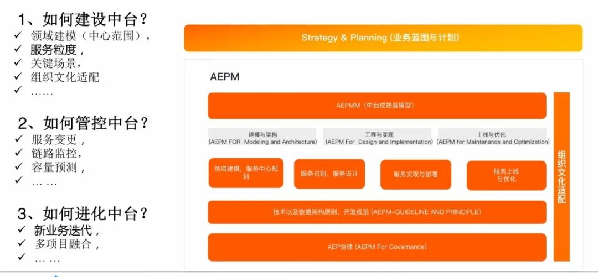

中台战略能解决未来问题，是一种能力沉淀，是企业数字化转型的最佳落地实践，可以让企业持续前进、加速奔跑。

第一，实现从局部优化到全局优化的转变。鞋服行业追求高库存、高消耗，所有关注点都在供应链，就需要把WMS或者供应链做到足够优化。此时的优化一定是局部的，一是部门没办法控制营销端的事情，二是营销端的数据不够实时。而今天，在中台战略的助力下，企业可以在整个架构下进行全局优化，实现最大化的优化效率。

第二，能实现企业业务数据实时、统一、在线。很多企业组织中会碰到业务响应的问题，其实90%是因为你的数据没有做到实时、统一、在线。比如说，销售部门想要看到7000家门店销售数据如何，供应链怎么优化，商品设计能不能做爆款预测等，但彼此间的数据是割裂的，系统间协同效率低，实时统一在线性极弱，所以很难将这些想法落地。而如果企业只有一份数据，包括电商环节、供应链环节，就能够发现任何一个场景下对于业务的变化和感知，实时联动。

第三，实现更具“韧性”的企业架构。康师傅如今被打击得无还手之力，但打击它的不是统一这样的同行业品牌，而是外卖。今天，外部环境的变化是不可预测的，而中台战略可以让企业架构更具“韧性”，能面对多变的环境迅速调整，快速“重生”。

 08

大中台团队的KPI怎么考核？

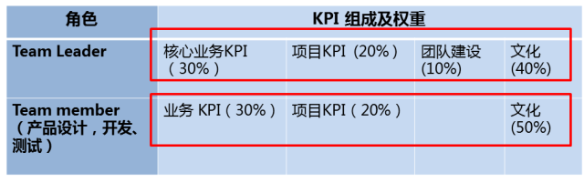

大中台是个上不顶天，下不立地的组织。不能简单的按照业务和收入KPI进行考核，因为能做多少收入不是它能掌控的，毕竟它是个能力和成本中心，不是个利润中心，又不能按照IT系统的方式去考核它，否则离业务太远，资源整合的业务价值没法体现，同时你还不能简单的以一年为单位来考核它，因为能力中心的建立不是一朝一夕之事，你按年考核它，它就会急功近利。

另外，国内的企业管理者技术出身的比例不大，对于中台的理解有限，传统企业有几个CEO是真正懂的，一定程度上造成业务人员高人一等的现象。毕竟KPI为王，企业大多数时候，还是屁股决定脑袋的，但做百年老店拼的不是起跑线，而是谁的耐力更久，在移动互联网时代更是如此了。

09

如何评判一个平台是否称得上中台？

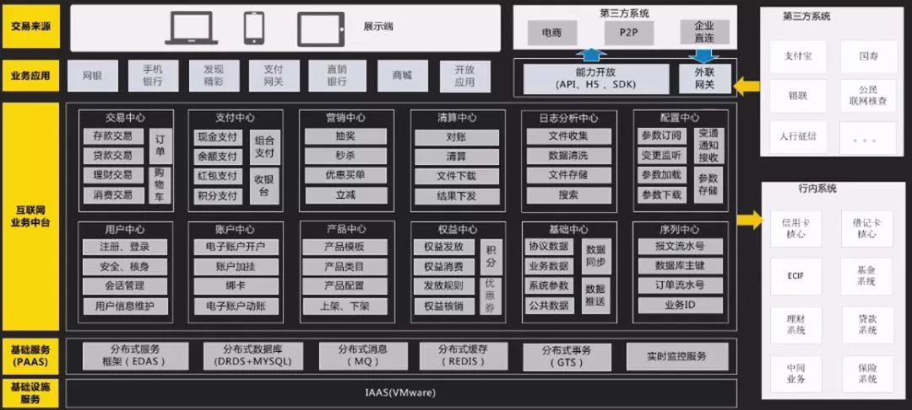

让我们引用一段阿里玄难在接受极客公园采访时提到对于中台的一段我非常认同的描述：

本文中我们一直提到的一个词就是“能力”，从玄难的这段采访也可以看出，在阿里，“能力”也是中台的核心。

一切以“以用户为中心的持续规模化创新”为目的，将后台各式各样的资源转化为前台易于使用的能力，帮助我们打赢这场以用户为中心的战争的平台，我们都可以称之为中台。

10

本文内容小结

1，技术中台提供了自建系统部分的技术支撑能力，帮助我们解决了基础设施，分布式数据库等底层技术问题，为前台特种兵提供了精良的武器装备。

2，移动中台提供了战场一线火力支援能力，帮助我们提供更加个性化的服务，增强用户体验，为战场提供了陆军支援能力，随机应变，所向披靡。

3，业务中台提供重用服务，例如用户中心，订单中心之类的开箱即用可重用能力，为战场提供了强大的后台炮火支援能力，随叫随到，威力强大。

4，数据中台提供了数据分析能力，帮助我们从数据中学习改进，调整方向，为战场提供了强大及时的雷达监测能力，帮助我们掌控战场。

5，研发中台提供了自建系统部分的管理和技术实践支撑能力，帮助我们快速搭建项目，管理进度，测试，持续集成，持续交付，是前台特种兵的训练基地及快速送达战场的机动运输部队。

6，组织中台为我们的项目提供投资管理、风险管理、资源调度等，是战场的指挥部，战争的大脑，指挥前线，调度后方。

