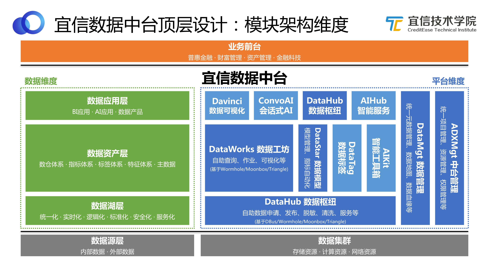

## 数据中台：宜信敏捷数据中台建设实践

## 一、导语

目前“中台”的概念很火，包括数据中台、AI中台、业务中台、技术中台等。宜信技术学院第一期技术沙龙，井玉欣博士分享了宜信的AI中台，本期技术沙龙，由我来为大家分享《宜信敏捷数据中台建设实践》。

为什么我们要在数据中台前加上“敏捷”呢？了解我们的朋友都知道我所在的团队是宜信敏捷大数据团队，我们倡导“敏捷平民化”，把敏捷思想融入到系统建设中，并且研发了四个开源平台：DBus、Wormhole、Moonbox、Davinci。宜信的数据中台是由我们敏捷大数据团队基于四大开源平台开发建设的，因此我们将宜信的数据中台称之为“敏捷数据中台”。

本次分享分为三个部分：

- 宜信敏捷数据中台的顶层设计。数据中台是一个公司级的平台系统，所以不能只从技术层面去设计，还要考虑包括流程、标准化等在内的顶层设计。
- 从中间件工具到平台介绍宜信是如何设计建设敏捷数据中台的。
- 结合典型案例介绍宜信敏捷数据中台支持哪些数据方面的应用和实践。

## 二、宜信敏捷数据中台的顶层设计

### 2.1 特点和需求

关于数据中台的建设，目前并没有一个标准的解决方案，也没有一个数据中台能适用于所有的公司，每个公司都应该结合自己的业务规模及数据需求现状来研发适合自己公司的数据中台。

在介绍宜信敏捷数据中台的顶层设计之前，我们先来了解其背景：

- 业务板块和业务条线众多。宜信的业务大体可分为四大板块：普惠金融板块、财富管理板块、资产管理板块、金融科技板块，拥有近百条业务线和产品线。
- 技术选型众多。不同业务方有不同的数据需求，技术选型时依据这些客观需求及主观偏好，会选择不同的数据组件，包括 ：MySQL、Oracle、HBase、KUDU、Cassandra、Elasticsearch、MongoDB、Hive、Spark、Presto、Impala、Clickhouse等。
- 数据需求多样。业务线多样，导致数据需求多样，包括：报表、可视化、服务、推送、迁移、同步、数据应用等。
- 数据需求多变。为顺应互联网的快速变化，业务方的数据需求也是多变的，经常有周级产出数据需求和数据应用。
- 数据管理考虑。要求数据元信息可查，数据定义和流程标准化，数据管理可控等。
- 数据安全考虑。宜信作为一家同时拥有互联网属性和金融属性的公司，对数据安全和权限的要求很高，我们在数据安全方面做了很多工作，包括：多级数据安全策略、数据链路可追溯、敏感数据不可泄露等。
- 数据权限考虑。在数据权限方面的工作包括：表级、列级、行级数据权限，组织架构、角色、权限策略自动化。
- 数据成本考虑。包括集群成本、运维成本、人力成本、时间成本、风险成本等。

### 2.2 定位

关于数据中台的定位，每个公司都不太一样。有的公司业务比较专注，只有一条业务线，那它在建设数据中台的时候，可能需要一个垂直的平台，直达前线，更好地支持前线的运作。

前文提到宜信业务线很多，且在众多业务中没有一个主体业务，这就相当于所有业务线都是主体。基于这样的背景，我们需要一个平台化的数据中台，来支撑所有业务线的需求和运作。

图1 定位

如上图所示，绿色的部分是宜信敏捷数据中台，我们称之为“ADX数据中台平台”，“A”即“Agile（敏捷）”，之所以称为“平台”，是因为我们希望将其打造成一个服务于全业务线的平台系统，助力业务发展。

敏捷数据中台处于中间位置，最底下是各种数据集群，最上端是各个业务领域数据团队。数据中台通过整合处理数据集群的数据，为业务领域数据团队提供自助化、实时化、统一化、服务化、管理化、可溯化的数据服务。

右边三个蓝色的板块分别是数据管理委员会、数据运维团队和数据安全团队。前文提到宜信对数据安全的要求非常高，所以设置了专门的数据安全团队来规划公司数据安全的流程和策略；数据管理委员会负责数据的标准化、流程化，补齐技术型驱动的数据中台的推动效率，保证有效沉淀和呈现数据资产。

我们对**宜信敏捷数据中台的定位**是：**从数据技术和计算能力复用，到数据资产和数据服务复用，敏捷数据中台会以更大价值带宽，快、准、精让数据直接赋能业务。**

### 2.3 价值

宜信敏捷数据中台的价值集中表现为三个方面：快、准、省。

图2 价值

| 存在的问题                      | 敏捷数据中台之“快”           |
| ------------------------------- | ---------------------------- |
| 定制化需求造成重复开发          | 平台化，透明封装复用技术组件 |
| 内包实施团队需排期              | 自助化，简单配置，月=>天     |
| T+1延时满足不了实时及精细化运营 | 实时化，驱动业务增长，天=>分 |

| 存在的问题                               | 敏捷数据中台之“准”                                           |
| ---------------------------------------- | ------------------------------------------------------------ |
| 数据存储各异，取数方式各异，清洗逻辑各异 | 统一化，统一数据湖归集和出口                                 |
| 数据孤岛未打通整合                       | 管理化，元数据、数据地图、血缘                               |
| 需求驱动实施，无法沉淀数据资产           | 资产化，模型管理让数据可信赖，标准化模型加工促使数据资产沉淀 |

| 存在的问题                     | 敏捷数据中台之“省”             |
| ------------------------------ | ------------------------------ |
| 时间成本，需求排期和重复开发   | 自助化，节省时间就是节省成本   |
| 人力成本，重复开发和缺少复用   | 平台化，成熟技术组件高复用度   |
| 硬件成本，集群资源滥用造成浪费 | 精细化，集群资源可估可查可量化 |

### 2.4 模块架构维度

图3 模块架构维度

如图所示，宜信敏捷数据中台的建设也是基于“小前台，大中台”的共识。整个中间部分都属于敏捷数据中台包含的内容，左边绿色部分是基于数据维度来看整个中台，右边蓝色部分则是基于平台维度来看中台。

- 数据维度。各种内部数据、外部数据先归集到数据源层，再以统一化、实时化、标准化、安全化等方式存储起来形成数据湖层，数据湖对这些原始数据进行处理和体系化归类，转化为数据资产；数据资产层包括数仓体系、指标体系、标签体系、特征体系、主数据等；最后将沉淀的这些可复用的数据资产提供给数据应用层，供BI、AI、数据产品应用。
- 平台维度。每个蓝色的方框都代表一个技术模块，整个宜信敏捷数据中台就是由这些技术模块组合而成。其中DataHub数据枢纽，可以帮助用户完成自助数据申请、发布、脱敏、清洗和服务等；DataWorks数据工坊，可以对数据进行自助查询、作业、可视化等处理；还有DataStar数据模型、DataTag数据标签、DataMgt 数据管理、ADXMgt 中台管理等。

值得一提的是，这些模块都不是从0开发的，而是基于我们已有的开源工具。首先，基于成熟的中间件工具来进行开发，可以节约开发的时间和成本；其次，开源工具成为引擎，可以共同合力支撑更大的一站式平台。

### 2.5 数据能力维度

图4 数据能力维度

将上述架构模块重新按照能力维度划分，可以分成若干层，每一层都包含若干能力。如图所示，可以清晰地看到建设数据中台需要具备哪些数据能力，这些能力都对应哪些功能模块，分别能解决什么问题。此处不再展开赘述。

## 三、从中间件工具到平台

### 3.1 ABD总览

图5 ABD总览

中间件工具指DBus、Wormhole、Moonbox、Davinci四大开源平台，它们从敏捷大数据（ABD，Agile BigData）理念中抽象而出，组成ABD平台栈，敏捷数据中台则被我们称为ADX（Agile Data X Platform）。也就是说我们经历了从ABD到ADX的过程。

一开始，基于对业务需求共性的抽象和总结，我们孵化出若干个通用的中间件，去解决各种各样的问题。当出现更为复杂的需求，我们尝试将这些通用的中间件进行组合运用。实践中，我们发现经常会使用到某些特定的组合，同时，从用户角度来看，他们更希望能实现自助化，直接拿过来就能用，而不是每次都要自己去选择和组合。基于这两点，我们对这几个开源工具进行了封装。

#### 3.1.1 ABD-DBus

DBus（数据总线平台），是一个DBaaS（Data Bus as a Service）平台解决方案。

DBus面向大数据项目开发和管理运维人员，致力于提供数据实时采集和分发解决方案。平台采用高可用流式计算框架，提供海量数据实时传输，可靠多路消息订阅分发，通过简单灵活的配置，无侵入接入源端数据，对各个IT系统在业务流程中产生的数据进行汇集，并统一处理转换成通过JSON描述的UMS格式，提供给不同下游客户订阅和消费。DBus可充当数仓平台、大数据分析平台、实时报表和实时营销等业务的数据源。

开源地址：https://github.com/BriData

图6 DBus功能及定位

如图所示，DBus可以无侵入地对接各种数据库的数据源，实时抽取增量数据，做统一清洗和处理，并以UMS的格式存储到Kafka中。

DBus的功能还包括批量抽取、监控、分发、多租户，以及配置清晰规则等，具体功能特性如图所示。

上图右下角展示的是DBus的一个截图，用户在DBus上可以通过一个可视化页面，拉取增量数据，配置日志和清洗方式，完成实时数据抽取等工作。

图7 DBus架构

从如上架构图可以看到DBus包括若干不同的处理模块，支持不同的功能。（GitHub有具体介绍，此处不作展开。）

#### 3.1.2 ABD-Wormhole

Wormhole（流式处理平台），是一个SPaaS（Stream Processing as a Service）平台解决方案。

Wormhole面向大数据项目开发和管理运维人员，致力于提供数据流式化处理解决方案。平台专注于简化和统一开发管理流程，提供可视化的操作界面，基于配置和SQL的业务开发方式，屏蔽底层技术实现细节，极大的降低了开发门槛，使得大数据流式处理项目的开发和管理变得更加轻量敏捷、可控可靠。

开源地址： https://github.com/edp963/wormhole

图8 Wormhole功能及定位

DBus将实时数据以UMS的格式存储到Kafka中，我们要使用这些实时的流式数据，就要用到Wormhole这个工具。

Wormhole支持配置流式化的处理逻辑，同时可以把处理完之后的数据写到不同的数据存储中。上图中展示了很多Wormhole的功能特性，我们还在开发更多新的功能。

上图右下角是Wormhole的一个工作截图，Wormhole作为流式平台，自己不重新开发流式处理引擎，它主要依赖Spark Streaming 和Flink Streaming 这两种流式计算引擎。用户可以选择其中一个流式计算引擎，比如Spark，配置流式处理逻辑，确定Lookup库的方式，并通过写SQL来表达这个逻辑。如果涉及CEP，当然就是基于Flink。

由此可以看出，使用Wormhole的门槛就是配置加上SQL。这也符合我们一直秉承的理念，即用敏捷化的方式支持用户自助玩转大数据。

图9 Wormhole架构

上图展示的是Wormhole的架构图，包含很多功能模块。介绍其中的几个功能：

- Wormhole支持异构 Sink幂等，能帮助用户解决数据一致性的问题。
- 用过 Spark Streaming的人都知道，发起一个 Spark Streaming可能只做一件事情。Wormhole在 Spark Streaming的物理计算管道中抽象出一层“逻辑的Flow”的概念，就是从什么地方到什么地方、中间做什么事，这是一个“逻辑的Flow”。做了这种解耦和抽象之后，Wormhole支持在一个物理的 Spark Streaming管道中同时跑多个不同业务逻辑的Flow。所以理论上讲，比如有1000个不同的 Source表，经过1000个不同的流式处理，最后要得出1000个不同的结果表，可以只在Wormhole中发起一个Spark Streaming ，在里面跑1000个逻辑的Flow来实现。当然这样做的话可能会导致每个Flow延迟加大，因为都挤在同一个管道里，但这里的设置是很灵活的，我可以让某一个Flow独占一个VIP的 Stream，如果有些Flow流量很小，或者延迟对其影响不那么大的话，可以让它们共享一个Stream。灵活性是Wormhole一个很大的特点。
- Wormhole有自己的一套指令和反馈体系，用户不用重启或停止流，就可以动态地在线更改逻辑，并且实时拿到作业和反馈结果等。

#### 3.1.3 ABD-Moonbox

Moonbox（计算服务平台），是一个DVtaaS（Data Virtualization as a Service）平台解决方案。

Moonbox面向数据仓库工程师/数据分析师/数据科学家等， 基于数据虚拟化设计思想，致力于提供批量计算服务解决方案。Moonbox负责屏蔽底层数据源的物理和使用细节，为用户带来虚拟数据库般使用体验，用户只需通过统一SQL语言，即可透明实现跨异构数据系统混算和写出。此外Moonbox还提供数据服务、数据管理、数据工具、数据开发等基础支持，可支撑更加敏捷和灵活的数据应用架构和逻辑数仓实践。

开源地址： https://github.com/edp963/moonbox

图10 Moonbox功能及定位

数据从DBus过来，经过Wormhole的流式处理，可能落到不同的数据存储中，我们需要对这些数据进行混算，Moonbox支持多源异构系统无缝混算。上图展示了Moonbox的功能特性。

平时所说的即席查询并没有真正做到“即席”，因为需要用户先手工地把数据导到Hive再做计算，这是一个预置的工作。Moonbox不需要事先把数据导到一个地方去，做到了真正的即席查询。数据可以散落到不同的存储中，当用户有需求时， 只需写一个SQL，Moonbox可以自动拆分这个SQL，从而得知哪些表在哪里，然后规划SQL的执行计划，最终拿到结果。

Moonbox对外提供标准的REST、API、JDBC、ODBC等，因此也可以将之看成一个虚拟数据库。

图11 Moonbox架构

上图展示的是Moonbox的架构图。可以看到Moonbox的计算引擎部分也是基于Spark引擎做的，并没有自研。Moonbox对Spark进行扩展和优化，增加了很多企业级的数据库能力，比如用户、租户、权限、 类存储过程等。

从上图看，Moonbox整个服务端是一个分布式的架构，所以它也是高可用的。

#### 3.1.4 ABD-Davinci

Davinci（可视应用平台），是一个DVaaS（Data Visualization as a Service）平台解决方案。

Davinci面向业务人员/数据工程师/数据分析师/数据科学家，致力于提供一站式数据可视化解决方案。既可作为公有云/私有云独立部署使用，也可作为可视化插件集成到三方系统。用户只需在可视化UI上简单配置即可服务多种数据可视化应用，并支持高级交互/行业分析/模式探索/社交智能等可视化功能。

开源地址：https://github.com/edp963/davinci

图12 Davinci功能及定位

Davinci是一个可视化工具，所具备的功能特性如图所示。

图13 Davinci架构

从设计层面来看，Davinci有自己的完备和一致性的内在逻辑。包括Source、View、Widget，支持各种数据可视化应用。

图14 Davinci富客户端应用

Davinci是一个富客户端的应用，所以主要还是看它前端的使用体验、丰富性和易用性等。Davinci支持图表驱动和透视驱动两种模式编辑Widget。上图是一个透视驱动的效果样例，可以看到横纵坐标都是透视的，它们会将整个图切成不同的单元格，每个单元格里可以选择不同的图。

### 3.2 ABD架构

图15 ABD架构

在ABD时代，我们通过DIY组合四个开源工具来支持各种各样的数据应用需求。如上图所示，将整个端到端的流程串起来，这个架构图展示了我们“有收有放把整个链路打通”的理念。

- 收。比如采集、架构、流转、注入、计算服务查询等功能，需要收敛集合成一个平台。
- 放。面对复杂的业务环境，数据源也是各种各样的无法统一，很难有一个存储或数据系统可以满足所有的需求，使得大家不再需要选型。因此这一块的实践是开放的，大家可以自主选择开源工具和组件来适配和兼容。

### 3.3 ADX总览

发展到一定阶段时，我们需要一个一站式的平台，把基础组件封装起来，使得用户可以在这个平台上更简单地完成数据相关的工作，于是进入了ADX数据中台建设阶段。

图16 ADX 总览

上图是ADX 总览，相当于一个一级功能菜单。用户登录到平台，可以做以下事情：

- 项目看板：可以看到所在项目的看板，包括健康情况等各方面的统计情况。
- 项目管理：可以做项目相关的管理，包括资产管理、权限管理、审批管理等。
- 数据管理：可以做数据方面的管理，比如查看元数据，查看数据血缘等。
- 数据申请：项目配置好了，数据也了解了，可以做实际工作了。基于安全和权限考虑，并不是谁都可以去用放在里面的数据，因此首先要做数据申请。右边蓝色模块是本次分享将重点介绍的ADX数据中台的五大功能模块。数据申请更多是由DataHub数据枢纽来实现的，它支持自助申请、发布、标准化、清洗、脱敏等。
- 即席查询、批量作业、流式作业是基于DataWorks数据工坊实现的。
- 数据模型是基于DataStar这个模型管理平台来实现的。
- 应用市场包括数据可视化（数据加工完之后可以配置最终展现样式为图或仪表板等，这里可能用到Davinci）；标签画像、行为分析等常见分析方法；智能工具箱（帮助数据科学家更好地做数据集分析、挖掘和算法模型的工作）以及智能服务、智能对话（比如智能聊天机器人）等。

#### 3.3.1 ADX-DataHub数据枢纽

图17 DataHub工作流程

上图蓝色虚线框显示的是 DataHub的流程架构，橙色方块是我们的开源工具，其中“tria”代表Triangle，是宜信另一个团队研发的作业调度工具。 DataHub不是简单地封装了链路，而是使得用户可以在一个更高的level上得到更好的服务。比如用户需要某一历史时刻精确到秒的快照，或者希望拿到一个实时增量数据去做流式处理，DataHub都可以提供。

它是怎么做到的呢？通过将开源工具引擎化，然后进行整合。举个例子：不同数据源，通过DBus实时抽取出来，经过Wormhole流式处理后落到 HDFS Log数据湖中，我们把所有实时增量数据都存储在这里面，这就意味着我们可以从中拿到所有的历史变更数据，而且这些数据还是实时同步的。再通过Moonbox在上面定义一些逻辑，当用户提出想要某一历史时刻的快照或者增量数据，就可以即时计算并提供。如果想做实时报表，需要把数据实时快照维护到一个存储里，这里我们选择Kudu。

流式处理有很多好处，同时也有短板，比如运维成本较高、稳定性较差等。考虑到这些问题，我们在DataHub中设置了Sqoop作为Plan B。如果实时这条线晚上出现问题，可以自动切换到Plan B，通过传统的Sqoop去支持第二天T+1的报表。等我们找到并解决问题之后，Plan B就会切换到暂停状态。

假设用户自己有数据源，放在Elasticsearch 或者Mongo里，也希望通过DataHub发布出去共享给其他人使用。我们不应该把Elasticsearch 数据或Mongo数据物理地拷贝到一个地方，因为首先这些数据是NoSQL的，数据量比较大；其次用户可能希望别人通过模糊查询的方式去使用Elasticsearch 数据，那可能继续将数据放在Elasticsearch 里更好。这时我们做的是通过Moonbox进行一个逻辑的发布，但用户不感知这个过程。

综上可以看出，DataHub是在内部把几个开源平台常用的模式进行有机整合和封装，对外提供一致性、便捷的数据获取、发布等服务。其使用方也可以是各种不同的角色：

- 数据拥有方可以在这里做数据审批；
- 数据工程师可以申请数据，申请完后可以在这里对数据进行加工；
- APP用户可以查看Davinci报表；
- 数据分析师可以直接用自己的工具去接DataHub出来的数据，然后做数据分析；
- 数据用户可能希望自己做一个数据产品，DataHub可以为他提供接口。

图18 DataHub架构

如图，将DataHub打开，来看其架构设计。从功能模块角度来看，DataHub基于不同开源组件，实现不同功能。包括批量采集、流式采集、脱敏、标准化等，还可以基于不同的协议输出订阅。

DataHub与其他几个组件之间的关系也是非常紧密的。它输出的数据给DataWorks使用，同时它又依赖中台管理、数据管理来满足其需求。

#### 3.3.2 ADX-DataLake实时数据湖

广义的数据湖，就是把所有数据都放在一起，先以存储和归集为主，使用的时候再根据不同数据提供不同使用方式。

我们这里提到的是一个狭义的数据湖，只支持结构化数据源和自然语言文本这两种类型的数据归集，并且有统一的方式存储。

图19 DataLake

也就是说我们的实时数据湖加了限制，公司所有结构化数据源和自然语言文本会统一实时汇总为UbiLog，并由ADX-DataHub统一对外提供访问。UbiLog的访问和使用只能通过ADX提供的能力输出，因此确保了多租户、安全、权限管控。

#### 3.3.3 ADX-DataWorks数据工坊

主要的数据加工都是在DataWorks自助完成的。

图20 DataWorks工作流程

如图来看DataWorks的工作流程。首先DataHub数据出来之后，DataWorks必须去接DataHub的数据。DataWorks支持实时报表，我们内部使用的是Kudu，所以把这个模式固化下来，用户就不用自己去选型，直接在上面写自己的逻辑就可以了。比如有一个实时DM或批量DM，我们觉得这是一个很好的数据资产，有复用价值，希望别的业务能复用这个数据，我们就可以通过DataHub把它发布出去，别的业务就可以申请使用。

所以DataHub和DataWorks等组件封装而成的数据中台可以达到数据共享和数据运营的效果。中台内部包含Kudu、Kafka、Hive、MySQL等数据库组件，但是用户不需要自己去选型，我们已经做出了最佳选择，并将其封装成一个可直接使用的平台。

上图左侧有一个数据建模师的角色，他在DataStar中做模型管理和开发建设，在DataWorks中主要是负责逻辑和模型的创建；数据工程师不用多说，是最常见的使用DataWorks的角色；终端用户可以直接使用Davinci。

图21 DataWorks架构

如图，将DataWorks打开来看它的架构，同样DataWorks也是通过不同的模块来支持各种不同的功能。关于这部分内容以后会有更多的文章和分享，此处不详细介绍。

#### 3.3.4 ADX-DataStar数据模型

图22 DataStar工作流程

DataStar跟数据指标模型或数据资产相关，每个公司都有自己内部的数据建模流程和工具。DataStar可以分为两个部分：

- 模型设计、管理创建。对模型生命周期的管理和工艺流程的沉淀。
- 从DW（数仓）层到DM（数据集市）层，支持配置化的方式，自动在底下生成对应SQL逻辑，而不需要用户自己去写。

DataStar是DW层的事实和维度表组成的星型模型，可以最后沉淀下来。但我们认为，从DW层到DM层或APP层，不需要写SQL开发了，只需要通过选维度和配置指标的方式，就可以自动可视化配置出来。

这样的话对使用人的要求就发生了改变，需要一个建模师或者业务人员来做这个事情，给他一个基础数据层，他根据自己的需求来配置想要的指标。整个过程，数据实施人员只需要关注ODS层到DW层就可以了。

#### 3.3.5 ADXMgt/DataMgt中台管理/数据管理

图23 ADXMgt/DataMgt

中台管理模块主要关注租户管理、项目管理、资源管理、权限管理、审批管理等。数据管理模块主要关注数据管理层或数据治理层的话题。这两个模块从不同的维度对中间的三个主要组件提供支持和产生规则制约。

### 3.4 ADX架构

图24 ADX架构

ADX数据中台平台几个模块之间的关联如图所示。最底下是五个开源工具，每个模块都是对这五个开源工具的有机整合和封装。从图中可以看出各组件之间的关联非常紧密，其中黑色虚线代表的是依赖关系，绿色线条代表的是数据流转的关系。

## 四、典型案例分析

如上所述，我们基于开源工具进行有机整合和封装，打造了一个更加现代化、自助化、完备的一站式数据中台平台。那这个平台是如何发挥其作用，为业务提供服务的呢？本节将列举五个典型案例。

### 4.1 案例1 — 自助实时报表

【场景】

业务领域组数据团队需要紧急制作一批报表，不希望排期，希望可以自助完成，并且部分报表需要T+0时效性。

【挑战】

- 业务组数据团队工程能力有限，只会简单SQL，之前要么转给BI排期，要么通过工具直连业务备库制作报表，要么通过Excel制作。
- 数据来源可能来自异构数据库，没有很好的平台支持自助导数。
- 对数据时效性要求很高，需要流上做数据处理逻辑。

【方案】

图25 自助实时报表工作流程

用ADX数据中台解决自助实时报表的问题。

- 数据工程师登录平台，创建新的项目，申请数据资源。
- 数据工程师通过元数据查找选出表，选择DataWorks方式使用，填写其他信息，申请这些需要用到的表。比如我需要用到100张表，其中70张是通过T+1的方式使用，30张是通过实时方式使用。
- 默认中台会做标准化脱敏加密策略，收到这些申请之后，中台管理员会按策略依次进行审批。
- 审批通过后，中台会自动准备和输出所申请的数据资源，数据工程师可以运用拿到的数据资源进行自助查询、开发、配置、SQL编排、批量或流式处理、配置DV等。
- 最后将自助报表或仪表板提交给用户使用。

【总结】

- 各个角色通过一站式数据中台交互，统一流程，所有动作都记录在案，可查询。
- 平台全自助能力，大大提高了业务数字化驱动进程，无需排期等待，经过短暂培训，人均 3-5日可以自助完成一张实时报表，实时报表不再求人。
- 平台支持人员也无需过多参与，不再成为进度瓶颈。

【能力】

这个场景需要用到很多数据能力，包括：即席查询能力、批量处理能力、实时处理能力、报表看板能力、数据权限能力、数据安全能力、数据管理能力、租户管理能力、项目管理能力、作业管理能力、资源管理能力。

### 4.2 案例2 — 协作模型指标

【场景】

业务线需要打造自己的基础数据集市，以共享给其他业务或者前线系统使用。

【挑战】

- 如何有效建设数据模型和管理数据模型。
- 如何既支持自己领域内数据模型建设，同时也支持数据模型的共享。
- 数据的共享发布如何从流程上固化、并实现技术安全统一管控。
- 如何运营数据以确保有效数据资产沉淀和管理。

【方案】

图26 协作模型指标工作流程

用ADX数据中台解决协作模型指标的问题。

- 数据建模师登录平台，创建新项目，申请资源。然后查找选出表，设计一个或若干个维度表的DW模型，推送到DataWorks项目。
- 数据工程师选择需要的Source表，基于DataStar项目完成从ODS到DW之前的ETL 开发，然后提交作业，发布到DataHub跑起来。
- 数据建模师持续可视化配置维护和管理DW/APP层指标集，包括维度的聚合、计算等。

【总结】

- 这是一个典型的数据资产管理、数据资产运营的案例，通过统一的协作化的模型指标管理，确保了模型可维护、指标可配置、质量可追溯。
- DataStar也支持一致性维度共享、数据词典标准化、业务线梳理等，可以进一步柔性支持公司统一数据基础层的建设和沉淀。

【能力】 本案例需要的能力包括：数据服务能力、即席查询能力、批量处理能力、数据权限能力、数据安全能力、数据管理能力、数据资产能力、租户管理能力、项目管理能力、作业管理能力、资源管理能力。

### 4.3 案例3 — 敏捷分析挖掘

【场景】

业务领域组数据分析团队需要自助的进行快速数据分析挖掘。

【挑战】

- 分析团队使用工具各异，如SAS、R、Python、SQL等。
- 分析团队往往需要原始数据进行分析（非脱敏），并且需要全历史数据。
- 分析团队希望可以快速拿到所需数据（往往并不知道需要什么数据），并敏捷高效专注于数据分析本身。

【方案】

图27 敏捷分析挖掘工作流程

用ADX数据中台解决敏捷分析挖掘的问题。

- 数据分析师登录平台，创建新项目，申请资源。根据需求查找选出表，选择习惯的工具使用方法，填写其他信息，申请使用。
- 各方按照策略依次审批。
- 审批通过后，数据分析师获得资源，利用工具进行自助分析。

【总结】

- Moonbox本身是数据虚拟化解决方案，很适合进行各种异构数据源的即席数据读取和计算，可以节省数据分析师很多数据工程方面的工作。
- Datahub/DataLake提供了实时同步的全增量数据湖，还可以进行配置化脱敏加密等安全策略，为数据分析场景提供了安全可靠全面的数据支持。
- Moonbox还专门提供了 mbpy（Moonbox Python）库，以支持Python用户更容易的在安全管控下进行快速无缝地数据查看、即席计算和常用算法运算工作。

图28 敏捷分析挖掘示例

举个例子，一个用户打开Jupyter，import一个mbpy的库包，并以用户身份登录Moonbox，就可以查看管理员授权给他的表。他可以运用拿到的数据和表进行分析、计算等，而不需要关注这些数据来自哪里，这对用户来说是一个无缝的体验。

如上图，有两张表，一张表是5000多万条数据，存储在Kudu里；另一张表是600万多条数据，存储在Oracle里。数据存储在异构的系统中，且kudu本身不支持SQL。我们通过Moonbox制定逻辑，认为数据都在一个虚拟数据库中， 只用了1分40秒就计算出结果。

【能力】

本案例需要的能力包括：分析钻取能力、数据服务能力、算法模型能力、即席查询能力、多维分析能力、数据权限能力、数据安全能力、数据管理能力、租户管理能力、项目管理能力、资源管理能力。

### 4.4 案例4 — 情景多屏联动

【场景】

为了支持全方位的场景化和数字化驱动，有时会需要大中小智多屏联动，大屏即为放映大屏，中屏即为电脑屏幕，小屏即为手机屏幕，智屏即为聊天客户端屏幕。

【挑战】

- 多屏由于定位不同，展示大小不同，操作不同，可以要求不同程度的可视化和定制化，带来一定开发量。
- 多屏也需要在数据权限层面保持高度一致。
- 其中智屏更需要NLP、聊天机器人和任务机器人等智能能力，还需要有动态生成图表能力。

【方案】

- 通过Davinci的Display功能，可以很好支持配置化满足大小屏定制化需求。
- 通过Davinci统一数据权限体系，可以在多屏之间保持一致的数据权限条件。
- 通过ConvoAI的Chatbot/NLP能力，可以支持智能微BI能力，即为智屏。

图29 Davinci的Display编辑页面

上图展示的是Davinci的Display编辑页面，可以通过挑选不同的组件、调整透明度、任意摆放位置、调前景背景、颜色缩放比例等，自由地定义想要的展示样式。

图30 Davinci配置大屏

上图是Davinci配置大屏的例子，（图片来源于Davinci开源社区网友的实践，数据经过处理），可以看到通过Davinci可以自己配置大屏，不需要开发。

图31 Davinci配置小屏

上图展示的是Davinci配置小屏的示例。图片来源于宜信的尊享年会。现场工作人员通过手机查看实时数据，了解现场情况。

图32 智屏

上图展示的是智屏的示例。我们公司内部有一个基于ConvoAI的聊天机器人，可以通过一个聊天窗口，跟用户互动，针对用户需求返回结果，包括图表等。

### 4.5 案例5 — 数据安全、管理

图33 数据安全管理工作流程

这个案例比较简单，一个完备的数据中台，不仅有应用客户场景，还有管理客户场景，管理客户典型的比如数据安全团队和数据委员会。

- 数据安全团队需要管理安全策略、扫描敏感字段、审批数据资源申请等。宜信敏捷数据中台提供自动扫描功能，及时将扫描结果返回给安全团队人员确认。安全团队也可以定义几层不同的安全策略、查看审计日志、调查数据流转链路等。
- 数据委员会需要做数据调研、数据地图查看、血缘分析、制定标准化和流程化的清洗规则等。他们同样可以登录数据中台，完成这些工作。

## 五、总结

本次分享主要介绍了宜信敏捷数据中台的顶层设计和定位、内部的模块架构和功能、以及典型应用场景与案例。我们立足于宜信业务需求现状与数据平台发展背景，基于五大开源工具进行有机组合和封装，结合敏捷大数据的理念，打造适合宜信自己业务的一站式敏捷数据中台，并在业务及管理中得以应用与落地，希望能为大家带来启发和借鉴。

## Q&A：

**Q：企业能纯粹依靠开源社区的开源工具来搭建数据中台吗？**

A：数据中台是要切合企业实际情况和目标去建设的，有些好的开源工具本身已经很成熟，不需要重复造轮子，同时也有一些企业根据自身环境和需求，需要定制化开发。所以一般数据中台都会既有开源工具选型，也会有结合自身情况的企业内通用组件的开发。

**Q：数据中台建设中，需要避免哪些弯路、哪些坑？**

A：数据中台比纯技术平台要求更多直接赋能业务的能力建设，如数据资产沉淀、数据服务建设、数据加工流程工艺抽象、企业数据标准化安全化管理等，这些可能都无法依靠纯技术驱动自下而上地推动，而是需要公司层面和业务层面达成一致认识和支持，并且由业务实际需求驱动数据中台迭代建设的。这样的自上而下和自下而上相结合的迭代方式，可以有效避免不必要的短视和过度设计。

**Q：数据中台建设完毕，其成熟度和效果如何评估？**

A：数据中台的价值由驱动的业务目标来衡量。定性来说，就是是否真正做到了快、准、省的效果；定量来说，可以通过平台组件复用度、数据资产复用度、数据服务复用度等指标来评估成熟度。

**Q：平台的元数据是怎样管理的？**

A：元数据是一个独立的大话题，从元数据类目划分，到如何采集维护各种元数据，再到如何基于元数据信息打造各种元数据应用等，是可以单独拿出一个完整的分享来探讨的。具体到宜信ADX的元数据管理，我们也是按照上述思路进行，先是整理出全景元数据类目划分，然后很重要的一点是“业务痛点驱动元数据体系建设“，我们会根据目前公司对元数据最迫切的需求圈定优先级，然后在技术层面可以通过Moonbox进行各种数据源的基础技术元数据采集，基于Moonbox的SQL解析能力来生成执行血缘关系等，最后根据业务的实际痛点，比如上游源数据表结构变更会如何影响下游数据应用（血缘影响度分析），下游数据问题如何追溯上游数据流转链路（数据质量诊断分析）等，迭代的开发一个个元数据应用模块。

**Q：数据建模师建模的方法论是什么？和数仓的维度建模有什么区别？**

A：我们的建模方法论也是基于著名的《数据仓库工具箱》来指导建设的，并且根据宜信实际情况，对Kimball的维度建模进行了一定的简化、标准化、通用化设计，同时也参考了阿里的OneData体系的经验，这块我们并无太多独创性。DataStar更重要的目标，还是如何易用、有效的吸引和帮到数据建模师，从流程上能够让模型建设统一化、线上化、管理化，同时力求减少ETL开发人员负担，将DW到DM/APP层的个性化指标工作通过配置化下放给非数据开发人员自助完成。所以DataStar整体上还是以管理和提效为主要目标的。

**Q：Triangle任务调度系统是开源的么？**

A：Triangle是另一个团队研发维护的，他们有开源计划，具体何时开源我们还太确定。

**Q：Davinci 何时发版？**

A：这是个永恒的问题，感谢大家对Davinci的持续关注和认可，我们有计划将Davinci推到Apache孵化，所以希望大家可以一如既往地支持Davinci，让Davinci成为最好的开源可视化工具选择。

**Q：数据服务是管控了所有的数据读取写入吗？最好的情况是所有业务方都可通过数据服务访问数据，这样的话数据管理、链路、地图就比较容易做。问题是很多情况下知道连接信息的话，业务方是可以直连的，怎么避免业务方自己使用API直连？**

A：是的，DataHub的目标就是统一收口数据归集、数据申请、数据发布、数据服务，这样像数据安全管理、链路管理、标准化管理等都更容易实现了。如何避免业务方绕过DataHub直连源库，这个恐怕要在管理流程上管控了，对于DataHub本身，由于DataHub封装了实时数据湖，使得DataHub拥有了直连业务备库所有不具备的能力特性，加上持续提升DataHub使用体验和功能，相信业务方会更加愿意从DataHub对接数据的。

**Q：DBus支持Postgres数据源吗?**

A：DBus目前支持MySQL、Oracle、DB2、日志、Mongo数据源，其中Mongo由于本身日志的特点使得DBus只能接出非完整增量日志（只有更新的列会输出），这样对强顺序消费就提出了很高要求，内部来说没有太多DBus接Mongo的场景。社区有提出DBus对接PostgreSQL和SQLServer的需求，理论上都是可以扩展对接的，但目前团队都投入在数据中台建设上，更多数据源类型的对接，如果有需要的话，可以直接联系我们团队讨论。

**Q：Moonbox的底层是用Spark SQL实现的这种混合计算，需要消耗很多资源，是怎么优化的呢？**

A：Moonbox的混算引擎是基于Spark的，并对Spark做了一些优化工作，其中最大的一块优化就是支持了更多计算下推（Pushdown），Spark本身也具备数据联邦混算能力，但Spark只支持部分算子下推，如Projection和Predict，Moonbox对Spark做了旁路扩展，支持更多如Aggregation、Join、Union等算子下推，并且在解析SQL时会根据数据源计算特点进行有策略的下推执行计划，尽量让数据源做更适合的计算工作，减少在Spark里混算的计算成本。

Moonbox还支持如果SQL本身没有混算逻辑，且数据源适合整个SQL计算，Moonbox可以绕过Spark直接将全SQL做整体下推到数据源。另外，Moonbox支持Batch计算、分布式Interactive计算和Local Interactive计算模式，每种都做了不同的优化和策略。

**Q：离线计算和实时计算是怎么配合的，离线计算可以做分层存储，实时计算怎么实现分层存储？** 

A：实时计算分层，有一种做法是通过Kafka来做，当然如果对实时分层数据的时效性要求不太高（如分钟级）的话，也可以选择一些实时NoSQL存储，如Kudu。“离线计算和实时计算怎么配合“，有了Moonbox，其实不管批量计算和流式计算的数据存储在哪里，都可以通过Moonbox做无缝混算的，可以说Moonbox简化并抹平了很多数据流转架构的复杂性。

**Q：中台的定位是什么，会不会又是一个buzzword？在宜信内部，数据中台跟传统后台的关系是怎样的？**

A：宜信数据中台的定位在演讲开头已经谈到了，简单来说就是对下层做统一化管理化透明化，对中层做通用化标准化流程化，对上层做资产化服务化自助化。Buzzword这个也是要一分为二的看，有些浪潮留下的更多是教训，有些浪潮带来的更多是进步。“数据中台跟传统后台的关系“，这里传统后台我理解是指业务后台吧，好的业务后台可以更好配合和支持数据中台，不好的业务后台会把更多数据层面的挑战留待数据中台去面对和解决。

**Q：数据异构存储在如此多的存储组件中，如何保证个性化查询的效率？**

A：这个问题应该是指Moonbox这种体系架构，如何保证即席查询效率。纯即席查询（源数据直接计算出结果），查询效率怎样都不会拼过内存型MPP查询引擎的。对于我们来讲，Moonbox主要用于统一批量计算入口、统一即席查询入口、统一数据服务、统一元数据归集、统一数据权限、统一血缘关系生成、统一数据工具箱等。如果追求毫秒级/秒级查询效率，要么采用预计算引擎如Kylin、Druid等、要么ES、Clickhouse等，但这些都有个前提，就是基础数据都已经准备好。因此我们的数据中台链路，是支持ETL之后将DW/DM数据物理写入ES、Clickhouse并统一DataHub发布的，这样可以一定程度上保证“个性化“查询效率。单纯从Moonbox角度而言，在异构存储上进行分钟级/小时级的预计算并将结果写入Clickhouse，可以支持分钟级/小时级数据延迟，毫秒级/秒级查询延迟。

**Q：如果有新的数据进入系统，整个数据采集到进入存储的过程是由开发人员控制，还是专门的数据管理人员通过界面组合各个组件Pattern来控制？**

A：如果新数据源来自业务数据库备库，DBus已经对接了此备库前提下，会有专门的数据中台管理员在数据中台管理界面上配置发布新的ODS，以供下游使用方在DataHub上申请并使用；如果新数据源来自业务自有NoSQL库，业务人员可以自助地在DataHub上发起发布数据流程，然后下游使用方可以在元数据上看到并在DataHub上申请并使用。

所谓“数据采集到存储“，也是分为实时采集、批量采集、逻辑采集等的，这些常用数据源类型、数据对接方式、用户使用方式等都被DataHub封装整合在内，不管是数据拥有方还是数据使用方面对的都是一站式的DataHub用户界面，所有的数据链路Pattern、自动化流程和最佳技术选型和实践都被透明化封装在DataHub里，这也是工具化到平台化的价值所在。