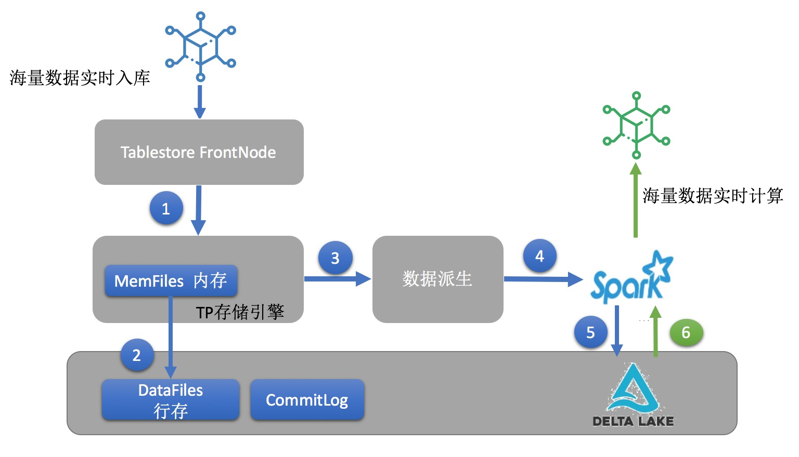

# 结构化大数据分析平台设计

## 前言 

任何线上系统都离不开数据，有些数据是业务系统自身需要的，例如系统的账号，密码，页面展示的内容等。有些数据是业务系统或者用户实时产生的，例如业务系统的日志，用户浏览访问的记录，系统的购买订单，支付信息，会员的个人资料等。大多数企业对内，对外有很多这样的线上系统，这些数据是驱动业务发展，决策和创新最核心的东西。让这些数据更好的支撑线上系统的是数据库和数据分析平台。
数据库主要承担的是线上系统的实时数据写入和根据预定好的需求进行查询，严格说就是数据库中的OLTP类型数据库。这类数据库中最为大家所熟知的就是Oracle和MySQL。业务系统对数据库的要求可能是多样的，近些年也由传统的关系型数据库融入了NoSQL数据库和NewSQL。业务系统中除了和业务直接相关的数据存储在数据库中并累积起来外，还有海量的系统监控数据，系统业务日志产生。如果我们希望这些数据可以更持久的存储并且做一些实时或者离线的分析，辅助我们的业务做决策，提供业务大盘和报表，很多公司会构建自己的数据分析平台。也就是时下『大数据』平台的由来。这类平台主要解决以下几个问题：

**1. 丰富的数据源支持和数据格式延迟绑定**

丰富的数据源是因为这样一个数据分析平台是汇总我们各类业务数据的地方，数据源可能来自各类数据库例如MySQL，MongoDB，日志源等等。这个平台需要能够方便各类数据源便捷的入库，例如通常大家会发现大数据架构中有一个Kafka，各类数据源会先进入Kafka，再由Kafka推送到大数据的存储系统中。这里Kafka就承担了解耦大数据平台的存储接口和上游数据源的作用。数据格式延时绑定是一个很重要的概念，TP类数据库往往需要根据业务需求预先定义Schema，也就是通常说的写入型Schema，数据在写入时即会做严格的数据字段类型检验。但是分析系统并不希望因为Schema约束或者限制的数据入库，通常会采用读取型Schema，也就是这里的延时绑定，数据在分析时才会根据数据类型做对应的处理。

**2. 存储和计算弹性扩展**

存储和计算弹性扩展是指大数据系统需要能支撑海量数据和保持高吞吐的读写。数据分析平台会汇总接纳各类线上系统中的各类数据，同时数据会随着时间进行累积。大数据分析平台能够支撑海量数据的存储是必须的，而且这个规模并不是预先定义好的，而是随着数据的累积弹性增加的，这里的存储量可能从TB级到PB级别，甚至数百PB。同时整套架构的计算能力也一样具备弹性，举个直观的例子，可能我们在TB级别做一次全量处理需要20分钟，是不是到了百PB级别，处理时间也翻了好几个数量级从而导致每天的分析结果不能及时产生，从而让大数据平台的价值大打折扣，限制了业务的飞速发展。

**3. 大规模低成本**  

很多大数据平台设计之初未必会意识到成本，主要依据自身对开源方案的熟悉度，业务方对数据规模和分析实效性进行方案的选取。但当业务量真的起来后，不得不面临一个挑战就是大数据平台的成本问题。这里甚至会导致不得不进行平台的架构改造或者数据迁移。所以对于企业的大数据平台设计之初，我们就需要把整套架构的成本考虑进来。这对应的就是数据的分层存储和存储计算引擎的选取。时下云上的大数据平台往往最终会选择一个可扩展，低成本的存储平台落地最终的数据，例如阿里云上的OSS或者AWS的S3，这些存储平台本身也支持进一步的分层存储。这类存储之上的计算平台可以选取Elastic MapReduce方案。整套架构就组成了时下火热的『数据湖』方案。在线下用户可能会自建一个Hadoop集群，并使用HDFS来存储这些汇总的数据，进而构建自己的大数据数据仓库。

**4. 在线业务和分析业务隔离**

隔离是因为分析业务往往需要扫描较多的数据进行分析，这类大流量的扫描如果是发生在在线库，可能会影响线上服务的SLA。同时分析流量的访问模式和在线模式未必相同，在线库数据的存储分布和格式也未必适合分析系统。所以一般典型的大数据平台会有自己的一份存储，数据分布，格式和索引会面向分析需求而做相应的优化。例如典型的TP类引擎的存储格式往往是行存，分析的时候会转变成列存。

介绍到这里，希望引导大家来思考这样一个问题，不论是传统的数据仓库，还是云上的数据湖，我们最终还是希望可以有效的解决业务中数据存储和分析的问题。那究竟业务需求是什么，尤其是当我们希望分析数据源是数据库，日志监控这类结构化或者半结构化数据时，对**大数据平台的需求是什么呢**？我想这里大家可以先思考一下，后面我们会和大家一起看看时下一些主流的开源方案和云上的构建方案，然后再来总结下结构化大数据存储和分析的需求。

## 开源大数据存储分析平台架构

前面我们提及线上业务的实现离不开OLTP数据库的支持，来实现实时的数据读写。这一章我们一起看看，开源和云上一些主流的组合数据库和大数据分析平台的架构。

### Hadoop大数据方案

方案一：Uber Hadoop大数据架构
我们以Uber的一套大数据架构为例，图中展示了各类数据库通过Kafka推送到Hadoop集群中进行全量批计算，结果集合会再写入几类存储引擎中进行结果查询展示。
在传统的Hadoop架构中，各类结构化数据例如日志数据通过采集管道进入Kafka，Spark 可以实时的消费Kafka的数据写入集群内的HDFS中。数据库例如RDS中的数据会使用Spark定期全量扫表同步到HDFS，通常周期是一天一次，在业务低峰期进行同步。这样使用HDFS存储汇总了用户的数据，对数据库数据而言其实是一个定期的snapshot。例如每天的凌晨会把行为日志与数据库中用户的信息进行联合的分析，产生当天的分析报告比如包含当天访问量汇总，用户的消费倾向等报表数据，给业务负责人决策使用。架构中之所以说RDS的数据是全量入库，主要原因是HDFS本身只是一个分布式文件存储，对Record级别的更新删除并不友好。所以为了简化这些数据库中的合并修改删除逻辑，在数据规模不大的情况下会选择全量扫描。当数据库数据较大时，例如Uber的架构中，基于HDFS开发了一套存储引擎来支持修改和删除。
这套方案的特点是，分析时数据已经是静态，借助于Hadoop集群的高并发能力，可以较为容易的实现百TB到PB量级行为数据的离线计算和处理，同时数据大块的存储在HDFS上，综合存储成本也相对较低。美中不足的是数据是定期入库，数据计算的时效性通常是T+1。如果业务方有近实时推荐的需求，这时架构会从离线计算升级到『Lambda架构』。架构如下图:

Lambda架构
具体细节可以参考[Lambda介绍](http://lambda-architecture.net/)。
通过HDFS全量存储和Kafka存储增量来实现离线和实时两类计算需求。本质上HDFS存储的全量仍然是T+1式的。但是通过Kafka对接流计算弥补实时计算的需求。也就是多了一份存储和计算逻辑实现业务实时性的需求。
不论是传统离线分析架构还是Lambda架构，结果集合可能仍然比较大，需要持久化在一个结构化存储系统中。此时的存储主要做为结果集合进行查询，例如实时大盘，报表，BI业务决策人员的即席查询等。所以主流的做法是把结果写入RDS然后同步至Elasticsearch或者直接写入Elasticsearch，这里主要希望借助于ES强大的全文检索和多字段组合查询能力。

### 分布式NoSQL数据库方案

方案二：基于分布式NoSQL数据库Hbase的大数据架构
之前的架构我们不难发现，RDS在做批计算的时候需要同步至HDFS形成静态数据做批计算。这样的架构可能会遇到一个场景，全量数据很大，每天全量同步，时效性很差甚至如果资源不够会同步不完，如何优化这个问题呢？我们不难想到如果数据仓库本身就是一个数据库，直接支持CRUD操作，那岂不是不需要同步全量！甚至部分在线数据可以直接写入这个海量数据库中，没错业界很多开源方案会基于分布式的NoSQL数据库例如Hbase来打造这个架构。上图就是一个简单的实例。Hbase schema free以及支持实时的CRUD操作，大大简化了数据源数据的实时写入，同步问题。同时可以跨数据源打造大宽表，大宽表会大大降低计算时通过join构建完整数据的复杂度。同时Hbase组合Kafka也可以实现Lambda支持批和流两类需求。那这种架构是完美的么？可以**完全替换方案一么**？
**答案肯定不是**，一方面Hbase为了支持好实时的数据写入，是采用了LSM存储引擎，新数据通过追加的方式入库，数据更新和合并依赖后台的合并优化减少读操作。这类支持数据引擎的数据读写成本是要高于直接读写HDFS静态文件。另一方面Hbase数据落盘的存储格式是按行进行组织，也就是我们通常说的行存储。行存储在数据的压缩和支持批量扫描计算上的能力远不如列存，方案一中的HDFS往往会选择Parquet或者Orc这类列存。所以当数据量增长到PB甚至数百PB时，全量使用Hbase存储进行批量分析，在性能和成本上有可能会遇到瓶颈。所以主流的Hbase方案也会结合方案一，使用HDFS加速Hbase的方式来存储各类结构化数据，从而来控制整套架构的成本和提升扩展能力。但这样的组合也同时带来一个问题，组件增多运维难度会加大。同时Hbase和HDFS中的数据数冷热分层，还是按照业务需求来划分。如果是分层场景，Hbase中的数据如何方便的流入HDFS，这些都是很实际的挑战。

### 数据库结合AP分析引擎方案

前面说的NoSQL方案本质上并没有解决数据结果集合的即席查询问题，Hbase本身可以支撑基于Rowkey查询，但是对于多字段的即席查询支持较为费力。一些高级玩家，大厂会基于Hbase对接Solr或者自己二次开发定制各类索引来加速查询，再对接Phoenix实现分布式的计算能力。这一套复杂的开发，多组件整合后本质上是希望赋予一个TP数据库AP的能力。这也自然的把我们的架构引入TP引擎结合AP引擎实现完整的分析架构。

方案三：基于ClickHouse的实时分析平台
例如上图所示，通过构建一套基于ClickHouse分析引擎的集群，各类结构化数据同步到分析引擎后可以很便捷的进行交互分析。这套架构相比之前的架构看上去简化了一些步骤，主要原因是这类引擎自身提供了类似数据库的读写能力的同时也自带一套完善的分析引擎。
业界主流的分布式AP引擎有很多，例如Druid，ClickHouse，Piont，Elasticsearch或者列存版本hbase--Kudu。这类系统也各有侧重，有擅长Append场景支持数据的预聚合再分析的例如Druid，也有以实现各类索引，通过索引的强大filter能力减少IO次数来加速分析的Elasticsearch，像Kudu直接是为了优化Hbase批量扫描能力同时保留了它的单行操作能力，把持久化的格式转成了列存。这些系统的共同点是数据都基于列存，部分引擎引入倒排索引，Bitmap索引等进一步加速查询。这套架构的好处是直接抛开了传统离线大数据架构，希望借助存储引擎本身良好的存储格式和计算下推的支持实现实时批量计算，实时展现计算结果。这套架构在GB到100TB级别，相比之前的架构有了很大的提升，此时实时计算甚至和批量离线计算的界限都变得模糊起来，TB级别的数据aggregation在秒到分钟级就可以响应，BI人员无需再像传统大数据架构下等待一个T+1的数据同步时延后再进行分钟级甚至小时级的离线计算才能拿到最终的结果，大幅加快了数据为商业带来价值的步伐。**那这套架构会是结构化大数据处理的终结者么？**当然短时间内看未必，原因是这套架构虽然具备良好的扩展能力，但是相比Hadoop方案离线处理百PB来说，在扩展能力，复杂计算场景和存储成本上还是相对弱一些。例如全索引的Elasticsearch，索引本身通常会带来三倍的存储空间膨胀，通常还需要依赖SSD这样的存储介质。其他方面这类架构会把计算需要的所有数据加载进内存做实时计算，很难支持两个大表的Join场景，如果有较重的计算逻辑也可能会影响计算的时效性。TB级以上级别数据的ETL场景也不是这类引擎所擅长的。

### 云上的数据湖Datalake方案

方案四：AWS 基于S3的数据湖方案
AWS的这套数据湖方案可以理解为是传统Hadoop方案的云上落地和升级，同时借助于云原生存储引擎S3，在保留了自建HDFS集群的分布式存储可靠性和高吞吐能力外，借助于自身强大的管道能力例如Kinesis Firehose和Glue来实现各类数据快速便捷的入数据湖，进一步降低了传统方案的运维和存储成本。这套架构示例还对大数据平台的使用者做了区分和定义，针对不同的使用场景，数据的使用方式，分析复杂度和时效性也会有不同，这也和我们前面提到方案一和二互补是相同情况。当然这套数据湖方案本身并没有解决传统方案的所有痛点，例如如何保证数据湖中的数据质量做到数据入库原子性，或者如何高效支持数据更新和删除。

#### Delta Lake

云上希望通过数据湖概念的引入，把数据进行汇总和分析。同时借助于云上分布式存储的技术红利，在保证数据的可靠性前提下大幅降低汇总数据持久化存储的成本。同时这样一个集中式的存储也使得我们的大数据分析框架自然演进到了存储计算分离的架构。存储计算分离对分析领域的影响要远大于OLTP数据库，这个也很好理解，数据随着时间不断累积，而计算是根据业务需求弹性变化，谷歌三驾马车中的GFS也是为了解决这个问题。数据湖同时很好的满足了计算需要访问不同的数据源的需求。但是数据湖中的数据源毕竟有不同，有日志类数据，静态的非结构化数据，数据库的历史归档和在线库的实时数据等等。当我们的数据源是数据库这类动态数据时，数据湖面临了新的挑战，数据更新如何和原始的数据合并呢？当用户的账号删除，我们希望把数据湖中这个用户的数据全部清除，如何处理呢？如何在批量入库的同时保证数据一致性呢。Spark商业化公司Databricks近期提出了基于数据湖之上的新方案『Delta Lake』。Delta Lake本身的存储介质还是各类数据湖，例如自建HDFS或者S3，但是通过定义新的格式，使用列存来存base数据，行的格式存储新增delta数据，进而做到支持数据操作的ACID和CRUD。并且完全兼容Spark的大数据生态，从这个角度看Databricks希望引入Delta Lake的理念，让传统Hadoop擅长分析静态文件进入分析动态数据库源的数据，离线的数据湖逐步演进到实时数据湖。也就是方案二和三想解决的问题。

介绍了这些结构化数据平台的架构后，我们再来做一下总结，其实每套架构都有自己擅长的方案和能力：

|                    | 适合场景                                                     | 数据规模 | 存储格式 | 数据导入模式    | 成本 | 计算方式  | 方案运维复杂度 | 数据变更性        |
| :----------------- | :----------------------------------------------------------- | :------- | :------- | :-------------- | :--- | :-------- | :------------- | :---------------- |
| 传统Hadoop         | 海量数据离线处理 Append为主的场景                            | 大       | 列存     | 批量离线        | 低   | MapReduce | 较高           | 不可更新 静态文件 |
| 分布式NoSQL数据库  | 海量数据，支持实时CRUD 批量离线处理，可以部分做方案一的结果存储集 | 中上     | 行存     | 实时在线        | 中   | MapReduce | 中             | 可更新            |
| 分布式分析型数据库 | 实时/近实时入库，即席查询分析，经常做为方案一的结果存储集    | 中       | 行列混合 | 实时/近实时     | 高   | MPP       | 中             | 可更新            |
| 数据湖/DeltaLake   | 海量数据离线处理，实时流计算 具备ACID和CRUD能力              | 大       | 行列混合 | 批量离线/近实时 | 低   | MapReduce | 中             | 可更新            |

通过上面对比我们不难看出，每套方案都有自己擅长和不足的地方。各方案的计算模式或者计算引擎甚至可以是一个，例如Spark，但是它们的场景和效率确相差很大，原因是什么呢？区别在于**存储引擎**。这里我们不难看出大数据的架构抛开计算引擎本身的性能外，比拼的根本其实是**存储引擎**，现在我们可以总结一下大数据分析平台的需求是什么：在线和分析库的隔离，数据平台需要具备自己的存储引擎，不依赖于在线库的数据，避免对线上库产生影响。有灵活的schema支持，数据可以在这里进行打宽合并，支持数据的CRUD，全量数据支持高效批量计算，分析结果集可以支持即席查询，实时写入支持实时流计算。

综上所述，架构的区别源自于存储引擎，那是否有一些解决方案可以融合上面的各类存储引擎的优点，进一步整合出一套更加全面，可以胜任各类业务场景，也能平衡存储成本的方案呢？ 下面我们就来一起看看构建在阿里云上的一款云原生结构化大数据存储引擎：Tablestore如何解决这些场景和需求。

## Tablestore的存储分析架构

Tablestore是阿里云自研的结构化大数据存储产品，具体产品介绍可以参考[官网](https://www.aliyun.com/product/ots)以及[权威指南](https://yq.aliyun.com/articles/699676)。Tablestore的设计理念很大程度上顾及了数据系统内对结构化大数据存储的需求，并且基于派生数据体系这个设计理念专门设计和实现了一些特色的功能，也通过派生数据能力打通融合了各类存储引擎。Tablestore的基本设计理念可以参考[这篇文章](https://yq.aliyun.com/articles/715254)的剖析。

### 大数据设计理念

- **存储计算分离架构**：采用存储计算分离架构，底层基于飞天盘古分布式文件系统，这是实现存储计算成本分离的基础。
- **CDC技术**：CDC即数据变更捕获，Tablestore的CDC技术名为Tunnel Service，支持全量和增量的实时数据订阅，并且能无缝对接Flink流计算引擎来实现表内数据的实时流计算。基于CDC技术可以很便捷的打通Tablestore内的各类引擎以及云上的其他存储引擎。
- **多存储引擎支持：**理想的数据平台希望可以拥有数据库类的行存，列存引擎，倒排引擎，也能支持数据湖方案下的HDFS或者DeltaLake，热数据采用数据库的存储引擎，冷全量数据采用更低成本数据湖方案。整套数据的热到冷可以做到全托管，根据业务场景定制数据在各引擎的生命周期。Tablestore上游基于Free Schema的行存，下游通过CDC技术派生支持列存，倒排索引，空间索引，二级索引以及云上DeltaLake和OSS，实现同时具备上述四套开源架构方案的能力。
- **数据最终的落地归档必然是数据湖OSS：**这里很好理解，当我们的热数据随着时间推移变成冷数据，数据必然会逐渐归档进入OSS，甚至是归档OSS存储中。这样可以让我们的PB级别数据实现最低成本的高可用存储。同时面对极为偶尔的全量分析场景，也可以以一个相对稳定高效的速率吞吐出想要的文件。所以在Tablestore平台上的大数据最终我们会推荐归档进入OSS。

说了这些理念基于Tablestore我们可以较为轻松的构建下面四套架构，具体的架构选型可以结合业务场景，同时可以很方便的做到动态方案切换：

1. **附加值较高的数据**，**希望具备高并发点查询，即席查询分析能力（9月已发布）**：

组合Tablestore的宽表，Tablestore Tunnel的CDC技术，索引分析引擎，这套架构类似方案2和3的融合，在具备宽表合并高吞吐低成本存储的同时，可以提供TB级别数据即席查询和分析的能力。这套架构的最大优势就是无需过度依赖额外的计算引擎，实现高效实时分析能力。

Tablestore 分析引擎方案

1. **海量数据，非高频率更新的数据，拥有云上EMR集群（即将支持敬请期待）：**

组合Tablestore的宽表，Tablestore Tunnel的数据派生CDC技术，Spark Streaming和DeltaLake，构建类似开源方案1或者4的架构。通过CDC技术，EMR集群中的Spark Streaming实时订阅Tablestore Tunnel中的增量数据写入EMR集群中的DeltaLake，借助于DeltaLake对数据CRUD的合并能力，实现数据湖支持数据修改和删除。借助于Spark集群的分析能力进行高吞吐的批量计算。

Tablestore DeltaLake 方案

1. **海量数据，更新较少的数据，有明显分区维度属性的数据（例如可用属性中的时间戳做数据分层）：**

组合Tablestore的宽表，Tablestore Tunnel的CDC技术，OSS和DLA，低成本全托管的构建方案1的架构。数据实时写入Tablestore，通过CDC技术，Tablestore会全托管的把数据定期或者同步的推送到OSS中，OSS中的数据可以借助于Spark来实现高吞吐的批量计算处理。这套方案的最大优势是存储和运维的成本都相对较低。

Table数据湖方案

1. **全引擎融合方案：**

组合Tablestore的宽表，CDC技术，多元分析引擎，同时冷数据自动归档DeltaLake/OSS。这套架构热数据实现宽表合并，秒级别即席查询和分析能力，冷数据提供离线高吞吐批量计算能力。这样的架构可以在冷热数据的存储成本和计算延时上有一个很好的平衡。

Tablestore大数据架构

总结一下，基于Tablestore的大数据架构，数据写入都是Tablestore的宽表行存引擎，通过统一写来简化整个写入链路的一致性和写入逻辑，降低写入延时。大数据的分析查询的需求是多样化的，通过数据派生驱动打通不同引擎，业务可以根据需求灵活组合派生引擎是势不可挡的趋势。同时强调数据的冷热分层，让热数据尽可能的具备最丰富的查询和分析能力，冷数据在不失基本批量计算能力的同时尽可能的减少存储成本和运维成本。这里说的大数据架构主要说批计算和交互分析这部分，如果是实时流计算需求，可以参考我们的云上[Lambda Plus架构](https://www.infoq.cn/article/vOquL47B)。
存储引擎方面Tablestore，基于分布式NoSQL数据库也就是行存做为主存储，利用数据派生CDC技术整合了分布式分析型数据库支持列存和倒排，并结合Spark生态打造Delta Lake以及基于OSS数据湖。在计算查询方面，Tablestore自身通过多维分析引擎或者DLA支持MPP，借助于Spark实现传统MapReduce大数据分析。未来我们也会规划在查询侧打通计算引擎的读取，可以做到基于查询语句选取最佳的计算引擎，例如点查命中主键索引则请求访问行存，批量load分析热数据则访问数据库列存，复杂字段组合查询和分析访问数据库列存和倒排，历史数据定期大批量扫描走DeltaLake或者OSS。我们相信一套可以基于CDC技术统一读写的融合存储引擎会成为未来云上大数据方案的发展趋势。

### 总结和展望

本篇文章我们谈了典型的开源结构化大数据架构，并重点分析了各套架构的特点。通过总结和沉淀现有的分析架构，我们引出云上结构化存储平台Tablestore在大数据分析方面具备和即将支持的能力。希望通过这套CDC驱动的大数据平台可以把TP类数据和各类AP需求做到最好的全托管融合，整套Serverless的架构让我们的计算和存储资源可以得到充分利用，让数据驱动业务发展走的更远。
如果对基于Tablestore的大数据存储分析架构感兴趣的朋友可以加入我们的技术交流群（钉钉：23307953 或者11789671），来与我们一起探讨。