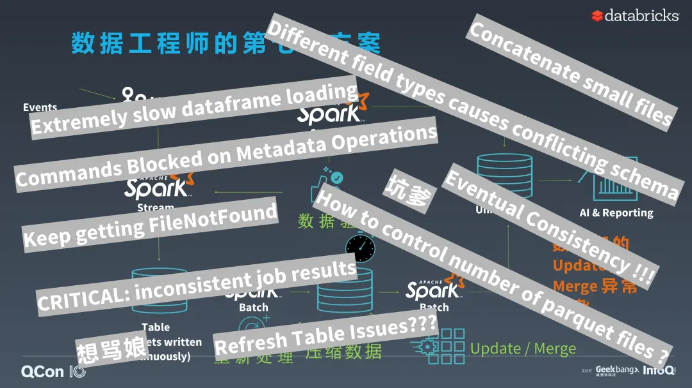
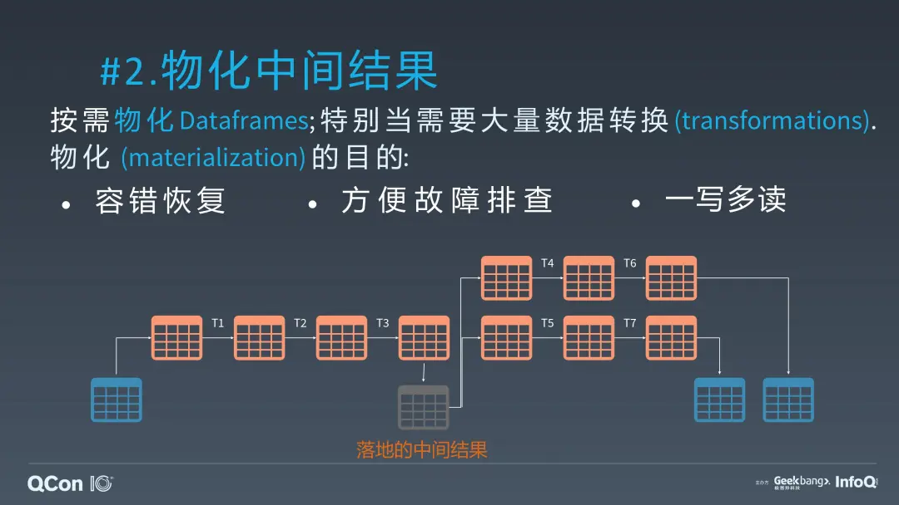

## Delta Lake，让你从复杂的Lambda架构中解放出来

今天我跟大家分享 一下 Data Lake 和 Delta 架构。

2019 年 10 月 16 日，在荷兰阿姆斯特丹举行的 Spark+AI 欧洲峰会上，Databricks 正式宣布将 Delta Lake 捐赠给了 Linux 基金会，其成为了该基金会中的一个正式项目。我们期待在今年（2019 年）或者是未来，很快， Delta Lake 将会成为数据湖的主流或者说是事实标准。

在 9 月份公布的 2019 年最佳开源软件奖名单中，Delta Lake 也榜上有名。正如官方对 Delta Lake 的颁奖评语描述，大家都很惊讶，Databricks 公司竟然把 Delta Lake 这个核心的拳头产品开源了。Delta Lake 的推出实际上是为了解决 Spark 作为大数据分析平台的诸多痛点，也相信它将会普惠整个 Spark 社区以及其他大数据社区，真正解决数据湖管理的各种关键问题。

很有幸，我参与了 Delta Lake 早期的开发，尤其是 merge、update、delete 这种关键 DML 的设计和实现。这个项目最早启动于 2017 年 6 月。当时，多位用户向我们抱怨 Spark 的不足和使用的不便，我们公司的工程师们讨论后发现，是时候去提出我们自己的存储架构。Spark 作为一种存储和计算分离的一种计算引擎，之前我们主要依赖于其他开源或非开源的项目去解决各种数据存储的问题，但实际上我们发现在用户的生产环境中，现有的存储方案都没办法真正的解决数据湖。于是乎，我们就和客户一起尝试去开发，去解决实际生产环境中的问题。经过四个月的快速开发，我们在 2017 年 10 月正式宣布了 Delta Lake 产品的诞生。在第二年 6 月份的 Spark+AI 峰会中，Apple 的工程师和我们的工程师 Michael 一起做了主题演讲，分享了 Apple 在使用 Delta Lake 的一些宝贵经验，比如说他们当时用 Delta Lake 解决了 trillion 级别数据的大表的读写。

Summit 之后，我们得到了多方的好评，目前已有超过 3000 个客户正在将 Delta Lake 用于他们的生产环境中。在这个背景中，我们认为我们应该把它推广到整个 Spark 社区，帮助整个大数据社区解决他们大数据管理的痛点。于是，2019 年 4 月，我们决定开源了。

但在开源之后，Spark 社区有很多反馈说 Delta Lake 是你们公司的一个的 Github repository，你们之后随时可能会改开源的 License，你们的开源管理模式都不是很透明。于是乎，为了解决这样的疑惑，我们决定把它捐赠给 Linux 基金会，让它成为一个标准开放的平台，让更多的人可以参与到 Delta Lake 的开发和使用中来。

今天我们将分享一些典型的场景，为什么 Delta Lake 可以解决大家的各种痛点，然后也分享一下 Delta Lake 的基本原理和 Delta 架构，以及它如何取代大家正在普遍使用的 Lambda 架构。

### 数据工程师的纠结与运维的凌乱

项目经理总会跟工程师说，我们有一个很简单的需求。可是，事实往往却是，这些简单的需求相当之难以实现。

在大数据的生产系统，往往，作为工程师的你，会面对这样的一个项目经理：“我要有这么一个 Data Pipeline，持续地处理数据，并且是增量处理，只要有新的数据来了就处理，不应该每次把所有的历史数据都重新处理，而是只应该处理增量数据，并且要保证高效快速。记住，我们不能让用户在使用中意识到这是批处理还是流处理。总之，就是快速得到正确结果。”

那么作为数据工程师的你，要建设一个基本的 Data Pipeline [数据处理流水线]，按照项目经理的说法，那就很简单。我们把 Kafka、Kinesis、各种各样数据湖的格式用 Spark 读出来，再用 Spark 做一些数据清理和数据转换，然后再把结果存到一个数据湖，再用另一个 Spark job 把数据湖的内容分析一下，做训练或者做各种各样的分析，最后产生一个报告给终端用户。这是一个非常简单的 Pipeline。但是这个 Pipeline 有个头痛的问题。如果仅仅用 Spark 的批处理，那么延迟可能不达标，而且也不是在做增量处理。

那么第二个方案就出来了，用 Spark Structured Streaming。Structured Streaming 有 Trigger Once，可以帮你记录上次处理到什么地方，这样的话可以把延迟降低，只处理增量，你也不需要去记录和管理上次处理到哪里了。可是我们又遇到了一个新的问题，就是你如果用 Structured Streaming，每个小的 Batch 都会产生多个小的 Spark 的结果文件。小文件越来越多，整个 Pipeline 就越来越慢，延迟往往到了最后就无法接受了。

为此，那我们就得选择下一个方案。我们既然有小文件，就得定期去做压缩。但是在做压缩的过程中整个作业线会下线。为什么？由于缺乏原子性读写的能力，没办法在写你的压缩的时候同时读数据。压缩的周期太长也会影响到你的生产最后报表的时效性。比如说，业务是不能接受半小时或者一个小时这种延迟的。那么，这个时候，大家自然而然会选择最经典的架构，Lambda 架构。就是说，你同时可以部署一个批处理的和一个流处理的，批可以慢一点，但是结果全面准确，而流处理就是用最快的时间对最新增量产生结果。然后将批和流的结果汇总，产生一个全局的结果。

但是这种 Lambda 架构需要同时运营两个不同的 pipeline，并且额外资源消耗也大幅增多，运营的人力和资源成本都大幅提高。

并且我们对这两个 pipeline 都需要做验证。尤其是当数据来源于非结构数据的数据源，数据不是特别干净和一致。

对于验证发现的错误，我们又不希望将 Pipeline 给宕下来，而是希望它自动去修复。那么，一种解决方案就是避免对全表做修正，而是对某些分区重新处理。数据的重新处理一般都会影响你整个 pipeline 的延迟，而且还进一步增加硬件资源的负荷和 pipeline 的复杂度。

之后也许会有一些业务上的调整，或者是诸多原因，你可能想把数据湖做一些 update 和 merge。由于当前数据湖不支持 update 和 delete，那么你可能需要自己实现 update 和 merge。我们发现不同用户的实现方法都不太一样，简直就是各显神通，这些方案不但容易出错，复杂度和延迟也很高，而且大多数情况还不通用。

复杂归复杂，但是经过了半年的研发，方案终于可以上线了，应该是一件开心的事情。可是这个 Lambda 架构上线之后你会收到无数的抱怨，比如说你这个数据加载太慢了，我们做一些元数据操作的时候，其他并行的命令和查询都没办法用，都被 block 了。不得不等这些大的数据加载，或者是元数据处理做完了才能再做别的事情。或者用户做 update 改数据湖的时候会得到大量的报告说 FileNotFound。也许是你的文件地址被更新了，但是元数据缓冲没有更新，找不到文件还需要 Refresh 缓存，但有时候客户会抱怨说 Refresh 好像不管用，可是什么时候管用呢？如果你用的 Object Store，分析到最后，可能发现是 Eventual Consistency 的问题，也许你不得不要过半小时之后才会见到这个文件……总之就是各种各样的错。

运维已经很不容易了，相煎何太急。这个 Lambda 架构费钱又费力，将大好的时光浪费到了解决系统的各种不足和局限，而不是花时间去从数据抽取价值，真是得不偿失。

但是我们再反过来看，最开始第一个方案实际上是很简单，很优美。那它到底哪里错了？是什么原因导致它最后变得这么复杂？我们缺了什么？如何可以简化来产生一个简单易维护的架构？

这里我们列出了五点原因：

1）第一，要支持同时读写，就意味着你写的时候还可以读，不应该读到一个错误的结果。同时还可以支持多个写，且能保证数据的一致性；

2）第二，可以高吞吐地从大表读取数据。大数据方案不能有诸多限制，比如，我听说有些方案里最多只可以支持几个并发读，或者读的文件太多了就不让你提交作业了。如果这样，对业务方来说，你的整个设计是不满足他的需求的；

3）第三，错误是无可避免，你要可以支持回滚，可以重做，或者可以删改这个结果，不能为了支持删改而要求业务方去做业务逻辑的调整；

4）第四，在重新改变业务逻辑的时候要对数据做重新处理，这个时候，业务是不能下线的。在数据被重新处理完成之前，数据湖的数据是要一直可被访问的；

5）第五，因为有诸多原因，数据可能会有晚到的情况，你要能处理迟到数据而不推迟下阶段的数据处理。

基于以上五点，我们基于 Delta Lake 和 Structured Streaming 产生了一个新的架构，叫 Delta 架构，它是对 Lambda 架构的一种颠覆，或者称为一种提升。

在 Delta 架构下，批流是合并的，并且要持续的进行数据处理，按需来重新处理历史数据，并且利用公有或私有云的特性来对计算或者存储资源按需分别做弹性扩展。

### Delta Lake 的基本原理

Delta Lake 的基本原理其实很简单，简单得令人发指。作为一个普通的 Partquet 一般就是 Partition Directories 再加一些 Data Files。Delta Lake 也是基于这个结构的，唯一的区别就是它有一个 Transaction Log 记录你的 Table Version 和变更历史。

现在，让我们来重新看待什么构成了一张表。表实际上是一堆操作的结果，比如说改变元数据，改变名字，改变 Schema，增加或删除一些 Partitioning，还有另外一种操作是添加或者移除文件。所有表的当前状态或者是结果，都是这一系列 Action 产生的结果。这个结果包含了当前的 元数据，文件列表，transaction 的历史，还有版本信息。

那怎么去实现这个原子性？也很简单，只要保证 Commit File 的顺序和原子性就可以了。

比如说表的第一个版本，它是增加两个文件，第二个版本就是把这两个文件删掉，增加一个新的文件，作为 Reader 来说，每次只能看到当前已经 Commit 的结果。

怎么实现多个写入的并发？Spark 的 Pipeline 一般都是高并发读，低并发写。在这种情况下，乐观并发就更加合适了。它实际上很简单，就说你多个用户读的时候，先记录一下当前读用的 data 版本是什么，如果同时有两个人都在 commit，只有一方可以成功，而另一方就需要去看一下成功方之前的 commit 里有没有碰他读的文件。如果没有改，他就改一下文件名就行了，如果改了，那就得重做。这个可以是 Delta Lake 自动去重试，也可以是事务提交方 / 业务方，去重做。

Delta Lake 需要解决的另一个经典问题就是大规模元数据的处理。你发现你有大量的 commit log file，因为每次 commit 都会产生一个文件，这其实也是一个经典的小文件处理。如何解决这种元数据处理？标准答案就是使用 Spark。Delta Lake 便是使用 Spark 去处理它的元数据。比如刚才说了一个例子，加了两个文件，减了两个文件，之后加了一个 parquet，之后 Spark 会把这些 commit 全部读下来，产生一个新的，我们称之为叫 Checkpoint。

这就是 Delta Lake，就是这么简单。

### Delta 架构

#### Delta 架构简介

我们看一下 Delta 架构 ，怎么用 Delta 架构代替经典的 Lambda 架构。

1）第一，同时读写，并且要保证数据的一致性

就是刚才我们提出的第一个需求，就是要支持 transcation，就是说你只要能实现读写之间的 Snapshot isolation 就行了，这样你可以集中在你的 data flow，而不用担心会不会读到部分结果，不用担心 FileNotFound 的这类错误，这些事情 Delta Lake 都可以帮你处理。

Delta Lake 提供了流，就是 streaming 和 batch 的读入和写入，标准 API，很容易实现，很容易去用。你可以在文档里面找到具体的 API。

2）可以高吞吐从大表读取数据

可能处理过大数据的同学们就遇到过这个经典痛点，我也处理过客户的这种问题好多次，在 没有 Delta Lake 的时候，简直痛不欲生。

如果没有 Delta Lake，读取百万级的 patition 的 location path 是需要用 Hive metastore 一行行地读的，要取一百万行简直是奇慢无比。然后，在每个 patition 的 地址里还需要通过文件系统 列里面包含的所有文件。这在对象存储的系统里，这种操作也是又贵又慢。

其实这个问题不又是一个典型的大数据问题吗？大数据系统都解决不了大数据问题，那不是贻笑大方？

当然，这里的解决方案很简单，就是标准的 Spark，用 parquet 去存 file path，并且用 Spark 的分布式的向量化的读入去读，这就是 Delta Lake 怎么去解决之前的痛点。我们客户因为这个性能轻松地提高了几百倍甚至几千倍。其实也就是因为 Hive metastore 和文件系统的 list file 操作实在太慢了。

3）支持回滚和删改

数据这么脏，回滚和删改需求难以避免。Delta Lake 提供了 Time travel，因为 transaction log 实际能看到整个历史变化的结果，所以 Delta Lake 实现这个很方便。我们提供了两条 API，你可以基于 Timestamp 去做， 也可以基于 version number。Time travel 是一个特别好的功能，它可以做很多事情，不单单是纠错，你还可以 Debug，重建过往报告，查账，审计，复杂的 temporal query，对快速更新数据的表做版本查询……

Delta Lake 还支持删改（update/delete/merge），不过目前 Delta 还没有自己的 SQL 语法，当然我们可以把 Spark 的语法完全复制过来，但是维护成本也很高。但 Spark 3.0 来了之后这个问题就迎刃而解了。当然，如果要支持 Spark 2.4 的话，Delta 需要加上自己的 SQL parser，我们还在讨论要不要这样干。

4）在线业务不下线的同时可以重新处理历史数据

你只要对 Delta Lake 做相关结果的删除，重新改一下业务逻辑，历史数据再做批处理，你就可以得到你的最新结果了。与此同时，因为 Delta Lake 支持 ACID，数据的下游适用方还可以同时访问之前版本的数据。

5）处理迟到数据而无需推迟下阶段的数据处理

处理迟到数据也不是什么问题，只要你能支持 merge，如果存在就 update，不存在就 insert，不影响你现有的 Delta Lake 重写。

如上所述， Delta Lake 完美解决了我们的需求，让大家的 Data pipeline 重新变得简单而优雅，而不需要用那么复杂的 Lambda 架构了。

怎么最好地使用 Delta 架构 ？基于跟客户的各种的讨论经验，我们总结出了下面几点。

你需要有多个 stage 的 Delta Lake。我们的基本 idea 是这样的：第一个 stage 就是你要保证没有原始数据损失。它保存在 Delta Lake 里，万一哪天发现之前的一些数据清理导致丢失了很重要的信息，你还可以轻松恢复。第二个 stage 就是做数据清理，做一些清理、转换、filter。然后才真正达到一个可以被数据分析的第三个 stage。这是基于数据质量分成多个级别，多个状态。至于实际生产线上需要多少个 stage，这个取决于业务的复杂度，SLA，和对延迟的要求。

#### Delta 架构的特性

来看一下 Delta 架构的特性。

1）持续数据流

这听起来好像很高大上，但实际上稍微解释多一点就很容易明白。

批流合并。Streaming 和 batch 用同一个 engine，不用维护多个；同一套 API，甚至都不用 batch 的 API，就用 streaming 的 API 就能解决问题；同样的 user code，无需用到 Lambda 架构，纯粹就是一条 pipeline 解决所有问题。高效增量数据载入。如果不断有新数据进来就直接用 Structured Streaming 的 Trigger.Once 去记录上一次你处理到哪，你只需要重启这个 Trigger.Once，就处理了上次之后的新数据, 特别方便。快速无延迟的流处理，你可以选择不同的 Trigger 的模式，当然 Trigger.Once 最省钱，当然你也可以低延迟，比如多长时间 Trigger 一次，也可以低延迟用持续 Trigger。你可以把批处理变成一个持续流处理，简单易用。而且 Delta Lake 因为支持原子性，所以它能保证 exactly once，这一点很重要，其他的数据源基本没办法保证。

2）物化中间结果

这一点就有点颠覆传统模式了。我们建议多次物化你的中间结果，也就是之前说的多个 stage。每个 stage 就是把中间结果落地存在文件里，它有以下好处。

容错恢复，出问题后可以回到某一个版本，从那个时候再开始，你不需要从最原始的数据开始，这点在 pipeline 里是很重要的事情。方便故障排查，你知道哪一步出错了，要是不存，业务方报告出错的时候你也不知道问题出在哪儿，连 debug 都没法 debug，回溯都没办法回溯。一写多读，当你的 pipeline 很多很复杂的时候，可能重用中间的一些结果，这真的很方便。这里面比如说图例的两个 pipeline ，其实到 T3 之前，都是一样的。我们就可以复用。

如果你的转换很复杂的时候，可以物化多次。到底物化多少次，取决于你对 Reliability/SLA 和 end-2-end latency 的取舍，你要是 Reliability/SLA 好，你就必须要物化多几次，但是写肯定有代价，所以 end-2-end latency 就慢，具体就要看你的需求了。

3）费用和延迟的取舍

流处理，持续的数据流入和处理，无需作业调度管理，需要永远在线的 cluster。频繁的批处理，分钟级数据流入和处理，不需要低延迟，比如半小时就可以了，需要 warm pool of machine，无事关机，按需启动。可使用 Spark structured streaming 的 Trigger.Once 模式。非频繁批处理，若干小时或若干天的数据批流入和处理，无事关机，按需启动，也可使用 structured streaming 的 Trigger.Once 模式。这样一来，就可以节省很多资源了。

4）优化数据的物理存储

根据常用查询的 predicate，为改善读取速度，可优化数据的物理存储。比如，用 partitioning 和 z-ordering。Partitioning 大家都应该很清楚了，low cardinality 的 column 比较合适，就是每个 partition 不要超过 1 GB，一般比如说用 date 这是一种经常被使用的 partition column，每个 date 里面要给予不同的 eventType。这样，每个 partition 不会太大，也不会产生太多 partition。反之如果用 timestamp 做 partition column，产生的 partition value 就是无数个，简直奇葩无比，可以轻松把 Hive metastore 给撑爆。在 Delta Lake 里面我们也不建议，即使我们不用 metastore。第二就是 Z-Ordering，这个还没到开源的版本，但是这个是可以解决什么问题呢，就是是针对那种 high cardinality，就是 column 里有大量的不一样的 value，这种就适合做 z-ordering index。

5）重新处理历史数据

每次 keep 住上一个 stage 的好处是什么？你把结果一删，重新用 Tigger.Once 再做一次就好了，结果就出来了。如果你系统部署在云上，那对你来说也很简单，你如果要快速回填，你就再多加几台机器，结果就更快地出来了。比如，从原来的十台机器扩张到一百台。

6) 数据质量的调整

这是也是一个需要改变大家思维方式的地方。

在最开始的时候，我们最好是保证数据完整性。schema 可以选择自动合并，就可以避免数据的丢失。到了最后阶段，我们就需要去强制 schema 不能变，data type 不能变，data expectation 也不能。比如，不能有 NULL。数据质量对于数据分析的准确度是至关重要的。

以上特性也不是很难理解，但是需要改变思维方式。

#### Delta 架构的优点

1）减少端到端的 pipeline SLA多个使用单位（客户）把 data pipeline 的 SLA 从几小时减少到几分钟。

2）减少 pipeline 的维护成本原来的 Lambda 架构简直就是费时费力。要同样达到分钟级的用例延迟，Delta Lake 架构并不需要这么复杂。

3）更容易的处理数据更新和删除简化了 Change data capture，GDPR，Sessionization，数据去冗。这些都可以用 Delta Lake 去实现，方便很多。

4）通过计算和存储的分离和可弹缩而降低了 infrastructure 的费用多个使用单位将 infrastructure 的费用降低了超过十倍。

### Delta 架构的经典案例

这里分享 3 个 Delta 架构的经典方案。

第一个是 COMCAST，一个像中国移动的通讯类公司，它收集了美国海量的用户数据。它的 Petabyte-scale jobs 使用 Delta Lake ，从原来需要 640 个服务器降到 64 个，原来是 84 个 job 降低到 34 个 job，延迟还降了一半。

第二个是 Sam‘s Club，它们也是使用 Delta Lake ，原来根本达不到数据的一致性，现在可以达到。延迟从一个小时降到六秒。

第三个就是澳洲的 healthdirect，数据更干净更一致了，做数据分析匹配的准确度从 80% 升到 95%，数据加载的时耗从一天降到了 20 分钟。

这都是来自于 Delta Lake 用户在 Spark Summit 上分享的案例。

使用 Delta Lake 特别简单，就把 parquet 的 keywords 一换。

怎么加这个 Delta Lake 呢，把这个 package 加上就好了。具体方法见 demo 演示：Delta Lake Primer（[https://dbricks.co/dlw-01](https://yq.aliyun.com/go/articleRenderRedirect?url=https%3A%2F%2Fdbricks.co%2Fdlw-01)）。

### Delta 社区

Delta Lake 迭代挺快的，我们内部实际上还有大量的 feature，只是还没有开源，我们会逐步开源并且加强研发。

阿里巴巴的团队在帮 Delta Lake 做让 Hive 可以读 Delta Lake 里面的数据。

Delta Lake 的社区发展也真的很快，从 2019 年 4 月份开源，目前已有 3700 个客户，maven 的下载量快两万，我们自己客户使用量已经达到超过 2 exabyte 的读和写。

欢迎大家现在开始创造你自己的 Delta Lake ，踊跃参加 Delta Lake 的社区，[https://delta.io/](https://yq.aliyun.com/go/articleRenderRedirect?url=https%3A%2F%2Fdelta.io%2F) 有个 Slack Channel，大家可以看到各种各样的问题，我们的工程师和专家们都在积极回应各种问题。

\----