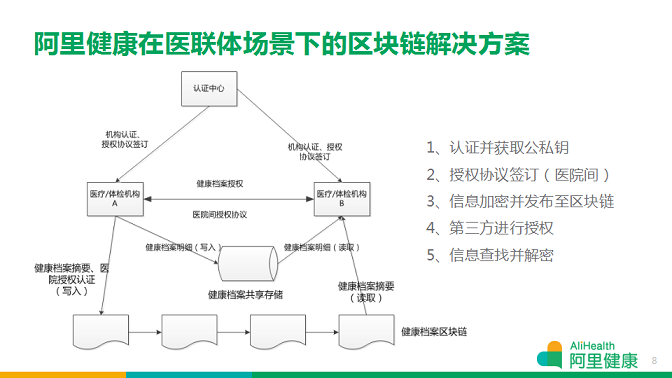
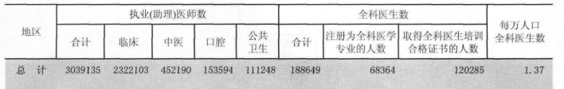
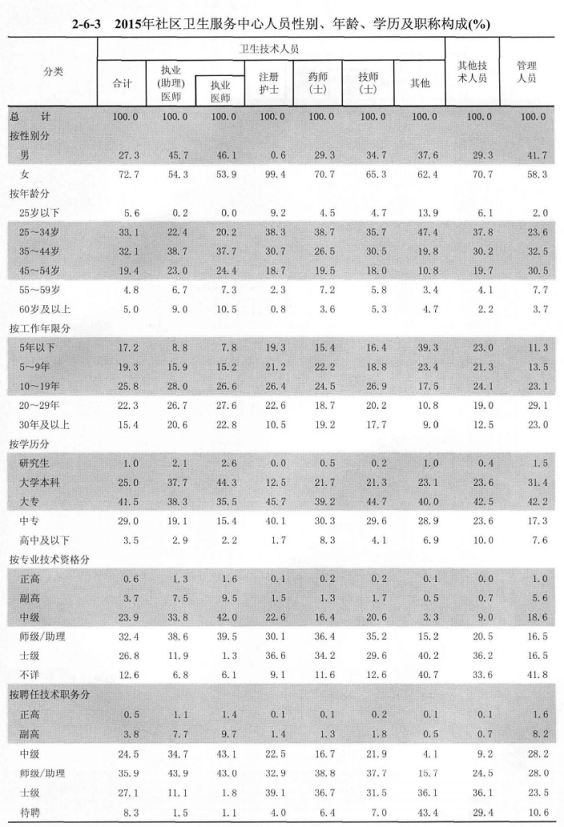

# 优秀的医疗大数据和AI公司，都在围绕电子病历的六个应用场景做文章

从市场情况来看，目前电子病历在临床中的使用主要有这6大难题：

1、电子病历系统难以满足病种专业化需求，特别是医生在重大疾病领域对临床数据的个性化需求。

2、电子病历操作繁琐，医生在录入数据时，难免会出现倦怠，这样一来，录入的数据的真实性就会大打折扣。

3、电子病历数据的互联互通。这包含两个方面，一是医院内部电子病历与其它HIS等系统的结合。第二是政府级的区域共享平台，它的任务主要是数据的抓取和医院之间的信息互联互通。在这两个过程中，需要通过更加先进和完备的技术，保证数据存储和共享的安全性。

4、医院内基于电子病历部署大数据平台，应用于科研或临床，需要让每家医院每款软件背后的软件公司开放数据接口。但企业往往漫天要价、消极配合、一拖再拖。如果没有一个有效的平台集中存储大规模多源异构的医疗数据，数据的挖掘就只能手工作坊式地进行。

5、由于过去医生在使用电子病历时缺乏数据结构化录入，更多是用文字的形式记录下来，八股文较多。就像在word里写记录报告，医院过往的电子病历中留存着大段的自然段落。这让医院的质控、数据利用等方面存在困难。所以，如何将这些存量数据进行准确地结构化处理，是现阶段的一大难题。

6、基层全科医生由于经验缺乏，时常出现造成误诊、漏诊，进而造成严重的医患危机。而目前大医院的电子病历的临床诊疗相关价值尚未被系统性挖掘出来。再加上大医院医生的忙碌，很难真正将先进的诊疗经验带到基层。因此，基于大医院电子病历数据的临床辅助决策系统成了未来的发展方向。

正是由于这些难题存在，所以才给一些新型的AI和大数据公司带来了发展机会。根据动脉网的观察，目前它们普遍在以下6个场景开展服务：

> 1、病种专业化平台
> 2、智能语音录入
> 3、区块链技术
> 4、多源异构数据挖掘
> 5、自然语言识别
> 6、临床决策支持

## 1、病种专业化平台，医疗大数据的源头创新——博识医疗云

中国的疾病诊断与治疗发展到今天，高度缺乏病种专业化工具。越是垂直的领域，就越是缺乏趁手的数据工具。作为医院的临床数据承载平台，现阶段的电子病历系统在设计理念和使用上都过于陈旧，难以应对医生在重大疾病领域内对数据瞬息万变的需求。

例如，医生要做研究，回顾性数据是第一步。由于现有系统在数据维度和病种专业度上的局限性，很多医生还在使用原始的excel方式进行病历的录入。要想把数据分解成不同的课题，例如只关注病理分型和用药疗效之间的相关性，那么医生就得把所有非相关信息剥离，然后再做一个表格，对有用的信息进行分析。这个过程中，医生往往会收集几百上千例的患者数据，花掉整个研究周期80%的时间，而真正产出的环节只会用到20%的时间。

博识医疗云，能够在标准化结构和统一化用语的前提下，满足医院临床数据不断加速的迭代需求。使用博识医疗云，能够让医生的每一个病例根据输入的不同字段，得到想要的信息。按照疾病种类的不同，它还能帮助医院实现个性化、标准化数据整合，最终打通患者健康数据与诊疗数据的隔阂，从而形成真正意义上的健康医疗大数据。

以博识医疗云在胸外科的表单为例，其最复杂的表单字段数超过2700个。这意味着，医生在使用这套表单时可选择关注的数据维度超过2700个。在技术和产品上要实现，需要团队与使用者进行长期、深度地需求分析与沟通合作。
之所以博识医疗云会涉及如此多的维度，是因为在临床领域，大数据和小数据的地位其实同等重要。特殊数据案例在统计学上被称为离群值，是因为它影响到了大数据的统计计算而被剔除。但从科研角度来说，单个特殊病例具有特殊意义，它对医生了解特殊个体从而发展出创新的思路和方法具有很大的临床研究价值。只有将患者数据做到病种专业化甚至科室和医生个性化，才有可能同时关注到大数据和小数据。
其次，基于对病种专业化的支持，博识医疗云能够实现几十家医院、几百位医生上千份病历的MDT。不同科室、不同医生、不同病历表单之间的交叉验证互补，从不同的维度，让MDT的价值实现最大化。

另外，人工智能的开发基础和长期优化需要高质、持续的数据。传统HIS系统里的数据，由于其历史因素造成的数据质量和维度的不足，使得利用这些数据训练出来的AI在准确度和泛用性上很难真正应用于临床。

因此，只有保证原始数据的专业化质量、结构化整合，及多样化维度，才能让未来开发具有真实性和准确性的人工智能变得可能。博识医疗云已经在这个方向上深度布局，并将通过与中科院数据科学中心合作的医疗大数据联合实验室推出数个重大专科疾病的智能辅助诊断平台。
目前，博识医疗云已经覆盖了几乎全部重大疾病领域，包括：肿瘤、血液、骨科、神经内科、神经外科、精神科、呼吸系统疾病等。在全国400余家三甲医院的超过3000个临床科室实现了落地应用，其中肿瘤（含血液肿瘤）相关科室超过1400个。

## 2、智能语音录入，解放医生双手——云知声

云知声是一家专注物联网人工智能服务。公司利用机器学习平台（深度学习、增强学习、贝叶斯学习），在语音技术、语言技术、知识计算、大数据分析等领域建立了领先的核心技术体系，这些技术共同构成了云知声完整的人工智能技术图谱。在应用层面， AI芯、AIUI、AI Service三大解决方案支撑起云知声核心技术的落地和实现。

云知声智能医疗语音录入系统以云知声专业的面向医疗领域的高性能识别引擎为基础，以飞利浦手持式外设录入设备为辅；通过该外设录入设备即可与医院内各系统完美对接，通过语音来高效的处理大量文本录入工作，通过语音和手持设备上的功能键与院内HIS、PCS系统等交互起来。

另外，云知声还研发出国内医学领域首个语音识别引擎针对医学数据库(数百万的医学专有名词、数千小时的语料积累、极其复杂的中英文混合表述方式)做了大量模型优化。

为了可以精准识别，云知声还为医院做了深度定制，深度定制的医疗语音识别模型根据不同科室、不同病种的整段病历资料，运算出关键词句语料，为40多个临床和医技科室提供分场景支持。

尤其在神经科、免疫内科、血液科、普通内科等疑难杂症患者多的科室应用效果好，目前这个语音识别准确率达到95%以上，个别科室的语音识别率甚至超过98%，同时辅助以云端语义校正技术，整体识别率接近100%。

医生通过语音录入方式不仅提高了工作效率的同时，语音录入还能有效避免复制粘贴操作，规范病历输入，增加病历输入安全性。目前，这个系统可以有效节省医生超过38%的时间。

自从面向医疗的整体方案推出以来，云知声已经在全国20多家有代表性的大型综合三甲医院正式上线使用，这些医院分布在华中、华北、华南、西部等地，其中包括北京协和医院，北大人民医院，第四军医大学西京医院，香港大学深圳医院等，还有约40家医院正处于试运行阶段。

## 3、区块链技术，解决电子病历数据共享和安全问题——阿里健康

区块链的概念并不复杂，它主要由三部分构成：一个分布广泛的网络，一个有效准入身份的共享账户，以及数字交易。

医疗方面，区块链最主要的应用是对个人医疗记录的保存，可以理解为区块链上的电子病历。如果把病历想象成一个账本，原本它是掌握在各个医院手上的，患者自己并不掌握，所以病人就没有办法获得自己的医疗记录和历史情况，这对患者就医会造成很大的困扰，因为医生无法详尽了解到你的病史记录。

但如果用区块链技术来进行保存，就有了个人医疗的历史数据，看病也好，对自己的健康做规划也好，就有历史数据可供使用，而这个数据真正的掌握者是患者自己，而不是某个医院或第三方机构。

2017年8月17日，阿里健康宣布与常州市合作的“医联体+区块链”试点项目已落地，据介绍，区块链技术已被应用于常州市医联体底层技术架构体系中，并实现当地部分医疗机构之间安全、可控的数据互联互通。

据悉，常州市郑陆镇卫生院是一家社区医院，为14万人口提供基层医疗服务，每月接诊量在3万人次左右。据院长张志宏表示，此前每家医疗机构的庞大信息，都需要分散传送到市医疗机构信息平台。但是各医疗机构之间并不互通，很多业务诉求都没法实现。此外，如何保证个人隐私的健康信息在流通存储中的安全也是原平台面临的难题。

使用区块链技术，能够很好地解决医疗机构互联互通和信息存储安全的问题。

以分级诊疗就医体验为例：居民就近卫生院体检，通过在区块链上的体检报告分析，筛查出心脑血管慢病高危患者，5%左右的需转诊患者可以由社区医生通过区块链实现病历向上级医院的授权和流转，而上级医院的医生，在被授权后可迅速了解病人的过往病史和体检信息，病人也不需要重复做不必要的二次基础检查，享受医联体内各级医生的 “管家式”全程医疗服务，实现早发现早诊疗的“治未病”。

阿里健康区块链技术利用旧有的IT设备和系统将信息串联在一起，相比传统信息化方式，接入成本更低，安全性也更高。

## 4、多源异构数据挖掘，打破医院信息孤岛——大数医达

由于历史原因， 我国医院同时运行着百多种医疗信息化系统，这些多源、异构的系统彼此割裂，指使各医疗数据处于孤岛状态，无法得到有效利用。而且，信息化厂商往往通过接口收取高额的费用。

大数医达与医院合作，无须和原系统对接，利用大数据技术完成多源、结构和非结构数据的清洗、脱敏、结构化、标准化，使得医院能够一统原先分裂的医疗数据，形成互联互通的医疗大数据平台，为实现大数据处理和分析奠定数据基础。

一家医院，大数医达甚至可以挖掘到近20年的数据。

大数医达通过将肿瘤患者分散在HIS、EMR、LIS、PACS等院内系统中的病历记录进行融合处理，以时间轴集成视图方式展现每位患者的门诊、住院病历信息。

过去一家做HIS的公司想做患者的信息统计，需要自己采集数据或者是跟其他的系统进行协作，开放数据接口之后把数据读取出来。现在只需要与大数医达一家公司合作，二次开发的工作量降低了许多。

另外，大数医达还能实现医疗数据的快速检索，提供基于医疗大数据平台的病历智能检索服务。通过将百度、谷歌等互联网信息搜索技术应用于病案检索，方便医生快速检索海量病历记录。例如，医生可在1秒钟内快速检索出所有病理报告确诊“乳腺癌”，或“癌胚抗原（CEA）大于5”的患者病历。

除了互联互通之外，三甲医院还会有一些管理统计的需求。例如，医院统计科主要工作职责是负责在日常工作中收集、整理医院医疗过程和管理过程中的各种信息，运用统计学理论和方法对医院的各项工作信息进行科学的加工和整理、监测和分析，完成各种数据报表的整理归纳统计分析。

医院领导往往需要了解一些异常指标的原因，如科室与疾病的药占比高的异常原因，这就需要统计科基于HIS进行数据检索。有了大数据平台，统计科就能很轻松完成这项任务。

在大数据平台的基础上，大数医达还开发了一款AI医生助手，基于对海量病历信息的深度学习，提取出智能诊断模型，应用于辅助医生完成临床诊断及临床教学工作。

例如，诊断模型可以根据医生提供的患者信息、主诉、病史、化验、检查等信息，智能推荐出可供鉴别的疾病列表和对应概率，并将类似病历中的统计信息提供给医生作为参考。

## 5、自然语言识别，实现病历后结构化处理——森亿智能

森亿智能是一家专注于利用人工智能进行医学文本自动分析和二次应用的医疗人工智能公司，直面医疗大数据中非结构化数据的利用难题。

公司拥有自主研发的中文医学文本自然语言处理技术，可实现海量临床非结构化电子数据（住院病历、门诊病历、影像学报告、病理报告、体检报告）的后结构化和标准化处理，旨在用人工智能方法取代医学文本的人工阅读与分析，杜绝医疗数据的浪费，通过研发和推广医疗人工智能产品，提高医疗生产力，提升医疗安全，以纾解中国医疗困境。

作为专业的医疗人工智能技术提供商，森亿智能已开发出一套成熟的中文医学自然语言处理流程系统，可灵活配置颗粒度等属性，可开放中文病历语义API，为客户提供无缝对接不同的平台和系统的可插拔式模块。

森亿智能的人工智能系统像一个有经验的医生一样，可以精准完整的读懂病历所表达的含义，并消解其中的歧义。系统利用自然语言处理技术，深度挖掘和分析医疗文本的信息，它可以快速批量抓取病历中的信息生成一个结构化数据库，这个抓取环节可以为医生节省数月的时间，把这个过程的耗时压缩到几秒。

目前该系统全科室综合准确率在92%，可以识别13大类临床变量，识别19类变量语言关联，可实现全自动生成结构化数据库。更重要的是，森亿的自然语言处理不依赖任何人工规则，在面对新的病种、新的病历时，完全通过机器学习来完成模型构建，从而使得产品在面对不同场景时实现灵活定制、高速迭代。

正是由于系统速度快、准确率高的特点，即使面对目前各大医院IT系统的标准不一这种情况，森亿智能也可以迅速将慢病管理、健康平台、保险公司、HIS系统乃至药企等客户所需的数据，结构化处理，做出实际有说服力的案例，以促进行业的发展。

目前，森亿智能已服务于十余所国内知名三甲医院的多个科室、以及十余个医疗IT、医疗数据企业，服务内容是依据医院、医疗IT企业、保险、药企等B端客户的需求，将病历结构化、可视化处理，将处理后的数据应用到临床科研、医保控费、药物研发和临床决策支持等方面。

## 6、临床决策支持系统，辅助全科医生——零氪科技

《中国卫生和计划生育统计年鉴2016》中的数据显示，我国全科医生数量约为188649人，每万人口全科医生数仅为1.37人，可以看出，目前我国全科医生数量十分匮乏。

另外，从我国社区卫生中心的人员学历来看，其中41.5%都为大专学历，只有1%的人员为研究生学历，由此可见，基层医生的医疗水平普遍不高。

医疗大数据取之于大医院，同时也会在基层医院落地应用。零氪科技旗下HUBBLE医疗大数据辅助决策系统通过对海量病历进行深度挖掘与学习，将专家经验提炼成AI模型算法服务于全科医生，能够提高他们的临床工作效率，缓解基层医生资源不足的问题。

临床对于辅助诊断的要求甚高，医学数据或者说辅助诊断场景里，对于结论的可推测性——因果推测链条要求十分严格。在这个场景下，大数据里常用的基于相关性结论的应用和产品设计，并不适用于医学这个特殊领域。

因此，必须要从统一标准的角度入手，利用深度学习构建辅助诊断的模型，最大限度地降低医生的工作量，同时又能尽可能的以客观公正的态度帮助医生提出第三方诊疗建议。这样一来，就能避免基层全科医生由于经验缺乏，造成误诊、漏诊的情况。

在辅助医生决策方面，零氪科技旗下的HUBBLE医疗大数据辅助决策系统是目前的明星产品，它主要可以实现以下功能：

1、辅助管理决策，HUBBLE通过院长面板、业务报表，为合作医院和科室智能化“诊断”医院质量管理中可能存在问题，通过患者分析、医疗质量分析、运营效率分析等六大模块可视化的展现出来，为医院管理决策提供数据依据；

2、HUBBLE基于海量的临床病历数据和影像数据，结合医学专家精准的样本标注数据，通过人工智能技术，让机器有效学习专家知识，输出智能化辅诊及影像诊断服务，能够为基层医生发现和确诊疾病、提升诊疗效率提供帮助。

HUBBLE医疗大数据辅助决策系统的核心运营机制基于海量的医疗大数据，同时将各学科专家的经验囊括到系统中，技术人员应用先进的IT技术、深度学习算法等针对肿瘤领域进行专业的定制，从而提供可视化、场景化、智能化的系统解决方案提供给医生。而且医生在使用过程中的反馈，又能够不断的优化系统，提升系统的准确性。

目前，HUBBLE医疗大数据辅助决策系统已经在海南医学院第一附属医院、安阳市肿瘤医院、河南省肿瘤医院和天津市肿瘤医院实现了落地。

## 6大应用场景，贯穿电子病历数据产生的前、中、后三个阶段

电子病历的6大应用场景，我们可以将其按照数据产生前、中、后，分为三个阶段的应用。如病种专业化平台博识医疗云、云知声病历智能语音录入，都可以看做是数据产生前的应用。疾病专业化工具和区块链技术，则可以看做是数据产生时所涉及到的包括数据共享、存储和安全在内的应用。而自然语言识别、结构化多源异构数据挖掘和临床决策支持，则是基于数据产生后，数据的后结构化、互联互通以及辅助诊断的应用。

由此可见，电子病历作为健康医疗大数据的基础数据库之一，企业围绕它的任何一个环节所进行的创新，都存在着较大的市场机会。同时，这也再一次从侧面反映了电子病历未来在AI和大数据所处的核心地位。