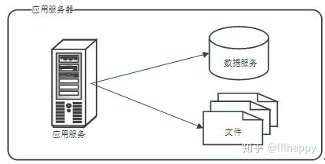
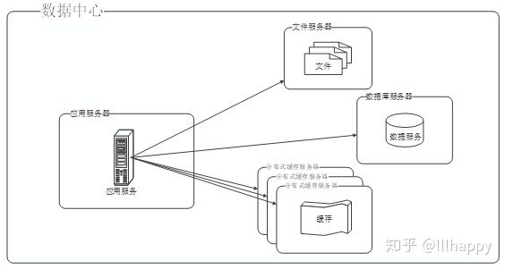
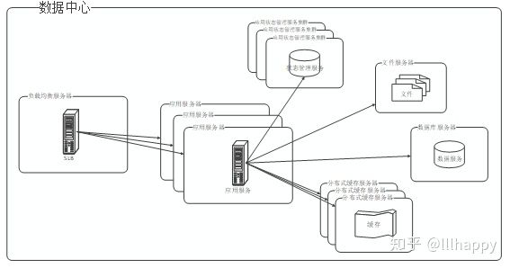
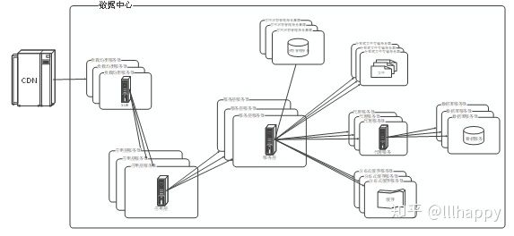
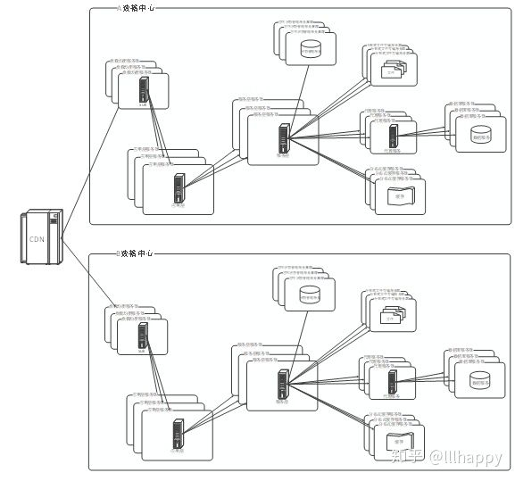
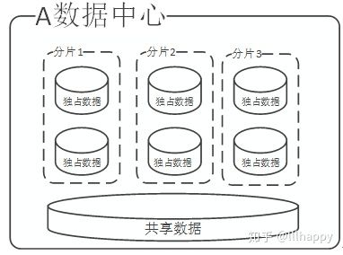
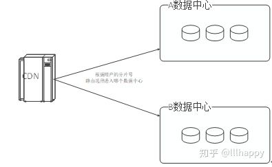
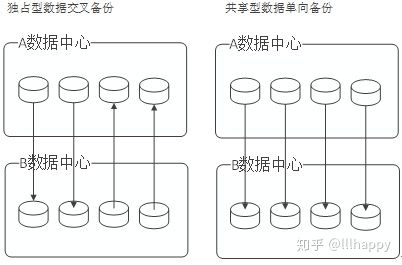
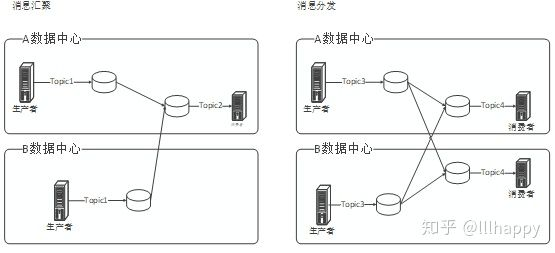
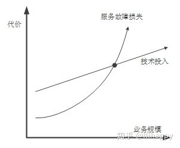

# 多数据中心多活技术架构实践

**一、概述**

2018年10月17日，YouTube全球大范围宕机；2017年2月28日，百度移动端APP无法搜索内容；2015年5月27日，支付宝出现故障，导致全国大面积无法访问；2014年6月19日，Facebook大面积瘫痪。这些大型互联网公司一旦出现服务中断，各种媒体争相报道，对公司声誉带来极大的负面影响，并且造成可观的直接经济损失。

《[证券期货业信息安全事件报告与调查处理办法](https://link.zhihu.com/?target=http%3A//www.csrc.gov.cn/pub/newsite/flb/flfg/bmgf/zh/wlyaq/201310/t20131016_236287.html)》第十条规定：证券交易所交易、通信、行情发布系统在开市前无法正常启动或者中断达到20分钟以上的定性为特别重大事件。由此可见，构建一个高可用的系统非常重要。所谓高可用性H.A.（High Availability）指的是通过尽量缩短因日常维护操作（计划）和突发的系统崩溃（非计划）所导致的停机时间，以提高系统和应用的可用性。随着信息技术的发展与应用，大型网站也经历了不断的更新迭代，并日趋成熟，一些大型网站SLA的可用性已经可以做到4个9（99.99%），甚至可以做到5个9（99.999%）。

**二、大型网站技术架构演进**

高可用的大型网站并不是一蹴而就搭建起来的。大多数网站一开始都是一个单体应用程序，随着业务的增长和用户的扩大，通过不断的系统重构，逐渐研发为一个大型网站。一般网站的演进历程可归纳为如下5个阶段：

**1.单体应用程序阶段：**应用起步阶段业务简单、用户少，系统功能集中在一个工程中，采用单机单服务部署。

**2.应用服务和数据服务分离阶段：**随着业务的发展、用户的增加，一台服务器逐渐不能满足需求，服务性能降低、数据存储空间不足。需要将应用服务和数据服务相互分离，采用CPU更强大的服务器作为应用服务器，采用存储介质更好的服务器作为数据服务器。

**3.集群部署阶段：**随着业务的壮大，单节点不能满足性能要求，服务故障损失越来越高，需要使用负载均衡技术，对网站使用集群部署，提高系统的并发能力和快速故障转移能力，同时建立集中的状态管理机制。

**4.分布式服务阶段：**当业务不断复杂，系统变的臃肿庞大，牵一发而动全身，每一次系统发布上线都是一场巨大的考验，对系统进行切分分而治之。横向切分：将系统拆分为应用层、服务层、数据层，每层之间通过接口交互，独立演化。纵向切分：将庞大的系统按着业务聚合拆分为多个系统，各系统之间通过接口依赖，独立维护。

**5.多数据中心多活阶段：**将系统部署在单个数据中心，总是会出现一些不可预知的因素导致整个机房不可用，此时需要采取多数据中心多活部署，将故障转移能力从单数据中心扩展到多数据中心。

**三、多数据中心多活技术架构**

多数据中心多活架构是部署在多地的多个数据中心同时对外提供服务，当某个数据中心出现灾难性事故时，可以将整个数据中心的流量划拨到其他数据中心，实现快速故障转移。该方案的总体思路包含六步：第一步，对数据进行分类；第二步：对数据进行切分；第三步：对服务进行分类；第四步：设置服务路由策略；第五步：对数据进行备份；第六步：保证应用无状态。完成以上步骤，即可通过调整路由策略实现流量在多数据中心之间任意划拨。

**1.数据分类：**从数据的使用性质上我们将数据划分为独占数据和共享数据。

独占数据：我们构建的系统都是为用户提供服务的，所以系统中存储的大部分数据是用户关联数据，如账户信息、订单信息等。这一部分数据是用户独占的，可以定为独占数据，做数据分片切分时，某一个用户的独占数据切分到一个分片中。

共享数据：有一部分数据是全部用户共享使用的数据，如配置信息，商品信息，标的信息以及索引信息，这一部分数据定为共享数据，数据分片切分时，每个分片必须包含全量的共享数据。

**2.数据切分：**对数据进行分类之后，需要对数据进行分片，基于用户的数据可以采用用户唯一标识USER_ID进行分片。

首先是分库分表，对用户数据进行分表入库，数据库分表数量理论上必须是2的n次方。例如使用512个分表，一个用户的数据应该落在哪张表中，采用USER_ID.hashCode对512取模运算即可得到用户数据落入分表编号。

然后是数据分片，理论上分片数量应该是2的m次方（m<=n）。例如可以切分为64片，保证系统可以横向扩展到64个数据中心，一个用户数据属于某一个分片，采用USER_ID.hashCode对64取模运算可得到用户所在分片号。

最后是分配数据中心，理论上数据中心数量必须小于分片数量。例如使用2个数据中心，可以通过路由策略将任意分片的数据流量划拨到任何数据中心。

采取这样的计算方式，我们发现一个分片的数据会固定聚合到几张固定的分表中。例如采用512分表，64分片之后，0分片的用户全部落入编号为0、64、128、192、256、320、384、448的分表中，1分片的用户全部落入编号为1、65、129、193、257、321、385、449的分表中。如果2个数据中心不能满足灾备要求，可将数据中心从2个扩展到3个，只需按着分片将用户流量路由到新的数据中心，同时将对应的分表迁移过去即可，不在需要对数据进行拆分合并。

**3.服务分类：**对数据进行分类之后，与之对应的则是服务分类，合计分为三类服务：独占服务，共享服务，竞争服务。

独占服务：就是在服务入口层采用流量分流策略，将用户的请求按分片路由到对应的数据中心，即一个用户的所有服务请求只会固定落入一个数据中心，除非发生流量划拨，重新分配了各数据中心承载的分片服务。对于独占数据业务的服务自然需要采用独占服务。

共享服务：采用的路由策略是服务提供者在相同数据中心为服务消费者提供服务。例如一个消费者在A数据中心调用共享型服务，那么该调用流量进入A数据中心，如果另外一个消费者在B数据中心调用该共享型服务，那么该调用流量进入B数据中心。对于共享数据的读服务应该采用共享服务，因为共享数据是所有分片共享的数据，通过共享型服务调用有效避免了跨机房调用，从而提高服务性能。

竞争服务：该类型服务调用流量只会固定进入一个数据中心。对于共享数据的写服务应该采用竞争服务，因为共享型数据是所有分片共享的，那么对于数据的写入就存在各个分片的竞争性，只能从一个固定数据中心写入，然后同步到其他数据中心共享。

**4.服务路由：**大型系统在架构演进中，对系统进行逐步的横向和纵向切分之后，大体上至少包含这几个层级组件：内容分发网络（CDN），负载均衡（SLB），远程服务调用框架（RSF），数据库分库分表中间件。我们可以分别对这几层设置服务路由策略将流量分配到合适的数据中心，再将数据落入合适的数据库表。

CDN回源策略：自定义CDN回源策略，将用户的分片号写入Cookie中，CDN回源时依赖分片号进行源站选择，将用户流量按着分片号分别导入到不同的数据中心。

负载均衡路由策略：和CDN类似，都是通过Cookie中的用户分片号进行流量路由。所不同的是CDN在数据中心之外，保证整个数据中心发生灾难时通过外部平台进行流量划拨。负载均衡是作为数据中心内部的一个中间件，在极端情况CDN回源策略失效时能够通过内部路由转发流量，同时承担内网访问不经过CDN的流量路由工作。

远程服务调用框架路由策略：我们所熟知的远程调用框架大都做到多节点冗余和负载均衡来提高系统并发性能和实现故障转移。多数据中心架构中还要求调用框架具有按着策略进行流量路由功能，包括独占策略，共享策略，竞争型策略。

数据库中间件路由策略：分库分表路由策略就是按着前述的数据切分策略，对数据进行分表入库。那么同时带来另外两个问题：

（1）数据按着USER_ID进行分片存储，那么按着ORDER_ID进行检索，该怎么办？

（2）并非所有数据都是按着USER_ID进行分片，同一个事务内部操作的数据可能经过路由之后落入不同数据库中，于是就存在夸库的事务，该怎么办？

第一个问题，可以通过编排索引表的冗余方式来解决，索引表使用ORDER_ID字段作为分片字段进行路由。那么随之带来的第二个问题夸库事务，可以采用分布式事务或者通过异步补偿等方式来保证数据的最终一致性。

**5.数据互备：**当一个数据中心不可用时需要通过流量划拨将服务划拨到另外一个数据中心，这就要求目的数据中心必须拥有源数据中心相同的数据，包括数据库数据，分布式缓存数据，分布式队列数据以及各中间件数据。

数据库备份：共享数据是全量数据的单向备份，即通过竞争型服务，将数据写入一个数据中心，然后通过数据同步机制同步到其他各个数据中心。独占数据需要多数据中心交叉互备，即通过独占服务，将独占数据按着分片路由策略写入各个不同的数据中心，然后通过数据同步机制同步到其他各个数据中心。

分布式缓存备份：分布式缓存通过类似数据库将数据通过分片规则写入不同的Shard，然后在多数据中心之间同步Shard中的数据。

分布式队列数据备份：消息队里不仅有队列数据，还有消息流向。例如我们的S系统在A数据中心向K系统发送一条消息，而该消息对应的数据在K系统恰巧需要落入B数据中心，该怎么办？再例如，S系统发出一条消息，K系统各数据中心需要同时接受并处理消息，该怎么办？所以在消息队的消息流向上需要支持消息的汇聚和分发。汇聚：不管生产者在哪个机房生产消息，消费者都在一个固定的机房消费消息。分发：不管生产者在哪个机房生产消息，消费者在各个机房都能够消费消息。那么需要对消息底层队里数据进行桥接和转发。

中间件数据备份：不同的中间件会使用不同的数据存储技术，例如WAF数据存储在MySQL中，则采用数据库数据备份方案；统一配置中心采用的是Zookeeper方案，在一个数据中心部署Leader/Follower服务器，其他的数据中心部署Observer服务器；远程服务调用框架中使用的缓存，则采用分布式缓存数据备份方案等等。

**6.应用无状态：**想要实现流量在多个数据中心之间任意划拨切换，必须要保证应用无状态，这就需要将应用状态数据分离出来。应用业务数据保存在数据库中、缓存中和队列中。应用的多数据中心状态数据则保存在各个中间件中，例如全负载均衡（GSLB）、应用防火墙（WAF）、统一配置中心（SCM）、远程服务调用框架（RSF）、统一任务调整系统（UTS）。这些中间件也按着多数据中心的架构将各自的数据保存各自的数据库中、缓存中和队列中。

**四、多数据中心多活的故障转移**

当我们完成以上架构重塑之后，系统的灾备能力已经从单个数据中心内部的多台服务器故障转移恢复能力扩大到多数据中心级别的故障转移恢复。因为我们的服务在多数据中心之间的无状态性，以及各个数据中心之间的数据一致性，在必要时，只要通过一键流量划拨即可实现跨数据中心、跨地区甚至跨国家的快速故障转移恢复。

所谓的一键流量划拨是指通过自动化脚本向前述的各个中间件下达指令，对流量进行划拨切换。首先从外层流量入口CDN层面将需要划拨的流量拦截，然后从外到内逐步更新各层路由策略，紧接着按着划拨的流量分片重建数据层复制关系并提升数据层的读写权限，最后在放开被拦截的流量，即可完成流量切换。

**五、总结**

实现多数据中心多活级别的灾备方案并非一件易事，我们所熟知的个别大型互联网公司已经完成了异地多活的技术重构，并且都持续超过一年以上来完成如此之大的架构重塑，所投入的人力物力非常可观，所面对的重构技术风险也不可忽视。随着业务的增长，每次技术故障带来的损失也相应的增长，当故障的损失渐渐超过技术的投入时，就需要采取一些方案来重塑系统。目前来讲，多数据中心多活方案是比较好的一种高可用方案。

对于金融体系的系统而言，系统故障损失不仅仅带来经济上的损失，还可能会带来声誉上的负面影响，更严重的是可能会对金融市场产生错误性引导，受到监管层面的处罚。希望以上陈述的多数据中心多活灾备方案能为我们如何构建高可用的金融系统提供有效参考和借鉴。