# Istio流量管理实现机制深度解析


## TOC

[前言](https://zhaohuabing.com/post/2018-09-25-istio-traffic-management-impl-intro/#前言)[Pilot高层架构](https://zhaohuabing.com/post/2018-09-25-istio-traffic-management-impl-intro/#pilot高层架构)[统一的服务模型](https://zhaohuabing.com/post/2018-09-25-istio-traffic-management-impl-intro/#统一的服务模型)[标准数据面 API](https://zhaohuabing.com/post/2018-09-25-istio-traffic-management-impl-intro/#标准数据面-api)[业务DSL语言](https://zhaohuabing.com/post/2018-09-25-istio-traffic-management-impl-intro/#业务dsl语言)[Istio流量管理相关组件](https://zhaohuabing.com/post/2018-09-25-istio-traffic-management-impl-intro/#istio流量管理相关组件)[控制面组件](https://zhaohuabing.com/post/2018-09-25-istio-traffic-management-impl-intro/#控制面组件)[数据面组件](https://zhaohuabing.com/post/2018-09-25-istio-traffic-management-impl-intro/#数据面组件)[命令行工具](https://zhaohuabing.com/post/2018-09-25-istio-traffic-management-impl-intro/#命令行工具)[数据面标准API](https://zhaohuabing.com/post/2018-09-25-istio-traffic-management-impl-intro/#数据面标准api)[基本概念和术语](https://zhaohuabing.com/post/2018-09-25-istio-traffic-management-impl-intro/#基本概念和术语)[XDS服务接口](https://zhaohuabing.com/post/2018-09-25-istio-traffic-management-impl-intro/#xds服务接口)[XDS服务接口的最终一致性考虑](https://zhaohuabing.com/post/2018-09-25-istio-traffic-management-impl-intro/#xds服务接口的最终一致性考虑)[ADS聚合发现服务](https://zhaohuabing.com/post/2018-09-25-istio-traffic-management-impl-intro/#ads聚合发现服务)[Bookinfo 示例程序分析](https://zhaohuabing.com/post/2018-09-25-istio-traffic-management-impl-intro/#bookinfo-示例程序分析)[Bookinfo程序结构](https://zhaohuabing.com/post/2018-09-25-istio-traffic-management-impl-intro/#bookinfo程序结构)[xDS接口调试方法](https://zhaohuabing.com/post/2018-09-25-istio-traffic-management-impl-intro/#xds接口调试方法)[Envoy启动过程分析](https://zhaohuabing.com/post/2018-09-25-istio-traffic-management-impl-intro/#envoy启动过程分析)[Envoy配置分析](https://zhaohuabing.com/post/2018-09-25-istio-traffic-management-impl-intro/#envoy配置分析)[Bookinfo端到端调用分析](https://zhaohuabing.com/post/2018-09-25-istio-traffic-management-impl-intro/#bookinfo端到端调用分析)[小结](https://zhaohuabing.com/post/2018-09-25-istio-traffic-management-impl-intro/#小结)[参考资料](https://zhaohuabing.com/post/2018-09-25-istio-traffic-management-impl-intro/#参考资料)

# 前言

Istio作为一个service mesh开源项目,其中最重要的功能就是对网格中微服务之间的流量进行管理,包括服务发现,请求路由和服务间的可靠通信。Istio实现了service mesh的控制面，并整合Envoy开源项目作为数据面的sidecar，一起对流量进行控制。

Istio体系中流量管理配置下发以及流量规则如何在数据面生效的机制相对比较复杂，通过官方文档容易管中窥豹，难以了解其实现原理。本文尝试结合系统架构、配置文件和代码对Istio流量管理的架构和实现机制进行分析，以达到从整体上理解Pilot和Envoy的流量管理机制的目的。

# Pilot高层架构

Istio控制面中负责流量管理的组件为Pilot，Pilot的高层架构如下图所示：

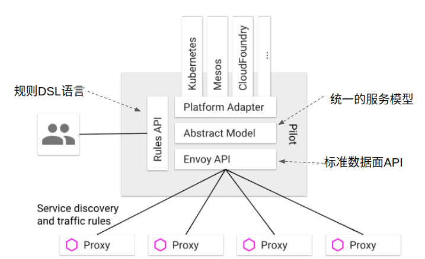

## 统一的服务模型

Pilot定义了网格中服务的标准模型，这个标准模型独立于各种底层平台。由于有了该标准模型，各个不同的平台可以通过适配器和Pilot对接，将自己特有的服务数据格式转换为标准格式，填充到Pilot的标准模型中。

例如Pilot中的Kubernetes适配器通过Kubernetes API服务器得到kubernetes中service和pod的相关信息，然后翻译为标准模型提供给Pilot使用。通过适配器模式，Pilot还可以从Mesos, Cloud Foundry, Consul等平台中获取服务信息，还可以开发适配器将其他提供服务发现的组件集成到Pilot中。

## 标准数据面 API

Pilo使用了一套起源于Envoy项目的[标准数据面API](https://github.com/envoyproxy/data-plane-api/blob/master/API_OVERVIEW.md)[[2\]](https://zhaohuabing.com/post/2018-09-25-istio-traffic-management-impl-intro/#ref02)来将服务信息和流量规则下发到数据面的sidecar中。

通过采用该标准API，Istio将控制面和数据面进行了解耦，为多种数据面sidecar实现提供了可能性。事实上基于该标准API已经实现了多种Sidecar代理和Istio的集成，除Istio目前集成的Envoy外，还可以和Linkerd, Nginmesh等第三方通信代理进行集成，也可以基于该API自己编写Sidecar实现。

控制面和数据面解耦是Istio后来居上，风头超过Service mesh鼻祖Linkerd的一招妙棋。Istio站在了控制面的高度上，而Linkerd则成为了可选的一种sidecar实现，可谓降维打击的一个典型成功案例！

数据面标准API也有利于生态圈的建立，开源，商业的各种sidecar以后可能百花齐放，用户也可以根据自己的业务场景选择不同的sidecar和控制面集成，如高吞吐量的，低延迟的，高安全性的等等。有实力的大厂商可以根据该API定制自己的sidecar，例如蚂蚁金服开源的Golang版本的Sidecar MOSN(Modular Observable Smart Netstub)（SOFAMesh中Golang版本的Sidecar)；小厂商则可以考虑采用成熟的开源项目或者提供服务的商业sidecar实现。

备注：Istio和Envoy项目联合制定了Envoy V2 API,并采用该API作为Istio控制面和数据面流量管理的标准接口。

## 业务DSL语言

Pilot还定义了一套DSL（Domain Specific Language）语言，DSL语言提供了面向业务的高层抽象，可以被运维人员理解和使用。运维人员使用该DSL定义流量规则并下发到Pilot，这些规则被Pilot翻译成数据面的配置，再通过标准API分发到Envoy实例，可以在运行期对微服务的流量进行控制和调整。

Pilot的规则DSL是采用K8S API Server中的[Custom Resource (CRD)](https://kubernetes.io/docs/concepts/extend-kubernetes/api-extension/custom-resources/)[[3\]](https://zhaohuabing.com/post/2018-09-25-istio-traffic-management-impl-intro/#ref03)实现的，因此和其他资源类型如Service Pod Deployment的创建和使用方法类似，都可以用Kubectl进行创建。

通过运用不同的流量规则，可以对网格中微服务进行精细化的流量控制，如按版本分流，断路器，故障注入，灰度发布等。

# Istio流量管理相关组件

我们可以通过下图了解Istio流量管理涉及到的相关组件。虽然该图来自Istio Github old pilot repo, 但图中描述的组件及流程和目前Pilot的最新代码的架构基本是一致的。

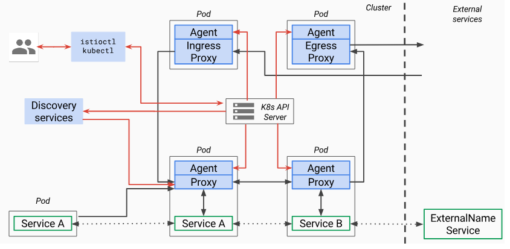

从上图可以看到，Istio中和流量管理相关的有以下组件：

## 控制面组件

### Discovery Services

对应的docker为gcr.io/istio-release/pilot,进程为pilot-discovery，该组件的功能包括：

- 从Service provider（如kubernetes或者consul）中获取服务信息
- 从K8S API Server中获取流量规则(K8S CRD Resource)
- 将服务信息和流量规则转化为数据面可以理解的格式，通过标准的数据面API下发到网格中的各个sidecar中。

### K8S API Server

提供Pilot相关的CRD Resource的增、删、改、查。和Pilot相关的CRD有以下几种:

- [**Virtualservice**](https://istio.io/docs/reference/config/networking/virtual-service/)：用于定义路由规则，如根据来源或 Header 制定规则，或在不同服务版本之间分拆流量。
- [**DestinationRule**](https://istio.io/docs/reference/config/networking/destination-rule/)：定义目的服务的配置策略以及可路由子集。策略包括断路器、负载均衡以及 TLS 等。
- [**ServiceEntry**](https://istio.io/docs/reference/config/networking/service-entry/)：可以使用ServiceEntry向Istio中加入附加的服务条目，以使网格内可以向istio 服务网格之外的服务发出请求。
- [**Gateway**](https://istio.io/docs/reference/config/networking/gateway/)：为网格配置网关，以允许一个服务可以被网格外部访问。
- [**EnvoyFilter**](https://istio.io/docs/reference/config/networking/envoy-filter/)：可以为Envoy配置过滤器。由于Envoy已经支持Lua过滤器，因此可以通过EnvoyFilter启用Lua过滤器，动态改变Envoy的过滤链行为。我之前一直在考虑如何才能动态扩展Envoy的能力，EnvoyFilter提供了很灵活的扩展性。
- [**Sidecar**](https://istio.io/docs/reference/config/networking/sidecar/)：缺省情况下，Pilot将会把和Envoy Sidecar所在namespace的所有services的相关配置，包括inbound和outbound listenter, cluster, route等，都下发给Enovy。使用Sidecar可以对Pilot向Envoy Sidcar下发的配置进行更细粒度的调整，例如只向其下发该Sidecar 所在服务需要访问的那些外部服务的相关outbound配置。

## 数据面组件

在数据面有两个进程Pilot-agent和envoy，这两个进程被放在一个docker容器gcr.io/istio-release/proxyv2中。

### Pilot-agent

该进程根据K8S API Server中的配置信息生成Envoy的配置文件，并负责启动Envoy进程。注意Envoy的大部分配置信息都是通过xDS接口从Pilot中动态获取的，因此Agent生成的只是用于初始化Envoy的少量静态配置。在后面的章节中，本文将对Agent生成的Envoy配置文件进行进一步分析。

### Envoy

Envoy由Pilot-agent进程启动，启动后，Envoy读取Pilot-agent为它生成的配置文件，然后根据该文件的配置获取到Pilot的地址，通过数据面标准API的xDS接口从pilot获取动态配置信息，包括路由（route），监听器（listener），服务集群（cluster）和服务端点（endpoint）。Envoy初始化完成后，就根据这些配置信息对微服务间的通信进行寻址和路由。

## 命令行工具

kubectl和Istioctl，由于Istio的配置是基于K8S的CRD，因此可以直接采用kubectl对这些资源进行操作。Istioctl则针对Istio对CRD的操作进行了一些封装。Istioctl支持的功能参见该[表格](https://istio.io/docs/reference/commands/istioctl)。

# 数据面标准API

前面讲到，Pilot采用了一套标准的API来向数据面Sidecar提供服务发现，负载均衡池和路由表等流量管理的配置信息。该标准API的文档参见[Envoy v2 API](https://www.envoyproxy.io/docs/envoy/latest/configuration/overview/v2_overview)[[5\]](https://zhaohuabing.com/post/2018-09-25-istio-traffic-management-impl-intro/#ref05)。[Data Plane API Protocol Buffer Definition](https://github.com/envoyproxy/data-plane-api/tree/master/envoy/api/v2)[[6\]](https://zhaohuabing.com/post/2018-09-25-istio-traffic-management-impl-intro/#ref06))给出了v2 grpc接口相关的数据结构和接口定义。

（备注：Istio早期采用了Envoy v1 API，目前的版本中则使用V2 API，V1已被废弃）。

## 基本概念和术语

首先我们需要了解数据面API中涉及到的一些基本概念：

- **Host**：能够进行网络通信的实体（如移动设备、服务器上的应用程序）。在此文档中，主机是逻辑网络应用程序。一块物理硬件上可能运行有多个主机，只要它们是可以独立寻址的。在EDS接口中，也使用“Endpoint”来表示一个应用实例，对应一个IP+Port的组合。
- **Downstream**：下游主机连接到 Envoy，发送请求并接收响应。
- **Upstream**：上游主机接收来自 Envoy 的连接和请求，并返回响应。
- **Listener**：监听器是命名网地址（例如，端口、unix domain socket等)，可以被下游客户端连接。Envoy 暴露一个或者多个监听器给下游主机连接。在Envoy中,Listener可以绑定到端口上直接对外服务，也可以不绑定到端口上，而是接收其他listener转发的请求。
- **Cluster**：集群是指 Envoy 连接的一组上游主机，集群中的主机是对等的，对外提供相同的服务，组成了一个可以提供负载均衡和高可用的服务集群。Envoy 通过服务发现来发现集群的成员。可以选择通过主动健康检查来确定集群成员的健康状态。Envoy 通过负载均衡策略决定将请求路由到哪个集群成员。

## XDS服务接口

Istio数据面API定义了xDS服务接口，Pilot通过该接口向数据面sidecar下发动态配置信息，以对Mesh中的数据流量进行控制。xDS中的DS表示discovery service，即发现服务，表示xDS接口使用动态发现的方式提供数据面所需的配置数据。而x则是一个代词，表示有多种discover service。这些发现服务及对应的数据结构如下：

- LDS (Listener Discovery Service) [envoy.api.v2.Listener](https://github.com/envoyproxy/data-plane-api/blob/master/envoy/api/v2/lds.proto)
- CDS (Cluster Discovery Service) [envoy.api.v2.RouteConfiguration](https://github.com/envoyproxy/data-plane-api/blob/master/envoy/api/v2/rds.proto)
- EDS (Endpoint Discovery Service) [envoy.api.v2.Cluster](https://github.com/envoyproxy/data-plane-api/blob/master/envoy/api/v2/cds.proto)
- RDS (Route Discovery Service) [envoy.api.v2.ClusterLoadAssignment](https://github.com/envoyproxy/data-plane-api/blob/master/envoy/api/v2/eds.proto)

## XDS服务接口的最终一致性考虑

xDS的几个接口是相互独立的，接口下发的配置数据是最终一致的。但在配置更新过程中，可能暂时出现各个接口的数据不匹配的情况，从而导致部分流量在更新过程中丢失。

设想这种场景：在CDS/EDS只知道cluster X的情况下,RDS的一条路由配置将指向Cluster X的流量调整到了Cluster Y。在CDS/EDS向Mesh中Envoy提供Cluster Y的更新前，这部分导向Cluster Y的流量将会因为Envoy不知道Cluster Y的信息而被丢弃。

对于某些应用来说，短暂的部分流量丢失是可以接受的，例如客户端重试可以解决该问题，并不影响业务逻辑。对于另一些场景来说，这种情况可能无法容忍。可以通过调整xDS接口的更新逻辑来避免该问题，对上面的情况，可以先通过CDS/EDS更新Y Cluster，然后再通过RDS将X的流量路由到Y。

一般来说，为了避免Envoy配置数据更新过程中出现流量丢失的情况，xDS接口应采用下面的顺序：

1. CDS 首先更新Cluster数据（如果有变化）
2. EDS 更新相应Cluster的Endpoint信息（如果有变化）
3. LDS 更新CDS/EDS相应的Listener。
4. RDS 最后更新新增Listener相关的Route配置。
5. 删除不再使用的CDS cluster和 EDS endpoints。

## ADS聚合发现服务

保证控制面下发数据一致性，避免流量在配置更新过程中丢失的另一个方式是使用ADS(Aggregated Discovery Services)，即聚合的发现服务。ADS通过一个gRPC流来发布所有的配置更新，以保证各个xDS接口的调用顺序，避免由于xDS接口更新顺序导致的配置数据不一致问题。

关于XDS接口的详细介绍可参考[xDS REST and gRPC protocol](https://www.envoyproxy.io/docs/envoy/latest/api-docs/xds_protocol)[[7\]](https://zhaohuabing.com/post/2018-09-25-istio-traffic-management-impl-intro/#ref07)

# Bookinfo 示例程序分析

下面我们以Bookinfo为例对Istio中的流量管理实现机制，以及控制面和数据面的交互进行进一步分析。

## Bookinfo程序结构

下图显示了Bookinfo示例程序中各个组件的IP地址，端口和调用关系，以用于后续的分析。

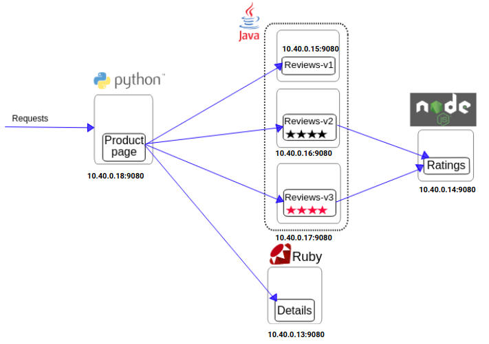

## xDS接口调试方法

首先我们看看如何对xDS接口的相关数据进行查看和分析。Envoy v2接口采用了gRPC，由于gRPC是基于二进制的RPC协议，无法像V1的REST接口一样通过curl和浏览器进行进行分析。但我们还是可以通过Pilot和Envoy的调试接口查看xDS接口的相关数据。

### Pilot调试方法

Pilot在15014端口提供了下述[调试接口](https://github.com/istio/istio/tree/master/pilot/pkg/proxy/envoy/v2)[[8\]](https://zhaohuabing.com/post/2018-09-25-istio-traffic-management-impl-intro/#ref08)下述方法查看xDS接口相关数据。

```bash
PILOT=istio-pilot.istio-system:15014

# What is sent to envoy
# Listeners and routes
curl $PILOT/debug/adsz

# Endpoints
curl $PILOT/debug/edsz

# Clusters
curl $PILOT/debug/cdsz
```

### Envoy调试方法

Envoy提供了管理接口，缺省为localhost的15000端口，可以获取listener，cluster以及完整的配置数据导出功能。

```bash
kubectl exec productpage-v1-6d8bc58dd7-ts8kw -c istio-proxy curl http://127.0.0.1:15000/help
  /: Admin home page
  /certs: print certs on machine
  /clusters: upstream cluster status
  /config_dump: dump current Envoy configs (experimental)
  /cpuprofiler: enable/disable the CPU profiler
  /healthcheck/fail: cause the server to fail health checks
  /healthcheck/ok: cause the server to pass health checks
  /help: print out list of admin commands
  /hot_restart_version: print the hot restart compatibility version
  /listeners: print listener addresses
  /logging: query/change logging levels
  /quitquitquit: exit the server
  /reset_counters: reset all counters to zero
  /runtime: print runtime values
  /runtime_modify: modify runtime values
  /server_info: print server version/status information
  /stats: print server stats
  /stats/prometheus: print server stats in prometheus format
```

进入productpage pod 中的istio-proxy(Envoy) container，可以看到有下面的监听端口

- 9080: productpage进程对外提供的服务端口
- 15001: Envoy的Virtual Outbound监听器，iptable会将productpage服务发出的出向流量导入该端口中由Envoy进行处理
- 15006: Envoy的Virtual Inbound监听器，iptable会将发到productpage的入向流量导入该端口中由Envoy进行处理
- 15000: Envoy管理端口，该端口绑定在本地环回地址上，只能在Pod内访问。
- 15090：指向127.0.0.1：15000/stats/prometheus, 用于对外提供Envoy的性能统计指标

```bash
master $ kubectl exec productpage-v1-6d8bc58dd7-ts8kw -c istio-proxy --  netstat -ln
Active Internet connections (only servers)
Proto Recv-Q Send-Q Local Address           Foreign Address         State
tcp        0      0 0.0.0.0:15090           0.0.0.0:*               LISTEN
tcp        0      0 0.0.0.0:9080            0.0.0.0:*               LISTEN
tcp        0      0 127.0.0.1:15000         0.0.0.0:*               LISTEN
tcp        0      0 0.0.0.0:15001           0.0.0.0:*               LISTEN
tcp        0      0 0.0.0.0:15006           0.0.0.0:*               LISTEN
tcp6       0      0 :::15020                :::*                    LISTEN
```

## Envoy启动过程分析

Istio通过K8s的[Admission webhook](https://zhaohuabing.com/2018/05/23/istio-auto-injection-with-webhook)[[9\]](https://zhaohuabing.com/post/2018-09-25-istio-traffic-management-impl-intro/#ref09)机制实现了sidecar的自动注入，Mesh中的每个微服务会被加入Envoy相关的容器。下面是Productpage微服务的Pod内容，可见除productpage之外，Istio还在该Pod中注入了两个容器istio-init和istio-proxy，为了节约下载镜像的时间，加快业务Pod的启动速度，这两个容器使用了相同的镜像文件，但启动命令不同。

备注：下面Pod description中只保留了需要关注的内容，删除了其它不重要的部分。为方便查看，本文中后续的其它配置文件以及命令行输出也会进行类似处理。

```bash
master $ kubectl describe pod productpage-v1-6d8bc58dd7-ts8kw
Name:               productpage-v1-6d8bc58dd7-ts8kw
Namespace:          default
Labels:             app=productpage
                    version=v1
Init Containers:
  istio-init:
    Image:         docker.io/istio/proxyv2:1.4.1
    Command:
      istio-iptables
      -p
      15001
      -z
      15006
      -u
      1337
      -m
      REDIRECT
      -i
      *
      -x

      -b
      *
      -d
      15020
Containers:
  productpage:
    Image:          docker.io/istio/examples-bookinfo-productpage-v1:1.15.0
    Port:           9080/TCP
  istio-proxy:
    Image:         docker.io/istio/proxyv2:1.4.1
    Port:          15090/TCP
    Args:
      proxy
      sidecar
      --domain
      $(POD_NAMESPACE).svc.cluster.local
      --configPath
      /etc/istio/proxy
      --binaryPath
      /usr/local/bin/envoy
      --serviceCluster
      productpage.$(POD_NAMESPACE)
      --drainDuration
      45s
      --parentShutdownDuration
      1m0s
      --discoveryAddress
      istio-pilot.istio-system:15010
      --zipkinAddress
      zipkin.istio-system:9411
      --proxyLogLevel=warning
      --proxyComponentLogLevel=misc:error
      --connectTimeout
      10s
      --proxyAdminPort
      15000
      --concurrency
      2
      --controlPlaneAuthPolicy
      NONE
      --dnsRefreshRate
      300s
      --statusPort
      15020
      --applicationPorts
      9080
      --trust-domain=cluster.local   
```

### Proxy_init

Productpage的Pod中有一个InitContainer proxy_init，InitContrainer是K8S提供的机制，用于在Pod中执行一些初始化任务.在Initialcontainer执行完毕并退出后，才会启动Pod中的其它container。

从上面的Pod description可以看到，proxy_init容器执行的命令是istio-iptables，这是一个go编译出来的二进制文件，该二进制文件会调用iptables命令创建了一些列iptables规则来劫持Pod中的流量。该命令有这些关键的参数：

- 命令行参数 -p 15001表示出向流量被iptable重定向到Envoy的15001端口
- 命令行参数 -z 15006表示入向流量被iptable重定向到Envoy的15006端口
- 命令行参数 -u 1337参数用于排除用户ID为1337，即Envoy自身的流量，以避免Iptable把Envoy发出的数据又重定向到Envoy，形成死循环。

Iptables规则的详细内容参见istio源码中的shell脚本[tools/packaging/common/istio-iptables.sh](https://github.com/istio/istio/blob/1.4.0/tools/packaging/common/istio-iptables.sh)。

### Proxyv2

前面提到，该容器中有两个进程Pilot-agent和envoy。我们进入容器中看看这两个进程的相关信息。

```bash
master $ kubectl exec productpage-v1-6d8bc58dd7-ts8kw -c istio-proxy -- ps -ef
UID        PID  PPID  C STIME TTY          TIME CMD
istio-p+     1     0  0 10:46 ?        00:00:02 /usr/local/bin/pilot-agent proxy sidecar --domain default.svc.cluster.local --configPath /etc/istio/proxy --binaryPath/usr/local/bin/envoy --serviceCluster productpage.default --drainDuration 45s --parentShutdownDuration 1m0s --discoveryAddress istio-pilot.istio-system:15010 --zipkinAddress zipkin.istio-system:9411 --proxyLogLevel=warning --proxyComponentLogLevel=misc:error --connectTimeout 10s --proxyAdminPort 15000 --concurrency 2 --controlPlaneAuthPolicy NONE --dnsRefreshRate 300s --statusPort 15020 --applicationPorts 9080 --trust-domain=cluster.local
istio-p+    20     1  0 10:46 ?        00:00:07 /usr/local/bin/envoy -c /etc/istio/proxy/envoy-rev0.json --restart-epoch 0 --drain-time-s 45 --parent-shutdown-time-s 60 --service-cluster productpage.default --service-node sidecar~10.40.0.18~productpage-v1-6d8bc58dd7-ts8kw.default~default.svc.cluster.local --max-obj-name-len 189 --local-address-ip-version v4 --log-format [Envoy (Epoch 0)] [%Y-%m-%d %T.%e][%t][%l][%n] %v -l warning --component-log-level misc:error --concurrency 2
istio-p+    68     0  0 11:27 ?        00:00:00 ps -ef
```

Envoy的大部分配置都是dynamic resource，包括网格中服务相关的service cluster, listener, route规则等。这些dynamic resource是通过xDS接口从Istio控制面中动态获取的。但Envoy如何知道xDS server的地址呢？这是在Envoy初始化配置文件中以static resource的方式配置的。

#### Envoy初始配置文件

Pilot-agent进程根据启动参数和K8S API Server中的配置信息生成Envoy的初始配置文件，并负责启动Envoy进程。从ps命令输出可以看到Pilot-agent在启动Envoy进程时传入了pilot地址和zipkin地址，并为Envoy生成了一个初始化配置文件envoy-rev0.json。

可以使用下面的命令将productpage pod中该文件导出来查看其中的内容：

```bash
kubectl exec productpage-v1-6d8bc58dd7-ts8kw -c istio-proxy cat /etc/istio/proxy/envoy-rev0.json > envoy-rev0.json
```

配置文件的结构如图所示：

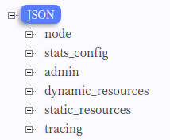

其中各个配置节点的内容如下：

##### Node

包含了Envoy所在节点相关信息。

```json
{
    "node": {
        "id": "sidecar~10.40.0.18~productpage-v1-6d8bc58dd7-ts8kw.default~default.svc.cluster.local",
        "cluster": "productpage.default",
        "locality": {},
        "metadata": {
            "CLUSTER_ID": "Kubernetes",
            "CONFIG_NAMESPACE": "default",
            "EXCHANGE_KEYS": "NAME,NAMESPACE,INSTANCE_IPS,LABELS,OWNER,PLATFORM_METADATA,WORKLOAD_NAME,CANONICAL_TELEMETRY_SERVICE,MESH_ID,SERVICE_ACCOUNT",
            "INCLUDE_INBOUND_PORTS": "9080",
            "INSTANCE_IPS": "10.40.0.18,fe80::94df:47ff:fef3:bc99",
            "INTERCEPTION_MODE": "REDIRECT",
            "ISTIO_PROXY_SHA": "istio-proxy:3af92d895f6cb80993fc8bb04dc9b2008183f2ba",
            "ISTIO_VERSION": "1.4.1",
            "LABELS": {
                "app": "productpage",
                "pod-template-hash": "6d8bc58dd7",
                "security.istio.io/tlsMode": "istio",
                "version": "v1"
            },
            "MESH_ID": "cluster.local",
            "NAME": "productpage-v1-6d8bc58dd7-ts8kw",
            "NAMESPACE": "default",
            "OWNER": "kubernetes://api/apps/v1/namespaces/default/deployments/productpage-v1",
            "POD_NAME": "productpage-v1-6d8bc58dd7-ts8kw",
            "POD_PORTS": "[{\"containerPort\":9080,\"protocol\":\"TCP\"},{\"name\":\"http-envoy-prom\",\"containerPort\":15090,\"protocol\":\"TCP\"}]",
            "SERVICE_ACCOUNT": "bookinfo-productpage",
            "WORKLOAD_NAME": "productpage-v1",
            "app": "productpage",
            "pod-template-hash": "6d8bc58dd7",
            "security.istio.io/tlsMode": "istio",
            "sidecar.istio.io/status": "{\"version\":\"8d80e9685defcc00b0d8c9274b60071ba8810537e0ed310ea96c1de0785272c7\",\"initContainers\":[\"istio-init\"],\"containers\":[\"istio-proxy\"],\"volumes\":[\"istio-envoy\",\"istio-certs\"],\"imagePullSecrets\":null}",
            "version": "v1"
        }
    }
}
```

##### Admin

配置Envoy的日志路径以及管理端口。

```json
    "admin": {
        "access_log_path": "/dev/null",
        "address": {
            "socket_address": {
                "address": "127.0.0.1",
                "port_value": 15000
            }
        }
    }
```

##### Dynamic_resources

配置动态资源,这里配置了ADS服务器。

```json
{
    "dynamic_resources": {
        "lds_config": {
            "ads": {}
        },
        "cds_config": {
            "ads": {}
        },
        "ads_config": {
            "api_type": "GRPC",
            "grpc_services": [
                {
                    "envoy_grpc": {
                        "cluster_name": "xds-grpc"
                    }
                }
            ]
        }
    }
}
```

##### Static_resources

配置静态资源，包括了prometheus_stats、xds-grpc和zipkin三个cluster和一个在15090上监听的listener。其中xds-grpc cluster对应前面dynamic_resources中ADS配置，指明了Envoy用于获取动态资源的服务器地址。prometheus_stats cluster和15090 listener用于对外提供兼容prometheus格式的统计指标。zipkin cluster则是外部的zipkin调用跟踪服务器地址，Envoy会向该地址上报兼容zipkin格式的调用跟踪信息。

```json
{
    "static_resources": {
        "clusters": [
            {
                "name": "prometheus_stats",
                "type": "STATIC",
                "connect_timeout": "0.250s",
                "lb_policy": "ROUND_ROBIN",
                "hosts": [
                    {
                        "socket_address": {
                            "protocol": "TCP",
                            "address": "127.0.0.1",
                            "port_value": 15000
                        }
                    }
                ]
            },
            {
                "name": "xds-grpc",
                "type": "STRICT_DNS",
                "dns_refresh_rate": "300s",
                "dns_lookup_family": "V4_ONLY",
                "connect_timeout": "10s",
                "lb_policy": "ROUND_ROBIN",
                "hosts": [
                    {
                        "socket_address": {
                            "address": "istio-pilot.istio-system",
                            "port_value": 15010
                        }
                    }
                ],
                "circuit_breakers": {
                    "thresholds": [
                        {
                            "priority": "DEFAULT",
                            "max_connections": 100000,
                            "max_pending_requests": 100000,
                            "max_requests": 100000
                        },
                        {
                            "priority": "HIGH",
                            "max_connections": 100000,
                            "max_pending_requests": 100000,
                            "max_requests": 100000
                        }
                    ]
                },
                "upstream_connection_options": {
                    "tcp_keepalive": {
                        "keepalive_time": 300
                    }
                },
                "http2_protocol_options": {}
            },
            {
                "name": "zipkin",
                "type": "STRICT_DNS",
                "dns_refresh_rate": "300s",
                "dns_lookup_family": "V4_ONLY",
                "connect_timeout": "1s",
                "lb_policy": "ROUND_ROBIN",
                "hosts": [
                    {
                        "socket_address": {
                            "address": "zipkin.istio-system",
                            "port_value": 9411
                        }
                    }
                ]
            }
        ],
        "listeners": [
            {
                "address": {
                    "socket_address": {
                        "protocol": "TCP",
                        "address": "0.0.0.0",
                        "port_value": 15090
                    }
                },
                "filter_chains": [
                    {
                        "filters": [
                            {
                                "name": "envoy.http_connection_manager",
                                "config": {
                                    "codec_type": "AUTO",
                                    "stat_prefix": "stats",
                                    "route_config": {
                                        "virtual_hosts": [
                                            {
                                                "name": "backend",
                                                "domains": [
                                                    "*"
                                                ],
                                                "routes": [
                                                    {
                                                        "match": {
                                                            "prefix": "/stats/prometheus"
                                                        },
                                                        "route": {
                                                            "cluster": "prometheus_stats"
                                                        }
                                                    }
                                                ]
                                            }
                                        ]
                                    },
                                    "http_filters": {
                                        "name": "envoy.router"
                                    }
                                }
                            }
                        ]
                    }
                ]
            }
        ]
    }
}
```

##### Tracing

配置分布式链路跟踪，这里配置的后端cluster是前面static_resources里面定义的zipkin cluster。

```json
  "tracing": {
    "http": {
      "name": "envoy.zipkin",
      "config": {
        "collector_cluster": "zipkin",
        "collector_endpoint": "/api/v1/spans",
        "trace_id_128bit": "true",
        "shared_span_context": "false"
      }
    }
  }
```

在https://github.com/zhaohuabing/bookinfo-bookinfo-config-dump/blob/istio1.4.0/productpage-envoy-rev0.json中可以查看该配置文件的完整内容。

## Envoy配置分析

### 通过管理接口获取完整配置

从Envoy初始化配置文件中，我们可以大致看到Istio通过Envoy来实现服务发现和流量管理的基本原理。即控制面将xDS server信息通过static resource的方式配置到Envoy的初始化配置文件中，Envoy启动后通过xDS server获取到dynamic resource，包括网格中的service信息及路由规则。

Envoy配置初始化流程：

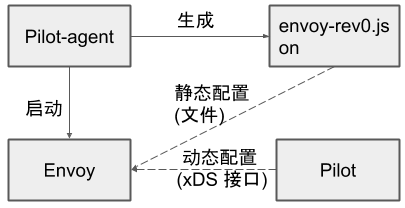

1. Pilot-agent根据启动参数和K8S API Server中的配置信息生成Envoy的初始配置文件envoy-rev0.json，该文件告诉Envoy从xDS server中获取动态配置信息，并配置了xDS server的地址信息，即控制面的Pilot。
2. Pilot-agent使用envoy-rev0.json启动Envoy进程。
3. Envoy根据初始配置获得Pilot地址，采用xDS接口从Pilot获取到Listener，Cluster，Route等d动态配置信息。
4. Envoy根据获取到的动态配置启动Listener，并根据Listener的配置，结合Route和Cluster对拦截到的流量进行处理。

可以看到，Envoy中实际生效的配置是由初始化配置文件中的静态配置和从Pilot获取的动态配置一起组成的。因此只对envoy-rev0 .json进行分析并不能看到Mesh中流量管理的全貌。那么有没有办法可以看到Envoy中实际生效的完整配置呢？答案是可以的，我们可以通过Envoy的管理接口来获取Envoy的完整配置。

```json
kubectl exec -it productpage-v1-6d8bc58dd7-ts8kw -c istio-proxy curl http://127.0.0.1:15000/config_dump > config_dump
```

该文件内容长达近一万行，本文中就不贴出来了，在https://github.com/zhaohuabing/bookinfo-bookinfo-config-dump/blob/istio1.4.0/productpage-config-dump中可以查看到文件的全部内容。

### Envoy配置文件结构

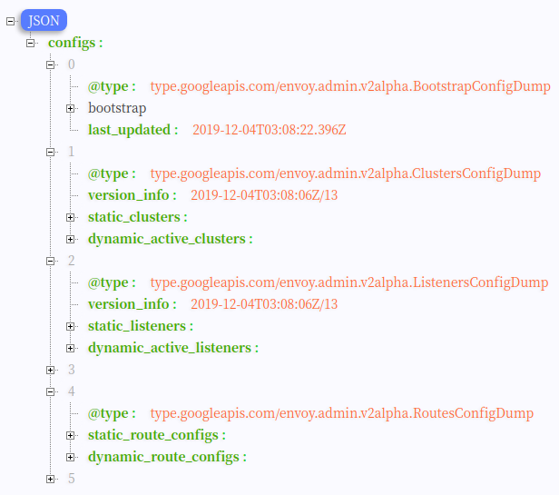

从dump文件中可以看到Envoy中包括下述配置：

#### Bootstrap

从名字可以大致猜出这是Envoy的初始化配置，打开该节点，可以看到文件中的内容和前一章节中介绍的envoy-rev0.json是一致的，这里不再赘述。

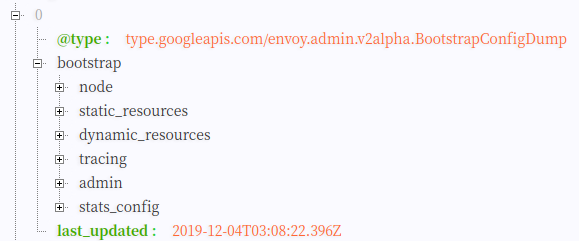

#### Clusters

在Envoy中，Cluster是一个服务集群，Cluster中包含一个到多个endpoint，每个endpoint都可以提供服务，Envoy根据负载均衡算法将请求发送到这些endpoint中。

在Productpage的clusters配置中包含static_clusters和dynamic_active_clusters两部分，其中static_clusters是来自于envoy-rev0.json的初始化配置中的prometheus_stats、xDS server和zipkin server信息。dynamic_active_clusters是通过xDS接口从Istio控制面获取的动态服务信息。

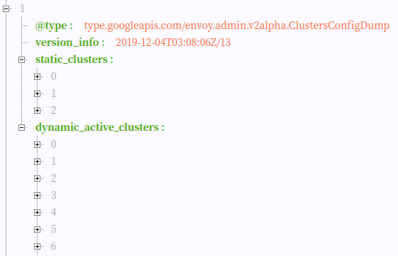

Dynamic Cluster中有以下几类Cluster：

##### Outbound Cluster

这部分的Cluster占了绝大多数，该类Cluster对应于Envoy所在节点的外部服务。以reviews为例，对于Productpage来说,reviews是一个外部服务，因此其Cluster名称中包含outbound字样。

从reviews 服务对应的cluster配置中可以看到，其类型为EDS，即表示该Cluster的endpoint来自于动态发现，动态发现中eds_config则指向了ads，最终指向static Resource中配置的xds-grpc cluster,即Pilot的地址。

```json
{
    "version_info": "2019-12-04T03:08:06Z/13",
    "cluster": {
        "name": "outbound|9080||reviews.default.svc.cluster.local",
        "type": "EDS",
        "eds_cluster_config": {
            "eds_config": {
                "ads": {}
            },
            "service_name": "outbound|9080||reviews.default.svc.cluster.local"
        },
        "connect_timeout": "1s",
        "circuit_breakers": {
            "thresholds": [
                {
                    "max_connections": 4294967295,
                    "max_pending_requests": 4294967295,
                    "max_requests": 4294967295,
                    "max_retries": 4294967295
                }
            ]
        }
    },
    "last_updated": "2019-12-04T03:08:22.658Z"
}
```

可以通过Pilot的调试接口获取该Cluster的endpoint：

```json
curl http://10.97.222.108:15014/debug/edsz > pilot_eds_dump
```

导出的文件较长，本文只贴出reviews服务相关的endpoint配置，完整文件参见:https://github.com/zhaohuabing/bookinfo-bookinfo-config-dump/blob/istio1.4.0/pilot_eds_dump

从下面的文件内容可以看到，reviews cluster配置了3个endpoint地址，是reviews的pod ip。

```json
{
    "clusterName": "outbound|9080||reviews.default.svc.cluster.local",
    "endpoints": [
        {
            "lbEndpoints": [
                {
                    "endpoint": {
                        "address": {
                            "socketAddress": {
                                "address": "10.40.0.15",
                                "portValue": 9080
                            }
                        }
                    },
                    "metadata": {
                        "filterMetadata": {
                            "envoy.transport_socket_match": {
                                "tlsMode": "istio"
                            },
                            "istio": {
                                "uid": "kubernetes://reviews-v1-75b979578c-pw8zs.default"
                            }
                        }
                    },
                    "loadBalancingWeight": 1
                },
                {
                    "endpoint": {
                        "address": {
                            "socketAddress": {
                                "address": "10.40.0.16",
                                "portValue": 9080
                            }
                        }
                    },
                    "metadata": {
                        "filterMetadata": {
                            "envoy.transport_socket_match": {
                                "tlsMode": "istio"
                            },
                            "istio": {
                                "uid": "kubernetes://reviews-v3-54c6c64795-wbls7.default"
                            }
                        }
                    },
                    "loadBalancingWeight": 1
                },
                {
                    "endpoint": {
                        "address": {
                            "socketAddress": {
                                "address": "10.40.0.17",
                                "portValue": 9080
                            }
                        }
                    },
                    "metadata": {
                        "filterMetadata": {
                            "envoy.transport_socket_match": {
                                "tlsMode": "istio"
                            },
                            "istio": {
                                "uid": "kubernetes://reviews-v2-597bf96c8f-l2fp8.default"
                            }
                        }
                    },
                    "loadBalancingWeight": 1
                }
            ],
            "loadBalancingWeight": 3
        }
    ]
}
```

##### Inbound Cluster

该类Cluster对应于Envoy所在节点上的服务。如果该服务接收到请求，当然就是一个入站请求。对于Productpage Pod上的Envoy，其对应的Inbound Cluster只有一个，即productpage。该cluster对应的host为127.0.0.1,即环回地址上productpage的监听端口。由于iptable规则中排除了127.0.0.1,入站请求通过该Inbound cluster处理后将跳过Envoy，直接发送给Productpage进程处理。

```json
{
    "version_info": "2019-12-04T03:08:06Z/13",
    "cluster": {
        "name": "inbound|9080|http|productpage.default.svc.cluster.local",
        "type": "STATIC",
        "connect_timeout": "1s",
        "circuit_breakers": {
            "thresholds": [
                {
                    "max_connections": 4294967295,
                    "max_pending_requests": 4294967295,
                    "max_requests": 4294967295,
                    "max_retries": 4294967295
                }
            ]
        },
        "load_assignment": {
            "cluster_name": "inbound|9080|http|productpage.default.svc.cluster.local",
            "endpoints": [
                {
                    "lb_endpoints": [
                        {
                            "endpoint": {
                                "address": {
                                    "socket_address": {
                                        "address": "127.0.0.1",
                                        "port_value": 9080
                                    }
                                }
                            }
                        }
                    ]
                }
            ]
        }
    },
    "last_updated": "2019-12-04T03:08:22.658Z"
}
```

##### BlackHoleCluster

这是一个特殊的Cluster，并没有配置后端处理请求的Host。如其名字所暗示的一样，请求进入后将被直接丢弃掉。如果一个请求没有找到其对的目的服务，则被发到cluste。

```json
{
    "version_info": "2019-12-04T03:08:06Z/13",
    "cluster": {
        "name": "BlackHoleCluster",
        "type": "STATIC",
        "connect_timeout": "1s"
    },
    "last_updated": "2019-12-04T03:08:22.658Z"
}
```

##### PassthroughCluster

和BlackHoleCluter相反，发向PassthroughCluster的请求会被直接发送到其请求中要求的原始目地的，Envoy不会对请求进行重新路由。

```json
{
    "version_info": "2019-12-04T03:08:06Z/13",
    "cluster": {
        "name": "PassthroughCluster",
        "type": "ORIGINAL_DST",
        "connect_timeout": "1s",
        "lb_policy": "CLUSTER_PROVIDED",
        "circuit_breakers": {
            "thresholds": [
                {
                    "max_connections": 4294967295,
                    "max_pending_requests": 4294967295,
                    "max_requests": 4294967295,
                    "max_retries": 4294967295
                }
            ]
        }
    },
    "last_updated": "2019-12-04T03:08:22.658Z"
}
```

#### Listeners

Envoy采用listener来接收并处理downstream发过来的请求，listener采用了插件式的架构，可以通过配置不同的filter在Listener中插入不同的处理逻辑。Istio就在Envoy中加入了用于policy check和metric report的Mixer filter。

Listener可以绑定到IP Socket或者Unix Domain Socket上，以接收来自客户端的请求;也可以不绑定，而是接收从其他listener转发来的数据。Istio利用了Envoy listener的这一特点，通过VirtualOutboundListener在一个端口接收所有出向请求，然后再按照请求的端口分别转发给不同的listener分别处理。

##### VirtualOutbound Listener

Envoy创建了一个在15001端口监听的入口监听器。Iptable将Envoy所在Pod的对外请求拦截后发向本地的15001端口，该监听器接收后并不进行业务处理，而是根据请求的目的端口分发给其他监听器处理。该监听器取名为"virtual”（虚拟）监听器也是这个原因。

Envoy是如何做到按请求的目的端口进行分发的呢？ 从下面VirtualOutbound Listener的配置中可以看到[use_original_dest](https://www.envoyproxy.io/docs/envoy/latest/configuration/listeners/listener_filters/original_dst_filter)被设置为true,表明监听器将接收到的请求转交给和请求原目的地址关联的listener进行处理。

如果在Enovy的配置中找不到和请求目的地端口的listener，则将会根据Istio的outboundTrafficPolicy全局配置选项进行处理。存在两种情况：

- 如果[outboundTrafficPolicy](https://istio.io/docs/reference/config/istio.mesh.v1alpha1/#MeshConfig-OutboundTrafficPolicy)设置为ALLOW_ANY：Mesh允许发向任何外部服务的请求，不管该服务是否在Pilot的服务注册表中。在该策略下，Pilot将会在下发给Enovy的VirtualOutbound Listener加入一个upstream cluster为[PassthroughCluster](https://zhaohuabing.com/post/2018-09-25-istio-traffic-management-impl-intro/#passthroughcluster)的TCP proxy filter，找不到匹配端口listener的请求会被该TCP proxy filter处理，请求将会被发送到其IP头中的原始目的地地址。
- 如果[outboundTrafficPolicy](https://istio.io/docs/reference/config/istio.mesh.v1alpha1/#MeshConfig-OutboundTrafficPolicy)设置为REGISTRY_ONLY：只允许发向Pilot服务注册表中存在的服务的对外请求。在该策略下，Pilot将会在下发给Enovy的VirtualOutbound Listener加入一个upstream cluster为[BlackHoleCluster](https://zhaohuabing.com/post/2018-09-25-istio-traffic-management-impl-intro/#blackholecluster)的TCP proxy filter，找不到匹配端口listener的请求会被该TCP proxy filter处理，由于BlackHoleCluster中没有配置upstteam host，请求实际上会被丢弃。

下图是Bookinfo例子中Productpage服务中Enovy Proxy的Virutal Outbound Listener配置，outboundTrafficPolicy配置为ALLOW_ANY，因此Listener的filterchain中第二个filter是一个upstream cluster为PassthroughCluster的TCP proxy filter。注意该filter没有filter_chain_match匹配条件，因此如果进入该listener的请求在配置中找不到对于目的端口的listener进行处理，就会缺省进入该filter进行处理。

filterchain中的第一个filter为一个upstream cluster为BlackHoleCluster的TCP proxy filter，该filter设置了filter_chain_match匹配条件，只有发向10.40.0.18这个IP的出向请求才会进入该filter处理。从前面[Bookinfo的程序结构图](https://zhaohuabing.com/post/2018-09-25-istio-traffic-management-impl-intro/#bookinfo)中可以看到，10.40.0.18其实是productpage服务自身的IP地址。该filter的目的是为了防止服务向自己发送请求可能导致的死循环。

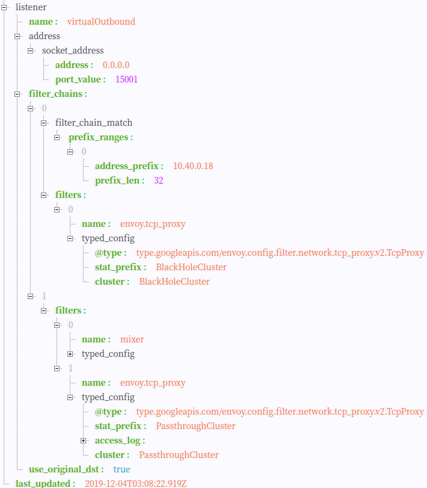


Virtual Outbound Listener

##### Outbound Listener

Envoy为网格中的外部服务按端口创建多个Listener，以用于处理出向请求。

Productpage Pod中的Envoy创建了多个Outbound Listener

- 0.0.0.0_9080 :处理对details,reviews和rating服务的出向请求
- 0.0.0.0_9411 :处理对zipkin的出向请求
- 0.0.0.0_3000 :处理对grafana的出向请求
- 0.0.0.0_15014 :处理对citadel、galley、pilot、(Mixer)policy、(Mixer)telemetry的出向请求
- 0.0.0.0_15004 :处理对(Mixer)policy、(Mixer)telemetry的出向请求
- ……

除了9080这个Listener用于处理应用的业务之外，其他listener都是Istio用于处理自身组件之间通信使用的，有的控制面组件如Pilot，Mixer对应多个listener，是因为该组件有多个端口提供服务。

我们这里主要分析一下9080这个业务端口的Listenrer。和Outbound Listener一样，该Listener同样配置了"bind_to_port”: false属性，因此该listener也没有被绑定到tcp端口上，其接收到的所有请求都转发自15001端口的Virtual listener。

监听器name为0.0.0.0_9080,推测其含义应为匹配发向任意IP的9080的请求，从[bookinfo程序结构](https://zhaohuabing.com/post/2018-09-25-istio-traffic-management-impl-intro/#bookinfo程序结构)可以看到该程序中的productpage,revirews,ratings,details四个service都是9080端口，那么Envoy如何区别处理这四个service呢？

首先需要区分入向（发送给productpage）请求和出向（发送给其他几个服务）请求：

- 发给productpage的入向请求，Iptables规则会将其重定向到15006端口的VirtualInbound listener上，因此不会进入0.0.0.0_9080 listener处理。
- 从productpage外发给reviews、details和ratings的出向请求，virtualOutbound listener无法找到和其目的IP完全匹配的listener，因此根据通配原则转交给0.0.0.0_9080这个Outbound Listener处理。

> 备注： 根据业务逻辑，实际上productpage并不会调用ratings服务，但Istio并不知道各个业务之间会如何调用，因此将所有的服务信息都下发到了Envoy中。这样做对Envoy的内存占用和效率有一定影响，如果希望去掉Envoy配置中的无用数据，可以通过[sidecar](https://istio.io/docs/reference/config/networking/sidecar/)规则对Envoy的ingress和egress service配置进行调整。 由于对应到reviews、details和Ratings三个服务，当0.0.0.0_9080接收到出向请求后，并不能直接发送到一个downstream cluster中，而是需要根据请求目的地进行不同的路由。

下图为productpage服务中导出的0.0.0.0_9080 outbound listener，我们可以看到该listener配置了一个[路由规则9080](https://zhaohuabing.com/post/2018-09-25-istio-traffic-management-impl-intro/#routes)，在路由规则中再根据不同的请求目的地对请求进行处理。

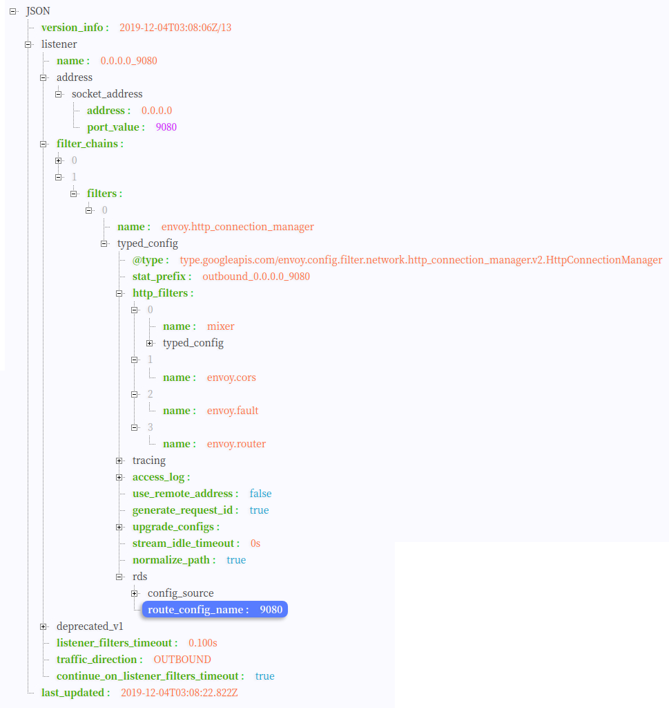


Outnbound Listener

##### VirtualInbound Listener

在较早的版本中，Istio采用同一个VirtualListener在端口15001上同时处理入向和出向的请求。该方案存在一些潜在的问题，例如可能会导致出现死循环，参见[这个PR](https://github.com/istio/istio/pull/15713)。在1.4中，Istio为Envoy单独创建了一个VirtualInboundListener，在15006端口监听入向请求，原来的15001端口只用于处理出向请求。

另外一个变化是当VirtualInboundListener接收到请求后，将直接在VirtualInboundListener采用一系列filterChain对入向请求进行处理，而不是像VirtualOutboundListener一样分发给其它独立的Listener进行处理。

这样修改后，Envoy配置中入向和出向的请求处理流程被完全拆分开，请求处理流程更为清晰，可以避免由于配置导致的一些潜在错误。

下图是Bookinfo例子中Reviews服务中Enovy Proxy的Virutal Inbound Listener配置。


Virtual Inbound Listener

该Listener中第三个filterchain用于处理Review服务的入向请求。该filterchain的匹配条件为Review服务的Pod IP和9080端口，配置了一个http_connection_manager filter，http_connection_manager 中又嵌入了istio_auth，Mixer，envoy.router等http filter，经过这些filter进行处理后，请求最终将被转发给"inbound|9080||reviews.default.svc.cluster.local"这个[Inbound Cluster](https://zhaohuabing.com/post/2018-09-25-istio-traffic-management-impl-intro/#inbound-cluster)，由于该Inbound Cluster中配置的Upstream为127.0.0.1:9080，由于iptable设置中127.0.0.1不会被拦截,该请求将发送到同Pod的Reviews服务的9080端口上进行业务处理。

VirtualInbound Listener中的第一个filterchain的匹配条件为所有IP，用于缺省处理未在Pilot服务注册表中注册的服务。


Virtual Inbound Listener

#### Routes

配置Envoy的路由规则。Istio下发的缺省路由规则中对每个端口设置了一个路由规则，根据host来对请求进行路由分发。

下面是Proudctpage服务中9080的路由配置，从文件中可以看到对应了5个virtual host，分别是details、productpage、ratings、reviews和allow_any，前三个virtual host分别对应到不同服务的[outbound cluster](https://zhaohuabing.com/post/2018-09-25-istio-traffic-management-impl-intro/#outbound-cluster)。最后一个对应到[PassthroughCluster](https://zhaohuabing.com/post/2018-09-25-istio-traffic-management-impl-intro/#passthroughcluster),即当入向的i请求没有找到对应的服务时，也会让其直接通过。

```json
{
    "version_info": "2019-12-04T03:08:06Z/13",
    "route_config": {
        "name": "9080",
        "virtual_hosts": [
            {
                "name": "details.default.svc.cluster.local:9080",
                "domains": [
                    "details.default.svc.cluster.local",
                    "details.default.svc.cluster.local:9080",
                    "details",
                    "details:9080",
                    "details.default.svc.cluster",
                    "details.default.svc.cluster:9080",
                    "details.default.svc",
                    "details.default.svc:9080",
                    "details.default",
                    "details.default:9080",
                    "10.101.41.162",
                    "10.101.41.162:9080"
                ],
                "routes": [
                    {
                        "match": {
                            "prefix": "/"
                        },
                        "route": {
                            "cluster": "outbound|9080||details.default.svc.cluster.local",
                            "timeout": "0s",
                            "retry_policy": {
                                "retry_on": "connect-failure,refused-stream,unavailable,cancelled,resource-exhausted,retriable-status-codes",
                                "num_retries": 2,
                                "retry_host_predicate": [
                                    {
                                        "name": "envoy.retry_host_predicates.previous_hosts"
                                    }
                                ],
                                "host_selection_retry_max_attempts": "5",
                                "retriable_status_codes": [
                                    503
                                ]
                            },
                            "max_grpc_timeout": "0s"
                        },
                        "decorator": {
                            "operation": "details.default.svc.cluster.local:9080/*"
                        },
                        "typed_per_filter_config": {
                            "mixer": {
                                "@type": "type.googleapis.com/istio.mixer.v1.config.client.ServiceConfig",
                                "disable_check_calls": true,
                                "mixer_attributes": {
                                    "attributes": {
                                        "destination.service.host": {
                                            "string_value": "details.default.svc.cluster.local"
                                        },
                                        "destination.service.name": {
                                            "string_value": "details"
                                        },
                                        "destination.service.namespace": {
                                            "string_value": "default"
                                        },
                                        "destination.service.uid": {
                                            "string_value": "istio://default/services/details"
                                        }
                                    }
                                },
                                "forward_attributes": {
                                    "attributes": {
                                        "destination.service.host": {
                                            "string_value": "details.default.svc.cluster.local"
                                        },
                                        "destination.service.name": {
                                            "string_value": "details"
                                        },
                                        "destination.service.namespace": {
                                            "string_value": "default"
                                        },
                                        "destination.service.uid": {
                                            "string_value": "istio://default/services/details"
                                        }
                                    }
                                }
                            }
                        },
                        "name": "default"
                    }
                ]
            },
            {
                "name": "productpage.default.svc.cluster.local:9080",
                "domains": [
                    "productpage.default.svc.cluster.local",
                    "productpage.default.svc.cluster.local:9080",
                    "productpage",
                    "productpage:9080",
                    "productpage.default.svc.cluster",
                    "productpage.default.svc.cluster:9080",
                    "productpage.default.svc",
                    "productpage.default.svc:9080",
                    "productpage.default",
                    "productpage.default:9080",
                    "10.100.240.212",
                    "10.100.240.212:9080"
                ],
                "routes": [
                    {
                        "match": {
                            "prefix": "/"
                        },
                        "route": {
                            "cluster": "outbound|9080||productpage.default.svc.cluster.local"
													
													......
                        }
                ]
            },
            {
                "name": "ratings.default.svc.cluster.local:9080",
                "domains": [
                    "ratings.default.svc.cluster.local",
                    "ratings.default.svc.cluster.local:9080",
                    "ratings",
                    "ratings:9080",
                    "ratings.default.svc.cluster",
                    "ratings.default.svc.cluster:9080",
                    "ratings.default.svc",
                    "ratings.default.svc:9080",
                    "ratings.default",
                    "ratings.default:9080",
                    "10.101.170.120",
                    "10.101.170.120:9080"
                ],
                "routes": [
                    {
                        "match": {
                            "prefix": "/"
                        },
                        "route": {
                            "cluster": "outbound|9080||ratings.default.svc.cluster.local",
                            													
													......
                        }
                ]
            },
            {
                "name": "reviews.default.svc.cluster.local:9080",
                "domains": [
                    "reviews.default.svc.cluster.local",
                    "reviews.default.svc.cluster.local:9080",
                    "reviews",
                    "reviews:9080",
                    "reviews.default.svc.cluster",
                    "reviews.default.svc.cluster:9080",
                    "reviews.default.svc",
                    "reviews.default.svc:9080",
                    "reviews.default",
                    "reviews.default:9080",
                    "10.102.108.56",
                    "10.102.108.56:9080"
                ],
                "routes": [
                    {
                        "match": {
                            "prefix": "/"
                        },
                        "route": {
                            "cluster": "outbound|9080||reviews.default.svc.cluster.local",
                            													
													......
                        }
                ]
            },
            {
                "name": "allow_any",
                "domains": [
                    "*"
                ],
                "routes": [
                    {
                        "match": {
                            "prefix": "/"
                        },
                        "route": {
                            "cluster": "PassthroughCluster"
                        },
                        "typed_per_filter_config": {
                            "mixer": {
                                "@type": "type.googleapis.com/istio.mixer.v1.config.client.ServiceConfig",
                                "disable_check_calls": true,
                                "mixer_attributes": {
                                    "attributes": {
                                        "destination.service.name": {
                                            "string_value": "PassthroughCluster"
                                        }
                                    }
                                },
                                "forward_attributes": {
                                    "attributes": {
                                        "destination.service.name": {
                                            "string_value": "PassthroughCluster"
                                        }
                                    }
                                }
                            }
                        }
                    }
                ]
            }
        ],
        "validate_clusters": false
    },
    "last_updated": "2019-12-04T03:08:22.935Z"
}
```

## Bookinfo端到端调用分析

通过前面章节对Envoy配置文件的分析，我们了解到Istio控制面如何将服务和路由信息通过xDS接口下发到数据面中；并介绍了Envoy上生成的各种配置数据的结构，包括listener,cluster,route和endpoint。

下面我们来分析一个端到端的调用请求，通过调用请求的流程把这些配置串连起来，以从全局上理解Istio控制面的流量控制能力是如何在数据面的Envoy上实现的。

下图描述了一个Productpage服务调用Reviews服务的请求流程：

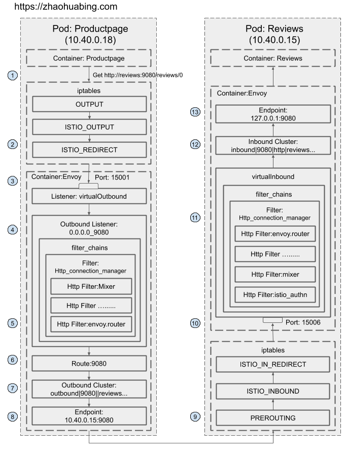


Virtual Inbound Listener

1. Productpage发起对Reviews服务的调用：`http://reviews:9080/reviews/0` 。
2. 请求被Productpage Pod的iptable规则拦截，重定向到本地的15001端口。
3. 在15001端口上监听的Envoy Virtual Outbound Listener收到了该请求。
4. 请求被Virtual Outbound Listener根据原目标IP（通配）和端口（9080）转发到0.0.0.0_9080这个 outbound listener。

```json
{
    "version_info": "2019-12-04T03:08:06Z/13",
    "listener": {
        "name": "virtualOutbound",
        "address": {
            "socket_address": {
                "address": "0.0.0.0",
                "port_value": 15001
            }
        },
        ......

         "use_original_dst": true //请求转发给和原始目的IP:Port匹配的listener
    },
    "last_updated": "2019-12-04T03:08:22.919Z"
}
```

1. 根据0.0.0.0_9080 listener的http_connection_manager filter配置,该请求采用“9080” route进行分发。

```json
 {
    "version_info": "2019-12-04T03:08:06Z/13",
    "listener": {
        "name": "0.0.0.0_9080",
        "address": {
            "socket_address": {
                "address": "0.0.0.0",
                "port_value": 9080
            }
        },
        "filter_chains": [
            {
                "filters": [
                    {
                        "name": "envoy.http_connection_manager",
                        "typed_config": {
                            "@type": "type.googleapis.com/envoy.config.filter.network.http_connection_manager.v2.HttpConnectionManager",
                            "stat_prefix": "outbound_0.0.0.0_9080",
                            "http_filters": [
                                {
                                    "name": "mixer",
                                    ......
                                },
                                {
                                    "name": "envoy.cors"
                                },
                                {
                                    "name": "envoy.fault"
                                },
                                {
                                    "name": "envoy.router"
                                }
                            ],
                            ......
                            
                            "rds": {
                                "config_source": {
                                    "ads": {}
                                },
                                "route_config_name": "9080" //采用“9080” route进行分发
                            }
                        }
                    }
                ]
            }
        ],
        "deprecated_v1": {
            "bind_to_port": false
        },
        "listener_filters_timeout": "0.100s",
        "traffic_direction": "OUTBOUND",
        "continue_on_listener_filters_timeout": true
    },
    "last_updated": "2019-12-04T03:08:22.822Z"
}   
```

1. “9080”这个route的配置中，host name为reviews:9080的请求对应的cluster为outbound|9080||reviews.default.svc.cluster.local

```json
{
    "name": "reviews.default.svc.cluster.local:9080",
    "domains": [
        "reviews.default.svc.cluster.local",
        "reviews.default.svc.cluster.local:9080",
        "reviews",
        "reviews:9080",
        "reviews.default.svc.cluster",
        "reviews.default.svc.cluster:9080",
        "reviews.default.svc",
        "reviews.default.svc:9080",
        "reviews.default",
        "reviews.default:9080",
        "10.102.108.56",
        "10.102.108.56:9080"
    ],
    "routes": [
        {
            "match": {
                "prefix": "/"
            },
            "route": {
                "cluster": "outbound|9080||reviews.default.svc.cluster.local",
                "timeout": "0s",
                "retry_policy": {
                    "retry_on": "connect-failure,refused-stream,unavailable,cancelled,resource-exhausted,retriable-status-codes",
                    "num_retries": 2,
                    "retry_host_predicate": [
                        {
                            "name": "envoy.retry_host_predicates.previous_hosts"
                        }
                    ],
                    "host_selection_retry_max_attempts": "5",
                    "retriable_status_codes": [
                        503
                    ]
                },
                "max_grpc_timeout": "0s"
            },
            "decorator": {
                "operation": "reviews.default.svc.cluster.local:9080/*"
            },
            "typed_per_filter_config": {
                "mixer": {
                    "@type": "type.googleapis.com/istio.mixer.v1.config.client.ServiceConfig",
                    "disable_check_calls": true,
                    "mixer_attributes": {
                        "attributes": {
                            "destination.service.host": {
                                "string_value": "reviews.default.svc.cluster.local"
                            },
                            "destination.service.name": {
                                "string_value": "reviews"
                            },
                            "destination.service.namespace": {
                                "string_value": "default"
                            },
                            "destination.service.uid": {
                                "string_value": "istio://default/services/reviews"
                            }
                        }
                    },
                    "forward_attributes": {
                        "attributes": {
                            "destination.service.host": {
                                "string_value": "reviews.default.svc.cluster.local"
                            },
                            "destination.service.name": {
                                "string_value": "reviews"
                            },
                            "destination.service.namespace": {
                                "string_value": "default"
                            },
                            "destination.service.uid": {
                                "string_value": "istio://default/services/reviews"
                            }
                        }
                    }
                }
            },
            "name": "default"
        }
    ]
}
```

1. outbound|9080||reviews.default.svc.cluster.local cluster为动态资源，通过eds查询得到该cluster中有3个endpoint。

```json
{
    "clusterName": "outbound|9080||reviews.default.svc.cluster.local",
    "endpoints": [
        {
            "lbEndpoints": [
                {
                    "endpoint": {
                        "address": {
                            "socketAddress": {
                                "address": "10.40.0.15",
                                "portValue": 9080
                            }
                        }
                    },
                    "metadata": {
                        "filterMetadata": {
                            "envoy.transport_socket_match": {
                                "tlsMode": "istio"
                            },
                            "istio": {
                                "uid": "kubernetes://reviews-v1-75b979578c-pw8zs.default"
                            }
                        }
                    },
                    "loadBalancingWeight": 1
                },
                {
                    "endpoint": {
                        "address": {
                            "socketAddress": {
                                "address": "10.40.0.16",
                                "portValue": 9080
                            }
                        }
                    },
                    "metadata": {
                        "filterMetadata": {
                            "envoy.transport_socket_match": {
                                "tlsMode": "istio"
                            },
                            "istio": {
                                "uid": "kubernetes://reviews-v3-54c6c64795-wbls7.default"
                            }
                        }
                    },
                    "loadBalancingWeight": 1
                },
                {
                    "endpoint": {
                        "address": {
                            "socketAddress": {
                                "address": "10.40.0.17",
                                "portValue": 9080
                            }
                        }
                    },
                    "metadata": {
                        "filterMetadata": {
                            "envoy.transport_socket_match": {
                                "tlsMode": "istio"
                            },
                            "istio": {
                                "uid": "kubernetes://reviews-v2-597bf96c8f-l2fp8.default"
                            }
                        }
                    },
                    "loadBalancingWeight": 1
                }
            ],
            "loadBalancingWeight": 3
        }
    ]
}
```

1. 请求被转发到其中一个endpoint 10.40.0.15，即Reviews-v1所在的Pod。
2. 然后该请求被iptable规则拦截，重定向到本地的15006端口。
3. 在15006端口上监听的Envoy Virtual Inbound Listener收到了该请求。
4. 根据匹配条件，请求被Virtual Inbound Listener内部配置的Http connection manager filter处理，该filter设置的路由配置为将其发送给inbound|9080|http|reviews.default.svc.cluster.local这个inbound cluster。

```json
{
    "version_info": "2019-12-04T03:07:44Z/12",
    "listener": {
        "name": "virtualInbound",
        "address": {
            "socket_address": {
                "address": "0.0.0.0",
                "port_value": 15006
            }
        },
        "filter_chains": [
            ......
            {
                "filter_chain_match": {
                    "prefix_ranges": [
                        {
                            "address_prefix": "10.40.0.15",
                            "prefix_len": 32
                        }
                    ],
                    "destination_port": 9080
                },
                "filters": [
                    {
                        "name": "envoy.http_connection_manager",
                        "typed_config": {
                            "@type": "type.googleapis.com/envoy.config.filter.network.http_connection_manager.v2.HttpConnectionManager",
                            "stat_prefix": "inbound_10.40.0.15_9080",
                            "http_filters": [
                                {
                                    "name": "istio_authn",
                                    ......
                                },
                                {
                                    "name": "mixer",
                                    ......
                                },
                                {
                                    "name": "envoy.cors"
                                },
                                {
                                    "name": "envoy.fault"
                                },
                                {
                                    "name": "envoy.router"
                                }
                            ],
                            ......
                            "route_config": {
                                "name": "inbound|9080|http|reviews.default.svc.cluster.local",
                                "virtual_hosts": [
                                    {
                                        "name": "inbound|http|9080",
                                        "domains": [
                                            "*"
                                        ],
                                        "routes": [
                                            {
                                                "match": {
                                                    "prefix": "/"
                                                },
                                                ......
                                                "route": {
                                                    "timeout": "0s",
                                                    "max_grpc_timeout": "0s",
                                                    "cluster": "inbound|9080|http|reviews.default.svc.cluster.local" //对应的inbound cluster
                                                }
                                            }
                                        ]
                                    }
                                ],
                                "validate_clusters": false
                            }
                        }
                    }
                ],
                ......
}
```

1. inbound|9080|http|reviews.default.svc.cluster.local cluster配置的host为127.0.0.1：9080。

```json
{
    "version_info": "2019-12-04T03:08:06Z/13",
    "cluster": {
        "name": "inbound|9080|http|productpage.default.svc.cluster.local",
        "type": "STATIC",
        "connect_timeout": "1s",
        "circuit_breakers": {
            "thresholds": [
                {
                    "max_connections": 4294967295,
                    "max_pending_requests": 4294967295,
                    "max_requests": 4294967295,
                    "max_retries": 4294967295
                }
            ]
        },
        "load_assignment": {
            "cluster_name": "inbound|9080|http|productpage.default.svc.cluster.local",
            "endpoints": [
                {
                    "lb_endpoints": [
                        {
                            "endpoint": {
                                "address": {
                                    "socket_address": {
                                        "address": "127.0.0.1", //cluster配置的endpoint地址
                                        "port_value": 9080
                                    }
                                }
                            }
                        }
                    ]
                }
            ]
        }
    },
    "last_updated": "2019-12-04T03:08:22.658Z"
}
```

1. 请求被转发到127.0.0.1：9080，即Reviews服务进行业务处理。

上述调用流程涉及的完整Envoy配置文件参见该github repository：https://github.com/zhaohuabing/bookinfo-bookinfo-config-dump/tree/istio1.4.0

# 小结

本文介绍了Istio流量管理相关组件，Istio控制面和数据面之间的标准接口，以及Istio下发到Envoy的完整配置数据的结构和内容。然后通过Bookinfo示例程序的一个端到端调用分析了Envoy是如何实现服务网格中服务发现和路由转发的，希望能帮助大家透过概念更进一步深入理解Istio流量管理的实现机制。