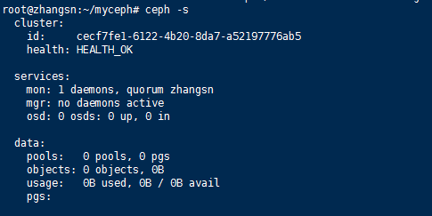
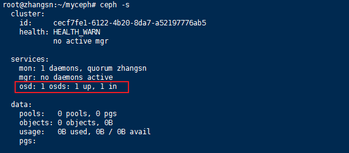

# 单机版Ceph环境部署，Linux平台

Ceph已经如火如荼，很多公司都在使用Ceph作为自己的存储系统。日常学习不太可能安装一个Ceph集群，因此本文介绍如何部署一个单节点的Ceph系统。另外，本文安装的后端存储引擎是BlueStore，这个引擎是目前性能比较好，且成熟的引擎。

# 环境说明

> 1. **单节点**：可以是VMWare或者VirtualBox虚拟机
> 2. **操作系统**： CentOS 7.4 或者 Ubuntu 18.04
> 3. **部署工具**：使用 ceph-deploy 进行部署

# 安装软件ceph-deploy

我们针对目前比较流行的2个发行版分别介绍，也就是CentOS和Ubuntu系统。对于其它发行版本文暂时不做介绍。

## CentOS 7.4

准备 centos 7.4 系统的机器（可以是物理机或者虚拟机），并配置好 ssh 的无密码登录。
 需要注意的是这里**需要的版本是2.0**，不要使用系统默认的版本（默认版本可能是1.x）。因为默认版本比较低，可能无法使用BlueStore特性。


```cpp
yum install https://download.ceph.com/rpm-luminous/el7/noarch/ceph-deploy-2.0.0-0.noarch.rpm
```

## Ubuntu 18.04

对于Ubuntu系统**需要添加安装源**，如果使用系统默认的安装源ceph-deploy版本太低，后续操作会有问题。


```csharp
wget -q -O- 'https://download.ceph.com/keys/release.asc' | sudo apt-key add -
echo deb https://download.ceph.com/debian-{ceph-stable-release}/ $(lsb_release -sc) main | sudo tee /etc/apt/sources.list.d/ceph.list
```

上述命令中的`ceph-stable-release`是希望安装Ceph的版本，在具体安装时需要替换掉，比如希望安装L版本则需要替换成字符串`luminous`， 如果希望安装M版时，需要替换成字符串`mimic`。下面是一个具体的例子。


```php
echo deb https://download.ceph.com/debian-luminous/ $(lsb_release -sc) main | sudo tee /etc/apt/sources.list.d/ceph.list
```

添加完安装源后，更新apt缓存，然后就可以安装ceph-deploy了，具体命令如下：


```undefined
sudo apt update
sudo apt -y install ceph-deploy
```

# 安装ceph软件包

**创建新集群**
 安装完ceph-deploy之后就可以通过它安装ceph软件了（后续安装与发行版没有关系了），当然首先要创建一个ceph集群。创建ceph集群也是通过ceph-deploy命令，**其本质上是创建配置文件和key文件**。


```bash
mkdir myceph
cd myceph
ceph-deploy new zhangsn
```

因为我们是单节点ceph集群，因此需要将集群的副本数量设置为1，这样方便一些。具体方法是把如下内容加入到 ceph.conf 里面。


```csharp
[global]
osd pool default size = 1
osd pool default min size = 1
```

**安装 ceph 软件**
 修改完配置文件之后，我们就可以安装Ceph软件包了。以安装L版本的软件为例，执行如下命令即可。


```undefined
ceph-deploy install --release luminous zhangsn
```

**初始化 mon**
 Ceph的整个集群的状态和配置信息等都是通过一个名为Monitor的集群管理的，因此首先需要启动Monitor服务。可以执行如下命令完成：


```undefined
ceph-deploy mon create-initial
ceph-deploy admin zhangsn
```

启动Monitor节点后Ceph集群就可以访问了，通过`ceph -s`命令可以查看集群的状态。




图1 Ceph集群状态


**部署ceph mgr**
 ceph mgr也是一个必须部署的组件，可以通过如下命令部署。


```undefined
ceph-deploy  mgr create zhangsn
```

**部署ceph osd**
 我们知道OSD是Ceph中存储数据的节点，前面我们部署了Monitor节点，接下来部署 ceph osd。为了便于我们后续研究BlueStore的架构及原理，我们创建2种类型的OSD，一个是具有3个逻辑卷的OSD（模拟不同类型的存储介质），另外一个是只有一个逻辑卷的OSD。
 首先创建具有3个逻辑卷的OSD，分别是db、wal和data。分别执行如下命令创建卷组和逻辑卷。


```ruby
$ pvcreate /dev/sdb
  Physical volume "/dev/sdb" successfully created.
$ vgcreate  ceph-pool /dev/sdb
  Volume group "ceph-pool" successfully created
$ lvcreate -n osd0.wal -L 1G ceph-pool
  Logical volume "osd0.wal" created.
$ lvcreate -n osd0.db -L 1G ceph-pool
  Logical volume "osd0.db" created.
$ lvcreate -n osd0 -l 100%FREE ceph-pool
  Logical volume "osd0" created.
```

完成逻辑卷的创建后我们就可以创建 OSD 了。


```kotlin
ceph-deploy osd create \
    --data ceph-pool/osd0 \
    --block-db ceph-pool/osd0.db \
    --block-wal ceph-pool/osd0.wal \
    --bluestore zhangsn
```

如果一切顺利，经过上述步骤后就完成了一个最小的集群的创建了。可以在通过`ceph -s`查看一下状态。



图2 Ceph集群状态


接下来我们在创建一个运行在整个裸盘上的OSD，也是通过ceph-deploy进行创建，具体命令如下：


```kotlin
ceph-deploy osd create --bluestore zhangsn --data /dev/sdc
```

至此，我们完成了整个安装过程，可以通过前面的命令看一下集群的状态，本文不在赘述。BlueStore在设计的时候就可以支持多个分区，主要目的是为了在同一个OSD的不同内容使用不同的存储介质。例如，对于元数据采用更高性能的SSD。
 今天我们部署了一个基本的环境，后续我们将依赖该环境进行后续的学习，比如BlueStore的实现原理和代码分析等等。


作者：SunnyZhang的IT世界
链接：https://www.jianshu.com/p/cfc37710dadb
来源：简书
著作权归作者所有。商业转载请联系作者获得授权，非商业转载请注明出处。