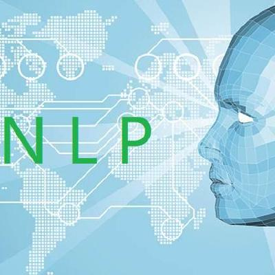

# ACL | 自然语言处理（NLP）之多轮对话建模优化（Utterance ReWriter）

## 引言

    最近2019年新鲜的ACL论文出来了，发现了一篇关于多轮对话模型的文章还不错，其题目为：**Improving Multi-turn Dialogue Modelling with Utterance ReWriter**。文章单位：**微信人工智能模式识别中心（腾讯）**。文章的背景为：当前我们在日常多轮交流的时候，经常会出现前后相互参照和信息遗漏的问题，这对于人来说能够正确的理解出说话人的意图，但是对于机器来说，这是比较困难的。为此该篇文章提出了：为提高多轮会话模型水平，将重写人类的话语作为其一个预处理过程。每句话都要重写一遍，以恢复所有相关和省略的信息。然后根据重写的话语执行下一步处理步骤。为了更好地训练语音重写器，文章收集了一个带有人工注释的新数据集，并利用指针网络引入了一种基于转换的语音重写体系结构。

## 本文概述

    当前对话系统中，对于单轮对话的模型建模来说已经相对比较成熟一点，但是对于多轮对话来说仍然具有比较大的挑战。其最大的挑战就是在多轮对话中存在共指关系和信息缺失。如下图所示：

    为了解决多轮对话中的共指关系和信息缺失的问题，本文的思路是训练一个言语重写器将多轮对话转换成单轮对话，其目的就和上图所示，将Utterance3改成Utterrance3`。由于把信息补全了，所以此时的多轮就相当于单轮对话了，将其输入到对话系统中，就可以按照单轮对话来处理了。为了训练言语重写器，文章创建了包含2万个多轮对话数据集，并且每句话都是成对的存在的；提出了一种高效的基于转换的话语改写器，其性能优于其它几个比较强的基线版本；最后将话语改写器应用到现实生活中的在线聊天机器人中，得到比较显著的改进效果。

## 数据集介绍

    为了获得句子改写器模型的并行训练数据，我们从几个流行的中国社交媒体平台上抓取了200k个候选的多轮会话数据，供标注者使用。敏感信息会预先过滤，以便以后处理。在开始标注之前，我们随机抽取了2000个会话数据，并分析了多轮对话中出现共引用和省略的频率。

    表2列出了统计数据。可以看出，只有不到30%的话语既没有共参也没有省略，相当多的话语既没有共参也没有省略。这进一步证实了在多轮对话中处理这些情况的重要性。

## 模型介绍

### 问题定义

    定义每个训练样本为： ![[公式]](imgs/equation) ，其中 ![[公式]](imgs/equation?tex=H%3D\left\{U_1%2CU_2%2C...%2CU_{n-1}\right\}) 表示前n-1轮的会话历史， ![[公式]](imgs/equation-20201121193021202) 表示第n轮的会话前，R表示消除共指关系和信息缺失后输出的言语。训练Utterance ReWriter目标根据会话历史数据自动推断出重写的 ![[公式]](https://www.zhihu.com/equation?tex=U_n) 。该过程首先将 ![[公式]](imgs/equation-20201121193021383) 编码为向量s序列，然后利用指针网络对R进行解码。整个模型架构图如下所示：

### 编码器

    我们将 ![[公式]](imgs/equation-20201121193021383) 中的所有token展开为 ![[公式]](imgs/equation-20201121193020078) 。m是整个对话中的token数量。在每两个会话之间插入一个会话结束分隔符。然后用转换器对展开的token序列进行编码。我们将 ![[公式]](https://www.zhihu.com/equation?tex=%28H%2CU_n%29) 中的所有token连接起来作为输入，希望转换器能够通过self-attention机制在其中学习基本的共指信息。对于每个token ![[公式]](imgs/equation-20201121193023209) ，其输入嵌入量为其单词嵌入、位置嵌入和轮数嵌入之和:

    单词嵌入 ![[公式]](imgs/equation-20201121193025907) 和位置嵌入 ![[公式]](imgs/equation-20201121193026990) 与一般的转换结构相同[1]。我们添加一个附加的轮数嵌入 ![[公式]](imgs/equation-20201121193026992) 来表示每个token属于哪一轮数。来自相同回合的token将共享相同轮的嵌入。然后将输入嵌入转发到 ![[公式]](imgs/equation-20201121193023786) 堆叠编码器中，得到最终的编码表示形式。每个编码器包含一个自我注意层，并且携带着一个前馈神经网络。

    FNN是一个前馈神经网络， ![[公式]](imgs/equation-20201121193023912) 是一个多头注意力函数，它的输入为查询矩阵Q，键矩阵K以及值矩阵V。每个自注意和前馈组件都有一个剩余连接和分层归一化步骤[2]。

### 解码器

    解码器也包含L层，每层由三个子层组成。第一个子层是多头self-attention:

![[公式]](imgs/equation-20201121193024870) 。第二个子层是编码器-解码器注意，它将 ![[公式]](imgs/equation-20201121193025188) 集成到解码器中。在我们的任务中，由于 ![[公式]](imgs/equation-20201121193027196) 和 ![[公式]](https://www.zhihu.com/equation?tex=U_n) 的用途不同，我们使用单独的键值矩阵来表示来自对话历史H和来自 ![[公式]](https://www.zhihu.com/equation?tex=U_n) 的标记。从上一节得到的编码序列 ![[公式]](https://www.zhihu.com/equation?tex=E%28L%29) 被分解为 ![[公式]](imgs/equation-20201121193027883) *(* ![[公式]](https://www.zhihu.com/equation?tex=H) *的令牌编码)和* ![[公式]](imgs/equation-20201121193029024) ( ![[公式]](https://www.zhihu.com/equation?tex=U_n) 的tokensen编码)，然后分别处理。编码器和解码器的矢量计算如下:

第三个子层是位置全连通的前馈神经网络:

### 输出分布

    在解调过程中，我们希望我们的模型可以在不同的步骤中学习从 ![[公式]](https://www.zhihu.com/equation?tex=H) 或 ![[公式]](https://www.zhihu.com/equation?tex=U_n) 复制单词。因此，我们施加一个软门控权重λ来做出决定。结合最后一层的译码层的注意分布计算译码概率。

    其中 ![[公式]](imgs/equation-20201121193029356) 和 ![[公式]](imgs/equation-20201121193030557) 分别是 ![[公式]](https://www.zhihu.com/equation?tex=H) 和 ![[公式]](https://www.zhihu.com/equation?tex=U_n) 中token上的注意分布。 ![[公式]](imgs/equation-20201121193030608) , ![[公式]](imgs/equation-20201121193030876) 和 ![[公式]](imgs/equation-20201121193030926) 是需要学习的参数, ![[公式]](imgs/equation-20201121193032589) 是sigmod函数。门权重 ![[公式]](imgs/equation-20201121193032589-5958232.) 的工作原理就像哨兵一样，通知解码器是否从对话中提取信息历史 ![[公式]](https://www.zhihu.com/equation?tex=H) 或直接在 ![[公式]](https://www.zhihu.com/equation?tex=U_n) 拷贝。如果 ![[公式]](https://www.zhihu.com/equation?tex=U_n) 既不包含共指信息也不包含信息遗漏。 ![[公式]](https://www.zhihu.com/equation?tex=%CE%BB) 就总是1复制最初的 ![[公式]](https://www.zhihu.com/equation?tex=U_n) 作为输出。否则当检测到共指信息和信息遗漏的时候， ![[公式]](https://www.zhihu.com/equation?tex=%CE%BB) 就会变成0，此时注意机制负责从对话历史中找到适当的共指信息或缺省信息。整个模型是端到端进行训练，来最大化 ![[公式]](imgs/equation-20201121193033944) 。

### 实验结果

    我们训练我们的模型在收集的数据集上执行话语重写任务。在本节中，我们将重点回答以下两个问题:(1)您所提出的模型分别能在多大程度上准确地执行共参照解析和信息补全;(2)训练有素的话语改写者在帮助离线对话系统提供更合适的回答方面有多出色。为了回答第一个问题，我们将我们的模型与几个强基线进行比较，并通过自动评估和人工判断对它们进行测试。对于第二个问题，我们整合了我们的两个在线对话系统模型，并分析了它是如何影响人机交互的。下面的部分将首先介绍比较的模型和基本设置，然后报告我们的评估结果。

    实验结果我看了一下，主要是针对论文主审的问题进行做的实验，这里我就不多说了。有兴趣的同学可以下载原文看一下。

原文地址：

[yinizhilian/ACL_Papergithub.com](https://link.zhihu.com/?target=https%3A//github.com/yinizhilian/ACL_Paper)