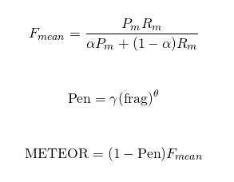

# 深度学习对话系统理论篇--数据集和评价指标介绍


## **对话系统常用评价指标**

当前对话系统之所以还没有取得突破性的进展，很大程度上是因为没有一个可以准确表示回答效果好坏的评价标准。对话系统中大都使用机器翻译、摘要生成领域提出来的评价指标，但是很明显对话系统的场景和需求与他们是存在差别的，这也是当前模型效果不是很好的原因之一。从对话系统不同的层次角度来评价对话系统的效果时，每个层面会有不同的关注点，如下图所示：


从上图可以看出，黄色标识人类的主观角度，而蓝色表示系统的一些客观评价指标，可以用来衡量主观需求。对于某一轮对话而言，可以使用响应的适当性、流畅度、相关性；对于多轮对话而言，我们更关注流畅性、对话深度、多样性、一致连贯性等指标；而对于整个对话系统，我们则希望他可以涵盖更多的话题、回复真实可信等等。这些都是我们想要对话系统所拥有的能力，但是往往在一个具体的任务中我们只能关注某一项或者几项指标，这里我们主要针对开放域生成式对话模型的评价指标进行总结。

首先感谢@徐阿衡回答的了我的这个问题：[现在基于深度学习的对话系统常用的评价指标有哪些，分别有什么优缺点和适用范围？](https://www.zhihu.com/question/264731577)，让我对当前对话系统的评价指标有了一个大致的认识，这里主要关注于其提到的第二点也就是词重叠评价指标（BLEU、ROUGE、METEOR）和词向量评价指标（Greedy matching、Embedding Average、Vector Extrema），还有perplexity困惑度，会扩展的讲一下每种指标的细节。这部分内容可以参考论文“How NOT To Evaluate Your Dialogue System: An Empirical Study of Unsupervised Evaluation Metrics for Dialogue Response Generation”，该论文详细论述了非监督生成式对话系统的各种评价指标。


## 词重叠评价指标

首先来看词重叠评价指标，他们认为有效地回答应该和真实回答之间存在大量的词重叠（但是对话系统的答案空间往往是发散的，也就是一个问题的答案可能是完全不同的两句话，这种情况下该评价指标效果不好），也就是说这是一个非常强的假设。（以下环节中r表示真是响应，r^表示系统生成响应）

**BLEU**

该评价指标有IBM在2002年提出，参考论文“[BLEU: a Method for Automatic Evaluation of Machine Translation](https://link.zhihu.com/?target=http%3A//www.aclweb.org/anthology/P02-1040.pdf)”，常作为机器翻译系统评价指标。其实就是统计生成响应和真实响应中的n-gram词组在整个训练语料中出现次数。公式如下所示：


第一个公式Pn用于计算n-gram短语词组在整个数据集中的准确度。h(k,r)表示每个n-gram词组在真实响应中出现的次数（因为对于每个n而言都会存在很多个n-gram词组，所以要有一个求和符号）。所以上式就是每个n-gram词组在真实和生成响应中出现次数的较小值求和除以其在生成响应中出现次数求和，表征了一种精确度度量。当然，我们需要考虑n的取值（一般取1-4），所以有了第二个公式，beta表示各个n-gram的权重（可以去均匀分布），也就是对1-4进行加权求和，而b(r,r^)表示长度惩罚因子，即我们不想让生成的答案长度太短，所以加一个惩罚因子来改善效果。

可以参考这篇文章，结合一个实际的例子和代码进行理解BLEU的原理：[机器翻译评价指标之BLEU](https://link.zhihu.com/?target=http%3A//blog.csdn.net/guolindonggld/article/details/56966200)

**ROUGE**

该指标常用于文本摘要领域，包含 ROUGE-N, ROUGE-L(最长公共子句, Fmeasure), ROUGE-W(带权重的最长公共子句, Fmeasure), ROUGE-S(不连续二元组, Fmeasure) 四种。这里以ROUGE-L为例进行介绍，更多可以参考“[自动文档摘要评价方法---Edmundson和ROUGE](https://link.zhihu.com/?target=http%3A//blog.csdn.net/lcj369387335/article/details/69845385)”一文。

ROUGE-L，是计算最长公共子序列的长度，感觉像是在刷题一样==。其实就是寻找真是响应和生成响应之间的最长公共子序列长度，然后计算其F-measure分数。其与BLEU相似，因为都可以反应词语顺序，但是ROUGE的词可以不是连续的，而BLEU的n-gram要求词语必须连续出现。比如两句话“我喜欢吃西瓜”和“我刚才吃了一个西瓜”的最长公共子串为“我 吃 西 瓜”。


**METEOR**

METEOR是基于BLEU进行了一些改进，加入了生成响应和真实响应之间的对其关系。使用WordNet计算特定的序列匹配，同义词，词根和词缀，释义之间的匹配关系，改善了BLEU的效果，使其跟人工判别共更强的相关性。同样也是使用F-measure的计算方法，如下图所示，具体可以参考论文“ METEOR: An automatic metric for mt evaluation with improved correlation with human judgments”：



上面这三种评价指标在对话系统中使用的频率貌似是BLEU比较高一点，剩下两个都很少见到。

## 词向量评价指标

上面的词重叠评价指标基本上都是n-gram方式，去计算生成响应和真是响应之间的重合程度，共现程度等指标。而词向量则是通过Word2Vec、Sent2Vec等方法将句子转换为向量表示，这样一个句子就被映射到一个低维空间，句向量在一定程度上表征了其含义，在通过余弦相似度等方法就可以计算两个句子之间的相似程度。使用词向量的好处是，可以一定程度上增加答案的多样性，因为这里大多采用词语相似度进行表征，相比词重叠中要求出现完全相同的词语，限制降低了很多。

**Greedy Matching**


如上图所示，对于真实响应的每个词，寻找其在生成响应中相似度最高的词，并将其余弦相似度相加并求平均。同样再对生成响应再做一遍，并取二者的平均值。上面的相似度计算都是基于词向量进行的，可以看出本方法主要关注两句话之间最相似的那些词语，即关键词。

**Embedding Average**

这种方法直接使用句向量计算真实响应和生成响应之间的相似度，而句向量则是每个词向量加权平均而来，如下图所示。然后使用余弦相似度来计算两个句向量之间的相似度。


**Vector Extrema**

跟上面的方法类似，也是先通过词向量计算出句向量，在使用句向量之间的余弦相似度表示二者的相似度。不过句向量的计算方法略有不同，这里采用向量极值法进行计算。

## perplexity困惑度

perplexity是语言模型中的指标，用于评价语言模型的好坏，其实就是估算一句话出现的概率，看一句话是否通顺。也经常会在对话系统中出现评价生成的响应是否符合语言规则，计算方法也很简单，如下图所示：


所以当我们使用tf.contrib.seq2seq.sequence_loss()函数计算模型loss的时候，perplexity的计算就显得很简单了，直接对计算出来的loss取个指数就行了，命令如下所示：

```python3
train_perp = math.exp(float(mean_loss)) if mean_loss < 300 else math.inf
```

现在我训练的对话系统，一般都只是用了perplexity来评判模型的效果，最终perplexity可以降到20左右（越小越好，说明越接近于自然语言）。

## 人工指标

最后说一下人工评价，首先来讲，上面说了这么多的评价指标，并没有一个可以很好的解决对话系统的问题，就像“How NOT To Evaluate Your Dialogue System”论文中说到的那样，当下的这些评价指标都跟人工评价成弱相关或者完全没有关系，相关程度跟具体的数据集有关。

以下摘自徐阿衡的回答：

- 在闲聊性质的数据集上，上述 metric 和人工判断有一定微弱的关联 (only a small positive correlation on chitchat oriented Twitter dataset)
- 在技术类的数据集上，上述 metric 和人工判断完全没有关联(no correlation at all on the technical UDC)
- 当局限于一个特别具体的领域时，BLEU 会有不错的表现

其实随着16/17这两年的发展，还逐渐有了一些别的评价方法，比如使用GAN网络来评价生成的回复是否跟人类回复相似等等，就等以后具体看到了再回来填坑吧。

## **对话系统常用数据集**

这部分主要介绍一下当前使用比较广泛的对话系统数据集的细节构成。也会稍微介绍一下公开的中文数据集。可以参考“A Survey of Available Corpora for Building Data-Driven Dialogue Systems”这篇论文，而且作者把所有的数据集按照不同类别进行分类总结，里面涵盖了很多数据集，这里不会全部涉及，有兴趣的同学可以看这个[链接](https://link.zhihu.com/?target=https%3A//docs.google.com/spreadsheets/d/1SJ4XV6NIEl_ReF1odYBRXs0q6mTkedoygY3kLMPjcP8/pubhtml)。

## 英文数据集

- Cornell Movie Dialogs：电影对话数据集，下载地址：[http://www.cs.cornell.edu/~cristian/Cornell_Movie-Dialogs_Corpus.html](https://link.zhihu.com/?target=http%3A//www.cs.cornell.edu/~cristian/Cornell_Movie-Dialogs_Corpus.html)
- Ubuntu Dialogue Corpus：Ubuntu日志对话数据，下载地址：[https://arxiv.org/abs/1506.08909](https://link.zhihu.com/?target=https%3A//arxiv.org/abs/1506.08909)
- OpenSubtitles：电影字幕，下载地址：[http://opus.lingfil.uu.se/OpenSubtitles.php](https://link.zhihu.com/?target=http%3A//opus.lingfil.uu.se/OpenSubtitles.php)
- Twitter：twitter数据集，下载地址：[https://github.com/Marsan-Ma/twitter_scraper](https://link.zhihu.com/?target=https%3A//github.com/Marsan-Ma/twitter_scraper)
- Papaya Conversational Data Set：基于Cornell、Reddit等数据集重新整理之后，好像挺干净的，下载链接：[https://github.com/bshao001/ChatLearner](https://link.zhihu.com/?target=https%3A//github.com/bshao001/ChatLearner)

相关数据集的处理代码或者处理好的数据可以参见下面两个github项目：

- [DeepQA](https://link.zhihu.com/?target=https%3A//github.com/Conchylicultor/DeepQA)
- [chat_corpus](https://link.zhihu.com/?target=https%3A//github.com/Marsan-Ma/chat_corpus)

## 中文数据集

- dgk_shooter_min.conv：中文电影台词数据集，下载链接：[https://github.com/rustch3n/dgk_lost_conv](https://link.zhihu.com/?target=https%3A//github.com/rustch3n/dgk_lost_conv)
- 白鹭时代中文问答语料：白鹭时代论坛问答数据，一个问题对应一个最好的答案。下载链接：[https://github.com/Samurais/egret-wenda-corpus](https://link.zhihu.com/?target=https%3A//github.com/Samurais/egret-wenda-corpus)
- 微博数据集：华为李航实验室发布，也是论文“Neural Responding Machine for Short-Text Conversation”使用的数据集下载链接：[http://61.93.89.94/Noah_NRM_Data/](https://link.zhihu.com/?target=http%3A//61.93.89.94/Noah_NRM_Data/)
- 新浪微博数据集，评论回复短句，下载地址：[http://lwc.daanvanesch.nl/open](https://link.zhihu.com/?target=http%3A//lwc.daanvanesch.nl/openaccess.php)