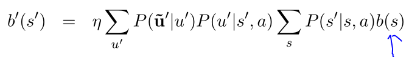
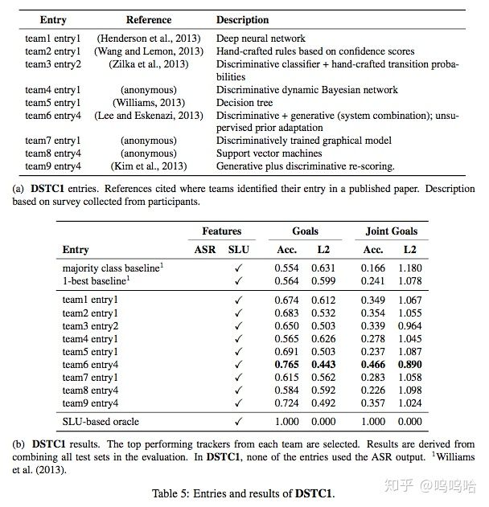

# 多轮对话状态追踪（DST）--模型介绍篇

这段时间在实习，做的是多轮对话，由于之前没接触过，所以有太多的东西要学，最近也一直在狂补基本知识，所以专栏一直没时间更新。前几天刚完成了公司的一个阶段性任务，所以有时间梳理一下这段时间看过的一些文章，希望体系的屡一下DST相关的知识和常用模型等。这里主要会围绕DSTC竞赛进行介绍，模型也多是在该竞赛的基础上，使用相关数据集提出的方法。本文主要会从下面几个方向进行介绍：

- DST基础

- - 对话状态定义
  - DST定义
  - DST实例

- DST常用方法

- - Rule-based DST
  - Generative Models for DST
  - Discriminative Models for DST（分类+序列建模）
  - Web Rank for DST

- 基于深度学习的DST模型

- - DNN for DSTC1
  - Word-based RNN for DSTC2
  - Delexicalised RNN for DSTC3
  - Neural Belief Tracking（NBT）for DSTC2
  - Fully NBT

- DSTC简介

- - DSTC1
  - DSTC2
  - DSTC3

## **DST基础**

对话状态定义：对话状态St是一种将到t时刻为止的对话历史简化为可供系统选择下一时刻action信息的**数据结构，**往往可以理解为每个slot的取值分布情况。

DST（Dialog State Tracking）就是根据所有对话历史信息推断当前**对话状态St和用户目标**。往往是pipeline对话系统中至关重要的一个模块，上接NLU，下接Policy。如下图所示：

如果把DST当做是一个黑盒的话，那么就可以简化为如下“输入-->输出”的形式，

- 输入往往包含：ASR、SLU 的输出结果N-best，系统采取的action，外部知识等等；
- 输出：对化状态St，用于选择下一步动作；

由于ASR、SLU等组件的识别结果往往会出错，所以常常会输出N-best列表（带置信度概率），这就要求DST拥有比较强的鲁棒性。所以DST往往输出各个状态的概率分布，这样可以在多轮对话中进行修改，并且方便bot向用户发起澄清query。DST的例子见下图：

## **DST常用方法**

这里参考“The Dialog State Tracking Challenge Series: A Review”“MACHINE LEARNING FOR DIALOG STATE TRACKING: A REVIEW”这两篇论文进行总结。主要介绍当前DST的一些主流方法，其实主要就是人工规则、生成式模型、判别式模型、Web Rank四大类。就目前来讲，判别式模型效果更好，因为他通过特征提取的方法对对话状态进行精准建模，而且可以方便的结合深度学习等方法进行自动提取特征。此外，RNN、CRF等模型可以将对话当做序列数据进行建模，学习对话轮次之间的状态变化，较传统的分类方法效果更好。

**1，Hand-Crafted Rules for DST**

一般只使用概率最高的SLU结果结合人工编写的更新规则进行状态更新：**F(s,u')=s'**。如下图所示，只有置信度高于0.8的slot和value才会被更新到对话状态中：

**优点：不需要训练数据，很适合冷启动，而且很容易将领域的先验知识编码到规则中。**

**缺点：无法利用ASR和SLU解析出的N-Best列表，也没有办法同时追踪多种状态。一般使用的规则都很简单，没有办法定制复杂状态的更新机制；缺乏灵活性。**

**===》有些方法直接编写N-Best列表进行状态更新。但是缺点是相关参数需要人工编写制定，没有办法根据数据分布进行学习**

**2，Generative Models for DST**

生成式模型主要是对数据集中存在的模式进行挖掘，学习出对话状态的条件概率分布。常见的方法包括贝叶斯网络和POMDP。通过构建对话状态之间的转义关系图，建模各变量之间的依赖关系和概率分布计算公式。下面以贝叶斯网络为例进行说明：

使用贝叶斯网络对状态分布进行预测，输入是**系统动作a+用户动作u+（ASR+SLU结果u~）**。

上面公式中b(s)代表上一时刻对话状态的分布，b'(s')表示预测的下一时刻状态分布，u'表示用户当前时刻的输入query。所以用户输入u依赖于当前的对话状态s和系统动作a，s'依赖于s和a'。

生成模型在效果上好于规则式方法，但是仍然无法完全利用所有有用的信息，原因就是其需要对**所有特征之间的依赖关系进行精确建模**，这是不现实的。而往往的做法是进行**不必要的假设或者忽略对话历史中一些有用的信息**。所以效果仍然无法满足需求。

**3，Discriminative Models for DST**

判别式模型的想法是先对观察结果提取有用特征，然后进行建模：b'(s') = P(s'|f')。通过对当前轮次对话提取特征来表示，往往在一定程度上可以反映出对话的状态，常见的特征见下面4.1节所使用的特征。常见的方法有两大类：

- 一种是将特征用于**训练分类器**，预测接下来的状态s'是哪一个，需要将所有历史信息抽象成一个固定维的特征向量。（ME、NN、web_ranking等方法）；
- 另外一种是将特征用于**序列建模，比如马尔科夫链、CRF、RNN等模型**。

判别式方法的主要环节就是特征提取+模型。特征提取主要包括人工体特征和模型自己学（RNN的word-based方法等），而模型就是上面提到的分类和序列建模两种。这也是我们接下来要介绍的主要方案。

缺点：判别式方法需要大量的标注数据用于训练==>multi_domain learning + 迁移学习 + 无监督自适应方法。

在上述的方法中，模型直接从大量数据中学习用户行为（改变目标等），因此可以引入一些先验知识改善状态追踪效果，比如对一些置信度高的SLU结果设计一些特定规则以表示状态的转换等。

## **深度学习模型DST**

从这里开始将要介绍具体的模型，会针对DSTC竞赛选择几个典型的DNN模型来介绍，具体的DSTC数据集会放在下一节进行介绍，因为主要是一些数据描述和竞赛结果等内容，放在前面会比较占篇幅。根据上面DST的定义，我们知道DST的输入是ASR+NLU的N-best列表，再加上bot上一时刻的动作等信息，而输出是对话状态和用户目标的表征。但是在具体建模中，我们直接会把对话状态细化为每个slot取值的概率分布。所以一般会对每个slot分别构建一个模型用于学习其概率分布，这样做的好处是将问题简化，方便实用深度学习的模型进行建模。

**1、DNN for DSTC1**

本文提出的模型把DST当做是一个分类问题，输入是时间窗口T内的对话轮次提取出的特征，输出是每个slot取值概率分布。该模型的优点是不需要知道slot取值的确定个数（参见DSTC1数据集特点，某些slot的取值范围不确定），而且模型对特定域的过拟合很弱，可以很容易的迁移到其他相似domain上。模型结构如下图所示：

对所有出现过的slot-value都进行下面的流程，再额外训练一个unknown值，这也是不需要知道所有value取值的原因，因为他把每个slot都拆分成很多个二分类，而不是一个多分类问题：

1. 其中1...M表示模型提取的M种特征（见下表）。t...t-T+1表示T时间窗口内的对话轮，对于最近的T个轮次，每轮都提取响应特征；0...t-T表示在此之前的所有轮，对于这些轮对话直接对其特征求和作为一维特征输入。所以最后留下T*M个特征。
2. 接下来经过三个全连接层，得到最终的编码向量E(t,v)（这里会对所有在t轮之前出现过的v都计算一次）。
3. 计算各个slot的value 。对于出现过的v，直接使用E(t,v)计算即可；对于没有出现过的slot，为每个slot训练一个参数B。然后进行归一化，如下图所示：

接下来看一下特征如何选取，为了达到更好的效果，本文选择了如下12个特征：

**2、Word-based RNN For DSTC2**

本文提出模型的特点：

1. 直接使用ASR输出的结果，不用SLU（避免了SLU模块的误差），而且将DST当做是一个序列建模问题，直接使用RNN处理；
2. 传统判别式方法需要人工提取特征，而本文直接使用n-gram特征以重构那些人工特征；
3. 构造一个与slot无关的RNN组件（见下面模型结构图中g|v部分），以解决判别式模型过拟合的现象，从而追踪未见过的系统状态

同样对每个slot训练一个RNN，其输入为上一轮用户query和系统动作，输出为本时刻的状态概率分布，并更新内部记忆向量。直接输出所有value的概率分布，对每个slot训练一个多分类器。

**接下来先来看看特征提取的办法**：

从上图可以看出，主要包含f，fs，fv三种特征，f是对原始query提取的，fs和fv都是对query中的词进行tag替换得到的模板泛化特征，其中**fv对每个value都进行提取**，这样做有助于模型泛化。最终模型的输入特征会达到3500维左右；

然后f，fs，fv都是有ASR和machine act两部分连接而成。ASR是query的N-best列表，分别提取其一元二元三元组n-gram，概率就是n-best置信度相加；machine act（acttype（slot=value）结构）也是同样，不过概率置1；具体可以参考上图，其实就是对query和machine act提取n-gram，进行各种组合，目的是通过这种低阶的多维组合，可以在高层重构出各种特征组合的可能性，来模拟甚至超越人工提取的各种特征。

**然后接下来看一下模型的结构：**

对每个slot训练一个模型，输出的是其所有value的可能取值+不存在的概率分布。 模型也包含两部分：h+g；

- 其中h是对f进行建模（h=NNet(f+p+m)），但是其泛化效果较差；
- g是对每个v都有一个模型（g=NNet(f+fs+fv+{P|N,P|v}+m)），主要是一些标签式的特征，其泛化效果较好

然后分别使用softmax和sigmoid对p和m进行更新。

**3、Delexicalised RNN for DSTC3**

仍然延续上述模型，只不过增加了无监督自适应学习过程，而且为了将模型泛化到一个新的domain，这里将上述模型中的h省去，易于泛化。模型结构图如下所示：

论文主要是为了DSTC3中的新domain知识的学习。这里不再赘述，想要了解的同学可以看原论文和DSTC3。

**4、Neural Belief Tracker（NBT）**

目前的对话系统很难扩展：NLU要求大量训练数据+模板用于捕捉用户差异输入。前面提到的几个模型也都并不像传统的深度学习那样，使用的还是n-gram特征作为输入。而且像Delexicalised这种方法需要大量的语义词典、模板等人工构造的信息才能够学习出相似、相关词进行替换，整个模型的复杂度仍然很高。为了解决这些问题，NBT模型就首次引入了word2vec来学习和表征语义相似度信息。

==>NBT模型使用表示学习的方法克服上述问题。首先使用word2vec将用户输入编码成语义向量。然后使用context modeling + semantic decoding两个子模块对分别实现上下文建模和单轮NLU的功能。

**第一部分**：先来看一下使用word2vec进行表示学习的模型，这里提出两种架构NBT-DNN + NBT+CNN，模型结构图如下所示：

- NBT-DNN模型流程：

- - 先对输入按照滑动窗口进行contactate得到向量vi（滑动窗口的长度分为1，2，3）；
  - 然后DNN模型对contactate之后的向量vi进行累加求和得到r1，r2，r3（分别代表n-gram的累加结果）；
  - 接下来通过一层神经网络将向量映射到同一维度得到r1‘，r2’，r3‘；
  - 最后箱量相加求sum，得到用户输入utterance的向量表示r

- NBT-CNN模型流程：

- - 先对输入按照滑动窗口进行contactate得到向量vi（滑动窗口的长度分为1，2，3）；
  - 然后分别去窗口长度为1，2，3，宽度为1*300，2*300，3*300的卷积核对v进行卷积；
  - 接下来对卷积结果使用Relu和max_pooling取出其最大值得到窗口1，2，3的编码向量r1’，r2‘，r3’；
  - 对向量进行求和得到最终用户输入utterance的表示向量r

**第二部分：**接下来看看整个系统的结构图，里面包含了semantic decoding和context modelling两部分：

- semantic decoding：判断一个slot-value对是否出现在当前query中

- - candidate pair表示方法：cs+cv直接使用词向量表示即可：c=tanh(W(cs+cv)+b)
  - 语义表示向量：d=r*c

- context modeling：对上一轮系统act结果进行解析，system request（tq）+system confirm（ts+tv）。

- - 系统询问（system request）：主要询问某个slot的取值，用tq表示，mr=(cs·tq)r
  - 系统确认（system confirm）：确认某个slot取值value，用ts和tv表示，用户返回正向or负向信息。mc=（cs·ts）(cv·tv)r

**第三部分：**Binary Decision Maker：进行二元决策，判定当前轮次中slot-value对的状态；

- 状态更新机制：本文采用简单的基于规则的状态更新机制。

- - 对每个ASR的输出query按照上述方法求解其对应的每个slot-value对的概率值；
  - 按照ASR的置信度对所有结果进行加权求和，得到slot-value的最终概率；
  - 对历史结果进行更新（按照置信度lamba，常取0.55，在历史和当前值之间trade off）；
  - 最终，对于约束slot而言，取概率最高的value进行查询，对request slot而言，直接返回结果，因为request类不需要多轮。

**5、Fully NBT**

这是ACL 2018的最新文章，其在NBT的基础上，将原始的规则式状态更新模型，融合到模型中进行联合训练，期末性框架图如下所示：

本文提出了两种更新机制：

- One-Step Markovian Update

- - 使用两个矩阵来学习当前状态和前一时刻状态之间的更新关系和系数。矩阵每一行学习一个特定value的概率。==>无法处理没见过的value；

- Constrained Markovian Update

- - 只用4个参数来构建上述矩阵（对角线和非对角线）。对角线用于学习当前值和过去值之间的关系，非对角线用于学习不同value之间如何相互影响；

可以看出Fully NBT已经可以实现全部的端到端学习，而且该文作者开源了本论文的可训练

[nmrksic/neural-belief-trackergithub.com](https://link.zhihu.com/?target=https%3A//github.com/nmrksic/neural-belief-tracker)

，亲测可用~应该近期也会写篇文章来介绍一下整个代码的思路和流程。就不在这里赘述了。

## **DSTC简介**

整体的三个数据集的数据情况如下图所示：

DSTC1：公交线路查询，目标固定不变。共5个slot（路线，出发点，重点，日期，时间），有些slot（时间和日期）的取值数量不固定。而且DSTC1的用户目标在对话过程中不会发生变化。从下图可以看出DSTC1竞赛结果最好的是team6 entry4，用的是判别+生成+无监督自适应。而DNN方法效果还很一般，还不如人工规则的方案。

DSTC2：餐馆预订，用户查询满足特定条件下的餐馆的某些信息（电话、地址等），用户目标会在对话过程中发生变化；我们可以从比赛结果中发现，已经大很多支队伍开始尝试NN的方法来解决DST问题，而且大都尝试序列建模（CRF、马尔科夫等），此外需要注意的是web ranking方法效果也比较好。而且很对队伍都是直接使用ASR结果，不再用SLU组件。

DSTC3：在DSTC2的基础上，增加一些新的slot，而且添加了新的域（旅游信息查询）（只有很少的训练数据）

