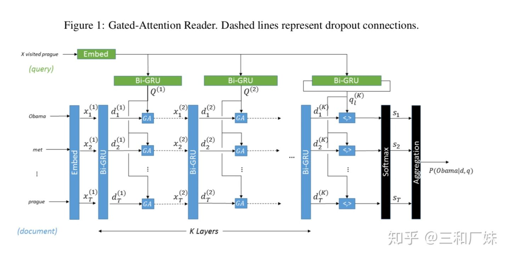
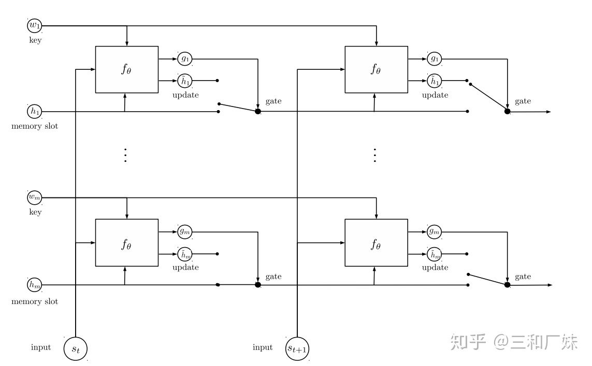
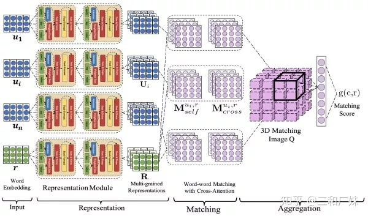
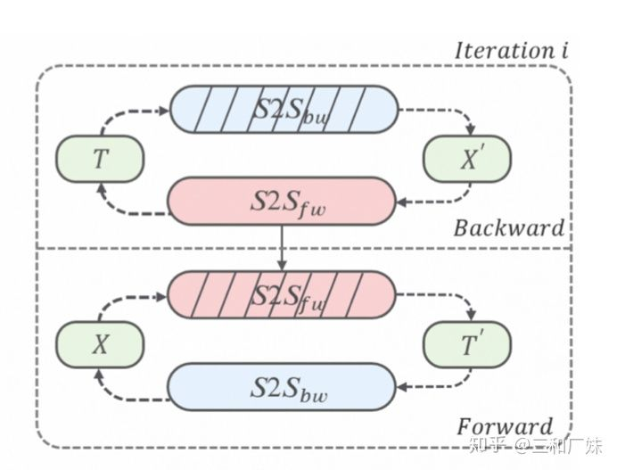
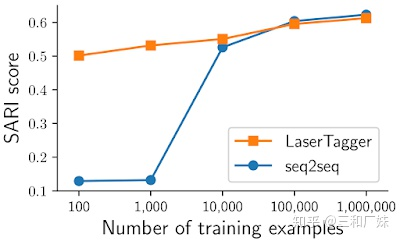

# QA对话系统技术简单概述

做QA好像很久了，还是觉得各种难，难理解，难应用，难落地。数据难，业务难，规则也难。难归难，本文从大的方向简单整理一下对话系统涉及的技术栈，可能错漏，可以评论或私信相互学习。

**QA有哪些类型？**

本质上除了**闲聊（非任务导向型）**就是做**任务（任务导向型）**，只不过完成任务的后面是不同的逻辑。

**应用常哪些场景？涉及哪些技术？**

1. **语音助手：**”帮我订9点去深圳的机票“：多轮对话 | 对话状态跟踪 | 上下文理解| 槽位管理
2. **FAQ客服之类**：”深圳基本退休工资多少钱，60岁可以领取么“：检索匹配召回 | 多轮对话
3. **闲聊|调戏**： ”你叫什么名字？“： 文本生成|检索式闲聊| 对话状态跟踪| 上下文理解
4. **查询问答：**”广东省有多少个博物馆，哪一个最近？“：KBQA | 信息检索抽取 or 基于阅读理解| 多轮对话
5. **推荐问答**：”附近有什么好吃的日本菜推荐“：用户画像，推荐 |多轮对话

## 常用方法总结：

【**句法式规则**】

规则是在现实简单业务场景中最常用的方式，意图+槽位的方法通用于**确定了意图即确定了答案**场景，适用于很多无数据冷启动的场景。

1. **意图+槽位**：抽象出**概念**并**组合**，针对FAQ库中的标问和相似问进行分词、提炼出大量的概念（没有数据是自己总结概念），并将概念组合，构成大量的句式，句式再进行组合形成标问。

- “AirPods现在的价格是多少？“AirPods”是earphone概念，“价格是多少”是askMoney概念，“现在”是time概念， 句式规则earphone+askMoney+time . 当用户输入"AirPods现在卖多少钱？" 进行分词，可以得到相同的句式和概念组合，就能够命中该意图。

\2. **意图+槽位**： 概念用**实体**提取，组合用分类**模型**

- Pipline: 在有标注数据的情况下，askMoney 意图识别简化为分类问题，主流分类模型可以达到很高的精度。而”AirPods“，“现在” 则对应了耳机实体和时间实体，在数据量足够的情况下，主流的序列标注模型也可以达到不错精度。
- Joint training: 很多情况下，意图和槽位高度相关， Joint training 模型同时做两个任务同步解决问题。

\3. **关键词**

- 当对话系统cover的领域很多时，可能意图会多达成百上千，这时候意图识别模型的决策空间变得过大，相近意图很难辨认，且各个意图共享同一个模型，每增加一个新意图就要重训模型，因此一般会做一个**分层**结构先来区分领域，这个上层的意图识别模块很难抽象出跨度过大的实体和概念，因此规则中最简单的方法就是使用关键词。
- 一般会涉及关键词做一些拓展，同义词，反义词，近义词等，之前看过一篇结合词向量，词林，hownet, 知识图谱同义项，上位词等等方法来做同义词扩展的文章[[1\]](https://zhuanlan.zhihu.com/p/150119544#ref_1)，也可以做到非常精致。

【**基于检索的问答**】

在很多场景下（如人工客服），已经累积了大量的问答对，基于检索的问答省略了意图识别过程，**假定了你现在问的问题之前有人也问过**，模型只用找到之前这个问题回答的答案就行。过程如下：

- **问题解析**：

- - 处理问题：对问题进行分类，确定问题类型；
  - 生成搜索关键词：对于用户的问题进行分析，来获得不同关键词的权重。

- **q-q 检索召回**：计算数据库中的文档与关键词的计算匹配程度，获取可能包含答案的候选文章，并且根据它们的相似度进行排序；

- - 一般不可能每次寻找回复时遍历整个语料库，将用户当前轮的query与语料库里query进行快速粗糙匹配，该模块重召回可以相对粗糙（如BM25, Bow），减少q-r匹配的工作量。

- **q-r matching && ranking** ：在粗召回来的文档中精确抽取答案（q-r匹配）并对抽取的答案进行排序，很多问题中matching 和ranking 是一起做的，根据matching的score直接排序

- - 段落提取：问答系统与搜索引擎的区别在于用户期望其返回精确的答案，而不是一个文章或段落，可以首先要从文章中提取出可能包含答案的段落；
  - 答案提取：在答案可能出现的段落被提取到以后，问答系统需要精确抽取段落中所包含的答案。这一步会用到问题分类。同时根据问题的关键词，对于段落中的词进行语义分析，最终找到最有可能是答案的字段。
  - 候选答案排序：ranking 部分对抽取的答案进行重排，其输入是候选回复对应的特征向量，根据实际需求构造不同类型（如：pointwise, pairwise, listwise）的损失函数，各种 Pointwise、Pairwise、Listwise 的L2R 模型通常就是在 ranking 阶段起作用。关于 how to ranking有很多文章[[2\]](https://zhuanlan.zhihu.com/p/150119544#ref_2)。

【**基于知识图谱问答**】

基于知识图谱的问答系统，需要解决两个核心问题：

1. 如何理解问题语义，并用计算机可以接受的形式进行表示(问题的理解和表示)；
2. 以及如何将该问题表示关联到知识图谱的结构化查询中(语义关联)。

**语义解析**：传统做法将自然语言转化为一系列形式化的逻辑形式（logic form），通过相应的查询语句在知识库中进行查询，从而得出答案。语义解析的传统做法是：问题->短语检测（词性标注、实体识别）->资源映射（ 实体链接、实体消岐、关系抽取）->语义组合（将映射得到的资源进行组合，得到逻辑形式）->逻辑表达式->分类。

- 传统做法涉及标注，链接消岐等方法，与 意图+槽位 不同的是 最后是对组合成的逻辑形式分类，这种做法的问题的难点是，逻辑形式可能非常多，准确的分类需要大量的数据才能如此精细的区分。
- 在数据量不够的情况下需要将逻辑形式抽象在一个合适粒度，那这就跟意图+槽位方法没区别了，甚至可以简化或者灵活处理训练语义组合分类器的方法。

**图语义解析**：将语言中的逻辑推导转化为图的形式，通过图的复杂推理得到答案，包括**建图**（包含知识库实体，聚合函数，中间变量 y和答案变量等）->**信息抽取**(提取问题特征如问题词，问题焦点，问题主题词和问题中心动词，识别实体，进行词性标注来删除限定词和介词）->**确定核心推导链（**将自然语言问题，映射为一个谓语序列）-> **增加约束和聚合**：增加约束和聚合函数相当于扩展查询图，缩小答案范围->**构建查询图特征**(主题词链接特征，核心推导链特征，约束聚合特征，总体特征等)->**分类**：对查询图做二分类.

- 复杂推断是KBQA的核心所在，图数据库相对普通数据库的优势也是对于这种多跳数据的查询速度非常快。但建图涉及到的语义逻辑形式和推导公理非常复杂，早期设计了很多语义体系，如OWL 本体语言看着都有点头大...

**一些常用简化做法**

1. 提取问题中的实体，通过在知识库中查询该实体可以得到以该实体节点为中心的知识库子图，**子图**中的每一个节点或边都可以作为候选答案
2. 通过观察问题依据某些规则或模板进行信息抽取，得到问题特征向量，建立分类器通过输入问题特征向量对候选答案进行筛选，从而得出最终答案。或直接简化为**子图中的节点或边和原始问题有语义交集**。
3. 这种做法常常和其意图方法结合起来，因为一个query中的实体可能有多个，需要确定问的是哪个主题实体，限定条件又是哪个实体。

**更进一步的**

**实体-向量建模**：提取问题特征（问题词，问题焦点，问题主题词和问题中心动词），识别命名实体，进行词性标注来删除限定词和介词。根据子图得到候选答案，把问题和候选答案都映射为分布式表达（Distributed Embedding），通过训练数据对该分布式表达进行训练，使得问题和正确答案的向量表达的得分（通常以点乘为形式）尽量高。基于向量表示的KB-QA主要是对问题和答案学习到一个向量表示，然后进行向量匹配，归根到底就是个匹配问题。

**如何学习问题向量：**把问题用LSTM之类的模型进行建模（因为问题本来就是自然语言）

**如何学习答案向量**：答案不能简单映射成词向量，一般是利用到答案实体，答案类型，答案路径（从问题主题词到答案的知识库路径），答案关系（从主题词到答案之间的知识库关系），答案上下文信息（与答案在一定范围内有连接的知识库实体），然后把这些特征分别映射成不同的向量，作为答案的其中一个向量（而不是直接拼接起来），最后用这些特征向量依次和问题做匹配，把score加起来作为总的score。

**问题和答案进行向量匹配：**计算问题-答案score，常见的有最简单的方法：直接进行向量点乘，可以用CNN对这种方式做改进，Attention匹配法：计算答案对问题每一步的Attention等。

**推理 && 更新：**伴随推理，反义推理等都是知识图谱自动扩展时比较方便，不然就是真的跟数据库没区别， KBQA中的推理并不是 从Q中对应推理（因为应用上慢），而是构建知识图谱的会后推理自动去构建扩展，真正在query是只是查询。 更新的时候，图节点很多整个更新非常庞大，更新又是一个庞大的话题了，总的来说一般只更新易于变化的实体和关系，或者添加新的实体，对之前的实体进行补充等。

【**基于阅读理解问答**】

基于阅读理解的问答，问题可以抽象成 f(Q,D) = A，Q是问题，D是文档，A是根据问题在文档中找到的答案。

一般来说阅读理解QA概括为同一种框架：**Embed 层，Encode 层，Interaction 层， Answer 层**。Embed 层负责将原文和问题中的 tokens 映射为向量表示；Encode 层主要对原文和问题进行编码，来表达蕴含了上下文的语义信息；Interaction 层是大多数研究工作聚焦的重点，该层主要负责捕捉问题和原文之间的交互关系，并输出编码了问题语义信息的原文表示，即 query-aware 的原文表示；最后 Answer 层则基于 query-aware 的原文表示来预测答案范围，一般匹配式QA和抽取式QA差异在于answer层。

**匹配式QA:** 给定文章，问题，和一个候选答案集（一般是实体或者单词），从候选答案中选一个score最高的作为答案。

**抽取式QA:** 给定一篇文章，围绕这个文章提出一些问题，直接从文章中扣答案出来。其实这个场景在如法律，政策政规解读时挺常见。

介绍几种方案如下：

- **Gate Attention-Reader**[[3\]](https://zhuanlan.zhihu.com/p/150119544#ref_3)(Gated-Attention Readers for Text Comprehension)模拟人在「带着问题做阅读理解时候的状态」会不断的去反复阅读文本的思路，采用了Multi-Hop（多跳阅读）的结构，不停在query和document之间利用gate attention 进行交互（如下图交互了K次），Gate Attention 则是在普通soft attention的基础上多了一个乘性交互(下式3)， 即用 Q 的 encoding 给 ![[公式]](https://www.zhihu.com/equation?tex=D) 里每个词 ![[公式]](imgs/equation-20201121205123789) 的 encoding 加一个 gate ，再传入下一层。

![[公式]](imgs/equation-20201121205108828) (1)

![[公式]](imgs/equation-20201121205124954) (2)

![[公式]](https://www.zhihu.com/equation?tex=x_i%3Dd_i%5Codot%5Ctilde%7Bq_i%7D) (3)

- **BiDAF**[[4\]](https://zhuanlan.zhihu.com/p/150119544#ref_4)(Bidirectional Attention Flow for Machine Comprehension )采用了双向attention流来做query 和context 之间的交互，用query2context(下图中橙色部分)求max来选出**文本中问题最关注的**点，context2query则是contenxt中那些词与query相关的权重，作者认为这两种attention可以相互补充。与上面的多跳阅读不同，这里是memory less，即attention之间是没有交互的。

- Match-LSTM[[5\]](https://zhuanlan.zhihu.com/p/150119544#ref_5) 先将document用lstm编码， 然后用lstm将query编码并用attention与document编码后的向量交互，最后将编码向量拼接起来后用lstm提取特征后，使用Pointer Net 中的Sequence 或Boundary 做answer层。

【**多轮对话|上下文理解跟踪**】

多轮对话要求QA有记忆功能，此时的决策是考虑了记忆信息决策得到的答案；因此时刻需要维护此时的对话状态, 维护对话状态的过程就是对话状态追踪（DST）

- DST的数据非常难找，规则维护不失为一个方法。
- 深度学习的常见方法是把前面所有轮次的对话都拼起来，有一些记忆模型DMN[[6\]](https://zhuanlan.zhihu.com/p/150119544#ref_6)（动态记忆网络），REN[[7\]](https://zhuanlan.zhihu.com/p/150119544#ref_7)（循环实体网络），Multi-view model[[8\]](https://zhuanlan.zhihu.com/p/150119544#ref_8)，DAM[[9\]](https://zhuanlan.zhihu.com/p/150119544#ref_9)等，或者当成序列问题的DQN（深度Q-learning网络）等。

简单做法每次获取到槽位和意图后直接更新 ,但这依赖NLU的准确性，直接更新可能会造成槽位的冲突，忽略了已经积累的对话状态，法建模复杂的状态转移关系， 但实际上还是这种方法用的最多（因为没有数据集）。理想情况下，次用NLU+DST =**DPL**(Dialogue policy learning)方式，DST可以使用传统的贝叶斯或者等预测真实slot，但是如果前序NLU做了更新，DST必须重新更新，DPL则根据状态跟踪器的状态表示，策略学习是生成下一个动作。

- **把对话过程当时一个序列模型**

- - RL模型是建立在马尔科夫决策过程（MDP）之上的，MDP可以表示成一个五元组（S，A，P，γ，R），分别是状态(S)，动作(A)，转移概率(P)，忽略因子(γ), 奖励(R), 强化学习的目标就是让策略模型找到最优的跟踪策略，使得累积的奖励最大化。
  - 涉及强化学习的一些模型，Q-learning, DQN ,魔改的DRQN等，DMN等在DL的基础上加了RL

- **记忆网络跟踪上下文**

- - DMN（Dynamic Memory Networks）包括输入模块、语义记忆模块、问题模块、片段记忆模块、回答模块。对于之前的对话中之前的状态，情景记忆模块会结合相关的输入和问题进行迭代生成记忆更新。

1. 模型首先会计算输入和问题的向量表示，然后根据问题触发Attention机制，使用门控的方法选择出跟问题相关的输入
2. 然后情景记忆模块会结合相关的输入和问题进行迭代生成记忆，并且生成一个答案的向量表示。
3. 最只答案模块结合该向量以及问题向量，生成最终的答案

- REN(Recurrent Entity Network) 中借鉴lstm思路，slot用memory cell 来记录和更新每个实体的状态。如Mary picked up the ball，Mary went to the garden， Where is the ball？

1. 当 ![[公式]](imgs/equation-20201121205110043) 被读取， ![[公式]](imgs/equation-20201121205116131) 记录实体Mary， ![[公式]](imgs/equation-20201121205112613) 记录实体状态Mary拿了一个ball；
2. ![[公式]](imgs/equation-20201121205118289) 记录实体ball， ![[公式]](imgs/equation-20201121205116188) 记录实体状态ball被Mary拿着；
3. 然后 ![[公式]](imgs/equation-20201121205123341) 被读取，读取到Mary，因为 ![[公式]](imgs/equation-20201121205116131) 是记录Mary的key，位置寻址项 ![[公式]](imgs/equation-20201121205114535) 变化，门函数被激活，更新 ![[公式]](imgs/equation-20201121205112613) 实体状态Mary去了garden;
4. 因为 ![[公式]](imgs/equation-20201121205116188) 记录ball被mary拿着，因此内容寻址项 ![[公式]](imgs/equation-20201121205124403) 变化，门函数被激活，更新 ![[公式]](https://www.zhihu.com/equation?tex=h_2) 的实体状态球被mary拿着，球在garden。

- **多轮对话的深度文本匹配**

放弃那种维护对话状态的思路，直接将多轮次的对话拼接起来看与下一句匹配程度， ![[公式]](imgs/equation-20201121205123801) ，M 是参数矩阵， ![[公式]](imgs/equation-20201121205122123) 但这就是普通的匹配模型了, 最开始Multi-view model的做法，后来基于这个思路上很多人做了交互表示的一些改进让模型来适应多轮这个问题，不仅基于word level匹配，基于uttrance level 匹配，建模各个粒度之间的表示关系等，参考，，，

DAM用transformer对utterance和response的多个粒度进行编码，然后分别计算utterance-response pair的每个粒度下的表示分别计算两个对齐矩阵，叠在一起后从中间抽取特征来匹配。

【**文本生成NLG**】

文本生成在QA中一般是将**问题信息**、**语义槽值**和**对话行为类型**结合起来去生成正确的答案。模板化的 NLG 使用模板驱动模式来显示输出，可以类似**句法式规则**在抽象的概念集合中去抽取句子的各部分进行组合，这实质是**选择-拼接，**拼接时根据**句法树**规则拼接排序等[[10\]](https://zhuanlan.zhihu.com/p/150119544#ref_10)。好的文本生成满足**适当性**、**流畅性**、**可读性**和**变化性**。

高级一点的NLG 比较复杂，它需要理解意图，考虑上下文，并且生成通顺的可理解的句子，在**任务场景**中还要将结果嵌入到合适的位置，根据学习到的策略来生成对话回复，涉及领域分类和意图识别、槽填充、DST、DPL等

闲聊中文本生成相对简单，目前深度学习比较常用的方法是基于各种抽取器（transformer, lstm 等）的seq2seq，求参数用对loss的极大似然估计，但极大似然容易导致偏置问题，因此有生成的文本非常固化，对于开放域的闲聊，本身由于平淡无奇的话语通常在我们日常聊天中占主导地位，如果想要模型生成出更多有趣多样的内容，就需要复杂的数据过滤，采样等技术，因此有很多研究对生成文本多样性的方法，如

- - 采用了最大互信息（Maximum Mutual Information，MMI）等[[11\]](https://zhuanlan.zhihu.com/p/150119544#ref_11)作为目标损失函数，MMI损失函数可以看成是在极大似然估计的基础上，添加了一项对输出句子概率的惩罚项， 把输出句子的频率考虑进loss中，[参考](https://link.zhihu.com/?target=https%3A//blog.csdn.net/linchuhai/article/details/89643785)；
  - Seq2BF： 采用一种类似回译的方法，将seq2seq分成seq2seq forward 和seq2seq backward, 先预测回答的关键词，让后将关键词拼接上进行生成，这样生成的字句跟关键词更贴合，2020 ACL有一篇类似的论文[[12\]](https://zhuanlan.zhihu.com/p/150119544#ref_12)，为了扩充对话生成时的语料设计了数据增强方法，将**非对话**文本通过这种类似回译的方式生成为对话文本，再用与普通的文本生成模型；

- - 直接修改Beam Search算法，对每个时间步的条件概率施加多样性惩罚，比如MMI-antiLM、diverseRL、DBS等。或者调大B的值；
  - 直接修改训练时的损失函数，比如ITF-loss等；

同时seq2seq这种存在推断速度慢的问题，谷歌开源的LaserTagger[[13\]](https://zhuanlan.zhihu.com/p/150119544#ref_13)就并不生成文本，而是采用生成各种编辑操作的方式，编辑操作相互之间独立，效果与基于bert的seq2seq差不多的情况想性能大幅提升。

总之，QA中涉及了NLP的90%的技术栈，有很多点值得深挖，立个flag 希望能补上【抽取QA】，【文本生成】的详细笔记。

## 参考

1. [^](https://zhuanlan.zhihu.com/p/150119544#ref_1_0)https://zhuanlan.zhihu.com/p/94726282
2. [^](https://zhuanlan.zhihu.com/p/150119544#ref_2_0)https://zhuanlan.zhihu.com/p/134672431
3. [^](https://zhuanlan.zhihu.com/p/150119544#ref_3_0)Gated-Attention Readers for Text Comprehension
4. [^](https://zhuanlan.zhihu.com/p/150119544#ref_4_0)Bidirectional Attention Flow for Machine Comprehension
5. [^](https://zhuanlan.zhihu.com/p/150119544#ref_5_0)machine comprehension using match-lstm and answer pointer
6. [^](https://zhuanlan.zhihu.com/p/150119544#ref_6_0)Dynamic Memory Networks for Natural Language Processing
7. [^](https://zhuanlan.zhihu.com/p/150119544#ref_7_0)Tracking the World State with Recurrent Entity Networks
8. [^](https://zhuanlan.zhihu.com/p/150119544#ref_8_0)Multi-view Response Selection for Human-Computer Conversation
9. [^](https://zhuanlan.zhihu.com/p/150119544#ref_9_0)Multi-Turn Response Selection for Chatbots with Deep Attention Matching Network
10. [^](https://zhuanlan.zhihu.com/p/150119544#ref_10_0)https://zhuanlan.zhihu.com/p/49197552
11. [^](https://zhuanlan.zhihu.com/p/150119544#ref_11_0)A Diversity-Promoting Objective Function for Neural Conversation Models
12. [^](https://zhuanlan.zhihu.com/p/150119544#ref_12_0)Diversifying Dialogue Generation with Non-Conversational Text
13. [^](https://zhuanlan.zhihu.com/p/150119544#ref_13_0) https://github.com/google-research/lasertagger