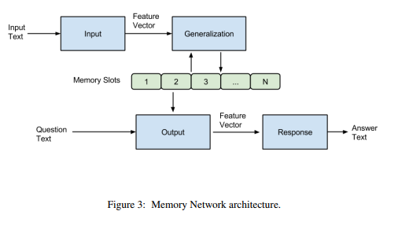
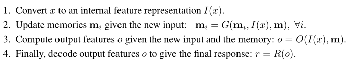
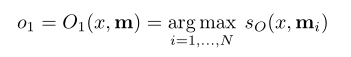
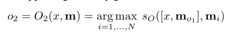

# 记忆网络之Memory Networks

Memory Network是深度学习的一个小分支，从2014年被提出到现在也逐渐发展出了几个成熟的模型，我比较关注的是其在QA领域的应用和发展。本专栏会选择几篇论文比较系统的介绍Memory Network相关的模型和应用。对一些论文也会结合TensorFlow的实现进行介绍。

第一篇要介绍的论文是FaceBook在2014年发表的论文“Memory Networks”，与其同期提出的“Neural Turing Machine ”也是采用相似的方法（外部记忆）。传统的深度学习模型（RNN、LSTM、GRU等）使用hidden states或者Attention机制作为他们的记忆功能，但是这种方法产生的记忆太小了，无法精确记录一段话中所表达的全部内容，也就是在将输入编码成dense vectors的时候丢失了很多信息。所以本文就提出了一种可读写的外部记忆模块，并将其和inference组件联合训练，最终得到一个可以被灵活操作的记忆模块。接下来我们看一下其框架：

首先来说，模型主要包含一系列的记忆单元（可以看成是一个数组，每个元素保存一句话的记忆）和I，G，O，R四个模块。结构图如下所示：

简单来说，就是输入的文本经过Input模块编码成向量，然后将其作为Generalization模块的输入，该模块根据输入的向量对memory进行读写操作，即对记忆进行更新。然后Output模块会根据Question（也会进过Input模块进行编码）对memory的内容进行权重处理，将记忆按照与Question的相关程度进行组合得到输出向量，最终Response模块根据输出向量编码生成一个自然语言的答案出来。各模块作用如下：

接下来我们看一下basic model的实现细节：

根据论文描述，basic model的I就是一个简单的embedding lookup操作，也就是将原始文本转化为词向量的形式，而G模块则是直接将输入的向量存储在memory数组的下一个位置，不做其他操作，也就是直接写入新的记忆，对老的记忆不做修改。主要的工作在O和R两个模块进行。 O模块根据输入的问题向量在所有的记忆中选择出topk相关的记忆，具体选择方式为，先选记忆中最相关的memory：

接下来根据选择出的o1和输入x一起选择与他们两个最相关的记忆o2：

对于上面这个等式，如果x和o1采用的都是线性的向量表示（BOW等），则可以拆分成下面加和的方式，否则不可以。

就这样选择出于Question最相关的topk个memory slot即可。将其作为R模块的输入，用于生成最终的答案。其实这里也很简单就是使用与上面相同的评分函数计算所有候选词与R输入的相关性，得分最高的词语就作为正确答案输出即可：

而上面多次用到的评分函数满足下面的形式即可：

最终模型选择margin ranking loss作为损失函数，即要求正确答案的得分比错误答案的得分高至少一个margin r。公式如下：

这里的错误答案都是随机从样本中采样而来，而不是计算所有错误样本。下面我们举一个简单的例子来说明上述过程：

对于第一个问题：where is the milk now？输出模块会对所有的memory（其实就是输入的句子）进行评分，得到“Joe left the milk。”得分最高，也就是与问题最相关，然后再对剩下的记忆进行评分，找出与where is the milk now？和Joe left the milk最相关的memory。我们发现是“Joe travelled to the office”。这样我们就找到了最相关的记忆，接下来使用R模块对所有的单词进行评分找到得分最高的单词作为答案即可。

这篇论文的重点在于他提出了一种普适性的模型架构（Memory Network），但是很多部分并没有做得很完善，论文后面也对输入是词、memory比较大、新词等问题进行了专门的阐述，不过我觉得看后面别人在此基础上发的论文更有借鉴意义。所以这里不再进行详细的介绍。

编辑于 2017-09-25