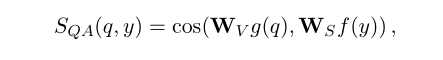
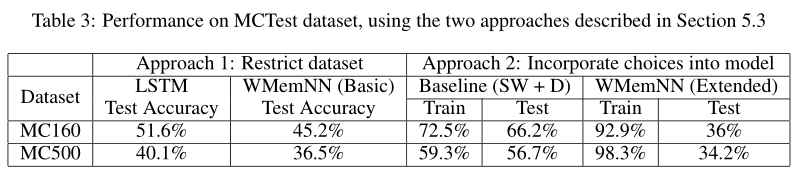

# 记忆网络之open-domain QA 应用

## **记忆网络之open-domain QA 应用**

前面两篇文章分别介绍了Memory Networks和End-To-End MemNN两种模型，但是都是基于bAbI数据集进行的介绍，更像是一种阅读理解式的任务，也就是给定一段文字和一个问题，从中找出答案。然而平时遇到的QA任务，往往并不会给定一段材料和问题，而是直接给一个问题需要给出答案，那么这种情况下应该如何使用记忆网络的模型来解决呢？我们这次结合两篇论文来介绍一下MemNN如何迁移到开放域的QA问题上。

首先说一下上面所提出的问题，如何在只有Question的时候直接回答呢？这里需要引入知识库（Knowledge Bases， KBS）的概念，其实在Memory Networks兴起之前，传统的QA都是通过知识库进行检索或者信息抽取等方式进行建模的（这个有时间应该也会专门研究一下，这里先不进行引申）。所谓知识库，其实就是将互联网上的信息经过专家人工提取和构造，以三元组的形式存储下来（subject， relationship， object），是一种非常结构化的信息，比较知名的有FreeBase。有了知识库，那么给定一个问题我们自然可以进行检索记忆并作出回答。那么Memory Network的优点是什么呢相比传统方法，因为问题往往是以自然语言的方式提出，而知识库是高度结构化的组织，所以如何进行检索或者信息抽取其实是一个很困难的工作，所以就引入了深度学习==另外还有一个问题就是，前面所提到的Memory Network记忆的都是一个相对较小的文档存储起来，那么面对KB这么庞大的知识库应该如何解决内存容量问题呢？下面我们进行探索。

## **Large-scale Simple Question Answering with Memory Networks**

第一篇要介绍的是Facebook在15年6月份发表的论文“Large-scale Simple Question Answering with Memory Networks”，作者是Bordes（之前他还发过一篇Question Answering with Subgraph Embedding，是将知识库子图进行Embedding，本文中也会用到相似的概念）和Weston（Memory Networks就是他的大作）还有Chopra（恩，他们几个经常一块发文章就对了==），说这个是因为最近看这方面文章发现这几位大牛出现频率过高，所以关注了一下。下面介绍一下本文的主要工作。

本文首先提出了一个数据集：Simple Question Answering（关于QA领域常用的数据集总结可以看文末）。由于以前的QA数据集都比较小（几千个问题），而且问题的类型比较局限，问题的语法也比较单一（自动生成的问题）。通过这些数据集学习出来的模型扩展型如何是一个很大的问题。所以本文作者构造了一个新的数据集，有以下几个特点：

1. 所有的QA对问题的逻辑都比较简单，所以命名为Simple QA。仅仅依赖于KB里面的一个facts，这样做的好处是可以简化模型的推理过程。
2. 数据量大，包含十万多个QA对，而且都是人工生成，语法相对而言更贴近自然语言，而且问题覆盖面广，类型较全。
3. 所有QA对都依赖于KB中的实体和facts。保证了KB的覆盖性。

接下来我们介绍一下论文使用的模型，仍然沿用Memory Networks提出的I、G、O、R四组件的架构，其工作流程如下

1. 存储KB，第一步是使用Input组件解析知识库并将其存入Memory之中。
2. 训练，第二步是使用Simple QA数据集的所有QA对作为输入，经过Input、Output、Response三个组件进行预测并使用反向传播训练网络中的参数
3. 泛化，最后使用Reverb数据集直接接入模型（不在进行重新训练），使用Generalization模块将其与Memory中已经存在的facts关联，看最终效果如何

这里专门加入了Reverb数据集是因为作者认为传统的数据集很小不具有扩展性，而且在单一数据集上训练出的模型在别的数据集上的泛化能力可能会很差，为了证明本论文训练出来的模型具有这种泛化能力加入了这一项。Reverb数据集跟FreeBase有一定差距，主要体现在他的非结构化，直接从文本中直接提取出来，有较少的人工干预。所以在实体数目相同的情况下，有更多的relationship。见下图：

熟悉了工作流程之后，接下来我们看一下I、G、O、R四个模块的设计细节：

- **Input Module**：输入模块主要负责对FreeBase、Question、Reverb这三个输入数据进行Embedding操作，将其转化为向量表示。

- - 对于FreeBase知识库而言，首先对所有三元组进行下面两个预处理操作：第一将所有主语和关系都相同的三元组进行合并，<Subject, Relationship, ?>，也就是满足上面这种关系的三元组将其宾语合并成一个数组变成<Subject, Relationship, [Object1, Object2,...,Objectn]>。这样可以减少知识库中facts的数量。第二步是将所有包含中间连接的两个facts合并成一个，即将<Subject, Relationship1, Object1>和<Object1, Relationship2, Object2]>合并为<Subject, Relationship2, Object2>。这样做的好处在于可以减少问题的推理过程。对FreeBase执行完上面两个操作之后，使用Bag-of-symbol的方法进行编码成一个Ns（知识库中实体+关系的数量）维的向量，类似于one-hot编码，出现的位置置为1，否则值为0。不过对于Object而言，使用1/k来取代1即可。
  - 对于Question而言就比较简单，同样使用bag-of-ngrams的方法将其编码成一个Nv（所有问题包含的单词数）维的向量。
  - 对于Reverb而言，将其中每个fact三元组都编码成一个Ns+Nv维的向量。

- **Generalization Module**：从Memory Networks那篇论文我们知道，G模块主要负责对记忆进行更新。这里是将FreeBase知识库的所有facts以Multigraph结构存储在记忆中。其中Entity作为结点，Relationship作为边。其实这里我并不太明白最终应该如何仿真实现，因为我们知道Memory是以数组的形式进行存储的，那么如何保存图结构呢？还是说论文本身就是用图结构来代替数组来存储Memory，如果是这样的话，最后如何选择与Question相关的Memory呢？这里的细节部分论文中都没有涉及，所以我也有点困惑，希望有大神可以指点一二。

- **Output Module**：这部分是根据问题找到相关Memory，并对其进行加权求和得到输出。但是现在问题在于Memory Size非常大，如果对每个Memory都进行计算相似性得分的话，必然会导致计算耗时很大，而且考虑到记忆对Question的稀疏性，这些记忆中会有很多都不相关。所以需要做一个预处理来选出候选的记忆再进行计算相关性得分。为了得到候选集，先生成与问题相关的所有n-grams，然后去除其中的包含疑问代词、停用词的，再将属于另一个n-grams的子集的删除等操作。接下来使用Embedding模型对候选记忆进行相关性评分计算（使用余弦相似度表示相关性），下图分别是对Question和Reverb进行计算的公式：

至此我们就介绍完了本文所使用的模型和解决问题的思路。主要还是使用Memory Network结合FreeBase等知识库来进行QA任务的建模。

## **Answering Reading Comprehension Using Memory Networks**

这篇文章相对来说没有什么创新，只不过是将Memory Networks和End-To-End MemNN模型运用到不同的数据集上面进行测试，并且针对不同的数据特点做出了一定的调整和修改，我们主要学习其针对不同任务是如何微调模型以解决问题的方法。

首先作者将QA任务分为检索和推理两部分（retrieval and inference）。其实就是将知识库保存在Memory中以供检索，然后结合问题推理其意图并作出回答这么一个模式。而且QA作为研究对话系统的一个“入门”任务，解决好这个对一个好的对话系统很有帮助。这里不再对模型进行介绍，因为前面两篇文章都已经介绍过了，主要来说一下文中使用到的三个数据集和做出的一些改进。

1. bAbI数据集，这个之前介绍过，包含20个小任务，有些只需要简单推理，有些比较复杂，可能会涉及时序等多轮推理
2. MCTest，这是微软推出的阅读理解数据集，比较像我们高中的时候做的阅读理解，一段材料一个问题，四个选项。相比bAbI而言，是一种开放域数据集，涉及面比较广，自然语言表示，而且数据量更大（从文章长度、包含词数目等方面），而且是有选项的，这点需要注意。
3. WiKi QA，相比前面两个阅读理解型的数据而言，这个更倾向于QA。它是由很多Wikipedia文章组成的背景知识（40000+的vocab），而且每篇文章都比较长。在此之上提出了很多QA对。跟上面那篇论文所提出的Simple QA不一样的地方在于，这里的QA对不是基于知识库，而是基于Wikipedia 文章，相比结构化的知识库而言，显然直接从文章之中发掘答案更加困难。跟上面两个数据集的难度更不在一个数量级上面。

了解了数据集之后我们接下来看看针对每个数据集应该怎么修改模型的结构以适应。bAbI数据集就不用说了，因为End-to-end MemNN本身就可以直接对该数据集进行训练。

## MCTest数据集

因为原始的模型输出是针对整个Vocabulary的，也就是从整个单词表中选出一个单词作为答案。但是MCTest是从4个候选答案中选择一个正确答案即可，这很显示一个很重要的信息，我们应该利用起来。此外，答案还可能是多个词，应该如何处理也是一个问题。

首先，如歌一个选项包含多个单词的话，就用下面BOW的方式进行压缩表示成一个向量。

然后对于四个选项而言，很明显正确答案就在其中，那么我们在这里就不需要在选择相关的记忆而直接对这四个答案进行相关性评分就可以了。并且直接把得分最高的当做是预测结果。这样做既利用了选项提供的信息，也简化了模型的复杂度。感觉看完这个方法效果应该是不错的，但是呢，看作者最后做的实验准确度却不是很高，跟baseline比起来还是有一定的差距==

## Wiki QA

接下来我们看一下针对Wiki QA应该如何修改模型。该数据集的特点是需要一个更大的Memory Size来存储所有的Wikipedia文章信息，此外，Vocabulary也更大，相对bAbI的40个单词中选择一个正确答案，这里需要从40000+个单词里面选择，难度太高。所以作者提出了两种基于剪枝的解决方法，思路就是根据Question对查找相关的memory，其实跟第一篇论文的思路是一样的。

1. **Word2vec Based**：根据预训练好的词向量，计算Question和每个memory之间的余弦相似度，然后设置一个阈值或者选取Top N进行选择即可
2. **POS based**：先对每个单词进行词性标注，然后将没有相同名词的memory去掉。

上面这两种方法的好处在于，一方面可以加速模型的训练速度，另外一方面通过剪枝，可以将大部分不相关的数据去掉，达到消除噪声的目的，让模型更快地找到相关的memory。最终的效果如下所示，从结果可以看出来，使用剪枝的方法会使训练准确度降低，但是测试的准确度却有所提升。

## **数据集**

最后我们总结一下QA领域常用的一些数据集及其特点和适应场景。

发布于 2017-09-28