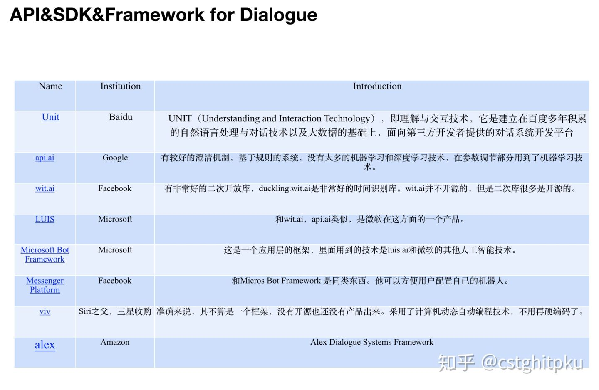

# 对话系统的开源系统&API&SDK&Framework汇总

随着AI越来越火爆，人工智能皇冠上的明珠--NLP也越来越火。NLP的发展一定是为了方便人类的生活，而很多场景下跟人交互最直接、有效的方式是对话/问答。所以，对闲聊型对话、任务型对话、推荐型对话、知识问答型、深度问答、视觉问答等的研究也是越来越火爆。

所以，今天，我把很久之前整理的对话系统的“开源系统&API&SDK&Framework”（主要是任务型的）汇总一下：如果大家发论文，直接在这些源代码上扩展、优化即可，可以快速上手；如果大家想个性化定制自己的聊天系统，那更方便，选择也更多（源码、API、SDK、Framawork几乎涵盖快速开发的所有形式了吧？），不用赘述。话不多说，直接上干货。

因为是之前在KeyNote做的表格（这里打个广告，我去年针对对话系统做了一百多页的汇总，基本上涵盖对话系统的方方面面，后面有时间会一点点放出来。这东西花费很多精力，大家也别张口给我要，我是不会一下放出整个的，免伤感情，希望理解，因为现在真正认真做事的很少，更显得珍贵。），复制过来就乱了，所以只放了截图。想要链接的，在公众号：**AI部落联盟**回复“dialog”即可。