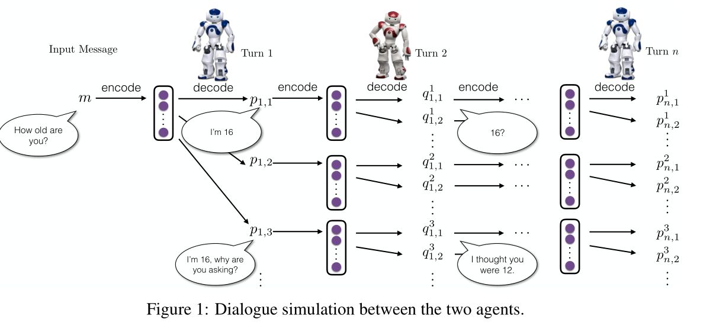
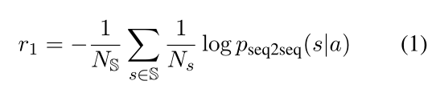
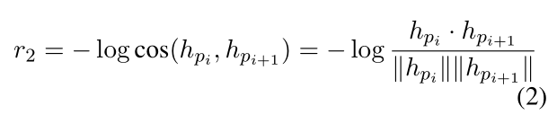
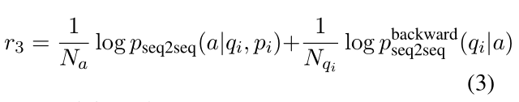
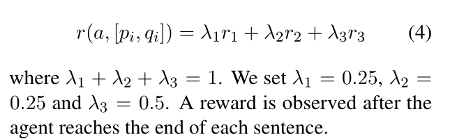
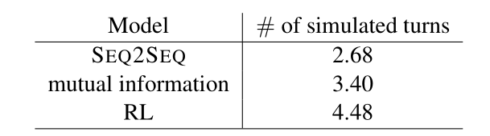
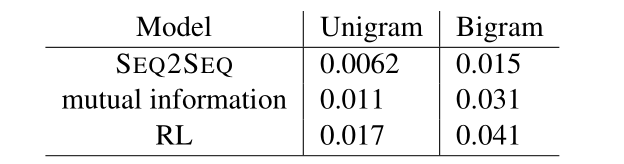
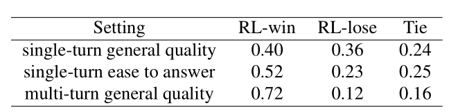
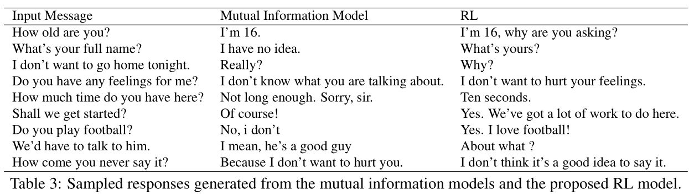

# 深度学习对话系统理论篇--Deep Reinforcement Learning for Dialogue Generation

## **Deep Reinforcement Learning for Dialogue Generation阅读笔记**

看了李纪为的博士论文之后，想必大家应该对对话领域有了一定的了解，其读博期间共发了7篇顶会论文，先是使用MMI解决对话丰富度、然后是给对话机器人赋予某种性格来解决前后一致性问题、接下来分别使用增强学习和对抗生成来解决多轮对话和对话的逼真程度，最后是在facebook跟着Jason Weston等人基于Memory Networks实现的在线反馈的人机对话系统。

## **1，文章亮点**

本文是使用深度增强学习DRL的方法来解决多轮对话问题。首先使用Seq-to-Seq模型预训练一个基础模型，然后根据作者提出的三种Reward来计算每次生成的对话的好坏，并使用policy network的方法提升对话响应的多样性、连贯性和对话轮次。文章最大的亮点就在于定义了三种reward（Ease of answering、Information Flow、Semantic Coherence），分别用于解决dull response、repetitive response、ungrammatical response。

首先，标准的Seq-to-Seq模型用于对话系统时常常使用MLE作为模型的评价标准，但这往往导致下面两个主要缺点：

- 系统倾向于产生一些普适性的回应，也就是dull response，这些响应可以回答很多问题但却并不是我们想要的，我们想要的是有趣、多样性、丰富的回应；
- 系统的回复不具有前瞻性，有时会导致陷入死循环，导致对话轮次较少。也就是产生的响应没有考虑对方是否容易回答的情况。

在这种情况下，作者引入深度强化学习的目的是通过开发者自定义的reward来取代MLE作为评价标准，可以使对话系统产生更好的response，已达到每个人不同的需求，但是reward的定义是一门艺术，对于模型效果有着至关重要的影响。而作者从response的丰富性、连贯性、对话轮次三个方面提出了三种reward定义方法来增强对话系统的响应能力，在一定程度上取得了比较好的效果。接下来我们来具体介绍一下模型细节

## **2，模型介绍**

模型采用两个agent之间相互对话的方法进行对话仿真。于是上下文可以看做是p1,q1,p2,q2...,pn,qn，模型需要根据上下文，通过Seq-to-Seq网络生成一个response，也就是强化学习中的action。由于对话生成，每次的答案都可能不一样，所以可以将action空间看作是无限的。而状态空间则是前一轮的对话的历史[pi, qi]。而策略policy就是Seq-to-Seq模型生成的相应的概率分布。我们可以把这个问题看成是上下文的对话历史输入到神经网络中，然后输出是一个response的概率分布：pRL(pi+1|pi,qi).所谓策略就是进行随机采样，选择要进行的回答。最后使用policy gradient进行网络参数的训练。

接下来我们介绍一下三种reward的定义方式以及它们的直观理解：

r1是为了提高模型的前瞻性，避免模型产生无聊的dull response而定义的。S是一个预先定义好的dull response的集合，比如“I don't know what you are talking about”等。然后计算当模型产生的响应a作为输入时模型输出s的概率，在对S集合中的每一句话进行求和。因为Pseq2seq肯定小于1，所以log项小于零，则r1大于零，而且a产生无聊响应s的概率越小，r1越大。通过r1的奖励机制，模型最终产生的action会慢慢的远离dull response，而且也会一定程度上估计到下一个人的回复，让对方可以更容易回复。

r2是为了增加信息流的丰富程度，避免两次回复之间相似程度很高的情况。所以r2使用余弦相似度来计算两个句子之间的相似程度，很容易发现r2也是一个大于零的数，用来惩罚相似的句子，两个句子越相似，余弦值越接近于1，r2越小，反之奖励越大。

r3是为了语义连贯性，避免模型只产生那些高reward的响应，而丧失回答的充分性和连贯性。为了解决这个问题模型采用互信息来实现，由两部分组成，分别是基于pi，qi上下文产生a的概率和基于a产生qi的概率。反向的seq2seq是使用source和target反过来训练的另外一个模型，这样做的目的是为了提高q和a之间的相互关系，让对话更具有可持续性。可以看出来，r3的两项都是负值。

对r1，r2，r3进行加权求和，权值也是很简单的直接分配，这样最终r应该会在0附近，时正时负的奖励值。最后总模型在训练的时候也是先使用Seq-to-Seq模型先预训练一个基础模型，然后在其基础上在使用reward进行policy gradient的训练来优化模型的效果。

## **3，实验结果**

为了评价模型的效果，作者使用下面几个指标来分别进行评测：

1，对话的长度，作者认为当对话出现dull response的时候就算做对话结束，所以使用对话的轮次来作为了评价指标：

2，不同unigrams、bigrams元组的数量和多样性，用于评测模型产生回答的丰富程度：

3，人类评分：

最终对话效果如下图所示：

## **4，评价**

作者使用深度强化学习的方法来改善多轮对话的效果，并提出了三种reward的定义方式，效果也不错。可以算是DRL与NLP结合的一个比较不错的例子。但是从最后的结果部分也可以看得出，作者无论是在reward的定义、还是最后的评价指标都没有采用使用比较广泛的BLUE指标。而是针对不同的reward改善的目的设计相应的评价，比如说对话轮次的长短、对话的多样性等，比较有针对性的进行评价。但也都是达到了作者最起初设计这些方法和模型的目的。其实对话系统究竟该如何准确的进行评价一直是一个问题，至今也没有什么好的评价系统出来，所以大家都在探索。