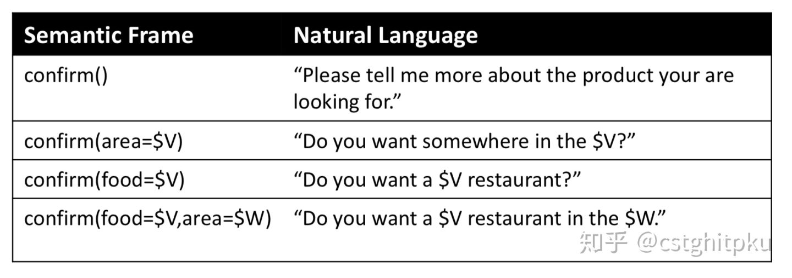
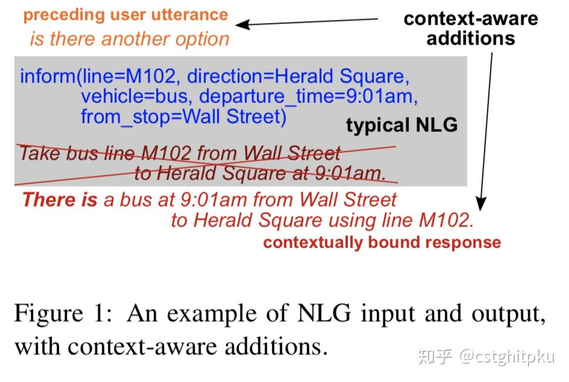
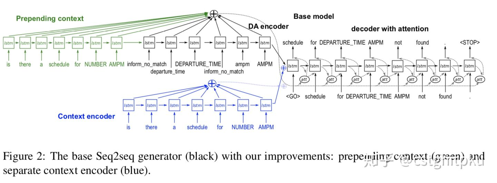
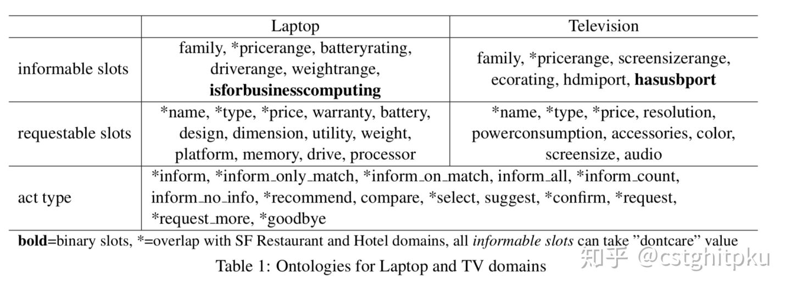

# 总结|对话系统中的自然语言生成技术（NLG）

自然语言生成(NLG)在很多NLP领域或任务都有涉及，比如摘要生成、VQA(视觉问答) 、翻译、写诗词、写作文、写新闻、NBA等赛事报道、对话系统等。不同任务下的NLG也不一样，今天我们简单来聊聊对话系统中的NLG。

\1. 简介

对话系统按功能来划分的话，分为闲聊型、任务型、知识问答型和推荐型。在不同类型的聊天系统中，NLG也不尽相同。

1.1. 闲聊型对话中的NLG就是根据上下文进行意图识别、情感分析等，然后生成开放性回复；

1.2.任务型对话中的NLG就是在NLU(领域分类和意图识别、槽填充)、DST、DPL的基础上，根据学习到的策略来生成对话回复，一般回复包括澄清需求、引导用户、询问、确认、对话结束语等。如果不太明白每个阶段的具体流程，可以看看我之前发的文章“任务型对话系统公式建模&&实例说明”。

1.3.知识问答型对话中的NLG就是根据问句类型识别与分类、信息检索或文本匹配而生成用户需要的知识（知识、实体、片段等），这类回复相比单纯的信息检索一般用户体验会更好，因为一般信息检索还需要用户根据搜索结果自己找所需信息。

1.4.推荐型对话系统中的NLG就是根据用户的爱好来进行兴趣匹配以及候选推荐内容排序，然后生成给用户推荐的内容。

\2. 先来看看我汇总的聊天系统中的NLG技术。

下面分别介绍一下对话系统中的不同NLG技术。

2.1. 传统方法：基于模版的NLG、基于树的NLG。

需要定义一堆模板和规则，然后映射到自然语言。

2.2. Plan-Based NLG**([Walker et al., 2002](https://link.zhihu.com/?target=http%3A//citeseerx.ist.psu.edu/viewdoc/download%3Fdoi%3D10.1.1.132.8130%26rep%3Drep1%26type%3Dpdf))**

把NLG拆分为三部分：Sentence Plan Generator（Stent et al., 2009）、Sentence Plan Reranker和Surface Realizer（[Cuayahuitl et al., 2014](https://zhuanlan.zhihu.com/p/49197552/https://ieeexplore.ieee.org/document/7078559/)），同时做NLG时应用了句法树。

Sentence Planning阶段生成Sentence Planning Tree (SPT) ，每个node是对话的act。

Surface realizer阶段把SPT转换成最终要生成的句子，转换过程是所有的子节点都安了句法树合并成父节点。

2.3. **Class-Based LM（**[Oh and Rudnicky, NAACL 2000](https://link.zhihu.com/?target=http%3A//www.speech.cs.cmu.edu/Communicator/papers/nlg-ANLP-NAACL2000.pdf)**）**

这是一种基于class的语言模型做NLG，需要确定一些class，然后分别算每个class的概率，最终取最大概率的class。

2.4. **Phrase-Based(**[Mairesse et al, 2010](https://link.zhihu.com/?target=https%3A//pdfs.semanticscholar.org/f9d3/754a2807dad4594b383104060fd1552350f7.pdf))

这种方法其实也使用了语言模型，优点算更高效、准确率也更高，缺点是需要很多semantic alignment和semantic stack。

2.5. **Corpus based（**[Mairesse and Young 2014](https://link.zhihu.com/?target=http%3A//www.aclweb.org/anthology/J14-4003)**）**

句子生成的过程为：unordered mandatory Stack set-> ordered mandatory Stack sets -> full stack sequence -> sentences。这种方法的优点是极大的减少了人的工作以及可能带来的错误，缺点是需要预先定义一些特征集合。

2.6. **RNN-Based LM（**[Wen et al., SIGDIAL 2015](https://link.zhihu.com/?target=https%3A//arxiv.org/abs/1508.01755)**）**

**首先说一句题外话，可能很多人不了解sigdial这个会议，其实这个会议在dialogue领域真的是很不错的一个会议，也有很多高质量paper。这种方法结合了神经网络和语言模型，减少了很多人工，也可以对任意长的句子句子建模。**

2.7. **Semantic Conditioned LSTM（**[Wen et al., EMNLP 2015](https://link.zhihu.com/?target=https%3A//arxiv.org/abs/1508.01745)**）**

这篇paper在使用lstm时加入了semantic，整个网络包括原始的标准lstm和dialogue act cell。

2.8. **Structural NLG（**[Dušek and Jurčíček, ACL 2016](https://link.zhihu.com/?target=https%3A//arxiv.org/abs/1606.05491)**）**

**这种方法也用了句法树+神经网络，e**ncode trees as sequences，然后用seq2seq来做句子生成。

2.9. **Contextual NLG（**[Dušek and Jurčíček, 2016](https://link.zhihu.com/?target=https%3A//arxiv.org/abs/1608.07076)**）**

**这也是一篇sigdial的paper。这个方法其实也是seq2seq模型，好处是生成的回复会考虑上下文，比较适合多轮对话。**

**2.10.** **Controlled Text Generation（**[Hu et al., 2017](https://link.zhihu.com/?target=https%3A//arxiv.org/abs/1703.00955)**）**

**这个方法是基于GAN的NLG。**

**2.11.Transfer learning for NLG（**[Wen et al., 2013](https://link.zhihu.com/?target=https%3A//pdfs.semanticscholar.org/8823/bb92dff07ad72e41db4ed9fe67709571de68.pdf).，[Shi et al., 2015](https://link.zhihu.com/?target=https%3A//www.sciencedirect.com/science/article/pii/S0885230814001211)，[ Wen et al., NAACL 2016](https://link.zhihu.com/?target=https%3A//arxiv.org/abs/1603.01232)**）**

**用迁移学习做NLG，可以解决目标领域数据不足的问题，也可以跨语言、个性化等。主要有三种打法：基于模型的迁移学习，底层网络在不同领域都一样，在上层根据不同领域做fine-tuning；基于参数的迁移学习，暂时这方面工作没发现太多，有知道的欢迎告知；基于**Instance的迁移学习，在源领域训练一个sc-lstm 模型，然后在目标领域做fine-tune，通过将源领域实例与仅出现在目标领域中的新slot-values相适应来构建合成数据。

**3.这几种NLG技术的对比**

**以上简单介绍了11种对话系统中的NLG技术，下面简单总结下它们的优势和劣势。**

**4.NLG技术的评估**

**任何一项技术想要取得进步，那么他的评测方法是至关重要的（就相当于目标函数之于机器学习算法），所以我列出一些关于NLG的评估。遗憾的是，目前NLG的评估我感觉并不成熟，这也是制约NLG发展的一个重要原因，如果谁能想出更好的评估方法或整理出一个业内公认的高质量数据集，那么一定会在NLG领域有一席之地，引用量也会蹭蹭的涨。**

**5.一些NLG的论文**

**以上是我关于对话中的NLG的一些总结，因为方法太多了，所以算法都是简单介绍一下，下面贴出了一些代表性的paper，大家可以深入学习。另外，如果看完论文还是不太懂的欢迎微信找我讨论。**

**Traditional**

Marilyn A Walker, Owen C Rambow, and Monica Rogati. [Training a sentence planner for spoken dialogue using boosting. ](https://link.zhihu.com/?target=http%3A//citeseerx.ist.psu.edu/viewdoc/download%3Fdoi%3D10.1%3C/u%3E.1.132.8130%26rep%3Drep1%26type%3Dpdf)Computer Speech & Language, 16(3):409–433, 2002.

• Amanda Stent, Rashmi Prasad, and Marilyn Walker. Trainable sentence planning for complex information presentation in spoken dialog systems. In Proceedings of the 42nd annual meeting on association for computational linguistics, page 79. Association for Computational Linguistics, 2004.

**Plan-Based NLG ([Walker et al., 2002](https://link.zhihu.com/?target=http%3A//citeseerx.ist.psu.edu/viewdoc/download%3Fdoi%3D10.1.1.132.8130%26rep%3Drep1%26type%3Dpdf))**

**Class-Based LM NLG**

Stochastic language generation for spoken dialogue systems, [Oh and Rudnicky, NAACL 2000](https://link.zhihu.com/?target=http%3A//www.speech.cs.cmu.edu/Communicator/papers/nlg-ANLP-NAACL2000.pdf)

**Phrase-Based NLG**

Phrase-based statistical language generation using graphical models and active learning, [Mairesse et al, 2010](https://link.zhihu.com/?target=https%3A//pdfs.semanticscholar.org/f9d3/754a2807dad4594b383104060fd1552350f7.pdf)

**Corpus based**

Alice H Oh and Alexander I Rudnicky. Stochastic language generation for spoken dialogue systems. In Proceedings of the 2000 ANLP/NAACL Workshop on Conversational systems-Volume 3, pages 27–32. Association for Computational Linguistics, 2000. [Oh  et al. 2000](https://link.zhihu.com/?target=http%3A//www.speech.cs.cmu.edu/Communicator/papers/nlg-ANLP-NAACL2000.pdf)

François Mairesse and Steve Young. Stochastic language generation in dialogue using factored language models. Computational Linguistics, 2014. [Mairesse and Young 2014](https://link.zhihu.com/?target=http%3A//www.aclweb.org/anthology/J14-4003)

Gabor Angeli, Percy Liang, and Dan Klein. A simple domain-independent probabilistic approach to generation. In Proceedings of the 2010 Conference on Empirical Methods in Natural Language Processing, pages 502–512. Association for Computational Linguistics, 2010.

Corinna Cortes and Vladimir Vapnik. Support-vector networks. Machine learning, 20(3):273–297, 1995.

Ravi Kondadadi, Blake Howald, and Frank Schilder. A statistical nlg framework for aggregated planning and realization. In ACL (1), pages 1406–1415, 2013.

**Neural Network NLG**

Tomas Mikolov, Martin Karafiát, Lukas Burget, Jan Cernock`y, and Sanjeev Khudanpur. Recurrent neural network based language model. In Interspeech, volume 2, page 3, 2010.

Tomáš Mikolov, Stefan Kombrink, Lukáš Burget, Jan ˇCernock`y, and Sanjeev Khudanpur. Extensions of recurrent neural network language model. In 2011 IEEE International Conference on Acoustics, Speech and Signal Processing (ICASSP), pages 5528–5531. IEEE, 2011.

Tsung-Hsien Wen, Milica Gasic, Dongho Kim, Nikola Mrksic, Pei-Hao Su, David Vandyke, and Steve Young. Stochastic language generation in dialogue using recurrent neural networks with convolutional sentence reranking. arXiv preprint arXiv:1508.01755, 2015.

Tsung-Hsien Wen, Milica Gasic, Nikola Mrksic, Pei-Hao Su, David Vandyke, and Steve Young. Semantically conditioned lstm-based natural language generation for spoken dialogue systems. arXiv preprint arXiv:1508.01745, 2015.

**RNN-Based LM NLG**

Stochastic Language Generation in Dialogue using Recurrent Neural Networks with Convolutional Sentence Reranking, [Wen et al., SIGDIAL 2015](https://link.zhihu.com/?target=https%3A//arxiv.org/abs/1508.01755)

**Semantic Conditioned LSTM**

Semantically Conditioned LSTM-based Natural Language Generation for Spoken Dialogue Systems, [Wen et al., EMNLP 2015](https://link.zhihu.com/?target=https%3A//arxiv.org/abs/1508.01745)

**Structural NLG**

Sequence-to-Sequence Generation for Spoken Dialogue via Deep Syntax Trees and Strings, [Dušek and Jurčíček, ACL 2016](https://link.zhihu.com/?target=https%3A//arxiv.org/abs/1606.05491)

**Contextual NLG**

A Context-aware Natural Language Generator for Dialogue Systems, [Dušek and Jurčíček, 2016](https://link.zhihu.com/?target=https%3A//arxiv.org/abs/1608.07076)

**Controlled Text Generation**

Toward Controlled Generation of Text , [Hu et al., 2017](https://link.zhihu.com/?target=https%3A//arxiv.org/abs/1703.00955)

**Transfer learning for** **NLG**

Tsung-Hsien Wen, Aaron Heidel, Hung-yi Lee, Yu Tsao, and Lin-Shan Lee. Recurrent neural network based languagemodel personalization by social network crowdsourcing. In INTERSPEECH, pages 2703–2707, 2013. [Wen et al., 2013](https://link.zhihu.com/?target=https%3A//pdfs.semanticscholar.org/8823/bb92dff07ad72e41db4ed9fe67709571de68.pdf)

Yangyang Shi, Martha Larson, and Catholijn M Jonker. Recurrent neural network language model adaptation with curriculum learning. Computer Speech & Language, 33(1):136–154, 2015. [Shi et al., 2015](https://link.zhihu.com/?target=https%3A//www.sciencedirect.com/science/article/pii/S0885230814001211)

Tsung-Hsien Wen, Milica Gasic, Nikola Mrksic, Lina M Rojas-Barahona, Pei- Hao Su, David Vandyke, and Steve Young. Multi-domain neural network language generation for spoken dialogue systems. arXiv preprint arXiv:1603.01232, 2016. [Wen et al., NAACL 2016](https://link.zhihu.com/?target=https%3A//arxiv.org/abs/1603.01232)

