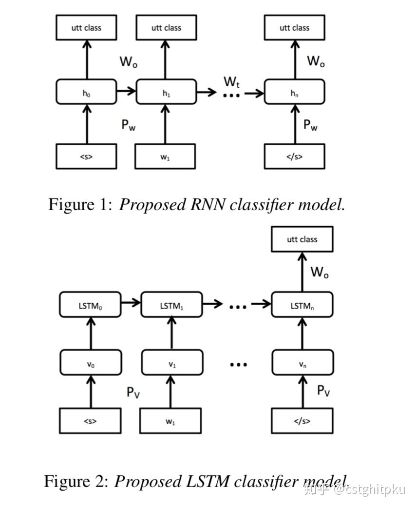

# 总结|对话系统中的口语理解技术(SLU)（一）

**总结|对话系统中的口语理解技术(SLU)（一）**

自然语言理解(NLU)就是要获得一个计算机能**直接使用的语义表示**，比如Distributional semantics、Frame semantics、Model-theoretic semantics等，本文采用的是frame semantics。NLU在很多NLP领域或任务都有涉及，比如问答、信息检索、阅读理解、对话系统以及很多需要NLG的任务(一般需要先理解才能生成)等。不同任务下的NLU也不一样，今天我们简单来聊聊对话系统中的NLU。

**先来说下大概的规划，因为SLU内容较多，所以打算分3次写。第1次写领域分类和意图识别，第2次写槽填充，第三次写Structural LU、Contextual LU、各种NLU方法的对比以及评测标准，感兴趣的可以期待一下。**

\1. 简介

对话系统按功能来划分的话，分为闲聊型、任务型、知识问答型和推荐型。在不同类型的聊天系统中，NLU也不尽相同。

1.1. 闲聊型对话中的NLU就是根据上下文进行意图识别、情感分析等， 并作为对话管理（DM）的输入；

1.2.任务型对话中的NLU就是领域分类和意图识别、槽填充。他的输入是用户的输入Utterance，输出是Un=（In, Zn), In是intention，Zn是槽植对。如果不太明白，可以看看我之前发的文章“任务型对话系统公式建模&&实例说明”。

1.3.知识问答型对话中的NLU主要是根据用户的问题，进行问句类型识别与问题分类，以便于更精准的进行信息检索或文本匹配而生成用户需要的知识（知识、实体、片段等）。

1.4.推荐型对话系统中的NLU就是根据用户各种行为数据和爱好进行兴趣匹配，以便于找到更精准的推荐候选集。

\2. 先来看看我汇总的任务型对话系统中的NLU之Domain/Intent Classification。

下面分别介绍下对话系统中不同Domain/Intent Classification技术。

2.1. **传统方法**：SVM、MaxEnt 。

这个就是用传统的SVM或MaxEnt，模型方面就是传统的MaxEnt或SVM(几个不同变种、几种不同核函数等)，特征主要就是用户的输入Utterance的句法、词法、词性等特征，分类的label集合是事先确定的，这方面paper也不少，不过比较久远了。相信大家都懂，不再赘述。

2.2. **DBN-Based** **(**[Sarikaya et al., 2011](https://link.zhihu.com/?target=https%3A//ieeexplore.ieee.org/abstract/document/5947649)**)**

这种方法基于Deep belief network，它是一种生成模型，由多个限制玻尔兹曼机（Restricted Boltzmann Machines）层组成，被“限制”为可视层和隐层，层间有连接，但层内的单元间不存在连接。隐层单元被训练去捕捉在可视层表现出来的高阶数据的相关性。

具体到这篇论文，主要思路：无监督训练权重，然后用BP做Fine-tuning。另外，还对比了与SVM、最大熵、boosting的效果。

2.3. **DCN-Based （**[Tur et al., 2012](https://link.zhihu.com/?target=https%3A//ieeexplore.ieee.org/abstract/document/6289054)**）**

这是一种基于Deep convex network(一种可扩展的模式分类体系结构)做NLU，具体可以参考Li Deng大牛在2011的Interspeech的paper。

这个工作的主要思路：用n-grams对用户的Utterance做特征选择，然后把简单的分类器做**Stacking**，Stacking跟Bagging与Boosting一样，也是一种ensemble的方法。**Stacking**指训练一个模型用于组合其他各个模型，**在这里相当于二次分类**。首先训练多个不同的模型，然后把训练的各个模型的输出作为输入来训练一个模型以得到最终输出。

另外，基于DCN的方法还被扩展到kernel-DCN([Deng et al., 2012](https://link.zhihu.com/?target=http%3A//ieeexplore.ieee.org/abstract/document/6424224/)).

2.4. **RNN-Based(**[Ravuri et al., 2015](https://link.zhihu.com/?target=https%3A//www.microsoft.com/en-us/research/wp-content/uploads/2016/02/RNNLM_addressee.pdf))

这种方法使用了RNN和LSTM，模型方面不用赘述了吧，都烂大街了。最终结论是，输入完所有词再进行意图分类效果更好。

2.5. **RNN+CNN based（**[Lee et al,2016](https://link.zhihu.com/?target=https%3A//arxiv.org/pdf/1603.03827.pdf)**）**

这个方法是用RNN+CNN做对话的act分类，提出了基于RNN和CNN并融合preceding short texts的模型。短文本如果出现在一个序列中，使用preceding short texts可能提高分类效果，这就是本文的最大的动机和创新点，事实证明也确实达到了SOTA的效果。

本文的两部分：使用RNN/CNN把短文本变成向量表示，基于文本的向量表示和preceding short texts做act分类。

另外，还有rule-based的方法做Domain/Intent Classification，比如CFG、JSGF，感兴趣的可以看看。基于RNN的细分的话，还有RCNN(Lai et al., 2015)和C-LSTM(Zhou et al., 2015)两种方法，

**3.本文涉及到的论文**

**以上是我关于对话NLU中Domain/Intent Classification的一些总结。下面贴出了一些代表性的paper，大家可以深入学习。另外，如果看完论文还是不太懂的欢迎微信找我讨论。**

**3.1 Deep belief nets (DBN)**

Deep belief nets for natural language call-routing, [Sarikaya et al., 2011](https://link.zhihu.com/?target=https%3A//ieeexplore.ieee.org/abstract/document/5947649)

**3.2 Deep convex networks (DCN)**

Towards deeper understanding: Deep convex networks for semantic utterance classification, [Tur et al., 2012](https://link.zhihu.com/?target=https%3A//ieeexplore.ieee.org/abstract/document/6289054)

**3.3 Extension to kernel-DCN**

Use of kernel deep convex networks and end-to-end learning for spoken language understanding, [Deng et al., 2012](https://link.zhihu.com/?target=http%3A//ieeexplore.ieee.org/abstract/document/6424224/)

**3.4 RNN and LSTMs**

Recurrent Neural Network and LSTM Models for Lexical Utterance Classification, [Ravuri et al., 2015](https://link.zhihu.com/?target=https%3A//www.microsoft.com/en-us/research/wp-content/uploads/2016/02/RNNLM_addressee.pdf)

**3.5 RNN and CNNs**

Sequential Short-Text Classification with Recurrent and Convolutional Neural Networks, [Lee et al., NAACL 2016](https://link.zhihu.com/?target=https%3A//arxiv.org/pdf/1603.03827.pdf)