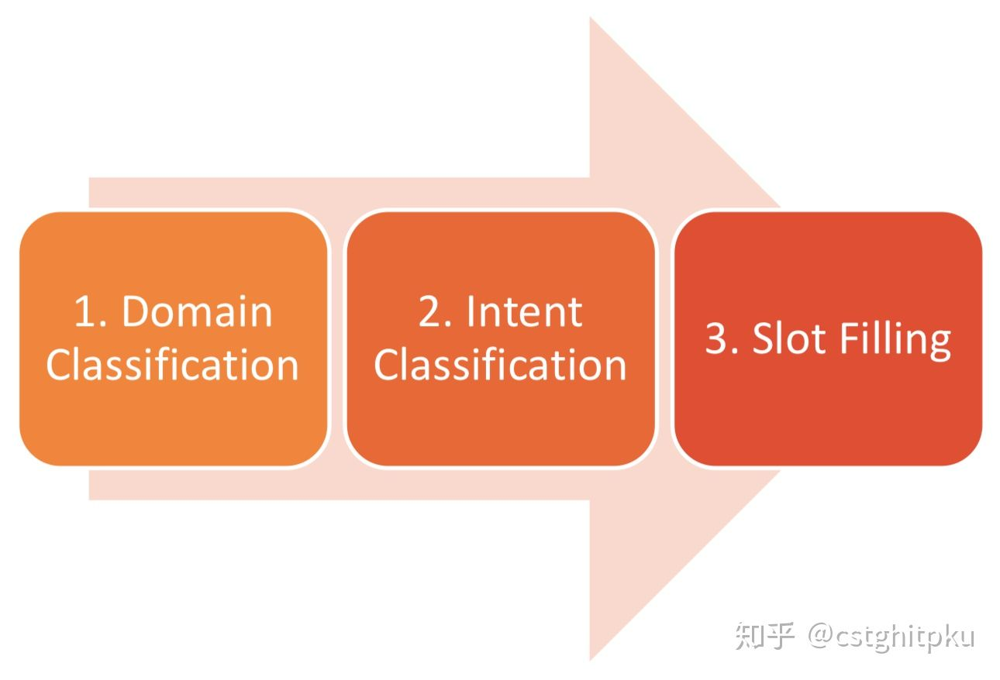
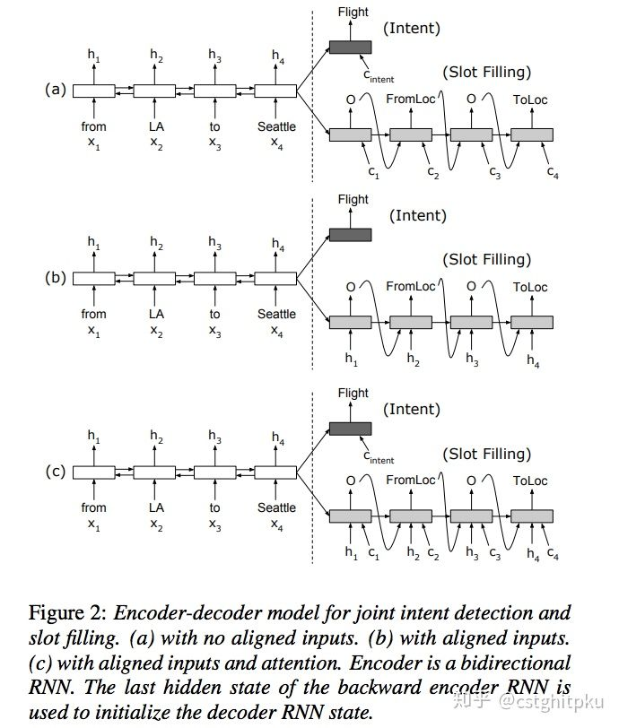
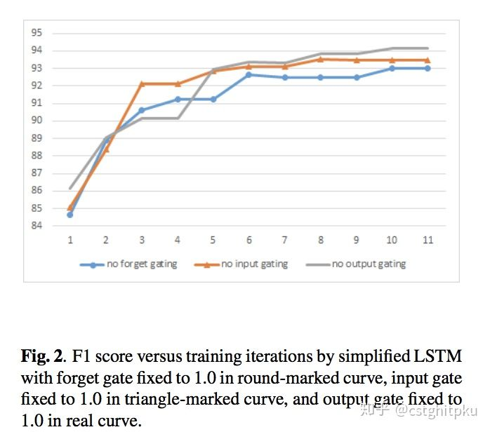
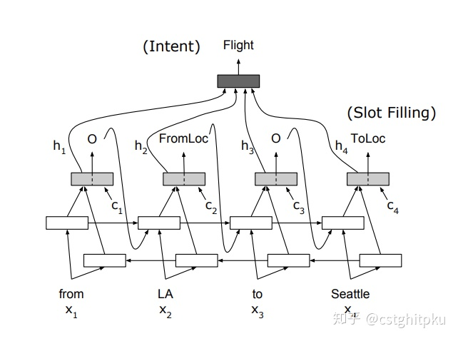

# 总结|对话系统中的口语理解技术(SLU)（二）

在 [总结|对话系统中的口语理解技术(SLU)（一）](https://zhuanlan.zhihu.com/p/50095779) ，我们一起聊了聊任务型对话中的NLU之领域分类和意图识别。今天我们一起来聊聊任务型对话中的NLU之槽填充。

自然语言理解(NLU)就是要获得一个计算机能**直接使用的语义表示**，比如Distributional semantics、Frame semantics、Model-theoretic semantics等，本文采用的是frame semantics。NLU在很多NLP领域或任务都有涉及，比如问答、信息检索、阅读理解、对话系统以及很多需要NLG的任务(一般需要先理解才能生成)等。不同任务下的NLU也不一样，今天我们简单来聊聊对话系统中的NLU。

**1. 简介**
对话系统按功能来划分的话，分为闲聊型、任务型、知识问答型和推荐型。在不同类型的聊天系统中，NLU也不尽相同。
1.1. 闲聊型对话中的NLU就是根据上下文进行意图识别、情感分析等， 并作为对话管理（DM）的输入；

1.2.任务型对话中的NLU就是领域分类和意图识别、槽填充。他的输入是用户的输入Utterance，输出是Un=（In, Zn), In是intention，Zn是槽植对。如果不太明白，可以看看我之前发的文章“[任务型对话系统公式建模&&实例说明](https://zhuanlan.zhihu.com/p/48268358)”。

槽填充实例，一般是序列标注问题

1.3.知识问答型对话中的NLU主要是根据用户的问题，进行问句类型识别与问题分类，以便于更精准的进行信息检索或文本匹配而生成用户需要的知识（知识、实体、片段等）。

1.4.推荐型对话系统中的NLU就是根据用户各种行为数据和爱好进行兴趣匹配，以便于找到更精准的推荐候选集。

**2. 槽填充**

先来看看我汇总的任务型对话系统中的NLU之槽填充。

槽填充技术汇总

下面分别介绍下对话系统中不同槽填充技术。
2.1. **CRF （**[Wang and Acero,Interspeech 2006](https://link.zhihu.com/?target=https%3A//pdfs.semanticscholar.org/7449/72a9b58e1c92496c613e16a73fc64b107a32.pdf)**）（**[Raymond and Riccardi,Interspeech 2007](https://link.zhihu.com/?target=http%3A//www.irisa.fr/texmex/people/raymond/pub/Interspeech2007.pdf)**）**
上面也说了，槽填充一般是序列标注问题，因此在序列标注任务中广泛应用的CRF和RNN以及各种变种很自然的就可以用于槽填充。事实也确实如此，槽填充的最早研究也确实用了很多CRF。CRF已经烂大街了，不再赘述。

第一篇实验结果

第一篇实验结果

第一篇实验结果

第二篇条件概率的定义

第二篇实验结果

2.2. **CRF+CNN** **(**[Puyang Xu and Ruhi Sarikaya 2013](https://link.zhihu.com/?target=https%3A//ieeexplore.ieee.org/document/6707709)**)**
这篇工作在ATIS数据集把意图识别跟槽填充联合起来做的，主要方法是CNN+ triangular CRF，意图识别的准确率为94.09%、槽填充的F1为95.42%，可以看出比起前面基于CRF的模型效果好不少。 triangular-CRF与CRF的主要区别是输入前先用前向网络得到每个标签的类别。下面分别介绍下意图识别和槽填充如何实现。

**意图识别：**

先得到隐藏层的特征h，再使用max pooling来获取整句的表示，最后用softmax做意图分类。

**槽填充：**

输入词向量到卷积层得到特征表示h，再用triangular-CRF打分。具体打分公式如下：

其中，t(Yi-1,Yi)为转移打分，hij为CNN得到的特征，每时刻的特征经过前向网络得到每个标签的概率，然后结合起来作为最终得分。

该工作的模型图

2.3. **RNN(n-grams)（**[Yao et al. 2013](https://link.zhihu.com/?target=https%3A//www.isca-speech.org/archive/archive_papers/interspeech_2013/i13_2524.pdf)**）（**[Mesnil et al, 2015](https://link.zhihu.com/?target=http%3A//www.iro.umontreal.ca/~lisa/pointeurs/taslp_RNNSLU_final_doubleColumn.pdf)**）**
这类基于RNN的模型使用了**n-grams**，也是在ATIS数据集做的实验

方法一

方法一

方法二

2.4. **RNN(encoder-decoder) (**[Kurata et al., EMNLP 2016](https://link.zhihu.com/?target=https%3A//arxiv.org/pdf/1601.01530.pdf)) （[Simonnet et al., NIPS 2015](https://link.zhihu.com/?target=http%3A//docs.wixstatic.com/ugd/b6d786_fb446f2938b24ea68d3b6821d0a7cee4.pdf)）
这类基于RNN的模型使用了**encoder-decoder**，第二篇还加入了Attention，Attention是根据ht 和st 用feed- forward 网络来计算的。也是在ATIS数据集做的实验。

方法一例子

方法一模型

方法二模型

另外，基于Attention的RNN还有interspeech 2016的一篇工作（[Liu and Lane 2016](https://link.zhihu.com/?target=https%3A//arxiv.org/pdf/1609.01454.pdf)），本文也是把意图识别和槽填充结合起来做，主要提供两种思路和模型，下面具体说下。

思路一：采用encoder-decoder，encoder的最后输出+文本向量做意图分类。下面说下a、b、c三图的区别：图a隐层为非对齐attention的模型，decoder隐层为非对齐的方式；图b为隐层为对齐无attention的模型；图c隐层为对齐attention的模型。

思路二：

decoder的隐层输出加权得到最后的意图分类，BiRNN得到特征并与文本向量拼接后作为单层decoder的输入，然后识别槽位。

2.5. **LSTM（**[Yao et al. 2014](https://link.zhihu.com/?target=https%3A//groups.csail.mit.edu/sls/publications/2014/Zhang_SLT_2014.pdf)**） GRU（**[Zhang and Wang 2016](https://link.zhihu.com/?target=https%3A//www.ijcai.org/Proceedings/16/Papers/425.pdf)**）**
这部分的两类方法主要是RNN的两大最有名的变种LSTM和GRU。也是在ATIS数据集做的实验。

方法一

方法二也基于Attention，是2016年IJCAI的一篇paper，把意图识别和槽填充结合起来做的。输入词向量，使用双向GRU学习特征。基于学习的隐层特征，使用max pooling得到全句的表示，再用softmax进行意图分类；对隐层输入用前向网络得到每个标签的概率，再用CRF进行全局打分得到最优序列标注结果，根据序列标注结果完成槽填充。需要说明的一点是：联合损失函数为槽与意图的极大似然。也是在ATIS数据集做的实验。

模型结构图

与之前模型的对比

Joint后效果更好

2.6. **Multi-task Learning**

这类方法是跨领域的多任务同时学习，主要思想是在数据较多的领域或任务训练模型，然后迁移到数据较少的领域或任务，以便于提升其效果。这类方法底层网络跨领域或任务都是共享的，高层网络因为任务或领域不同而不同。代表性的工作包括：

[Zhai et al., AAAI 2017](https://link.zhihu.com/?target=https%3A//arxiv.org/pdf/1701.04027.pdf)

这个工作主要是把 Segmentation 和 槽填充联合起来做的，对segments进行双向LSTM编码，再用LSTM解码并得到序列标注结果，最后就实现了槽填充。

[Hakkani-Tur et al., Interspeech 2016](https://link.zhihu.com/?target=https%3A//www.microsoft.com/en-us/research/wp-content/uploads/2016/06/IS16_MultiJoint.pdf)

这篇工作是把 Semantic Frame Parsing 与 意图分类、槽填充 联合起来做。另外说句题外话，这篇文章的作者们都是任务型对话领域的一流学者。需要注意的是，意图分类和槽填充**在一个序列完成**，跟下一种方法不一样。

[Liu and Lane, Interspeech 2016](https://link.zhihu.com/?target=https%3A//arxiv.org/abs/1609.01454)

这篇工作是基于Attention的RNN，把意图识别与槽填充结合起来做，其实在上面**RNN(encoder-decoder)**的方法中已经介绍过这个方法。为了跟上一种方法对比，需要注意的是，意图分类和槽填充**不在同一个序列完成**，decoder的隐层输出加权得到最后的意图分类，BiRNN得到特征并与文本向量拼接后作为单层decoder的输入，然后识别槽位。

2.7. **Domain Adaptation** **Adaptation Adaptation** （[Jaech et al., Interspeech 2016 ](https://link.zhihu.com/?target=https%3A//arxiv.org/pdf%3C/u%3E/1604.00117.pdf)）

这个方法是迁移学习中的领域适配。领域适配解决这类任务的主要思路是：利用源领域与目标领域分布之间的KL散度对目标领域模型进行Regularize。

2.8. **Parameter transfer**（[Yazdani and Henderson 2015](https://link.zhihu.com/?target=http%3A//www.aclweb.org/anthology/D15-1027) ）
这个方法是迁移学习中的参数转移。参数转移解决这类任务的主要思路是：使用词嵌入向量和相似标签分类器之间的参数共享，因此相似的分类器具有相似的超平面。另外需要指出的是，这个方法还使用了Zero-Shot Learning（举例说明的话：假如训练数据没有斑马，但是要识别斑马，那么可以用马的外形+老虎的条纹+熊猫的黑白色来组合训练）。

2.9 **Instance based transfer** (Tur 2006)
这个方法是迁移学习中的基于Instance的转移。在领域之间自动映射相似的类别，并跨领域传递相似的实例。方法比较久远，不再赘述。

2.10 **RecNN+Viterbi （**[Guo et al., 2014](https://link.zhihu.com/?target=https%3A//ieeexplore.ieee.org/document/7078634)**）**

这个方法也是基于ATIS数据集做的。输入为词向量，每个词性看作权重向量 ，每个词在其路径的运算为词向量与词性权重向量的点积运算。基于根节点的输出向量做意图分类；采用基于Viterbi进行全局优化，采用基于tri-gram语言模型极大化标注序列进行槽填充。

**3.本文涉及到的论文**
**以上是我关于对话NLU中槽填充的一些总结。下面贴出了一些代表性的paper，大家可以深入学习。另外，如果看完论文还是不太懂的欢迎微信找我讨论。**

**CRF (Wang and Acero 2006; Raymond and Riccardi 2007):**

[Discriminative Models for Spoken Language Understanding](https://link.zhihu.com/?target=https%3A//pdfs.semanticscholar.org/7449/72a9b58e1c92496c613e16a73fc64b107a32.pdf); Wang and Acero , **Interspeech,** 2006

[Generative and discriminative algorithms for spoken language understanding](https://link.zhihu.com/?target=http%3A//www.irisa.fr/texmex/people/raymond/pub/Interspeech2007.pdf); Raymond and Riccardi, **Interspeech,** 2007

Puyang Xu and Ruhi Sarikaya. [Convolutional neural network based triangular crf for joint intent detection and slot filling.](https://link.zhihu.com/?target=https%3A//ieeexplore.ieee.org/document/6707709) IEEE, 2013.

**RNN (Yao et al. 2013; Mesnil et al. 2013, 2015; Liu and Lane 2015);**

[Recurrent neural networks for language understanding](https://link.zhihu.com/?target=https%3A//www.isca-speech.org/archive/archive_papers/interspeech_2013/i13_2524.pdf), **interspeech** 2013

[Using recurrent neural networks for slot filling in spoken language understanding](https://link.zhihu.com/?target=http%3A//www.iro.umontreal.ca/~lisa/pointeurs/taslp_RNNSLU_final_doubleColumn.pdf)**,** Mesnil et al, 2015

[Grégoire Mesnil, Yann Dauphin, Kaisheng Yao, Yoshua Bengio, Li Deng, Dilek Hakkani-Tur, Xiaodong He, Larry Heck, Gokhan Tur, Dong Yu and Geoffrey Zweig - Using Recurrent Neural Networks for Slot Filling in Spoken Language Understanding](https://link.zhihu.com/?target=http%3A//www.iro.umontreal.ca/~lisa/pointeurs/taslp_RNNSLU_final_doubleColumn.pdf)**, IEEE**

[Investigation of recurrent-neural-network architectures and learning methods for spoken language understanding](https://link.zhihu.com/?target=https%3A//www.iro.umontreal.ca/~lisa/pointeurs/RNNSpokenLanguage2013.pdf).;Mesnil et al, **Interspeech,** 2013

[Recurrent Neural Network Structured Output Prediction for Spoken Language Understanding](https://link.zhihu.com/?target=http%3A//speech.sv.cmu.edu/publications/liu-nipsslu-2015.pdf), B Liu, I Lane, **NIPS**, 2015

**LSTM (Yao et al. 2014)**

[Spoken language understanding using long short-term memory neural networks](https://link.zhihu.com/?target=https%3A//groups.csail.mit.edu/sls/publications/2014/Zhang_SLT_2014.pdf)

**Bi-LSTMs and Input sliding window of n-grams**

[Recurrent neural networks for language understanding](https://link.zhihu.com/?target=https%3A//www.isca-speech.org/archive/archive_papers/interspeech_2013/i13_2524.pdf), **interspeech** 2013

[Using recurrent neural networks for slot filling in spoken language understanding](https://link.zhihu.com/?target=http%3A//www.iro.umontreal.ca/~lisa/pointeurs/taslp_RNNSLU_final_doubleColumn.pdf)**,** Mesnil et al, 2015

[Grégoire Mesnil, Yann Dauphin, Kaisheng Yao, Yoshua Bengio, Li Deng, Dilek Hakkani-Tur, Xiaodong He, Larry Heck, Gokhan Tur, Dong Yu and Geoffrey Zweig - Using Recurrent Neural Networks for Slot Filling in Spoken Language Understanding](https://link.zhihu.com/?target=http%3A//www.iro.umontreal.ca/~lisa/pointeurs/taslp_RNNSLU_final_doubleColumn.pdf)**, IEEE**

**Encoder-decoder networks**

[Leveraging Sentence-level Information with Encoder LSTM for Semantic Slot Filling](https://link.zhihu.com/?target=https%3A//arxiv.org/pdf/1601.01530.pdf), Kurata et al., **EMNLP** 2016

**Attention-based encoder-decoder**

[Exploring the use of attention-based recurrent neural networks for spoken language understanding](https://link.zhihu.com/?target=http%3A//docs.wixstatic.com/ugd/b6d786_fb446f2938b24ea68d3b6821d0a7cee4.pdf), Simonnet et al., 2015

\2015. Exploring the use of attention-based recurrent neural networks for spoken language understanding. In Proc. **NIPS**

**Multi-task learning**

[Domain Adaptation of Recurrent Neural Networks for Natural Language Understanding](https://link.zhihu.com/?target=https%3A//arxiv.org/pdf/1604.00117.pdf) **,**Jaech et al., **Interspeech** 2016

**Joint Segmentation and Slot Tagging**

**[Neural Models for Sequence Chunking](https://link.zhihu.com/?target=https%3A//arxiv.org/pdf/1701.04027.pdf),** Zhai et al., **AAAI** 2017

**Joint Semantic Frame Parsing**

**Slot filling and intent prediction in the same output sequence**

[Multi-Domain Joint Semantic Frame Parsing using Bi-directional RNN-LSTM](https://link.zhihu.com/?target=https%3A//www.microsoft.com/en-us/research/wp-content/uploads/2016/06/IS16_MultiJoint.pdf) **,** Hakkani-Tur et al., **Interspeech** 2016

**Intent prediction and slot filling are performed in two branches**

[Attention-Based Recurrent Neural Network Models for Joint Intent Detection and Slot Filling](https://link.zhihu.com/?target=https%3A//arxiv.org/abs/1609.01454), Liu and Lane, **Interspeech** 2016

**Transfer Learning**

Gokhan Tur. [Multitask learning for spoken language understanding](https://link.zhihu.com/?target=http%3A//citeseerx.ist.psu.edu/viewdoc/download%3Fdoi%3D10.1.1.385.8899%26rep%3Drep1%26type%3Dpdf). In 2006 **IEEE**

Gökhan Tür. [Model adaptation for spoken language understanding](https://link.zhihu.com/?target=https%3A//ieeexplore.ieee.org/document/1415045), 2005.

[A Model of Zero-Shot Learning of Spoken Language Understanding](https://link.zhihu.com/?target=http%3A//www.aclweb.org/anthology/D15-1027)

**微信公众号：AI部落联盟。公众号有我联系方式，平时私信太多，容易看不到。非诚勿扰。**

编辑于 2018-11-19