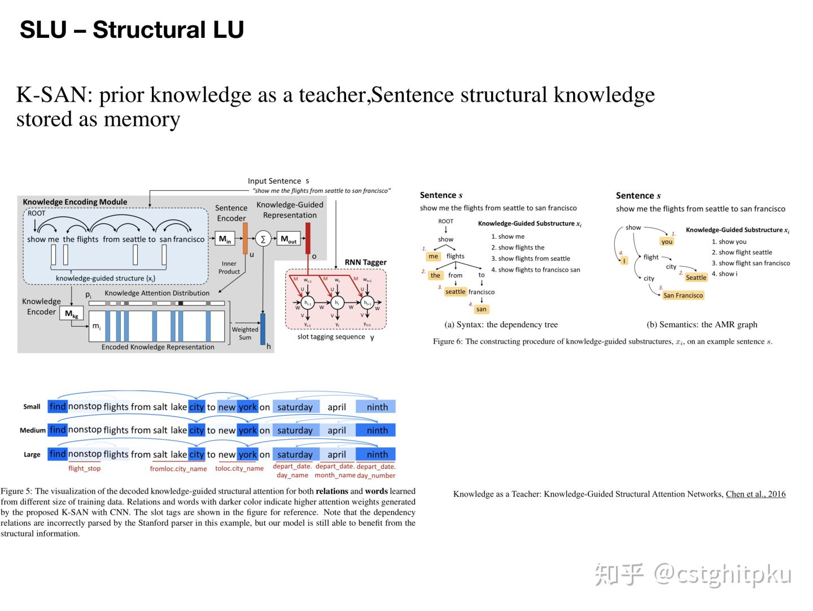
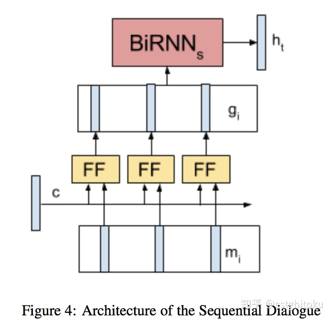

# 总结|对话系统中的口语理解技术(SLU)（三）

在[总结|对话系统中的口语理解技术(SLU)（一）](https://zhuanlan.zhihu.com/p/50095779)，我们一起聊了聊任务型对话中的NLU之领域分类和意图识别；在[总结|对话系统中的口语理解技术(SLU)（二）](https://zhuanlan.zhihu.com/p/50347509)，我们一起聊了聊任务型对话中的NLU之槽填充。今天我们一起来聊聊任务型对话中的NLU之上下文LU、结构化LU以及SLU各方法的对比、SLU的评估等。

自然语言理解(NLU)就是要获得一个计算机能**直接使用的语义表示**，比如Distributional semantics、Frame semantics、Model-theoretic semantics等，本文采用的是frame semantics。NLU在很多NLP领域或任务都有涉及，比如问答、信息检索、阅读理解、对话系统以及很多需要NLG的任务(一般需要先理解才能生成)等。不同任务下的NLU也不一样，今天我们简单来聊聊对话系统中的NLU。

**1. 简介**

对话系统按功能来划分的话，分为闲聊型、任务型、知识问答型和推荐型。在不同类型的聊天系统中，NLU也不尽相同。

1.1. 闲聊型对话中的NLU就是根据上下文进行意图识别、情感分析等， 并作为对话管理（DM）的输入；

1.2.任务型对话中的NLU就是领域分类和意图识别、槽填充。他的输入是用户的输入Utterance，输出是Un=（In, Zn), In是intention，Zn是槽植对。如果不太明白，可以看看我之前发的文章“[任务型对话系统公式建模&&实例说明](https://zhuanlan.zhihu.com/p/48268358)”。

1.3.知识问答型对话中的NLU主要是根据用户的问题，进行问句类型识别与问题分类，以便于更精准的进行信息检索或文本匹配而生成用户需要的知识（知识、实体、片段等）。

1.4.推荐型对话系统中的NLU就是根据用户各种行为数据和爱好进行兴趣匹配，以便于找到更精准的推荐候选集。

**2. 上下文LU、结构化LU**

先来看看我汇总的任务型对话系统中的NLU之上下文LU、结构化LU。

上下文LU

结构化LU

2.1 **上下文LU**

这是一类结合上下文来进行SLU的方法，这类方法的主要好处是：在**多轮对话**中，解决**歧义问题。**

先来看看多轮对话和单论对话的区别：

单轮对话VS多轮对话

为了把抽象问题具体化，再来看个歧义的例子：

*人：我想去美国。*

*机器：那你有什么需要呢？*

*人：我想问下签证的时间。*

*机器：一脸懵逼（**因为可能是问签证的有效期，也肯能是问办理签证需要多长时间**）*

*人：我想在那边待3个月。*

*机器：好的，签证的有效期是xxxx。（根据上句话可以确定是问**签证的有效期）***

歧义问题

明确了这类方法的定位和需要解决的问题，接下来我们分别介绍几种常用的方法：

**[Hori et al, 2015](https://link.zhihu.com/?target=https%3A//www.merl.com/publications/docs/TR2015-134.pdf)**

基于Seq2Seq模型对上下文建模，一次输入一个词，每句结束时输出标签。这种模型还具有对话者角色相关的LSTM层，并使用角色状态控制门来决定角色是不是active，而且角色状态随时间而线性传播，agent和client的角色也被加以区分。这种方法对上下文比较敏感，能解决多轮对话的歧义问题。

**[Chen et al., 2016](https://link.zhihu.com/?target=https%3A//www.microsoft.com/en-us/research/wp-content/uploads/2016/06/IS16_ContextualSLU.pdf)** 这篇论文的所有作者都是任务型对话领域的知名学者。

这种方法的主要idea是在作slot tagging时加入上下文知识， 然后以一种潜在的方式进行对话状态的追踪。

这是一种基于端到端的记忆网络携带Knowledge来做多轮对话中的上下文理解，将RNN和Memory Networks结合起来应用于SLU模块。具体分为4步：

1.记忆表示:为了存储前面对话轮中的知识，通过RNN将前面对话轮中的每个话语嵌入到连续的空间中，将每个话语转换成一个记忆向量；

2.知识注意力分布：在嵌入空间中，通过取内积然后softmax来计算当前输入和每个记忆向量间的匹配，该结果可以被看作是为了理解当前输入而建模知识传递的注意力分布；

3.知识编码表示：为了对来自历史的知识进行编码，历史向量是对由注意力分布加权的记忆嵌入的总和；

4.序列标注：提供携带的知识来提高序列标注的效果。

**[Bapna et.al., SIGDIAL 2017](https://link.zhihu.com/?target=http%3A//www.aclweb.org/anthology/W17-5514)** **对话**

使用RNN探索新的建模对话上下文的方法，提出了序列对话编码网络，它允许按时间顺序对来自对话历史的上下文编码。之前轮和当前轮的encodings被输入一个共享所有存储器权重的前馈网络。并将序列对话编码网络的性能与仅使用先前的上下文的模型、在memory网络中编码失去对话顺序的上下文的模型进行比较，在多域对话数据集上的实验表明，序列对话编码网络能减少歧义。

2.2 **结构化LU（**[Chen et al., 2016](https://link.zhihu.com/?target=https%3A//arxiv.org/abs/1609.03286)**）**

本文提出了K-SAN:用先验知识当作引导，句子结构知识当作menory来存储。这是**由先验知识引导的结构化注意力网络**，其实就是RNN+attention+先验知识，但是跟RNN不同的是：该模型充分利用自然语言丰富的、结构化的信息而不再是线性扁平链。

该模型的两大优势是：可从**少量数据**中获取重要的**子结构**，增强模型的泛化能力；针对给定句子，可自动找出对其语义标签至关重要的**显著子结构**，从而缓解测试集中的**unseen data**，进一步提升NLU的效果。并在ATIS数据上表明 K-SAN 可以使用注意力机制有效地从子结构中提取出显著的知识，达到SOTA的效果。

\3. **SLU各方法的对比**

**以上简单介绍了对话系统中的SLU中的[领域分类和意图识别](https://zhuanlan.zhihu.com/p/50095779)、[槽填充](https://zhuanlan.zhihu.com/p/50347509)、上下文LU和结构化LU技术，下面简单总结下它们的优势和劣势。**

4.**SLU的评估**

任何一项技术想要取得进步，那么他的评测方法是至关重要的（就相当于目标函数之于机器学习算法），所以我列出一些关于SLU的评估。遗憾的是，目前SLU的评估我感觉并不成熟，这也是制约SLU发展的一个重要原因，如果谁能想出更好的评估方法或整理出一个业内公认的高质量评测数据集，那么一定会在对话系统领域有一席之地，引用量也会蹭蹭上涨。

\5. **本文涉及到的论文**

以上是我关于对话NLU中的上下文LU、结构化LU以及SLU各方法的对比、SLU的评估等的一些总结。下面贴出了一些代表性的paper，大家可以深入学习。另外，如果看完论文还是不太懂的欢迎微信找我讨论。微信公众号：***AI部落联盟***。公众号有我联系方式，平时私信太多，容易看不到。非诚勿扰。

5.1 **Contextual LU**

5.1.1 **Context Sensitive Spoken Language Understanding using Role Dependent LSTM layers,** **[Hori et al, 2015](https://link.zhihu.com/?target=https%3A//www.merl.com/publications/docs/TR2015-134.pdf)**

5.1.2 **E2E MemNN for Contextual LU**

End-to-End Memory Networks with Knowledge Carryover for Multi-Turn Spoken Language Understanding, [Chen et al., 2016](https://link.zhihu.com/?target=https%3A//www.microsoft.com/en-us/research/wp-content/uploads/2016/06/IS16_ContextualSLU.pdf)

5.1.3 **Sequential Dialogue Encoder Network**

Sequential Dialogue Context Modeling for Spoken Language Understanding, [Bapna et.al., SIGDIAL 2017](https://link.zhihu.com/?target=http%3A//www.aclweb.org/anthology/W17-5514)

5.2 **Structural LU**

**K-SAN:prior knowledge as a teacher,Sentence structural knowledge stored as memory**

Knowledge as a Teacher: Knowledge-Guided Structural Attention Networks, [Chen et al., 2016](https://link.zhihu.com/?target=https%3A//arxiv.org/abs/1609.03286)

5.3 **LU Importance**

Investigation of Language Understanding Impact for Reinforcement Learning Based Dialogue Systems,[Li et al., 2017](https://link.zhihu.com/?target=http%3A//arxiv.org/abs/1703.07055)

