# 一文彻底读懂智能对话系统！当前研究综述和未来趋势

笔者在最近的研究中发现了一篇非常好的有关对话系统的论文，[《A Survey on Dialogue Systems:Recent Advances and New Frontiers》](https://link.zhihu.com/?target=https%3A//arxiv.org/abs/1711.01731)，论文来自于京东数据团队，论文引用了近124篇论文，是一篇综合全面的介绍对话系统的文章，可谓是诚意满满，今天我们将其重点进行解读，以飨读者。

## 前言

拥有一个虚拟助理或一个拥有足够智能的聊天伙伴系统似乎是虚幻的，而且可能只在科幻电影中存在很长一段时间。近年来，人机对话因其潜在的潜力和诱人的商业价值而受到越来越多研究者的关注。随着大数据和深度学习技术的发展，创建一个自动的人机对话系统作为我们的私人助理或聊天伙伴，将不再是一个幻想。

当前，对话系统在各个领域越来越引起人们的重视，深度学习技术的不断进步极大地推动了对话系统的发展。对于对话系统，深度学习技术可以利用大量的数据来学习特征表示和回复生成策略，这其中仅需要少量的手工操作。现如今，我们可以很容易地访问网络上对话的“大数据”，我们也许能够学习如何回复，以及如何回复几乎任何的输入，这将极大地允许我们在人类和计算机之间建立数据驱动的、开放的对话系统。另一方面，深度学习技术已经被证明是有效的，可以在大数据中捕获复杂的模式，并拥有大量的研究领域，如计算机视觉、自然语言处理和推荐系统等。在本文中，作者从不同的角度对这些最近的关于对话系统的进展进行概述，并讨论了一些可能的研究方向。

具体来说，对话系统大致可分为两种:(1)**任务导向型**（task-oriented)对话系统和(2)**非任务导向型**(non-task-oriented)对话系统(也称为聊天机器人)。面向任务的系统旨在帮助用户完成实际具体的任务，例如帮助用户找寻商品，预订酒店餐厅等**。**

面向任务的系统的广泛应用的方法是将对话响应视为一条管道（pipeline)，如下图所示：

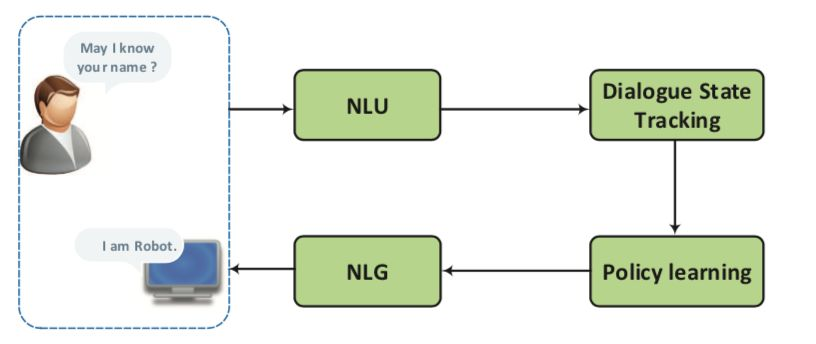

系统首先理解人类所传达的信息，将其作为一种内部状态，然后根据对话状态的策略采取一系列相应的行为，最后将动作转化为自然语言的表现形式。虽然语言理解是通过统计模型来处理的，但是大多数已经部署的对话系统仍然使用手工的特性或手工制定的规则，用于状态和动作空间表示、意图检测和插槽填充。

非任务导向的对话系统与人类交互，提供合理的回复和娱乐消遣功能，通常情况下主要集中在开放的领域与人交谈。虽然非任务导向的系统似乎在进行聊天，但是它在许多实际应用程序中都发挥了作用。数据显示，在网上购物场景中，近80%的话语是聊天信息，处理这些问题的方式与用户体验密切相关。一般来说，对于非任务导向型对话系统，目前用的主要是两种主要方法：(1)生成方法，例如序列到序列模型（seq2seq），在对话过程中产生合适的回复，生成型聊天机器人目前是研究界的一个热点，和检索型聊天机器人不同的是，它可以生成一种全新的回复，因此相对更为灵活，但它也有自身的缺点，比如有时候会出现语法错误，或者生成一些没有意义的回复；(2)基于检索的方法，从事先定义好的索引中进行搜索，学习从当前对话中选择回复。检索型方法的缺点在于它过于依赖数据质量，如果选用的数据质量欠佳，那就很有可能前功尽弃。

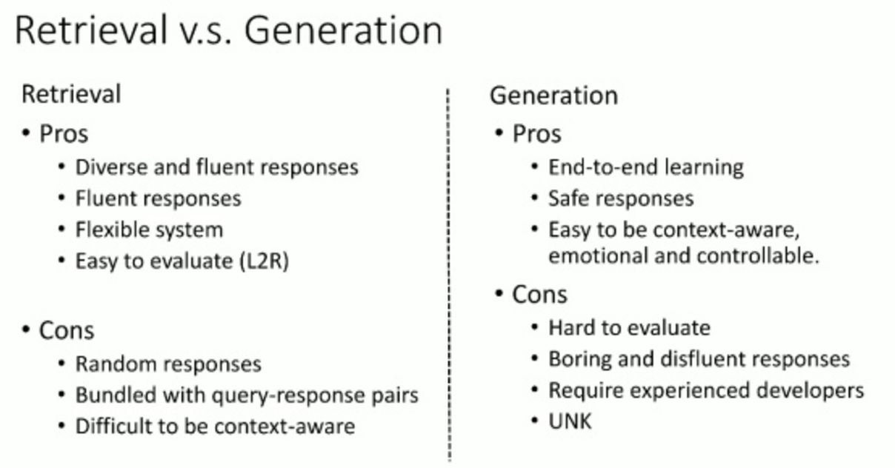

近年来，大数据和深度学习技术的迅猛发展，极大地促进了面向任务和面向非导向的对话系统的发展。在本篇论文中，作者的目标是(1)对对话系统进行概述，特别是最近的深度学习的进展;(2)讨论可能的研究方向。

## 任务导向型对话系统

面向任务的对话系统是对话系统的一个重要分支。在这部分中，作者总结了面向任务的对话系统的管道方法和端到端方法。

**1. 管道（Pipeline） 方法**

任务导向型对话系统的典型结构在之前的图中已经展示，它包括四个关键组成部分:

1）**自然语言理解**（Natural Language Understanding，NLU）：它将用户输入解析为预定义的语义槽。

如果有一个话语，自然语言理解将其映射为语义槽。插槽是根据不同的场景预先定义的。

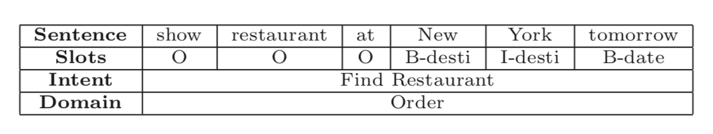

上图展示了一个自然语言表示的示例，其中“New York”是指定为slot值的位置，并且分别指定了域和意图。典型的，有两种类型的表示。一个是话语层次类别，如用户的意图和话语类别。另一个是字级信息提取，如命名实体识别和槽填充。对话意图检测是为了检测用户的意图。它将话语划分为一个预先定义的意图。

2）**对话状态跟踪**（Dialogue State Tracker，DST）。对话状态跟踪是确保对话系统健壮性的核心组件。它在对话的每一轮次对用户的目标进行预估，管理每个回合的输入和对话历史，输出当前对话状态。这种典型的状态结构通常称为槽填充或语义框架。传统的方法已经在大多数商业实现中得到了广泛的应用，通常采用手工规则来选择最有可能的输出结果。然而，这些基于规则的系统容易出现频繁的错误，因为最可能的结果并不总是理想的。

最近深度学习采用的方法是使用一个滑动窗口输出任意数量的可能值的概率分布序列。虽然它在一个领域受过训练，但它可以很容易地转移到新的领域。此处运用较多的模型是，multi-domain RNN dialog state tracking models和Neural Belief Tracker (NBT) 。

3）**对话策略学习**（Dialogue policy learning）。根据状态跟踪器的状态表示，策略学习是生成下一个可用的系统操作。无论是监督学习还是强化学习都可以用来优化政策学习。监督学习是针对规则产生的行为进行的，在在线购物场景中，如果对话状态是“推荐”，那么触发“推荐”操作，系统将从产品数据库中检索产品。强化学习方法的引入可以对对话策略进行进一步的训练，以引导系统制定最终的策略。在实际实验中，强化学习方法的效果超过了基于规则和监督的方法。

4）**自然语言生成**(Natural Language Generation，NLG)。它将选择操作进行映射并生成回复。

一个好的生成器通常依赖于几个因素:适当性、流畅性、可读性和变化性。传统的NLG方法通常是执行句子计划。它将输入语义符号映射到代表话语的中介形式，如树状或模板结构，然后通过表面实现将中间结构转换为最终响应。深度学习比较成熟的方法是基于LSTM的encoder-decoder形式，将问题信息、语义槽值和对话行为类型结合起来生成正确的答案。同时利用了注意力机制来处理对解码器当前解码状态的关键信息，根据不同的行为类型生成不同的回复。

**2. 端到端（End-to-End）方法**

尽管传统的面向任务的对话系统中有许多特定领域的手工制作，但它们很难适应新的领域，近年来，随着端到端神经生成模型的发展，为面向任务的对话系统构建了端到端的可训练框架。值得注意的是，当我们引入非面向任务的对话系统时，将讨论关于神经生成模型的更多细节。与传统的管道模型不同，端到端模型使用一个模块，并与结构化的外部数据库交互。

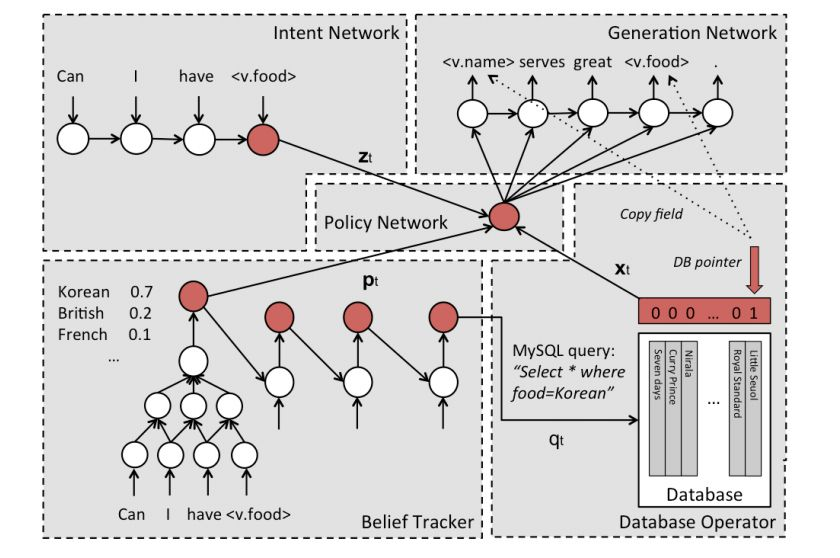

上图的模型是一种基于网络的端到端可训练任务导向型对话系统，将对话系统的学习作为学习从对话历史到系统回复的映射问题，并应用encoder-decoder模型来训练。然而，该系统是在监督的方式下进行训练——不仅需要大量的训练数据，而且由于缺乏对训练数据对话控制的进一步探索，它也可能无法找到一个好的策略。

随着强化学习研究的不断深入，上图的模型首先提出了一种端到端强化学习的方法，在对话管理中联合训练对话状态跟踪和对话策略学习，从而更有力地对系统的动作进行优化。

## 非任务导向型对话系统

不同于任务导向型对话系统，它的目标是为用户完成特定的任务，而非任务导向的对话系统(也称为聊天机器人)专注于在开放的领域与人交谈。一般来说，聊天机器人是通过生成方法或基于检索的方法实现的。
生成模型能够生成更合适的回复，而这些回复可能从来没有出现在语料库中，而基于检索的模型则具有信息充裕和响应流畅的优势。

**1. 神经生成模型（Neural Generative Models）**
深度学习在机器翻译中的成功应用，即神经机器翻译，激发了人们对神经生成对话研究的热情。目前神经生成模型的热门研究课题大概有如下几个方面。

**1.1 Sequence-to-Sequence Models**

给定包含 ![[公式]](imgs/equation-20201121193408753) 个词语的输入序列（message） ![[公式]](imgs/equation-20201121193410433) = ![[公式]](imgs/equation?tex=(x_1%2Cx_2%2C...%2Cx_T)) ，和长度为 ![[公式]](imgs/equation-20201121193413606) 的目标序列（response） ![[公式]](imgs/equation?tex=Y%3D(y_1%2Cy_2%2C...%2Cy_{T^%2C})) ，模型最大化 ![[公式]](imgs/equation-20201121193412627) 在 ![[公式]](https://www.zhihu.com/equation?tex=X) 下的条件概率：

![[公式]](imgs/equation?tex=P(y_1%2C...%2Cy_{T^{'}}|x_1%2C...%2Cx_T))

具体来说，Seq2Seq模型是在encoder-decoder结构中,下图是这种结构的示意：

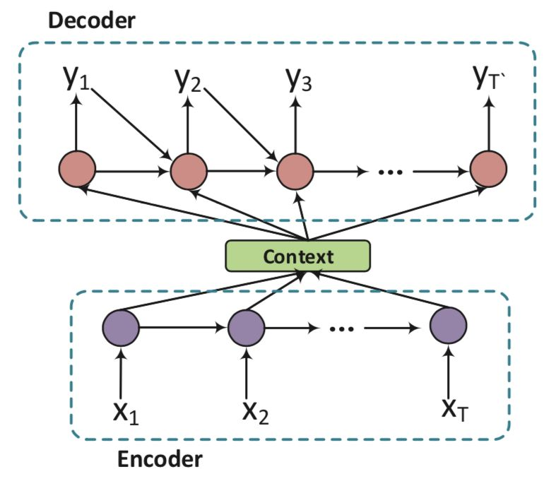

编码器将 ![[公式]](https://www.zhihu.com/equation?tex=X) 逐字读入，并通过递归神经网络(RNN)将其表示为上下文向量 ![[公式]](imgs/equation-20201121193418260) ，然后解码器将 ![[公式]](https://www.zhihu.com/equation?tex=c) 作为输入估计 ![[公式]](imgs/equation-20201121193412627) 的生成概率。

(1) Encoder

Encoder过程很简单，直接使用RNN（一般用LSTM）进行语义向量生成：

![[公式]](imgs/equation-20201121193417064)

![[公式]](imgs/equation?tex=c%3D\phi(h_1%2C...%2Ch_T))

其中 ![[公式]](imgs/equation-20201121193419378) 是非线性函数，例如LSTM,GRU， ![[公式]](imgs/equation-20201121193417620) 是上一隐节点输出， ![[公式]](imgs/equation-20201121193418039) 是当前时刻的输入。向量 ![[公式]](https://www.zhihu.com/equation?tex=c) 通常为RNN中的最后一个隐节点(h, Hidden state)，或者是多个隐节点的加权和。

(2) Decoder

模型的decoder过程是使用另一个RNN通过当前隐状态 ![[公式]](imgs/equation-20201121193419428) 来预测当前的输出符号 ![[公式]](imgs/equation-20201121193419789) ，这里的 ![[公式]](https://www.zhihu.com/equation?tex=h_t) 和 ![[公式]](https://www.zhihu.com/equation?tex=y_t) 都与其前一个隐状态和输出有关,Seq2Seq的目标函数定义为：

![[公式]](imgs/equation?tex=P(y_1%2C...%2Cy_{T^{'}}|x_1%2C...%2Cx_T)%3Dp(y_1|c)\prod_{t%3D2}^{T^{'}}p(y_t|c%2Cy_1%2C...%2Cy_{t-1}))

**1.2 对话上下文（Dialogue Context）**

考虑对话的上下文信息的是构建对话系统的关键所在，它可以使对话保持连贯和增进用户体验。使用层次化的RNN模型，捕捉个体语句的意义，然后将其整合为完整的对话。同时，分别用字级别和句子级别的注意力方法扩展层次化的结构。试验证明：(1)层次化 RNNs的表现通常优于非层次化的RNNs；(2)在考虑上下文相关的信息后，神经网络趋向于产生更长的、更有意义和多样性的回复。

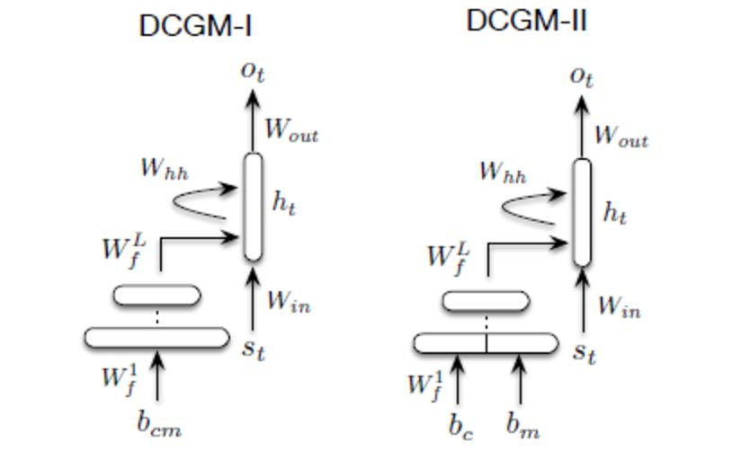

在上图中，作者通过代表整个对话历史(包括当前的信息)，用连续的表示或嵌入单词和短语来解决上下文敏感回复生成的这一难题。

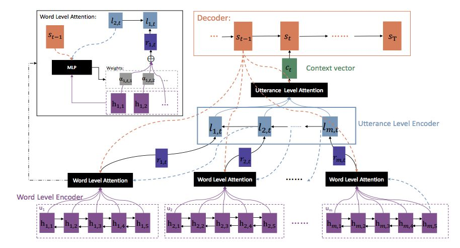

在上图的结构中作者引入两个层次的Attention机制，让模型能够自动的学到词语与句子级别的重要度信息，从而更好的生成新一轮的对话。作者在句子级别的信息中，是反向学习的，即认为下一句的信息中更能够包含上一句的信息，所以从总体上来看，其对于对话的学习是逆向使用每一轮对话的内容的。

**1.3 回复多样性（Response Diversity）**
在当前Seq2Seq对话系统中，一个具有挑战性的问题是，它们倾向于产生无关紧要的或不明确的、普通的、几乎没有意义的回复，而这些回复常常涉及到一些诸如“I don't know”，“I am OK”这样的无意义回复。解决这类问题的一个很有效的方法是找到并设置一个更好的目标函数。除此之外，解决此类问题的一个方法是增加模型的复杂度。下图这篇论文《Building End-To-End Dialogue Systems Using Generative Hierarchical Neural Network Models》使用了 latent variable 来解决无意义回复这个问题。

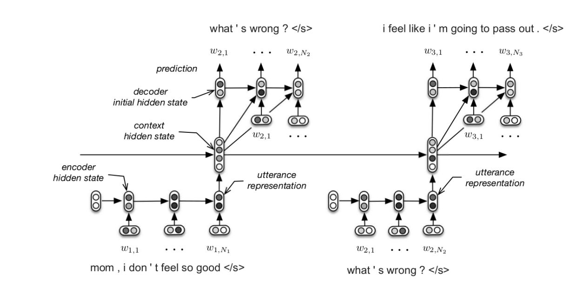

**1.4 主题和个性化（Topic and Personality）**

明确对话的内在属性是提高对话多样性和保证一致性的另一种方法。在不同的属性中，主题和个性被广泛地进行研究探讨。

在下图的模型中，作者注意到人们经常把他们的对话与主题相关的概念联系起来，并根据这些概念做出他们的回复。他们使用Twitter LDA模型来获取输入的主题，将主题信息和输入表示输入到一个联合注意模块中，并生成与主题相关的响应。

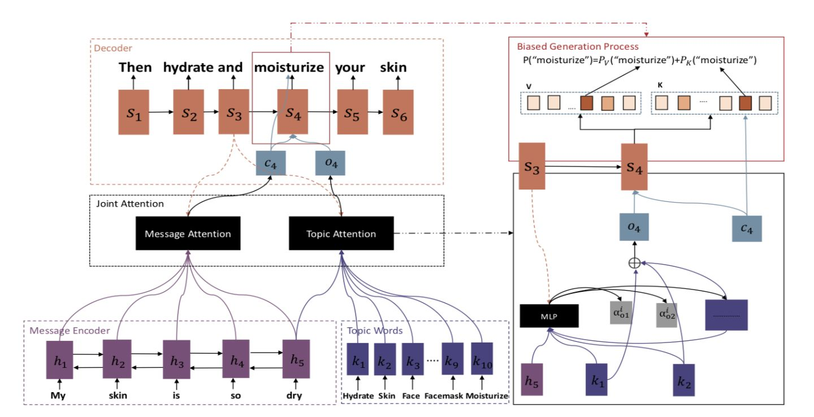

下图的模型提出了一种两阶段的训练方法，使用大规模数据对模型进行初始化，然后对模型进行微调，生成个性化响应。

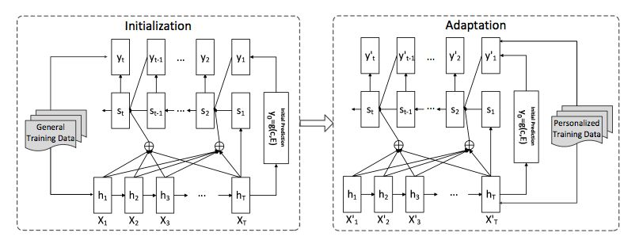

**1.5 外部知识库（Outside Knowledge Base）**

人类对话与对话系统之间的一个重要区别是它是否与现实相结合。结合外部知识库(KB)是一种很有前途的方法，可以弥补背景知识之间的差距，即对话系统和人之间的差距。记忆网络（Memory Network）是一种以知识库处理问题的经典方法。因此，它非常直接的别用于在对话生成中。实际研究表明，所提出的模型能够通过参考知识库中的事实来生成对问题的自然和正确答案。

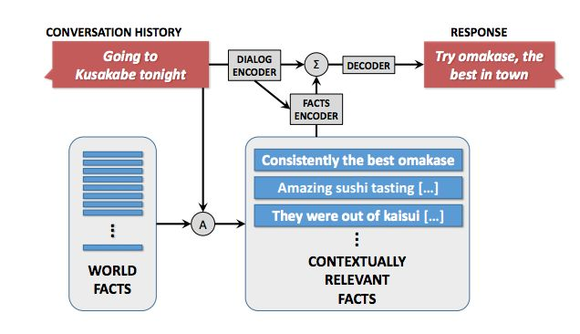

上图是作者提出的完全数据驱动的带有知识的对话模型。其中的 World Facts是一个集合，收集一些经过权威认证过的句子或者不准确的句子，作为知识库。当个定一个输入S和历史，需要在 Fact 集合里面检索相关的facts，这里采用的IR引擎进行检索，然后经过 Fact Encoder 进行 fact injection。上图的模型提出了一种全新的、完全由数据驱动的、基于知识的神经对话模型，目的是在没有槽位的情况下产生更多的内容。作者归纳了广泛使用的SEQ2SEQ方法，通过对会话历史和外部“事实”的响应

**1.6 评价**

评价生成回复的质量是对话系统的一个重要方面。任务导向型的对话系统可以基于人工生成的监督信号进行评估，例如任务完成测试或用户满意度评分等，然而，由于高回复的多样性，自动评估非任务导向的对话系统所产生的响应的质量仍然是一个悬而未决的问题。目前的方法有以下几种：

1）计算 BLEU 值，也就是直接计算 word overlap、ground truth和你生成的回复。由于一句话可能存在多种回复，因此从某些方面来看，BLEU 可能不太适用于对话评测。

2）计算 embedding的距离，这类方法分三种情况：直接相加求平均、先取绝对值再求平均和贪婪匹配。

3）衡量多样性，主要取决于 distinct-ngram 的数量和 entropy 值的大小。

4）进行图灵测试，用 retrieval 的 discriminator 来评价回复生成。

**2. 基于检索的方法（Retrieval-based Methods）**

基于检索的方法从候选回复中选择回复。检索方法的关键是消息-回复匹配，匹配算法必须克服消息和回复之间的语义鸿沟。

**2.1 单轮回复匹配**

检索聊天机器人的早期研究主要集中在反应选择单轮的谈话,只有消息用于选择一个合适的回复。

目前比较新的方法如下图，利用深度卷积神经网络体系结构改进模型，学习消息和响应的表示，或直接学习两个句子的相互作用表示，然后用多层感知器来计算匹配的分数。

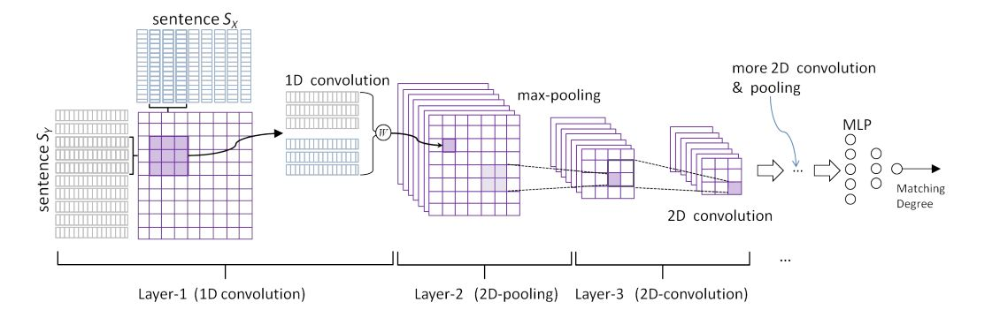

**2.2 多轮回复匹配**

近年来，基于检索的多轮会话越来越受到人们的关注，在多轮回答选择中，将当前的消息和先前的话语作为输入。模型选择一个自然的、与整个上下文相关的响应。重要的是要在之前的话语中找出重要的信息，并恰当地模仿话语的关系，以确保谈话的连贯性。

多轮对话的难点在于不仅要考虑当前的问题，也要考虑前几轮的对话情景。多轮对话的难点主要有两点：1.如何明确上下文的关键信息（关键词，关键短语或关键句）；2.在上下文中如何模拟多轮对话间的关系。

现有检索模型的缺陷：在上下文中容易丢失重要信息，因为它们首先将整个上下文表示为向量，然后将该上下文向量与响应sentence向量进行匹配。

下图的方法通过RNN/LSTM的结构将上下文(所有之前的话语和当前消息的连接)和候选响应分别编码到上下文向量和回复向量中，然后根据这两个向量计算出匹配度分数。

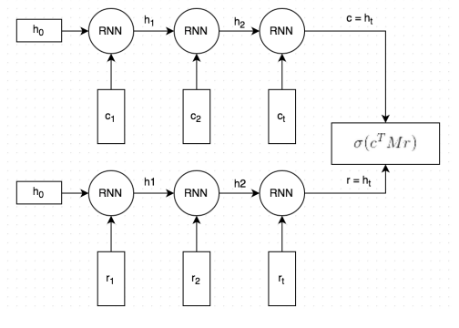

目前关于检索模型的闲聊还停留在单轮对话中，下面这篇论文提出了基于检索的多轮对话闲聊。论文提出了一个基于检索的多轮闲聊架构，进一步改进了话语关系和上下文信息的利用，通过将上下文中的语句与卷积神经网络的不同层级进行匹配，然后通过一个递归的神经网络在时间序列中堆积这些向量，以建立对话之间的关系。

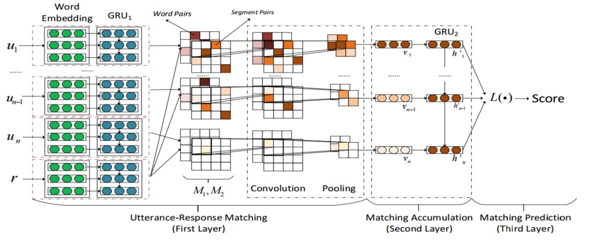

**3. 混合的方法（Hybrid Methods）**
将生成和检索方法结合起来能对系统性能起到显著的提升作用。基于检索的系统通常给出精确但是较为生硬的答案，而基于生成的系统则倾向于给出流畅但却是毫无意义的回答。在集成模型中，被抽取的候选对象和原始消息一起被输入到基于RNN的回复生成器中。这种方法结合了检索和生成模型的优点，这在性能上具备很大的优势。

## 未来的发展

深度学习已成为对话系统的一项基本技术。研究人员将神经网络应用于传统任务导向型对话系统的不同组成部分，包括自然语言理解、自然语言生成、对话状态跟踪。近年来，端到端的框架不仅在非面向任务的聊天对话系统中流行，而且在面向任务的对话系统中逐步流行起来。深度学习能够利用大量的数据，从而模糊了任务导向型对话系统和非任务导向型对话系统之间的界限。值得注意的是，目前的端到端模型仍然远非完美。尽管取得了上述成就，但这些问题仍然具有挑战性。接下来，我们将讨论一些可能的研究方向。

1. 快速适应。虽然端到端模型越来越引起研究者的重视，我们仍然需要在实际工程中依靠传统的管道（pipeline）方法，特别是在一些新的领域，特定领域对话数据的收集和对话系统的构建是比较困难的。未来的趋势是对话模型有能力从与人的交互中主动去学习。
2. 深度理解。现阶段基于神经网络的对话系统极大地依赖于大量标注好的数据，结构化的知识库以及对话语料数据。在某种意义上产生的回复仍然缺乏多样性，有时并没有太多的意义，因此对话系统必须能够更加有效地深度理解语言和真实世界。
3. 隐私保护。目前广泛应用的对话系统服务于越来越多的人。很有必要注意到的事实是我们使用的是同一个对话助手。通过互动、理解和推理的学习能力，对话助手可以无意中隐蔽地存储一些较为敏感的信息。因此，在构建更好的对话机制时，保护用户的隐私是非常重要的。