# 意图识别各种模型比较

语言理解模块主要包括意图与槽位的识别。意图的识别实际上是一个分类问题，如基于规则，传统机器学习算法 (SVM)，基于深度学习算法（CNN, LSTM, RCNN, C-LSTM, FastText）等。意图在对话中还涉及转换，这里不在说明。Slot识别实际上是一种序列标记的任务，如基于规则 (Phoenix Parser)，基于传统机器学习算法 (DBN; SVM)，基于深度学习算法（LSTM, Bi-RNN, Bi-LSTM-CRF）。有些人可能不大区别slot与实体的区别，下面以BIO标注举个例子：

如”show flights from Boston to New York today“中对于实体来讲Boston与New York都是标注为city，而对于slot来说区分为出发城市与目的地城市，可以这样说槽位的种类相比与实体更加的多元化。

## **Joint Model (Intent+Slot)**

### 1. 第一篇文章主要利用双向的GRU+CRF作为意图与槽位的联合模型。

Zhang X, Wang H. A Joint Model of Intent Determination and Slot Filling for Spoken Language Understanding[C] IJCAI. 2016

模型如下：
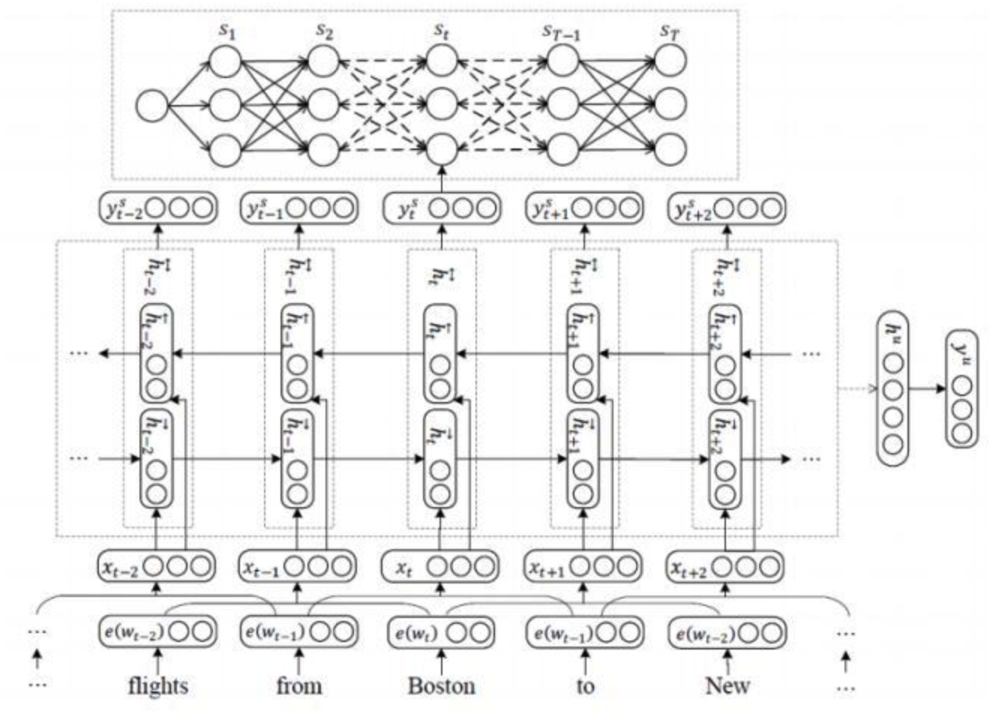

- 输入为窗口化的词向量：
  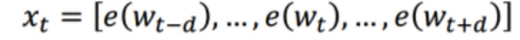
- 利用双向GRU模型学习到高维度特征。
- 意图与槽位

对于意图分类来说，利用每一个学习到的隐藏层特征，采用max pooling槽位得到全句的表达，再采用softmax进行意图的分类：

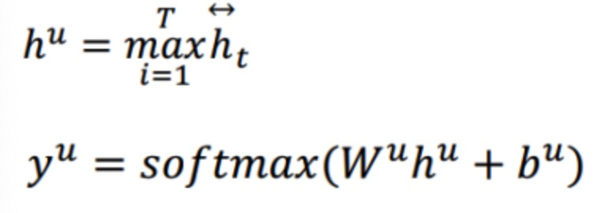

对于槽位来说，对每个隐藏层的输入用前向网络到各个标签的概率，并采用CRF对全局打分得到最优的序列。

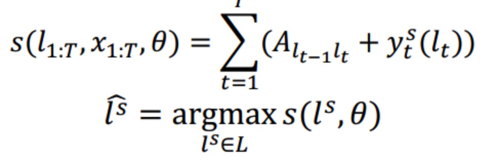

联合的损失函数为槽位与意图的极大似然

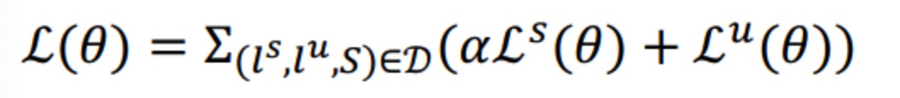

本文的模型简单而且槽位识别的准确率与意图识别的准确率都达到很高的水准，

本文的结果基于ATIS数据集：

Intent ：98.32 Slot (F1)：96.89

### 2. 第二篇主要采用利用语义分析树构造了路径特征对槽位与意图的识别的联合模型。（RecNN+Viterbi）

Guo D, Tur G, Yih W, et al. Joint semantic utterance classification and slot filling with recursive neural networks[C] 2014 IEEE. IEEE, 2014

先介绍下本文的basic Recursive NN的模型

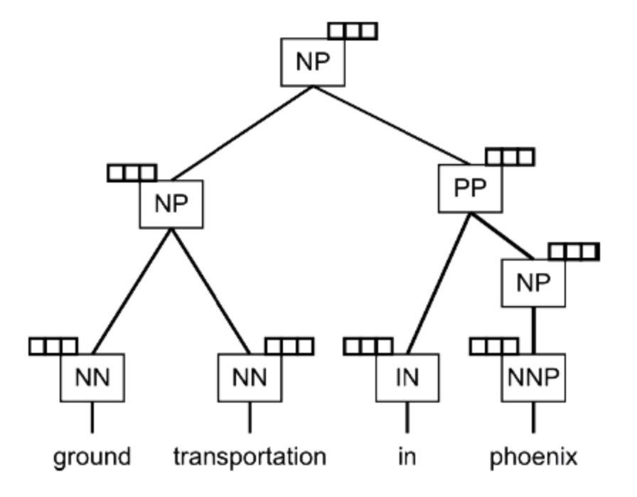

输入为单个词向量（后续优化输入为窗口的词向量），每个词性被看作为权重向量（weight vector ），这样每个词在其路径的运算为简单的词向量与词性权重向量的点积运算。如上图中的方块为词性的权重向量与输入向量的点积运算后的结果。当一个父节点有多个孩子分支的时候，可以看成每个分支与权重点积的和运算。

**意图识别模块**

意图识别，该文章中直接采用根节点的输出向量直接做一个分类。

**槽位识别**

这一模块引入了路径向量的特征

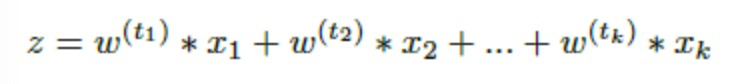

如”in“这个单词，在语义分析树中的路径为”IN-PP-NP“，将该路径的每个输出向量做一个加权运算得到path的特征，本文采用了三个词的path特征的concat作为tri-path特征进行槽位的分类，从而进行对”in“的一个预测。

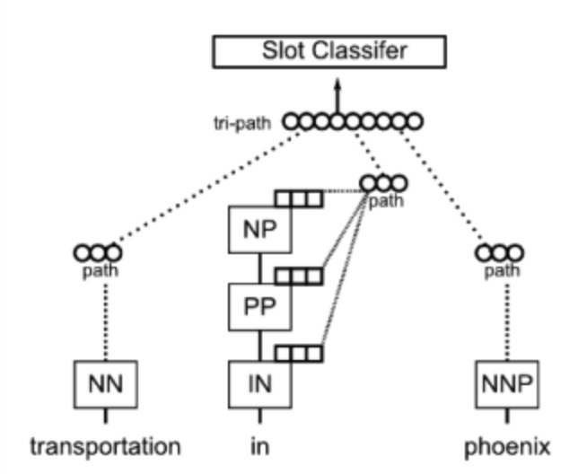

**优化**

文章中还在baseline的基础上做了一些优化：

优化输入为窗口的词向量

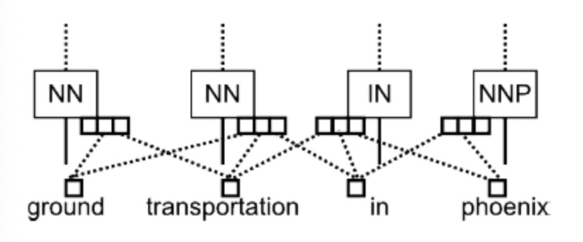

节点用与先前简单加权不同的网络，采用了非线性的激活函数

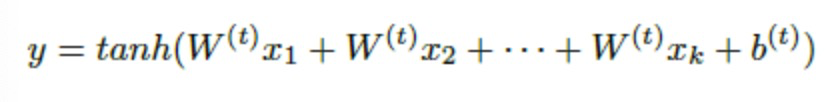

采用基于Viterbi的CRF优化全局，及采用了基于tri-gram的语言模型极大化标注序列

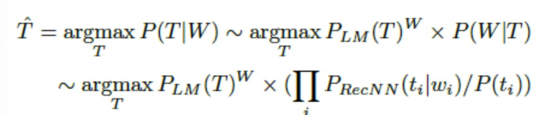

本文的结果基于ATIS数据集：

Intent ：95.40 Slot (F1)：93.96

### 3. 第三篇主要是基于CNN+Tri-CRF的模型

Xu P, Sarikaya R. Convolutional neural network based triangular crf for joint intent detection and slot filling 2013 IEEE Workshop on. IEEE, 2013

看一下篇CNN+TriCRF模型，模型框架如下：

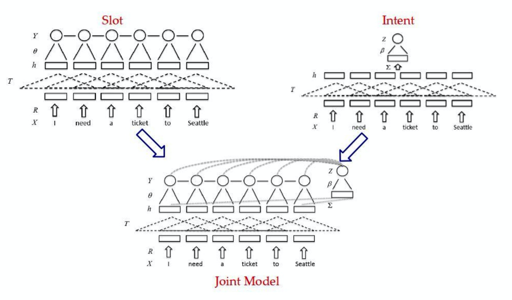

**对于槽位识别的模型**

输入的为每个的词向量，经过一个卷积层得到高维特征h，随后经过Tri-CRF作为整体的打分。Tri-CRF与线性的CRF的区别是输入前用了一个前向网络得到每个标签的分类。我们来分析一下评分的公式：

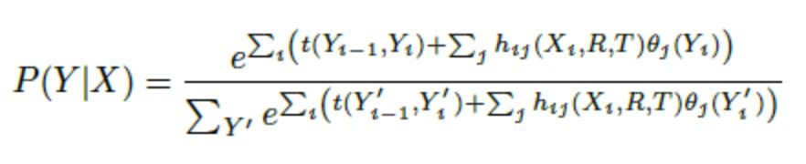

上述的t(Yi-1,Yi)为转移的打分，hij为CNN得到的高维特征，每个时刻的高维特征经过一个前向网络得到每个标签的概率，这样前两者的结合就是整体的打分。

**对于意图识别**

CNN采用同一套参数，得到每个隐藏层的高维特征h，直接采用max pooling得到整句的表达，用softmax得到意图分类。

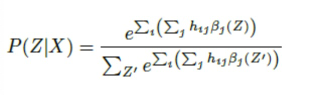

将上述结合起来实际上就是联合模型。

本文的结果基于ATIS数据集：

Intent ：94.09 Slot (F1)：95.42

### 4. 第四篇的主要是基于attention-based RNN

Liu B, Lane I. Attention-based recurrent neural network models for joint intent detection and slot filling[J]. 2016.

首先介绍一下context vector的概念，参见Bahdanau D, Cho K, Bengio Y. Neural machine translation by jointly learning to align and translate[J]. 2014.

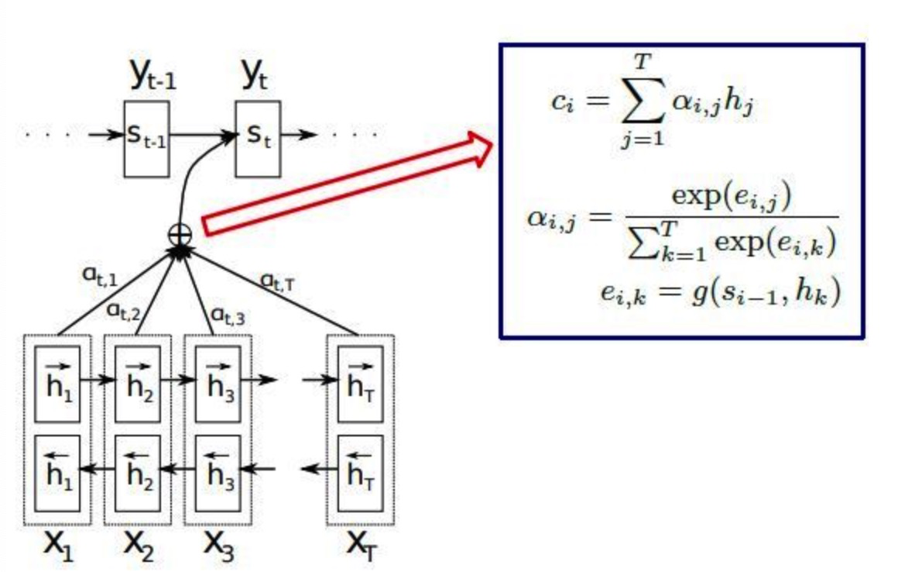

上述公式中的g实际上是一个前向的网络得到decoder每个隐藏层与输入序列中每个encoder隐藏层的相关，即attention分量，对encoder每时刻隐藏层的输出与当前时刻的attention的加权即得到文本向量（context vector）

进入正文，本文采用的encoder-decoder模型如下：

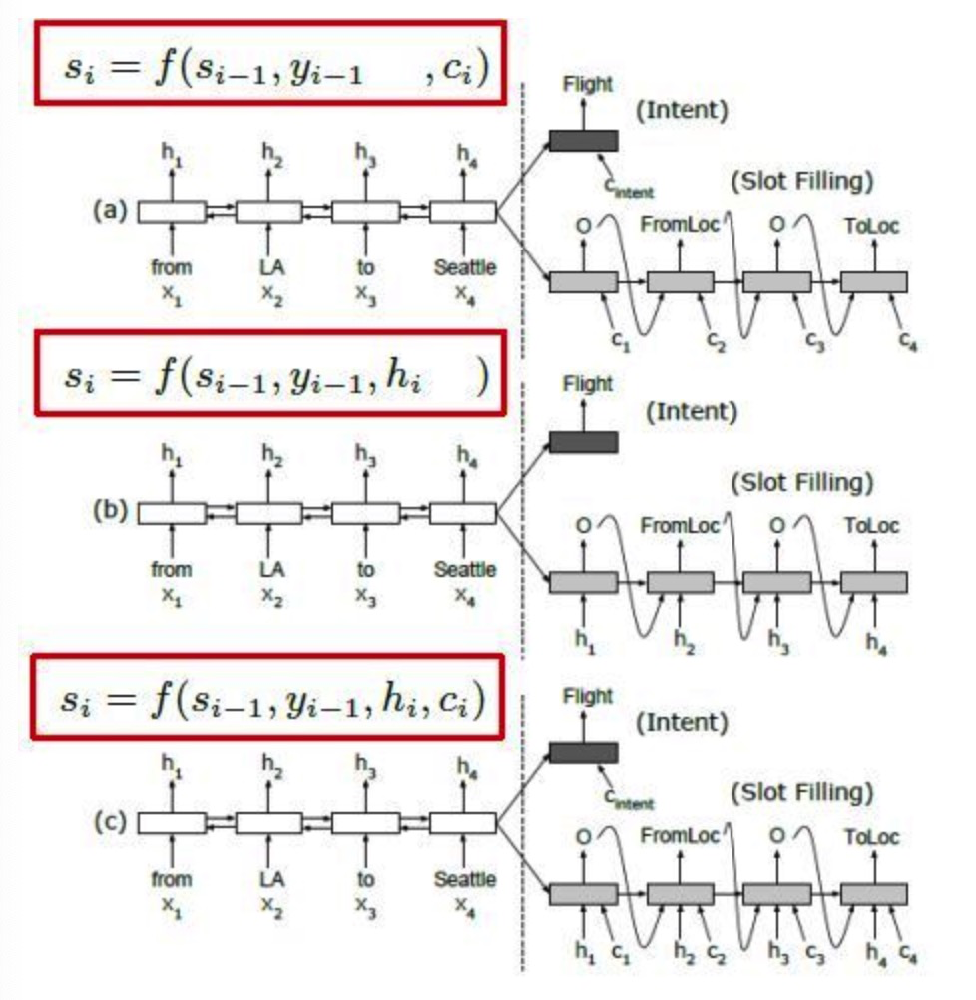

**槽位**

图a隐藏层非对齐attention的模型。decoder隐藏层非对齐的方式，decoder端的每个cell的输入为上一时刻隐藏层s，上一时刻标签的概率s与文本向量c的输入。

图b为隐藏层对齐无attention的模型，decoder端的每个cell的输入为上一时刻隐藏层s，上一时刻标签的概率s与对应的encoder的每个时刻隐藏层的输出。

图c隐藏层对齐attention的模型。decoder端的每个cell的输入为上一时刻隐藏层s，上一时刻标签的概率s，上一时刻标签的概率s与文本向量c的输入与对应的encoder的每个时刻隐藏层的输出。

**意图**

采用encoder的最后输出加入文本向量作为intent的分类。

该模型基于ATIS数据集（+aligned inputs）：

Intent ：94.14 Slot (F1)：95.62

本文还基于上述的idea得到另外一种基于attention RNN的联合模型

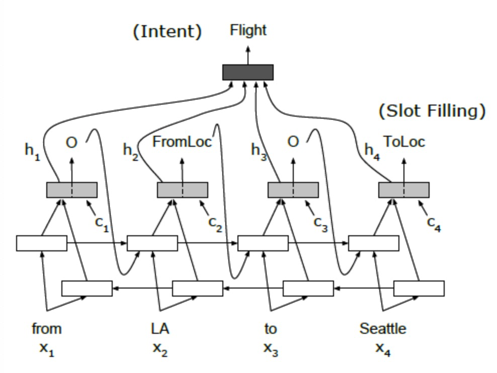

BiRNN 隐藏层的输入为

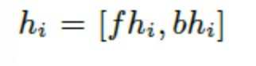

**槽位**

BiRNN得到的高维特征与文本向量concat起来作为单层decoderRNN的输入用于槽位识别，需要注意的是encoder的输出概率只作用于BiRNN的正向传输层。

**意图**

单层decoderRNN的隐藏层的输出的加权得到最后的输出向量，得到最后的意图分类

该模型基于ATIS数据集（+aligned inputs）：

Intent ：94.40 Slot (F1)：95.78

### 5. 第五篇主要是在线意图与槽位，语言的联合模型（Online-RNN-LU）。上述四种联合模型之所以不是在线处理，主要一点是都是以整个句子为单位做解析，不能做到实时的解析。本文的亮点就是实时解析，对输入到当前为止的时刻T得到最优意图与槽位的解析以及一个词语的预测。

Liu B, Lane I. Joint online spoken language understanding and language modeling with recurrent neural networks[J]. 2016.

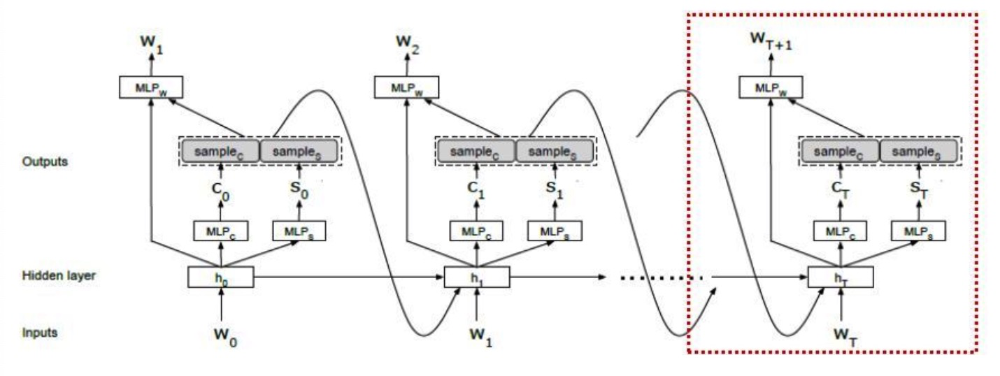

上图表示当前到时刻T的一个解析：

**意图**

w为T时刻前（包括T）的词语序列，c为T时刻前的意图，s为T时刻前的槽位序列，根据上述三者作为当前时刻T的RNN的输入，RNN隐藏层的输出，通过不同的MLP层分别作为当前时刻T意图与槽位的分类，同时该隐藏层的输出concat意图与槽位的信息输入MLP层得到下一个词的预测。

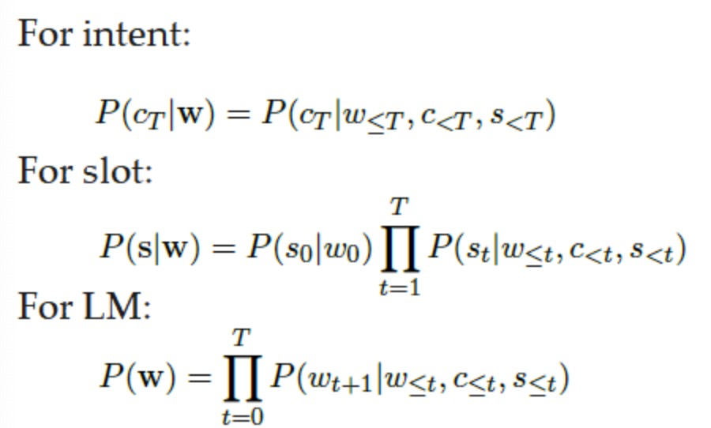

实际如下操作，采用LSTM，输入为上一时刻的词语序列，意图与槽位信息。其中公式中的IntentDist，SlotLabelDist，WordDist为MLP层。

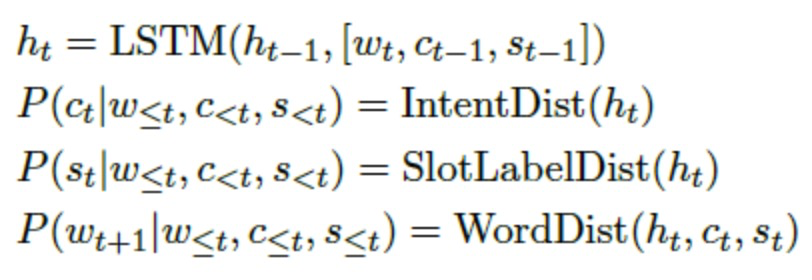

训练的方法即上述三个模块的极大似然

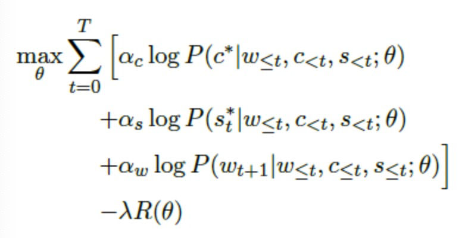

值的注意的是本文由于在线的算法，采用了greedy的思想，基于先前的意图与槽位达到当前的最优。

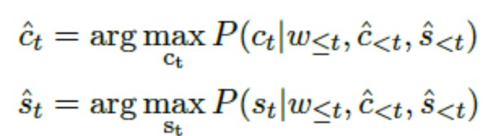

## 上述几种模型在ATIS上的评分

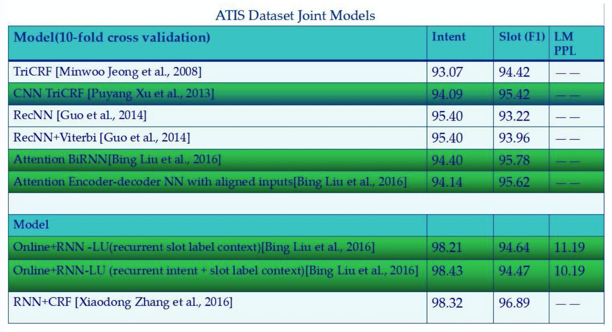

# 4.总结

上述的模型主要以深度学习的方法解决了传统任务算法框架中较为重要的意图与槽位的识别，这些模型都能应用到实际中一个相关的任务型领域（本人使用过LSTM+CRF的方法实现项目中汇率的槽位提取）。如何使用对话管理模块结合该语言理解模块解决多轮对话的问题一直是一个较为头疼的难题，尽管在传统算法框架上提出了一些例如传统模型或者强化学习的方法，但数据的规范性，对话过程不流畅，死板等严重影响用户在任务型对话的体验。最近较为热闹的Task-Oriented 主要是基于sequence-to-sequence的模型结合知识库，产生了一些意想不到的惊喜，下一篇主要介绍这类模型。

**Reference：**
[1] Zhang X, Wang H. A Joint Model of Intent Determination and Slot Filling for Spoken Language Understanding[C] IJCAI. 2016
[2] Guo D, Tur G, Yih W, et al. Joint semantic utterance classification and slot filling with recursive neural networks[C] 2014 IEEE. IEEE, 2014
[3] Xu P, Sarikaya R. Convolutional neural network based triangular crf for joint intent detection and slot filling 2013 IEEE Workshop on. IEEE, 2013
[4] Liu B, Lane I. Attention-based recurrent neural network models for joint intent detection and slot filling[J]. 2016.
[5] Bahdanau D, Cho K, Bengio Y. Neural machine translation by jointly learning to align and translate[J]. 2014.
[6] Liu B, Lane I. Joint online spoken language understanding and language modeling with recurrent neural networks[J]. 2016.