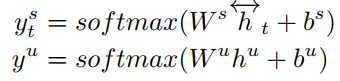

# [任务型对话（一）—— NLU/SLU（意图识别和槽值填充）]

**1，概述**

　　任务型对话系统越来越多的被应用到实际的场景中，例如siri，阿里小密这类的产品。通常任务型对话系统都是基于pipline的方式实现的，具体的流程图如下：

　　　　

　　整个pipline由五个模块组成：语音识别；自然语言理解；对话管理；自然语言生成；语音合成。现在越来越多的产品还融入了知识库，主要是在对话管理模块引入。在这里除了语音识别和语音合成模块不属于自然语言处理范畴且属于可选项之外，其他的三个模块都是必要的。

　　自然语言理解（NLU）：主要作用是对用户输入的句子或者语音识别的结果进行处理，提取用户的对话意图以及用户所传递的信息。

　　对话管理（DM）：对话管理分为两个子模块，对话状态追踪（DST）和对话策略学习（DPL），其主要作用是根据NLU的结果来更新系统的状态，并生成相应的系统动作。

　　自然语言生成（NLG）：将DM输出的系统动作文本化，用文本的形式将系统的动作表达出来。

　　我们接下来将会详细讨论这四个模块（NLU，DST，DPL，NLG）。

**2 意图识别和槽值填充**

　　举一个简单的例子，以一个询问天气的任务型对话为例，根据专家知识，我们会预先定义该任务的意图和相应的槽，这句话该怎么理解呢？

　　比如用户输入：“今天深圳的天气怎么样？”，此时用户所表达的是查询天气，在这里我们可以认为查询天气就是一种意图，那具体查询哪里的天气，哪一天的天气？在这里用户也传递出了这些信息，（地点=深圳，日期=今天），而在这里地点和日期就是信息槽。

　　在一个任务型对话系统中会含有多种意图和槽值，对于意图识别来说本质上就是一个文本分类的任务，而对于槽值填充来说本质上是一个序列标注的任务（采用BIO的形式来标注）。

　　还是以“今天深圳的天气怎么样？”为例，在意图识别时用文本分类的方法将其分类到“询问天气”这个意图，而在做槽值填充时采用序列标注的方法可以将其标注为：

　　　　今      天     深        圳        的 天 气 怎 么 样

　　　　B_DATE I_DATA B_LOCATION I_LOCATION O O O O O O

　　除了上述两个主要的内容，NLU中还会涉及到领域识别，语义消歧等。

**3 相关技术方案**

　　关于意图识别和槽值填充既可以作为两个单独的任务处理，也可以联合处理。由于两个任务之间的存在较大的相关性（意图和槽值之间有相关性），因此联合建模的效果一般会更好。接下来我们将介绍一些相关的论文：

　　**论文一：A Joint Model of Intent Determination and Slot Filling for Spoken Language Understanding** 

　　先上论文的模型结构图，具体如下：

　　　　

　　**1）模型结构**

　　　　给定一个用户输入的句子𝑆=𝑤1,𝑤2,...,𝑤𝑇S=w1,w2,...,wT，在这里𝑤𝑖wi表示句子中第𝑖i个词，而𝑇T表示句子的长度。每个词使用词向量表示为𝑒(𝑤𝑖)e(wi)，作者在这提出之前有相关工作表明使用上下文输入的方式可以提高槽值填充的表现，在这里也引入了这种做法，具体的如下，将𝑡t时刻的输入由𝑤𝑡wt转换成𝑥𝑡xt，𝑥𝑡xt的表达式如下所示：

　　　　

　　　　在上面式子中𝑑d表示窗口的大小，除此之外，作者还认为引入命名实体对槽值填充的结果也会有提升，因此对𝑥𝑡xt进一步升级，其表达式如下：

　　　　

　　　　上面式子中𝑒′(𝑛𝑡)e′(nt)表示𝑡t时刻下的词对应的命名实体的向量嵌入，𝑐c表示命名实体的窗口大小，个人觉得这种做法在实际项目中并不实用，虽说作者证明了在ATIS数据集（一个航班查询的对话集，主要用于意图识别和槽值填充的实验中）上确实有提升，但现实中可能命名实体的准确率就很难有保障，这种情况会不会反而导致槽值填充的结果下降呢？

　　　　输入定义好了之后，再来看看网络结构，文中的网络结构是用了Bi-GRU，对前向后向的输出采用拼接的方式。因此输入𝑥𝑡xt，对应隐层的输出ℎ𝑡ht的表达式如下：

　　　　

　　　　在两个子任务的输出如下：

　　　　　　

　　　　上面式子中，𝑦𝑠𝑡yts 表示槽值填充的输出，𝑦𝑢yu表示意图识别的输出，其中ℎ𝑢hu是对隐层输出最大池化的结果。其表达式如下：

　　　　

　　**2）定义损失**

　　　　采用两个子任务的损失来建立统一的联合损失，首先来看下意图识别的损失表达式：

　　　　

　　　　意图识别是一个多分类问题，采用交叉熵作为损失函数，在这里𝑙𝑢lu表示句子的真实意图。

　　　　槽值填充的损失定义的比较复杂，在这里引入了一个矩阵𝐴A来表示各槽值之间的概率转换情况，这个矩阵是可以被训练的。作者给出了一个衡量每条序列的分数表达式，具体如下：

　　　　

　　　　在上面式子中，𝐴𝑙𝑡−1𝑙𝑡Alt−1lt表示从𝑙𝑡−1lt−1转移到𝑙𝑡lt的概率，因为𝑙𝑡lt是未知的，因此这里应该是一个长度为𝑇T的概率分布，这个其实类似于RNN的原理，从ℎ𝑡−1ht−1到ℎ𝑡ht的做法。𝑦𝑠𝑡(𝑙𝑡)yts(lt)是在𝑡t时刻softmax的结果，也是一个长度为𝐿L的概率分布向量。**但是对于所有时间步的输出直接相加，这一操作完全没看懂，这里讲道理是不是也应该对𝐴𝑙𝑡−1𝑙𝑡+𝑦𝑠𝑡(𝑙𝑡)Alt−1lt+yts(lt)求交叉熵再相加呢？**

　　　　定义完上面的表达式之后，槽值填充的损失函数为：

　　　　

　　　　其中：

　　　　

　　　　最终整个模型的损失函数如下：

　　　　

　　　　参数𝛼α是用来调节意图识别和槽值填充的损失的权重的。

 　**论文二：Attention-Based Recurrent Neural Network Models for Joint Intent Detection and Slot Filling** 

　　 这篇论文引入了encoder-decoder框架和attention机制来联合建模意图识别和槽值填充两个子问题，同样首先先来一张图：

　　　　

　　　　上面三幅图分别表示在decoder时不同的处理方式：

　　　　a) 没有线性输入，只有attention输入，线性输入这个怎么理解呢？在序列标注中是线性解码的，也就是说在𝑡t时刻decoder和𝑡t时刻encoder的相关性最大，其实抛开encoder-decoder框架就是序列标注的框架，如图a中解码时的输入只有𝑐𝑖ci（attention的结果），没有ℎ𝑖hi（encoder的隐层输出）。

　　　　b) 只有线性输入，没有attention输入。

　　　　c) 既有线性输入又有attention输入。

　　　　这篇论文整体上没有什么新奇的结构，都是我们熟悉的结构，因此不在对模型的结构展开讲。在这里引入的attention对槽值填充的结果并没有明显提升，这也证明了一点序列标注问题是个线性解码问题，attention这种机制并没什么用，但是在意图识别任务上引入attention还是有一些提升的。 

　　**论文三：A Bi-model based RNN Semantic Frame Parsing Model for Intent Detection and Slot Filling** 

　　**1）模型结构**

　　　　这篇论文还是比较有特点的，在这里的联合建模并没有对两个任务共享模型参数，而且训练时也不是把两个任务的损失合并成一个统一的损失来同步训练，而是采用了异步训练的方式。此外论文在普通框架和encoder-decoder框架上试验。这两种框架的性能差异不大，encoder-decoder会稍微高一点点。具体来看下模型结构，结构图如下：

　　　　

　　　　上图中a是采用了decoder解码，而b是没有采用decoder解码。

　　　　给定一个句子序列𝑥1,𝑥2,𝑥3,......,𝑥𝑛x1,x2,x3,......,xn，每个词都用词向量表示，给定两个Bi-LSTM模型，模型的隐层神经元个数相同。首先来看图a中的表达式。

　　　　**a ) with decoder**

　　　　意图识别表达式：

　　　　　　

　　　　上面式子中第一个式子有一个错误，式子中的𝑛−1n−1应该是𝑡−1t−1。第一个式子中𝑠1𝑡st1表示𝑡t时刻decoder的隐层输出，其中1表示意图识别。ℎ1𝑡−1ht−11表示意图识别encoder模型在𝑡−1t−1时刻的隐层输出，ℎ2𝑡−1ht−12表示槽值填充encoder模型在𝑡−1t−1时刻的隐层输出。第二个式子就是利用最后时刻的输出来分类。

　　　　槽值填充表达式：

　　　　　　

　　　　上面式子中各参数的含义和意图识别中的一样，但槽值填充每个时刻都会decoder一个结果。

　　　　**b) without decoder**

　　　　不含decoder的表达式相对来更简单，就不做过多的解释了，具体如下：

　　　　意图识别表达式：

　　　　　　

　　　　槽值填充表达式：

　　　　　　

　　**2）损失函数**

　　　　在这里采用异步训练的方式分别训练两个子任务，首先意图识别的损失函数如下：

　　　　　　

　　　　这里就是一个交叉熵损失函数。

　　　　槽值填充的损失函数：

　　　　　　

 　　　同样也是一个交叉熵损失函数。

　　　　具体的异步训练过程也很简单，给定一个batch数据集𝑋𝑖Xi，先将𝑋𝑖Xi和ℎ2h2（槽值填充的隐层输出）输入到意图识别模型中，通过𝐿1L1损失函数来训练意图识别模型，然后再将𝑋𝑖Xi和ℎ1h1输入到槽值填充模型中，通过𝐿2L2损失函数训练槽值填充模型。作者认为这种异步训练的方式可以减小两个任务之间共享模型的负作用，之引入了隐层的信息，且用两个损失函数来分别训练模型。

　　**论文四：A Model of Zero-Shot Learning of Spoken Language Understanding** 

　　在实际任务中，我们可能没这么多的对话数据，因此迁移学习在任务型对话系统中的研究也很多，不论是NLU还是DST，DPL中。

　　其实上面对意图识别和槽值填充两个子任务联合建模也是一种迁移学习，但本文提出了一种更极端的环境下的迁移学习——zero-shot。

　　zero-shot的定义是：利用标签在语义空间的相似性，利用已有的标注数据对在标注数据中不存在的类别进行分类。*
*

　　首先定义下论文中的输入输出，论文的输入是一个句子𝑆S，输出是一个用户的对话动作，可以表示为：

　　　　$ act type(attribute type = attribute value) $

 　举个例子𝑖𝑛𝑓𝑜𝑟𝑚(𝑓𝑜𝑜𝑑=𝑐ℎ𝑖𝑛𝑒𝑠𝑒)inform(food=chinese)，其实这个对话动作可以理解为意图和槽值的组合。像这样的对话动作在训练集中有限的，因此对于训练集来说可以看作是一个多类别分类的问题，但是随着在现实中可能存在很多的对话状态并不在训练集中，这样用传统的方法就无法很好的泛化到实际的环境中，例如对于food这个槽，其对应的值有很多个，而训练集只能覆盖一部分。要解决该问题就需要用到zero-shot方法。

　　**1）模型结构**

　　　　首先给出模型结构图：

　　　　　　

　　　　首先对模型的输入和标签分别编码用向量表示：

　　　　输入编码：

　　　　　　

 

 　　　上面式子中𝜙(𝑈𝑖)ϕ(Ui)表示句子中第𝑖i个位置的编码结果，𝑤𝑖wi表示当前词，𝑤𝑗wj表示前一个词，𝑤𝑘wk表示后一个词，而𝑤ℎwh表示通过依存分析得到的和𝑤𝑖wi相关的中心词。

　　　　标签编码：

　　　　　　

　　　　在标签编码时对act-type，attribute-type，attribute-value分别用词向量表示，然后利用上面的式子将三者融合在一起作为标签的编码结果。

　　**2）损失函数**

　　　　在这里将多分类问题转换成对每个标签的二分类问题，其损失函数如下：

　　　　　　

　　　　这个损失函数是不是很熟悉，像极了SVM，在上面的模型结构图中也表明了这一点，在对每个标签做二分类时不仅要分开还要间隔最大化。在上面的式子中𝑦=1,−1y=1,−1如果时正类则为1，负类则为-1。我们再来看看这个式子：

　　　　　　

　　　　实际上就是计算句子和标签的相似度。因此问题的本质上类似于训练一个计算相似度的模型，之后在预测时根据句子和标签的相似度来进行分类，这样就不需要训练集中包含该标签了。

　　除了这些论文之外，还有很多不错的论文都值得去读，尤其是在迁移学习这一块，感觉其应用价值很高，毕竟在工业界少样本是普遍存在的现象。