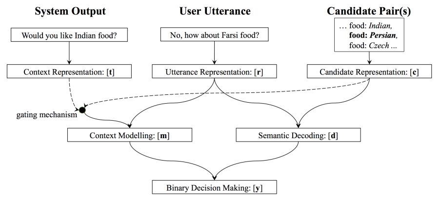

# [任务型对话（二）—— DST（对话状态追踪）]

1，概述

　　关于任务型对话的简介看[任务型对话（一）—— NLU（意识识别和槽值填充）](https://www.cnblogs.com/jiangxinyang/p/10789512.html)。

　　首先我们来看下对话状态和DST的定义。

　　对话状态：在𝑡t时刻，结合当前的对话历史和当前的用户输入来给出当前每个slot的取值的概率分布情况，作为DPL的输入，此时的对话状态表示为𝑆𝑡St。

　　DST（对话状态追踪）：就是根据所有对话历史信息推断当前对话状态𝑆𝑡St和用户目标。

　　由于在ASR和NLU这两个环节会存在误差，因此输入到DST中的内容是N-best列表（对于ASR，不是输入一条句子，而是N条句子，每条句子都带一个置信度。对于SLU，不是输入一条意图（槽值对），而是N个意图（槽值对），每个意图（槽值对）都带一个置信度）。所以DST往往也是输出各个状态的概率分布，这样的表示也方便在多轮对话中对状态进行修改。具体的情况如下图所示：

　　　　

**2，DST的常用方法**

　　DST的常用方法主要有三种：基于规则的方法，生成式模型，判别式模型，目前来看判别式模型的表现最好，也是当前研究的最多的方向。

　　1）基于规则的方法

　　基于规则的方法一般是用1-best的结果作为输入，而且输出的状态也是确定型，基于规则的方法需要大量的人工和专家知识，因此在较复杂的场景适用性不强。当然基于规则的方法也有它的优点，基于规则的方法不依赖于对话数据，因此在没有对话数据的情况下很适合冷启动。基于规则的方法用N-best的结果作为输入也有研究，但总的来说实现起来很复杂。

　　2）生成式模型

　　生成式模型主要是利用贝叶斯网络推断来学得整个状态的概率分布，其通用表达式如下：

　　　　

　　上面式子中𝑏(𝑠)b(s)代表上一时刻状态的概率分布，𝑏′(𝑠′)b′(s′)代表当前时刻的状态分布，𝑢′u′代表当前时刻的用户输入，𝑢̃ ′u~′代表当前用户输入的观测输出，𝑠′s′代表当前时刻的状态，𝑠s代表上一时刻的状态，𝑎a代表上一时刻的动作，𝜂η是一个常数。

　　可以看出上面的公式还是比较复杂的，因此实现起来也比较复杂，传统的生成式方法还要列出所有可能的状态，以及状态概率转移矩阵等。

　　3）判别式模型

　　判别模型用一个最简单的公式建模，可以表示成：

　　　　𝑏′(𝑠′)=𝑃(𝑠′|𝑓′)b′(s′)=P(s′|f′)

　　其中𝑏′(𝑠′)b′(s′)表示当前状态的概率分布，而𝑓′f′表示对ASR/NLU的输入的特征表示，早期的判别模型会利用SVM，最大熵模型，CRF等来建模。随着神经网络的兴起，DNN，RNN等模型也越来越多的占领了这个领域。

**3，DSTC数据集**

　　DSTC全称为Dialogu State Tracing Challenge（对话状态最终挑战）。在阅读接下来的论文的时候需要对这些数据集有所了解，以DSTC2为例，一个餐馆预定的数据集，数据集中提供了N-best ASR的结果，N-best SLU的结果。还提供了槽以及对应的值的信息。具体的可以去[这里](http://camdial.org/~mh521/dstc/)下载。

**4，判别式模型在DST上的相关工作**

　　接下来我们将按照，DNN，RNN，NBT，迁移学习等模型的顺序来介绍一些相关的论文。

　　**论文一：Deep Neural Network Approach for the Dialog State Tracking Challenge** 

　　在判别模型中是把DST当作一个分类问题，并且对ASR/NLU提取相关的特征作为模型的输入，这篇论文提出了一种特征工程来提取N-best NLU的一系列特征，然后用一个前向的DNN来作为分类器，具体的模型结构如下：

　　　　

　　接下来看下整个输入输出流程：

　　在𝑡t论对话中给定一个槽𝑠s，𝑆𝑡,𝑠St,s表示在这𝑡t论对话中每一轮NLU的N-best列表中关于槽𝑠s所对应的值𝑣v，为了应对未知的值，还额外给定了一个Unknow来表示未知的值，我们将这|𝑆𝑡,𝑠|+1|St,s|+1个值作为模型的输入，那么问题来了我们该怎么去提取这些槽值的特征呢？如上图所示，𝑓1,𝑓2,......,𝑓𝑀f1,f2,......,fM就是表示不同的特征，论文中给出了12中特征，为了保证阅读感（主要翻译的不到位），就直接截图了：

　　　　

　　但是论文的输入并不是对前𝑡t轮同样的方式处理，而是有区分的处理，从𝑡t往前数前𝑇T轮直接用上面12中特征来表示，但是对于𝑡−𝑇t−T轮之前的全部相加作为一个整体。那么问题来了，如果𝑡<𝑇t<T怎么办，对于𝑡−𝑇<0t−T<0的情况下，𝑓𝑖(𝑡′,𝑣)=0fi(t′,v)=0。

　　对一个slot的不同的值，模型的参数是共享的，而对于不同的slot之间参数是不共享的，也就是说每个slot都有一个属于它自己的分类器。

　　最后的输出结果如下：

　　　　

　　上面的式子其实类似于softmax，唯一不同的是对于不属于𝑠s的槽统一用一个参数𝐵B来处理，而对于属于槽𝑠s中的值𝑣v输出是𝐸(𝑡,𝑣)E(t,v)。

 

　　**论文二：Word-Based Dialog State Tracking** **with Recurrent Neural Networks** 

　　上面的论文是用NLU的结果作为输入，但从这篇文章开始的后几篇文章都直接用ASR（语音识别）的结果作为输入，那这样做的结果有什么好处呢？主要有两个优点：

　　1）NLU单独作为一个子模块的时候，也会产生误差，这样ASR+NLU的误差传递会导致在进入到DST的时候就已经存在较大误差了，因此合并NLU和DST可以减少这种误差传递的影响。

　　2）在对任务型对话系统做评测时，无法判断真个系统产生的错误时来源于哪个子模块的，也就无法有效的定位错误的来源，因此减少子模块可以提高错误定位的准确率。

　　这篇论文时基于词级的对话状态追踪，因为它的输入时N-best ASR的结果，使用RNN模型来序列建模，采用n-grams来提取ASR的特征。同样本篇论文也是对每个slot单独建模，每个模型都是一个多分类器，类别的个数和该slot下对应的value的个数相等。

　　**1）特征表示**

　　首先来看下是如何利用n-grams来表征输入的，具体的见下图所示：

　　　　

　　模型的输入除了当前轮的ASR，还有上一轮的对话动作（对话动作表示为act-type (slot = value)），对这两者分别取1-gram，2-gram，3-gram。

　　从上图可以看出，主要包含𝑓，𝑓𝑠，𝑓𝑣f，fs，fv这三种特征，𝑓f是直接对ASR的结果和对话动作取n-grams的结果，𝑓𝑠fs和𝑓𝑣fv都是对𝑓f中的词进行𝑡𝑎𝑔tag（对slot用<slot>替换，对value用<value>）替换得到的模板泛化特征，其中𝑓𝑠fs是对槽提取的特征，适用于该槽下对应的所有的值，而𝑓𝑣fv对每个value都进行提取，属于每个值的特有特征，这样做有助于模型泛化。

　 然后𝑓，𝑓𝑠，𝑓𝑣f，fs，fv都是有ASR和对话动作两部分连接而成。ASR是N-best列表，分别提取分别取1-gram，2-gram，3-gram，然后对于重合的n-gram就按照置信度相加；对话动作也是同样，不过概率置1；具体可以参考上图，其实本质上就是对ASR和对话动作提取n-gram，进行各种组合，目的是通过这种低阶的多维组合，可以在高层重构出各种特征组合的可能性，来模拟甚至超越人工提取的各种特征。那么每个n-gram怎么用向量表示的呢，我猜应该是类似于one-hot，以𝑓f为例，将整个训练集提取相应的n-grams，然后将𝑓f组成一个大的n-gram词汇表𝑀M，先初始化一个长度为|𝑀||M|的0向量，然后对于当前的输入提去n-gram，再用相应的n-gram的分数去填充那个0向量（以上一段个人猜测，主要是论文中没有提到，不过论文中提到了𝑓f的维度是高维，达到3500，再加上在计算的过程中一系列的向量拼接操作，所以这也符合这种情况）。

　　**2）模型结构**

　　输入的表征确定好之后就要看看模型的结构了，模型的结构如下图所示：

　　　　

　　上图中的𝑚m是一个记忆向量，𝑝p是某个slot下对应的value的概率分布，用一个ℎh向量来表示特征𝑓f的低维表示𝑓,𝑝,𝑚f,p,m中的操作符是拼接的意思。

　　　　

　　然后为了利用𝑓𝑠,𝑓𝑣fs,fv的特征，提出了下面的表达式：

　　　　

　　𝑔g向量保证了模型的泛化性能，更新𝑚,𝑝m,p。

　　　　

　　　　

 

　　**论文三：****Neural Belief Tracker: Data-Driven Dialogue State Tracking**

　　这篇论文提出了NBT这个模型，本论文也是合并了NLU和DST，直接用ASR的结果作为输入，并且引入了词向量来进行表征，整体上理解较上面两篇论文要简单。

　　话不多说，先上一张模型结构图：

　　　　

　　上图中的最上一层是输入，可以看到总共有三个输入，分别是当前用户的输入𝑟r，当前的槽值对候选集𝑐c，上一时刻系统的对话动作𝑡t。首先我们来看下用户的输入怎么表征：

　　**1）用户的输入表征**

　　本文对用户的输入𝑟r分别提出了两种表征方法：NBT-DNN，NBT-CNN。

　　**NBT-DNN的结构图如下：**

　　　　

　　具体的表达式如下：

　　　　

　　上面式子中𝑢𝑖ui表示句子中第𝑖i个词的词向量，𝑉𝑛𝑖Vin表示从第𝑖i个位置开始取的n个词的向量拼接的结果。其实就是n-gram的方式取词。

　　　　

　　　　

　　　　

　　这里取了1-gram，2-gram，3-gram的结果，最后相加得到用户输入的向量表示𝑟r。

　　**NBT-CNN的模型结构图：**

　　　　

　　其表达式如下：

　　　　

　　其实这里用卷积替代了n-gram，上面式子中的𝑛n表示卷积核的大小，𝑛=1,2,3n=1,2,3，然后用最大赤化获得最终的向量表示：

　　　　

　　　　

　　这样就得到了最终的用户输入的向量表示。

　　**2）语义解码**

　　从第一幅图可以看到，用户的输入𝑟r和候选的槽值对是有相互作用的，这个相互作用该怎么表示呢？

　　　　

　　上面𝑐𝑠cs是槽𝑠s的词向量，𝑐𝑣cv是对应的值的词向量，𝑟r 和𝑐c之间是element-wise相乘的。

　　**3）上下文建模**

　　也是第一幅图中描述的，用户的输入𝑟r和系统对话动作𝑡t之间的关系。

　　作者在这里定义了两种系统的动作：一是系统请求用户告知某个槽的值，如“what proce range would you like”，这种请款系统会提到一个槽的信息，用𝑡𝑞tq表示；二是系统向用户确认槽值对是否正确，如“how about Turkish food ”，在这种请款下用户会提到一对槽值的信息，其中槽用𝑡𝑠ts表示，值用𝑡𝑣tv表示。

　　　　

　　在上面如(𝑐𝑠.𝑡𝑞)(cs.tq)是计算点积得到一个相似度可以作为门控机制用来控制对𝑟r的选择，这种做法在系统问“how about Turkish food”，用户回答“yes”的时候特别有用，因为此时用户并没有传递任何槽值的信息进来。这样就可以利用上一个系统对话动作的信息。

　　因为候选槽值对每次只选一个，因此最后做一个二分类的决策：

　　　　

　　其中𝜙𝑑𝑖𝑚=𝜎(𝑊𝑥+𝑏)ϕdim=σ(Wx+b)， 𝑑𝑖𝑚dim表示输出的维度。

　　**4）信念状态更新机制**

　　上面只是对某个槽值对做了二分类，那该怎么更新整个状态概率呢？本文定义了一个基于规则的信念状态更新机制。

　　在𝑡t轮对话时，用ℎ𝑡ht表示ASR的N-best集合，ℎ𝑛𝑖hin表示第𝑖i条句子，𝑝𝑛𝑖pin表示第𝑖i个句子的置信度，𝑠𝑦𝑠𝑡−1syst−1表示系统在上一时刻的动作。则对于槽𝑠s更新其所有的值的概率分布：

　　　　

　　结合之前所有的对话历史，可以表示为：

　　　　

　　之后取概率大于0.5的槽值对出来更新当前的状态值，没有的话就依然保留上一时刻的值。这句话怎么理解呢？也就是下面的式子成立了才执行上面的式子，否则就不对上一时刻的信念状态做修改。

　　　　

 

　　**论文：Fully Statistical Neural Belief Tracking**

　　这篇论文是在上一篇论文的基础上做了改进的，在上篇论文中提出了一个基于规则的信念状态更新机制，对于这种基于规则定义的机制迁移到新的任务时需要大量的修改，因此本文提出了新的信念状态更新机制。

　　同样先上模型结构图：

　　　　

　　首先定义一下问题：在一个给定的𝑠∈𝑉𝑠s∈Vs，让𝑏𝑡−1𝑠bst−1 表示𝑡−1t−1时刻的信念状态（一个长度为|𝑉𝑠|+2|Vs|+2的向量，这里的2是指还包含两个值：None和“dont care”）。在上一篇文章中更新信念状态的机制如下：

　　　　

　　　　

　　作者认为这种机制并没有学到𝑏𝑡−1𝑠,𝑣bs,vt−1的内容，只是简答的相加而已，而且还要在𝑏𝑡𝑠,𝑣≥0.5bs,vt≥0.5的时候才执行更新。因此这种方法并不好。作者也就提出了两种新的方法：

　　**1）****One-Step Markovian Update**

　　其表达式如下，直接用softmax生成概率分布：

　　　　

　　上面式子中给出的两个矩阵的每一行都是对一个槽值对的操作。因此这种方式有一个问题，训练样本的稀疏性，每个对话中可能只包含一个槽值对，在训练的时候无法更新𝑊𝑐𝑢𝑟𝑟Wcurr和𝑊𝑝𝑎𝑠𝑡Wpast，因此作者提出了第二种方法。

　　**2）****Constrained Markovian Update**

　　在这里作者构造了一种不同的矩阵，其表达式如下：

　　　　

　　让对角线的元素相同，其余的元素相同，这样就可以起到训练的时候能更新到所有的参数。结果也表明这种方法的性能更好。

 

　　**论文：****INCREMENTAL LSTM-BASED DIALOG STATE TRACKER**

　　这篇文章提出了一个简单的方法，直接用LSTM来表示ASR的1-best的输入，然后对每个slot做多分类，整体来说效果也还行。

　　模型结构图如下：　　

　　　　

　　其表达式如下：

　　　　

　　上面式子中𝑎a为ASR的输出，𝑟r为对应的置信度。利用一个网络来进行表征，然后倒入到LSTM中，并softmax多分类。

　　　　

　　　　

　　最终在DSTC2上的结果对比：

　　　　

　　在做了一些小处理之后的结果还行，不过这篇文章是15年的，但是实现起来简单。