# 2019->2020必看的十篇「深度学习领域综述」论文

> **1、A guide to deep learning in healthcare（医疗深度学习技术指南）**

**Google 斯坦福 Nature Medicine**

**作者**：Andre Esteva, Alexandre Robicquet, Bharath Ramsundar, Volodymyr Kuleshov, Mark DePristo, Katherine Chou, Claire Cui, Greg Corrado, Sebastian Thrun & Jeff Dean

**摘要**：我们介绍了医疗保健的**深度学习技术**，重点讨论了**计算机视觉、自然语言处理、强化学习和广义方法的深度学习**。我们将描述这些计算技术如何影响医学的几个关键领域，并探讨如何构建端到端系统。我们对计算机视觉的讨论主要集中在医学成像上，我们描述了自然语言处理在电子健康记录数据等领域的应用。同样，在**机器人辅助手术的背景下讨论了强化学习，并综述了基因组学的广义深度学习方法**。

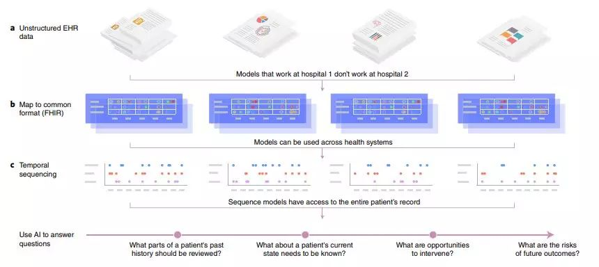

**网址**：

[https://www.nature.com/articles/s41591-018-0316-z](https://link.zhihu.com/?target=https%3A//www.nature.com/articles/s41591-018-0316-z)

> **2、Multimodal Machine Learning: A Survey and Taxonomy（多模态机器学习）**

**CMU TPAMI**

**作者**：Tadas Baltrušaitis,Chaitanya Ahuja,Louis-Philippe Morency

**摘要**：**我们对世界的体验是多模态的** - 我们看到物体，听到声音，感觉质地，闻到异味和味道。情态是指某种事物发生或经历的方式，并且当研究问题包括多种这样的形式时，研究问题被描述为多模式。为了使人工智能在理解我们周围的世界方面取得进展，它需要能够将这种多模态信号一起解释。**多模态机器学习旨在构建可以处理和关联来自多种模态的信息的模型**。这是一个充满活力的多学科领域，具有越来越重要的意义和非凡的潜力。本文不是关注特定的多模态应用，而是研究多模态机器学习本身的最新进展。**我们超越了典型的早期和晚期融合分类，并确定了多模式机器学习所面临的更广泛的挑战，即：表示，翻译，对齐，融合和共同学习**。这种新的分类法将使研究人员能够更好地了解该领域的状况，并确定未来研究的方向。

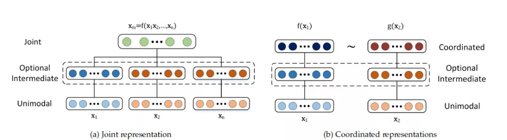

> **3、Few-shot Learning: A Survey（小样本学习）**

**香港科大 第四范式**

**作者**：Yaqing Wang,Quanming Yao

**摘要**：“机器会思考吗”和“机器能做人类做的事情吗”是推动人工智能发展的任务。尽管最近的人工智能在许多数据密集型应用中取得了成功，但它仍然缺乏从有限的数据示例学习和对新任务的快速泛化的能力。为了解决这个问题，我们必须求助于机器学习，它支持人工智能的科学研究。特别地，在这种情况下，**有一个机器学习问题称为小样本学习(Few-Shot Learning，FSL)。该方法利用先验知识，可以快速地推广到有限监督经验的新任务中，通过推广和类比，模拟人类从少数例子中获取知识的能力**。它被视为真正人工智能，是一种减少繁重的数据收集和计算成本高昂的培训的方法，也是罕见案例学习有效方式。随着FSL研究的广泛开展，**我们对其进行了全面的综述。我们首先给出了FSL的正式定义。然后指出了FSL的核心问题，将问题从“如何解决FSL”转变为“如何处理核心问题”**。因此，从FSL诞生到最近发表的作品都被归为一个统一的类别，并对不同类别的优缺点进行了深入的讨论。最后，我们从问题设置、技术、应用和理论等方面展望了FSL未来可能的发展方向，希望为初学者和有经验的研究者提供一些见解。

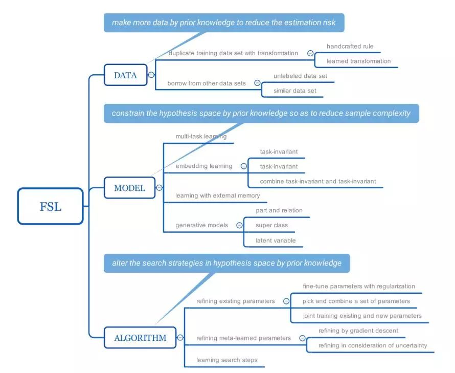

**网址**：[https://www.zhuanzhi.ai/paper/c7a2464c0865b9602a4103fb44659858](https://link.zhihu.com/?target=https%3A//www.zhuanzhi.ai/paper/c7a2464c0865b9602a4103fb44659858)

> **4、meta Learning: A Survey（元学习）**

**作者**：Joaquin Vanschoren

**摘要**：**元学习，或学习学习，是一门系统地观察不同机器学习方法如何在广泛的学习任务中执行的科学，然后从这种经验或元数据中学习，以比其他方法更快的速度学习新任务。**这不仅极大地加快和改进了机器学习管道或神经体系结构的设计，还允许我们用以数据驱动方式学习的新方法取代手工设计的算法。在本文中，我们将概述这一迷人且不断发展的领域的最新进展。

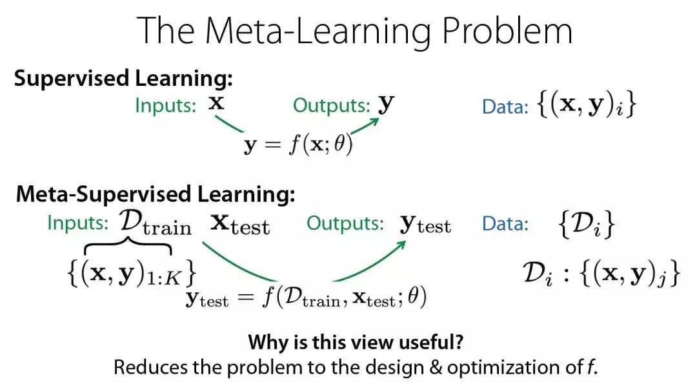

**网址**：[http://www.zhuanzhi.ai/paper/dd60eaffea966331e199fa531bae7044](https://link.zhihu.com/?target=http%3A//www.zhuanzhi.ai/paper/dd60eaffea966331e199fa531bae7044)

> **5、A Comprehensive Survey on Transfer Learning（迁移学习）**

**作者**：Fuzhen Zhuang, Zhiyuan Qi, Keyu Duan, Dongbo Xi, Yongchun Zhu, Hengshu Zhu, Senior Member, IEEE, Hui Xiong, Senior Member, IEEE, and Qing He

**摘要：迁移学习的目的是通过迁移包含在不同但相关的源域中的知识来提高目标学习者在目标域上的学习表现**。这样，可以减少对大量目标域数据的依赖，以构建目标学习者。由于其广泛的应用前景，迁移学习已经成为机器学习中一个热门和有前途的领域。虽然已经有一些关于迁移学习的有价值的和令人印象深刻的综述，但这些综述介绍的方法相对孤立，缺乏迁移学习的最新进展。随着迁移学习领域的迅速扩大，对相关研究进行全面的回顾既有必要也有挑战。**本文试图将已有的迁移学习研究进行梳理使其系统化，并对迁移学习的机制和策略进行全面的归纳和解读，帮助读者更好地了解当前的研究现状和思路。**与以往的文章不同，本文从数据和模型的角度对40多种具有代表性的迁移学习方法进行了综述。还简要介绍了迁移学习的应用。为了展示不同迁移学习模型的性能，我们使用了20种有代表性的迁移学习模型进行实验。这些模型是在三个不同的数据集上执行的，即Amazon Reviews，Reuters-21578和Office-31。**实验结果表明，在实际应用中选择合适的迁移学习模型是非常重要的。**。

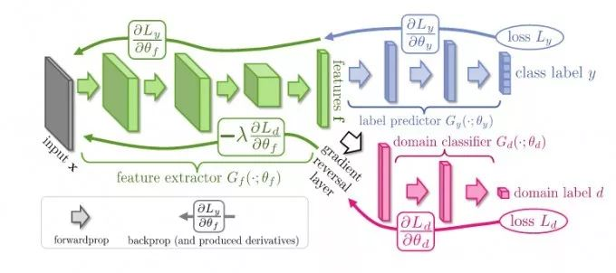

**网址**：[https://arxiv.org/abs/1911.02685https://www.zhuanzhi.ai/paper/021fc3dc3356e0089f0e845408cc3aa4](https://link.zhihu.com/?target=https%3A//arxiv.org/abs/1911.02685https%3A//www.zhuanzhi.ai/paper/021fc3dc3356e0089f0e845408cc3aa4)

> **6、Multimodal Intelligence: Representation Learning, Information Fusion, and Applications（多模态智能论文综述：表示学习，信息融合与应用）**

**京东**

**作者**：Chao Zhang,Zichao Yang,Xiaodong He,Li Deng**摘要：**自2010年以来，深度学习已经使语音识别、图像识别和自然语言处理发生了革命性的变化，每种方法在输入信号中都只涉及一种模态。然而，**人工智能的许多应用涉及到多种模态**。因此，研究跨多种模态的建模和学习的更困难和更复杂的问题具有广泛的意义。本文对**多模态智能的模型和学习方法进行了技术综述**。视觉与自然语言的结合已成为计算机视觉和自然语言处理研究的一个重要领域。本文从**学习多模态表示、多模态信号在不同层次上的融合以及多模态应用**三个新角度对多模态深度学习的最新研究成果进行了综合分析。在多模态表示学习中，我们回顾了嵌入的关键概念，将多模态信号统一到同一个向量空间中，从而实现了多模态信号的交叉处理。我们还回顾了许多类型的嵌入的性质，构造和学习的一般下游任务。在多模态融合方面，本文着重介绍了用于集成单模态信号表示的特殊结构。在应用方面，涵盖了当前文献中广泛关注的选定领域，包括**标题生成、文本到图像生成和可视化问题回答**。我们相信这项综述可促进未来多模态智能的研究。

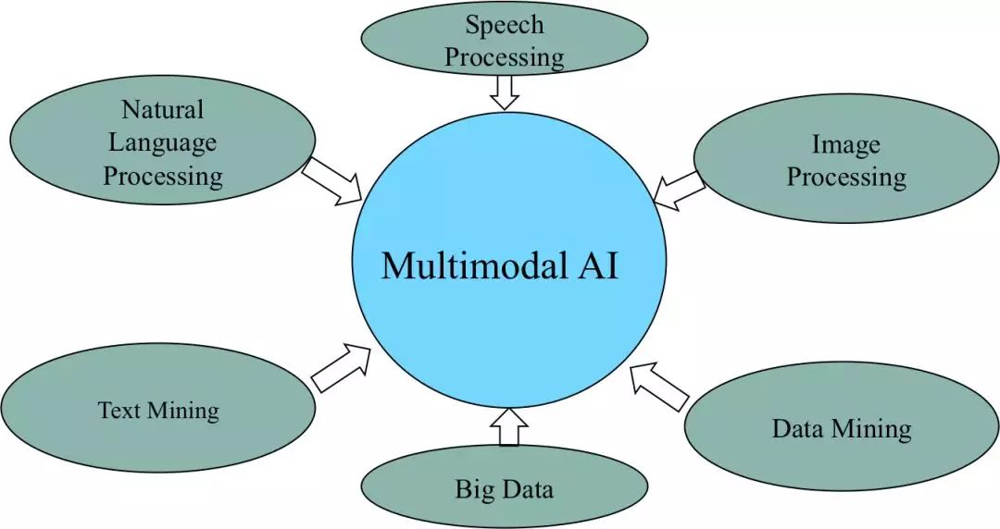

**网址**：

[https://arxiv.org/abs/1911.03977https://www.zhuanzhi.ai/paper/efe8f986342d215a8179d447624801ee](https://link.zhihu.com/?target=https%3A//arxiv.org/abs/1911.03977https%3A//www.zhuanzhi.ai/paper/efe8f986342d215a8179d447624801ee)

> **7、Object Detection in 20 Years: A Survey（目标检测）**

**作者**：Zhengxia Zou (1), Zhenwei Shi (2), Yuhong Guo (3 and 4), Jieping Ye

**摘要：**目标检测作为计算机视觉中最基本、最具挑战性的问题之一，近年来受到了广泛的关注。它在过去二十年的发展可以说是计算机视觉历史的缩影。如果我们把今天的目标检测看作是深度学习力量下的一种技术美学，那么让时光倒流20年，我们将见证冷兵器时代的智慧。**本文从目标检测技术发展的角度，对近四分之一世纪(20世纪90年代至2019年)的400余篇论文进行了广泛的回顾**。**本文涵盖了许多主题，包括历史上的里程碑检测器、检测数据集、度量、检测系统的基本构建模块、加速技术以及最新的检测方法。本文还综述了行人检测、人脸检测、文本检测等重要的检测应用，并对其面临的挑战以及近年来的技术进步进行了深入分析**。

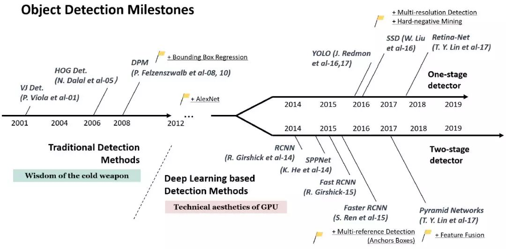

**网址**：[https://arxiv.org/abs/1905.05055https://www.zhuanzhi.ai/paper/4d9c0fdcc5a0a2b796e44e214fc9cb02](https://link.zhihu.com/?target=https%3A//arxiv.org/abs/1905.05055https%3A//www.zhuanzhi.ai/paper/4d9c0fdcc5a0a2b796e44e214fc9cb02)

> **8、A Survey of Techniques for Constructing Chinese Knowledge Graphs and Their Applications（中文知识图谱）**

**作者**：Tianxing Wu, Guilin Qi ,*, Cheng Li and Meng Wang

**摘要**：随着智能技术的不断发展，作为人工智能支柱的知识图谱以其强大的知识表示和推理能力受到了学术界和产业界的广泛关注。近年来，**知识图谱在语义搜索、问答、知识管理等领域得到了广泛的应用。构建中文知识图谱的技术也在迅速发展，不同的中文知识图谱以支持不同的应用**。同时，我国在知识图谱开发方面积累的经验对非英语知识图谱的开发也有很好的借鉴意义。**本文旨在介绍中文知识图谱的构建技术及其应用，然后介绍了典型的中文知识图谱，此外我们介绍了构建中文知识图谱的技术细节，并介绍了了中文知识图谱的几种应用**。

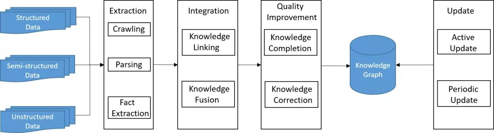

**网址**：[https://www.mdpi.com/2071-1050/10/9/3245](https://link.zhihu.com/?target=https%3A//www.mdpi.com/2071-1050/10/9/3245)

> **9、Advances and Open Problems in Federated Learning（联邦学习）**

**摘要**：**联邦学习(FL)**是一种机器学习设置，**在这种设置中，许多客户(例如移动设备或整个组织)在中央服务器(例如服务提供商)的协调下协作地训练模型**，同时保持训练数据分散。FL体现了集中数据收集和最小化的原则，可以减轻由于传统的、集中的机器学习和数据科学方法所带来的许多系统隐私风险和成本。在FL研究爆炸性增长的推动下，**本文讨论了近年来的进展，并提出了大量的开放问题和挑战**。

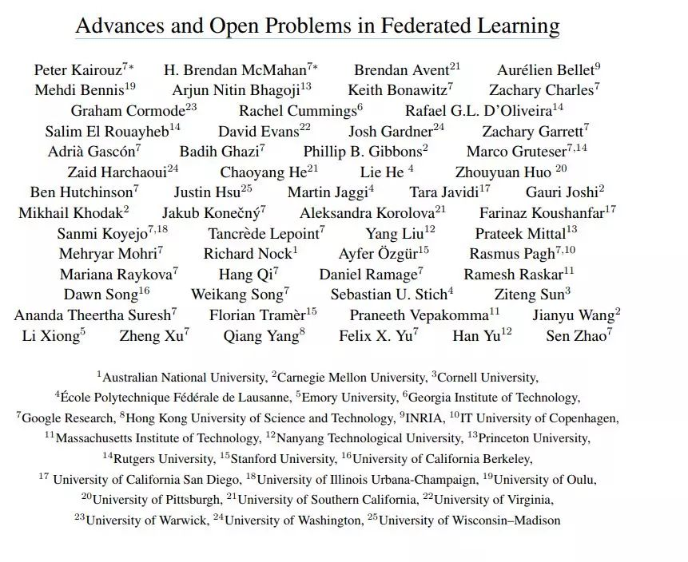

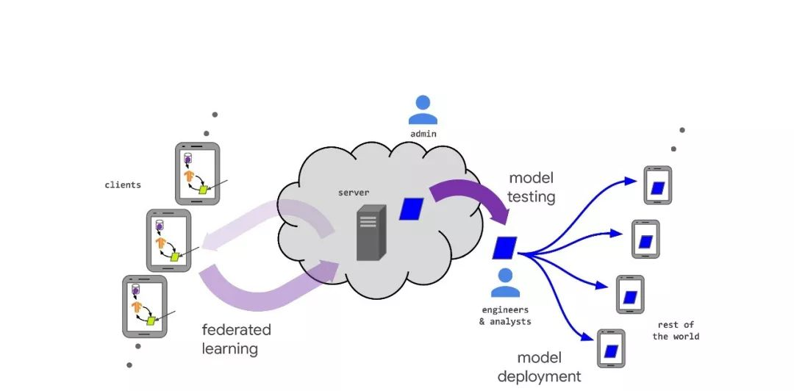

**网址**：[https://arxiv.org/abs/1912.04977](https://link.zhihu.com/?target=https%3A//arxiv.org/abs/1912.04977)

> **10、Optimization for deep learning: theory and algorithms（深度学习理论）**

**摘要**：什么时候以及为什么能够成功地训练神经网络?本文概述了神经网络的优化算法和训练理论。**首先，我们讨论了梯度爆炸/消失问题和更一般的不期望谱问题，然后讨论了实际的解决方案，包括仔细的初始化和归一化方法**。其次**，我们回顾了用于训练神经网络的一般优化方法**，如SGD、自适应梯度方法和分布式方法，以及这些算法的现有理论结果。第三，**我们回顾了现有的关于神经网络训练的全局问题的研究，包括局部极值的结果、模式连接、彩票假设和无限宽度分析**。

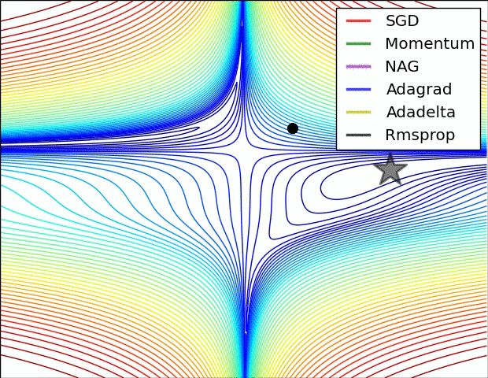

**网址**：[https://www.zhuanzhi.ai/paper/2a5e7596942977067240c946ecd4bd47](https://link.zhihu.com/?target=https%3A//www.zhuanzhi.ai/paper/2a5e7596942977067240c946ecd4bd47)

编辑于 01-02