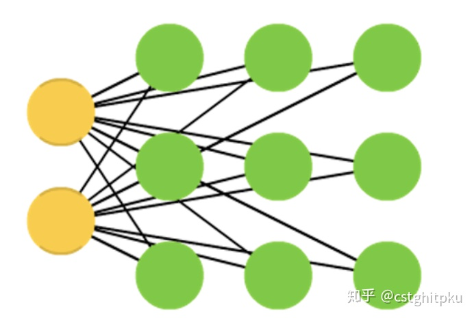

# 一文看懂深度学习发展史和常见26个模型

本文首先从4个方面（张量、生成模型、序列学习、深度强化学习）追踪深度学习几十年的发展史，然后再介绍主流的26个深度学习模型。

**1.深度学习发展史**

深度学习的发展史主要是我几个月前看的唐杰老师的学生整理的一个[博文](https://link.zhihu.com/?target=https%3A//weibo.com/2126427211/GavUQjfLa%3Ftype%3Dcomment%23_rnd1543322198481)，现在找不到博文了。凭借记录加上我的理解，简单写一写吧。如果还有人知道这个博文，欢迎告知，我把链接放上来，供大家更好的学习。

主要按**最早研究**出现的时间，从4个方面来追踪深度学习的发展史。

**1.1 张量**

1958年Frank提出感知机，但后来被一些学者发现因算力的不足，制约了较大神经网络的计算，导致很长时间发展缓慢。

Fukushima在1979年左右提出Neocognitron，感觉这是卷积和池化的雏形。

Hinton在1986年提出反向传播的思想和多层感知机（BPNN/MLP），有非常大的意义，对未来几十年（可以说直到现在）影响深远。

接下来比较重要的发展是，LeCun在1998年提出LeNet-5，7层的CNN做数字识别。

然后AlexNet在12年在ImageNet夺冠，主要是**CNN+Dropout+Relu**，又是Hinton极大的带动了DL的发展，大佬的地位毋庸置疑。另外相似的还有15年的GoogLeNet。

总算有华人大佬作出大贡献了，16年何恺明（CV领域应该无人不知）提出Resnet，还拿了best paper，影响较大，当然效果也很好。另外相似的还有17年的DenseNet。

17年Capsule Network登场了，又是Hinton。**我比较看好胶囊网络在NLP领域的发展**，虽然现在还没太明显的效果。因为用胶囊网络来做文本的特征表示的话，**可以极大的丰富特征，更适合处理文本这种比较灵活的数据**。

**1.2 生成模型**

上世纪80年代提出RBM，06年叠加成Deep Belief Network（DBN），这算是重新叠加网络的一个比较重要的开始吧。

上世纪80年代Hinton提出Auto-Encode，过了较长时间Bengio在08年提出Denoise Auto-Encode。Welling在13年提出Variational Auto-Encode。

接下来，在14年Goodfellow和Bengio等提出GAN，从此生成网络不仅是AE以及其变种（Denoise Auto-Encode、Variational Auto-Encode等）了，可以这么说：GAN的出现极大的提高了生成模型的地位和热点，GAN也是席卷NLP、CV、AI等领域的各大顶会，甚至是一些best paper。另外，陆续出现很多很多GAN的变种，比如DCGAN、CGAN、PGGAN、LAPGAN、InfoGAN、WGAN、F-GAN、SeqGAN、LeakGAN等。

**1.3 序列学习**

1982年提出hopfield network，1997年 Schmidhuber提出LSTM。Hinton组在13年把RNN用在语音识别上取得巨大突破，RNN立马爆火。

03年提出LM（语言模型），13年提出w2v，佩服Bengio，这也是我为啥千里迢迢跑去找Bengio合影的原因之一。w2v带来的影响不言而喻，目前NLP领域基本上所有Paper都会用到词向量，包括也影响了后面出现的Glove、FastText、ELMo（18年2月）、Transformer（18年6月）、**Bert（18年10月提出，Jacob一战封神，我感觉至少是18年NLP领域最大的发展，甚至可以说是近几年最大的发展）等。Bert的出现，很可能改变所有主流NLP任务的打法和Baseline**。

还有一个分支，14年出现Seq2Seq，这个重要性也无需赘述了，NLP领域的都知道。然后15年出现Charater CNN，17年出现self-attention。

**1.4 深度强化学习**

提到强化学习就不得不提这Deep Mind、AlphaGo以及其变种、Silver。13年提出Deep Q-learning，15年提出Double DQN，16年提出Dueling Net。 15年的DDPG和16年的A3C都是NN+Policy Gradient，也应用在不少领域。**16年的AlphaGo（除了AI领域，很多不懂AI的人都知道，甚至可以说是AI爆火的最大助力），17年出现更疯狂的Alpha Zero。**

**2.深度学习模型**

翻译自[neural-network-zoo](https://link.zhihu.com/?target=http%3A//www.asimovinstitute.org/neural-network-zoo/)，原文略烦琐而不利于入门学习，我做了简化，方便大家阅读。如果有感兴趣的，可以通过此链接深入学习。

**2.1 Feed forward neural networks (FF or FFNN) and perceptrons (P)**

**前馈神经网络和感知机，**信息从前（输入）往后（输出）流动，一般用反向传播（BP）来训练。算是一种**监督学习。对应的**[paper](https://link.zhihu.com/?target=http%3A//www.ling.upenn.edu/courses/cogs501/Rosenblatt1958.pdf)**。**

**2.2 Radial basis function (RBF)**

**径向基函数网络，**是一种径向基函数作为激活函数的FFNNs（前馈神经网络）。对应的[paper](https://link.zhihu.com/?target=http%3A//www.dtic.mil/cgi-bin/GetTRDoc%3FAD%3DADA196234)。

**2.3 Hopfield network (HN)**

**Hopfield网络，**是一种每个神经元都跟其它神经元相连接的神经网络。对应的[paper](https://link.zhihu.com/?target=https%3A//bi.snu.ac.kr/Courses/g-ai09-2/hopfield82.pdf)。

**2.4 Markov chains (MC or discrete time Markov Chain, DTMC)**

**马尔可夫链 或离散时间马尔可夫链，**算是BMs和HNs的雏形。对应的[paper](https://link.zhihu.com/?target=http%3A//www.americanscientist.org/libraries/documents/201321152149545-2013-03Hayes.pdf)。

**2.5 Boltzmann machines (BM)**

**玻尔兹曼机，**和**Hopfield网络**很类似，但是：一些神经元作为输入神经元，剩余的是隐藏层。对应的[paper](https://link.zhihu.com/?target=https%3A//www.researchgate.net/profile/Terrence_Sejnowski/publication/242509302_Learning_and_relearning_in_Boltzmann_machines/links/54a4b00f0cf256bf8bb327cc.pdf)。

**2.6 Restricted Boltzmann machines (RBM)**

**受限玻尔兹曼机，和玻尔兹曼机** 以及 **Hopfield网络** 都比较类似。对应的[paper](https://link.zhihu.com/?target=http%3A//www.dtic.mil/cgi-bin/GetTRDoc%3FLocation%3DU2%26doc%3DGetTRDoc.pdf%26AD%3DADA620727)。

**2.7 Autoencoders (AE)**

**自动编码**，和FFNN有些类似，它更像是FFNN的另一种用法，而不是本质上完全不同的另一种架构。对应的[paper](https://link.zhihu.com/?target=https%3A//pdfs.semanticscholar.org/f582/1548720901c89b3b7481f7500d7cd64e99bd.pdf)。

**2.8 Sparse autoencoders (SAE)**

**稀疏自动编码，**跟自动编码在某种程度比较相反。对应的[paper](https://link.zhihu.com/?target=https%3A//papers.nips.cc/paper/3112-efficient-learning-of-sparse-representations-with-an-energy-based-model.pdf)。

**2.9 Variational autoencoders (VAE)**

**变分自动编码**，和AE架构相似，不同的是：输入样本的一个近似概率分布。这使得它跟BM、RBM更相近。对应的[paper](https://link.zhihu.com/?target=https%3A//arxiv.org/pdf/1312.6114v10.pdf)。

**2.10 Denoising autoencoders (DAE)**

**去噪自动编码**，也是一种自编码机，它不仅需要训练数据，还需要带噪音的训练数据**。**对应的[paper](https://link.zhihu.com/?target=https%3A//arxiv.org/pdf/1312.6114v10.pdf)。

**2.11 Deep belief networks (DBN**

**深度信念网络**，由多个受限玻尔兹曼机或变分自动编码堆砌而成。对应的[paper](https://link.zhihu.com/?target=https%3A//papers.nips.cc/paper/3048-greedy-layer-wise-training-of-deep-networks.pdf)。

**2.12 Convolutional neural networks (CNN or deep convolutional neural networks, DCNN)**

**卷积神经网络**，这个不解释也都知道。对应的[paper](https://link.zhihu.com/?target=http%3A//yann.lecun.com/exdb/publis/pdf/lecun-98.pdf)。

**2.13 Deconvolutional networks (DN)**

**去卷积网络**，又叫逆图形网络，是一种逆向的卷积神经网络。对应的[paper](https://link.zhihu.com/?target=http%3A//www.matthewzeiler.com/pubs/cvpr2010/cvpr2010.pdf)。

**2.14** **Deep convolutional inverse graphics networks (DCIGN)**

**深度卷积逆向图网络**，实际上是VAE，且分别用CNN、DNN来作编码和解码。对应的[paper](https://link.zhihu.com/?target=https%3A//arxiv.org/pdf/1503.03167v4.pdf)。

**2.15 Generative adversarial networks (GAN)**

**生成对抗网络**，Goodfellow的封神之作，这个模型不用解释也都知道。对应的[paper](https://link.zhihu.com/?target=https%3A//arxiv.org/pdf/1406.2661v1.pdf)。

**2.16 Recurrent neural networks (RNN)**

**循环神经网络**，这个更不用解释，做语音、NLP的没有人不知道，甚至非AI相关人员也知道。对应的[paper](https://link.zhihu.com/?target=https%3A//crl.ucsd.edu/~elman/Papers/fsit.pdf)。

**2.17 Long / short term memory (LSTM)**

**长短期记忆网络，** RNN的变种，解决梯度消失/爆炸的问题，也不用解释，这几年刷爆各大顶会。对应的[paper](https://link.zhihu.com/?target=http%3A//deeplearning.cs.cmu.edu/pdfs/Hochreiter97_lstm.pdf)。

**2.18 Gated recurrent units (GRU)**

**门循环单元**，类似LSTM的定位，算是LSTM的简化版**。**对应的[paper](https://link.zhihu.com/?target=https%3A//arxiv.org/pdf/1412.3555v1.pdf)。

**2.19 Neural Turing machines (NTM)**

**神经图灵机**，LSTM的抽象，以窥探LSTM的内部细节。具有读取、写入、修改状态的能力。对应的[paper](https://link.zhihu.com/?target=https%3A//arxiv.org/pdf/1410.5401v2.pdf)。

**2.20 Bidirectional recurrent neural networks, bidirectional long / short term memory networks and bidirectional gated recurrent units (BiRNN, BiLSTM and BiGRU respectively)**

**双向循环神经网络、双向长短期记忆网络和双向门控循环单元**，把RNN、双向的LSTM、GRU双向，不再只是从左到右，而是既有从左到右又有从右到左。对应的[paper](https://link.zhihu.com/?target=http%3A//www.di.ufpe.br/~fnj/RNA/bibliografia/BRNN.pdf)。

**2.21 Deep residual networks (DRN)**

**深度残差网络，**是非常深的FFNN，它可以把信息从某一层传至后面几层（通常2-5层）。对应的[paper](https://link.zhihu.com/?target=https%3A//arxiv.org/pdf/1512.03385v1.pdf)。

**2.22 Echo state networks (ESN)**

**回声状态网络，**是另一种不同类型的（循环）网络。对应的[paper](https://link.zhihu.com/?target=https%3A//pdfs.semanticscholar.org/8922/17bb82c11e6e2263178ed20ac23db6279c7a.pdf)。

**2.23 Extreme learning machines (ELM)**

**极限学习机，**本质上是随机连接的FFNN。对应的[paper](https://link.zhihu.com/?target=http%3A//www.ntu.edu.sg/home/egbhuang/pdf/ieee-is-elm.pdf)。

**2.24 Liquid state machines (LSM)**

**液态机**，跟ESN类似，区别是用阈值激活函数取代了sigmoid激活函数。对应的[paper](https://link.zhihu.com/?target=https%3A//web.archive.org/web/20120222154641/http%3A//ramsesii.upf.es/seminar/Maass_et_al_2002.pdf)。

**2.25 Support vector machines (SVM)**

**支持向量机**，入门机器学习的人都知道，不解释。对应的[paper](https://link.zhihu.com/?target=http%3A//image.diku.dk/imagecanon/material/cortes_vapnik95.pdf)。

**2.26 Kohonen networks (KN, also self organising (feature) map, SOM, SOFM)**

**Kohonen 网络**，也称之为自组织（特征）映射。对应的[paper](https://link.zhihu.com/?target=http%3A//cioslab.vcu.edu/alg/Visualize/kohonen-82.pdf)。

总结一下吧，深度学习发展很快，新的模型层出不穷，所以要想全部列举是不可能的。另外，很多模型都是这里提出很长很长时间了，所以也不是说“老”模型就没用，大家学习的话，还是要全面而深入的学习。