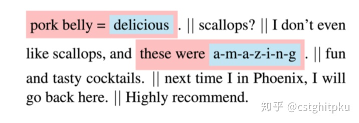
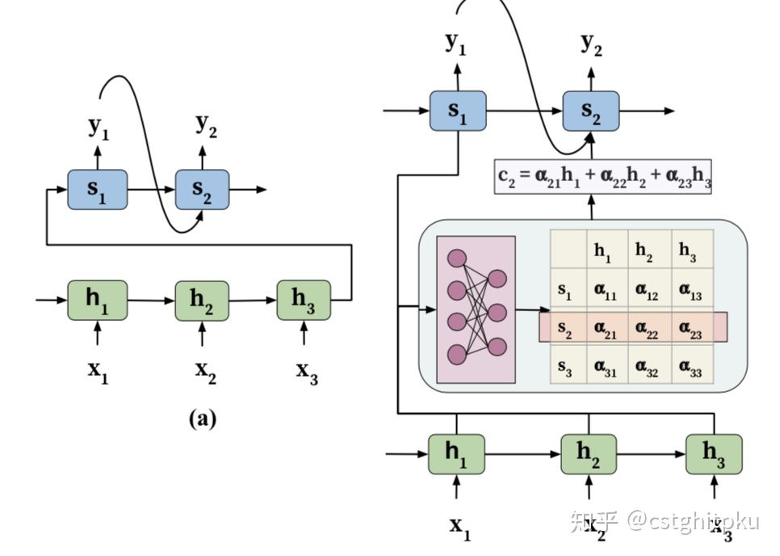
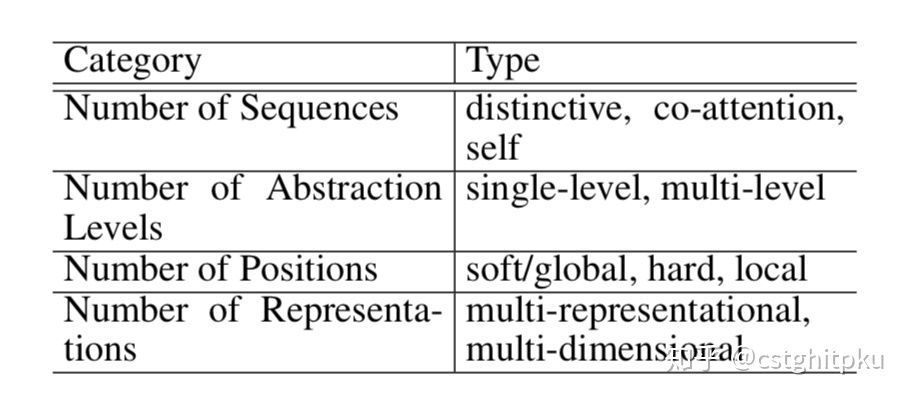
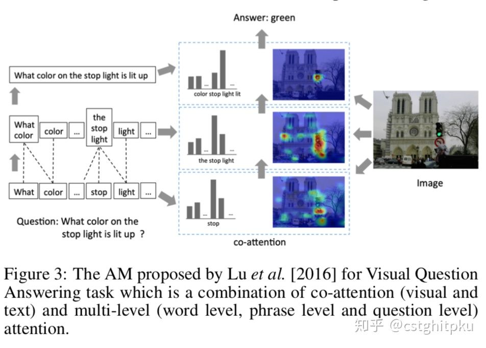
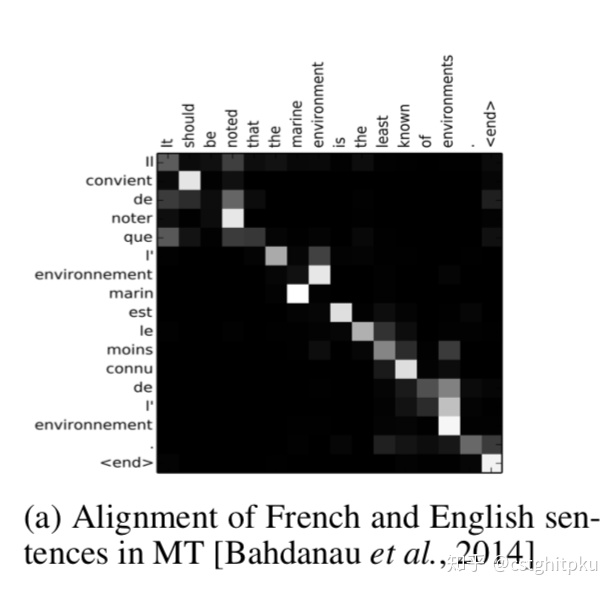
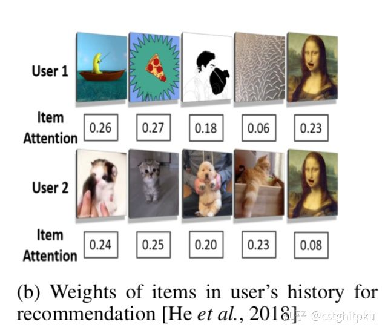
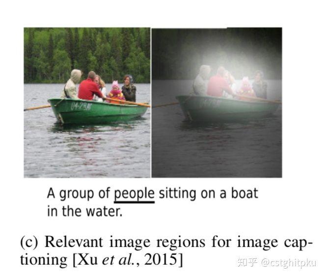

# Attention综述

注意力模型在大部分的自然语言处理任务中都得到了广泛应用，而且取得很不错的效果，甚至说它曾经横扫NLP各个任务也不为过。虽然他的idea很简单，但是你确定完全了解它吗？

本文大部分内容来自于[An Attentive Survey of Attention Models](https://link.zhihu.com/?target=https%3A//arxiv.org/pdf/1904.02874.pdf)。本文包括：注意力的相关介绍、注意力模型、注意力模型的分类、引入注意力的不同神经网络架构、注意力如何提高高神经模型的可解释性、注意力在多种NLP任务中的应用、结论等。

**1.注意力的相关介绍**

注意力最开始是14年应用在**MT（机器翻译）**任务中的，并且显著改善了MT的性能。后来，在多个AI领域得到广泛应用，包括NLP、CV、语音、统计机器学习等。

注意力机制之所以得到如此迅速的发展，主要包括三方面原因：1.在MT、QA、情感分析、POS、parsing和对话等任务中使用attention都达到了**目前的SOTA**（其实不难理解，这些任务大多需要在产生输出时聚焦到输入序列中的一部分，比如QA需要聚焦到query中的核心内容；对话回复需要聚焦到当前query、对话历史、KB中的某一部分或某几部分（考虑上下文或KB中的fact，多hop的推理））；2.除了提高效果之外，它还可以**提高神经网络的可解释性**（这一点也是神经网络被诟病最多的缺点之一）；3.它可以**克服**RNN因为输入太长而导致的**丢失信息、记忆不够精准**（解决这两个还可以用memory network和神经图灵机）、**计算开销太大**（RNN很难并行处理，而基于attention而选择性聚焦的话，就可以一定程度上解决这个问题）等问题。

**2.注意力模型**

开始讲解注意力机制之前，先用一个不严密的类比当作例子来简化理解难度。

大家初中和高中应该都做过英语阅读理解，一种行之有效的方法是带着问题聚焦到原文的**部分内容**（而不是全部内容）来获取答案，尤其是考试剩余时间很短时这种方法应用更多。关键是，这种方法还特别奏效（至少我高中阶段屡试不爽；大一考6级时，完全靠这招在阅读理解上拿到很高的分数，最终才能在听力得分惨不忍睹的情况下，一次用不算太低的分数顺利通过的）。其实注意力机制跟这个类似，也是**有选择的（靠计算得到的相似度权重来选择）**聚焦到输入的**部分相关内容**，而忽略其他内容。在很多任务上，这样做好处就太大了，**一方面可以使得结果更精准，另一方面还可以解决计算复杂度过高的问题**。

这里偷个懒，用原文的截图来解释吧（其实这个图还不是太好，不够直观）。在下图中，第一个句子跟第三个句子最相关，“delicious” 和 “amazing ”是决定情感最重要的词。

我一直认为先定性的认识某个东西，再定量的去认识，这样才能更精确、更长久的记住它。所以在上面例子的基础上，下面简单介绍下注意力机制的计算方式。

传统的 encoder-decoder存在几个问题：encoder把输入的全部信息转换成定长的向量并传递给decoder，如果输入很长的话肯定会丢失很多信息，导致对输入的表示很不精准（尤其是在长距离依赖任务上，这种弊端更明显）；并不能在input（对应于encoder）和output（对应于decoder）之间有效对齐，这也是致命的，尤其是在MT（不同语言的语法和句式很不一样，这就不好对齐）和自动摘要（输入比输出长很多，很难对齐）等任务中。其实在这些任务中，逐步输出token时很希望聚焦到input的部分内容而不是全部内容，然而传统的 encoder-decoder在decoder时并具备选择input中部分相关内容的机制。

基于以上讨论，不难发现attention有了很大的施展空间。为了解决上述问题，可以在 encoder-decoder的基础上，在decoder阶段加入获取input（已经被encoder）中特定部分的机制，这就是attention。用原文的图表示就是：

其中x_1、x_2、x_3是输入，y_1、y_2是输出，h_1、h_2、h_3是encoder后的隐藏状态(本文把它叫做candidate state)，s_1和s_2是decoder的隐藏状态(本文把它叫做query state)，α_ij是s_i和h_j的相关程度，c是h的加权和(权重是s和h的相关程度)，把它当作attention作用于decoder。以上这就是最基本、最简单的attention机制的计算过程。

**3.注意力模型的分类**

注意力可以分为**不互斥**的4类，所谓不互斥有两层含义：他们是按不同方面/纬度划分的attention；设计出的attention机制可以**同时属于多个**方面/维度中的某个特定类别。具体分类如下表：

3.1 按Number of **sequences**分类：按输入输出的**sequence个数**分类

distinctive：candidate state和query state属于两个distinct输入序列和输出序列。这种attention大多用于MT、自动摘要、图像caption、语音识别等。

co-attention：包括多个输入序列，而且这些序列可以**联合学习**（joint）attention权重，这一点是非常有用的。这种attention大多用于VQA（视觉QA），同时在image、text上计算attention，而且可以互相指导。比如：text（也就是问题）可以辅助确定图片上哪些部分是重要的；反过来，图片也可以辅助指导text中哪些词是关键词。

self：输入是序列，而输出不是序列（比如文本分类的输出是类别id，推荐系统推荐的是item的id等）。在这种情况下，就在input上做自注意力，也就是candidate state和query state都是input的encoder。这种注意力也叫内积注意力(inner attention)大多用于文本分类和推荐系统等。

3.2 按Number of **abstraction** levels分类：按抽象的level分类，其实就是按包含的抽象粒度的个数分

single-level：只是按原始输入序列算attention

multi- level：按输入的多种抽象level算attention（比如词粒度、短语粒度、句子粒度、文档粒度等），它包括top-down和 bottom-up两种计算抽象粒度的方法。具体见下图：

3.3 按Number of **positions**分类：按输入序列的不同**position**分类

soft：使用输入序列的隐藏状态的平均权重来生成context的向量，这种attention的好处是可微（可以BP训练），但是计算复杂度较大。

hard：使用输入序列的隐藏状态随机采样（attention权重的伯努利分布）来生成context的向量，这种attention的坏处是不可微（不好优化），但是计算复杂度较小（采用采样后，肯定变小）。所以一般采用变分学习法或策略梯度法来优化。

global：跟soft基本一样。

local：算是soft和hard的一种折中，它分为两步：在输入序列中找到attention的点或位置（可以自己设置，也可以通过算法或模型来学习）；然后around这个位置设置一个窗口，并在这个窗口上做soft的attention。在这个窗口中，他的计算开销变小（序列变短）而且是可微的（在这个窗口中肯定连续，因为是around）。

3.4 按Number of **representations**分类：按输入的**representation**方式分类

multi- representational：有时候采用一种特征做表征学习并不能精准的刻画输入，这就导致一些下游的任务的性能受限，这就需要获取不同aspect的特征来组合表示输入。这种注意力就是为不同的表征来分配重要性的权重，这就可以决定最相关的aspect，而且可以消除输入中的噪音和冗余对表征的影响。最终的表征是多种特征表示的attention权重的加权和。这样的好处是显而易见的。这种表征可以通过在相同输入序列上学习基于不同的attention权重的embedding来获取更好的表征向量。

multi-dimensional：顾名思义，这种attention跟维度有关。这种attention的权重可以决定输入的embedding向量中不同维度之间的相关性。其实embedding中的维度可以看作一种隐性的特征表示（不像one_hot那种显性表示直观，虽然缺少可解释性，但是也算是特征的隐性表示），所以通过计算不同维度的相关性就能找出起作用最大的特征维度。尤其是解决一词多义时，这种方式非常有效果。所以，这种方法在句子级的embedding表示、NLU中都是很有用的。

**4.引入注意力的不同神经网络架构**

encoder-decoder：最初的注意力就是用于这种神经架构，目前这种架构基本上都会用到attention，尤其是序列较长时。另外，即使encoder跟decoder的架构不一样时（比如encoder是cnn，decoder是rnn，或者反过来，具体根据task而定，非常适合解决多模态问题），attention同样可用。

memory network包含四部分内容：**query（输入）的向量、一系列可训练的map矩阵、attention权重和、多hop推理**。这样就可以使用KB中的fact、使用history中的关键信息、使用query的关键信息等进行推理，这在QA和对话中至关重要。

不包含RNN的网络：因为RNN不利于并行计算，所以开销太大。所以可以用Transformer来代替，他是多层做stack（集成学习的一种方式），每个子层包括：Feed Forward Network(FFN)和multi-head self attention。FFN可以获取输入的序列信息，它在encoder时不仅考虑内容embedding还会考虑位置encoding。所谓多头自注意力，首先它是一种自注意力，然后因为多层自注意力做了stack来并行化（减少时间开销），所以叫多头自注意力。因为Transformer在此不是重点，感兴趣的可以去看看论文中的具体描述（个人看好Transformer在不少任务中的应用前景，因为可以获取输入中不同aspect的表示）。

**5.注意力如何提高高神经模型的可解释性**

偷个懒，直接用论文中的图了

MT中对齐权重的可视化，很好的解释了工作过程

推荐的权重可视化，很好的解释了工作过程

图像caption的可视化，不够直观

**6.注意力在多种NLP任务中的应用**

**attention**广泛应用于Natural Language Generation(NLG)、MT、QA、对话系统、Multimedia Description (MD)、文本分类、推荐系统、情感分析等任务，上面有了一些简单介绍，不再赘述。另外，QA和对话中有效融入外部知识库、预训练、多任务学习、无监督表征学习、稀疏学习等也可以使用attention。

**7.结论**

本文介绍了**注意力的相关介绍、注意力模型、注意力模型的分类、引入注意力的不同神经网络架构、注意力如何提高高神经模型的可解释性、注意力在多种NLP任务中的应用等。**感兴趣的可以进一步深究，有不懂的欢迎找我讨论和学习。