# 从ReLU到GELU，一文概览神经网络的激活函数

激活函数对神经网络的重要性自不必多言，机器之心也曾发布过一些相关的介绍文章，比如《一文概览深度学习中的激活函数》。本文同样关注的是激活函数。来自丹麦技术大学的 Casper Hansen 通过公式、图表和代码实验介绍了 sigmoid、ReLU、ELU 以及更新的 Leaky ReLU、SELU、GELU 这些激活函数，并比较了它们的优势和短板。

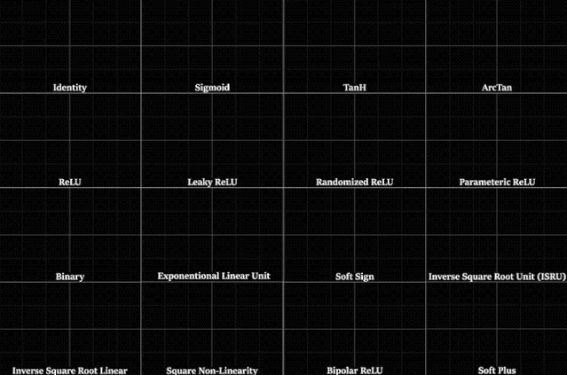

在计算每一层的激活值时，我们要用到激活函数，之后才能确定这些激活值究竟是多少。根据每一层前面的激活、权重和偏置，我们要为下一层的每个激活计算一个值。但在将该值发送给下一层之前，我们要使用一个激活函数对这个输出进行缩放。本文将介绍不同的激活函数。

在阅读本文之前，你可以阅读我前一篇介绍神经网络中前向传播和反向传播的文章，其中已经简单地提及过激活函数，但还未介绍其实际所做的事情。本文的内容将建立在你已了解前一篇文章知识的基础上。

前一篇文章地址：https://mlfromscratch.com/neural-networks-explained/

Casper Hansen

目录

概述

sigmoid 函数是什么？

梯度问题：反向传播

梯度消失问题

梯度爆炸问题

梯度爆炸的极端案例

避免梯度爆炸：梯度裁剪/范数

整流线性单元（ReLU）

死亡 ReLU：优势和缺点

指数线性单元（ELU）

渗漏型整流线性单元（Leaky ReLU）

扩展型指数线性单元（SELU）

SELU：归一化的特例

权重初始化+dropout 

高斯误差线性单元（GELU）

代码：深度神经网络的超参数搜索

扩展阅读：书籍与论文

概述

激活函数是神经网络中一个至关重要的部分。在这篇长文中，我将全面介绍六种不同的激活函数，并阐述它们各自的优缺点。我会给出激活函数的方程和微分方程，还会给出它们的图示。本文的目标是以简单的术语解释这些方程以及图。

我会介绍梯度消失和爆炸问题；对于后者，我将按照 Nielsen 提出的那个很赞的示例来解释梯度爆炸的原因。

最后，我还会提供一些代码让你可以自己在 Jupyter Notebook 中运行。

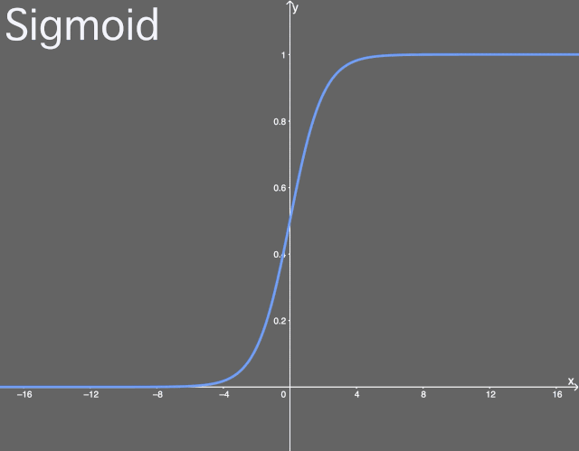

我会在 MNIST 数据集上进行一些小型代码实验，为每个激活函数都获得一张损失和准确度图。

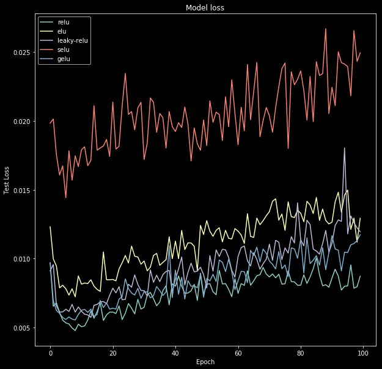

sigmoid 函数是什么？

sigmoid 函数是一个 logistic 函数，意思就是说：不管输入是什么，得到的输出都在 0 到 1 之间。也就是说，你输入的每个神经元、节点或激活都会被缩放为一个介于 0 到 1 之间的值。

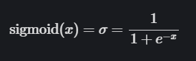

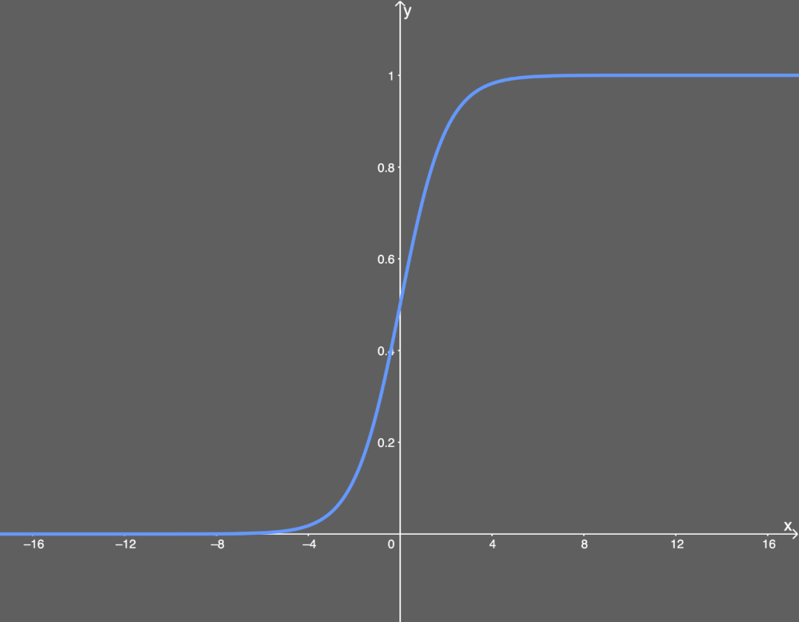

sigmoid 函数图示。

sigmoid 这样的函数常被称为非线性函数，因为我们不能用线性的项来描述它。很多激活函数都是非线性或者线性和非线性的组合（有可能函数的一部分是线性的，但这种情况很少见）。

这基本上没什么问题，但值恰好为 0 或 1 的时候除外（有时候确实会发生这种情况）。为什么这会有问题？

这个问题与反向传播有关（有关反向传播的介绍请参阅我的前一篇文章）。在反向传播中，我们要计算每个权重的梯度，即针对每个权重的小更新。这样做的目的是优化整个网络中激活值的输出，使其能在输出层得到更好的结果，进而实现对成本函数的优化。

在反向传播过程中，我们必须计算每个权重影响成本函数（cost function）的比例，具体做法是计算成本函数相对于每个权重的偏导数。假设我们不定义单个的权重，而是将最后一层 L 中的所有权重 w 定义为 w^L，则它们的导数为:

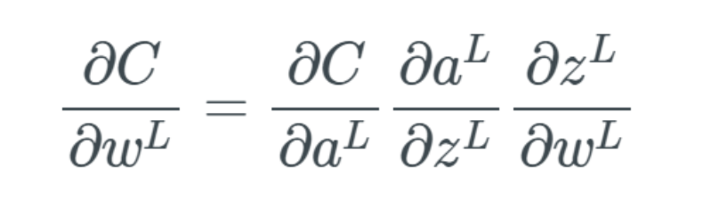

注意，当求偏导数时，我们要找到 ∂a^L 的方程，然后仅微分 ∂z^L，其余部分保持不变。我们用撇号「'」来表示任意函数的导数。当计算中间项 ∂a^L/∂z^L 的偏导数时，我们有：

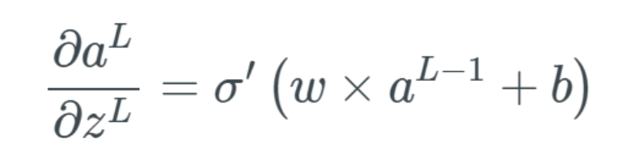

则 sigmoid 函数的导数就为：

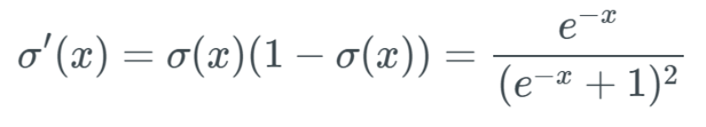

当我们向这个 sigmoid 函数输入一个很大的 x 值（正或负）时，我们得到几乎为 0 的 y 值——也就是说，当我们输入 w×a+b 时，我们可能得到一个接近于 0 的值。

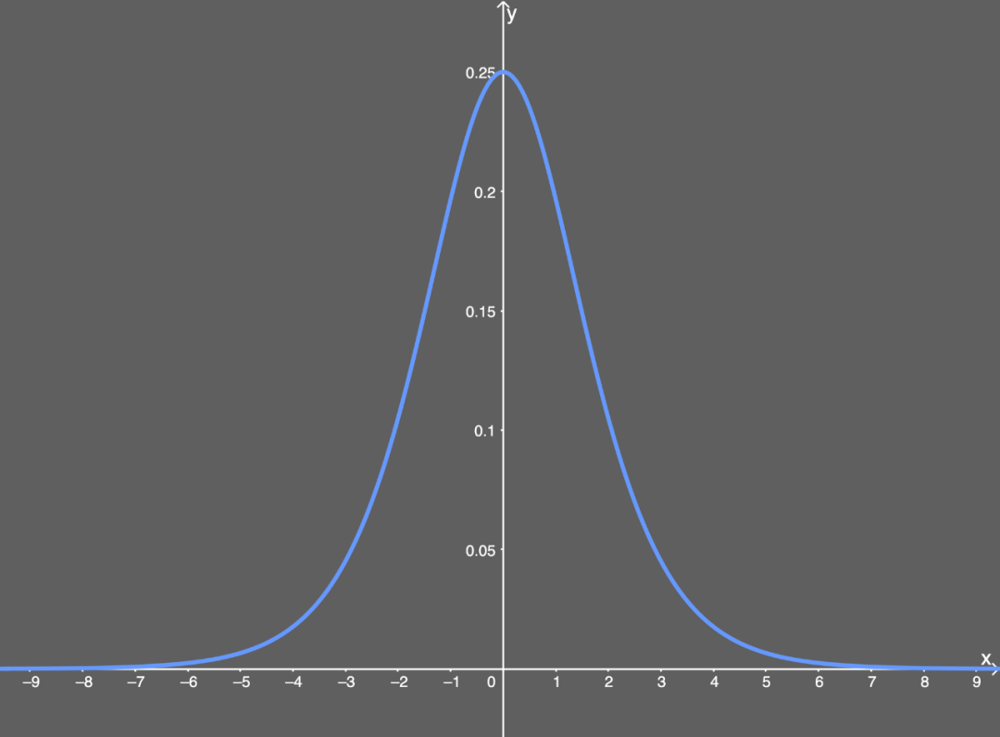

sigmoid 函数的导数图示。

当 x 是一个很大的值（正或负）时，我们本质上就是用一个几乎为 0 的值来乘这个偏导数的其余部分。

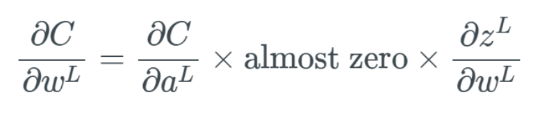

如果有太多的权重都有这样很大的值，那么我们根本就没法得到可以调整权重的网络，这可是个大问题。如果我们不调整这些权重，那么网络就只有细微的更新，这样算法就不能随时间给网络带来多少改善。对于针对一个权重的偏导数的每个计算，我们都将其放入一个梯度向量中，而且我们将使用这个梯度向量来更新神经网络。可以想象，如果该梯度向量的所有值都接近 0，那么我们根本就无法真正更新任何东西。

这里描述的就是梯度消失问题。这个问题使得 sigmoid 函数在神经网络中并不实用，我们应该使用后面介绍的其它激活函数。

梯度问题

梯度消失问题

我的前一篇文章说过，如果我们想更新特定的权重，则更新规则为：

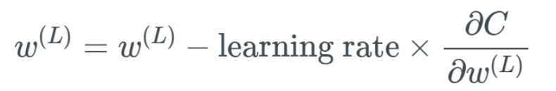

但如果偏导数 ∂C/∂w^(L) 很小，如同消失了一般，又该如何呢？这时我们就遇到了梯度消失问题，其中许多权重和偏置只能收到非常小的更新。

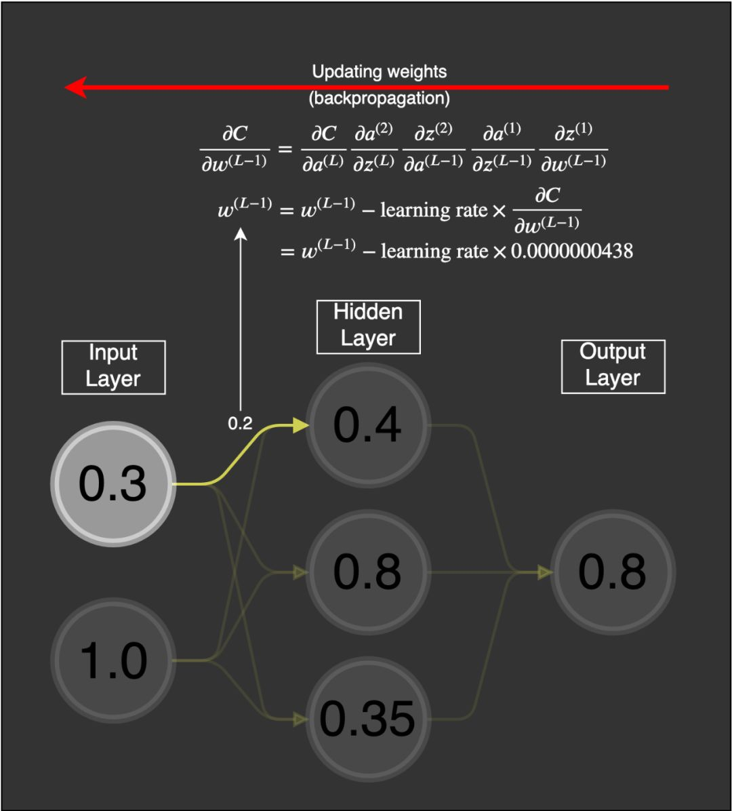

可以看到，如果权重的值为 0.2，则当出现梯度消失问题时，这个值基本不会变化。因为这个权重分别连接了第一层和第二层的首个神经元，所以我们可以用的表示方式将其记为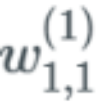

假设这个权重的值为 0.2，给定一个学习率（具体多少不重要，这里使用了 0.5），则新的权重为：

这个权重原来的值为 0.2，现在更新为了 0.199999978。很明显，这是有问题的：梯度很小，如同消失了一样，使得神经网络中的权重几乎没有更新。这会导致网络中的节点离其最优值相去甚远。这个问题会严重妨碍神经网络的学习。

人们已经观察到，如果不同层的学习速度不同，那么这个问题还会变得更加严重。层以不同的速度学习，前面几层总是会根据学习率而变得更差。

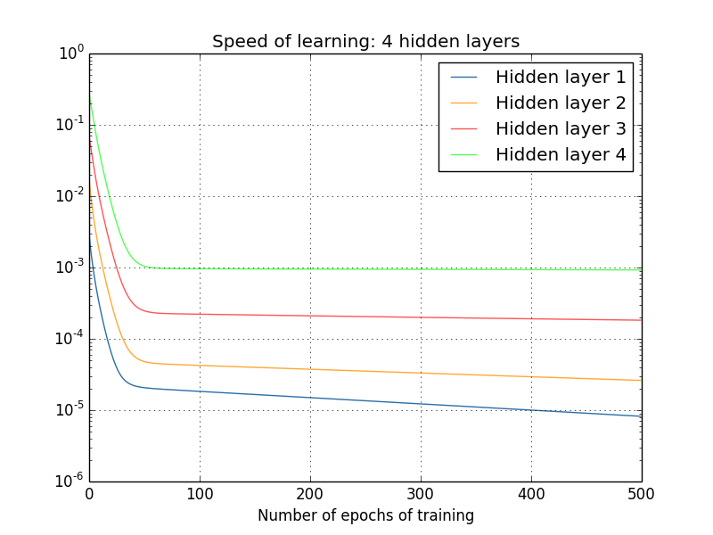

出自 Nielsen 的书《Neural Networks and Deep Learning》。

在这个示例中，隐藏层 4 的学习速度最快，因为其成本函数仅取决于连接到隐藏层 4 的权重变化。我们看看隐藏层 1；这里的成本函数取决于连接隐藏层 1 与隐藏层 2、3、4 的权重变化。如果你看过了我前一篇文章中关于反向传播的内容，那么你可能知道网络中更前面的层会复用后面层的计算。

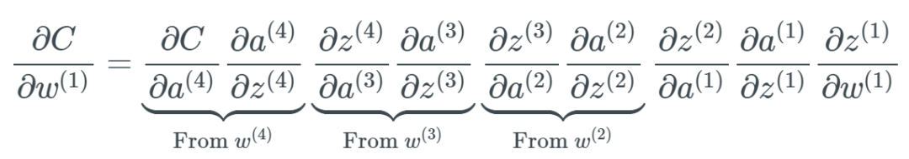

同时，如前面介绍的那样，最后一层仅取决于计算偏导时出现的一组变化：

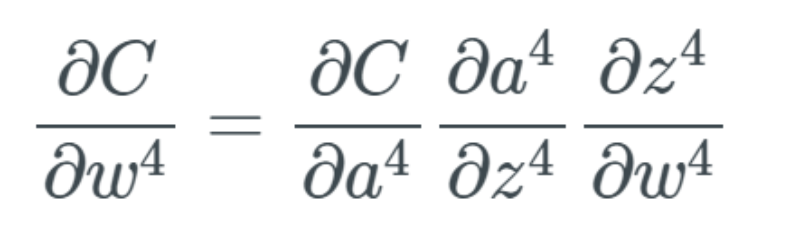

最终，这就是个大问题了，因为现在权重层的学习速度不同。这意味着网络中更后面的层几乎肯定会被网络中更前面的层受到更多优化。

而且问题还在于反向传播算法不知道应该向哪个方向传递权重来优化成本函数。

梯度爆炸问题

梯度爆炸问题本质上就是梯度消失问题的反面。研究表明，这样的问题是可能出现的，这时权重处于「爆炸」状态，即它们的值快速增长。

我们将遵照以下示例来进行说明：

http://neuralnetworksanddeeplearning.com/chap5.html#what's_causing_the_vanishing_gradient_problem_unstable_gradients_in_deep_neural_nets

注意，这个示例也可用于展示梯度消失问题，而我是从更概念的角度选择了它，以便更轻松地解释。

本质上讲，当 01 时，我们可能遇到梯度爆炸问题。但是，当一个层遇到这个问题时，必然有更多权重满足梯度消失或爆炸的条件。

我们从一个简单网络开始。这个网络有少量权重、偏置和激活，而且每一层也只有一个节点。

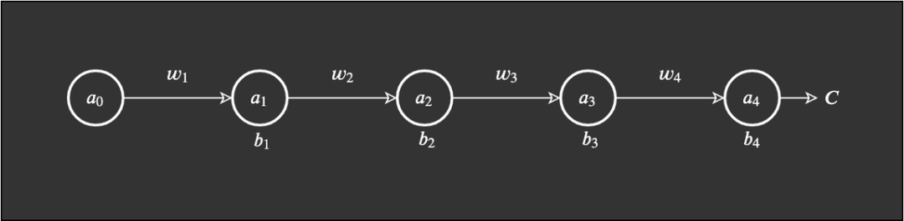

这个网络很简单。权重表示为 w_j，偏置为 b_j，成本函数为 C。节点、神经元或激活表示为圆圈。

Nielsen 使用了物理学上的常用表示方式 Δ 来描述某个值中的变化（这不同于梯度符号 ∇）。举个例子，Δb_j 描述的是第 j 个偏置的值变化。

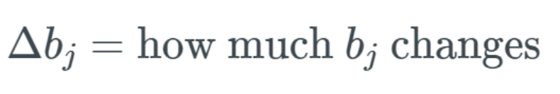

我前一篇文章的核心是我们要衡量与成本函数有关的权重和偏置的变化率。先不考虑层，我们看看一个特定的偏置，即第一个偏置 b_1。然后我们通过下式衡量变化率：

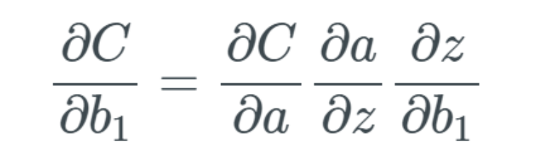

下面式子的论据和上面的偏导一样。即我们如何通过偏置的变化率来衡量成本函数的变化率？正如刚才介绍的那样，Nielsen 使用 Δ 来描述变化，因此我们可以说这个偏导能大致通过 Δ 来替代：

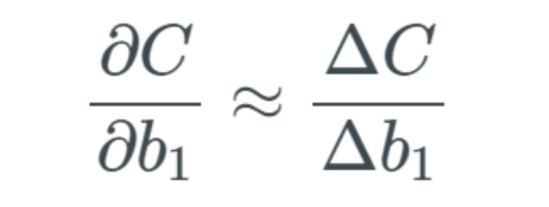

权重和偏置的变化可以进行如下可视化：

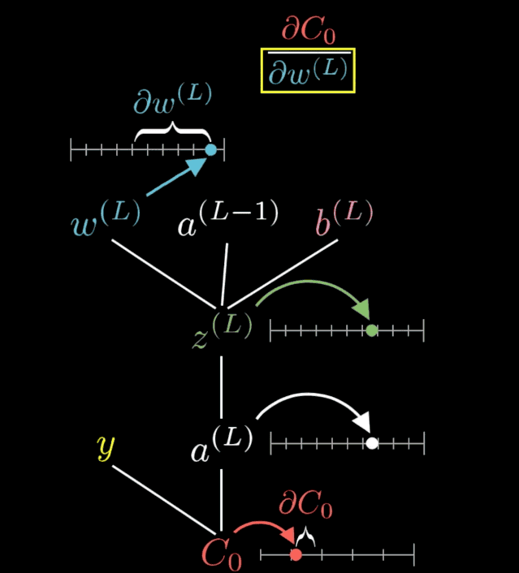

动图出自 3blue1brown，视频地址：https://www.youtube.com/watch?v=tIeHLnjs5U8。

我们先从网络的起点开始，计算第一个偏置 b_1 中的变化将如何影响网络。因为我们知道，在上一篇文章中，第一个偏置 b_1 会馈入第一个激活 a_1，我们就从这里开始。我们先回顾一下这个等式：

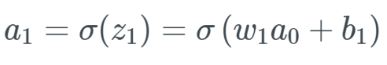

如果 b_1 改变，我们将这个改变量表示为 Δb_1。因此，我们注意到当 b_1 改变时，激活 a_1 也会改变——我们通常将其表示为 ∂a_1/∂b_1。

因此，我们左边有偏导的表达式，这是 b_1 中与 a_1 相关的变化。但我们开始替换左边的项，先用 z_1 的 sigmoid 替换 a_1：

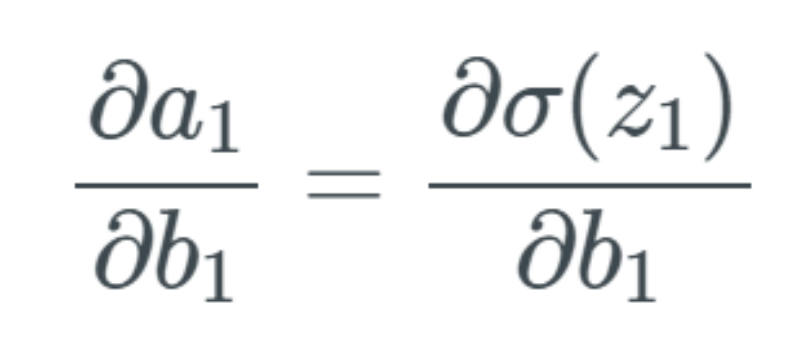

上式表示当 b_1 变化时，激活值 a_1 中存在某个变化。我们将这个变化描述为 Δa_1。

我们将变化 Δa_1 看作是与激活值 a_1 中的变化加上变化 Δb_1 近似一样。

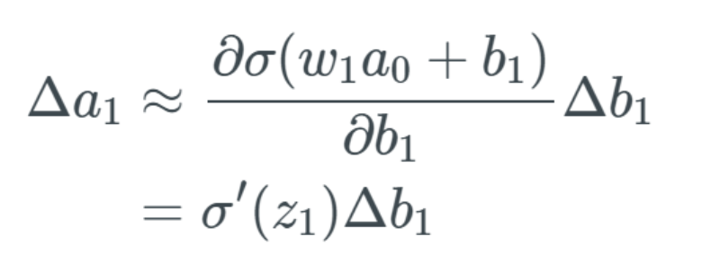

这里我们跳过了一步，但本质上讲，我们只是计算了偏导数，并用偏导的结果替代了分数部分。

a_1 的变化导致 z_2 的变化

所描述的变化 Δa_1 现在会导致下一层的输入 z_2 出现变化。如果这看起来很奇怪或者你还不信服，我建议你阅读我的前一篇文章。

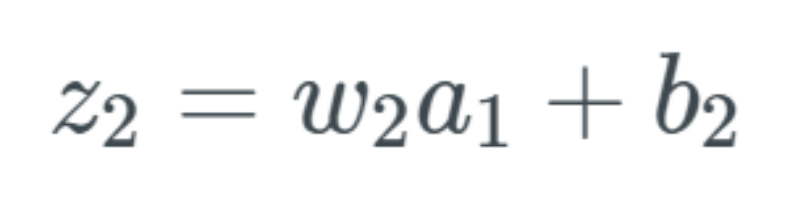

表示方式和前面一样，我们将下一个变化记为 Δz_2。我们又要再次经历前面的过程，只是这次要得到的是 z_2 中的变化：

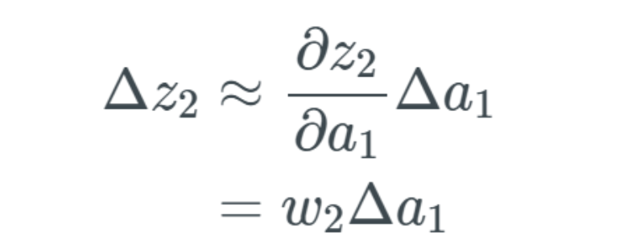

我们可以使用下式替代 Δa_1：

我们只计算这个式子。希望你清楚地明白到这一步的过程——这与计算 Δa_1 的过程一样。

这个过程会不断重复，直到我们计算完整个网络。通过替换 Δa_j 值，我们得到一个最终函数，其计算的是成本函数中与整个网络（即所有权重、偏置和激活）相关的变化。

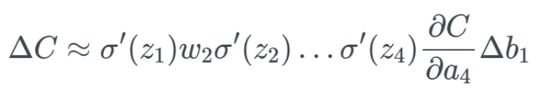

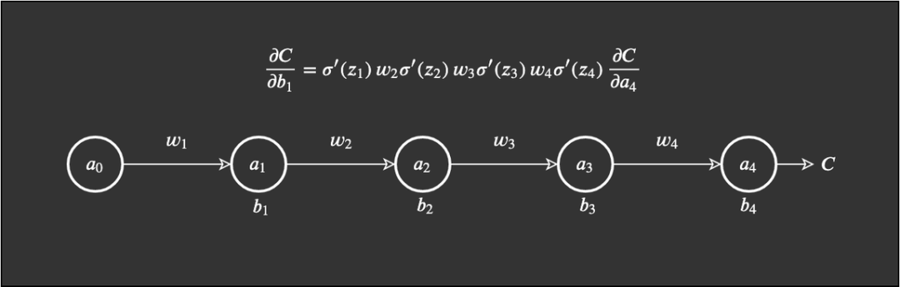

基于此，我们再计算 ∂C/∂b_1，得到我们需要的最终式：

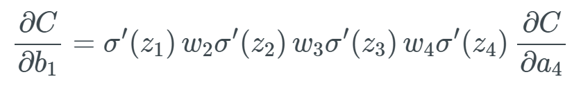

梯度爆炸的极端案例

据此，如果所有权重 w_j 都很大，即如果很多权重的值大于 1，我们就会开始乘以较大的值。举个例子，所有权重都有一些非常高的值，比如 100，而我们得到一些在 0 到 0.25 之间、 sigmoid 函数导数的随机输出：

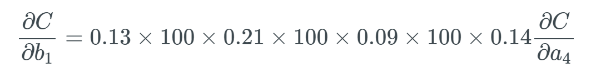

最后一个偏导为，可以合理地相信这会远大于 1，但为了方便示例展示，我们将其设为 1。

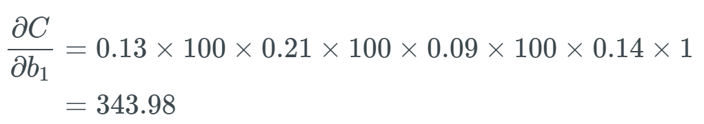

使用这个更新规则，如果我们假设 b_1 之前等于 1.56，而学习率等于 0.5。

尽管这是一个极端案例，但你懂我的意思。权重和偏置的值可能会爆发式地增大，进而导致整个网络爆炸。

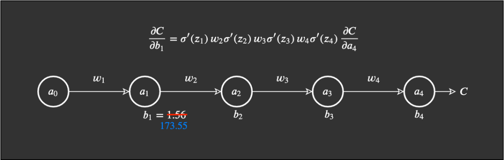

现在花点时间想想网络的权重和偏置以及激活的其它部分，爆炸式地更新它们的值。这就是我们所说的梯度爆炸问题。很显然，这样的网络学不到什么东西，因此这会完全毁掉你想要解决的任务。

避免梯度爆炸：梯度裁剪/规范

解决梯度爆炸问题的基本思路就是为其设定一个规则。这部分我不会深入进行数学解释，但我会给出这个过程的步骤：

选取一个阈值——如果梯度超过这个值，则使用梯度裁剪或梯度规范；

定义是否使用梯度裁剪或规范。如果使用梯度裁剪，你就指定一个阈值，比如 0.5。如果这个梯度值超过 0.5 或 -0.5，则要么通过梯度规范化将其缩放到阈值范围内，要么就将其裁剪到阈值范围内。

但是要注意，这些梯度方法都不能避免梯度消失问题。所以我们还将进一步探索解决这个问题的更多方法。通常而言，如果你在使用循环神经网络架构（比如 LSTM 或 GRU），那么你就需要这些方法，因为这种架构常出现梯度爆炸的情况。

整流线性单元（ReLU）

整流线性单元是我们解决梯度消失问题的方法，但这是否会导致其它问题呢？请往下看。

ReLU 的公式如下：

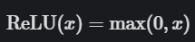

ReLU 公式表明：

如果输入 x 小于 0，则令输出等于 0；

如果输入 x 大于 0，则令输出等于输入。

尽管我们没法用大多数工具绘制其图形，但你可以这样用图解释 ReLU。x 值小于零的一切都映射为 0 的 y 值，但 x 值大于零的一切都映射为它本身。也就是说，如果我们输入 x=1，我们得到 y=1。

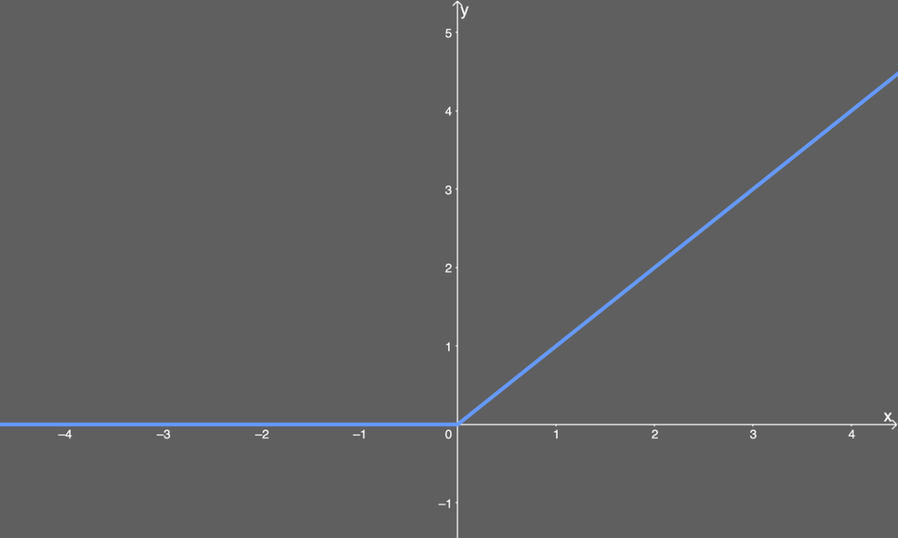

ReLU 激活函数图示。

这很好，但这与梯度消失问题有什么关系？首先，我们必须得到其微分方程：

其意思是：

如果输入 x 大于 0，则输出等于 1；

如果输入小于或等于 0，则输出变为 0。

用下图表示：

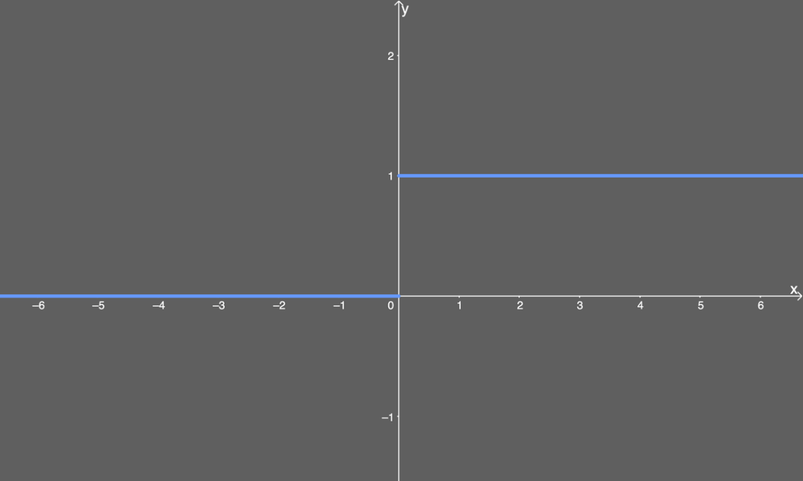

已微分的 ReLU。

现在我们得到了答案：当使用 ReLU 激活函数时，我们不会得到非常小的值（比如前面 sigmoid 函数的 0.0000000438）。相反，它要么是 0（导致某些梯度不返回任何东西），要么是 1。

但这又催生出另一个问题：死亡 ReLU 问题。

如果在计算梯度时有太多值都低于 0 会怎样呢？我们会得到相当多不会更新的权重和偏置，因为其更新的量为 0。要了解这个过程的实际表现，我们反向地看看前面梯度爆炸的示例。

我们在这个等式中将 ReLU 记为 R，我们只需要将每个 sigmoid σ 替换成 R：

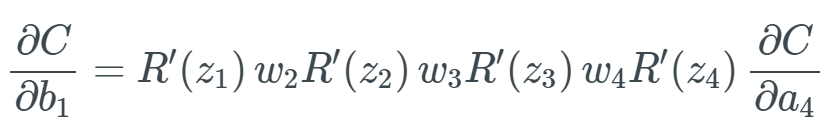

现在，假如说这个微分后的 ReLU 的一个随机输入 z 小于 0——则这个函数会导致偏置「死亡」。假设是 R'(z_3)=0：

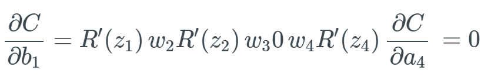

反过来，当我们得到 R'(z_3)=0 时，与其它值相乘自然也只能得到 0，这会导致这个偏置死亡。我们知道一个偏置的新值是该偏置减去学习率减去梯度，这意味着我们得到的更新为 0。

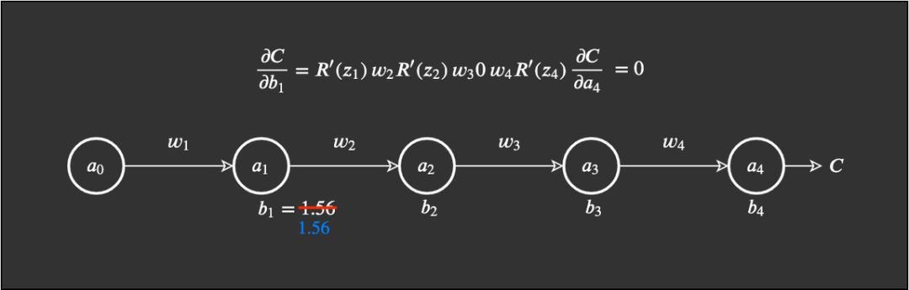

死亡 ReLU：优势和缺点

当我们将 ReLU 函数引入神经网络时，我们也引入了很大的稀疏性。那么稀疏性这个术语究竟是什么意思？

稀疏：数量少，通常分散在很大的区域。在神经网络中，这意味着激活的矩阵含有许多 0。这种稀疏性能让我们得到什么？当某个比例（比如 50%）的激活饱和时，我们就称这个神经网络是稀疏的。这能提升时间和空间复杂度方面的效率——常数值（通常）所需空间更少，计算成本也更低。

Yoshua Bengio 等人发现 ReLU 这种分量实际上能让神经网络表现更好，而且还有前面提到的时间和空间方面的效率。

论文地址：https://www.utc.fr/~bordesan/dokuwiki/_media/en/glorot10nipsworkshop.pdf

优点：

相比于 sigmoid，由于稀疏性，时间和空间复杂度更低；不涉及成本更高的指数运算；

能避免梯度消失问题。

缺点：

引入了死亡 ReLU 问题，即网络的大部分分量都永远不会更新。但这有时候也是一个优势；

ReLU 不能避免梯度爆炸问题。

指数线性单元（ELU）

指数线性单元激活函数解决了 ReLU 的一些问题，同时也保留了一些好的方面。这种激活函数要选取一个 α 值；常见的取值是在 0.1 到 0.3 之间。

如果你数学不好，ELU 的公式看起来会有些难以理解：

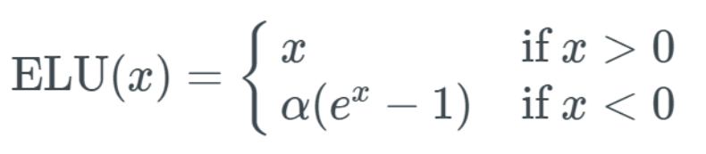

我解释一下。如果你输入的 x 值大于 0，则结果与 ReLU 一样——即 y 值等于 x 值；但如果输入的 x 值小于 0，则我们会得到一个稍微小于 0 的值。

所得到的 y 值取决于输入的 x 值，但还要兼顾参数 α——你可以根据需要来调整这个参数。更进一步，我们引入了指数运算 e^x，因此 ELU 的计算成本比 ReLU 高。

下面绘出了 α 值为 0.2 的 ELU 函数的图：

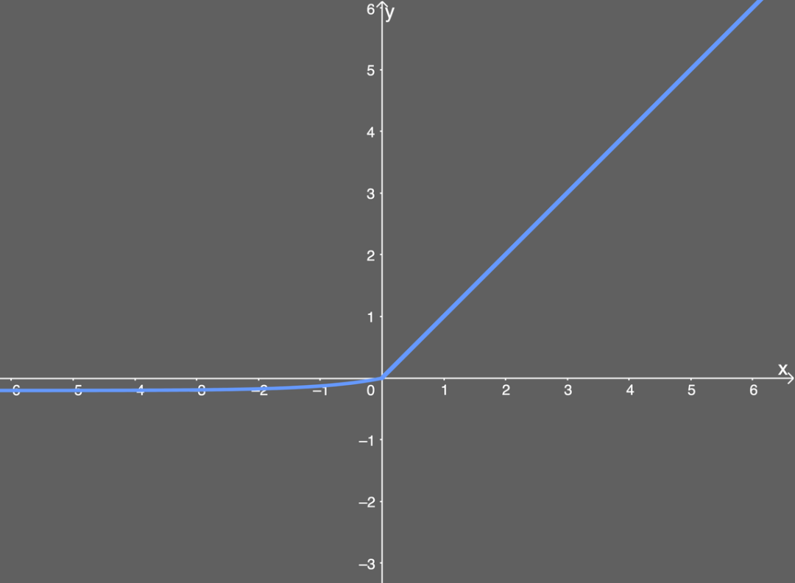

ELU 激活函数图示。

上图很直观，我们应该还能很好地应对梯度消失问题，因为输入值没有映射到非常小的输出值。

但 ELU 的导数又如何呢？这同样也很重要。

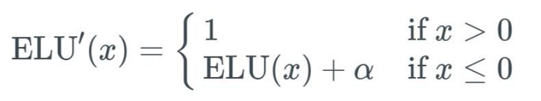

看起来很简单。如果输入 x 大于 0，则 y 值输出为 1；如果输入 x 小于或等于 0，则输出是 ELU 函数（未微分）加上 α 值。

可绘出图为：

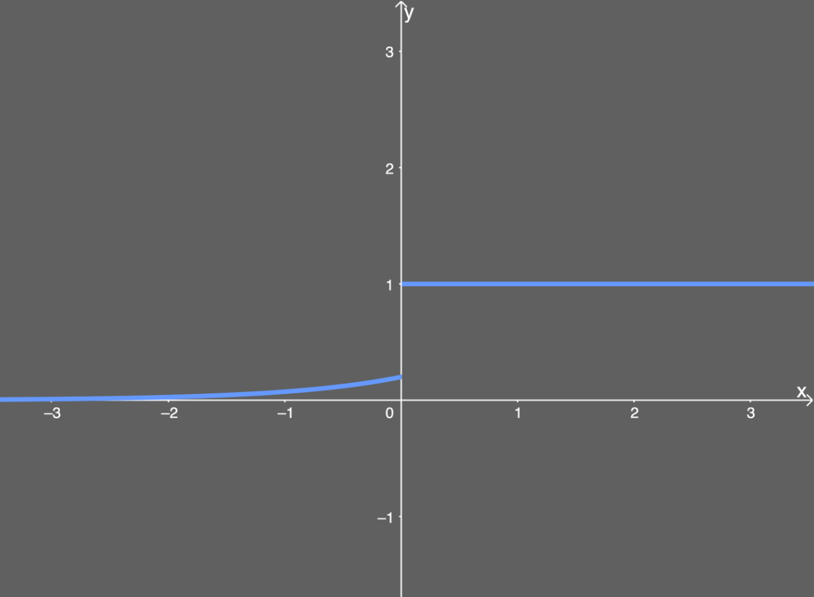

微分的 ELU 激活函数。

你可能已经注意到，这里成功避开了死亡 ReLU 问题，同时仍保有 ReLU 激活函数的一些计算速度增益——也就是说，网络中仍还有一些死亡的分量。

优点：

能避免死亡 ReLU 问题；

能得到负值输出，这能帮助网络向正确的方向推动权重和偏置变化；

在计算梯度时能得到激活，而不是让它们等于 0。

缺点：

由于包含指数运算，所以计算时间更长；

无法避免梯度爆炸问题；

神经网络不学习 α 值。

渗漏型整流线性单元激活函数（Leaky ReLU）

渗漏型整流线性单元激活函数也有一个 α 值，通常取值在 0.1 到 0.3 之间。Leaky ReLU 激活函数很常用，但相比于 ELU 它也有一些缺陷，但也比 ReLU 具有一些优势。

Leaky ReLU 的数学形式如下：

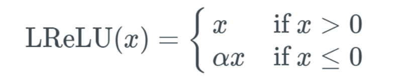

因此，如果输入 x 大于 0，则输出为 x；如果输入 x 小于或等于 0，则输出为 α 乘以输入。

这意味着能够解决死亡 ReLU 问题，因为梯度的值不再被限定为 0——另外，这个函数也能避免梯度消失问题。尽管梯度爆炸的问题依然存在，但后面的代码部分会介绍如何解决。

下面给出了 Leaky ReLU 的图示，其中假设 α 值为 0.2：

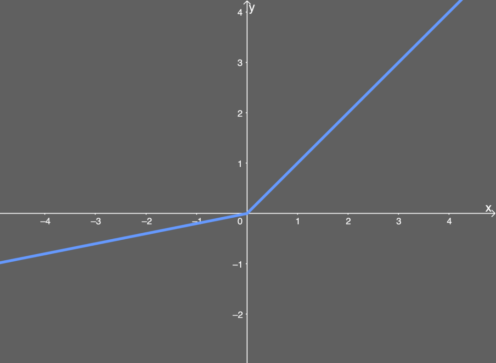

Leaky ReLU 图示。

和在公式中看到的一样，如果 x 值大于 0，则任意 x 值都映射为同样的 y 值；但如果 x 值小于 0，则会多一个系数 0.2。也就是说，如果输入值 x 为 -5，则映射的输出值为 -1。

因为 Leaky ReLU 函数是两个线性部分组合起来的，所以它的导数很简单：

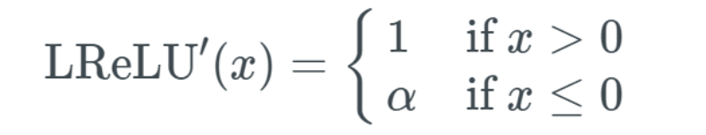

第一部分线性是当 x 大于 0 时，输出为 1；而当输入小于 0 时，输出就为 α 值，这里我们选择的是 0.2。

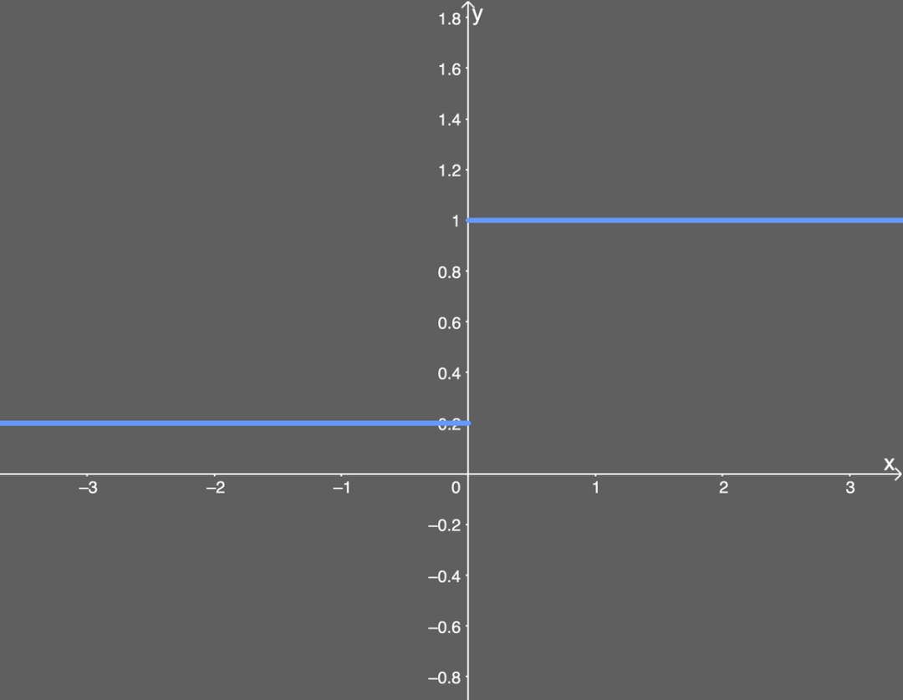

微分的 Leaky ReLU 图示。

从上图中也能明显地看出来，输入 x 大于或小于 0，微分的 Leaky ReLU 各为一个常量。

优点：

类似 ELU，Leaky ReLU 也能避免死亡 ReLU 问题，因为其在计算导数时允许较小的梯度；

由于不包含指数运算，所以计算速度比 ELU 快。

缺点：

无法避免梯度爆炸问题；

神经网络不学习 α 值；

在微分时，两部分都是线性的；而 ELU 的一部分是线性的，一部分是非线性的。

扩展型指数线性单元激活函数（SELU）

扩展型指数线性单元激活函数比较新，介绍它的论文包含长达 90 页的附录（包括定理和证明等）。当实际应用这个激活函数时，必须使用 lecun_normal 进行权重初始化。如果希望应用 dropout，则应当使用 AlphaDropout。后面的代码部分会更详细地介绍。

论文作者已经计算出了公式的两个值：α 和 λ；如下所示：

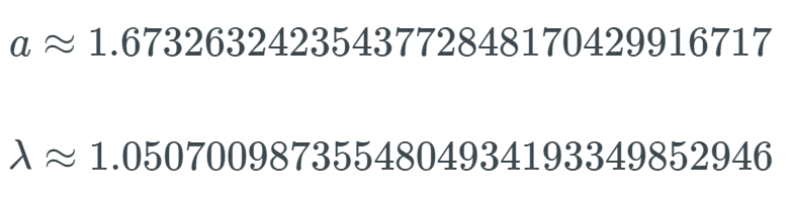

可以看到，它们的小数点后还有很多位，这是为了绝对精度。而且它们是预先确定的，也就是说我们不必担心如何为这个激活函数选取合适的 α 值。

说实话，这个公式看起来和其它公式或多或少有些类似。所有新的激活函数看起来就像是其它已有的激活函数的组合。

SELU 的公式如下：

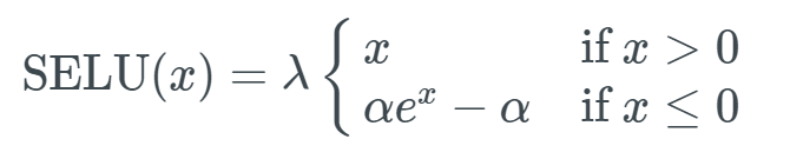

也就是说，如果输入值 x 大于 0，则输出值为 x 乘以 λ；如果输入值 x 小于 0，则会得到一个奇异函数——它随 x 增大而增大并趋近于 x 为 0 时的值 0.0848。本质上看，当 x 小于 0 时，先用 α 乘以 x 值的指数，再减去 α，然后乘以 λ 值。

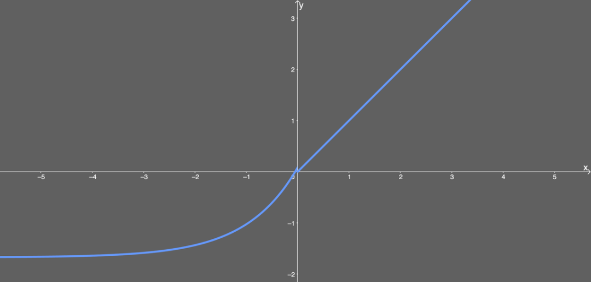

SELU 函数图示。

SELU 的特例

SELU 激活能够对神经网络进行自归一化（self-normalizing）。这是什么意思？

首先，我们先看看什么是归一化（normalization）。简单来说，归一化首先是减去均值，然后除以标准差。因此，经过归一化之后，网络的组件（权重、偏置和激活）的均值为 0，标准差为 1。而这正是 SELU 激活函数的输出值。

均值为 0 且标准差为 1 又如何呢？在初始化函数为 lecun_normal 的假设下，网络参数会被初始化一个正态分布（或高斯分布），然后在 SELU 的情况下，网络会在论文中描述的范围内完全地归一化。本质上看，当乘或加这样的网络分量时，网络仍被视为符合高斯分布。我们就称之为归一化。反过来，这又意味着整个网络及其最后一层的输出也是归一化的。

均值 μ 为 0 且标准差 σ 为 1 的正态分布看起来是怎样的？

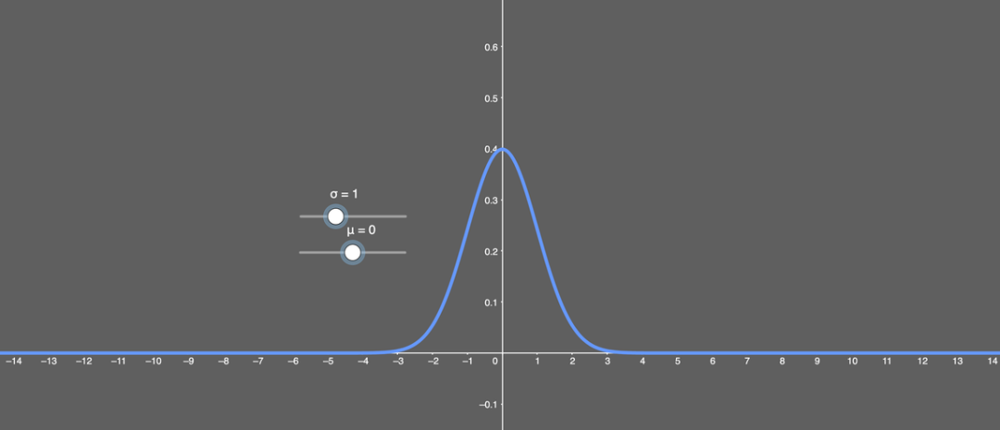

SELU 的输出是归一化的，这可称为内部归一化（internal normalization），因此事实上其所有输出都是均值为 0 且标准差为 1。这不同于外部归一化（external normalization）——会用到批归一化或其它方法。

很好，也就是说所有分量都会被归一化。但这是如何做到的？

简单解释一下，当输入小于 0 时，方差减小；当输入大于 0 时，方差增大——而标准差是方差的平方根，这样我们就使得标准差为 1。

我们通过梯度得到零均值。我们需要一些正值和负值才能让均值为 0。我的上一篇文章介绍过，梯度可以调整神经网络的权重和偏置，因此我们需要这些梯度输出一些负值和正值，这样才能控制住均值。

均值 μ 和方差 ν 的主要作用是使我们有某个域 Ω，让我们总是能将均值和方差映射到预定义的区间内。这些区间定义如下：

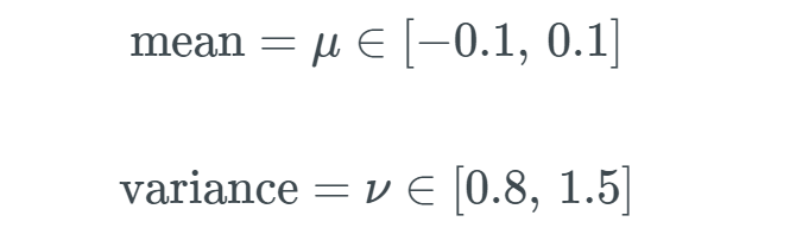

∈ 符号表示均值和方差在这些预定义的区间之内。反过来，这又能避免网络出现梯度消失和爆炸问题。

下面引述一段论文的解释，说明了他们得到这个激活函数的方式，我认为这很重要：

SELU 允许构建一个映射 g，其性质能够实现 SNN（自归一化神经网络）。SNN 不能通过（扩展型）修正线性单元（ReLU）、sigmoid 单元、tanh 单元和 Leaky ReLU 实现。这个激活函数需要有：（1）负值和正值，以便控制均值；（2）饱和区域（导数趋近于零），以便抑制更低层中较大的方差；（3）大于 1 的斜率，以便在更低层中的方差过小时增大方差；（4）连续曲线。后者能确保一个固定点，其中方差抑制可通过方差增大来获得均衡。我们能通过乘上指数线性单元（ELU）来满足激活函数的这些性质，而且 λ>1 能够确保正值净输入的斜率大于 1。

我们再看看 SELU 的微分函数：

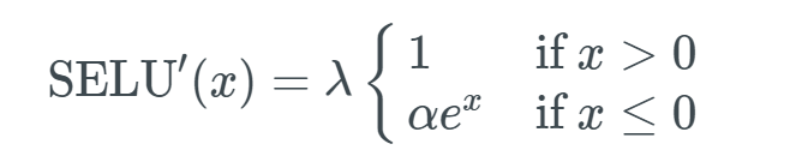

很好，不太复杂，我们可以简单地解释一下。如果 x 大于 0，则输出值为 λ；如果 x 小于 0，则输出为 α 乘以 x 的指数再乘 λ。

其图形如下所示，看起来很特别：

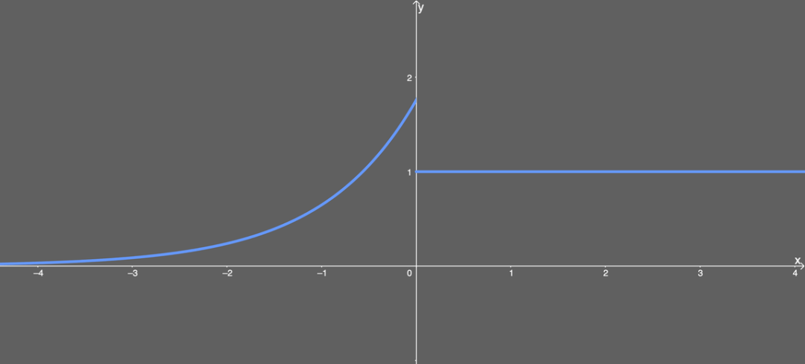

微分的 SELU 函数。

注意 SELU 函数也需要 lecun_normal 进行权重初始化；而且如果你想使用 dropout，你也必须使用名为 Alpha Dropout 的特殊版本。

优点：

内部归一化的速度比外部归一化快，这意味着网络能更快收敛；

不可能出现梯度消失或爆炸问题，见 SELU 论文附录的定理 2 和 3。

缺点：

这个激活函数相对较新——需要更多论文比较性地探索其在 CNN 和 RNN 等架构中应用。

这里有一篇使用 SELU 的 CNN 论文：https://arxiv.org/pdf/1905.01338.pdf

GELU

高斯误差线性单元激活函数在最近的 Transformer 模型（谷歌的 BERT 和 OpenAI 的 GPT-2）中得到了应用。GELU 的论文来自 2016 年，但直到最近才引起关注。

这种激活函数的形式为：

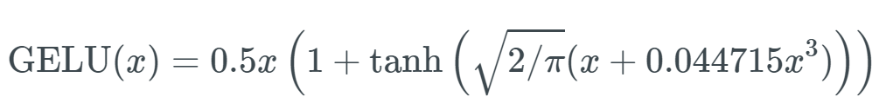

看得出来，这就是某些函数（比如双曲正切函数 tanh）与近似数值的组合。没什么过多可说的。有意思的是这个函数的图形：

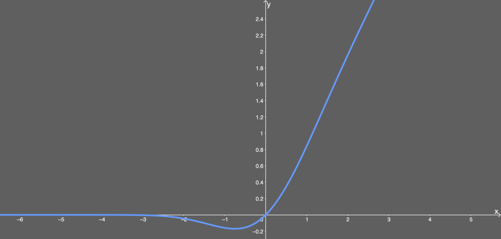

GELU 激活函数。

可以看出，当 x 大于 0 时，输出为 x；但 x=0 到 x=1 的区间除外，这时曲线更偏向于 y 轴。

我没能找到该函数的导数，所以我使用了 WolframAlpha 来微分这个函数。结果如下：

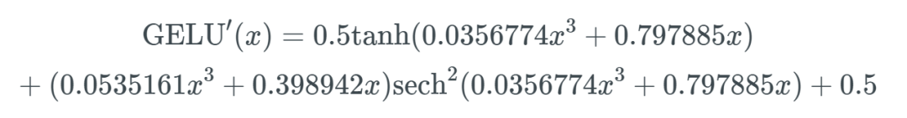

和前面一样，这也是双曲函数的另一种组合形式。但它的图形看起来很有意思：

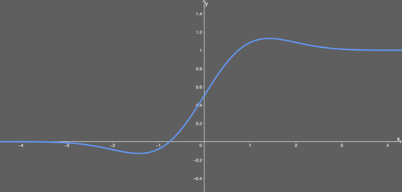

微分的 GELU 激活函数。

优点：

似乎是 NLP 领域的当前最佳；尤其在 Transformer 模型中表现最好；

能避免梯度消失问题。

缺点：

尽管是 2016 年提出的，但在实际应用中还是一个相当新颖的激活函数。

用于深度神经网络的代码

假如说你想要尝试所有这些激活函数，以便了解哪种最适合，你该怎么做？通常我们会执行超参数优化——这可以使用 scikit-learn 的 GridSearchCV 函数实现。但是我们想要进行比较，所以我们的想法是选取一些超参数并让它们保持恒定，同时修改激活函数。

说明一下我这里要做的事情：

使用本文提及的激活函数训练同样的神经网络模型；

使用每个激活函数的历史记录，绘制损失和准确度随 epoch 的变化图。

本代码也发布在了 GitHub 上，并且支持 colab，以便你能够快速运行。地址：https://github.com/casperbh96/Activation-Functions-Search

我更偏好使用 Keras 的高级 API，所以这会用 Keras 来完成。

首先导入我们所需的一切。注意这里使用了 4 个库：tensorflow、numpy、matplotlib、 keras。

import tensorflow as tf

import numpy as np

import matplotlib.pyplot as plt

from keras.datasets import mnist

from keras.utils.np_utils import to_categorical

from keras.models import Sequential

from keras.layers import Dense, Dropout, Flatten, Conv2D, MaxPooling2D, Activation, LeakyReLU

from keras.layers.noise import AlphaDropout

from keras.utils.generic_utils import get_custom_objects

from keras import backend as K

from keras.optimizers import Adam

现在加载我们运行实验所需的数据集；这里选择了 MNIST 数据集。我们可以直接从 Keras 导入它。

(x_train, y_train), (x_test, y_test) = mnist.load_data()

很好，但我们想对数据进行一些预处理，比如归一化。我们需要通过很多函数来做这件事，主要是调整图像大小（.reshape）并除以最大的 RGB 值 255（/= 255）。最后，我们通过 to_categorical() 对数据进行 one-hot 编码。

def preprocess_mnist(x_train, y_train, x_test, y_test):

  \# Normalizing all images of 28x28 pixels

  x_train = x_train.reshape(x_train.shape[0], 28, 28, 1)

  x_test = x_test.reshape(x_test.shape[0], 28, 28, 1)

  input_shape = (28, 28, 1)

  \# Float values for division

  x_train = x_train.astype('float32')

  x_test = x_test.astype('float32')

  \# Normalizing the RGB codes by dividing it to the max RGB value

  x_train /= 255

  x_test /= 255

  \# Categorical y values

  y_train = to_categorical(y_train)

  y_test= to_categorical(y_test)

  return x_train, y_train, x_test, y_test, input_shape

x_train, y_train, x_test, y_test, input_shape = preprocess_mnist(x_train, y_train, x_test, y_test)

现在我们已经完成了数据预处理，可以构建模型以及定义 Keras 运行所需的参数了。首先从卷积神经网络模型本身开始。SELU 激活函数是一个特殊情况，我们需要使用核初始化器 'lecun_normal' 和特殊形式的 dropout AlphaDropout()，其它一切都保持常规设定。

def build_cnn(activation,

​       dropout_rate,

​       optimizer):

  model = Sequential()if(activation == 'selu'):

​    model.add(Conv2D(32, kernel_size=(3, 3),

​         activation=activation,

​         input_shape=input_shape,

​         kernel_initializer='lecun_normal'))

​    model.add(Conv2D(64, (3, 3), activation=activation, 

​             kernel_initializer='lecun_normal'))

​    model.add(MaxPooling2D(pool_size=(2, 2)))

​    model.add(AlphaDropout(0.25))

​    model.add(Flatten())

​    model.add(Dense(128, activation=activation, 

​            kernel_initializer='lecun_normal'))

​    model.add(AlphaDropout(0.5))

​    model.add(Dense(10, activation='softmax'))else:

​    model.add(Conv2D(32, kernel_size=(3, 3),

​         activation=activation,

​         input_shape=input_shape))

​    model.add(Conv2D(64, (3, 3), activation=activation))

​    model.add(MaxPooling2D(pool_size=(2, 2)))

​    model.add(Dropout(0.25))

​    model.add(Flatten())

​    model.add(Dense(128, activation=activation))

​    model.add(Dropout(0.5))

​    model.add(Dense(10, activation='softmax'))

  model.compile(

​    loss='binary_crossentropy', 

​    optimizer=optimizer, 

​    metrics=['accuracy'])return model

使用 GELU 函数有个小问题；Keras 中目前还没有这个函数。幸好我们能轻松地向 Keras 添加新的激活函数。

\# Add the GELU function to Keras

def gelu(x):

  return 0.5 * x * (1 + tf.tanh(tf.sqrt(2 / np.pi) * (x + 0.044715 * tf.pow(x, 3))))

get_custom_objects().update({'gelu': Activation(gelu)})

\# Add leaky-relu so we can use it as a string

get_custom_objects().update({'leaky-relu': Activation(LeakyReLU(alpha=0.2))})

act_func = ['sigmoid', 'relu', 'elu', 'leaky-relu', 'selu', 'gelu']

现在我们可以使用 act_func 数组中定义的不同激活函数训练模型了。我们会在每个激活函数上运行一个简单的 for 循环，并将结果添加到一个数组：

result = []for activation in act_func:print('\nTraining with -->{0}<-- activation function\n'.format(activation))

  model = build_cnn(activation=activation,

​           dropout_rate=0.2,

​           optimizer=Adam(clipvalue=0.5))

  history = model.fit(x_train, y_train,

​     validation_split=0.20,

​     batch_size=128, # 128 is faster, but less accurate. 16/32 recommended

​     epochs=100,

​     verbose=1,

​     validation_data=(x_test, y_test))

  result.append(history)

  K.clear_session()del model

print(result)

基于此，我们可以为每个激活函数绘制从 model.fit() 得到的历史图，然后看看损失和准确度结果的变化情况。

现在我们可以为数据绘图了，我用 matplotlib 写了一小段代码：

new_act_arr = act_func[1:]

new_results = result[1:]def plot_act_func_results(results, activation_functions = []):

  plt.figure(figsize=(10,10))

  plt.style.use('dark_background')# Plot validation accuracy valuesfor act_func in results:

​    plt.plot(act_func.history['val_acc'])

  plt.title('Model accuracy')

  plt.ylabel('Test Accuracy')

  plt.xlabel('Epoch')

  plt.legend(activation_functions)

  plt.show()# Plot validation loss values

  plt.figure(figsize=(10,10))for act_func in results:

​    plt.plot(act_func.history['val_loss'])

  plt.title('Model loss')

  plt.ylabel('Test Loss')

  plt.xlabel('Epoch')

  plt.legend(activation_functions)

  plt.show()

plot_act_func_results(new_results, new_act_arr)

这会得到如下图表：

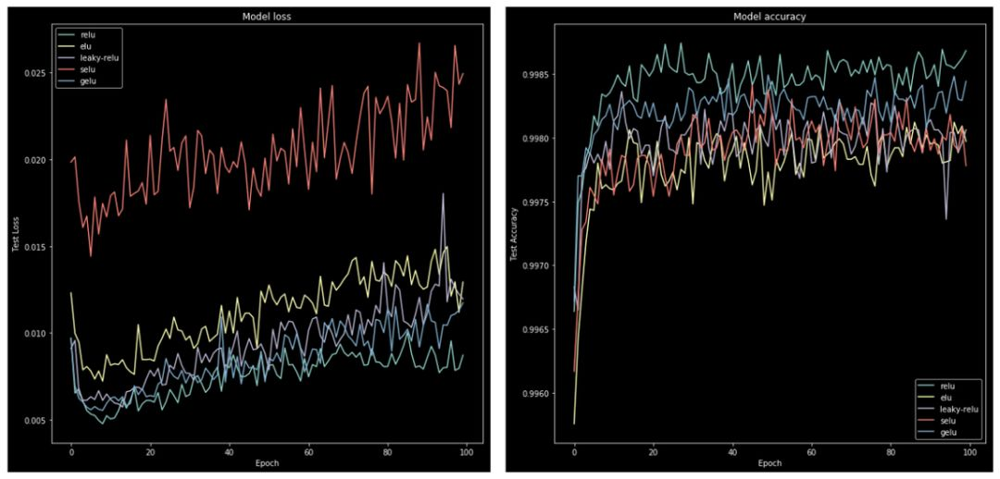

扩展阅读

下面是四本写得很赞的书：

Deep Learning，作者：Ian Goodfellow、Yoshua Bengio、Aaron Courville

The Hundred-Page Machine Learning Book，作者：Andriy Burkov

Hands-On Machine Learning with Scikit-Learn and TensorFlow，作者：Aurélien Géron

Machine Learning: A Probabilistic Perspective，作者：Kevin P. Murphy

下面是本文讨论过的重要论文：

Leaky ReLU 论文：https://ai.stanford.edu/~amaas/papers/relu_hybrid_icml2013_final.pdf

ELU 论文：https://arxiv.org/pdf/1511.07289.pdf

SELU 论文：https://arxiv.org/pdf/1706.02515.pdf

GELU 论文：https://arxiv.org/pdf/1606.08415.pdf