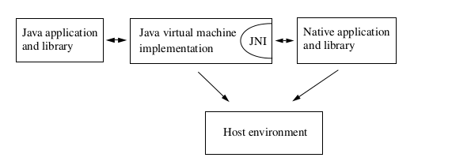

# 1. 介绍

JNI是Java平台的一个非常有用的特性,它让同时使用JAVA和C/C++协作开发应用程序成为可能。
本书既是编程指南又是JNI的参考手册，主要包括三个部分：

- 第2章通过一个小例子介绍JNI,主要是为了引导不熟悉JNI的新手入门用的。
- 第3章到第10章给出了一系列JNI特性的概述，通过一些简短的实例说明不同的JNI特性，同时也展示了一些非常有用的JNI编程技巧。
- 第11章到13章展示了所有JNI类型和函数的详细规格说明。这些章节也是作为参考手册组织的。

本书尝试满足对JNI的各种不同需求，介绍和编程指南主要为新手准备，有经验的开发者以及JNI的实现者会发现参考手册部分非常有用，本书主要的读者可能是应用程序的开发者，书中的“你”代指使用JNI编程的开发者，而不是JNI的实现者或者终端用户。

本书假定你了解Java, C 以及C++编程语言，如果你还不熟悉这其中的一门或几门语言，那赶紧看看书补补课吧，这里也给出基本经典参考：

- The Java™ Programming Language, Second Edition, by Ken Arnold and James Gosling (Addison-Wesley, 1998),
- The C Programming Language,Second Edition, by Brian Kernighan and Dennis Ritchie (Prentice Hall,1988),
- The C++ Programming Language, Third Edition, by Bjarne Stroustrup (Addison-Wesley, 1997).

本书的剩余章节介绍JNI的背景，角色和发展史。

# 1.1 Java平台与宿主环境

由于本书所提到的应用程序大都既使用JAVA编程语言，也使用C/C++编程语言编写，所以首先要弄明白这些语言编程环境的明确范围。
Java平台是一个编程环境,包括一个Java虚拟机和一套Java API. Java应用程序使用Java语言编写，被编译为设备无关的二进制类格式，一个类可以在不同的Java虚拟机上执行;Java API则包含了一系列预定义的类，任何一个Java平台都保证支持Java编程语言，Java虚拟机以及Java API.
"宿主环境“这个名词表示宿主操作系统，一系列的原生库以及CPU指令集。原生应用使用C/C++这样的原生编程语言编写，编译成为宿主相关的字节码，并需要与原生库执行链接操作。原生应用和原生库通常依赖某一个特定的宿主环境，比如C语言编写的应用程序代码，在一个操作系统上构建，通常是不能在另一个操作系统上运行的。
Java平台通常部署在宿主环境之上，例如JRE是Sun公司的支持Java平台的产品，它可以支持Solaris和Windows系统。Java 平台提供了一些列的特性，保证应用程序可以彻底的与宿主环境隔离，从而可以独立的运行。

# 1.2 JNI的角色

当Java平台被部署在宿主环境之后，Java应用程序就可以与原生代码（其他语言）协同工作了．开发者已经开始使用Java平台构建曾经使用C/C++写成的应用程序，但毫无疑问C/C++还要和Java共存很长一段时间，因为开发者舍不得他们曾经花费很大精力使用这些语言完成的代码．
JNI是一个很强大的特性，它让你既可以利用Java平台的特性，同时可以使用其他语言完成的代码．作为Java虚拟机实现一部，JNI是一种双向接口，既允许Java应程序调用原生代码，同时也允许原生代码调用Java代码．图1.1展示了JNI的角色定位．


图1.1 JNI的角色．

- JNI被设计为用于处理当你想使用Java语言和原生代码进行混合编程的场景．作为一种双向接口，JNI支持两种类型的原生代码：原生库和原生应用程序．你可以使用JNI通过原生方法允许Java应用程序调用原生库中的函数．Java应用程序对JNI函数的调用同普通的Java函数没有什么区别，而背后的实现代码，则是在原生库中．
- JNI支持一种调用接口，它允许你在原生应用代码中内嵌一个Java虚拟机实现．原生应用可以链接一个实现了Java虚拟机的原生库，然后通过这种调用接口调用使用Java语言完成的软件组件．例如，一个使用c语言实现的浏览器可以在一个内嵌的Java虚拟机中执行下载下来的Java applets.

# 1.3 使用JNI的潜在风险

一旦一个程序使用了JNI,他就丢失了两种Java平台的优势．

- 第一，使用了JNI的Java应用程序便不可以直接运行在不同的宿主环境中．即使使用Java语言编写的那部分应用程序代码是可移植的，你也必须重新编译使用原生代码完成的那部分代码．
- 第二，Java语言是类型安全的，但是C/C++则不是．所以，在用到JNI的应用程序中，你要格外的小心，一个原生方法的错误使用，可能让整个程挂掉．也是因为这个，Java应用程序中，建议在使用JNI特性之前都进行安全检查．

# 1.4 什么时候应该使用JNI

在开始讲JNI用在你的应用程序之前，最好花时间思考下是否又更合适的解决方案．毕竟使用JNI会有很潜在的风险．
当然了，有很多可选方式允许Java应用程序与其他语言完成的应用程序进行通信，例：

- 一个Java应程序可以通过TCP/IP连接或者通过其他IPC通信机制与原生应用进行通信．
- 一个Java应用可以通过JDBC连接到一个传统的数据库上．
- 一个Java应用程序可以使用Java IDL API等分布式对象策略的优势．

以上所有策略的共性就是将Java应用程序和原生代码隔离到不同的进程空间去（有的时候甚至是不同的机器上）．进程隔离提供了一种很重要的优势．进程所提供的地址空间保护可以高度的隔离运行时错误--一个崩溃了原生应用不会立即终止正在与他通过TCP/IP进行通信Java应用．

有的时候，Java应用程序和原生代码存在于相进程空间是有必要的，这也是JNI的价值所在，想象下如下场景吧：
一个应用程序需要使用一些宿主相关的特性，而这些特性是Java API不支持的．例如，一个应用程序想使用一些Java API不支持文件操作，而通过另一个进程操作文件又是繁杂且低效的．

你可能想要访问一个现存的原生库，并且不想为不同的进程之间复制或传输数据买单，毫无疑问，在同一个进程加载原生库更加高效．

一个自身跨进程实现的应用可能导致不可接受的内存占用，尤其是当这些进程需要运行在同一台宿主机器上时候．将原生库加载到一个当前存在进程中比启动一个新进程然后在那个进程中加载要消耗更少的资源．

你可能想使用低层次语言（比如汇编）实现程序中某一时间要求比较高的功能,比如一个3D应用程序大多数时间都消耗在图形渲染上，你会想要讲这部分渲染代码使用汇编语言实现来达到最号的性能．

总之，最好在你的程序必须在当前进程中与原生代码进行协作的时候使用JNI.

# 1.5 JNI的进化

Java应用程序与原生代码协作这个需求很早以前就被发现了，在Java 平台的JDK release 1.0版本的时候就包含了一系列允许Java应用程序调用其他语言的接口．很多第三方应用程序，包括Java类库（如java.lang, [java.io](http://java.io/), [java.net](http://java.net/))都依赖这些原生方法接口去访问底层宿主环境．
不幸的是，JDK release 1.0中的原生方法接口又两个主要问题：

- 第一，原生代码以C结构体成员的方式访问对象属性，然而，Java虚拟机规范并没有定义对象在内存中如何布局，如果一个Java虚拟机实现中对象的内存布局与原生库中假设的内存布局不同，那么你就不得不重新编译原生库了．
- 第二，在JDK release　1.0中原生方法可以持有一个直接指向虚拟机中对象的指针，所以它不得不依赖一种保守的垃收集器．任何一个Java虚拟机实现如果使用了比较高级的垃圾收集器，就不能支持原生方法调用了．

JNI的设计就是为了解决这些问题．它是一个可以被各种宿主环境上的所有Java虚拟机支持的接口．有了JNI:

- 每一个虚拟机实现可以支持更大体积的原生代码．
- 开发工具提供商可以不在需要处理不同类型的原生方法接口了．
- 更重要的是应用程序开发者能够只编写一个版本的原生代码就可以在不同的Java虚拟机实现上运行了．

JNI被JDK release　1.1支持，但当时的JDK release 1.1本身仍然是使用旧版本的原生方法实现Java　API的．
之后版本的JNI实现都是向后兼容的，所有未来JNI版本的演进都会保证完整的二进制兼容性．

# 1.6 示例程序

这本书包含了大量的编程实例用于展示JNI特性．这些示例程序通常由多个代码片段组成，不同的代码片段可能是Java或者C/C++语言完成．有些原生代码使用了宿主相关的特性，比如Solari以及Win32系统．同时，我们需要知道如何使用命令行工具构建JNI程序．
需要明白的是JNI的使不局限于某个特定宿主环境或者某种特定的应用开发工具．

本书关注的是写代码，而不是如何构建和运行这些代码．
原书的代码链接早没了，代码示例请参考我的github吧．
`https://github.com/leeowenowen/jni-examples.git`

以下是原书相关代码示例的描述，留个纪念吧！

```
你可以下载本书实例代码，同时可以从以链接获取到本最近更新：
[http://java.sun.com/docs/books/jni/](http://java.sun.com/docs/books/jni/)
```