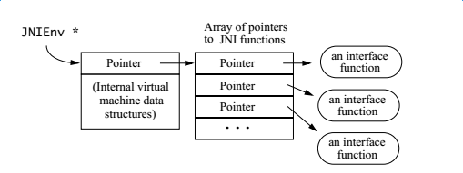
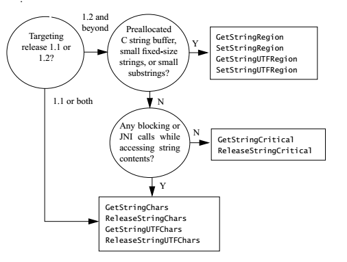
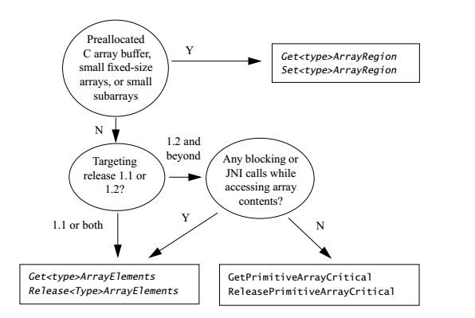

# 3. 基础类型， Strings, Arrays

开发者最经常问到的一个问题是，Java语言中的数据类型是如何映射到C/C++语言中的数据类型的。在上一个章节的"Hello World"示例中我们没有向原生方法传递任何参数，原生方法也没有任何返回值，仅仅是输出了一段信息。
在实际应用中，大多数程序需要向原生方法传递参数，并从原生方法获取方绘制。在这个章节中，我们会介绍Java语言和原生代码是如何进行数据类型转换的。我们会从integer以及像strings和arrays这种通用对象类型开始介绍。而任意类型的对象处理我们会推迟到下一个章节介绍，到时我们也会介绍原生代码是如何访问属性以及进行函数调用的。

# 3.1 一个简单的Native方法

让我们从一个与上一章节的HelloWorld相差不大的简单示例开始吧。这个示例程序，Prompt.java,包含了一个输出字符串的原生函数，等待用户输入，并且返回用户的输入内容。程序源码如下：

```
class Prompt {
  static {
    System.loadLibrary("Prompt");
  }
  private native String getLine(String prompt);
  public static void main(String[] args) {
    Prompt p = new Prompt();
    String input = p.getLine("Type a line: ");
    System.out.println("User typed: " + input);
  }
}
```

Prompt.main 通过调用原生方法Prompt.getLine来获取用户输入，静态代码段则通过调用System.loadLibrary方法来加载原生库（名字为Prompt).


# 3.1.1 Native方法实现的C语言原型

Java的Prompt.getLine函数可以用以下C函数实现：

```
JNIEXPORT jstring JNICALL Java_Prompt_getLine
  (JNIEnv *, jobject, jstring);
```

你可以使用javah命令生成相关头文件，以上的JNIEXPORT和JNICALL（在jni.h中定义）保证了C编译器可以正确的生成调用函数并将其从原生库中导出。C命名往往以“Java_”开头的形式，包括类名，函数名等，11.3节中包含了相关C函数名构成的更详细的描述。

# 3.1.2 Native方法的参数

正如2.4节简要描述的那样，像Java_Prompt_getLine这样的原生函数实现，总是比Java函数声明中多出两个标准参数。
第一个参数，JNIEnv接口指针，指向一个地址，该地址包含了指向函数表的指针。这个函数表中的每个入口包含一个指向JNI函数的指针。原生方法通常通过其中的某个函数访问虚拟机中的数据结构。图3.1展示了JNIEnv接口指针。

图3-1 JNIEnv接口指针

第二个参数则根据原生函数是否是静态函数而有所不同。如果该原生函数不是静态函数，则第二个参数对应着调用该原生函数的Java对象，这个有点像C++语言中的this指针。如果该原生函数是静态函数，则第二个参数对应着调用该原生函数的Java类。比如我们这里的示例，Java_Prompt_getLine函数，就是一个非静态函数，因此这里的jobject对象对应着发起调用的Prompt Java对象。

# 3.1.3 类型映射

原生函数声明中的参数类型与原生编程语言中的类型是相关联的。JNI定义了一系列的与Java语言中的数据类型相关联的C和C++类型。
在Java语言中有两种类型：想int,float,char这样的基础数据类型以及像类，实例对象，数组这样的引用类型（注意，Java是基于对象的语言，其中的Class,ClassLoader等本身也还是对象）。在Java语言中，字符串都是java.lang.String 类的对象。
JNI使用不同的方式处理基础数据类型和引用类型。基础数据类型的映射是直接的，例如，Java语言中的int直接映射到C/C++语言中的jint(以32位有符号整形在jni.h中定义).Java语言中的float直接映射到C/C++语言中的jfloat(以32位有符号浮点数的形式在jni.h中定义），12.1.1节包含了所有定义在JNI中的基础数据类型。
JNI以一种不透明的引用方式向原生代码传递对象，不透明的引用指的是指向Java虚拟机中内部数据对象的C语言指针。原生代码必须通过JNIEnv中定义的函数处理这些内部数据对象。例如对应java.lang.String的JNI对象是jstring.jstring引用的真实的值是与原生代码无关的。原生代码通过GetStringUTFChars来访问一个Java字符串的内容。
所有的JNI引用都是jobject类型。为了提高类型安全性以及保证使用的便利性，JNI定义了一些列引用类型，这些引用类型在概念上都是Jobject的子类型。这些子类型与Java语言中最常用的类型相关联。例如，jstring对应String, jobjectArray对应一个对象数组，12.1.2节中包含了JNI引用类型以及与其所有子类型之间继承关系的完整列表。

# 3.2 访问Strings

Java_Prompt_getLine函数以jstring类型的形式接收参数，jstring代表着Java虚拟机中的一个字符串，并且不同与C语言的string类型（一个字符类型的指针,char*).你不能直接像使用C的字符串那样使用jstring, 如果运行以下代码，你将不能得到期望的结果。事实上，通常它会让Java虚拟机直接崩溃。

```
JNIEXPORT jstring JNICALL
Java_Prompt_getLine(JNIEnv* env, jobject obj, jstring prompt){
  /*Error: incorrect use of jstrng as a char* pointer */
  printf("%s", prompt);
  ...
}
```

# 3.2.1 转换成为Native Strings

你的原生代码必须使用合适的JNI函数把jstring对象转换为C/C++字符串。JNI支持Unicode和UTF-8字符串之间的双向转换。Unicode字符串使用16个字节标识字符，而UTF-8字符串则使用一种与7位ASCII码向上兼容的加密模式。UTF-8字符串就像以NULL结尾的C字符串，即使它包含了非ASCII字符。所有值在1到127的7位ASCII字符在UTF-8中保持着同样的加密方式。一个最高位为1的字节标识着一个多字节加密的16位Unicode字符的开始。
Java_Prompt_getLine函数调用JNI函数GetStringUTFChars来读取这个字符串中的内容。GetStringUTFChar函数可以通过JNIEnv接口指针调用，它将一个代表着Java虚拟机中的Unicode字符串的jstring引用，转换成为一个UTF-8形式的C字符串。如果你可以确定原始字符串仅仅包含七位的ASCII字符，那么你可以直接把转换之后的字符串传递给C库函数，比如printf.(我们将会在8.2节讨论如何处理非ASCII字符串）。

```
#include <jni.h>

#ifdef __cplusplus
extern "C" {
#endif
/*
 * Class:     Prompt
 * Method:    getLine
 * Signature: (Ljava/lang/String;)Ljava/lang/String;
 */
JNIEXPORT jstring JNICALL Java_Prompt_getLine
  (JNIEnv * env, jobject obj, jstring prompt){
  char buf[128];
  const jbyte* str = (*env)->GetStringUTFChars(env, prompt, NULL);
  if(!str){
    return NULL;
  }
  printf("%s", str);
  (*env)->ReleaseStringUTFChars(env,prompt,str);
  /*We assume here that the user does not type more than 127 characters */
  scanf("%s", buf);
  return (*env)->NewStringUTF(env, buf);
}

#ifdef __cplusplus
}
#endif
```

不要忘了检查GetStringUTFChars的返回值，因为Java虚拟机实现需要为UTF-8字符串分配内存空间，而这个内存分配操作是可能会失败的，当这种情况发生的时候，GetStringUTFChars就会返回空并抛出OutOfMemoryError错误，如果你还想着OutOfMemoryException,问下自己是不是最近写C#代码写多了。在第6章我们会介绍，从JNI中抛出一个异常是不同于从Java语言中抛出一个异常的。一个从JNI代码中抛出的异常不会自动改变当前原生C代码的执行流程。为了跳过C函数中剩下的代码，我们需要显式的使用return返回（以上代码中的return NULL)。在Java_Prompt_getLine返回之后，异常将会从Prompt.getLine的调用函数Prompt.main中抛出。

# 3.2.2 释放Native Strings资源

当原生代码使用完了通过GetStringUTFChars获取的UTF-8字符串，你应当使用ReleaseStringUTFChars释放它。调用ReleaseStringUTFChars标识着原生代码不再需要使用从GetStringUTFChars获取的UTF-8字符串了，因此这个UTF-8字符串所占用的空间就可以被释放了。ReleaseStringUTFChars的调用失败将会导致内存泄露。

# 3.2.3 创建新的Strings

在原生代码中，你可以通过调用NewStringUTF函数构造一个全新的java.lang.String实例。NewStringUTF这个函数使用一个UTF-8格式的C字符串构造一个java.lang.String实例。新建的java.lang.String对象实例中的Unicode字符序列与UTF-8字符串中的字符序列保持一致。
如果虚拟机无法分配用于构建java.lang.String的内存，NewStringUTF将会抛出一个OutOfMemoryError异常并返回NULL.在这个实例中，我们没有必要检查NewStringUTF的返回值是因为原生代码之后就立刻返回了。如果NewStringUTF失败了，OutOfMemoryError就会从Prompt.main抛出，如果成功了，则会返回一个指向全新构建的java.lang.String的引用，然后赋值给Prompt.main中的局部变量。

# 3.2.4 String相关的其他JNI函数

除了前边介绍的GetStringUTF, ReleaseStringUTFChars以及NewStringUTF, JNI还支持很多其他的字符串操作相关的函数。
GetStringChars和ReleaseStringChars处理Unicode格式的字符串。在操作系统支持Unicode格式的原生字符串时会变得很有用。
UTF-8字符串通常以'\0'结尾，而Unicode字符串则不是。如果你想获取一个jstring引用中的Unicode字符的个数，可以使用用GetStringLength。如果你想知道以UTF-8格式保存一个jstring需要多少个字节，你可以使用GetStringUTFChars或者直接调用C函数strlen,或者直接在jstring对象引用上调用GetStringUTFLength函数。
GetStringChars和GetStringUTFChars的第三个参数需要额外解释一下，下面我们来看下它们的函数签名：
`const jchar* GetStringChars(JNIEnv* env, jstring str, jboolean* isCopy)`
如果返回的字符串是原来的java.lang.String的一份拷贝， 在GetStringChars返回之后，isCopy指向的内存地址将会被设置为JNI_TRUE。而如果返回的字符串指针直接指向原来的java.lang.String对象，则该地址会被设置为JNI_FALSE.如果返回了JNI_FALSE, 则原生代码将不能改变返回的字符串，因为改变了这个字符串，原来的java字符串也会被修改，这违背了java.lang.String实例不可改变的原则。
通常你可以直接传递NULL给isCopy来告诉Java虚拟机你不在乎返回的字符串是否指向原来Java的String对象。
我们几乎无法预测虚拟机是否拷贝了给定的Java字符串对象。因此开发者必须假定GetStringChars操作是一个耗时且占用了与给定字符串长度相同的字符空间，在通常的Java虚拟机实现中，垃圾收集器都会在堆中重定位对象。一旦一个指向java.lang.String对象指针被传递给了原生代码，垃圾收集器就不能重定向该对象了，而必须换一种处理方式，虚拟机不许绑定并跟踪这个java.lang.String实例。而过多的这种绑定会造成大量的内存碎片，虚拟机实现必须根据它自己的状况决定是为每一个GetStringChars执行字符串拷贝工作或者使用绑定跟踪策略。
在你不再使用从GetStringChars函数返回的字符串时，请记得使用ReleaseStringChars释放掉它。不论isCopy是被设置为JNI_TRUE还是JNI_FALSE,ReleaseStringChars都需要被调用。要么是释放拷贝的内存，要么是解绑定字符串实例（这样垃圾回收器就可以执行重定位与回收操作了）。

# 3.2.5 Java SDK2 中的新的String相关的JNI方法

为了让Java虚拟机有能力直接返回一个指向java.lang.String字符串的指针，Java 2SDK release 1.2推出了一组新的JNI函数。Get/ReleaseStringCritical.表面上看,他们看起来很像Get/ReleaseStringChars， 如果可能的话都会直接返回字符串的指针，否则返回这个字符串的拷贝。然后事实上，这些函数却是有各自不同的使用场景的。
你必须像对待临界区中的资源一样对待这对这对函数所处理的内容，在一个临界区中，原生代码不能调用任何JNI函数或者任何可能会阻塞当前线程的原生函数。例如，当前线程必须不能在一个被其他线程写入的I/O流上等待输入。
这些限制使得Java虚拟机在原生代码持有一个从GetStringCritical获取的字符串指针的时候使垃圾回收无效成为可能。当垃圾回收无效的时候，所有触发垃圾回收的线程都会被阻塞。在Get/ReleaseStringCritical之间的原生代码必须没有阻塞式调用或者在Java虚拟机中开辟内存。否则，Java虚拟机会发生思索，想象一下如下场景：
在当前线程结束并释放出垃圾回收权利之前一个由其他线程触发的垃圾回收操作是不能执行的。
同时，由于阻塞调用需要获取一个被另一个线程持有的锁，该线程也正在等待执行垃圾回收，当前线程不能继续执行。
重叠的多次使用GetStringCritical和ReleaseStringCritical函数是安全的，例如。

```
  jchar* s1 = (*env)->GetStringCritical(env, jstr1);
  if(!s1) {
      /* error handling */
  }
  jchar* s2 = (*env)->GetStringCritical(env, jstr2);
  if(!s2) {
      (*env)->ReleaseStringCritical(env, jstr1, s1);
      /* error handling */
  }
  /* use s1 and s2 */
  (*env)->ReleaseStringCritical(env, jstr1, s1);
  (*env)->ReleaseStringCritical(env, jstr2, s2);
```

Get/ReleaseStringCritical这对函数不需要严格的按照栈顺序嵌套使用。为了处理内存溢出异常，我们必须要对GetStringCritical的返回值做判空检查，如果Java虚拟机内部以不同的形式存储数组，那么GetStringCritical就仍然需要开辟内存用于复制字符数组内容。例如，Java虚拟机有可能没有连续的存储数组，在这种情况下，GetStringCritical必须拷贝jstring中的所有字符来以保证返回给原生代码的字符串是一个连续的字符数组。
为了避免死锁，你必须保证原生代码在调用GetStringCritical之后以及调用ReleaseStringCritical之前没有调用任何JNI函数，除了重叠调用的Get/ReleaseStringCritical函数。
JNI并不支持GetStringUTFCritical和ReleaseStringUTFCritical函数，这样的函数将会总是需要虚拟机为字符串开辟空间并做必须的转换和赋值，因为大多数的虚拟机内部实现都是使用Unicode格式标识字符串的。
Java 2SDK release 1.2中另一组增加的函数是GetStringRegion和GetStringUTFRegion.这些函数将字符串内容拷贝到一个预先申请好的缓冲区中。Prompt.getLine函数也可以使用GetStringUTFRegion如下实现：

```
JNIEXPORT jstring JNICALL Java_Prompt_getLine
  (JNIEnv * env, jobject obj, jstring prompt){
  /* assume the prompt string and user input has less than 128 characters */
  char outbuf[128], inbuf[128];
  int len = (*env)->GetStringLength(env, prompt);
  (*env)->GetStringUTFRegin(env, prompt, 0, len, outbuf);
  printf("%s", output);
  scanf("%s", inbuf);
  return (*env)->NewStringUTF(env, inbuf);
}
```

GetStringUTFRegion函数需要一个开始索引和长度，都按Unicode字符的数量计算。这个函数也会进行边界检查，如果有需要，它会抛出StringIndexOutOfBoundsException. 在以上代码示例中， 我们从原始字符串获取它的长度，所以我们确定不会出现下标越界的状况。（当然了，我们只是通过注释假定字符串prompt的长度小于128,并没有从代码上检验）。
看起来代码比GetStringUTFChars要简单一点， 因为GetStringUTFRegion没有开辟内存，我们不需要检查out-of-memory这种状况。（同样，以上代码缺少对用户输入少于128个字节的检查）。

# 3.2.6 NI String函数总结

表3.1总结了所有字符串相关的JNI函数，Java 2 SDK 1.2 release 为了特定场景的字符串操作的高效性新增了很多新的函数， 而这些新增函数也只是为了提高性能，所以不要问为啥有这么多各种各样的字符串操作函数在JNI里边。

| JNI 函数                  | 描述                                                         | 加入版本     |
| :------------------------ | :----------------------------------------------------------- | :----------- |
| Get/ReleaseStringChars    | 获取或者释放一个Unicode格式的字符串，可能返回原始字符串的拷贝 | JDK1.1       |
| Get/ReleaseStringUTFChars | 获取或者释放一个UTF-8格式的字符串，可能返回原始字符串的拷贝  | JDK1.1       |
| GetStringLength           | 返回Unicode字符串的字符个数                                  | JDK1.1       |
| GetStringUTFLength        | 返回用于表示某个UTF-8字符串所需要的字节个数（不包括结束的0） | JDK1.1       |
| NewString                 | 创建一个java.lang.String对象，该对象与指定的Unicode字符串具有相同的字符序列 | JDK1.1       |
| NewStringUTF              | 创建一个java.lang.String对象，该对象与指定的UTF-8字符串具有相同的字符序列 | JDK1.1       |
| Get/ReleaseStringCritical | 获取或者释放一个Unicode格式的字符串的内容，可能返回原始字符串的拷贝，在Get/ReleaseStringCritical之间的代码必须不能阻塞 | Java2 SDK1.2 |
| Get/SetStringRegion       | 将一个字符串拷贝到预先开辟的空间，或者从一个预先开辟的空间复制字符串，字符使用Unicode编码 | Java2 SDK1.2 |
| Get/SetStringUTFRegion    | 将一个字符串拷贝到预先开辟的空间，或者从一个预先开辟的空间复制字符串，字符使用UTF-8编码 | Java2 SDK1.2 |

# 3.2.7 在String函数中选择

图3.2展示了一个程序员如何在字符串相关的函数中做选择。

图3.2 在JNI字符串函数中做选择。

如果你想让你的代码发布在JDK1.1的目标平台上，除了Get/ReleaseStringChars和Get/ReleaseStringUTFChars你毫无选择。
如果你是在Java 2 SDK release 1.2及其以上版本上编程，你想讲字符串内容拷贝到事先分配好的内存中区，你可以使用GetStringRegion或者GetStringUTFRegion.
对于很小的固定大小的字符串，Get/SetStringRegion和Get/SetStringUTFRegion往往更优因为你可以在C堆栈上开辟空间，这样的代价相对来说小得多了，拷贝一个小字符串的代价是微乎其微的。
使用Get/SetStringRegion和Get/SetStringUTFRegion的一个好处是它们不必开辟内存空间，因此也就不会抛出out-of-memory相关的异常。如果你可以确定下标越界这种情况不会发生你就永远不需要进行检查。
使用Get/SetStringRegion和Get/SetStringUTFRegion的另一个好处是你可以指定要拷贝的字符串在原始字符串中的其实位置以及要拷贝的字符个数。这个函数适用于那些只需要访问一个比较长的字符串的部分子字符串的场景。
GetStringCritical必须被小心的使用，必须保证在持有GetStringCritical返回的指针的过程中，原生代码没有在虚拟机中开辟任何新的空间，而且不能执行任何阻塞式操作，否则有可能会引起死锁。
以下是使用GetStringCritical的错误示例，以下函数使用GetStringCritical获取了一个字符串，然后调用fprint函数将这个字符串输出到指定的文件描述符fd。

```
/* This is not safe! */
const char* c_str = (*env)->GetStringCritical(env, j_str, 0);
i(!c_str) {
  /* error handling */
}
fprintf(fd, "%s\n", c_str);
(*env)->ReleaseStringCritical(env, j_str, c_str);
```

以上代码的问题在于当当前线程的垃圾回收被禁止的时候， 写入一个文件并不总是安全的。举个例子，假设另一个线程T正在等待从fd 对应的文件读取内容。让我们跟进一步假设文件系统的缓冲机制的实现是这样的：fprintf调用会一直等待线程T完成从fd读取所有数据。 我们创建了一个可能产生死锁的场景：如果线程T不能够开辟足够的空间来缓存从fd读取的内容，它就必须发起一次垃圾回收请求。但是垃圾回收请求又必须等到当前线程执行ReleaseStringCritical函数，而按照我们以上代码，这个操作在frpintf返回之前是不可能被调用的，这样的话fprintf函数就会一直等待。
以下代码，与上边的示例代码相似，但是他是不会产生任何死锁的：
/*This code segment is OK。*/
const char *c_str = (*env)->GetStringCritical(env, j_str, 0);
if(!c_str) {
/* error handling */
}
DrawString(c_str);
(*env)->ReleaseStringCritical(env, j_str, c_str);
DrawString是一个系统API调用， 它直接将字符串输出到屏幕。除非屏幕显示器的驱动也是跟当前代码在同一个Java虚拟机中运行的Java程序，DrawString函数是永远不会阻塞或者无限等待垃圾回收的。
总的来说，在使用Get/ReleaseStringCritical函数调用的时候，你㤇尽可能的多考虑你的代码是否会发生阻塞场景。

# 3.3 访问Arrays

JNI以不同的方式处理基础类型数组和对象数组。基础类型数组由int,boolean这样的基础类型组成。对象数组则由对象实例或者其他数组的引用组成。例如在以下的Java代码段中：

```
int[] arr;
float[] farr;
Object[] oarr;
int[][] arr2;
```

iarr和farr是基础类型数组，而oarr, arr2则是对象数组。
在原生函数中访问基础累心搞定数组需要使用一些JNI函数（就像你访问字符串那样）。让我们先从一个简单的示例看起。以下原生代码sumArray作用是对一个数组中的整型元素求和。

```
class IntArray {
  static {
    System.loadLibrary("IntArray");
  }
  private native int sumArray(int[] arr);
  public static void main(String[] args) {
    IntArray p = new IntArray();
    int[] arr = new int[10];
    for (int i = 0; i < 10; i ++) {
      arr[i] = i;
    }
    int sum = p.sumArray(arr);
    System.out.println("sum = " + sum);
  }
}
```

# 3.3.1 在C语言中操作数组

在JNI中使用jarray以及像jintArray等子类表示数组。正如jstring不是一个C的字符串类型，jarray也不是C的数组类型。你不能在Java_IntArray_sumArray的实现代码中通过jarray间接引用其组成元素。以下C代码是不合法的，也不会产出预期的结果：

```
/* This program is illegal! */
JNIEXPORT jint JNICALL Java_IntArray_sumArray(JNIEnv* env, jobject obj, jintArray arr) {
  int i, sum = 0;
  for(i = 0; i < 10; i ++){
    sum += arr[i]
  }
}
```

你必须使用相应的JNI函数来访问数组元素，就像下边展示的那样：

```
/*
 * Class:     IntArray
 * Method:    sumArray
 * Signature: ([I)I
 */
JNIEXPORT jint JNICALL Java_IntArray_sumArray
  (JNIEnv * env, jobject obj, jintArray arr) {
  jint buf[10];
  jint i, sum = 0;
  (*env)->GetIntArrayRegion(env, arr, 0, 10, buf);
  for (int i =0; i < 10; i ++){
    sum += buf[i];
  }
  return sum;
}
```

编译以上代码请添加-std=c99

> gcc -I/home/wangli/env/jdk8/usr/java/jdk1.8.0_20/include -I/home/wangli/env/jdk8/usr/java/jdk1.8.0_20/include/linux IntArray.c -shared -o [libIntArray.so](http://libintarray.so/) -fPIC -std=c99

# 3.3.2 访问基础类型的数组

之前使用GetIntArrayRegion函数的示例会将int数组中的所有元素拷贝到一个C缓冲区中。第三个参数是数组的起始下表，第四个参数是需要拷贝的元素个数。只有当数组元素被拷贝到C数组中之后，我们才能在原生代码中访问它。在我们的示例中数组的长度很明确，就是10，所以我们就没有进行必要的异常检查。
JNI支持另一个函数SetIntArrayRegion允许原生代码修改int数组中的元素。其他的基础数据类型也是被支持的（如boolean,short和float).
JNI支持一组函数Get/ReleaseArrayElements函数（包括像Get/ReleaseIntArrayElements)允许原生代码获取一个指向原始类型数组的指针。由于底层的垃圾回收机制不支持内存追溯机制，所以虚拟机可能会返回原始数组的一份拷贝。我们可以使用GetIntArrayElements重写3.3.1节的示例。

```
/*
 * Class:     IntArray
 * Method:    sumArray
 * Signature: ([I)I
 */
JNIEXPORT jint JNICALL Java_IntArray_sumArray
  (JNIEnv * env, jobject obj, jintArray arr) {
  jint i, sum = 0;
  jint* carr = (*env)->GetIntArrayElements(env, arr, NULL);
  if(!carr) {
    return 0; /* exception occurred */
  }
  for (int i =0; i < 10; i ++){
    sum += carr[i];
  }
  (*env)->ReleaseIntArrayElements(env, arr, carr, 0);
  return sum;
}
```

另有一个GetArrayLength函数返回基础类型或对象数组中的元素个数。数组的长度是固定不可变的，数组第一次分配的时候它的长度就被决定了。

Java 2 SDK release 1.2 引入了Get/ReleasePrimitiveArrayCritical函数。这些函数允许虚拟机在原生代码访问基础类型数组的时候禁止垃圾回收。在使用这组函数的时候，开发者必须像Get/ReleaseStringCritical那样小心。在Get/ReleasePrimitiveArrayCritical函数中，原生代码必须不能调用任何JNI函数或者执行任何阻塞操作，那可能引起应用程序死锁。

# 3.3.3 JNI基础类型数组操作函数总结

表3.2是数组相关的JNI函数的总结。Java 2 SDK release 1.2 增加了一些新的的函数用于提高特定使用场景下的JNI性能，这些新增的函数除了在特定场景下对性能有所提升之外，并没有什么别的不同。
表3.2 JNI基础类型数组函数总结

| JNI函数                           | 描述                                                         | 加入版本       |
| :-------------------------------- | :----------------------------------------------------------- | :------------- |
| Get/SetArrayRegion                | 复制基础类型数组的内容到C缓冲区或者将C缓冲区的内容设置到基础类型数组中去 | JDK1.1         |
| Get/ReleaseArrayElements          | 获取/释放指向基础类型数组内容的指针，可能返回原始数组内容的拷贝 | JDK1.1         |
| GetArrayLength                    | 返回数组中元素的个数                                         | JDK1.1         |
| NewArray                          | 创建指定长度的数组                                           | JDK1.1         |
| Get/ReleasePrimitiveArrayCritical | 获取或释放基础类型数组的内容，可能禁止垃圾回收，可能返回原始数组的一份拷贝 | Java 2 SDK 1.2 |

# 3.3.4 如何在基础类型数组函数中做选择

图3.3展示了开发者应当如何在基础类型数组相关的JNI函数中进行选择。

图3-3 如何在基础类型数组函数之间选择
如果你需要将数组内容拷贝到一个预先分配内存的C缓冲区中，或者要从C缓冲区中读取数组内容，请使用Get/SetArrayRegion系列函数。
这些函数会进行边界检查，在必要的时候还会抛出ArrayIndexOutOfBoundsException异常。3.3.1节的原生代码示例就使用GetIntArrayRegion从一个jarray引用中复制出了10个元素。
对于小的，固定长度的数组，通常推荐使用Get/SetArrayRegion函数，因为在使用的时候我们可以在C堆栈上开辟数组内容，这样做的代码通常会小很多。拷贝少量的数组元素的代价通常是可以忽略不计的（非常小)。
同时，Get/SetArrayRegion函数允许你指定需要操作的起始索引以及要操作的元素数目，因此，如果原生代码需要访问一个比较大的数组的部分子元素的话，我们推荐使用这组函数。
如果你没有事先分配好内存的C混冲去，基础类型数组的大小是未知的且在持有指向数组内容指针的过程中原生代码不会被阻塞，在Java 2 SDK release1.2中我们推荐使用Get/ReleasePrimitiveArrayCritical函数，。就像Get/ReleaseStringCritical函数那样， 在使用Get/ReleasePrimitiveArrayCritical函数的时候你需要格外的小心，因为你的操作有可能导致死锁。
使用Get/ReleaseArrayElements系列函数通常是安全的。虚拟机通常会返回指向数组元素的指针或者返回一个指向复制了原始数组元素的缓冲区的指针。

# 3.3.5 访问对象数组

JNI为访问对象数组单独提供了一组函数。GetObjectArrayElement返回指定下表的元素， 而SetObjectArrayElement则修改指定索引上的元素。与基础类型数组不同的是，你不能一次获取或者拷贝对象数组中的所有元素。
字符串和数组是引用类型，你需要使用Get/SetObjectArrayElement来访问字符串数组或者数组的数组。
以下示例代码通过调用原生代码创建了一个int型的二位数组，并打印出这个数组中的所有元素。

```
class ObjectArrayTest {
  static {
    System.loadLibrary("ObjectArrayTest");
  }
  private static native int[][] initInt2DArray(int size);
  public static void main(String[] args) {
      int[][] i2arr = initInt2DArray(3);
      for (int i =0; i < 3; ++i) {
        for (int j = 0; j < 3; j ++) {
          System.out.print(" " + i2arr[i][j]);
        }
        System.out.println();
      }
  }
}
```

静态函数initInt2DArray根据给定长度创建了一个二维数组。原生函数负责开辟和初始化这个二维数组，实现如下：

```
/*
 * Class:     ObjectArrayTest
 * Method:    initInt2DArray
 * Signature: (I)[[I
 */
JNIEXPORT jobjectArray JNICALL Java_ObjectArrayTest_initInt2DArray
  (JNIEnv * env, jclass cls, jint size) {
  jobjectArray result;
  int i;
  jclass intArrCls = (*env)->FindClass(env, "[I");
  if(!intArrCls) {
    return NULL; /* exception thrown */
  }
  result = (*env)->NewObjectArray(env, size, intArrCls, NULL);
  if(!result) {
    return NULL; /* out of memory error thrown */
  }
  for (i = 0; i < size; ++i) {
    jint tmp[256]; /* make sure it is large enough! */
    int j;
    jintArray iarr = (*env)->NewIntArray(env, size);
    if(!iarr) {
      return NULL;
    }
    for (j = 0; j < size; j ++) {
      tmp[j] = i + j;
    }
    (*env)->SetIntArrayRegion(env, iarr, 0, size, tmp);
    (*env)->SetObjectArrayElement(env, result, i, iarr);
    (*env)->DeleteLocalRef(env, iarr);
  }
  return result;
}
```

> 请使用以下命令构建，路径需要修改：
> gcc -I/home/wangli/env/jdk8/usr/java/jdk1.8.0_20/include -I/home/wangli/env/jdk8/usr/java/jdk1.8.0_20/include/linux ObjectArrayTest.c -shared -o [libObjectArrayTest.so](http://libobjectarraytest.so/) -fPIC -std=c99

newInt2DArray函数首先调用FindClass获取一个二维int数组的类的引用。"[I"参数是int[]类型对应的JNI类描述符，我们会在12.3.2节讲解。如果累加载失败的话，FindClass会返回NULL并抛出异常（比如找不到类文件或者发生了out-of-memory错误）。
接下来使用NewObjectArray函数分配了一个数组，数组中的每一个元素的都是intArrCls对应的类型。NewObjectArray函数仅仅分配二维数组中的第一维，我们还需要填充二维数组的第二维。一个二维数组可以简单的理解为数组的数组。
用于创建二维数组的第二维的代码是非常直接的，NewIntArray分配独立的数组元素，SetIntArrayRegion则复制tmp[]缓冲区中的数据到全新构建的一维数组中去。在完成SetObjectArrayElement调用之后，第i个一维数组中的第j个元素的值是i+j.
运行ObjectArrayTest.main方法，将会产生如下输出：

```
0 1 2
1 2 3
2 3 4
```

循环最后的DeleteLocalRef函数调用是为了确保虚拟机不会因为需要持有大量像iarr这样的JNI引用而发生out-of-memory异常。在5.2.1章中我们会详细介绍为什么需要使用DeleteLocalRef以及应该在什么时候调用。

