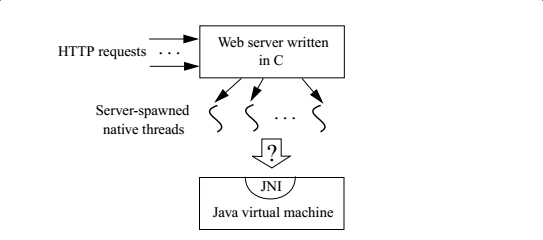

# 7. The Invocation Interface

本章主要介绍如何在你的Native代码中嵌入一个Java虚拟机。Java虚拟机实现通常以Native库的方式实现，Native应用可以以加载该Native库的方式加载Java虚拟机。事实上，标准的启动命令`java`命令就是一个简单的链接Java虚拟机实现的C程序，这个启动程序解析命令行参数，加载虚拟机并通过Invocation Interface执行Java应用程序。

# 7.1 创建Java虚拟机

为了说明Invocation interface,我们先来看一个加载java虚拟机并调用Prog.main函数的C程序，Prog类如下：

```
public class Prog {
  public static void main(String[] args) {
    System.out.println("Hello World " + args[0]);
  }
}
```

以下的C程序invoke.c，用于加载Java虚拟机并调用Prog.main函数。

```
#define _JNI_IMPLEMENTATION_
#include <jni.h>
#define PATH_SEPERATOR ";" /* define it to be ':' on Solaris */
#define USER_CLASSPATH "." /* where Prog.class is */
#ifdef __cplusplus
extern "C" {
#endif
void destroy(JNIEnv* env, JavaVM *jvm){
  if ((*env)->ExceptionOccurred(env)) {
    (*env)->ExceptionDescribe(env);
  }
  (*jvm)->DestroyJavaVM(jvm);
}
int main() {
  JNIEnv *env;
  JavaVM *jvm;
  jint res;
  jclass cls;
  jmethodID mid;
  jstring jstr;
  jclass stringClass;
  jobjectArray args;
#ifdef JNI_VERSION_1_2
  JavaVMInitArgs vm_args;
  JavaVMOption options[1];
  options[0].optionString = "-Djava.class.path=" USER_CLASSPATH;
  vm_args.version = 0x00010002;
  vm_args.options = options;
  vm_args.nOptions = 1;
  vm_args.ignoreUnrecognized = JNI_TRUE;
  /* Create the Java VM */
  res = JNI_CreateJavaVM(&jvm, (void**)&env, (void*)&vm_args);
#else 
  JDK1_1InitArgs vm_args;
  char classpath[1024];
  vm_args.version = 0x00010001;
  JNI_GetDefaultJavaVMInitArgs(&vm_args);
  /* Append USER_CLASSPATH to the default system class path */
  sprintf(classpath, "%s%c%s", vm_args.classpath, PATH_SEPERATOR, USER_CLASSPATH);
  vm_args.classpath = classpath;
  /* Create the Java VM */
  res = JNI_CreateJavaVM(&jvm, &env, &vm_args);
#endif /* JNI_VERSION_1_2 */
  if (res < 0){
    fprintf(stderr, "Can't create Java VM\n");
    return 1;
  }
  cls = (*env)->FindClass(env, "Prog");
  if(!cls){
    destroy(env, jvm);
    return 1;
  }

  mid = (*env)->GetStaticMethodID(env, cls, "main", "([Ljava/lang/String;)V");
  if(!mid){
    destroy(env, jvm);
    return 1;
  }

  jstr = (*env)->NewStringUTF(env, " From C!");
  if(!jstr){
    destroy(env, jvm);
    return 1;
  }
  stringClass = (*env)->FindClass(env, "java/lang/String");
  args = (*env)->NewObjectArray(env, 1, stringClass, jstr);
  if(!args){
    destroy(env, jvm);
    return 1;
  }

  (*env)->CallStaticVoidMethod(env, cls, mid, args);

  destroy(env, jvm);
  return 0;
}

#ifdef __cplusplus
}
#endif
```

以上代码中使用宏来判断JDK版本，并根据版本调用不同的JDK初始化函数，目前最新的已经是JDK_VERSION_1_8了，初始化API为JavaVMInitArgs(与JDK_VERSION_1_2相同）。
当构建的target为1.2，C代码首先创建一个JavaVMInitArgs结构，虚拟机的初始化参数存储在JavaVMOption数组中，你可以使用普通的选项（比如-Djava.class.path=.)或者java命令相关的选项（比如-Xmx64m)，设置ignoreUnrecognized数位为JNI_TRUE标识让虚拟忽略其不认识的选项。
在设置完虚拟机初始化结构体之后，C程序调用JNI_CreateJavaVM函数来加载和初始化Java虚拟机，这个函数会有两个输出：

- 一个接口指针jvm，指向最新创建的Java虚拟机。
- 当前线程的JNIEnv接口指针env。所有的JNI函数访问都需要通过env。
  当JNI_CreateJavaVM函数成功的返回之后，当前的Native线程就已经将自己引导入了Java虚拟机。此时，它就像在执行一个Native方法，因此，它可以发起JNI调用来触发Prog.main函数。
  最后程序调用了DestroyJavaVM函数用于卸载虚拟机，不幸的是你不能够在JDK1.1或者JDK1.2中卸载Java虚拟机，因为在这两个版本中，DestroyJavaVM函数会一直返回错误码。运行以上程序将会输出：

```
Hello World from C!
```

# 7.2 链接ava虚拟机到Native应用程序

Invocation interface要求必须把应用程序链接到一个Java虚拟机实现。如何链接Java虚拟机是根据实际需要而定的，你可能想要把程序部署到一个特定的Java虚拟机上，或者想要部署到来自不同厂商的多个Java虚拟机。

# 7.2.1 链接某个确定的虚拟机实现

你可能已经确定了你的Native应用只会部署在某个特定的Java虚拟机实现上，这种情况下你就可以直接将应用程序与虚拟机所在的Native库进行链接。
`gcc -I/home/wangli/env/jdk8/usr/java/jdk1.8.0_20/include -I/home/wangli/env/jdk8/usr/java/jdk1.8.0_20/include/linux -L/home/wangli/env/jdk8/usr/java/jdk1.8.0_20/jre/lib/amd64/server invoke.c -ljvm`

记得把libjvm.so所在的目录加入LD_LIBRARY_PATH.
`export LD_LIBRARY_PATH=$LD_LIBRARY_PATH:/home/wangli/env/jdk8/usr/java/jdk1.8.0_20/jre/lib/amd64/server`

# 7.2.2链接未知虚拟机

你不能同时链接来自不同厂商的多个具有Java虚拟机实现的库。因为JNI没有指定Java虚拟机实现库的名字，你需要自己处理不同名字的Java虚拟机实现库。例如，在Win32上，JDK1.1版本的Java虚拟机库是javai.dll而JDK2中则叫做jvm.dll.

解决方案是应用程序运行时动态加载特点的某个虚拟机库。这样的话，虚拟机库的名字就可以通过应用程序被简单的配置，例如，以下的Win32代码用于给定虚拟机库的路径查找JNI_CreateJavaVm函数的入口。

```
/* Win32 version */
void *JNU_FindCreateJavaVM(char* vmlibpath){
  HINSTANCE hVM = LoadLibrary(vmlibpath);
  if(!hVM){ return; }
  return GetProcessAddress(hVM, "JNI_CreateJavaVM");
}
```

LoadLibrary和GetProcessAddress是Win32上的用于动态链接的API函数。加载动态库的函数通常可以传递库名字或者库的完成路径，如果传递的参数不是完成路径，则需要做一些配置（比如将库所在目录加入环境变量PATH)
Solaris版本的代码也很类似。
/* Solaris version */
void *JNU_FindCreateJavaVM(char* vmlibpath){
void *libVM = dlopen(vmlibpath, RTLD_LAZY);
if(!libVM){return;}
return dlsym(libVM, "JNI_CreateJavaVM");
}

# 7.3 绑定Native线程

假定你又一个多线程应用程序，比如C实现的Web服务器。Http请求道来的时候，服务器创建了一定数目的Native线程用于并发的处理这些Http请求。我们想要在这个Wev服务器中嵌入一个Java虚拟机，这样多线程就可以同时在Java虚拟机中执行任务了。处理流程如下图所示：


服务器衍生出的Native方法的生命周期可能比Java虚拟机中的线程要短。因此，因此我们需要将一个Native线程绑定到Java已经运行的虚拟机线程上，从这个Native线程中发起JNI调用，然后在不影响其他已绑定线程的前提下从虚拟机中解除绑定。
以下示例，attach.c,展示了如何使用Invocation interface将Native线程绑定到虚拟机。

> 原书示例是用Win32 API写的，我这里的代码是在ubuntu上重写的，将thread相关的API换了而已。

```
#include <pthread.h>
#include <jni.h>
JavaVM * jvm; 

#define PATH_SEPARATOR ';'
#define USER_CLASSPATH "."

void* thread_fun(void *arg){
  jint res;
  jclass cls;
  jmethodID mid;
  jstring jstr;
  jobjectArray args;
  jclass stringClass;
  JNIEnv* env;
  char buf[100];
  int threadNum = (int)arg;
  /* Pass NULL as the third argument */
#ifdef JNI_VERSION_1_2
  res = (*jvm)->AttachCurrentThread(jvm, (void **)&env, NULL);
#else
  res = (*jvm)->AttachCurrentThread(jvm, &env, NULL);
#endif
  if(res < 0) {
    fprintf(stderr, "Attach failed\n");
    return;
  }
  cls = (*env)->FindClass(env, "Prog");
  if(!cls){
    goto detach;
  }
  mid = (*env)->GetStaticMethodID(env,cls, "main", "([Ljava/lang/String;)V");
  if(!mid){
    goto detach;
  }
  sprintf(buf, " from Thread %d", threadNum);
  jstr = (*env)->NewStringUTF(env, buf);
  if(!jstr){
    goto detach;
  }
  stringClass = (*env)->FindClass(env, "java/lang/String");
  args = (*env)->NewObjectArray(env, 1, stringClass, jstr);
  if(!args){
    goto detach;
  }
  (*env)->CallStaticVoidMethod(env,cls,mid,args);
detach:
  if((*env)->ExceptionOccurred(env)) {
    (*env)->ExceptionDescribe(env);
  }
  (*jvm)->DetachCurrentThread(jvm);
}

int main(){
    JNIEnv *env;
    int i;
    jint res;
#ifdef JNI_VERSION_1_2
    JavaVMInitArgs vm_args;
    JavaVMOption options[1];
    options[0].optionString = "-Djava.class.path=" USER_CLASSPATH;
    vm_args.version = 0x00010002;
    vm_args.options = options;
    vm_args.nOptions = 1;
    vm_args.ignoreUnrecognized = JNI_TRUE;
    /* Create the Java VM */
    res = JNI_CreateJavaVM(&jvm, (void**)&env, (void*)&vm_args);
#else 
    JDK1_1InitArgs vm_args;
    char classpath[1024];
    vm_args.version = 0x00010001;
    JNI_GetDefaultJavaVMInitArgs(&vm_args);
    /* Append USER_CLASSPATH to the default system class path */
    sprintf(classpath, "%s%c%s", vm_args.classpath, PATH_SEPERATOR, USER_CLASSPATH);
    vm_args.classpath = classpath;
    /* Create the Java VM */
    res = JNI_CreateJavaVM(&jvm, &env, &vm_args);
#endif /* JNI_VERSION_1_2 */
    if(res <0){
        fprintf(stderr, "Can't create java VM\n");
        return 1;
    }
    for(i = 0; i < 5; ++i){
      pthread_t thread;
      pthread_create(&thread, NULL, thread_fun, (void*)i);
    }
    sleep(1);
    (*jvm)->DestroyJavaVM(jvm);
}
```

以上的attach示例是在invoke.c上修改未来的，与invoke.c不同的是，它没有从主线程调用Prog.main,而是从Native代码启动的五个线程中调用的。在创建并启动子线程之后程序等待他们完成并调用DestroyJavaVM.每一个子线程会将自己绑定到Java虚拟机上并调用Prog.main函数，然后将自己从Java虚拟机上解除绑定。
JNI_AttachCurrentThread的第三个参数是NULL,Java 2 SDK 1.2加入了JNI_ThreadAttachArgs结构，允许你指定额外的参数，比如你想要绑定的线程组。
当程序执行函数DetachCurrentThread的时候，会释放所有该线程相关的所有局部引用。
执行程序将会产生以下输出：

```
Hello World  from Thread 4
Hello World  from Thread 1
Hello World  from Thread 3
Hello World  from Thread 2
Hello World  from Thread 0
```

当然了，真实的输出次序可能根据实际情况有所不同。