# 详细的知识图谱的技术与应用

**导读：**从一开始的Google搜索，到现在的[聊天机器人](https://link.zhihu.com/?target=http%3A//www.qianjia.com/Search/Search/index%3FKeywords%3D%E5%90%B8%E5%B0%98%E5%99%A8%E5%93%AA%E4%B8%AA%E7%89%8C%E5%AD%90%E5%A5%BD%26SearchclassName%3D%E8%B5%84%E8%AE%AF)、大数据风控、证券投资、智能医疗、自适应教育、推荐系统，无一不跟知识图谱相关。它在技术领域的热度也在逐年上升。 本文以通俗易懂的方式来讲解知识图谱相关的知识、尤其对从零开始搭建知识图谱过程当中需要经历的步骤以及每个阶段需要考虑的问题都给予了比较详细的解释。 对于读者，我们不要求有任何[AI](https://link.zhihu.com/?target=http%3A//www.qianjia.com/Search/Search/index%3FKeywords%3D%E7%BB%BC%E5%90%88%E5%B8%83%E7%BA%BF%E7%B3%BB%E7%BB%9F%26SearchclassName%3D%E8%B5%84%E8%AE%AF)相关的背景知识。

**▌1. 概论**

随着移动互联网的发展，万物互联成为了可能，这种互联所产生的数据也在爆发式地增长，而且这些数据恰好可以作为分析关系的有效原料。如果说以往的智能分析专注在每一个个体上，在移动互联网时代则除了个体，这种个体之间的关系也必然成为我们需要深入分析的很重要一部分。 在一项任务中，只要有关系分析的需求，知识图谱就“有可能”派的上用场。

**▌2. 什么是知识图谱？**

知识图谱是由Google公司在2012年提出来的一个新的概念。从学术的角度，我们可以对知识图谱给一个这样的定义：**“知识图谱本质上是语义网络（Semantic Network）的知识库”**。但这有点抽象，所以换个角度，从实际应用的角度出发其实**可以简单地把知识图谱理解成多关系图（Multi-relational Graph）。**

那什么叫多关系图呢？ 学过数据结构的都应该知道什么是图（Graph）。图是由节点（Vertex）和边（Edge）来构成，但这些图通常只包含一种类型的节点和边。但相反，**多关系图一般包含多种类型的节点和多种类型的边**。比如左下图表示一个经典的图结构，右边的图则表示多关系图，因为图里包含了多种类型的节点和边。这些类型由不同的颜色来标记。

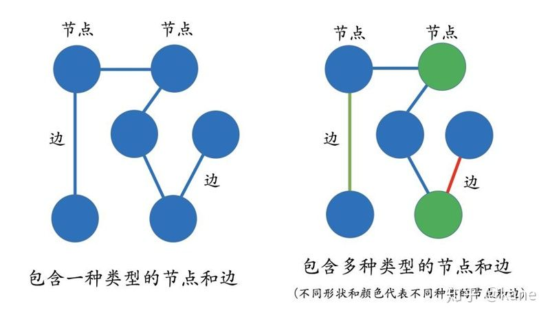

?在知识图谱里，我们通常用“实体（Entity）”来表达图里的节点、用“关系（Relation）”来表达图里的“边”。**实体指的是现实世界中的事物比如人、地名、概念、药物、公司等**，**关系则用来表达不同实体之间的某种联系，**比如人-“居住在”-北京、张三和李四是“朋友”、逻辑回归是深度学习的“先导知识”等等。

现实世界中的很多场景非常适合用知识图谱来表达。 比如一个社交网络图谱里，我们既可以有“人”的实体，也可以包含“公司”实体。人和人之间的关系可以是“朋友”，也可以是“同事”关系。人和公司之间的关系可以是“现任职”或者“曾任职”的关系。 类似的，一个风控知识图谱可以包含“电话”、“公司”的实体，电话和电话之间的关系可以是“通话”关系，而且每个公司它也会有固定的电话。

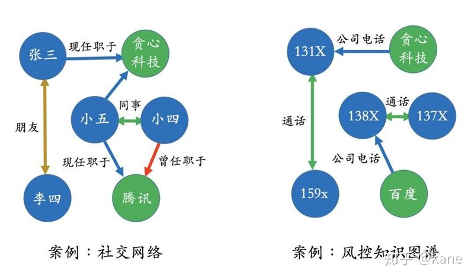

**▌3. 知识图谱的表示**

**知识图谱应用的前提是已经构建好了知识图谱**，也可以把它认为是一个知识库。这也是为什么它可以用来回答一些搜索相关问题的原因，比如在Google搜索引擎里输入“Who is the wife of Bill Gates?”，我们直接可以得到答案-“Melinda Gates”。这是因为我们在系统层面上已经创建好了一个包含“Bill Gates”和“Melinda Gates”的实体以及他俩之间关系的知识库。所以，当我们执行搜索的时候，就可以通过关键词提取（"Bill Gates", "Melinda Gates", "wife"）以及知识库上的匹配可以直接获得最终的答案。这种搜索方式跟传统的搜索引擎是不一样的，一个传统的搜索引擎它返回的是网页、而不是最终的答案，所以就多了一层用户自己筛选并过滤信息的过程。

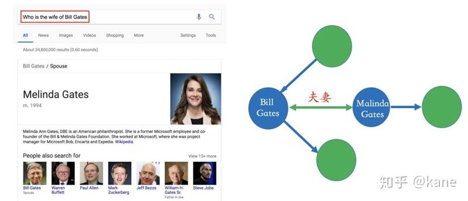

?

在现实世界中，实体和关系也会拥有各自的属性，比如人可以有“姓名”和“年龄”。**当一个知识图谱拥有属性时，我们可以用属性图（Property Graph）来表示**。下面的图表示一个简单的属性图。李明和李飞是父子关系，并且李明拥有一个138开头的电话号，这个电话号开通时间是2018年，其中2018年就可以作为关系的属性。类似的，李明本人也带有一些属性值比如年龄为25岁、职位是总经理等。

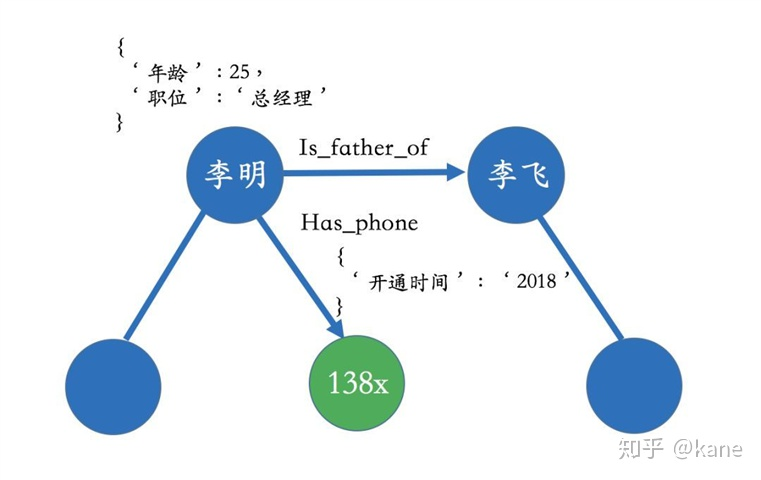

?这种属性图的表达很贴近现实生活中的场景，也可以很好地描述业务中所包含的逻辑。除了属性图，知识图谱也可以用RDF来表示，它是由很多的三元组（Triples）来组成。RDF在设计上的主要特点是易于发布和分享数据，但不支持实体或关系拥有属性，如果非要加上属性，则在设计上需要做一些修改。目前来看，RDF主要还是用于学术的场景，在工业界我们更多的还是采用图数据库（比如用来存储属性图）的方式。感兴趣的读者可以参考RDF的相关文献，在文本里不多做解释。

**▌4. 知识抽取**

知识图谱的构建是后续应用的基础，而且构建的前提是需要把数据从不同的数据源中抽取出来。对于垂直领域的知识图谱来说，**它们的数据源主要来自两种渠道：一种是业务本身的数据，这部分数据通常包含在公司内的数据库表并以结构化的方式存储；另一种是网络上公开、抓取的数据，这些数据通常是以网页的形式存在所以是非结构化的数据。**

前者一般只需要简单预处理即可以作为后续AI系统的输入，但后者一般需要借助于自然语言处理等技术来提取出结构化信息。比如在上面的搜索例子里，Bill Gates和Malinda Gate的关系就可以从非结构化数据中提炼出来，比如维基百科等数据源。

信息抽取的难点在于处理非结构化数据。在下面的图中，我们给出了一个实例。左边是一段非结构化的英文文本，右边是从这些文本中抽取出来的实体和关系。在构建类似的图谱过程当中，主要涉及以下几个方面的自然语言处理技术：

> a. 实体命名识别（Name Entity Recognition）
> b. 关系抽取（Relation Extraction）
> c. 实体统一（Entity Resolution）
> d. 指代消解（Coreference Resolution）

下面针对每一项技术解决的问题做简单的描述，以至于这些是具体怎么实现的，不在这里一一展开，感兴趣的读者可以查阅相关资料，或者学习我的课程。

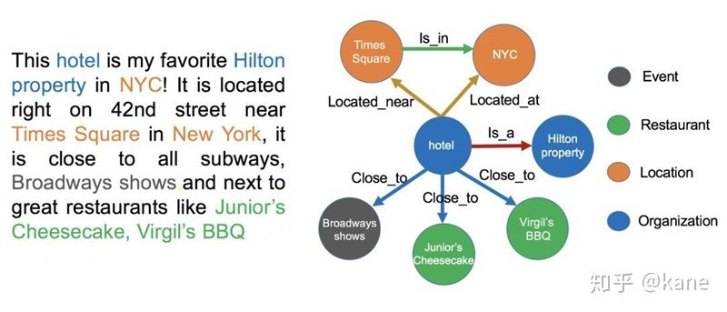

?首先是实体命名识别，就是从文本里提取出实体并对每个实体做分类/打标签：比如从上述文本里，我们可以提取出实体-“NYC”，并标记实体类型为 “Location”；我们也可以从中提取出“Virgil’s BBQ”，并标记实体类型为“Restarant”。这种过程称之为实体命名识别，这是一项相对比较成熟的技术，有一些现成的工具可以用来做这件事情。其次，我们可以通过关系抽取技术，把实体间的关系从文本中提取出来，比如实体“hotel”和“Hilton property”之间的关系为“in”；“hotel”和“Time Square”的关系为“near”等等。

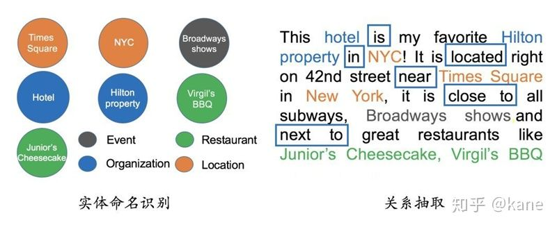

?另外，在实体命名识别和关系抽取过程中，有两个比较棘手的问题：一个是实体统一，也就是说有些实体写法上不一样，但其实是指向同一个实体。比如“NYC”和“New York”表面上是不同的字符串，但其实指的都是纽约这个城市，需要合并。实体统一不仅可以减少实体的种类，也可以降低图谱的稀疏性（Sparsity）；另一个问题是指代消解，也是文本中出现的“it”, “he”, “she”这些词到底指向哪个实体，比如在本文里两个被标记出来的“it”都指向“hotel”这个实体。

?

实体统一和指代消解问题相对于前两个问题更具有挑战性。

**▌5. 知识图谱的存储**

**知识图谱主要有两种存储方式：一种是基于RDF的存储；另一种是基于图数据库的存储。**它们之间的区别如下图所示。RDF一个重要的设计原则是数据的易发布以及共享，图数据库则把重点放在了高效的图查询和搜索上。其次，RDF以三元组的方式来存储数据而且不包含属性信息，但图数据库一般以属性图为基本的表示形式，所以实体和关系可以包含属性，这就意味着更容易表达现实的业务场景。

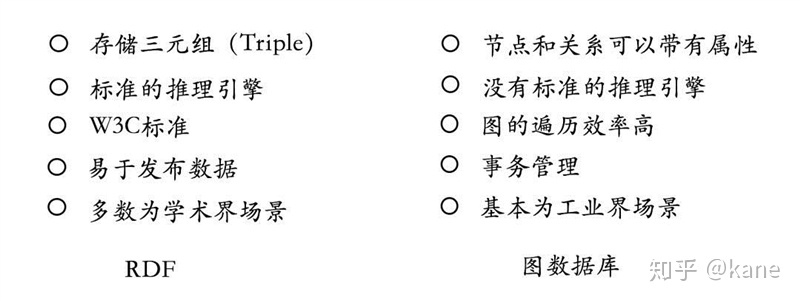

?根据最新的统计（2018年上半年），图数据库仍然是增长最快的存储系统。相反，关系型数据库的增长基本保持在一个稳定的水平。同时，我们也列出了常用的图数据库系统以及他们最新使用情况的排名。 其中Neo4j系统目前仍是使用率最高的图数据库，它拥有活跃的社区，而且系统本身的查询效率高，但唯一的不足就是不支持准分布式。相反，OrientDB和JanusGraph（原Titan）支持分布式，但这些系统相对较新，社区不如Neo4j活跃，这也就意味着使用过程当中不可避免地会遇到一些刺手的问题。如果选择使用RDF的存储系统，Jena或许一个比较不错的选择。

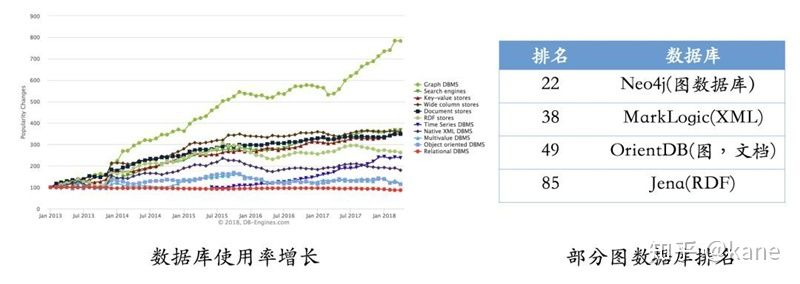

**▌6. 金融知识图谱的搭建**

接下来我们看一个实际的具体案例，讲解怎么一步步搭建可落地的金融风控领域的知识图谱系统。 首先需要说明的一点是，有可能不少人认为搭建一个知识图谱系统的重点在于算法和开发。但事实并不是想象中的那样，**其实最重要的核心在于对业务的理解以及对知识图谱本身的设计**，这就类似于对于一个业务系统，数据库表的设计尤其关键，而且这种设计绝对离不开对业务的深入理解以及对未来业务场景变化的预估。 当然，在这里我们先不讨论数据的重要性。

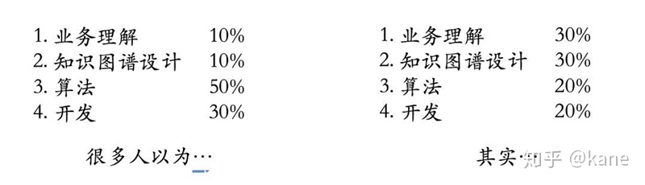

?

一个完整的知识图谱的构建包含以下几个步骤：**1. 定义具体的业务问题 2. 数据的收集 & 预处理 3. 知识图谱的设计 4. 把数据存入知识图谱 5. 上层应用的开发，以及系统的评估。**下面我们就按照这个流程来讲一下每个步骤所需要做的事情以及需要思考的问题。

**6.1 定义具体的业务问题**

在P2P网贷环境下，最核心的问题是风控，也就是怎么去评估一个借款人的风险。在线上的环境下，欺诈风险尤其为严重，而且很多这种风险隐藏在复杂的关系网络之中，而且知识图谱正好是为这类问题所设计的，所以我们“有可能”期待它能在欺诈，这个问题上带来一些价值。

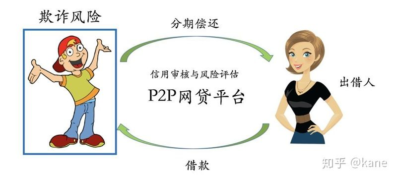

在进入下一个话题的讨论之前，**要明确的一点是，对于自身的业务问题到底需不需要知识图谱系统的支持**。因为在很多的实际场景，即使对关系的分析有一定的需求，实际上也可以利用传统数据库来完成分析的。所以为了避免使用知识图谱而选择知识图谱，以及更好的技术选型，以下给出了几点总结，供参考。

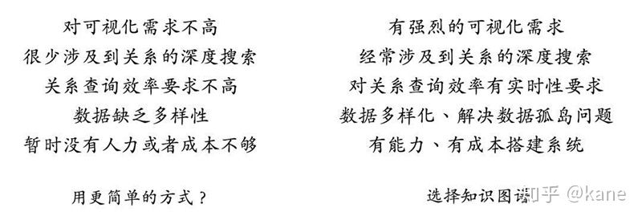

?

**6.2 数据收集 & 预处理**

下一步就是要确定数据源以及做必要的数据预处理。针对于数据源，我们需要考虑以下几点：1. 我们已经有哪些数据？ 2. 虽然现在没有，但有可能拿到哪些数据？ 3. 其中哪部分数据可以用来降低风险？ 4. 哪部分数据可以用来构建知识图谱？在这里需要说明的一点是，并不是所有跟反欺诈相关的数据都必须要进入知识图谱，对于这部分的一些决策原则在接下来的部分会有比较详细的介绍。

对于反欺诈，有几个数据源是我们很容易想得到的，包括用户的基本信息、行为数据、运营商数据、网络上的公开信息等等。假设我们已经有了一个数据源的列表清单，则下一步就要看哪些数据需要进一步的处理，比如对于非结构化数据我们或多或少都需要用到跟自然语言处理相关的技术。 用户填写的基本信息基本上会存储在业务表里，除了个别字段需要进一步处理，很多字段则直接可以用于建模或者添加到知识图谱系统里。对于行为数据来说，我们则需要通过一些简单的处理，并从中提取有效的信息比如“用户在某个页面停留时长”等等。 对于网络上公开的网页数据，则需要一些信息抽取相关的技术。

举个例子，对于用户的基本信息，我们很可能需要如下的操作。一方面，用户信息比如姓名、年龄、学历等字段可以直接从结构化数据库中提取并使用。但另一方面，对于填写的公司名来说，我们有可能需要做进一步的处理。比如部分用户填写“北京贪心科技有限公司”，另外一部分用户填写“北京望京贪心科技有限公司”，其实指向的都是同一家公司。所以，这时候我们需要做公司名的对齐，用到的技术细节可以参考前面讲到的实体对齐技术。?

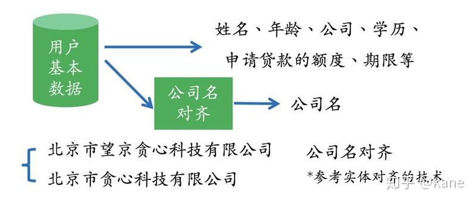

**6.3 知识图谱的设计**

图谱的设计是一门艺术，不仅要对业务有很深的理解、也需要对未来业务可能的变化有一定预估，从而设计出最贴近现状并且性能高效的系统。在知识图谱设计的问题上，我们肯定会面临以下几个常见的问题：**1. 需要哪些实体、关系和属性？ 2. 哪些属性可以做为实体，哪些实体可以作为属性？ 3. 哪些信息不需要放在知识图谱中？**

基于这些常见的问题，我们从以往的设计经验中抽象出了一系列的设计原则。这些设计原则就类似于传统数据库设计中的范式，来引导相关人员设计出更合理的知识图谱系统，同时保证系统的高效性。

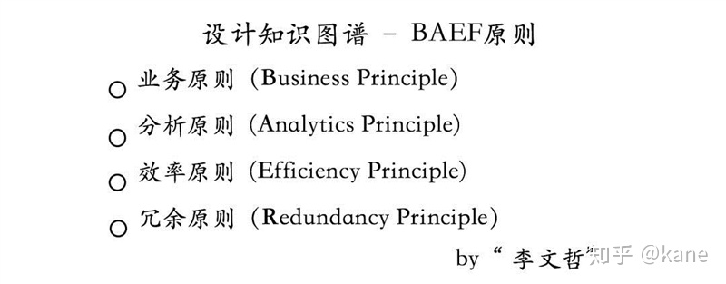

接下来，我们举几个简单的例子来说明其中的一些原则。 首先是，业务原则（Business Principle），它的含义是 “**一切要从业务逻辑出发，并且通过观察知识图谱的设计也很容易推测其背后业务的逻辑，而且设计时也要想好未来业务可能的变化**”。

举个例子，可以观察一下下面这个图谱，并试问自己背后的业务逻辑是什么。通过一番观察，其实也很难看出到底业务流程是什么样的。做个简单的解释，这里的实体-“申请”意思就是application，如果对这个领域有所了解，其实就是进件实体。在下面的图中，申请和电话实体之间的“has_phone”，“parent phone”是什么意思呢？

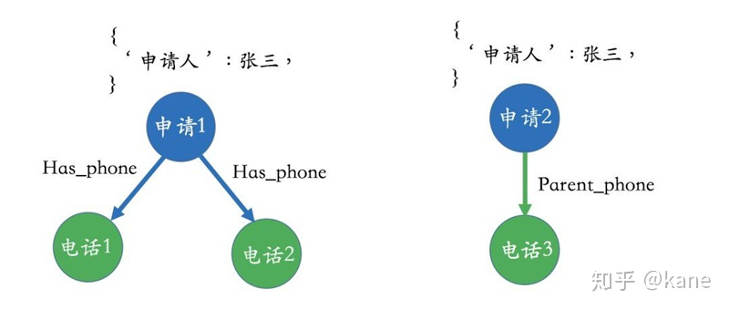

?接下来再看一下下面的图，跟之前的区别在于我们把申请人从原有的属性中抽取出来并设置成了一个单独的实体。在这种情况下，整个业务逻辑就变得很清晰，我们很容易看出张三申请了两个贷款，而且张三拥有两个手机号，在申请其中一个贷款的时候他填写了父母的电话号。总而言之，一个好的设计很容易让人看到业务本身的逻辑。

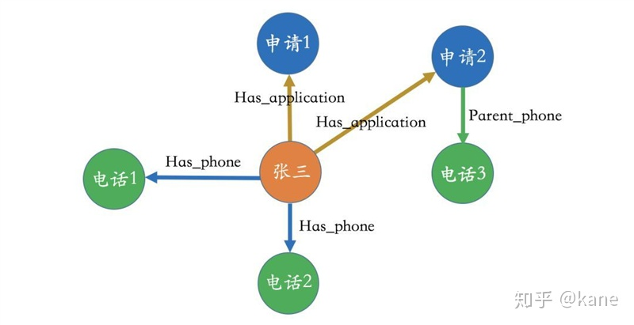

?接下来再看一个原则叫做效率原则（Efficiency Principle）。**效率原则让知识图谱尽量轻量化、并决定哪些数据放在知识图谱，哪些数据不需要放在知识图谱**。在这里举一个简单的类比，在经典的计算机存储系统中，我们经常会谈论到内存和硬盘，内存作为高效的访问载体，作为所有程序运行的关键。这种存储上的层次结构设计源于数据的局部性-“locality”，也就是说经常被访问到的数据集中在某一个区块上，所以这部分数据可以放到内存中来提升访问的效率。 类似的逻辑也可以应用到知识图谱的设计上：我们把常用的信息存放在知识图谱中，把那些访问频率不高，对关系分析无关紧要的信息放在传统的关系型数据库当中。 **效率原则的核心在于把知识图谱设计成小而轻的存储载体。**

比如在下面的知识图谱中，我们完全可以把一些信息比如“年龄”，“家乡”放到传统的关系型数据库当中，因为这些数据对于：a. 分析关系来说没有太多作用 b. 访问频率低，放在知识图谱上反而影响效率。

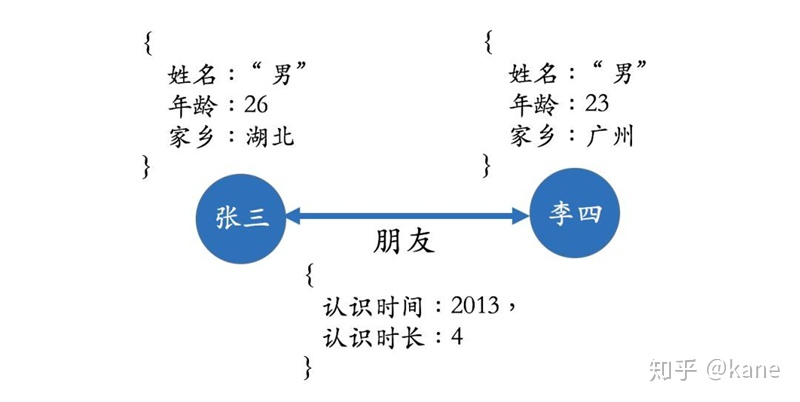

另外，从分析原则（Analytics Principle）的角度，我们不需要把跟关系分析无关的实体放在图谱当中；从冗余原则（Redundancy Principle）的角度，有些重复性信息、高频信息可以放到传统数据库当中。

**6.4 把数据存入知识图谱**

存储上我们要面临存储系统的选择，但由于我们设计的知识图谱带有属性，图数据库可以作为首选。但至于选择哪个图数据库也要看业务量以及对效率的要求。如果数据量特别庞大，则Neo4j很可能满足不了业务的需求，这时候不得不去选择支持准分布式的系统比如OrientDB, JanusGraph等，或者通过效率、冗余原则把信息存放在传统数据库中，从而减少知识图谱所承载的信息量。 通常来讲，对于10亿节点以下规模的图谱来说Neo4j已经足够了。

**6.5 上层应用的开发**

等我们构建好知识图谱之后，接下来就要使用它来解决具体的问题。对于风控知识图谱来说，首要任务就是挖掘关系网络中隐藏的欺诈风险。**从算法的角度来讲，有两种不同的场景：一种是基于规则的；另一种是基于概率的**。鉴于目前AI技术的现状，基于规则的方法论还是在垂直领域的应用中占据主导地位，但随着数据量的增加以及方法论的提升，基于概率的模型也将会逐步带来更大的价值。

**6.5.1 基于规则的方法论**

首先，我们来看几个基于规则的应用，分别是不一致性验证、基于规则的特征提取、基于模式的判断。

- 不一致性验证

为了判断关系网络中存在的风险，一种简单的方法就是做不一致性验证，也就是通过一些规则去找出潜在的矛盾点。这些规则是以人为的方式提前定义好的，所以在设计规则这个事情上需要一些业务的知识。比如在下面的这个图中，李明和李飞两个人都注明了同样的公司电话，但实际上从数据库中判断这俩人其实在不同的公司上班，这就是一个矛盾点。 类似的规则其实可以有很多，不在这里一一列出。

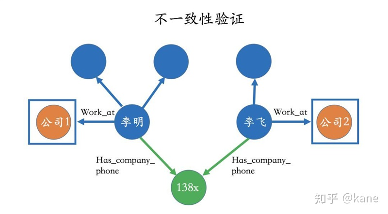

?

- 基于规则提取特征

我们也可以基于规则从知识图谱中提取一些特征，而且这些特征一般基于深度的搜索比如2度，3度甚至更高维度。比如我们可以问一个这样的问题：“申请人二度关系里有多少个实体触碰了黑名单？”，从图中我们很容观察到二度关系中有两个实体触碰了黑名单（黑名单由红色来标记）。等这些特征被提取之后，一般可以作为风险模型的输入。在此还是想说明一点，如果特征并不涉及深度的关系，其实传统的关系型数据库则足以满足需求。

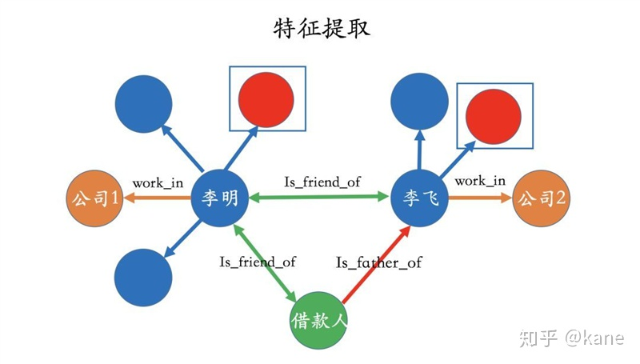

?

- 基于模式的判断

这种方法比较适用于找出团体欺诈，它的核心在于通过一些模式来找到有可能存在风险的团体或者子图（sub-graph），然后对这部分子图做进一步的分析。 这种模式有很多种，在这里举几个简单的例子。 比如在下图中，三个实体共享了很多其他的信息，我们可以看做是一个团体，并对其做进一步的分析。

?再比如，我们也可以从知识图谱中找出强连通图，并把它标记出来，然后做进一步风险分析。强连通图意味着每一个节点都可以通过某种路径达到其他的点，也就说明这些节点之间有很强的关系。

?

**6.5.2 基于概率的方法**

除了基于规则的方法，也可以使用概率统计的方法。 比如社区挖掘、标签传播、聚类等技术都属于这个范畴。 对于这类技术，在本文里不做详细的讲解，感兴趣的读者可以参考相关文献。

社区挖掘算法的目的在于从图中找出一些社区。对于社区，我们可以有多种定义，但直观上可以理解为社区内节点之间关系的密度要明显大于社区之间的关系密度。下面的图表示社区发现之后的结果，图中总共标记了三个不同的社区。一旦我们得到这些社区之后，就可以做进一步的风险分析。

由于社区挖掘是基于概率的方法论，好处在于不需要人为地去定义规则，特别是对于一个庞大的关系网络来说，定义规则这事情本身是一件很复杂的事情。

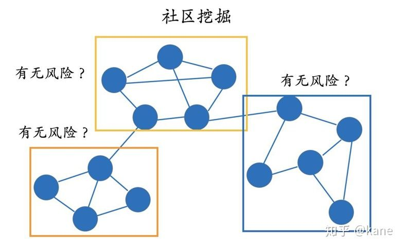

?标签传播算法的核心思想在于节点之间信息的传递。这就类似于，跟优秀的人在一起自己也会逐渐地变优秀是一个道理。因为通过这种关系会不断地吸取高质量的信息，最后使得自己也会不知不觉中变得更加优秀。具体细节不在这里做更多解释。

相比规则的方法论，基于概率的方法的缺点在于：需要足够多的数据。如果数据量很少，而且整个图谱比较稀疏（Sparse），基于规则的方法可以成为我们的首选。尤其是对于金融领域来说，数据标签会比较少，这也是为什么基于规则的方法论还是更普遍地应用在金融领域中的主要原因。

**6.5.3 基于动态网络的分析**

以上所有的分析都是基于静态的关系图谱。所谓的静态关系图谱，意味着我们不考虑图谱结构本身随时间的变化，只是聚焦在当前知识图谱结构上。然而，我们也知道图谱的结构是随时间变化的，而且这些变化本身也可以跟风险有所关联。

在下面的图中，我们给出了一个知识图谱T时刻和T+1时刻的结构，我们很容易看出在这两个时刻中间，图谱结构（或者部分结构）发生了很明显的变化，这其实暗示着潜在的风险。那怎么去判断这些结构上的变化呢？ 感兴趣的读者可以查阅跟“dynamic network mining”相关的文献。

?

**▌7. 知识图谱在其他行业中的应用**

除了金融领域，知识图谱的应用可以涉及到很多其他的行业，包括医疗、教育、证券投资、推荐等等。其实，只要有关系存在，则有知识图谱可发挥价值的地方。 在这里简单举几个垂直行业中的应用。

比如对于教育行业，我们经常谈论个性化教育、因材施教的理念。其核心在于理解学生当前的知识体系，而且这种知识体系依赖于我们所获取到的数据比如交互数据、评测数据、互动数据等等。为了分析学习路径以及知识结构，我们则需要针对于一个领域的概念知识图谱，简单来讲就是概念拓扑结构。在下面的图中，我们给出了一个非常简单的概念图谱：比如为了学习逻辑回归则需要先理解线性回归；为了学习CNN，得对神经网络有所理解等等。所有对学生的评测、互动分析都离不开概念图谱这个底层的数据。

?在证券领域，我们经常会关心比如“一个事件发生了，对哪些公司产生什么样的影响？” 比如有一个负面消息是关于公司1的高管，而且我们知道公司1和公司2有种很密切的合作关系，公司2有个主营产品是由公司3提供的原料基础上做出来的。

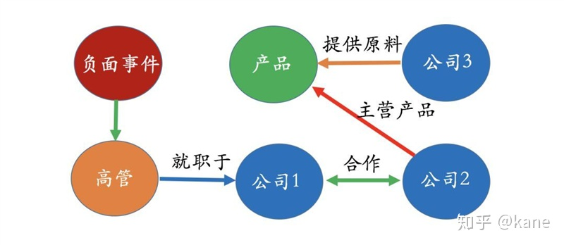

其实有了这样的一个知识图谱，我们很容易回答哪些公司有可能会被这次的负面事件所影响。当然，仅仅是“有可能”，具体会不会有强相关性必须由数据来验证。所以在这里，知识图谱的好处就是把我们所需要关注的范围很快给我们圈定。接下来的问题会更复杂一些，比如既然我们知道公司3有可能被这次事件所影响，那具体影响程度有多大？ 对于这个问题，光靠知识图谱是很难回答的，必须要有一个影响模型、以及需要一些历史数据才能在知识图谱中做进一步推理以及计算。

**▌8. 实践上的几点建议**

首先，知识图谱是一个比较新的工具，它的主要作用还是在于分析关系，尤其是深度的关系。所以在业务上，首先要确保它的必要性，其实很多问题可以用非知识图谱的方式来解决。

知识图谱领域一个最重要的话题是知识的推理。 而且知识的推理是走向强人工智能的必经之路。但很遗憾的，目前很多语义网络的角度讨论的推理技术（比如基于深度学习，概率统计）很难在实际的垂直应用中落地。其实目前最有效的方式还是基于一些规则的方法论，除非我们有非常庞大的数据集。

最后，还是要强调一点，**知识图谱工程本身还是业务为重心，以数据为中心。不要低估业务和数据的重要性。**

**▌9. 结语**

知识图谱是一个既充满挑战而且非常有趣的领域。只要有正确的应用场景，对于知识图谱所能发挥的价值还是可以期待的。我相信在未来不到2，3年时间里，知识图谱技术会普及到各个领域当中。