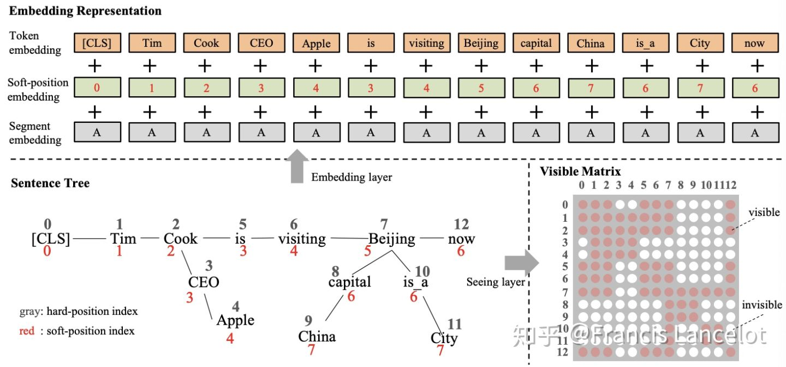

# BERT meet Knowledge Graph：预训练模型与知识图谱相结合的研究进展

**作者简介：**周昆 

[@Francis Lancelot](https://www.zhihu.com/people/2772ee7bba76cbd1970c2ae1ff6b41da)

，中国人民大学博士，导师为文继荣教授和赵鑫教授，研究方向是会话推荐系统和语义融合

**引言：**随着BERT等预训练模型横空出世，NLP方向迎来了一波革命，预训练模型在各类任务上均取得了惊人的成绩。随着各类预训练任务层出不穷，也有部分研究者考虑如何在BERT这一类模型中引入或者强化知识图谱中包含的信息，进而增强BERT对背景知识或常识信息的编码能力。本文主要关注于如何在BERT中引入知识图谱中信息，并survey了目前已公布的若干种方法，欢迎大家批评和交流。

## **1.ERNIE: Enhanced Language Representation with Informative Entities**

[https://www.aclweb.org/anthology/P19-1139.pdfwww.aclweb.org](https://link.zhihu.com/?target=https%3A//www.aclweb.org/anthology/P19-1139.pdf)

这篇论文来自于清华刘知远老师和华为刘群老师，已被ACL2019所录取，是较早的考虑将知识引入预训练模型的论文。

该论文主要利用了从知识库中提出的高信息量的实体信息，通过特殊的语义融合模块，来增强文本中对应的表示。首先本文通过实体链接算法，将Wikipedia文本中包含的实体与Wikidata中的实体库构建关联，然后采用TransE算法，对Wikidata中的实体embedding进行预训练，进而得到其初始的表示；之后本文采用一个特殊的信息融合结构，其模型框架如下图所示：

从图中可以看出，ERNIE的框架分为以下两部分，T-Encoder和K-Encoder，以上两部分均使用BERT的Transformer框架，并利用其中的参数进行初始化。其中Wikipedia中的每一句话首先被输入给T-Encoder，其通过Transformer的多头注意力机制对文本中的信息进行编码；之后输出的表示与其内部包含的实体被一起输入给了K-Encoder，其内部包含两个多头注意力层以分别对文本信息和实体信息进行编码；编码后实体信息会得到两种表示——词级别和实体级别的表示，ERNIE通过将两种信息concat之后输入给DNN层，进而融合得到知识增强的表示；为进一步促进该部分融合，ERNIE采用一个denoising entity auto-encoder (dEA)来对该部分进行监督，其采用类似于BERT中的Mask机制，基于一定的概率对其中的实体进行mask或替换，然后还原该部分实体信息。

在采用以上过程预训练后，本文将ERNIE在多个NLP任务上进行微调，并在多个数据集上获得了State-of-the-art的结果。

## **2.K-BERT: Enabling Language Representation with Knowledge Graph**

[https://arxiv.org/pdf/1909.07606v1.pdfarxiv.org](https://link.zhihu.com/?target=https%3A//arxiv.org/pdf/1909.07606v1.pdf)

这篇论文来自于北大和腾讯，已被AAAI2020所录取，是较早的考虑将知识图谱中的边关系引入预训练模型的论文。

该论文主要通过修改Transformer中的attention机制，通过特殊的mask方法将知识图谱中的相关边考虑到编码过程中，进而增强预训练模型的效果。首先本文利用CN-DBpedia、HowNet和MedicalKG作为领域内知识图谱，对每一个句子中包含的实体抽取其相关的三元组，这里的三元组被看作是一个短句（首实体，关系，尾实体），与原始的句子合并一起输入给Transformer模型；针对该方法，本文采用基于可见矩阵的mask机制，如下图所示：

从图中可以看出，输入的句子增加了许多三元组构成的短句，在每次编码时针对每一个词，模型通过可视矩阵（0-1变量）来控制该词的视野，使其计算得到的attention分布不会涵盖与其无关的词，进而模拟一个句子树的场景；由于该策略仅仅改动了mask策略，故其可以支持BERT，RoBERTa等一系列模型；该方法最终在8个开放域任务和4个特定领域任务下取得了一定的提升。

## **3.KEPLER: A Unified Model for Knowledge Embedding and Pre-trained Language Representation**

[https://arxiv.org/pdf/1911.06136.pdfarxiv.org](https://link.zhihu.com/?target=https%3A//arxiv.org/pdf/1911.06136.pdf)

这篇论文来源于清华和Mila实验室，其主要关注于如何使用BERT增强知识图谱embedding，并帮助增强对应的表示。

该论文主要通过添加类似于TransE的预训练机制来增强对应文本的表示，进而增强预训练模型在一些知识图谱有关任务的效果。首先本文基于Wikipedia和Wikidata数据集，将每个entity与对应的维基百科描述相链接，则每个entity均获得其对应的文本描述信息；之后对于每一个三元组——<头实体，关系，尾实体>，本文采用基于BERT对encoder利用entity的描述信息，对每个实体进行编码，如下图所示：

从图中可以看出，在通过encoder得到头实体和尾实体对应的表示之后，本文采用类似于TransE的训练方法，即基于头实体和关系预测尾实体；此外本文还采用BERT经典的MLM损失函数，并使用RoBERTa的原始参数进行初始化；最终本文提出的方法在知识图谱补全和若干NLP任务上均带来了增益。

## **4.CoLAKE: Contextualized Language and Knowledge Embedding**

[https://arxiv.org/pdf/2010.00309.pdfarxiv.org](https://link.zhihu.com/?target=https%3A//arxiv.org/pdf/2010.00309.pdf)

这篇论文来源于复旦和亚马逊，其主要关注于如何使用知识图谱以增强预训练模型的效果。

本文首先将上下文看作全连接图，并根据句子中的实体在KG上抽取子图，通过两个图中共现的实体将全连接图和KG子图融合起来；然后本文将该图转化为序列，使用Transformer进行预训练，并在训练时采用特殊的type embedding来表示实体、词语与其他子图信息，如下图所示：

最终本文将文本上下文和知识上下文一起用MLM进行预训练，将mask的范围推广到word、entity和relation；为训练该模型，本文采用cpu-gpu混合训练策略结合负采样机制减少训练时间；最终本文提出的方法在知识图谱补全和若干NLP任务上均带来了增益。

## **5.EXPLOITING STRUCTURED KNOWLEDGE IN TEXT VIA GRAPH-GUIDED REPRESENTATION LEARNING**

[https://arxiv.org/pdf/2004.14224.pdfarxiv.org](https://link.zhihu.com/?target=https%3A//arxiv.org/pdf/2004.14224.pdf)

这篇论文来源于悉尼科技大学和微软，其主要关注于如何使用知识图谱增强预训练模型。

本文思路比较简洁，其提出了一个基于entity的mask机制，结合一定的负采样机制来增强模型。首先对于输入的每一句话，本文首先进行实体链接工作，得到其中的entity，并从知识图谱conceptnet和freebase中召回其邻接的三元组；本文利用一个特殊的权重，防止在mask时关注于句子中过于简单和过于难的entity，这样模型在entity-level MLM训练时就关注于较为适合学习的信息；此外本文还引入了基于知识图谱的负采样机制，其利用relation来选择高质量的负例，以进一步帮助训练；最终本文提出的方法在知识图谱补全和若干NLP任务上均带来了增益。

## **6.K-ADAPTER: INFUSING KNOWLEDGE INTO PRETRAINED MODELS WITH ADAPTERS**

[https://arxiv.org/pdf/2002.01808v3.pdfarxiv.org](https://link.zhihu.com/?target=https%3A//arxiv.org/pdf/2002.01808v3.pdf)

这篇论文来源于复旦和微软，其考虑自适应的让BERT与知识相融合。

这篇论文考虑如何通过不同的特殊下游任务来帮助向预训练模型融入任务相关的知识。首先本文针对不同的预训练任务，定义了对应的adapter；在针对具体的下游任务进行fine-tune时，可以采用不同的adapter来针对性的加入特征，进而增强其效果；如下图所示：

基于该思想，本文提出了两种特殊的adapter，分别利用factor knowledge和linguistic knowledge；针对这两个adapter，本文提出了针对entity之间的关系分类任务和基于依存关系的分类任务；再fine-tune阶段，两个adapter得到的特征可以与BERT或RoBERTa得到的特征一起拼接来进行预测，该策略在三个知识驱动数据集上均取得了较大增益。

## **7.Integrating Graph Contextualized Knowledge into Pre-trained Language Models**

[https://arxiv.org/pdf/1912.00147.pdfarxiv.org](https://link.zhihu.com/?target=https%3A//arxiv.org/pdf/1912.00147.pdf)

这篇论文来自于华为和中科大，其主要关注于如何将上下文有关的知识信息加入到预训练模型里。

这篇论文的思想类似于graph-BERT和K-BERT，其针对给出文本首先检索返回相关的entity三元组，再在知识图谱上搜集其相邻的节点以构成子图；然后将该子图转换成序列的形式，输入给传统的Transformer模型（类似graph-BERT），通过特殊的mask来约束注意力在相邻节点上（K-BERT）；最后用类似于ERNIE的策略将子图中的信息加入到Transformer中；最终该模型在下游的几个医疗相关数据集上取得了增益。

## 8.JAKET: JOINT PRE-TRAINING OF KNOWLEDGE GRAPH AND LANGUAGE UNDERSTANDING

[https://arxiv.org/pdf/2010.00796.pdfarxiv.org](https://link.zhihu.com/?target=https%3A//arxiv.org/pdf/2010.00796.pdf)

这篇论文来自于CMU和微软，其主要关注于如何同时对知识图谱和语言模型一起预训练。

本文使用RoBERTa作为语言模型对文本进行编码，增加了relation信息的graph attention模型来对知识图谱进行编码；由于文本和知识图谱的交集在于其中共有的若干entity，本文采用一种交替训练的方式来帮助融合两部分的知识，如下图所示：

可以看出，语言模型得到的信息会首先对输入文本以及entity/relation的描述信息进行编码，以得到对应的表示；之后语言模型得到的entity embedding会被送给R-GAT模型以聚合邻居节点的信息，以得到更强的entity表示；然后该部分信息会被输入给语言模型继续融合并编码，以得到强化的文本表示信息；为了训练该模型，本文还采用embedding memory机制来控制训练时梯度的更新频率和优化目标的权重，并提出四种特殊的损失函数来进行预训练；最终本文提出的模型在多个知识驱动的下游任务均取得较好效果。