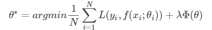
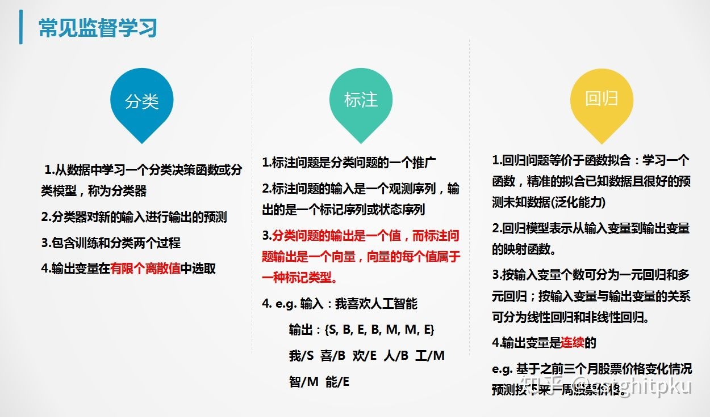

# 干货|机器学习超全综述！

时光飞逝，学习机器学习已四年有余，深感机器学习之博大精深，可能不断学习数十年也无法穷尽。但从另一方面考虑，我也学了很多，也有一些自己的感悟。本文谨代表我个人的观点和感悟，希望对大家(尤其是初学者)有所帮助，欢迎大家一起讨论与学习~

本文的目录如下：

## **1.综述**

## **1.1机器学习是什么**

**1.2机器学习的过程**

## **1.3监督学习VS无监督学习**

根据训练数据是否有标记，机器学习任务大致分为两大类：**监督学习**和**非监督学习**，监督学习主要包括分类和回归等，非监督学习主要包括聚类和频繁项集挖掘等。

监督学习的过程如下：

无监督学习的过程如下：

监督学习算法VS无监督学习算法

## **1.4 输入空间、特征空间、输出空间、假设空间**

**输入空间**：在监督学习中，将输入所有可能取值的集合称为输入空间。
**特征空间**：每个具体输入是一实例，通常用特征向量表示，所有特征向量存在的空间为特征空间。有时输入空间和特征空间为相同的空间，有时为不同的空间，需要将实例从输入空间映射到输出空间。
**输出空间**：在监督学习中，将输出所有可能取值的集合称为输出空间。
**假设空间**：监督学习的目的在于学习一个由输入到输出的映射，这一映射由模型来表示。由输入空间到输出空间的映射的集合，称为假设空间。举个简单的例子，在一元线性回归中，假设空间即所有的直线y=ax+b组成的集合，我们的目标就是找到一条y=a'x+b'，使得损失最小。

## **1.5 生成模型和判别模型**

**生成模型**：生成模型由数据学习联合概率分布P(X,Y)，然后求出条件概率分布P(Y|X)作为预测的模型。之所以被称为生成方法，是因为模型表示了给定输入X产生输出Y的关系。典型的模型有**朴素贝叶斯(NB)**和**隐马尔可夫模型(HMM)等**。
**判别模型**：判别模型由数据直接学习决策函数f(X)，或条件概率分布P(Y|X)。判别方法关心的是对给定的输入X，应预测什么样的输出Y。典型的判别模型包括**k近邻算法(KNN)、决策树(DT)、逻辑回归(LR)、支持向量机(SVM)**等。

**1.6过拟合VS欠拟合**

解决过拟合：重新清洗数据、增大样本量、减少特征的量、增强正则化作用、dropout(适用于神经网络)等。

解决欠拟合：使用更复杂的模型、更有效的特征选择、减少正则化作用等。

**1.7特征选择**

特征选择对机器学习至关重要，个人认为在大部分机器学习任务中特征就决定了效果的上限，模型的选择与组合只是无限逼近于这个上限。

特征选择的主要作用包括：减少特征数量会防止维度灾难，减少训练时间；增强模型泛化能力，减少过拟合；增强对特征和特征值的理解。

常见的特征选择方法如下：

去除取值变化小的特征：如果绝大部分实例的某个特征取值一样，那这个特征起到的作用可能就比较有限，极端情况下如果所有实例的某特征取值都一样，那该特征基本就不起作用。

单变量特征选择法：能够对每一个特征进行测试，衡量该特征和响应变量之间的关系，根据得分扔掉不好的特征。常见方法包括卡法检验、互信息、皮尔森相关系数、距离相关系数、基于学习模型的特征排序(Model based ranking)等。

正则化：L1正则化、L2正则化。

随机森林特征选择：这类方法主要包括平均不纯度减少(mean decrease impurity)和平均精确率减少(Mean decrease accuracy)两种方法。

顶层特征选择法：这类方法主要包括稳定性选择(Stability selection)和递归特征消除(Recursive feature elimination)两种方法。

## **1.8方差vs偏差**

偏差描述的是算法预测的平均值和真实值的差距（算法的拟合能力），低偏差对应于模型复杂化，但模型过于复杂容易过拟合。

而方差描述的是同一个算法在不同数据集上的预测值和所有数据集上的平均预测值之间的关系（算法的稳定性），低方差对应于模型简单化，但模型过于简单容易欠拟合。

高偏差(一般是欠拟合，注意跟上面低偏差时模型复杂化做区别)是模型在训练集和验证集上的误差都比较大，随着数据集的增加，模型在训练集和验证集上的误差表现如下：

解决高偏差的方法：**使用更多特征，增加多项式特征，减少正则化程度λ**。

高方差是针对不同的训练集，其拟合得到的参数相差很大(一般是过拟合，注意跟上面低方差时模型简单化做区别)。随着数据集的增加，模型在训练集和验证集上的误差表现如下：

解决高偏差的方法：**增加训练样本，减少特征数量，增加正则化程度λ**

## **2.机器学习任务分类**

**2.1按学习方式分类**

**2.2按算法思想分类**

## **3.损失函数**

损失函数用来评价模型的预测值和真实值不一样的程度，损失函数越好，通常模型的性能越好。不同的模型用的损失函数一般也不一样。
损失函数分为经验风险损失函数和结构风险损失函数。经验风险损失函数指预测结果和实际结果的差别，结构风险损失函数是指经验风险损失函数加上正则项。通常表示为如下：

## **3.1 0-1损失函数**

0-1损失是指预测值和目标值不相等为1，否则为0：

## **3.2 绝对值损失函数**

绝对值损失函数是计算预测值与目标值的差的绝对值：

## **3.3 log对数损失函数**

log损失函数的标准形式如下：

## **3.4 平方损失函数**

平方损失函数经常应用于回归问题，它的标准形式如下：

## **3.5 指数损失函数**

指数损失函数的标准形式如下：

## **3.6 Hinge损失函数**

Hinge损失函数标准形式如下：

损失函数的选择，对一般机器学习任务非常重要。很多任务就是难在不太容易确定一个比较好的损失函数。

**4.** **监督学习**

**4.1监督学习的任务分类**

常见监督学习任务的分类以及他们之间的对比如下；

**4.2监督学习算法**

监督学习的算法非常多，后续也会有选择的分享我对一些常见算法的感悟。常见的监督学习算法具体如下：

**4.3监督学习的评估**

监督学习的效果评估如下：

**5.** **无监督学习**

**5.1无监督学习的任务分类**

常见的无监督学习的任务分类如下：

**5.2聚类**

无监督学习—聚类

**5.3推荐**

无监督学习—推荐

**5.4频繁项集挖掘**

无监督学习—频繁项集挖掘

**6.** **总结与思考**

**6.1总结**

**6.2思考**

后续我会专注于NLP（自然语言处理）、ML（机器学习）、DL（深度学习）、RL(强化学习)、TL(迁移学习)、GAN(生成对抗网络)等领域写一写个人的感悟，志在为大家提供一个干货与温度并存的学习与交流平台。期待您的关注，您的鼓励就是我不断写下去的动力，更期待有志同道合的朋友能加入一起写一写。予人玫瑰，手留余香！