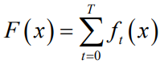

> boosting(包括GBDT、XGBoost)是一个加法模型，有以下优缺点：
>
> 

> **优点：**
>  • 可解释性强
>  • 可处理混合类型特征
>  • 具体伸缩不变性（不用归一化特征）
>  • 有特征组合的作用
>  • 可自然地处理缺失值
>  • 对异常点鲁棒
>  • 有特征选择作用
>  • 可扩展性强，容易并行
>  **缺点：**
>  • 缺乏平滑性（回归预测时输出值只能输出有限的若干种数值）
>  • 不适合处理高维稀疏数据

### 一、GBDT

```
GBDT泛指所有梯度提升树算法，包括XGBoost，它也是GBDT的一种变种，为了区分它们，GBDT一般特指“Greedy Function Approximation：A Gradient Boosting Machine”里提出的算法，只用了一阶导数信息。
```

> GBDT是在函数空间上利用梯度下降进行优化
>  GBDT是多个弱分类器合成强分类器的过程(加权求和)，每次迭代产生一个弱分类器，当前弱分类器是在之前分类器残差基础上训练。
>  **目标：**损失函数尽可能快减小，则让损失函数沿着梯度方向下降。--> gbdt 的gb的核心了。


**算法流程如下：**


> 2.1 ：求之前分类器损失函数的负梯度作为本次弱分类器需要拟合的输出
>  2.2：对回归树的学习，一般选择CART TREE（分类回归树），对应的叶节点区域为w，CART TREE生成就用平方误差最小化
>  2.3：在叶结点区域上损失函数最小，求弱分类器权重
>  2.4：合成新的分类器

**算法流程图也可以如下图：**


> 不同问题的提升树学习方法使用的损失函数不同，回归问题一般用平方误差损失函数，分类问题一般用指数损失函数，以及其它一般决策问题的一般损失函数。

**GBDT常用损失函数**
 **分类算法：**
 `分类算法中CART树也是采用回归树`
 (1) 指数损失函数：


负梯度计算和叶子节点的最佳负梯度拟合与Adaboost相似。
 (2) 对数损失函数：
 二元分类：


多元分类：


**回归算法：**
 (1)均方差：


(2)绝对损失：


负梯度误差为：


(3)Huber损失：
 均方差和绝对损失的折中，对远离中心的异常点，采用绝对损失，而中心附近的点采用均方差。界限一般用分位数点度量。损失函数如下：


负梯度误差：


(4) 分位数损失：分位数回归的损失函数，表达式为


θ为分位数，需要我们在回归前指定。对应的负梯度误差为：


Huber损失和分位数损失，减少异常点对损失函数的影响。

**问题：GBDT如何减少异常点的影响？**

> (1) 使用健壮损失函数，如Huber损失函数和分位数（Quantile）损失函数；
>  (2) 增加正则化项；
>  (3) 采用无放回的子采样。
>  异常点的鲁棒性，随机森林要比GBDT好。原因是GBDT的模型在迭代过程中较远的异常点残差往往会比正常点大，导致最终建立的模型出现偏差。一般的经验是，异常点少的样本集GBDT表现更加优秀，而异常点多的样本集，随机森林表现更好。

**GBDT优点：**

> （1）处理各种类型的数据(非线性数据)，包括连续值和离散值，处理多特征类型。
>  （2）在相对少的调参时间情况下，预测的准备率也可以比较高(相对SVM)。
>  （树的个数 100~10000、叶子的深度 3~8、学习速率 0.01~1、叶子上最大节点树 20、训练采样比例 0.5~1、训练特征采样比例 (√n)(n)）
>  （3）能适应多种损失函数，使用健壮的损失函数，对异常值的鲁棒性强。如 Huber损失函数和Quantile损失函数。
>  （4）适合低维稠密数据，模型可解释性好
>  （5）不需要做特征的归一化，可以自动选择特征

**GBDT缺点：**

> （1）弱学习器之间依赖，难以并行训练数据。可以通过自采样SGBT达到部分并行。
>  （2）计算复杂度大
>  （3）不使用高维稀疏特征

**Adaboost与GBDT：**

> Adaboost是通过提高错分样本的权重来定位模型的不足，采用指数损失，基分类器是最常见为决策树(深度为1)
>  GBDT是通过负梯度来定位模型的不足，因此GBDT可以使用更多种类的损失函数


**RF与GBDT：**

> 1、组成RF的树可以是分类树，也可以是回归树；而GBDT只由回归树组成，因为GBDT对所有树的结果累加，累加无法通过分类完成
>  2、组成RF的树并行生成；GBDT串行生成 ，GBDT更容易过拟合
>  3、输出结果，RF采用多数投票等；GBDT将所有结果累加，或加权累加
>  4、RF对异常值不敏感，GBDT对异常值敏感
>  5、RF对训练集一视同仁，每棵树分裂特征随机；GBDT基于权值的弱分类器的集成 ，前面的树优先分裂对大部分样本区分的特征，后分裂对小部分样本区分的特征
>  6、RF通过减少模型方差提高性能，GBDT通过减少模型偏差提高性能(低方差和高偏差)
>  7、RF参数主要是树的棵树，GBDT主要是树的深度，一般为1

**RF优点：**

> 1、易理解和解释，树可以被可视化。
>  2、不需要太多的数据预处理，不需要数据归一化等。
>  3、隐含创造多个联合特征，解决非线性问题。
>  4、和决策树模型、GBDT模型相比，RF不易过拟合。
>  5、自带out-of-bag (oob)错误评估功能。 RF的重要特性是不用进行交叉验证或使用一个独立的测试集获得无偏估计，它可以在内部进行评估，在生成的过程中可以对误差进行无偏估计，由于每个基学习器只使用了训练集中约63.2%的样本，剩下约36.8%的样本可用做验证集来对其泛化性能进行‘包外估计’。
>  6、易于并行化。

**RF缺点：**

> 1、不适合小样本，只适合大样本。
>  2、大多数情况下，RF模型的精度略低于GBDT模型的精度。
>  3、适合决策边界是矩形的，不适合对角线型的。

------

### 二、XGBoost

> XGBoost应用牛顿法(二阶泰勒展开)
>  加入正则项，对每棵树的复杂度进行惩罚，防止过拟合

**XGBoost目标函数及归一化公式**


**归一化解释**


**XGBoost参数定义**


**XGBoost第t次迭代：**训练第t棵子树，损失函数最小求参数，计算过程如下


> 上图最小损失L是衡量第t棵CART树的结构好坏的标准。L只和Gj和Hj和T有关，它们又只和树的结构(q(x))有关，与叶子节点的值没有关系。


假设分到j这个叶子节点上的样本只有一个。那么，w*j如下：


> ，w*j的最佳值是负的梯度乘以权重系数，该系数类似于随机梯度下降中的学习率。hj越大，系数越小，学习率越小。hj代表在该点附近梯度变化非常剧烈，只要一点改变，梯度就从10000变到了1，所以在使用反向梯度更新时步子就要小，也就是权重系数要更小。

**回归树的学习策略**


**XGBoost的打分函数**


> 上图中Gain是单节点的L*减去切分后的两个节点的树L*，Gain如果是正的，且值越大，表示切分后L*越小于单节点的L*，越值得切分。Gain的左半部分如果小于右侧的γ，则Gain就是负的，表明切分后L*变大。γ是一个临界值，值越大，表示对切分后L*下降幅度要求越严。这个值可以在xgboost中设定。

> γ是加入新叶子节点引入的复杂度代价

> xgboost切分和普通的决策树切分过程不同。普通的决策树在切分的时候并不考虑树的复杂度，而依赖后续的剪枝操作来控制。xgboost在切分的时候就考虑树的复杂度，就是γ参数。不需要进行单独的剪枝操作。

**树节点分裂方法**


> 对于连续型特征值，当样本数量非常大，特征取值过多时，遍历所有取值会花费很多时间，且容易过拟合。因此XGBoost思想是对特征进行分桶，即找到l个划分点，将位于相邻分位点之间的样本分在一个桶中。在遍历该特征的时候，只需要遍历各个分位点，从而计算最优划分。从算法伪代码中该流程还可以分为两种，全局的近似是在新生成一棵树之前就对各个特征计算分位点并划分样本，之后在每次分裂过程中都采用近似划分，而局部近似就是在具体的某一次分裂节点的过程中采用近似算法。
>  近似算法流程如下：


寻找分为点可以使用Weighted Quantile Sketch—分布式加权直方图算法


**稀疏值处理**

> 输入x稀疏很常见。 稀疏性有多种可能原因：
>  （1）数据中存在缺失值
>  （2）统计中频繁的零项
>  （3）特征工程，例如one-hot编码。
>  特征值缺失时，无法利用该特征进行划分，则将每个树节点中添加一个默认方向，如下图，当稀疏矩阵x中缺少一个值时，样本被分类为默认方向。
>  默认方向选择：将该样本分别划分到左结点和右结点，计算增益，分到增益大的一侧。


关键的改进是只访问非缺失的条目Ik。 所提出的算法将不存在的值视为缺失值并且学习处理缺失值的最佳方向。稀疏感知算法运行速度比初始版本快50倍


**XGBoost的其它特性**


**Shrinkage and Column Subsampling**
 Shrinkage and Column Subsampling均是为了防止过拟合

> **Shrinkage：**每次迭代中对树的每个叶子结点的分数乘上一个缩减权重η，降低了每棵独立树的影响，并为将，留更大的空间给后面生成的树去优化模型。类似于学习速率。
>  **Column Subsampling：**类似于随机森林中的选取部分特征进行建树。
>  一种是按层随机采样，在对同一层内每个结点分裂之前，先随机选择一部分特征，然后只需要遍历这部分的特征，来确定最优的分割点。
>  另一种是随机选择特征，建树前随机选择一部分特征然后分裂就只遍历这些特征。一般情况下前者效果更好。

**XGBoost的系统设计**


**Column Block**
 xgboost的并行不是tree粒度的并行，而是特征粒度上。

> 决策树学习中最耗时的部分是将数据按照特征值进行排序。为了降低排序成本，xgboost将数据存储在内存单元中（block）。每个block数据以压缩列（CSC）格式存储，每列按特征值排序。输入数据布局仅需要在训练之前计算一次，在以后的迭代中重复使用，减少了计算量。block结构使并行变成可能。在进行结点的分裂时，需要计算每个特征的增益，最终选择增益最大的特征做分裂，各个特征的增益计算可以多进程进行。

> 1、精确的贪婪算法：整个数据集存储在一个block，通过线性扫描预先排序的条目来运行拆分搜索算法。对所有叶子集体的进行拆分查找，因此对block进行一次扫描将收集所有叶子分支中的划分候选者的统计数据。
>  2、近似算法：block结构也是有效的。使用多个块，每个block对应数据集中行的子集。不同的block可以跨机器分布，也可以在核外设置中存储在磁盘上。使用排序结构，quantile查找步骤变为对排序列的线性扫描。对经常在每个分支处生成的局部提议算法有用，直方图聚合中的二分搜索也变为线性时间合并样式算法。。


**缓存感知访问（Cache-aware Access）**

> Column Block算法通过行索引间接提取梯度统计，由于值是按特征的顺序访问的。 这是一种非连续的内存访问。 分裂枚举的简单实现在累积和非连续存储器read/write操作之间引入了immediate read/write依赖性。 当梯度统计信息不适合CPU缓存并发生缓存未命中时，减慢拆分查找速度。


> 1、精确的贪心算法：通过缓存感知预取算法（cache-aware prefetching algorith）缓解问题。 在每个线程中分配一个内部缓冲区，获取梯度统计信息，然后以小批量（mini-batch）方式执行累积。 此预取将direct read/write依赖性更改为更长的依赖性，在有大量行数时帮助减少运行时开销。 数据集很大时，精确贪婪算法的缓存感知实现的运行速度是普通版本的两倍。
>  2、近似算法：通过选择正确的块大小解决问题。将块大小定义为块中包含的最大示例数，这反映了梯度统计的高速缓存存储成本。
>  选择过小的块大小会导致每个线程的工作量很小，并导致低效的并行化。
>  过大的块会导致缓存未命中，因为梯度统计信息不送入CPU缓存。

**XGBoost的优点**

> 1、多种防止过拟合方法，正则化、Shrinkage、Column Subsampling等。
>  2、 目标函数优化利用损失函数关于待求函数的二阶导数
>  3、支持并行化，闪光点，虽然树与树串行，但同层级节点可并行。候选分裂点计算增益用多线程并行。训练速度快。
>  4、添加对稀疏数据的处理。
>  5、交叉验证，early stop，当预测结果已经很好的时候可以提前停止建树，加快训练速度。
>  6、分裂点寻找近似算法。
>  7、面向体系结构的优化，针对cache和内存做了性能优化。

**XGBoost与GBDT对比**

> 1、GBDT以CART作为基分类器，XGBoost还支持线性分类器。可以通过`booster[default=gbtree]`设置参数：`gbtree:tree-based models;gblinear:linear models`，这个时候xgboost相当于带L1和L2正则化项的逻辑斯蒂回归（分类问题）或者线性回归（回归问题）
>  2、GBDT用到一阶导数信息，XGBoost对代价函数进行了二阶泰勒展开，同时用到一阶与二阶导数，支持自定义代价函数(二阶可导)
>  3、XGBoost在代价函数中加入正则化项，控制模型复杂度，降低模型variance，模型更加简单，防止过拟合，正则项包含树的叶子节点个数、每个叶子节点上输出的score的L2模的平方和。代替剪枝
>  4、分裂结点处通过结构打分和分割损失动态生长。结构分数代替了回归树的误差平方和
>  5、新增shronkage和column subsampling，为了防止过拟合
>  6、对缺失值处理。对特征值有缺失的样本，XGBoost可以自动学习它的分裂方向
>  7、 xgboost工具支持并行。
>  8、可并行的近似直方图算法
>  9、Xgboost的训练速度快于GBDT，10倍量级。

> GBDT算法流程明确下一次拟合的是损失的负梯度方向，然后拟合回归树，最后计算叠加后强分类器的损失
>  XGBoost流程是从损失函数最小化开始推导，得到当前这颗树最优权重和和分裂权重，分裂权重与损失一次导数和二次导数均有关系

问题：XGBoost为什么使用CART树而不是用普通的决策树呢？

> 分类问题，CART树的叶子节点对应的值是一个实际的分数，而非一个确定的类别，有利于实现高效的优化算法。XGBoost一是准，二是快，之所以快，其中有选用CART树的一份功劳。

[XGBoost参数说明](https://xgboost.readthedocs.io/en/latest/parameter.html#general-parameters)

### 补充：CART树

**回归树**生成算法如下，使用最小二乘偏差（LSD）。


**分类树**算法流程如下，使用GINI指数

> (1)对每个特征 A所有可能取值 a，将数据集分为 A＝a和 A!＝a 两个子集，计算集合 D 基尼指数
>  (2)遍历所有的特征 A，计算所有可能取值 a 的基尼指数，选择 D 的基尼指数最小值对应的特征及切分点作为最优划分，数据分为两个子集。
>  (3)上述两个子节点递归调用步骤(1)(2)，直到满足停止条件。
>  (4)生成 CART 决策树。


GINI

GINI 指数：

> 1、一种不等性度量；
>  2、介于 0~1 之间的数，0-完全相等，1-完全不相等；
>  3、总体内包含的类别越杂乱，GINI指数就越大（跟熵的概念很相似）

分类中，假设 K 个类，样本属于第 k 类的概率为 *p**k*，概率分布的基尼指数为：


样本集合 D 的基尼指数为：


C*k*为数据集D中属于第k类的样本子集，| * |表示样本集中样本的个数。
 数据集 D 根据特征 A 在某一取值 a 上进行分割，得到 D1、D2两部分，则在特征 A 下集合 D 的基尼指数为：


停止条件：

> 1、节点中样本个数小于设定阈值
>  2、样本集Gini系数小于设定阈值（样本基本属于同一类）
>  3、没有更多特征

**剪枝**
 决策树防止过拟合方法：

> 1、阈值控制终止条件，避免树形结构分支过细
>  2、基于Bootstrap思想建立随机森林
>  3、对已经形成决策树剪枝来避免过拟合

代价复杂度剪枝 Cost-Complexity Pruning(CCP) 方法对CART剪枝，算法流程如下：


> 1、从整个树 T0开始，先剪去一棵子树，生成子树 T1
>  2、在 T1上再剪去一棵子树，生成子树 T2
>  3、重复，直到最后只剩一个根节点的子树 Tn
>  4、得到了子树序列 T0～Tn
>  5、利用独立的验证数据集，计算每个子树的平方误差或者基尼指数
>  6、选择误差最小的子树作为最优的剪枝后树


其中 C(T)为误差（例如基尼指数），|T| 为 T 的叶节点个数，alpha 为非负参数，用来权衡训练数据的拟合程度和模型的复杂度。

> 在计算整体损失函数时，内部节点以外的值都没变，只有判断是否剪枝的内部节点的局部损失函数改变，因此本需要计算全局的损失函数，但现在只需要计算内部节点剪枝前和剪枝后的损失函数。

> 对于(3)中的公式，分母是叶子结点减少的数量，分子是误差减小的数量，比值是误差减小率，如果误差减小率很小，剪枝。
>  每次都剪g(t)最小的Tt，g(t)越小，增加叶子带来的误差减小量越小，增加这个叶子节点的作用越小。

剪枝例子如下：


> R(t)=C(t)`训练数据的预测误差（如基尼指数）= 节点 t 上的数据占所有数据的比例 * 节点 t 的误差率`
>  R(Tt)=C(Tt)是`子树Tt的预测误差 = 子树Tt上所有叶子节点的预测误差之和`(叶子节点的预测误差 = 叶子节点上的数据占所有数据的比例 * 叶子节点的误差率)
>  `节点 t 的误差率 = 该节点较少类别的数/该节点类别总数`(大多数原则，该节点想要区分的类别是落在该节点数目多的类别)

例如 t1节点，R(t)即剪枝后误差，数据所占比例16/16，节点误差率 = 该节点较少类别的数/该节点类别总数 = 8/16
 R(Tt)为剪枝前误差，即叶子节点误差之和，以该节点为根节点的4叶子节点均只有一个类别的样本，该节点较少类别的数/该节点类别总数 = 0，所以R(Tt) = 0


