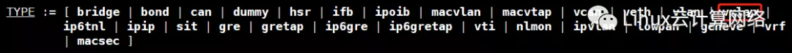
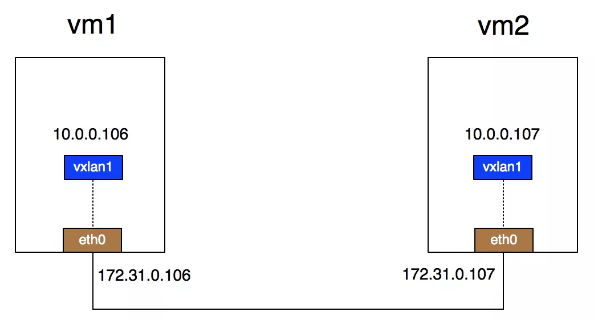
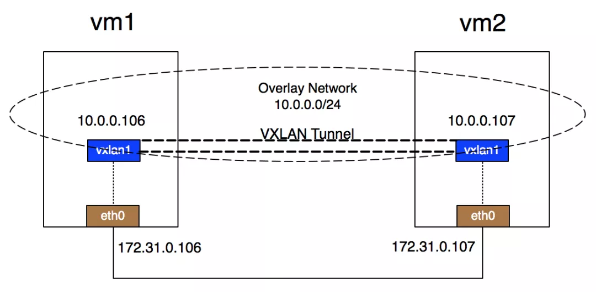
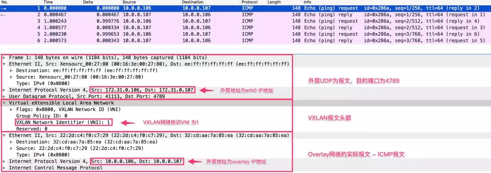
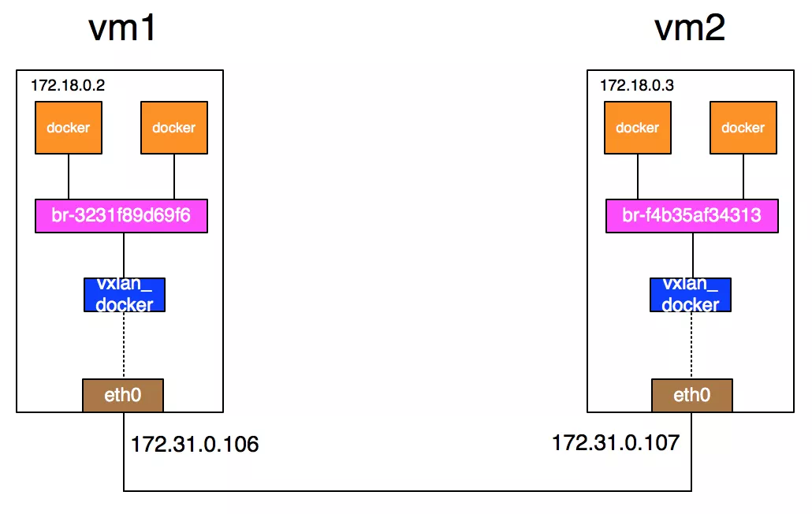

# Linux 下实践 VxLAN：虚拟机和 Docker 场景

## 01 Linux 上对 VxLAN 的支持[#](https://www.cnblogs.com/bakari/p/11264520.html#511591390)

首先，来看下 Linux 对 VxLAN 的支持，Linux 对 VxLAN 协议的支持时间并不久，2012 年 Stephen Hemminger 才把相关的工作合并到 kernel 中，并最终出现在 kernel 3.7.0 版本。为了稳定性和很多的功能，你可以会看到某些软件推荐在 3.9.0 或者 3.10.0 以后版本的 kernel 上使用 VxLAN。

这些版本的 Linux 对 VxLAN 的支持已经完备，支持单播和组播，IPv4 和 IPv6。利用 man 查看 ip 的 link 子命令，可以查看是否有 vxlan type，如下：

```sh
Copyman ip link
```



以下的实验在如下的环境中完成：

- 操作系统版本：CentOS Linux release 7.4.1708 (Core)
- 内核版本：3.10.0-693.2.2.el7.x86_64
- 云虚机vm1 eth0网络接口IP 172.31.0.106，云虚机vm2 eth0网络接口IP 172.31.0.107

## 02 实验1：最简单的点对点 VxLAN[#](https://www.cnblogs.com/bakari/p/11264520.html#440098351)

创建简单的点对点 VxLAN 环境非常简单。如下图所示，只需要在两个机器(物理机或者虚拟机都可以，本实验中是云上的虚拟机环境)中各创建一个 vxlan 类型的网络接口即可，vxlan 类型的接口 vxlan1 可以作为的 VTEP。



在上面的环境中，注意我们将 vxlan 网络接口配置上 IP 地址，在 10.0.0.0/24 网段内。在 IP 地址分配后，Linux 系统的路由表就会创建一条路由，去往 10.0.0.0/24 网段的报文走网络接口 vxlan1 出去。vm1 上去往 10.0.0.0/24 的报文，在 vxlan1 上会做 VxLAN 封装，内层地址是10.0.0.106，外层地址是172.31.0.106。VxLAN 报文通过物理网络达到对端 vm2 上的 VETP vxlan1，在 vm2 的 vxlan1 接口上做VxLAN 协议的解封装，从而结束整个过程。

上图是一个物理上的示意图，在逻辑上形成的 VxLAN overlay 网络环境如下图，虚线部分示意出来的 Overlay Network 和 VxLAN Tunnel 都是逻辑上的概念。如果有容器和虚机被接入逻辑上的 Overlay 网络 10.0.0.0/24，它们完全不用感知底层物理网络，看起来对端是和自己在同一个二层环境里，就是像是在 VTEP 设备的上面直接构建了一条 VxLAN Tunnel，把 Overlay 网络里的网络接口直接在二层打通。



具体的配置只需要 3 条命令。如下，在 vm1 上执行如下命令：

```sh
Copy# ip link add vxlan1 type vxlan id 1 remote 172.31.0.107 dstport 4789 dev eth0
# ip link set vxlan1 up
# ip addr add 10.0.0.106/24 dev vxlan1
```

上面的第一条命令创建了一个 Linux 上类型为 vxlan 的网络接口，名为 vxlan1。

- id: VNI标识是1。
- remote: 作为一个VTEP设备来封装和解封VXLAN报文，需要知道将封装好的VXLAN报文发送到哪个对端VTEP。Linux上可以利用group指定组播组地址，或者利用remote指定对端单播地址。在实验的云环境中默认不支持组播，这里利用remote指定点对点的对端IP地址为172.31.0.107。
- dstport: 指定目的端口为4789。因为当Linux内核3.7版本首次实现VXLAN时，UDP端口还并没有规定下来。很多厂商利用了8472这个端口，Linux也采用了相同的端口。后来IANA分配了4789作为VXLAN的目的UDP端口。如果你需要使用IANA端口，需要用dstport指定。
- dev: 指定VTEP通过哪个物理device来通信，这里是使用eth0。

第二条命令让 vxlan1 接口 up 起来。第三条命令给设备分配 IP 地址 10.0.0.106, 子网掩码为 24 (255.255.255.0)。

在 vm2 上，利用类似方法创建名为 vxlan1 的网络接口。

```sh
Copy# ip link add vxlan1 type vxlan id 1 remote 172.31.0.106 dstport 4789 dev eth0
# ip link set vxlan1 up
# ip addr add 10.0.0.107/24 dev vxlan1
```

以上简单的命令就完成了所有配置。用 ifconfig 可以看到 vxlan1 网络接口，如下：

```sh
Copy# ifconfig vxlan1
vxlan1: flags=4163<UP,BROADCAST,RUNNING,MULTICAST>  mtu 1450
        inet 10.0.0.106  netmask 255.255.255.0  broadcast 0.0.0.0
        ether 22:2d:c4:f0:c7:29  txqueuelen 1000  (Ethernet)
        RX packets 0  bytes 0 (0.0 B)
        RX errors 0  dropped 0  overruns 0  frame 0
        TX packets 0  bytes 0 (0.0 B)
        TX errors 0  dropped 0 overruns 0  carrier 0  collisions 0
```

看下 vm1 的如下路由表，去往目的网段 10.0.0.0/24 的报文将走 vxlan1 接口。

```sh
Copy# route -n
Kernel IP routing table
Destination     Gateway         Genmask         Flags Metric Ref    Use Iface
0.0.0.0         172.31.0.253    0.0.0.0         UG    0      0        0 eth0
10.0.0.0        0.0.0.0         255.255.255.0   U     0      0        0 vxlan1
169.254.0.0     0.0.0.0         255.255.0.0     U     1002   0        0 eth0
172.31.0.0      0.0.0.0         255.255.255.0   U     0      0        0 eth0
```

在 vm1 上 ping overlay 网络的对端 IP 地址 10.0.0.107，可以 ping 通。

```sh
Copy# ping 10.0.0.107 -c 3
PING 10.0.0.107 (10.0.0.107) 56(84) bytes of data.
bytes from 10.0.0.107: icmp_seq=1 ttl=64 time=0.447 ms
bytes from 10.0.0.107: icmp_seq=2 ttl=64 time=0.361 ms
bytes from 10.0.0.107: icmp_seq=3 ttl=64 time=0.394 ms

--- 10.0.0.107 ping statistics ---
packets transmitted, 3 received, 0% packet loss, time 2000ms
rtt min/avg/max/mdev = 0.361/0.400/0.447/0.042 ms
```

在 ping 包的同时，用 tcpdump 抓 vm1 eth0 网卡的包。因为报文到达 eth0 前经过了网络接口 vxlan1, 完成了 VxLAN 的封装，所以在抓包结果里应该能看到完整的 VxLAN 报文。

抓包时可以只抓和对端 172.31.0.107 通信的报文，如下：

```sh
Copy# tcpdump -i eth0 host 172.31.0.107 -s0 -v -w vxlan_vni_1.pcap
```

抓包结果如下，wireshark 自动将 UDP 目的端口为 4789 的报文识别成 VxLAN 报文，直接显示内层的报文，protocol 为 ICMP 协议。如果使用 Linux 默认接口 8472，显示的应该是 UDP 协议，还需要修改 wireshark 的协议设置，让其识别成 VxLAN。



## 03 实验2：容器跨主机通信[#](https://www.cnblogs.com/bakari/p/11264520.html#3598713076)

上面最简单的点对点 VxLAN 实验只是个简答的演示，没有太多实际工程意义，本节用容器通信来演示一个更加完整的场景。

场景描述：在 vm1 和 vm2 上各部署一个 docker 容器，默认情况下，一个容器宿主机上的容器能够直接用私网 IP 地址通信，因为它们利用一个网桥接在一起。而不同宿主机上的容器无法直接用私网 IP 地址通信。k8s 等 docker 部署软件中的网络组建实际上完成了这部分工作，让不同宿主机的容器能够直接通信。本节使用原生 docker，以及在宿主机上自建的 vxlan 网络接口，来打通不同宿主机上容器，让它们可以直接利用内网IP通信。

注意：因为实验在云上的虚拟机上完成，上面提到的容器宿主机，用的是云上的虚拟机。容器宿主机也可以是物理机，实验效果不变。

### 3.1 准备 docker 容器[#](https://www.cnblogs.com/bakari/p/11264520.html#3471325233)

安装 docker 的过程不展开了，docker 官方文档有详细的描述。在 Linux 安装了 docker 后，可以看到多了一个 docker0 的网络接口，默认在 172.17.0.0/16 网段。这个是连接本地多个容器的网桥。

```sh
Copy# ifconfig docker0
docker0: flags=4163<UP,BROADCAST,RUNNING,MULTICAST>  mtu 1450
        inet 172.17.0.1  netmask 255.255.0.0  broadcast 172.17.255.255
        ether 02:42:44:e8:74:e8  txqueuelen 0  (Ethernet)
        RX packets 6548  bytes 360176 (351.7 KiB)
        RX errors 0  dropped 0  overruns 0  frame 0
        TX packets 7489  bytes 40249455 (38.3 MiB)
        TX errors 0  dropped 0 overruns 0  carrier 0  collisions 0
```

使用默认 172.17.0.0/16 网段，docker 容器的 IP 地址都会从 172.17.0.2 开始分配。为了能使 vm1 和 vm2 上的容器使用不同的IP地址，在利用 docker run 启动容器的时候需要能自定义 IP 地址，而利用 `--ip` 参数自定义 IP 地址的功能只能在自定网络中支持，所以先创建一个自定义网络，指定网段 172.18.0.0/16。

```sh
Copy# docker network create --subnet 172.18.0.0/16 mynetwork
3231f89d69f6b3fbe2550392ebe4d00daa3d19e251f66ed2d81f61f2b9184362
# docker network ls
NETWORK ID          NAME                DRIVER              SCOPE
1cb284a6cb33        bridge              bridge              local
069538be0246        host                host                local
3231f89d69f6        mynetwork           bridge              local
0b7934996485        none                null                local
```

利用 `docker network ls` 查看，可以看到一个新的 bridge 网络被创建，名称为我指定的 mynetwork。利用 ifconfig 可以看到多了一个网络接口，名字不是 dockerXX，而直接以 br 开头，是一个网桥。

```sh
Copybr-3231f89d69f6: flags=4099<UP,BROADCAST,MULTICAST>  mtu 1500
        inet 172.18.0.1  netmask 255.255.0.0  broadcast 172.18.255.255
        ether 02:42:97:22:a5:f9  txqueuelen 0  (Ethernet)
        RX packets 0  bytes 0 (0.0 B)
        RX errors 0  dropped 0  overruns 0  frame 0
        TX packets 0  bytes 0 (0.0 B)
        TX errors 0  dropped 0 overruns 0  carrier 0  collisions 0
```

创建一个新的容器，如下：

```sh
Copy# docker run -itd --net mynetwork --ip 172.18.0.2 centos
16bbaeaaebfccd2a497e3284600f5c0ce230e89678e0ff92f6f4b738c6349f8d
```

- --net指定自定义网络
- --ip指定IP地址
- centos指定image

查看容器 ID 和状态，并且登录 SHELL，如下：

```sh
Copy# docker ps
CONTAINER ID        IMAGE               COMMAND             CREATED             STATUS              PORTS               NAMES
16bbaeaaebfc        centos              "/bin/bash"         2 minutes ago       Up 2 minutes                            condescending_swartz
# docker exec -it 16bbaeaaebfc /bin/bash
[root@16bbaeaaebfc /]# ifconfig
bash: ifconfig: command not found
```

注意：docker 为了创建容器的效率，通常都用了 size 很小的 image，意味着很多常用工具需要安装，比如 centos image 里面的 ifconfig。可以利用 yum whatprovides ifconfig 命令查看 ifconfig 输入哪个包，查到属于 net-tools-2.0-0.22.20131004git.el7.x86_64包，直接用 yum install net-tools -y 安装即可。再执行 ifconfig 命令，可以看到容器 eth0 网卡的 IP 地址为 172.18.0.2。

```sh
Copy[root@16bbaeaaebfc /]# ifconfig eth0
eth0: flags=4163<UP,BROADCAST,RUNNING,MULTICAST>  mtu 1500
        inet 172.18.0.2  netmask 255.255.0.0  broadcast 172.18.255.255
        ether 02:42:ac:12:00:02  txqueuelen 0  (Ethernet)
        RX packets 3319  bytes 19221325 (18.3 MiB)
        RX errors 0  dropped 0  overruns 0  frame 0
        TX packets 2015  bytes 132903 (129.7 KiB)
        TX errors 0  dropped 0 overruns 0  carrier 0  collisions 0
```

在 vm2 上执行同样的操作，在创建新容器的时候，指定 IP 地址为 172.18.0.3，容器的环境即准备完毕。在 vm1 上的 centos 容器中 ping 172.18.0.3，和预期一致，是无法 ping 通的。

```sh
Copy[root@16bbaeaaebfc /]# ping 172.18.0.3 -c 2
PING 172.18.0.3 (172.18.0.3) 56(84) bytes of data.
From 172.18.0.2 icmp_seq=1 Destination Host Unreachable
From 172.18.0.2 icmp_seq=2 Destination Host Unreachable

--- 172.18.0.3 ping statistics ---
packets transmitted, 0 received, +2 errors, 100% packet loss, time 1000ms
pipe 2
[root@16bbaeaaebfc /]# ping 172.18.0.1 -c 2
PING 172.18.0.1 (172.18.0.1) 56(84) bytes of data.
bytes from 172.18.0.1: icmp_seq=1 ttl=64 time=0.060 ms
bytes from 172.18.0.1: icmp_seq=2 ttl=64 time=0.079 ms

--- 172.18.0.1 ping statistics ---
packets transmitted, 2 received, 0% packet loss, time 999ms
rtt min/avg/max/mdev = 0.060/0.069/0.079/0.012 ms
```

### 3.2 创建 VxLAN 接口接入 docker 网桥[#](https://www.cnblogs.com/bakari/p/11264520.html#3219866292)

先来梳理下docker及docker容器在Linux宿主机网络模块中做的操作，梳理清楚之后会发现打通不同宿主机上docker容器的方法非常简单。从宿主Linux系统的视角看操作系统中的网络设备，总结如下：

- docker0接口：网桥，在安装完docker后默认被创建，网段是172.17.0.0/16，网桥的默认IP地址为172.17.0.1。
- br-xxxx接口：网桥，在创建完自定义docker网络完被创建，网段是被用户指定的172.18.0.0/16，网桥的默认IP地址为172.18.0.1。
- vethxxxx接口：veth网络接口，在创建一个具体的docker容器后被创建，如果有N个运行的容器，就会有N个veth网络接口。容器中的eth0接口和宿主机的veth网络接口是一个veth网络对，Linux上的veth接口作为一个端口连接入docker网桥，如docker0或其他自定义网桥。这也是为什么一个宿主机上的docker容器能够默认通信的原因，因为它们创建后就被接入到了同一个网桥上。

为了方便理解，在默认网段172.17.0.0/16中创建2个容器，在自定义网段中上文已经创建了1个docker容器，利用btctl查看网桥及其接口，如下：

```sh
Copy# brctl show
bridge name    bridge id        STP enabled    interfaces
br-3231f89d69f6        8000.02429722a5f9    no        veth2fa4c50
docker0        8000.024244e874e8    no        vethc7cd982
                           　　　　　　　　　　　 vethd3d0c18
```

从上面的输出结果可以看到，默认网桥docker0上，有vethc7cd982和vethd3d0c18两个网络接口接入。在定义网络网桥br-3231f89d69f6一个端口上，veth2fa4c50网络接口接入。这三个veth网络接口分别连接着一个docker容器的eth0网络接口，连接着同一个网桥的veth网络接口vethc7cd982和vethd3d0c18默认二层能通。

有了上面的梳理和本文第一节VXLAN网络接口的基础知识，想必打通不同宿主机上docker容器的方法也比较清晰了。思路就是在两个容器宿主机上各创建一个VXLAN接口，并且将VXLAN接口接入docker网桥的端口上，如下图：



有了VXLAN接口的连接后，从vm1上docker容器发出的包到达docker网桥后，可以从网桥的VXLAN接口出去，从而报文在VETP(VXLAN接口)处被封装成VXLAN报文，再从物理网络上到达对端VETP所在的主机vm2。对端VTEP能正确解包VXLAN报文的话，随后即可将报文通过vm2上的docker网桥送到上层的docker容器中。

具体的配置如下，在vm1上：

```sh
Copy# ip link add vxlan_docker type vxlan id 200 remote 172.31.0.107 dstport 4789 dev eth0
# ip link set vxlan_docker up
# brctl addif br-3231f89d69f6 vxlan_docker
```

- 第一条命令创建VNI为200的VXLAN网络接口，名称为vxlan_docker，参数设置和场景1中的各个参数类似。
- 第三条命令把新创建的VXLAN接口vxlan_docker接入到docker网桥br-3231f89d69f6中。

在vm2上，输入如下命令：

```sh
Copy# ip link add vxlan_docker type vxlan id 200 remote 172.31.0.106 dstport 4789 dev eth0
# ip link set vxlan_docker up
# brctl addif br-f4b35af34313 vxlan_docker
```

在vm1的docker容器上再ping 172.18.0.3，结果如下，ping可以通。注意RTT的时间，ping 172.18.0.3的RTT在10^(-1)毫秒级别，ping 172.18.0.1的RTT在10^(-2)毫秒级别，前者是走物理网络的延迟，后者是协议栈的延迟，两者有量级上的差别。

```sh
Copy# docker exec -it 16bbaeaaebfc ifconfig eth0
eth0: flags=4163<UP,BROADCAST,RUNNING,MULTICAST>  mtu 1500
        inet 172.18.0.2  netmask 255.255.0.0  broadcast 172.18.255.255
        ether 02:42:ac:12:00:02  txqueuelen 0  (Ethernet)
        RX packets 3431  bytes 19230266 (18.3 MiB)
        RX errors 0  dropped 0  overruns 0  frame 0
        TX packets 2132  bytes 141908 (138.5 KiB)
        TX errors 0  dropped 0 overruns 0  carrier 0  collisions 0

# docker exec -it 16bbaeaaebfc ping 172.18.0.3 -c 2
PING 172.18.0.3 (172.18.0.3) 56(84) bytes of data.
bytes from 172.18.0.3: icmp_seq=1 ttl=64 time=0.544 ms
bytes from 172.18.0.3: icmp_seq=2 ttl=64 time=0.396 ms

--- 172.18.0.3 ping statistics ---
packets transmitted, 2 received, 0% packet loss, time 1001ms
rtt min/avg/max/mdev = 0.396/0.470/0.544/0.074 ms
#
# docker exec -it 16bbaeaaebfc ping 172.18.0.1 -c 2
PING 172.18.0.1 (172.18.0.1) 56(84) bytes of data.
bytes from 172.18.0.1: icmp_seq=1 ttl=64 time=0.072 ms
bytes from 172.18.0.1: icmp_seq=2 ttl=64 time=0.072 ms

--- 172.18.0.1 ping statistics ---
packets transmitted, 2 received, 0% packet loss, time 999ms
rtt min/avg/max/mdev = 0.072/0.072/0.072/0.000 ms
```

## 04 总结[#](https://www.cnblogs.com/bakari/p/11264520.html#3940895319)

最后说明，本节只是为了演示 Linux VxLAN 的用于而构造了这个简单但没有实际用处的场景，在跨主机环境的容器之间利用 VxLAN 从二层打通。在工程中做容器跨主机通信时有很多方面需要考虑，也有很多项目在致力于这方面的研究。比如 Flannel，通过给每台宿主机分配一个子网的方式为容器提供虚拟网络，它基于 Linux TUN/TAP，使用 UDP 封装 IP 包来实现 L3 overlay 网络，并借助 etcd 维护网络的分配情况。