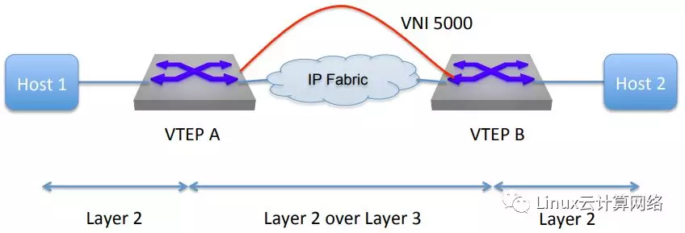
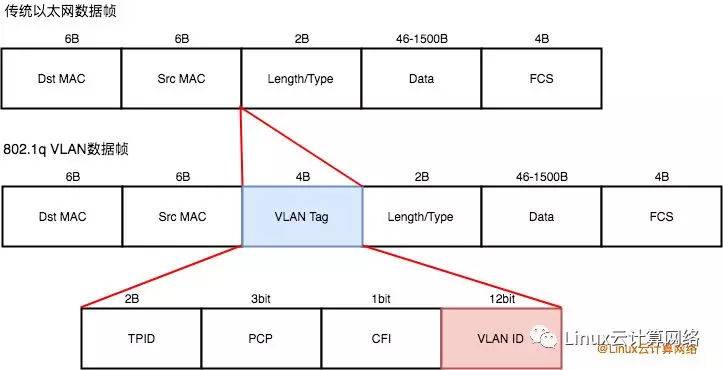
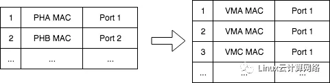
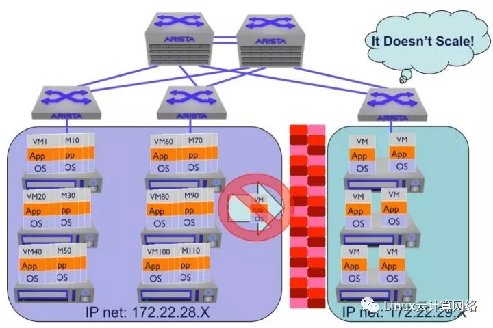
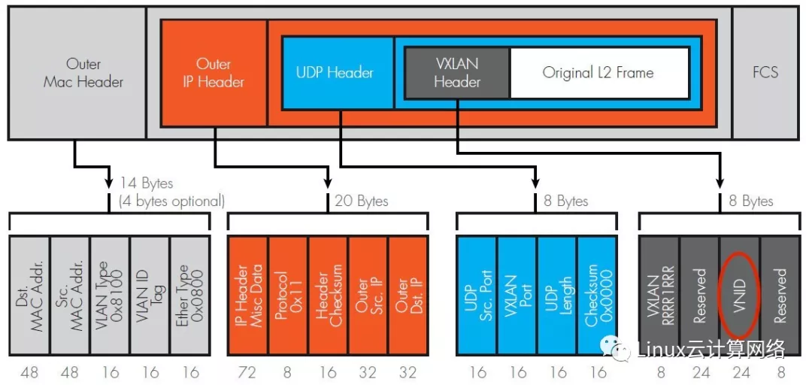
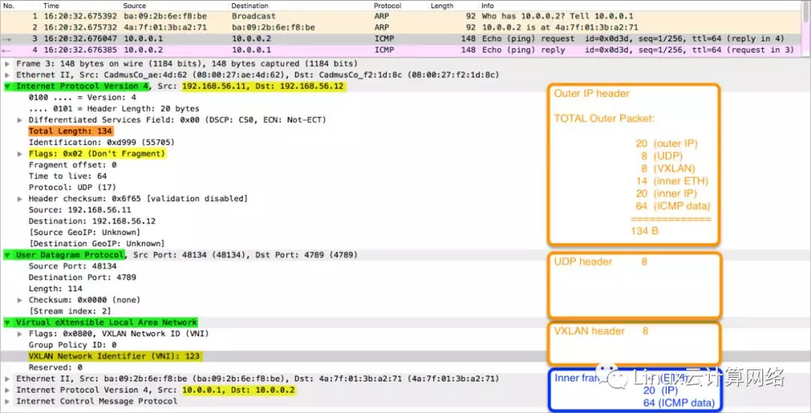
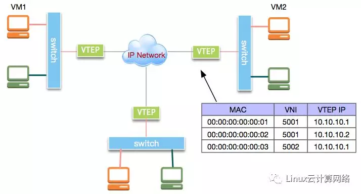

## 什么是 VxLAN

## 01 什么是 VxLAN？[#](https://www.cnblogs.com/bakari/p/11131268.html#896198393)

VxLAN 全称是 Visual eXtensible Local Area Network（虚拟扩展本地局域网），从名字上就知道，这是一个 VLAN 的扩展协议。

VxLAN 本质上是一种隧道封装技术。它使用 TCP/IP 协议栈的惯用手法——封装/解封装技术，将 L2 的以太网帧（Ethernet frames）封装成 L4 的 UDP 数据报（datagrams），然后在 L3 的网络中传输，效果就像 L2 的以太网帧在一个广播域中传输一样，实际上是跨越了 L3 网络，但却感知不到 L3 网络的存在。

如下图所示，左右两边是 L2 广播域，中间跨越一个 L3 网络，VTEP 是 VxLAN 隧道端点(VxLAN Tunnel Point)，当 L2 以太网帧到达 VTEP 的时候，通过 VxLAN 的封装，跨越 L3 层网络完成通信，由于 VxLAN 的封装"屏蔽"了 L3 网络的存在，所以整个过程就像在同一个 L2 广播域中传输一样。

VxLAN 是应网络虚拟化技术而生的。随着数据中心网络不断扩增，Cisco、VMware 和 Arista Networks 这些巨头发现，传统的 VLAN 隔离已经无法应对网络虚拟化技术所带来的成千上万的设备增长，于是便联合起草了这个协议，一直到 2014 年才定稿，由 **RFC 7348** 所定义。

## 02 为什么需要 VxLAN？[#](https://www.cnblogs.com/bakari/p/11131268.html#479401711)

主要有三点考虑，使得网络虚拟化迫切需要向 VxLAN 转变。

**1、VLAN ID 数量限制**

虚拟化技术的发展，使得以前以单个物理设备组网的方式，逐步向以虚拟设备的方式过渡。

以前一台物理设备（一台服务器也好，一台网络设备也好），能支持几十个端口就已经很了不起了，所以使用 VLAN 是绰绰有余，但是虚拟化环境下就大不同了，一台物理主机可能虚拟出上百上千台虚拟设备，整个云数据中心可能要划分超过成千上万个的广播域，而 VLAN 被限制为最多 4094 个，这就显得捉襟见肘了。

具体我们分析下 VLAN 的包格式就知道了。802.1Q 标准定义了 VLAN 协议的以太网帧格式如下：

可以看到，VLAN 帧在以太网帧的基础上增加了 VLAN Tag 字段，该字段包含 TPID、PCP、CFI 和 VID 4 个部分，其中 VID 即表示 VLAN ID，占 12bit，取值范围为 0~4095，其中 0 和 4095 为保留值，不能给用户使用，所以一个以太网最多可以划分为 4094 个 VLAN。这就是 **4094** 这个值的由来。

**2、更好地利用多条网络链路**

VLAN 使用 STP 来管理多条网络链路，避免数据传输时出现的环路。STP 根据优先级和成本，只会选择其中一条链路工作，其余链路作为备用链路，也就是主备模式（active-passive）。这样虽然既避免了环路，也增强了可用性，但没有充分利用多条线路来提升性能，对于用户来说，等于是花 N 倍的钱，却只享受到了 1 倍的服务。

VxLAN 则不然，VxLAN 可以在 L3 层网络上，透明地传输 L2 层数据，这让它可以利用 ECMP (Equal-cost multi-path，等价多路径) 等协议实现多条路径同时工作，也就是 active-active 模式。这样当网络流量较大时，可以实现流量的负载均衡，提升数据传输性能。

**3、TOR 交换机 MAC 地址表限制**

交换机的原理是根据 MAC 地址表完成数据包的二层转发。在虚拟化技术没出现之前，数据中心的 TOR(Top of Rack) 交换机的一个端口连接一台物理主机，并对应一个 MAC 地址，当虚拟化技术出现之后，一台物理主机虚拟出几十甚至上百台虚拟机，TOR 交换机的一个端口虽然还是连接一台物理主机，但却对应多个 MAC 地址（这还在不算 VLAN 划分的情况下），如下图所示：

这无疑会造成 TOR MAC 地址表的膨胀，交换机本身 MAC 表的空间是有限的，如果溢出，就会造成交换机的不断泛洪，增加了处理负担。

如果使用 VxLAN 则不然，VxLAN 使用 VTEP 封装虚拟机的二层帧，在三层网络上传输，通常，一台物理机对应一个 VTEP，一个 VTEP 可以被该台物理机上的所有虚拟机共有，所以，对于 TOR 交换机的 MAC 地址表来说，一台物理机只用记录一条 VTEP 信息即可。这样就避免了 MAC 地址表暴增的问题。

**4、灵活的虚拟机部署和迁移**

采用 VLAN 的虚拟网络环境，不存在 overlay 网络，只有 underlay 网络。也就是说 虚拟机的 VLAN 数据包直接在物理网络上传输，和物理网络上的 VLAN 数据包融合在一起，这样的好处是虚拟机能直接访问到物理网络的设备，但坏处也很明显，虚拟网络无法打破物理网络的界限，具体表现在虚拟机的部署和迁移不太灵活。

- **部署** ：如果要在 VLAN 100 上部署虚拟机，那么只能在支持 VLAN 100 的物理机上部署，如下图所示，假设左右两个区域分属 VLAN 100 和 VLAN 200，现在 VLAN 100 已经部署了很多虚拟机，而 VLAN 200 却才部署了少量的虚拟机，如果这时需要继续往 VLAN 100 部署新的虚拟机，那么也只能选择在左边区域部署，这就会造成左边区域负担过重。
- **迁移** ：同样，如果从左边区域往右边区域迁移虚拟机，因为两边分属于不同的 VLAN，虚机所分配的 IP 地址不同，无法直接进行迁移，这会造成整个集群机器的负载分配不均。

使用 VxLAN 则完全不全在这些问题，通过 VxLAN 的封装，在一个 L3 网络上构建了 L2 网络，或者说基于 underlay 网络的 overlay 网络，虚拟机的数据可以打破 L2 网络的限制，在 L3 网络上传输，虚拟机的部署和迁移也不受物理网络的限制，可以灵活部署和迁移，使得整个数据中心保持一个平均的利用率。

## 03 VxLAN 的报文格式[#](https://www.cnblogs.com/bakari/p/11131268.html#3506201756)

VxLAN 是一种隧道封装技术，那自然它的报文格式也是一种封装的结构，如下图很好地展现了 VxLAN 的封装报文格式。

首先，最里面是原始的 L2 以太网帧，也就是虚拟机发出的数据帧，接着封装上 VxLAN 的头部，然后整个 VxLAN 帧再封装在物理网络中的 UDP 报文中，接着是 IP 包头，MAC 头。为了和内部的原始以太网帧区别，外部封装的都加上外层 IP 头，外层 MAC 头。

其中，VxLAN 头由 8Bytes 组成，分别是：

- Flags：占 8bits，具体是 `RRRRIRRR`，其中 `I` 必须设置为 1，表示是是一个合法的 VxLAN ID，其它 7bits 的 `R` 作为保留字段并且设置为 0。
- VNI(VxLAN Network Identifier)：占 24bits，VxLAN 的 ID 标识，这个字段就对比于 12bits 的 VLAN ID，支持 ID 个数扩展为 `2^24 = 16777216`，约等于 16M 个。
- Reserved：有两个字段，分别占 24 bits 和 8 bits，作为保留字段并且设置为 0。

对于 UDP 头部，需要注意的是，目的端口(dst port) 默认设置为 4789，这是 IANA 分配的 VxLAN 协议使用端口号。

其余字段都是我们常见的 TCP/IP 协议字段，这里就不再赘述了。

如果嫌以上图示还比较抽象，可以参考下面这幅用 Wireshark 抓包的图，更为直观：

## 04 VxLAN 的数据传输[#](https://www.cnblogs.com/bakari/p/11131268.html#2583739145)

下面通过一个具体的例子来看看基于 VxLAN 的网络结构及数据传输是怎样的。

如下图，是一个基于 VxLAN 的网络结构图：

图中，VTEP 叫做 VxLAN 隧道端点(VxLAN Tunnel Endpoint)，是 VxLAN 协议中将对原始数据包进行封装和解封装的设备，它可以由硬件设备实现，也可以由软件实现。

假如图中 VM1 ping VM2，会是怎样一个通信过程：

1. VM1 不知道 VM2 的 MAC 地址，会发出 ARP 请求。
2. VM1 所在主机的 VTEP 封装 ARP 请求包，并向网络中其余 VTEP 广播。同时在 MAC 地址表中记录 VM1 的表项。
3. VM2 所在主机的 VTEP 接收 ARP 请求包，解封装之后将原始包发到 VM2，同时记录 VM1 的 MAC 地址表项。
4. VM2 发出 ARP 响应，经过 VTEP，再次封装之后，由于之前学习到 VM1 的地址，所以直接单播发给 VM1 所在主机的 VTEP，同时记录 VM2 的 MAC 地址表项。
5. VM1 所在主机 VTEP 接收 ARP 响应包，解封装之后发给 VM1，同时记录 VM2 的 MAC 地址表项。
6. VM1 拿到 VM2 的 MAC 地址之后，发出 ICMP 包，这个时候 VTEP 的 MAC 地址表中已经学习到 VM2 的地址，所以直接封装之后，单播发给 VM2 所在主机 VTEP。
7. VM2 所在主机 VTEP 解封装之后，直接发给 VM2。
8. VM2 构造 ICMP 的响应包，同样的过程发给 VM1，至此完成整个 ping 的过程。

## 05 总结[#](https://www.cnblogs.com/bakari/p/11131268.html#19333408)

VxLAN 相比 VLAN 有很多的优势，不过在可预见的未来，还不能完全替代 VLAN，这需要根据使用场景具体分析。VxLAN 的优势更多体现大规模环境下，如果网络设备规模，不论是虚拟的还是物理的，只有百十台的样子，那么直接使用 VLAN 就足够了。另外一个 VxLAN 的封装解封装机制也会影响性能，所以需要综合考虑。

VxLAN 在 Linux、OVS、容器网络等实现中都有非常多的应用，关于这些内容，留作后面具体讲解了。