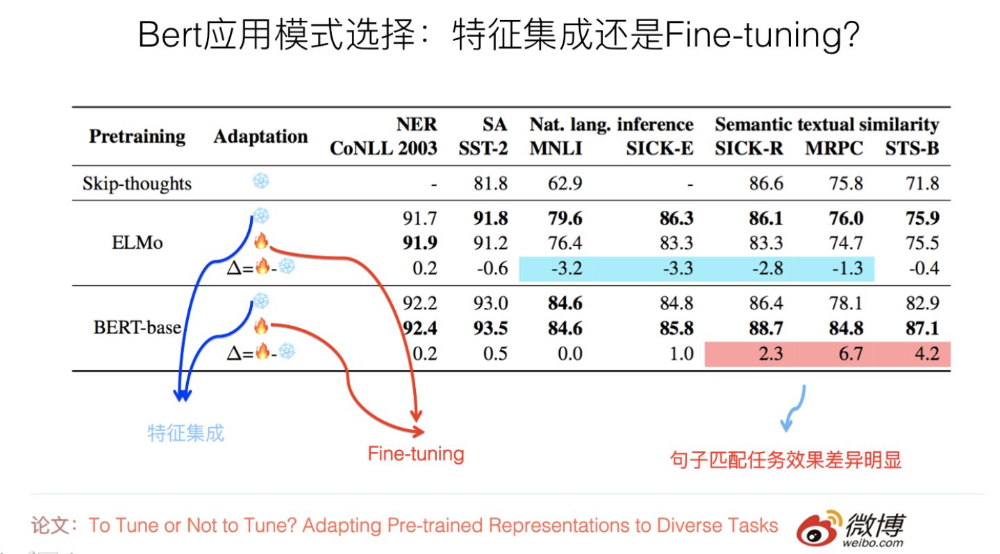
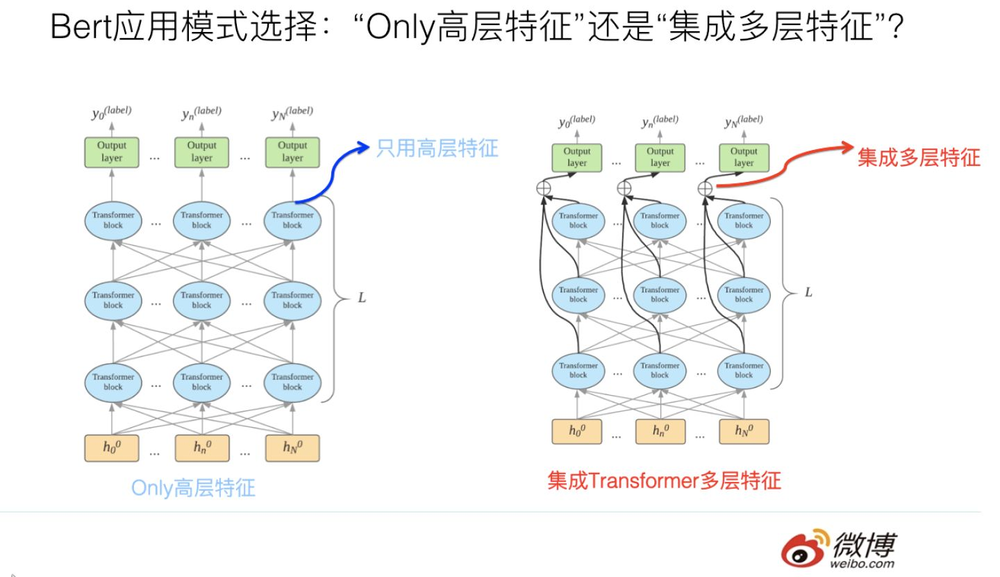
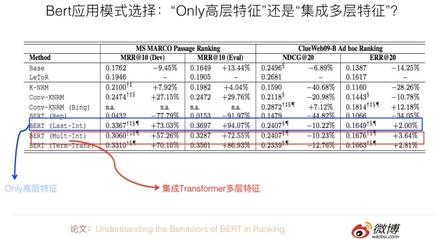
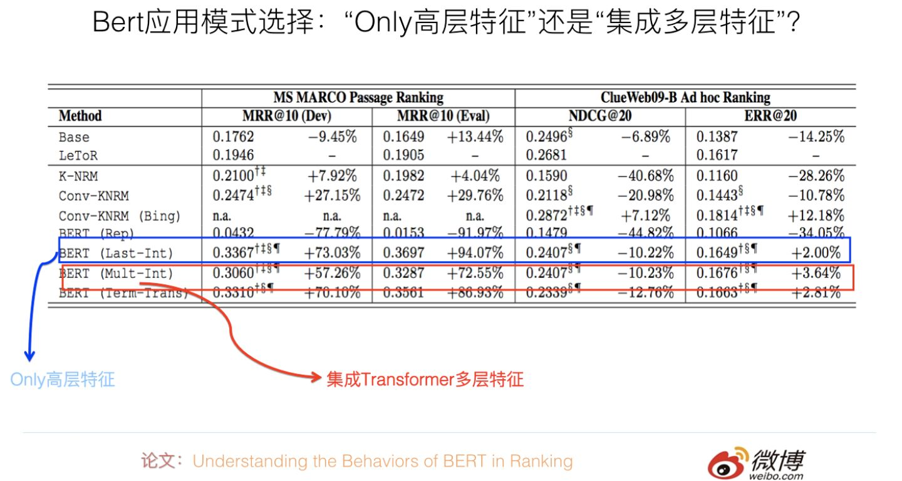
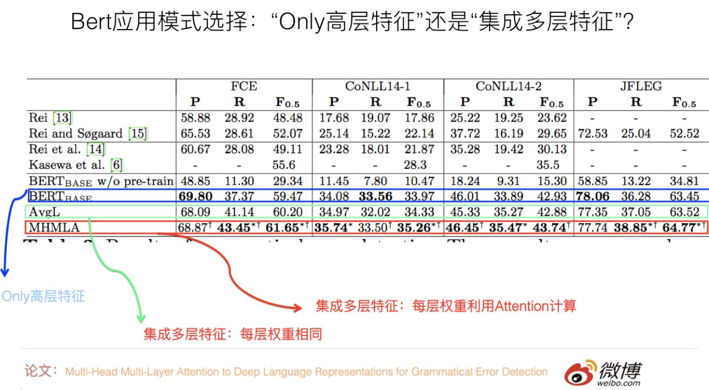

作者：张俊林
链接：https://zhuanlan.zhihu.com/p/65470719
来源：知乎
著作权归作者所有。商业转载请联系作者获得授权，非商业转载请注明出处。

最近两个月，我比较关注Bert的领域应用现状，以及Bert存在哪些问题及对应的解决方案。于是，收集了不少相关论文，正在梳理这两个问题，并形成了两篇文章。这部分内容本来是第一篇“应用篇”的一部分，后来发现文章实在太长，于是从介绍Bert领域应用现状的文章中剥离出来。本部分涉及具体技术较少，比较务虚，所以单独抽出来了，主题也比较散。所讲纯属个人思考，眼光有限，错误难免，谨慎参考。

## **鱼与熊掌：Bert应用模式比较与选择**

我们知道，ELMO／GPT／Bert这几个自然语言预训练模型给NLP带来了方向性的指引，一般在应用这些预训练模型的时候，采取两阶段策略：首先是利用通用语言模型任务，采用自监督学习方法，选择某个具体的特征抽取器来学习预训练模型；第二个阶段，则针对手头的具体监督学习任务，**采取特征集成或者Fine-tuning的应用模式，**表达清楚自己到底想要Bert干什么，然后就可以高效地解决手头的问题和任务了。

关于Bert大的应用框架如此，但是，其实有几个悬而未决的应用模式问题并没有探讨清楚，比如以下两个问题，它们的答案是什么？首先搞清楚这些问题其实是很重要的，因为这对于后续的Bert领域应用起到了明确的指导作用。哪两个问题呢？

问题一：下游任务在利用预训练模型的时候，有两种可能的选择：特征集成（Feature Ensemble）或者微调（Fine-tuning）模式。那么对于Bert应用来说，这两种模式，到底哪种应用效果更好呢？还是说两者效果其实差不多？这是一个问题，这个问题如果有明确答案，那么在做应用的时候，可以直接选择那个较好的方案。

我们知道，ELMO在下游任务使用预训练模型的时候，采用的是特征集成的方式：就是说把当前要判断的输入句子，走一遍ELMO预训练好的的双层双向LSTM网络，然后把每个输入单词对应位置的高层LSTM激活embedding（或者输入单词对应位置的若干层embedding进行加权求和），作为下游任务单词对应的输入。这是一种典型的应用预训练模型的方法，更侧重于单词的上下文特征表达方面。

GPT和Bert则采取了另外一种应用模式：Fine-tuning。意思是：在获得了预训练模型以及对应的网络结构（Transformer）后，第二个阶段仍然采用与预训练过程相同的网络结构，拿出手头任务的部分训练数据，直接在这个网络上进行模型训练，以针对性地修正预训练阶段获得的网络参数，一般这个阶段被称为Fine-tuning。这是另外一种典型的应用模式。

 当然，在实际应用的时候，只要有了预训练模型，应用模式是可选的。其实ELMO也可以改造成Fine-tuning的模式，GPT和Bert同样也可以改造成特征集成的应用模式。 那么，这两种应用模式对应用来说，有效果方面的差异吗？

 有篇论文专门探讨了这个问题，论文的名字是：“To Tune or Not to Tune? Adapting Pre-trained Representations to Diverse Tasks”，这篇论文还是挺有意思的，有时间的同学可以仔细看看。

它的目的是对比ELMO和Bert的上述两种应用模式的差异，希望得出到底哪种模式更适合下游任务的结论。它使用了7种不同的NLP任务来评估，如果归纳一下实验结果（参考上图），可以看出这个问题的结论如下：对于ELMO来说，特征集成的应用方式，在不同数据集合下，效果稳定地优于Fine-tuning；而Bert的结论正好相反，Fine-tuning应用模式的效果，在大部分任务中与特征集成模式效果相当或者稍好些，但是对于sentence pair句子对匹配类的任务，则Fine-tuning效果明显好于特征集成的方式。这可能是因为Bert在预训练的过程中包含Next Sentence Prediction任务，考虑到了句间关系问题，所以和下游的sentence pair任务比较匹配导致的。

另外还有一个证据。清华大学最近有篇论文（Understanding the Behaviors of BERT in Ranking），尽管它的主题不是专门探讨上述问题的，但是有组相关的实验，也能在一定程度上说明问题，所以我把那篇论文的结论也列在这里。它的结论是：对于比如QA这种句子匹配类问题，如果仅仅把Bert作为特征表达工具，也就是说，Bert的输入侧只是单独输入Question或者单独输入Passage，取出Bert高层的[CLS]标记作为Question或者Passage的语义表示；这种应用方式，效果远不如在Bert端同时输入Question和Passage，意思是让Transformer自己去做Question和Passage的匹配过程，应用效果会更好，而且两者效果相差甚远。这从侧面说明了：在QA任务中，Fine-tuning模式效果是要远好于特征集成模式的。

这在一定程度上说明了：起码对于句子匹配类任务，Fine-tuning这种应用模式效果是要远好于特征集成那种特征表示应用模式的。当然，因为没有看到更多的工作来对两种模式做对比，所以谨慎的做法是：仅仅把这个结论限制在句子对匹配任务上，其它非句子对匹配任务目前并没有特别明确的结论，这块值得通过更多实验继续深入摸索一下。

Bert的原始论文，也简单对比了下两种模式，我印象是Fine-tuning模式要略优于特征集成模式。

综合上述三个工作，我觉得目前可以得出的结论是：对于句子匹配类任务，或者说是输入由多个不同组成部分构成的NLP任务，那么在应用Bert的时候，采用Fine-tuning效果是要明显好于特征集成模式的。所以遇到这种类型的任务，你不用犹豫，直接上Fine-tuning没有大错。而对于其它类型的任务，在应用Bert的时候，Fine-tuning模式要稍好于特征集成模式，或者两者效果差不多。

再简练点的话，结论是：对于Bert应用，安全稳妥的做法是，建议采取Fine-tuning的模式，而不是特征集成的模式。

问题二：假设我们选定了Fine-tuning的应用模式，在标准的Bert的Fine-tuning过程或应用中的推断过程中，一般而言，分类层的输入信息来自于Bert的Transformer特征抽取器的最高层输出。我们知道，Transformer Base版本是有12层的，一种直观感觉有意义的想法是：也许不仅仅最高层的Transformer包含有效的分类特征信息，底下的11层Transformer中间层，可能编码了输入句子的不同抽象粒度的特征信息。那么，如果我们在分类前，通过一定方式把每个单词对应的Transformer的多层中间层的响应值集成起来，在这个集成好的特征基础上，上接分类层，从直觉上感觉应该是有效的，因为感觉好像融入多层特征后，信息更丰富一些。

 那么事实到底如何呢？这种集成多层特征的模式，与只使用Transformer最高层特征的使用模式，到底哪个效果更好呢？这个问题其实也挺有意思。

清华大学那篇论文：Understanding the Behaviors of BERT in Ranking。其实主要可以用来回答上面这个问题。它在分类层之前，采用了几种不同的特征集成方式，并对比了在QA任务上的性能差异。如果进行归纳，结论如下：直接使用Bert输入的第一个起始标记[CLS]对应位置的最高层Transformer的Embedding作为分类层的输入，以此作为文本匹配特征表示，既简洁效果又最好。其它的几个对比方案，包括集成最高层Transformer各个单词的embedding，或者集成不同层Transformer的响应值，或者更复杂的方案，效果是不如这种最简单的方案的（参考上图，一个数据集合中Only高层特征明显占优，另外一个两者效果相近）。我觉得，这说明了：对于句子对匹配任务，这个[CLS]标记已经编码了足够多的句子匹配所需要的特征信息，所以不再需要额外的特征进行补充。

当然，上述实验结果的结论，还仅仅局限在QA任务上，我估计顶多能扩充到句子对匹配类任务上。至于NLP其它类型任务，比如单句分类或者序列标注任务，还需要额外的证据说明或进行比较分析。

关于序列标注任务，有篇论文：“Multi-Head Multi-Layer Attention to Deep Language Representations for Grammatical Error Detection”是用来验证这两种模式不同效果的，它做的是语法错误检测任务，这是一种序列标注任务，也就是说，每个输入单词都需要对应一个分类结果输出。它提出了的实验结果证明了：在这个任务中，与只使用最高层特征模式相比，集成多层特征的具体方式对效果有影响，如果在集成各层特征的时候，把每层特征的重要性看作是相同的（取均值），那么效果跟只使用最高层特征比，不同数据集合下效果有好有坏，总体看差不太多或者稍微好点。如果加入Attention来自适应的学习每层特征的权重，那么效果稳定地好于只使用高层特征的模式。这说明：在序列标注任务中，倾向于选择多层特征融合的应用模式。

 我们去年在用Bert改进微博打标签（文本分类任务）应用的时候，也尝试过集成不同层的embedding特征，当时测试对于应用效果的F1数值有大约不到2个百分点的提升（相对仅使用Bert最高层特征的方法）。不过除此外，我还没看到有其它发表工作说明这个问题。

所以，我觉得关于这个问题，目前的结论貌似可以这样下：  *** 对于句子匹配等多输入的NLP任务，直接使用Bert高层的[CLS]标记作为输出的信息基础，这是效果最好的，也是最简单的模式。 ***  对于序列标注类任务，可能多层特征融合更适合应用场景，但是在融合各层特征时，要做细致些。对于单句分类等其它任务，因为没有更多的工作或者实验来说明这个问题，所以尚未能下明确的结论，这块还需要后续更多的验证工作。我的预感是，这可能跟任务类型有关，不同类型的任务可能结论不太一样，背后可能有更深层的原因在起作用。

## **困境与希望：Bert到底给NLP领域带来了什么**

毫无疑问，Bert是NLP领域的极为重大的技术进展，在我看来，Bert的重要性，很可能比把深度学习引入NLP领域这种研究模式转换的进展重要性都要高，因为DL刚引进NLP的时候，说实话，效果跟传统模型相比，并没有体现出明显优势。但是Bert的效果之好，出人意料，它完全可以跟CV领域以Resnet为代表的Skip Connection相比，属于深度学习在两个不同领域的熠熠夺目双子星。

尽管后面才会提，但是这里可以一句话归纳一下：从NLP各个领域的应用效果可以看出，在使用了Bert后，在很多领域，指标一般都有不同幅度的增长，不同领域情况不同，不少领域有大幅度地增长，很多领域有30%甚至100%的提升。这些事实摆在我们面前，按理说，这说明Bert的技术突破给NLP研究与应用带来了很大希望，同时指明了发展方向：就是通过预训练的模式，充分使用大量的无标注语言数据，利用自监督模型，发挥Transformer特征吸收能力强的特点，来对语言知识进行特征编码。用这些知识来促进很多下游NLP任务的效果，以弥补有监督任务往往训练数据规模不够大，无法充分编码语言知识的困境。

既然前途如此光明，那么我们完全可以只讲希望与方向，对于所谓的“困境”，貌似没什么可谈的。其实不然，世间事都是人做出来的，如果我们的思考对象是身处其中的研发人员，则对于很多局中人，有着显而易见的困境或者说是困扰。这体现了另外一种理想和现实的差距。这个距离有多远？相信有一定生活阅历的人都理解，答案是：与天海之间的距离是一样的，在站在海边的人眼里，远看无限近，近看无穷远。这正像，我们每个人都希望自己能活出“美丽的外表，有趣的灵魂”，但是活着活着，在生活的重力挤压下，活成了“有趣的外表，美丽的灵魂”，甚至，可能连美丽的灵魂都已蒙尘。

最近感概有点多，说远了，跑回来。

那么，对于很多局中人，Bert的出现带来的困扰是什么呢？

 现在很多证据表明：直接简单应用Bert，往往就会对很多任务的指标有大幅度地提升。在Bert出来之前，我相信有很多人，在绞尽脑汁地尝试着各种不同的NLP改进方法，也许思路各异，但是能够像Bert这样直接对应用有这么高幅度提升的方法，我相信这种方法应该基本没有。否则，现在大家看到的，除了Bert外，应该有另外一个“模型震惊部”推出的新模型，但是骨感的现实是，并没有，所以我这个假设看上去并没什么大毛病。

顺着这个假设推理下去，这又说明什么呢？说明了有大量怀胎十月哇哇坠地甚至还刚受孕的NLP论文，因为Bert的出现，它们已经没有出生的必要了。“从来只见新人笑，有谁记得旧人哭”。刚看到Bert论文的时候，我的耳边仿佛传来很多无奈的苦笑声，而这笑声，应该来自于这些技术创新的发明者。

从另外一个角度考虑，Bert的出现，快速拉高了很多NLP应用领域的Benchmark或者对比baseline，所以会引发一个对很多NLP领域研究者，尤其是憋论文的研究生的一个现实的问题。什么问题？就是在一夜之间大幅提升的基线方法高压下，如果不在Bert的基础上进行方法创新，那么提出一种效果要好于Bert效果的新方法，概率是非常低的。这意味着有了Bert后，创新难度大大增加了，这对于应用人员没什么，对于有创新要求的人来说，门槛变高了。

你会反问：为什么将Bert作为对比参照系，原先的方法就失灵了呢？我可以在Bert基础上，再套用我原先想的办法来创新吗不是？当然，不排除有些点子具备不管风吹浪打，我自闲庭信步的成功可能性，但是对于绝大多数方法，我相信这条路是走不通的。为什么？因为很可能你憋了半年的那个方法产生的一点收益，已经被Bert自身带来的收益覆盖或者吃掉了。意思是说，如果没有Bert，你的改进可能看着还算有些效果，但是你想叠加到Bert上，既想吃到Bert带来的技术红利，又能体现你方法的优点，这个良好愿望，实现的概率，是很低的。如果你还这么乐观地想这个问题，那么，我觉得你该定个闹钟早点叫醒自己了。看到这，你体会到我上面说的理想和现实的距离问题了吗？

不过话说回来，创新难度增加，看你怎么看这个问题了。其实从领域长远发展来看，是有好处的。好处是：也不局限于NLP领域，大多数AI领域的98%以上的所谓创新，如果把眼光放长远，是没有太大价值的。怎么判断？再过几年不会被人提起的创新，都属于这种。如果这个假设成立，那么Bert的出现，会逼迫从业者不要浪费时间在这些没有什么长远领域价值的点子上，而逼迫你去解决那些真正有价值的问题。没有Bert的时候，只能靠自觉或者研究品味来做到这一点，有了Bert，你就不能不这么做了。从这点讲，出现突破模型，对于领域人力资源的投入优化配置，是具有非常积极的作用的。所以很多事情，看你是站在什么角度去看的，不同的角度，可能得出相反的结论。

不过，我想，除了上面观察角度各异结论会不同的判断外，Bert确实可能存在一个坏处：很多非常新的想法，在刚提出来的时候，效果可能并不能达到类似Bert这种碾压效果，甚至效果不太明显，需要后面有个灵机一动的改进，让它的效果发挥出来。但是面临Bert的高基线，很可能很多具备高潜力的点子，根本发表不出来。意味着Bert这堵高墙，可能遮蔽了很多低垂灌木的阳光，使得它们还没长大就夭折了。这是Bert可能带来的负面效果。

另外一个容易让人感到无奈的事实是：Bert的出现预示着，使用Transformer这种重模型，利用几乎无穷多的自然语言文本资源进行自监督训练，这条路看样子是能走通的，而这是一条通向NLP之峰的阳关大道。但是复杂模型加上超量数据，也预示着要想沿着这条路线继续往后走，在预训练阶段，对机器资源的消耗非常之大，这种金钱游戏，不是你我这种NLP届的穷人们玩的起的。这就像什么呢？打个比方，漫威电影里的超级英雄们，各个身手非凡，但是如果追究下他们超能力的来源问题，就上升到阶级问题了，所谓“富人靠科技，穷人靠变异”，这句力透屏幕的扎心总结，透着浓浓的马克思主义的气息。换成Bert时代，那就是 “富人靠机器，穷人靠运气”。各位还请检查下银行卡余额，对号入座。

不过话说回来，有些事，接受事实就好，不要想太多，想太多，除了苦恼，什么也得不到。虽说世事本多无奈，但我们要永保赤子之心，毕竟无奈着无奈着……..慢慢你也就习惯了……..

## **路在何方：Bert时代的可能NLP创新路径**

上面既然谈到了可能的困境与希望，不妨再进一步深入思考一下：对于有创新要求的局中人，在Bert时代，未来可以选择怎样的创新路径呢？这个问题其实还是很重要的。

以我的私见，将来能走的路有几条，各自难度不同，我来列一列，你可以衡量看看你打算怎么走。再次强调，纯属个人意见，谨慎参考。

第一条路是条康庄大道。就是说，在完全不依赖Bert的基础上，提出一个与Bert效果相当或者更好的新模型或新方法。这绝对是条金光闪闪的正路，但是，走通的概率有多大你自己自我评估一下。当然，私心里，我本人是特别赞成没有各种短期压力，无论是创新成果压力还是经济压力，的同志走这条路的。也对能选择走上这条路的同志表示敬意，能选这条路是非常不容易的，而且我相信，一定会有人会坚定不移地选择这条路。

这条路拼的是对领域的认识深刻程度，速度不关键。

第二条路，不考虑模型创新，可以利用Bert预训练模型，直接去做各种应用，以实证Bert在各种领域是有效果的。当然，在应用Bert的时候，也可能适应领域应用特点，做出些模型的改动，但是无疑这种改进不会大。这是一条相对好走的路，好走的路走的人自然就会多，所以这条路拼的是谁的速度快。目前大量Bert的后续工作属于这一种，这很正常。后面应用篇文章总结的也是这一类的工作。

第三条路，通过各种偏实验性的研究，以更深入地了解Bert的特性，其实我们目前并没有对Bert及Transformer有很深刻的了解，而我们目前也非常急迫地需要做到这一点。如果我们能够对它们加深了解，这也是非常有价值的，因为对Bert进一步做较大的改进，改起来会更有针对性。而且只有了解了Bert的本质特性，才有可能抛开Bert，提出更好的全新的模型。这条路其实也不算难走，但是做的人感觉不太多。我倒是建议有心的同学多想想这条路。

 第四条路，直接改进Bert模型。针对Bert目前还做得不太好的地方，改进优化它，或者改造使得它能够适用更广的应用范围。这条路是比较务实且有可能作出比较重要创新的一条路。目前很多Bert后续工作也集中在这里。这里的创新难度要求方差较大，有些会比较常规，有些问题则需要巧思。目前这块的工作也相对多，后面“Bert改进篇”文章主要集中在这块。

第五条路，想出那些在Bert基础之上，又看上去与Bert无关的改进，期待新技术叠加到Bert上去之后，新方法仍然有效。就是说它的技术红利点和Bert的技术红利点不重合，那么可以产生累计叠加红利，这也是一条较好的路，应该也能走得通，当然肯定也不太好走。

第六条路，找Bert做不好的任务或应用领域，就是说Bert的优点在这个领域里发挥不出来，既然Bert没法侵入该领域，所以对于常规的技术创新并没有什么阻碍或影响。如果选择这条路，你的首要任务是找出这些领域。而且，在这些领域里面，参考Bert的基本思想，是很有可能引入大的改进模型的。