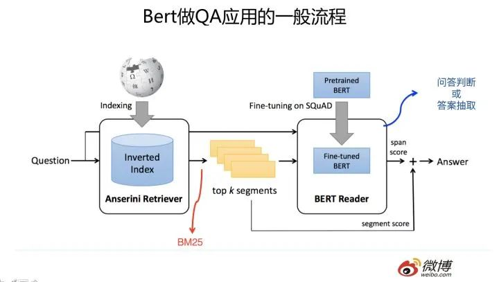
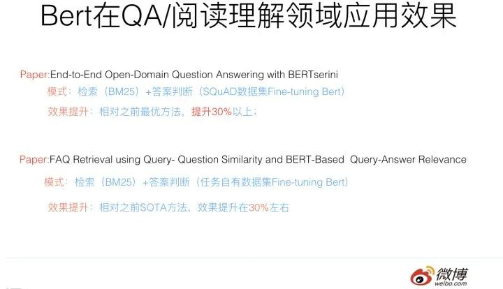
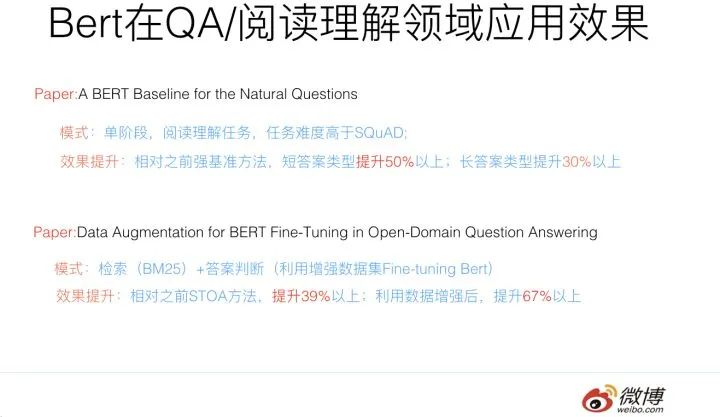
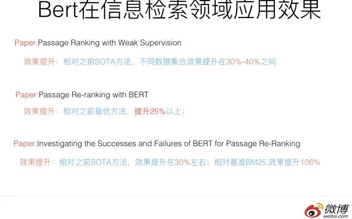
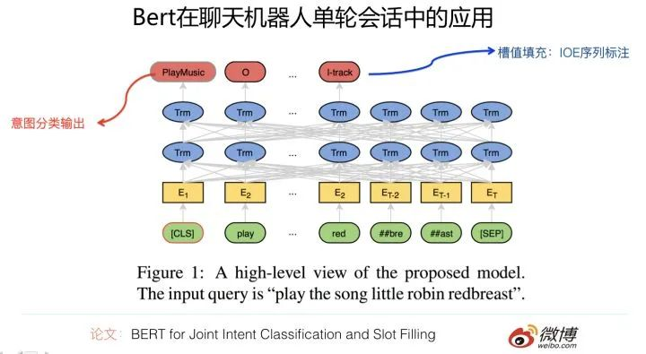
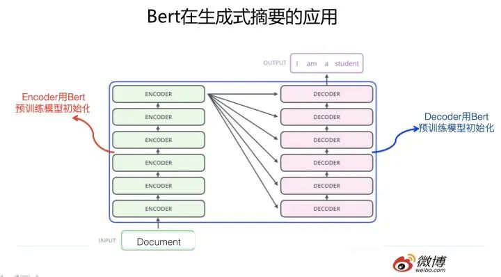
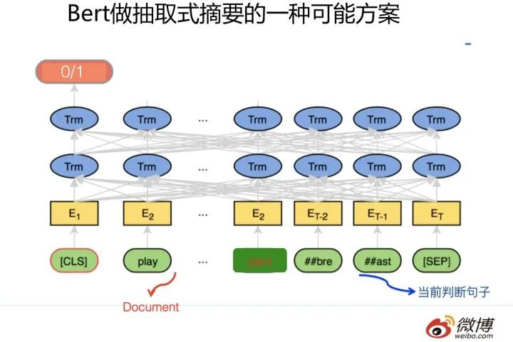
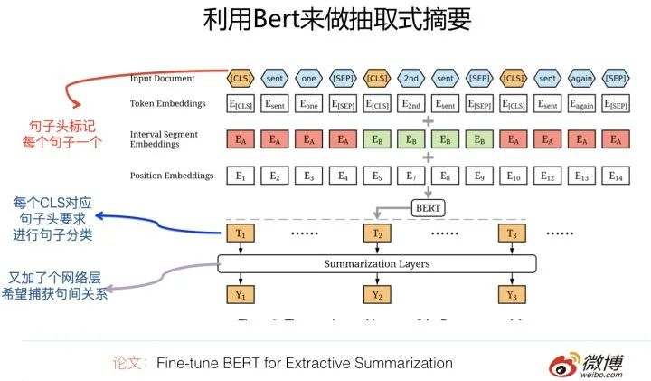
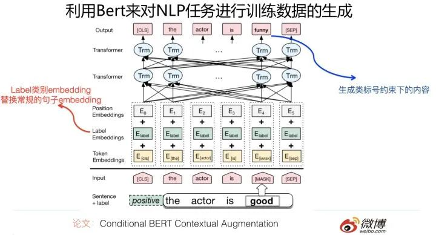
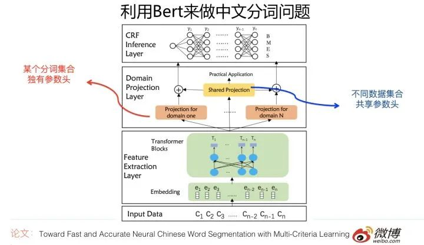

## Bert时代的创新（应用篇）：Bert在NLP各领域的应用进

Bert 给人们带来了大惊喜，不过转眼过去大约半年时间了，这半年来，陆续出现了与Bert相关的不少新工作。

最近几个月，在主业做推荐算法之外的时间，我其实一直比较好奇下面两个问题：

问题一：Bert原始的论文证明了：在GLUE这种综合的NLP数据集合下，Bert预训练对几乎所有类型的NLP任务（生成模型除外）都有明显促进作用。但是，毕竟GLUE的各种任务有一定比例的数据集合规模偏小，领域也还是相对有限，在更多领域、更大规模的数据情况下，是否真的像Bert原始论文里的实验展示的那样，预训练技术对于很多应用领域有了很大的促进作用？如果有，作用有多大？这种作用的大小与领域相关吗？这是我关心的第一个问题。

问题二：Bert作为一项新技术，肯定还有很多不成熟或者需要改进的地方，那么，Bert目前面临的问题是什么？后面有哪些值得改进的方向？这是我关心的第二个问题。

陆陆续续地，我收集到了截止到19年5月底为止发表的，大约70-80篇与Bert相关的工作，刚开始我是准备把关于这两个问题的答案写在一篇文章里的，写着写着发现太长，而两个主题确实也可以独立分开，所以就改成了两篇。这一篇是回答第一个问题的，主题集中在各个NLP领域的Bert应用，一般这种应用不涉及对Bert本身能力的改进，就是单纯的应用并发挥Bert预训练模型的能力，相对比较简单；至于对Bert本身能力的增强或者改进，技术性会更强些，我归纳了大约10个Bert的未来改进方向，放在第二篇文章里，过阵子会把第二篇再改改发出来，在那篇内容里，会归纳梳理Bert未来可能的发展方向。

这两篇文章对读者的知识结构有一定要求，建议在看之前，先熟悉下Bert的工作机制，可以参考我之前介绍Bert的文章：

张俊林：从Word Embedding到Bert模型—自然语言处理中的预训练技术发展史zhuanlan.zhihu.com

本篇文章主要回答第一个问题，除此外，从应用的角度看，Bert比较擅长处理具备什么特性的任务？不擅长处理哪些类型的应用？哪些NLP应用领域是Bert擅长但是还未开垦的处女地？Bert的出现对NLP各个领域的传统技术会造成怎样的冲击？未来会形成统一的技术方案吗？包括Bert时代我们应该如何创新？……..这些问题也会有所涉及，并给出我个人的看法。

在回答这些问题之前，我先讲讲我对Bert的一些务虚的看法，原先的内容本来在本文的这个位置，因为太长，之前已经摘出单独发了，如果感兴趣的话，可以参考下文：

张俊林：Bert时代的创新：Bert应用模式比较及其它

## 百花齐放：Bert在NLP各领域的应用进展

------

自从Bert诞生，到目前转眼半年过去了，如果归纳一下，目前出现了大量使用Bert来在NLP各个领域进行直接应用的工作，方法都很简单直接，效果总体而言比较好，当然也需要分具体的领域，不同领域受益于Bert的程度不太相同。

本节对这些工作分领域介绍及做一些带我个人主观色彩的判断和分析。

## 应用领域：Question Answer(QA，问答系统)与阅读理解

QA中文一般叫做问答系统，是NLP的一个重要应用领域，也是个具有很长历史的子领域了，我记得我读书的时候，差一点就选了这个方向做博士开题方向……好险……当时的技术发展水准，我记得是各种trick齐飞， 靠谱共不靠谱技术一色…..当然，其实我最终还是选择了一个更糟糕的博士开题方向 …….这应该是墨菲定律的一个具体例子？“选择大于努力”，这个金句，一直被证明，从未被颠覆。在读博士们请留心下这句肺腑之言，一定选好开题方向。当然，有时候能够选什么方向也由不得你，上面是说在你有选择自由的时候需要注意的地方。

QA的核心问题是：给定用户的自然语言查询问句Q，比如问“美国历史上最像2B铅笔的总统是谁？”，希望系统从大量候选文档里面找到一个语言片段，这个语言片段能够正确回答用户提出的问题，最好是能够直接把答案A返回给用户，比如上面问题的正确答案：“特·不靠谱·间歇脑抽风·朗普”。

很明显，这是个很有实用价值的方向，其实搜索引擎的未来，很可能就是QA+阅读理解，机器学会阅读理解，理解了每篇文章，然后对于用户的问题，直接返回答案。

QA领域是目前Bert应用效果最好的领域之一，甚至有可能把“之一”都能拿掉。我个人认为，可能的原因是QA问题比较纯粹。所谓的“纯粹”，是说这是个比较纯粹的自然语言或者语义问题，所需要的答案就在文本内容里，顶多还需要一些知识图谱，所以只要NLP技术有提升，这种领域就会直接受益。当然，可能也跟QA问题的表现形式正好比较吻合Bert的优势有关。那么Bert特别适合解决怎样的问题？在本文后面专门会分析这个事情。

目前不同的在QA领域利用Bert的技术方案大同小异，一般遵循如下流程：

QA应用Bert，从流程角度，一般分为两个阶段：检索+QA问答判断。首先往往会把比较长的文档切割成段落或者句子n-gram构成的语言片段，这些片段俗称Passage，然后利用搜索里的倒排索引建立快速查询机制。第一个阶段是检索阶段，这个和常规的搜索过程相同，一般是使用BM25模型（或者BM25+RM3等技术）根据问句查询可能的答案所在候选段落或者句子；第二个阶段是问答判断。在训练模型的时候，一般使用SQuAD等比较大的问答数据集合，或者手上的任务数据，对Bert模型进行 Fine-tuning；在应用阶段，对于第一阶段返回的得分靠前的Top K候选Passage，将用户问句和候选passage作为Bert的输入，Bert做个分类，指出当前的Passage是否包括问句的正确答案，或者输出答案的起始终止位置。这是一个比较通用的利用Bert优化QA问题的解决思路，不同方案大同小异，可能不同点仅仅在于Fine-tuning使用的数据集合不同。

QA和阅读理解，在应用Bert的时候，在某种程度上是基本类似的任务，如果你简化理解的话，其实可以把上述QA流程的第一阶段扔掉，只保留第二阶段，就是阅读理解任务应用Bert的过程。当然，上面是简化地理解，就任务本身来说，其实两者有很大的共性，但是也有些细微的区别；一般普通QA问题在找答案的时候，依赖的上下文更短小，参考的信息更局部一些，答案更表面化一些；而阅读理解任务，要正确定位答案，所参考的上下文范围可能会更长一些，部分高难度的阅读理解问题可能需要机器进行适当程度的推理。总体感觉是阅读理解像是平常QA任务的难度加大版本任务。但是从Bert应用角度，两者流程近似，所以我直接把这两个任务并在一起了。我知道，上面的话估计会有争议，不过这个纯属个人看法，谨慎参考。

前面提过，QA领域可能是应用Bert最成功的一个应用领域，很多研究都证明了：应用Bert的预训练模型后，往往任务都有大幅度的提升。下面列出一些具体实例。

而阅读理解任务，应用Bert后，对原先的各种纷繁复杂的技术也有巨大的冲击作用，前几年，我个人觉得尽管阅读理解领域提出了很多新技术，但是方法过于复杂了，而且有越来越复杂化的趋向，这绝对不是一个正常的或者说好的技术发展路线，我觉得路子有可能走歪了，而且我个人一直对过于复杂的技术有心理排斥感，也许是我智商有限理解不了复杂技术背后的深奥玄机？不论什么原因，反正就没再跟进这个方向，当然，方向是个好方向。而Bert的出现，相信会让这个领域的技术回归本质，模型简化这一点会做得更彻底，也许现在还没有，但是我相信将来一定会，阅读理解的技术方案应该是个简洁统一的模式。至于在阅读理解里面应用Bert的效果，你去看SQuAD竞赛排行榜，排在前列的都是Bert模型，基本阅读理解领域已经被Bert屠榜了，由这个也可以看出Bert在阅读理解领域的巨大影响力。

## 应用领域：搜索与信息检索（IR）

对于应用Bert，搜索或IR的问题模式及解决方案流程和QA任务是非常相近的，但是因为任务不同，所以还是有些区别。

搜索任务和QA任务的区别，我综合各方面信息，列一下，主要有三点：

1. 首先，尽管两个任务都是在做Query和Document的匹配，但是匹配时侧重于哪些因素，这两个任务是不同的。两个文本的“相关性”和“语义相似性”代表的内涵是有差异的；所谓“相关性”，更强调字面内容的精确匹配，而“语义相似性”则多涵盖了另外一个意思：就是尽管字面不匹配，但是深层语义方面的相近。QA任务对于这两者都是重视的，可能偏向语义相似性更多一些，而搜索任务更偏重文本匹配的相关性方面。这是两个任务的第一个不同。
2. 其次，文档长度的差异。QA任务往往是要查找问题Q的答案，而答案很可能只是一小段语言片段，在Passage这个较短的范围内，一般会包含正确答案，所以QA任务的答案一般比较短，或者说搜索对象比较短就可以覆盖正确答案，即QA任务的处理对象倾向于短文本；而对搜索任务来说，文档普遍比较长。尽管在判断文档是否与查询相关时，也许只依赖长文档中的几个关键Passage或者几个关键句子，但是关键片段有可能散落在文档的不同地方。在应用Bert的时候，因为Bert对于输入长度有限制，最长输入允许512个单位。于是，如何处理长文档，对于搜索来说比较重要；
3. 再次，对于QA这种任务来说，可能文本内包含的信息足够作出判断，所以不需要额外的特征信息；而对于搜索这种任务，尤其是现实生活中的实用化的搜索，而非性质比较单纯的评测中的Ad hoc检索任务。在很多时候，仅仅靠文本可能无法特别有效地判断查询和文档的相关性，其它很多因素也严重影响搜索质量，比如链接分析，网页质量，用户行为数据等各种其它特征也对于最终的判断也起到重要作用。而对于非文本类的信息，Bert貌似不能很好地融合并体现这些信息。推荐领域其实也跟搜索一样，面临类似的问题。

尽管讲了这么多领域间的区别，但是其实也没什么用，如果你看目前见到的用Bert改进检索领域的工作，尤其是Passage级别的信息检索问题，可能你无法分辨现在在做的是搜索问题还是QA问题。当然，对于长文搜索，搜索还是有单独的问题需要处理。为何会出现这种无法分辨QA及搜索任务的现象呢？这是因为目前出现的利用Bert改进检索的工作，一方面比较集中在Passage级别；另外一方面通常任务是Ad Hoc检索，以内容匹配为主，与真实搜索引擎利用的主要特征差异比较明显。主要应该是这两个原因造成的。

我们再归纳下在Ad Hoc检索任务中一般如何应用Bert:一般也是分成两个阶段，首先利用BM25等经典文本匹配模型或者其它简单快速的模型对文档进行初步排序，取得分前列Top K文档，然后用复杂的机器学习模型来对Top K返回结果进行重排序。应用Bert的地方明显在搜索重排序阶段，应用模式与QA也是类似的，就是把Query和Document输入Bert，利用Bert的深层语言处理能力，作出两者是否相关的判断。如果是Passage级别的短文档检索，其实流程基本和QA是一样的；而如果是长文档检索，则需要增加一个如何处理长文档的技术方案，然后再走Bert去做相关性判断。

所以，对于如何在信息检索领域应用Bert，我们从两个不同的角度来说：短文档检索和长文档检索。

对于短文档检索而言，你把它看成QA任务，其实问题也不大。所以这里不细说了，直接上结果。几个工作在Passage级别文档检索任务中的效果，可以参考这个PPT所列内容：

从上面各种实验数据可以看出：对于短文档检索来说，使用Bert后，性能一般都有大幅度的提升。

对于长文档检索任务，因为Bert在输入端无法接受太长的输入，则面临一个如何将长文档缩短的问题。其它过程和短文档检索基本雷同。那么怎么解决搜索中的长文档问题呢？可以参考下列论文的思路。

论文：Simple Applications of BERT for Ad Hoc Document Retrieval

这篇论文首次在信息检索领域应用Bert，并且证明了Bert对于搜索应用能有效提升效果。它同时做了短文档和长文档的实验。短文档利用TREC 2014的微博数据。引入Bert后，在微博搜索任务上，相对目前最好的检索模型，在不同的微博搜索任务中有5%到18%的效果提升，相对基准方法（BM25+RM3,这是一个强基准，超过大多数其它改进方法）有20%到30%的效果提升。

第二个数据集是TREC长文档检索任务，这里就体现出搜索和QA任务的不同了。因为要搜索的文档比较长，在重排序阶段，很难把整个文档输入到Bert中，所以这个工作采取了一个简单的方法：把文档分割成句子，利用Bert判断每个句子和查询Q的相关性，然后累加得分最高的Top N句子（结论是取得分最高的3个句子就够了，再多性能会下降），获得文档和查询Q的相关性得分，这样就将长文档问题转化成了文档部分句子的得分累加的模式。实验表明相对强基准BM25+RM3，使用Bert会有大约10%的效果提升。

一种搜索领域长文档的解决思路

从上面这篇文章对搜索长文档的处理过程，我们可以进一步对此问题进行深入思考。考虑到搜索任务的特殊性：文档和用户查询的相关性，并不体现在文章中的所有句子中，而是集中体现在文档中的部分句子中。如果这个事实成立，那么一种直观地解决搜索任务中长文档问题的通用思路可以如下：先通过一定方法，根据查询和文档中的句子，判断两者的相关性，即产生判断函数Score=F(Q,S)，根据Score得分筛选出一个较小的句子子集合Sub_Set(Sentences)，由这些句子来代表文档内容。这样即可将长文有针对性地缩短。从和查询相关性的角度来说，这样做也不会损失太多信息。关键是这个F（Q，S）函数如何定义，不同的定义方法可能产生表现不同的效果。这个F函数，可以被称为搜索领域文档的句子选择函数，这个函数同样可以使用不同的DNN模型来实现。这里是有很多文章可做的，有心的同学可以关注一下。

如果归纳一下的话：在搜索领域应用Bert，如果是Passage这种短文档搜索，往往效果有非常巨大的提升；而目前长文档的搜索，使用Bert也能有一定幅度的提升，但是效果不如短文档那么明显，很可能原因在于搜索的长文档处理方式有它自己的特点，还需要继续摸索更合理的更能体现搜索中长文档特性的方法，以进一步发挥Bert的效果。

## 应用领域：对话系统／聊天机器人（Dialog System or Chatbot）

聊天机器人或者对话系统最近几年也非常活跃，这与市面上出现大量的聊天机器人产品有关系。个人私见，这个方向是符合未来发展趋势的方向，但是目前的技术不够成熟，难以支撑一个能够满足人们心目中期望的好用产品，所以我个人不是太看好这个方向近期内的产品形态，主要还是目前技术发展阶段所限，支撑不起一个好的用户体验。这是题外话。

聊天机器人从任务类型划分的话，常见的有日常聊天以及任务解决型。日常聊天好理解，就是漫无目的地闲聊，帮你打发时间，当然前提是你得有空闲时间需要被它打发掉。我发现低龄儿童很可能是这个任务类型的目标受众，两年前我家闺女能兴致勃勃地跟Siri聊半个小时，聊到Siri都嫌她烦了。当然，Siri收到的最后一句话往往是这样的：“Siri，你太笨了！”

任务解决就是帮着用户解决一些日常事务，解决日常碰到的实际问题。比如，99%的直男，一年中会因为忘记一些节假日被女友或者老婆喷得患上节假日恐惧症，有了聊天机器人，你就再也不用怕了。你可以跟聊天机器人说：“以后但凡是节假日，你记得提醒我，帮我给XX订束花。”于是，你在一年的365天里，有364天会收到聊天机器人的500多个提醒，这样你再也不用怕被喷了，生活会变得越来越美好。而且假如万一你中年失业，因为对送花这个事情特别熟悉，所以估计去开个连锁花店，说不定过几年就上市了，也许比瑞幸咖啡上市速度还快……这就是任务解决型聊天机器人带给你的切实的好处，不凑巧还能推着你意外地走向人生巅峰。

上面开个玩笑，如果从技术角度看的话，聊天机器人主要面临两种技术挑战。

其一：对于单轮对话来说，就是一问一答场景，任务解决型聊天需要从用户的话语中解析出用户的意图。比如到底用户是想要订餐还是点歌，一般这是个分类问题，叫用户意图分类，就是把用户的意图分到各种服务类型里面；另外如果用户意图敲定，那么根据意图要抽取出一些关键元素，比如订机票，需要抽取出出发地、目的地、出发时间、返程时间等信息。目前一般采用槽填充（Slot Filling）的技术来做，一个关键元素就是一个槽位（Slot），从用户交互中抽取出的这个槽位对应的取值，就是Filling过程。比如点歌场景下，有一个槽位就是“歌手”，而如果用户说“播放TFBoys的歌”，那么经过槽位填充，会得到“歌手”槽位对应的取值“歌手=TFBoys”，这就是典型的槽位填充过程。

论文“BERT for Joint Intent Classification and Slot Filling”即是利用Bert解决单轮会话的会话意图分类以及槽位填充任务的。解决方法也很直观，输入一个会话句子，Transformer的[CLS]输入位置对应高层Transformer位置输出句子的意图分类，这是一个典型地应用Bert进行文本分类的方法；另外一方面，对于会话句中的每个单词，都当作一个序列标注问题，每个单词在Transformer最高层对应位置，分类输出结果，将单词标注为是哪类槽的槽值的IOE标记即可。这是典型的用Bert解决序列标注的思路。而这个方法则通过Bert同时做了这两件事情，这点还是挺好的。通过采用Bert预训练过程，在两个数据集合上，在意图分类任务上效果提升不太明显，可能是基准方法本身已经把指标做得比较高了；槽值填充方面，与RNN+Attention等基准方法相比，两个数据集合表现不一，一个数据集合效果提升2%，另外一个提升12%左右。总体而言，表现还行，但是不突出。

其二：对于多轮会话来说，就是说用户和聊天机器人交互问答好几个回合的场景下，如何改进模型，让聊天机器人记住历史的用户交互信息，并在后面的应答中正确地使用历史信息，就是个比较重要的问题，这也很大程度上影响用户对于聊天机器人到底有多智能的体验。所以，如何有效融入更多的历史信息，并在上下文中正确地场合正确地使用历史信息，就是模型改进的关键。

那么如果把Bert应用在多轮会话问题上，会是什么效果呢？论文Comparison of Transfer-Learning Approaches for Response Selection in Multi-Turn Conversations给出了实验结果。它利用GPT及Bert等预训练模型改进多轮对话中如何融入历史信息，来对下一句选择的问题。效果提升明显，Bert效果优于GPT，GPT效果明显优于基准方法。Bert相对基准方法，在不同数据集合下，效果提升幅度在11%到 41%之间。

总之，Bert应用在聊天机器人领域，潜力应该还是比较大的。单轮会话的问题相对比较简单；多轮会话中，如何融入上下文这个问题，还是比较复杂，我相信Bert在这里能够发挥较大的作用。

## 应用领域：文本摘要

文本摘要有两种类型，一种是生成式的（Abstractive Summarization），输入是较长的原始文档，输出的内容不局限于在原文出现的句子，而是自主生成能够体现文章主要思想的较短的摘要；另外一种是抽取式的（Extractive Summarization），意思是从原始文档中选择部分能够体现主题思想的句子，摘要是由文中抽出的几个原始句子构成的。

下面分述两种不同类型的摘要任务，在应用Bert时的要点。

生成式文本摘要

很明显，生成式摘要任务，从技术体系来说，符合典型的Encoder-Decoder技术框架：原始文章从Encoder输入，Decoder生成语句作为摘要结果。既然是这样，要想利用Bert的预训练成果，无非体现在两个地方，一个地方是Encoder端，这个好解决，只需要用预训练好的Bert模型初始化Encoder端Transformer参数即可，简单直观无疑义；另外一个地方是在Decoder端，这个地方要应用Bert就比较麻烦，主要的问题在于：尽管也可以用Bert的预训练参数初始化Decoder对应的Transformer参数，但是目前各种实验证明这么做效果不好，主要是因为：Bert在预训练的时候，采用的是双向语言模型的模式。而一般的NLP任务在Decoder阶段的生成过程，是从左到右一个单词一个单词逐步生成的。所以，这与Bert的双向语言模型训练模式不同，无法有效利用Bert在预训练阶段学习好的下文的信息提示作用。于是，造成了Bert的预训练模型无法在Decoder端充分发挥作用。

所以，如果采取Encoder-Decoder框架做生成式的文本摘要，要想发挥出Bert的威力，并不容易。因为它面临与Bert做NLP生成类任务完全相同的问题，而Bert目前在生成模型方面是个难题，尽管最近出了几个方案，但是实际上，这个问题貌似仍然并没有被很好地解决，所以它是严重依赖Bert生成模型的技术进展的。

至于如何在生成类任务中发挥Bert的潜力，这是Bert模型改进的一个重要方向，关于目前的解决方案及效果评价，我会放在下一篇“模型篇”里分析，所以这里暂时略过不表。

抽取式文本摘要

抽取式文本摘要则是个典型的句子分类问题。意思是模型输入文章整体的文本内容，给定文中某个指定的句子，模型需要做个二分类任务，来判断这个句子是不是应该作为本文的摘要。所以，抽取式文本摘要本质上是个句子分类任务，但是与常规文本分类任务相比，它有自己独特的特点，这个特点是：输入端需要输入整个文章内容，而分类的判断对象仅仅是当前要做判断的某个句子，整个文章只是对当前句子进行判断的一个上下文，但是又必须输入。而一般的文本或者句子分类，输入的整体就是判断对象，不存在多出来的这个上下文的问题。这是它和普通的文本分类任务的最主要区别。

所以说，对于抽取式文本摘要任务，尽管可以把它看成个句子分类任务，但是它的输入内容和输出对象不太匹配，这个是关键差异。于是，在模型输入部分如何表达这种句子和文章的隶属关系方面，需要花些心思。

如果要用Bert做抽取式摘要，也就是用Transformer作为特征抽取器，并用Bert的预训练模型初始化Transformer参数，以这种方式构建一个句子的二分类任务。从模型角度，Bert肯定是可以支持做这个事情的，只需要用Bert的预训练模型初始化Transformer参数即可。问题的关键是：如何设计并构建Transformer的输入部分？要求是：输入部分同时要输入文章整体的内容，并指出当前要判断的句子是哪个句子。所以，这里的关键是Transformer模型的输入和输出如何构造的问题，而模型本身应用Bert成果则没什么问题，算是一种常规的Bert应用。

我以前发过一篇思维方法论方面的文章：

张俊林：天空之城：拉马努金式思维训练法zhuanlan.zhihu.com

现在可以套用一下这个方法，也就是在没看到别人怎么做之前，自己想想你会怎么做。所以，在没有看到用Bert做抽取式摘要的论文前，我自己拍脑袋想了想，发现比较容易想到的有下面两种方法：

方法一：把Transformer的输入分为两个部分，第一个部分是文章原文。当然，目前Bert支持的最大输入长度512，所以原文也不能太长；第二个部分是当前要判断的句子。两者之间加个分隔符<SEP>；输出部分则要求最开始的[CLS]输入位置对应的Transformer最高层输出0/1两种分类结果，如果结果是1，则意味着这个句子可以作为摘要句，0则意味着此句不会作为摘要句。只要依次对文中每个句子都如此判断一下，把分类为1的句子按照句中顺序拼接，就可以得到文本摘要。这是一种可能的方法；目前我尚未看到如此做的模型，当然，我自己也觉得这个方式繁琐了些。

方法二：Transformer的输入部分只有一个部分，就是文章本身的完整的内容，由多个句子构成。如果是这种输入，那么带来的新的问题是：我们怎么知道当前要判断哪个句子是否适合作为摘要句呢？可以这么做：在Transformer的输入部分，在每个句子头加入一个句子起始标记<BOS>,或者把这个分隔符号理解为是句子之间的分隔符也可以；或者也可以在句子的对应Embedding里加入句子编号，用来区分不同句子的界限应该也可以(Bert的输入部分除了常规的单词embedding，对于多句子类型任务，还有句子的embedding，属于相同句子的单词共享相同的句子embedding)。尽管可以有不同的具体做法，但是核心思想是相近的：就是在输入端明确加入一些标记符号，用来区分不同的句子。

输入部分的问题解决了，于是，剩下的问题就是Transformer的输出部分怎么设计了。同样的，这里可能有几种不同的做法。拍下脑袋，比如可以模仿阅读理解的输出，要求Transformer的输出部分输出若干个句子的<起始Position,终止Position>，这是一种可能做法；比如也可以在最开始的输入[CLS]符号对应的Transformer最高层Embedding上面上面绑定K个输出头，每个输出头输出被选为摘要的句子编号，指定最多输出K个摘要句子，这是另外一种可能做法；除此外，还有其它的可能做法，比如也可以在Transformer的最高层各个单词的embedding序列里，找出输入侧对应的句子头位置<BOS>的相应位置的高层Embedding信息，每个<BOS>对应的输入位置对应高层embedding作为这个句子的信息集成，在这个句子信息Embeddding基础上设计分类层，这样等于给每个句子进行分类。

还有其它做法吗？应该还有。比如还可以把摘要看成一个类似分词或者POS的单字/单词分类问题，每个输入单词对应的Transformer高层节点，要求对每个单词进行分类，而输出的类别可以设计为[BOS(摘要句子起始单词标记)，MOS（摘要句子句中单词标记），EOS（摘要句子结束单词标记），OOS（非摘要句单词标记）]，这也是一种可能的做法，这是把摘要看成序列标注问题来做的。当然，你也可以拍拍脑袋，估计还有很多其它做法。

目前有个论文（Fine-tune BERT for Extractive Summarization）是做抽取式文本摘要的。它的具体做法基本遵循上面讲的方法二的框架，在输入部分用特殊分隔符分隔开不同的句子，每个句子加入句子头标记<CLS>，在输出部分则要求在输入为<CLS>位置对应的Transformer最高层embedding之上，构建输出层，用来判断这个句子是否会被选为摘要句子。和上面的叙述方法不同的地方是：它在<CLS>输出层和真正的分类层之间又多加入了一个网络层，用来集成文章中不同句子之间的关系，比如用线性分类/transformer/RNN等模型来集成句子间的信息，然后在此基础上，再输出真正的句子分类结果。不过，从试验结果看，其实这个新加入的中间网络层，使用不同模型效果差不太多，这说明在这里加入新的网络层并没有捕获新的信息，我个人觉得这块是可以拿掉简化一下模型的。至于用上述思路引入Bert预训练模型的摘要系统，从效果上看，虽然优于目前的SOTA模型，但是并没有超过太多。而这说明了什么呢？这是值得思考的一个问题。

## 应用领域：NLP中的数据增强

我们知道，在CV领域中，图像数据增强对于效果有非常重要的作用，比如图像旋转或者抠出一部分图片作为新增的图像训练实例。其实，NLP任务也面临类似的需求，之所以会有这种需求，是因为：如果训练数据越充分，能够覆盖更多的情形，那么模型效果越好，这个道理好理解。问题是怎么才能低成本地拓展任务地新训练数据。

当然，你可以选择人工标注更多的训练数据，但无奈人工标注训练数据成本太高，能否借助一些模型来辅助作出新的训练数据实例，以此来增强模型性能呢？NLP数据增强就是干这个事情的。

回到我们的主题上来:能否利用Bert模型来扩充人工标注好的训练数据？这是在数据增强领域应用Bert的核心目标。目标很明确，剩下的问题是具体的方法而已。这个领域算是比较有新意的Bert应用领域。

论文：Conditional BERT Contextual Augmentation

这是个比较有趣的应用，来自于中科院信工所。它的目的是通过改造Bert预训练模型，来产生新增的训练数据，以此来增强任务分类效果。就是说对于某个任务，输入训练数据a，通过Bert，产生训练数据b，利用b来增强分类器性能。

它的改造方法如下：将Bert的双向语言模型，改造成条件语言模型。所谓“条件”，意思是对于训练数据a，Mask掉其中的某些单词，要求Bert预测这些被Mask掉的单词，但是与通常的Bert预训练不同的是：它在预测被Mask掉的单词的时候，在输入端附加了一个条件，就是这个训练数据a的类标号，假设训练数据的类标号已知，要求根据训练数据a的类标号以及上下文，通过Bert去预测某些单词。之所以这样，是为了能够产生更有意义的训练数据。比如对于情感计算任务来说，某个具备正向情感的训练实例S，mask掉S中的情感词“good”，要求Bert生成新的训练实例N，如果不做条件约束，那么Bert可能产生预测单词“bad”，这也是合理的，但是作为情感计算来说，类别的含义就完全反转了，而这不是我们想要的。我们想要的是：新产生的训练例子N，也是表达正向情感的，比如可以是“funny”，而如果加上类标号的约束，就可以做到这一点。具体增加约束的方式，则是将原先Bert中输入部分的Sentence embedding部分，替换成输入句子的对应类标号的embedding，这样就可以用来生成满足类条件约束的新的训练数据。这个做法还是很有意思的。

如果将通过Bert产生的新训练数据增加到原有的训练数据中，论文证明了能够给CNN和RNN分类器带来稳定的性能提升。

另外一篇论文Data Augmentation for BERT Fine-Tuning in Open-Domain Question Answering也涉及到了NLP中的数据增强，不过这个数据增强不像上面的文章一样，训练数据通过Bert产生，貌似是在QA问题里面采用规则的方式扩充正例和负例，做例子本身没什么特别的技术含量，跟Bert也没啥关系。它探讨的主要是在Bert模型下的QA任务中，如何使用这些增强的训练数据。有价值的结论是：如果同时增加通过增强产生的正例和负例，有助于增加Bert的应用效果；而且Stage-wise方式增加增强数据（就是原始训练数据和增强训练数据分多个阶段依次进行训练，而且距原始训练数据越远的应该越先进行Fine-tuning），效果好于把增强数据和原始数据混合起来单阶段训练的模式。

所以，上面两个文章结合着看，算是用Bert产生新的训练实例以及如何应用这种增强实例的完整过程。

## 应用领域：文本分类

文本分类是个NLP中历史悠久，源远流长…..总之比较成熟的应用领域。它的意思是给定一个文档，模型告诉这是哪个类别，是讲的“体育”还是“娱乐”，总之就是这个意思。

那么，Bert应用在这个领域效果如何呢？目前也有工作。

论文：DocBERT: BERT for Document Classification

在四个常用的标准文本分类数据集合上，利用Bert的预训练模型进行了效果测试，应该说效果能够达到以及超过之前的各种方法，但是总体而言，相对之前的常用方法比如LSTM或者CNN模型，提升幅度不算太大，基本提升幅度在3%到6%之间。

对于文本分类，Bert并未能够获得非常大的效果提升，这个结果其实是可以理解的。因为把一个还比较长的文档分到一个类别里，这种任务偏语言浅层特征的利用，而且指示性的单词也比较多，应该算是一种比较好解决的任务，任务难度偏简单，Bert的潜力感觉不太容易发挥出来。

## 应用领域：序列标注

严格地说，序列标注并非一个具体地应用领域，而是NLP中一种问题解决模式。很多NLP任务都可以映射为序列标注问题，比如分词，词性标注，语义角色标注等等，非常多。它的一个特点是：对于句子中任意一个单词，都会有一个对应的分类输出结果。在原始的Bert论文里面也给出了序列标注任务如何使用Bert的预训练过程，实际应用的时候，应用模式就是那种模式。

如果不考虑具体应用场景，把不同应用场景映射到序列标注这种问题解决模式的话，目前也有一些工作使用Bert来增强应用效果。

论文：Toward Fast and Accurate Neural Chinese Word Segmentation with Multi-Criteria Learning

这个工作使用Bert作为多标准分词的特征抽取器。所谓多标准，是指的同一个语言片段，在不同场景下可能有不同粒度的分词结果。它使用Bert预训练的Transformer作为主要特征抽取器，针对不同数据集合可能分词标准不同，所以在Transformer之上，为每个分词数据集合构建一个独有的参数头，用来学习各自的标准。同时增加一个共享的参数头，用来捕捉共性的信息。在此之上，再用CRF来做全局最优规划。这个模型在多个分词数据集合上取得了最高的分词效果。不过总体而言，效果提升不太明显。这也可能与之前的技术方法已经把分词解决的还比较好，所以基准比较高有关系。

论文：BERT Post-Training for Review Reading Comprehension and Aspect-based Sentiment Analysis

这个工作做了两个事情，一个是阅读理解，另外一个是情感计算。其中情感计算的Aspect Extract任务是采用序列标注的方式做的，利用Bert的预训练过程后，与之前的最好方法比，效果提升不明显。

论文：Multi-Head Multi-Layer Attention to Deep Language Representations for Grammatical Error Detection

这个工作主要解决的应用问题是句法错误检测。把这个问题映射成了序列标注问题，使用Bert预训练后，效果提升明显，与基准方法比，性能有大幅度地提高；

上文在谈对话系统应用领域时，还提到过一个单轮对话系统利用Bert进行槽位填充的工作，也是映射成序列标注问题来解决的，那个工作结论是两个数据集合，一个提升2%，一个提升12%。

综合看，大部分序列标注任务在利用了Bert后，尽管把任务效果都能做到当前最好，但是效果提升幅度，与很多其它领域比，不算大。这可能跟具体的应用领域有关系。

## 应用领域：其它

除了上面我进行了归类的Bert应用外，还有零星一些其它领域的Bert应用工作，这里简单提几句。

论文：Assessing BERT’s Syntactic Abilities

这个工作对Bert的句法分析能力做了测试，使用主语-谓语一致性任务做为测试任务。与传统表现较好的LSTM模型做了对比，测试数据表现Bert效果大幅超过LSTM的效果，当然作者强调因为一些原因这个数据不可直接对比。不过至少说明Bert在句法方面是不弱于或者强于LSTM的。

另外，还有两篇做NLP to SQL的工作（Achieving 90% accuracy in WikiSQL/ Table2answer: Read the database and answer without SQL），意思是不用你写SQL语句，而是用自然语言发出命令，系统自动转化成可执行的SQL语句，使用Bert后，也取得了一定幅度的性能提升。我理解这种任务因为是领域受限的，所以相对容易些，我个人对这个方向也没啥兴趣，所以这里不展开了，感兴趣的可以找论文看。

除此外，还有两篇做信息抽取的工作，使用Bert后，效果也比较一般，这个领域其实是值得深入关注的。

目前已经发表的Bert应用，绝大部分基本都已经被我归类到上面各个领域里了。这里明确提到的论文，都是我认为有一定参考价值的一部分，并不是全部，我筛掉了一批我认为质量不是太高，或者参考价值不大，或者我认为方法过于复杂的工作，这点还请注意。当然，一定也有一部分有价值的工作，因为没有进入我狭窄的视野，所以没有被列入，这也是有可能的。

## 万象归宗：事实，其实和你想的也许不一样

------

上面介绍了不少NLP领域如何应用Bert提升效果，方法众多，效果各异，容易让人看起来眼花缭乱，不太能摸着头脑。也许你在没看这些内容之前，脑子里就一个印象：Bert大法好，对NLP各种应用都能有很大性能提升作用。事实是这样吗？其实并不是。在你看完上面的内容后，看到了五彩缤纷绚烂多彩的各种方法，可能更容易犯晕，感觉没啥结论可下，此刻眼里正闪耀着迷茫的光芒…….

其实，这都是表面现象。我在这里总结一下。纯个人分析，不保证正确性，猜对算碰巧，猜错也正常。

尽管看上去有各种各样不同的NLP任务，其实如何应用Bert，一切答案在原始的Bert论文里，大部分都讲到了。其利用Bert的过程是基本一样的，核心过程都是用Transformer作为特征抽取器，用Bert预训练模型初始化Transformer的参数，然后再用当前任务Fine-tuning一下，仅此而已。

如果我们再细致一些，分任务类型来看的话，归纳下，结论很可能会是这样的；

如果应用问题能够转化成标准的序列标注问题（分词/词性标注/语义角色标注/对话槽位填充/信息抽取等，很多NLP任务可以转化为序列标注的问题解决形式），或者单句或文档分类问题（文本分类/抽取式文本摘要可以看成一种带上下文的单句分类问题），那么可以直接利用Bert的预训练过程，任务无需特殊改造；目前已有实验结果，貌似说明在这两类任务中，使用Bert应该能够达到最好的效果，但是与之前未采纳Bert的最好模型比，多数任务性能提升似乎相对有限。这其中有什么深层的原因吗？我有个判断，后面会说；

如果是短文档的双句关系判断任务，比如典型的就是QA/阅读理解/短文档搜索／对话等任务，一般利用Bert的方式也是直观的，就是Bert原始论文中提出的两个句子间加分隔符输入的方式，不需要特殊改造。目前看，这类任务，利用Bert后往往性能有大幅度的提升。

但是，为什么你在看上文的时候，会觉得看上去有很多不同的各异的模型呢？主要是因为有些NLP领域，尽管利用Bert的过程其实就是上面的过程，但是需要单独解决自己任务的一些特点问题，比如搜索领域的长文档输入问题怎么解决，搜索领域的粗排序需要有其它方法；对于抽取式摘要来说，输入输出如何设计是个问题，因为它和普通的文本分类不太一样；比如多轮对话系统的历史信息如何利用，需要有个历史信息融合或者选择的方法存在……诸如此类。其实关键的应用Bert的部分，并无特殊之处。这一切冥冥中，早已经在原始的Bert论文里讲过了。“被酒莫惊春睡重，赌书消得泼茶香，当时只道是寻常。”很多事，不过如此。

经过我此番任性的解释，此刻，您眼中迷茫的光芒，熄灭了吗？还是更炽热了？

## 看我72变：对应用问题的重构

------

如果上面的判断正确的话，你应该问自己一个问题：“既然看上去貌似Bert更适合处理句子对关系判断问题。而对于单句分类，或者序列标注问题，尽管有效，但是貌似效果没那么好。于是，能不能利用下Bert的这一点，怎么利用呢？比如说能不能把单句分类问题，或者序列标注问题，转化下问题的表达形式，让它以双句关系判断的表现形态出现呢？”

如果你真能问出这个问题，这意味着，你真是挺适合搞前沿研究的。

事实上，已经有些工作是这么做了，而且事实证明，如果能够对应用问题进行重构的话，其它事情都不用做，就能直接提升这些任务的效果，有些任务效果提升还非常明显。怎么重构呢？对于某些具备一定特性的NLP任务，如果它看上去是单句分类问题，那么可以通过问题重构，比如引入虚拟句，把单句输入问题改造成句间关系判断问题，这样就能充分发挥Bert的这个特性，直接提升效果。

就是这么重构。

论文：Utilizing BERT for Aspect-Based Sentiment Analysis via Constructing Auxiliary Sentence

这个工作来自复旦大学。它利用Bert来优化细粒度的情感分类任务。所谓细粒度的情感分类任务，指的是不仅仅对某个句子或者某个实体的整体情感倾向做个整体判断，而是对实体的不同方面作出不同的判断，比如例子“LOCATION1 is often considered the coolest area of London.”，就是说某个实体（这里的例子是某个地点LOCATION 1）的A方面（比如价格price）是怎样的情感倾向，B方面（比如安全性safety）是怎样的情感倾向等，细粒度到某个实体的某个方面的情感倾向。

这个工作做得非常聪明，它把本来情感计算的常规的单句分类问题，通过加入辅助句子，改造成了句子对匹配任务（比如上面的例子，可以增加辅助句：“what do you think of the safety of LOCATION 1”）。我们前面说过，很多实验证明了：Bert是特别适合做句子对匹配类的工作的，所以这种转换无疑能更充分地发挥Bert的应用优势。而实验也证明，经过这种问题转换，性能有大幅度地提升。

Salesforce也有个类似想法的工作（Unifying Question Answering and Text Classification via Span Extraction），它的部分实验结果也表明，单句分类任务，通过加入辅助句，转化成双句关系判断任务，也能提升任务效果。

为什么对于Bert应用来说，同样的数据，同样的任务，只需要把单句任务转成句子对匹配任务，效果就突然变好了呢？这个问题其实是个好问题，在后面我会给两个可能的解释。

这个方向是值得进一步深入拓展的，目前工作还不多，我预感这里还有很大的潜力可以挖掘，无论是探索还是应用角度，应该都是这样的。

## 狸猫换太子：Fine-tuning阶段的In Domain和Out Domain问题

------

我们知道，在应用Bert的时候，真正使用某个应用的数据，是在第二阶段Fine-tuning阶段，通过用手头任务的训练数据对Transformer进行训练，调整参数，将Transformer的参数针对手头任务进行Fine-tune，之后一般会获得明显的应用提升。

这里所谓的In-Domain和Out-Domain问题，指的是：Out-Domain意思是你手头任务有个数据集合A，但是在Bert的Fine-tuning阶段，用的是其它数据集合B。知道了Out-Domain，也就知道In-Domain的意思了，就是说用手头任务数据集合A去Fine-tune参数，不引入其它数据。

那么问题是：为什么手头任务是A，要引入数据集合B呢？这个在做具体应用的时候，其实还是比较常见的。如果你手头任务A的训练数据足够大，其实完全可以走In-Domain的路线就够了。但是如果你手上的任务A训练数据太小，一般而言，尽管也可以用它去做Bert的Fine-tuning，但是无疑，效果可能有限，因为对于参数规模这么大的Bert来讲，太少的Fine-tuning数据，可能无法充分体现任务特点。于是，我们就期待通过引入和手头任务A有一定相近性的数据集合B，用B或者A+B去Fine-tune Bert的参数，期待能够从数据集合B Transfer些共性知识给当前的任务A，以提高任务A的效果。某种角度上，这有点像Multi-Task任务的目标。

那么新的问题是：既然我们期待数据集合B能够迁移些知识给当前任务A，那么这两个任务或者训练数据之间必然应该有些共性存在。于是，哪些因素决定了不同性质的数据集合B对当前任务A的影响呢？这个其实是个很实用也很有意思的问题。

目前针对这些问题，也有一些工作和初步的结论。

论文ThisIsCompetition at SemEval-2019 Task 9: BERT is unstable for out-of-domain samples研究了Out-Domain对Target 任务的影响，使用了不同领域的数据，在Fine-tuning阶段使用了大约数量为9千左右的电子领域的训练数据，而Target任务是Hotel领域的。可以看出来，这两个领域差异还是很大。通过实验对比，结论是：如果是Out-Domain这种情况，Target任务表现非常不稳定，10轮测试中，Hotel任务的性能最低是0，最高71，方差31。可以看出来，这效果简直是在蹦极和坐火箭之间频繁切换。为什么会这样？目前还没有解释。这里是值得深入探讨一下的。

从这个工作反向推导，我们可以认为，即使数据B相对手头任务A来说是Out-Domain的，如果它在领域相似性与手头任务A越接近，效果理应越好，这个貌似比较直观好理解，但是这是我的反向推论，并没看到一些具体研究对此进行对比，这个事情是值得做一下的。

另一个工作是Simple Applications of BERT for Ad Hoc Document Retrieval，尽管它是研究信息检索的，但是也设计了一些跟Out-domain有关的实验。它验证了Bert的Fine-tuning阶段使用数据的一些特性：在Fine-tuning阶段的训练数据B，与下游任务的数据集合A相比，两者的任务相关性，相比两者的文本的外在表现形式的相似性来说，对于下游任务更重要。实验结论是：对于微博这种下游短文本检索任务（手头任务A），尽管它在表现形式上和Trec检索（Out-Domain数据B）这种新闻文本形式上差异较大，但是因为都是检索任务，所以相对用QA任务（另外一个Out-Domain数据B）来Finetune Bert来说，效果好，而且好得很明显。这说明了，对于Out-Domain情况来说，Fine-tuning任务B和下游任务A的任务相似性对于效果影响巨大，我们尽可能找相同或者相近任务的数据来做Fine-tuning，哪怕形式上看上去有差异。

还有一个工作：Data Augmentation for BERT Fine-Tuning in Open-Domain Question Answering。它本身是做数据增强的，不过实验部分的结果，我相信结论也应该能够迁移到Out-Domain情形，它的结论是：假设有几个新增的训练集合，比如B，C，D三个新数据集合，每个和Target任务A的数据差异远近不同，假设B最远，C次之，D和A最像。那么如果是这样的数据，一种做法是把A+B+C+D放到一起去Fine-tune 模型，另外一种是由远及近地分几个阶段Fine-tune模型，比如先用最远的B，然后用C，再然后用最近的D，再然后用A，这种叫Stage-wise的方式。结论是Stage-wise模式是明显效果好于前一种方式的。

另外一点，我相信对于Out-Domain情况来说，如果Fine-tuning任务和下游任务在有相关性的基础上，无疑应该是数据量越大，对下游任务的正面影响越大。

所以，如果归纳一下目前的研究结论，以及我自己在现有数据基础上随意推理的结论，那么结论很可能是这样子的：对于Out-Domain情况，首选和手头任务A相同或者相近的任务B来做Fine-tuning，而至于这两个数据的领域相似性，当然越高越好，而数据规模，也应该是越多越好。如果有多个不同的数据可以用，那么根据它们和手头任务的相似性，由远及近地分Stage去Fine-tune模型比较好。当然，这里面有些因素是我个人无依据的推论，实际情况需要实验证明，所以还请谨慎参考。

这个方向其实是非常有价值的方向，感觉目前的相关工作还是太少，有些问题也没说清，这里是值得深入摸索找到好的经验的，因为我们平常经常会遇到任务数据不够的问题，那么想利用好Bert就比较困难，而如果把这个问题研究透彻，对于很多实际应用会有巨大的参考价值。

## 竞争优势：Bert擅长做什么？

------

在看完目前几乎所有已发表的Bert应用工作后，事实表明，尽管Bert在很多应用领域取得了进展，但是在不同方向上，看上去Bert的引入对于应用效果促进作用是不同的，有些表现突出的领域会有甚至100%的效果提升，有些领域的提升就表现相对平平。于是，我问了自己一个新的问题：为什么会出现这个现象呢？这说明了Bert还是有比较适合它的应用场景的，如果找到特别适合Bert发挥的场景，则性能往往会有极大地提升，但是如果应用场景不能充分发挥Bert的优势，则虽然也会有些改进，但是改进效果不会特别明显。

于是，新的问题就产生了：Bert擅长解决具备什么样特性的NLP任务呢？什么样的场景更适合Bert去解决？

为了回答这个问题，我对目前的各种工作做了任务对比，并试图归纳和推理一些结论，目的是希望找出:具备哪些特性的任务是能够发挥Bert模型的优势的。分析结果如下，纯属个人判断，错误难免，还请批判性地谨慎参考，以免对您造成误导。

第一，如果NLP任务偏向在语言本身中就包含答案，而不特别依赖文本外的其它特征，往往应用Bert能够极大提升应用效果。典型的任务比如QA和阅读理解，正确答案更偏向对语言的理解程度，理解能力越强，解决得越好，不太依赖语言之外的一些判断因素，所以效果提升就特别明显。反过来说，对于某些任务，除了文本类特征外，其它特征也很关键，比如搜索的用户行为／链接分析／内容质量等也非常重要，所以Bert的优势可能就不太容易发挥出来。再比如，推荐系统也是类似的道理，Bert可能只能对于文本内容编码有帮助，其它的用户行为类特征，不太容易融入Bert中。

第二，Bert特别适合解决句子或者段落的匹配类任务。就是说，Bert特别适合用来解决判断句子关系类问题，这是相对单文本分类任务和序列标注等其它典型NLP任务来说的，很多实验结果表明了这一点。而其中的原因，我觉得很可能主要有两个，一个原因是：很可能是因为Bert在预训练阶段增加了Next Sentence Prediction任务，所以能够在预训练阶段学会一些句间关系的知识，而如果下游任务正好涉及到句间关系判断，就特别吻合Bert本身的长处，于是效果就特别明显。第二个可能的原因是：因为Self Attention机制自带句子A中单词和句子B中任意单词的Attention效果，而这种细粒度的匹配对于句子匹配类的任务尤其重要，所以Transformer的本质特性也决定了它特别适合解决这类任务。

从上面这个Bert的擅长处理句间关系类任务的特性，我们可以继续推理出以下观点：

既然预训练阶段增加了Next Sentence Prediction任务，就能对下游类似性质任务有较好促进作用，那么是否可以继续在预训练阶段加入其它的新的辅助任务？而这个辅助任务如果具备一定通用性，可能会对一类的下游任务效果有直接促进作用。这也是一个很有意思的探索方向，当然，这种方向因为要动Bert的第一个预训练阶段，所以属于NLP届土豪们的工作范畴，穷人们还是散退、旁观、鼓掌、叫好为妙。

第三，Bert的适用场景，与NLP任务对深层语义特征的需求程度有关。感觉越是需要深层语义特征的任务，越适合利用Bert来解决；而对有些NLP任务来说，浅层的特征即可解决问题，典型的浅层特征性任务比如分词，POS词性标注，NER，文本分类等任务，这种类型的任务，只需要较短的上下文，以及浅层的非语义的特征，貌似就可以较好地解决问题，所以Bert能够发挥作用的余地就不太大，有点杀鸡用牛刀，有力使不出来的感觉。

这很可能是因为Transformer层深比较深，所以可以逐层捕获不同层级不同深度的特征。于是，对于需要语义特征的问题和任务，Bert这种深度捕获各种特征的能力越容易发挥出来，而浅层的任务，比如分词／文本分类这种任务，也许传统方法就能解决得比较好，因为任务特性决定了，要解决好它，不太需要深层特征。

第四，Bert比较适合解决输入长度不太长的NLP任务，而输入比较长的任务，典型的比如文档级别的任务，Bert解决起来可能就不太好。主要原因在于：Transformer的self attention机制因为要对任意两个单词做attention计算，所以时间复杂度是n平方，n是输入的长度。如果输入长度比较长，Transformer的训练和推理速度掉得比较厉害，于是，这点约束了Bert的输入长度不能太长。所以对于输入长一些的文档级别的任务，Bert就不容易解决好。结论是：Bert更适合解决句子级别或者段落级别的NLP任务。

也许还有其它因素，不过貌似不如上面四条表现得这么明显，所以，我先归纳这四项基本原则吧。

## 淘金记：如何寻找未开垦的Bert应用领域

------

既然我们归纳出Bert擅长做的事情的特点，那么下一步，我们可以按图索骥，寻找一些目前还没有人做，但是又特别适合Bert来做的应用领域，然后你可以大施拳脚，拳打脚踢，拳脚相向地去施展自己的才智….

怎么找这些领域呢？你可以去找找看，哪些应用领域同时符合下面几个条件中的一个或者几个，同时符合的条件越多，理论上越适合用Bert去做：

\1. 输入不太长，最好是句子或者段落，避免Bert长文档的问题；

2.语言本身就能够很好的解决问题，不依赖其它类型的特征；

3.非生成类任务，避开目前Bert做生成类任务效果不够好的雷点；

\4. 最好是能够涉及到多句子关系判断类任务，充分利用Bert 善于做句子匹配任务的特点；

5.最好是能够牵扯到语义层级的任务，充分利用Bert能够编码深层语言知识的优点；

6.如果是单输入问题，你想想能不能加入辅助句，把它改造成句子匹配型双输入任务；

看到这，您可能开始假装冒充有好奇心地问我了：那到底哪些应用领域符合这些特点呢？……..

嗯，兄弟，你这不是个好奇心问题，实际是个懒汉问题。我请您吃饭，醋都给你准备好了，现在就差饺子了，就看你的了，麻烦您有问这种问题的时间，还是自己去整饺子吧…..临渊羡鱼不如退而包饺子…….

## 新趋势：Bert能一统NLP的天下吗

------

在Bert出现之前，NLP中不同的应用领域，往往各自使用这个领域有特色的不同的模型，看上去五花八门，差别还是比较大的。例如阅读理解就是各种花样的Attention漫天在飞；搜索领域虽然也进入DNN时代了，但是依托的很多还是Learning to rank的框架；文本分类就是典型的LSTM的主战场……..

但是随着Bert的出现，我相信以后这种不同应用领域中，技术手段军阀混战，群雄割据的局面不会太持久了，Bert携预训练模型之天子令而号诸侯，应该会逐步用一个相对统一的解决方案，统一掉各个NLP应用领域割据的局面，收拾旧山河，朝天阙。这很可能意味着一种NLP新时代的开始，因为历史上貌似还没有这么大一统的一个NLP模型存在过。

为什么这么说呢？其实在本文第一个小节的内容你已经应该可以看出这种端倪了，上面涉及了NLP的很多应用领域，虽然说Bert在不同应用领域的促进效果不同，有的大，有的小些，但是几乎没有例外的是，都已经比之前各个领域的SOTA方法效果好了，问题无非是好多少而已，而不是好不好的问题。而之前不同领域的SOTA方法，差异是非常大的，尤其是跨领域的时候，你会看到五花八门的技术方案。而这意味着什么呢？意味着起码在上述领域里，完全可以用Bert的架构和模型，替代掉那个领域的其它所有SOTA方法。而这又意味着什么？意味着“分久必合，合久必分”的历史规律中，分久必合的时代到了，而引领这个潮流的，就是Bert。这对你来说又意味着什么呢？这意味着你要学的东西比之前少太多了，学习NLP的投入产出性价比急剧提高。你自己拍着胸脯说，这是不是好事？哎，没让你拍别人胸脯啊，兄弟……..

而随着逐渐对Bert本身能力的各种增强，很可能这种统一的步伐会越来越快。我估计这个时间应该在未来1年到2年，很可能大多数NLP子领域都会被统一到Bert两阶段+Transformer特征抽取器的方案框架上来。而我认为这是非常好的事情，因为大家可以把精力投入到增强基础模型的能力，只要基础模型能力有提升，意味着大多数应用领域的应用效果会直接获得提升，而不用一个领域一个领域个性化地想方案去啃，那样效率有点低。

是否真的会发生这一幕？NLP覆盖这么广泛子方向的科研范围，它允许这么牛X模型的存在吗？让我们拭目以待。

当然，对此我个人持乐观态度。