## BERT和Transformer到底学到了什么 

BERT和Transformer两者间是什么关系？BERT 提出后，我一直在思考一个问题：BERT效果这么好，为什么？

Transformer是特征抽取器，和CNN、RNN并列用于特征抽取的一种深层级网络结构，而BERT可视为一种两阶段的处理流程，这个流程使用的框架便是Transformer，再简单解释，你可以理解为BERT利用Transformer学会如何编码、存储信息知识。这是两者的关系。

在Transformer和BERT 之前，大家最常用的是CNN、RNN、Encoder-Decoder三大技术，覆盖了NLP领域80%的技术与应用，Transformer和BERT比它们好在哪里？每层网络学到了什么？多学了哪些知识？这些问题都是我一直在思考的，想在今天和大家分享一下目前的一些研究结论。

**今天分享的第一部分是关于BERT和Transformer的简介。**从基本原理、流程、优缺点以及改进点讲起，带领大家对它们有更直观的了解。

**第二部分，介绍下打开Transformer和Bert模型结构黑盒的探寻方法。**多层的Transformer 学习了哪类知识、以什么形式编码、编码哪一类的特征、每一层擅长解决什么问题，要想了解这些，需要有些方便的手段理解这个黑盒子，本部分介绍目前有哪些常用的技术手段来探寻这些问题，介绍主流的探寻方法。

**第三部分，也是大家最关心的内容，**通过上述介绍的探寻方法来研究BERT的参数，看看它包含的奥秘，我们可以得到一些结论：**BERT到底学到了什么？有预训练模型比无预训练模型到底多学习了什么？**这部分介绍目前的一些结论。

**最后，再和大家分享一些现有的结论与经验。**虽然在Bert在工程应用中还存在一些问题，比如模型太大导致的在线推理延时高等问题，但是我想只要算法效果好，工程应用不是阻碍，总能够有办法克服。

## **第一部分：BERT和Transformer**

大家都知道，BERT是2018年10月提出来的，提出后无论是在工业界还是学术圈都产生了很大的影响，根本原因就是模型效果太好了，让人不得不服，随后各种应用也取得了一些突破性的结果。之前我写过一篇文章[《Bert时代的创新：](https://link.zhihu.com/?target=https%3A//mp.weixin.qq.com/s%3F__biz%3DMzI0ODcxODk5OA%3D%3D%26mid%3D2247505634%26idx%3D1%26sn%3D34e163b399a3fcb9a899cb72aeef1bab%26scene%3D21%23wechat_redirect)[Bert在NLP各领域的应用进展 》](https://link.zhihu.com/?target=https%3A//mp.weixin.qq.com/s%3F__biz%3DMzI0ODcxODk5OA%3D%3D%26mid%3D2247505634%26idx%3D1%26sn%3D34e163b399a3fcb9a899cb72aeef1bab%26scene%3D21%23wechat_redirect)，介绍了一些应用情况，总体而言，BERT在各应用方向中都取得了很好的效果，但不同领域中也存在一些不同的情况。如果把BERT视为NLP领域中一项里程碑式工作，相信大家对此不会质疑。

**BERT取得了这么好的效果，让大家不禁想：将BERT尝试应用于自己的业务中，是否可以带来好的业务效果提升？BERT模型本身又有哪些问题值得我们进一步探索与思考呢？**

我整理归纳了看过的文献数据，BERT在NLP各个领域中的应用基本都有效果提升，但是不同领域的提升效果有所不同，同一领域中任务不同、数据集不同使提升效果也有所不同。下面简单概述一下某些领域的应用效果情况（截止2019 年 5 月）：QA领域中大多都尝试使用了BERT模型，性能提升了30%到70%; 阅读理解领域应用BERT后性能有30%到50%的提升；信息检索领域，短文档检索性能提升比长文档性能提升更明显，短文档提升了25%到106%，长文档提升了20%到30%；在对话机器人领域中，目前BERT可以使性能提升5%到40%；（这跟具体应用、子任务有关系，有些子方向比较适合用BERT，有些可能不太适合。）文本摘要领域提升也不明显，大约有10%左右，貌似BERT的潜力还未发挥出来；其他应用诸如中文分词、文本分类、文本生成都尝试在工作中使用BERT，但是提升效果不太明显。

到这里，我觉得有一个问题大家需要思考：看到这些结果和结论，问自己一下为什么会这样子？为什么BERT对于不同的NLP应用领域促进效果相差这么大，背后的原因是什么？这是一个好问题。刚刚讲到的都是BERT在应用方面带来的改进效果，从BERT出现到今天，BERT之前的Transformer到现在也已经有两年多的时间，而无论是BERT还是Transformer，大家对它们复杂的内在机理了解并不多，但这是值得探索的，有助于大家加深对BERT和Transformer的了解。

虽然BERT比较新，效果也好，但一定也存在一些缺点，它既然有缺点我们就可以找到它的缺点，改造缺点，让模型越来越强，效果越来越好。**接下来，我列举一些BERT的可能改进方向：**

**第一，文本生成模型。**什么是文本生成呢？机器翻译中把你英文句子输入模型把它翻译成中文，这是生成类的任务；文本摘要，也是典型的生成类任务，模型从文章中摘出三句话作为主题内容的概括。虽然使用BERT模型在生成类任务中提升了效果，但提升不多，BERT在生成类任务中的作用还没有发挥出来，应该有更好的改造方法，这是非常重要的一个研究方向，如果这方面能做好，在很多的生成类任务比如机器翻译、文本摘要的工作都会取得巨大的成果。

**第二，结构化知识引入。**把人学好的结构化的知识引入模型，如何在BERT中加入结构化知识，这也是一个有价值的改进方向，可以直接用来解决我们手头知识相关的NLP任务。

**第三，多模态融合。**我们现在应用BERT大多数时候还是在文本，其实多模态的场景应用非常多，比如发一条微博，里面包含很多的信息，有你发的文本内容、图片、视频，还有社交关系在里面，要想充分理解一条微博，不仅要好好理解它的文本，还要理解图片讲了什么、视频讲了什么，这是不同的模态。不同模态又该怎么做到更好的融合？把BERT融入不同的模态体系，这肯定是非常有前景的BERT的改进方向。

**第四，更大、更高质量的训练数据。**怎么把数据量及训练方法进一步优化，是个简单直接的优化方向。目前很多证据证明：直接增加训练数据规模和质量，直接就会对Bert效果有明显提升，这说明我们还没走到预训练模型的天花板。BERT刚开始做预训练的时候数据量大约十几G，假设有一家公司财大气粗，钱不是问题，可以用无限量数据做预训练，那么毫无疑问Bert效果会有大幅度的提升。但是现在有人做这个事吗？没有，因为这太烧钱了。从现有的结果来看，假设某位同学很有钱，说我想改造一下BERT，很简单，加大数据规模，然后数据的形态更丰富一些，数据质量更高一点，你就做这个事，把数据堆上去，有可能做出比目前能看到BERT更好的指标。通过增加数据继续提升BERT效果，虽然这没有什么技术含量，但其实是一个简单易行的解决方法。

**第五，更合适的训练目标和训练方法。**这个也是相对简单的改进方向，但是其实是特别容易见效的，目前也有一些工作。

**第六，多语言融合。**现在做的BERT是单语言，不同语言之间怎么在Bert体系里面融合起来，这也是目前BERT值得改进的好方向之一。

当然还有其它优化方向，因为不是今天主题，所以不一一细说了，接下来，和大家分析一下BERT和BERT的层级结构。

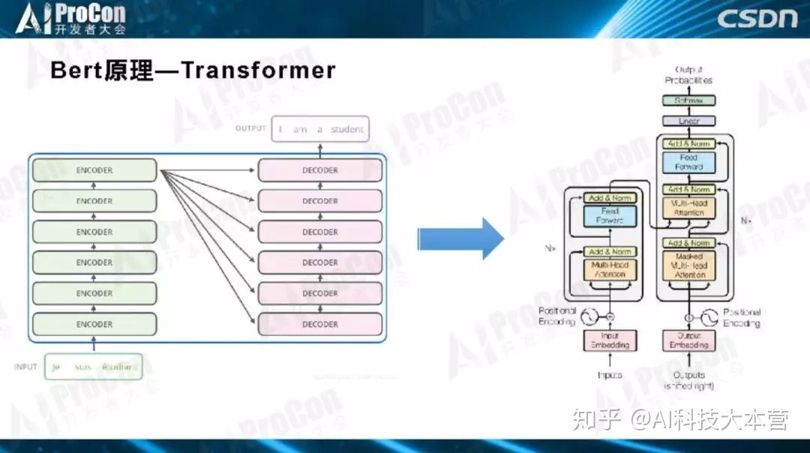

如图所示，这是Transformer典型的层级结构，Transformer由若干个Block堆叠而成，作为基本构件，每一个Block里是一个小生态系统，里面又涉及很多技术，其中四个最关键的子部分：Layer Norm、Skip Connection、自注意力和前馈神经网络。

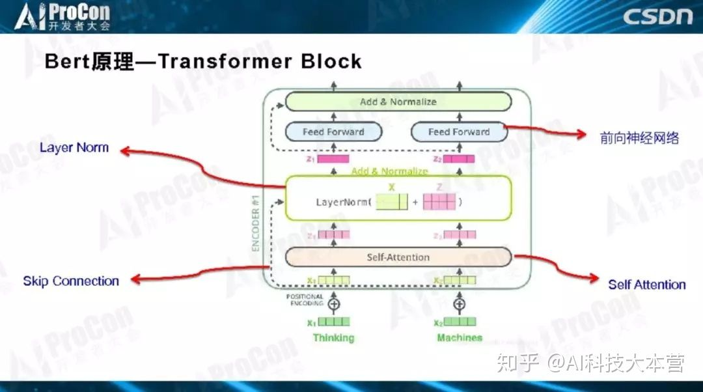

**BERT由两阶段构成，每个阶段有自己的特点和目标。第一个阶段是预训练阶段，第二个阶段是Fine-Tuning阶段。**预训练阶段用大量无监督的文本通过自监督方式进行训练，把文本包含的语言知识以参数形式编码到Transformer中，Fine-Tuning一般是有监督的，数据量比较小，在模型结构上做分类任务以解决当前任务。第一阶段跟第二阶段怎么连接起来的？在预训练阶段Transformer学到了很多初始化的知识，第二阶段就把初始化网络学到的语言知识拿来用，Fine-Tuning引入新的特征解决你的问题。

所以，为什么BERT效果这么好？为什么以前的模型效果没有BERT好？因为，第一阶段编码了文本中大量的语言学知识，在Bert之前，没有用那么多的文本数据，而且是无监督的方式。那么我们关心的是：**BERT里的Transformer到底学到了什么？比传统模型多学了什么知识？这是关键。**

应该说，Transformer和BERT都还不十分成熟，结构又复杂，实际应用也很复杂，如果没有对它们的深入了解、不知道它们的结构及优缺点，我们就很难能更好的改进它们，以得到更好的BERT和Transformer。**怎样能加深对它们的认识呢？这就是接下来要和大家深入探讨的内容。**

## **第二部分：探寻方法**

我们说了，Bert通过预训练，学到了语言知识，那么这些知识在哪里？就在Transformer的参数里。但是，我们看到的都是一堆参数，就是大量的数值，看不出里面的含义，于是问题转化成了：我们怎么知道多层的Transformer的每层都学到了什么，有什么方法可以看出来它学到了什么？一般把这些技术叫做探寻方法，那么常用的探寻方法有哪些？

在开始讲BERT的探寻方法之前，先从DNN这个著名的黑盒系统开始讲起。大家都知道DNN效果好，但每个神经元学到了什么，不知道；也看不到，不好理解，能看到就是一个神经元的响应值或大或小；神经元之间的关系也不知道，大家不理解DNN是怎么工作的。学术界早就意识到这个问题了，自从DNN出来之后，好多人试图寻找方法，试图让大家理解DNN是怎么工作的，探寻每个神经元学了什么。特征可视化是典型的破解黑盒的方法，这个方法在图像领域中很常用，但并不是通用的。今天要讲的是BERT和Transformer的探寻方法。

**目前有几种典型的方法，第一是可视化（2D t-SEN），用2D图的方式展示。**如下图所示，用Transformer的每层的特征，各自把名词、短语进行聚类，同一颜色代表同一类的短语，如果聚类效果好，说明这层编码了这类知识。通过这种方法，进而知道哪一层适合解决什么问题，编码哪些知识，这是典型的可视化方法。

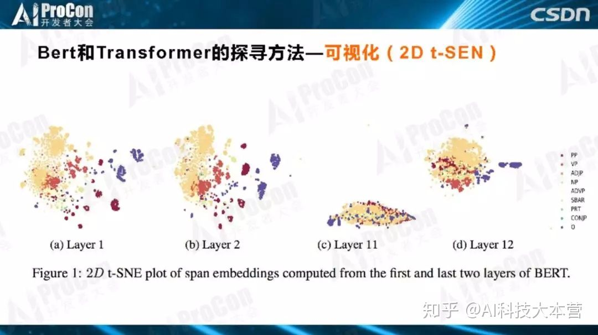

**第二个方法是Attention图。**对探索Transformer所学到知识的探寻手段来说，Attention图是非常关键的方法，它可以形象地观察一个单词和其它单词的关系，联系的紧密程度。如下图所示，看一看介词'at'和谁的关系更密切？连接线越粗，表示联系越紧密，值越大边就画得更粗一点，发现跟'Auction'更粗，证明了BERT学到了介词和主名词之间的关系，更重要是通过Attention图的方式能够知道学到了哪些知识。

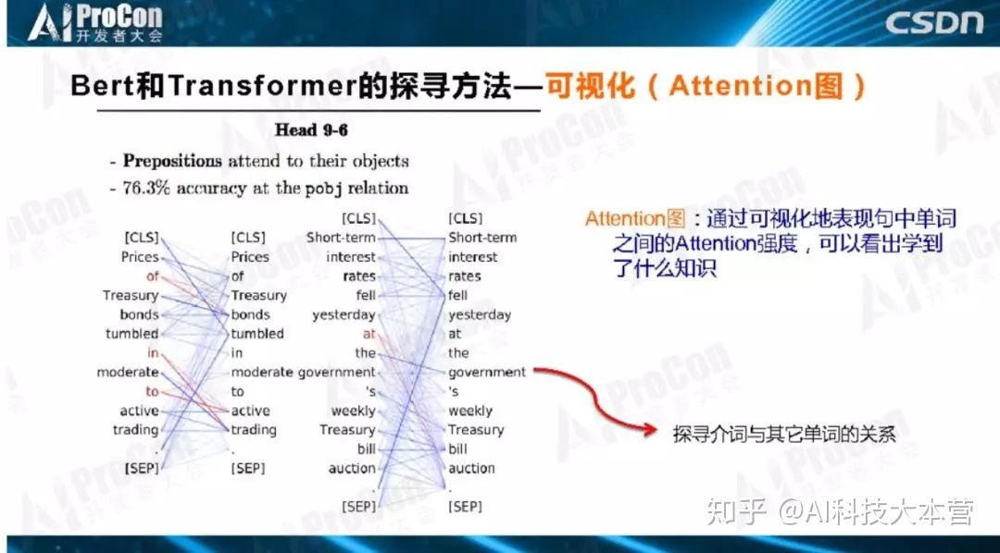

**第三种方法是Probing Classifier。**对于Transformer某一层某个单词的Embedding节点，如果想知道它学到了什么东西，怎么做？我们把Transformer结构参数固定住，保持不变，知识已经编码在参数中，需要找到一种探寻方法，知道每个层次学到了什么。如下图所示的例子很直观，Transformer参数固定住，最高层Transformer对应的单词有个Embedding，表示通过各层学到的知识，怎样知道这个Embedding学到了什么？上面加入一个小分类网络，这个网络结构很简单，我们不希望它自身学习过多的知识，只希望它利用Transformer已经编码好的知识去进行词性标注，如果能标注正确，表明Transformer这一层已经编码学到了词性标注相关知识，如果标注错误表明没有编码这个知识。利用这样一个简单分类器来完成某个具体任务，而分类器里面的参数很少，基本没有什么参数，所有的决策信息来自于Transformer本身学到的知识，如果任务能够解决得很好，也就说明了Transformer中存储的与这类任务相关的知识比较多。这样就探测出了Transformer每一层到底学到了哪类知识。

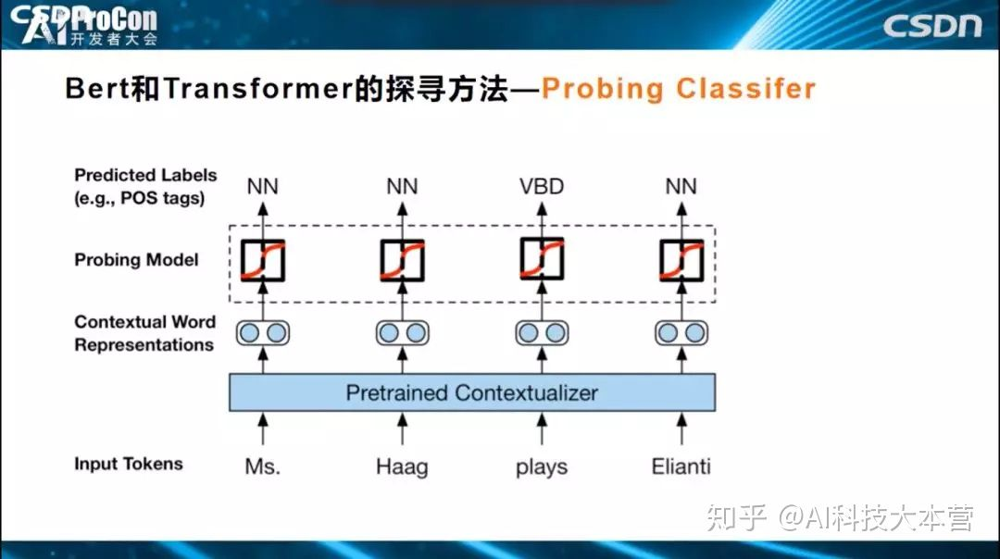

**还有一种改进方法叫做Edge Probing Classifier。**它和Probing Classifier的区别是什么？Probing Classifier只能判断一个单词对应的Embedding节点学到了什么，但对于很多任务来说有其他的需求。比如如果我们需要知道一个短语、两个单词和三个单词学到了什么，或者句中的A单词和B单词是什么关系，如何通过Edge Probing Classifier方式来获知它学到了什么知识呢？如下图所示，Transformer仍然固定参数，简单分类器的输入变成多节点输入，上面的Span可能覆盖一个片段，如一个单词，两个单词，然后构建一个简单的分类器解决分类任务，进而观测预测的精准性，根据预测准确性，来获知到底学到了什么知识。它和Probing Classifier的主要区别是能够同时侦测多节点编码的知识。

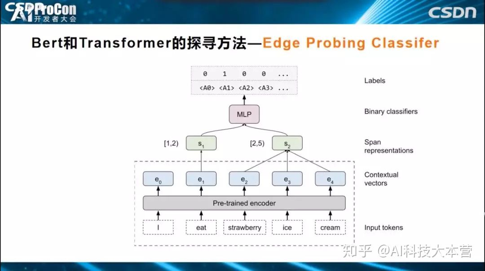

上面介绍的是一些常用的探测方法，有了这些探测方法，就能够去看看Bert或者Transformer到底学到了什么知识了。如果归纳一下目前的研究结论的话，大致概述一下：**BERT训练好之后，低层Transformer主要学习自然语言表层的特征，中层学习编码句法信息，高层编码了NLP的语义特征。**很多实验都已证明这一结论。

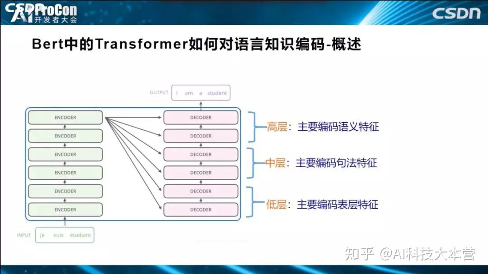

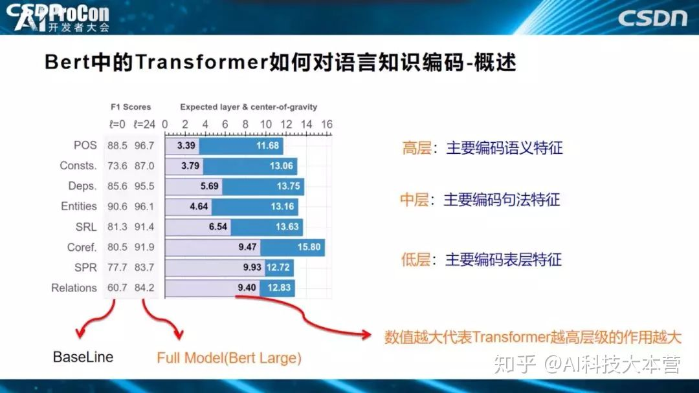

怎么得出的这个结论？上图的一系列任务中说明了为什么会得出这个结论。**POS、成分分析、DEPS、Entities、SRL、COREF、关系分类，从上到下，越往下这个任务越需要偏向高层语义的知识才能解决好。**POS词性标注是简单任务，偏向表层特征，关系分类则是纯语义的任务，不理解语义便无法很好的解决任务，从上到下逐渐趋向语义任务。柱状图表示要解决这个任务，发挥作用的是Transformer的哪些层，得分越高，代表需要的层深越高。如关系分类任务的9.40和POS任务的3.39，意味着，关系分类任务更依赖于Transformer高层的贡献，POS任务的信息主要从Transformer低层中获取，从图中可以看出，**随着层深逐步增高，任务逐步趋向语义任务。**

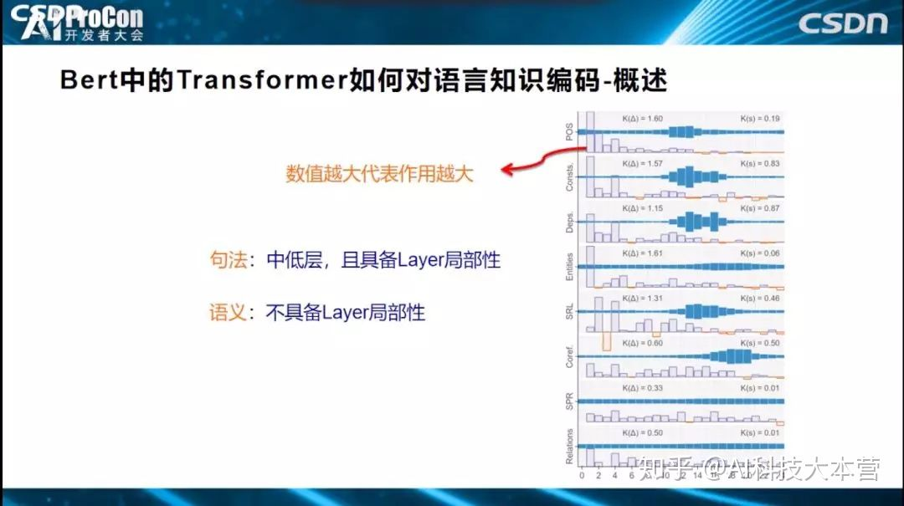

**如果只把Transformer分为低、中、高层，这还是有些粗糙，我们希望再深入、更细致地剖析每层的作用大小。**如上图所示，横坐标表示Transformer有24层，纵坐标代表发挥作用的大小，指标高代表这一层发挥的作用越大。从图中可以看出，解决好词性标注任务，第一层、第二层、第三层、第四层贡献最大，其他层贡献不太大。用的是什么方式？就是上面刚刚讲到的Probing Classifier方式，说明Transformer低层比较适合解决表层特征的任务，词性信息都被编码在这里，也说明了低层编码了表层和句法知识。**从细分图得出的具体结论可概括得到：句法知识具备Layer局部性，对某些层依赖性大，而语义知识，不具备Layer局部性，知识编码在各层中。**

上面得到的结论是符合预期的，而接下来的这个结论比较有意思。如下图中标红所示，**Transformer高层倾向于编码语义知识，低层编码句法知识，而高层语义知识会对低层句法知识有反馈作用，经过高层语义指导修正底层的句法特征。**‘他在季后赛中抽了多伦多六支安打’，多伦多是个多义词，可代表地名，也可以代表一个运动队，如果我们把这句话输入Transformer或BERT结构中，到底在某一层编码的是‘多伦多’，还是‘多伦多队’？这是我们希望知道的。

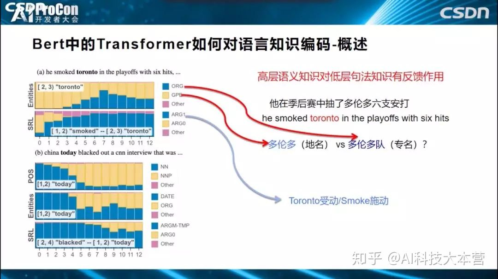

可以通过观察0到12层的黄蓝占比来判断每层的编码知识，黄色表示判断出‘多伦多’为（地名），蓝色认为是一个（队名），从图中我们看出，0层、1层、2层基本上不会认为是‘多伦多队’（队名），判断‘多伦多’是（地名）；而高层中‘多伦多队’占比凸显了，为什么如此？因为Bert发现了句中的单词Smoked（抽打），发现了它和单词”多伦多”存在施动-受动关系后，就更倾向于判断多伦多是个队名，这种语义知识是在高层编码的，它反过来会影响中低层的判断，从而说明了高层语义知识反过来可以修正低层的句法知识。

**下面我们说明Transformer三层（低层、中层、高层）到底具体编码了哪些语言学知识。低层对单词位置信息的编码比较充分。**横坐标表示层深，可以看到第2层的结果就已经很好了，而第四层编码的预测结果则下滑的非常严重，说明低层对单词位置进行编码，高层已经基本丢失了位置信息，无法解决位置信息任务；位置信息主要在低层来编码学习的，高层编码了低层单词之间形成的结构信息，位置信息只是低层给高层使用用于构造单词之间结构关系。

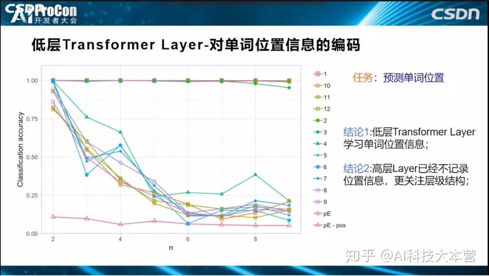

**此外，低层还对短语信息进行编码、对特殊符号进行编码。**

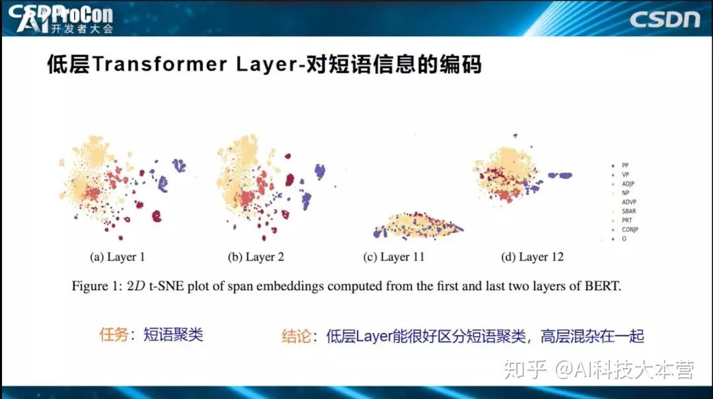

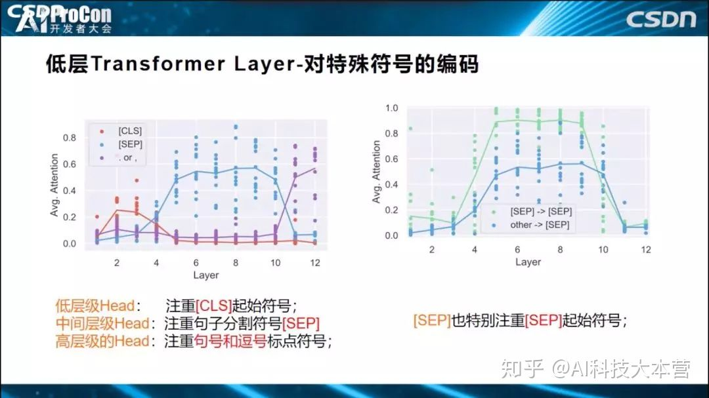

**中层是对句法信息的编码。**句法预测任务中，横坐标是24层的每一层，这是效果指标。哪层对句法预测效果比较好，效果好也就意味着编码信息更多，可以看出3到8层对句法预测比较好。

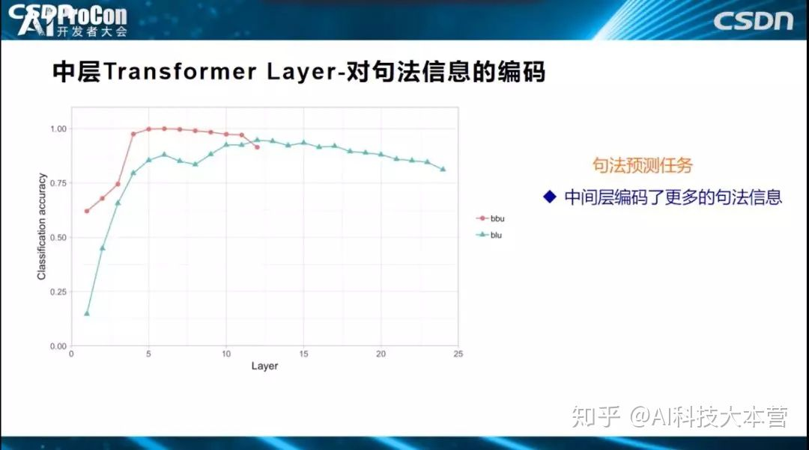

**高层对语义信息进行编码。**如下图所示指带消解任务，代词’He‘和‘She’可以指带什么？BERT是否学习了？从图中可以看出指代关系已经编码到BERT特征中了，因而解决效果比较好。

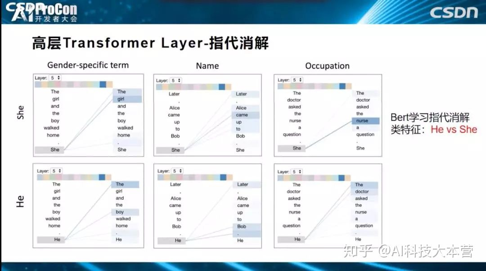

## **第三部分：BERT 的预训练比无预训练过程多学了什么？**

预训练模型用上面提到的Probing Classifier方式完成探测后，再用无预训练、不用初始化的模型直接学习的模式，两者进行实验对比。**我们会发现：无预训练模型在句子长度预测任务表现要好于预训练模型BERT，说明了预训练模型靠牺牲部分表层特征表达能力，获得了更多、更丰富的复杂特征表达能力。**

我们知道目前有很多不同的预训练模型，它们之间相比，有什么异同？Bert预训练模型相对其它模型多学到了什么？**相对于Cove、Elmo等其它模型，Bert模型编码了更多的句法信息，语义信息大致相当。**另外，BERT比GPT多学了什么东西？因为BERT层数更深，更有利于编码语义特征。最后，相对传统模型比如RNN和CNN，ELMO多学了什么东西？ELMO通过预训练，比CNN学到了更多、更长的上下文特征。

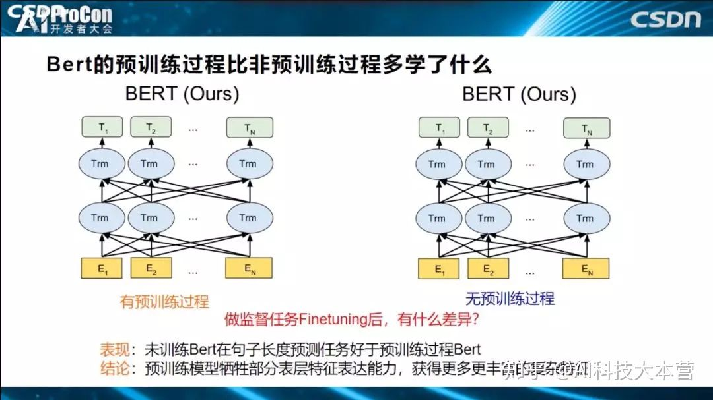

最后我们概括一下，Bert的Transformer低层学了表层特征，中间层学了句法特征，高层学了语义特征，虽然目前都有相关工作在进行，但还不够细致，需要做更深入的探索，相信未来会有更多更好的研究出现。我今天的分享就到这里，谢谢大家！