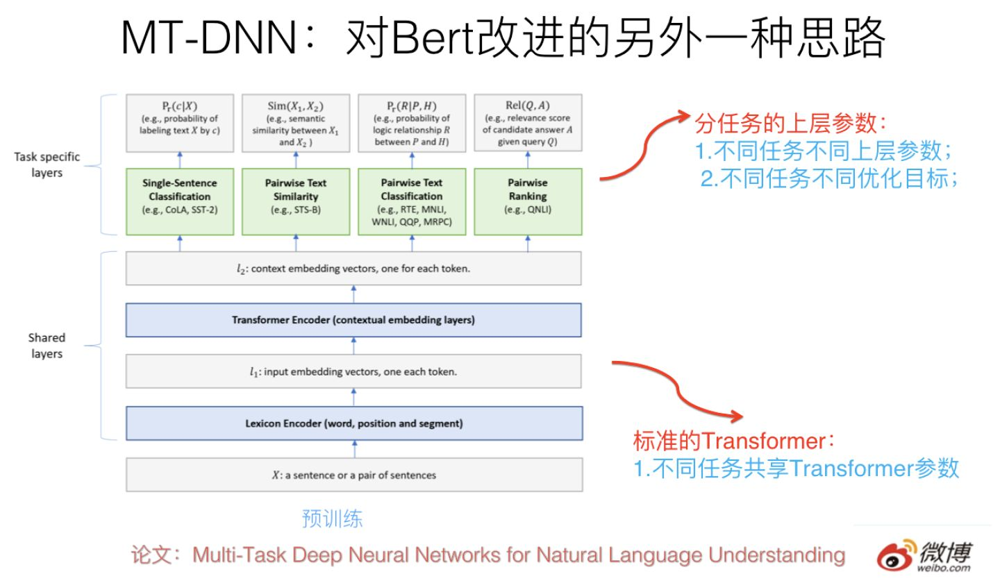

作者：张俊林
链接：https://zhuanlan.zhihu.com/p/56865533
来源：知乎
著作权归作者所有。商业转载请联系作者获得授权，非商业转载请注明出处。

最近朋友圈被NLP的技术大新闻刷屏刷得有点多，今天（2月15日）中午开始又被GPT 2.0刷屏了，大致看了下新闻大致了解了下思路，觉得好像思路还好，但是看GPT 2.0那个生成的续写故事的例子确实吓了我一跳，这个效果好到出人意料。我看网上有些有才的朋友评论说：“应该让GPT去续写红楼梦后40回”，我估计高鹗听后，正在地下或者天上凝视着说这句话的朋友瑟瑟发抖（这位有才的朋友，你想到这个场景会瑟瑟发抖吗，哈哈），被人批评水平不够100年，本来就郁闷，结果目前还冒出一个替代者，嘿嘿。还有的朋友说，也可以让GPT去把那些挖坑不填坑的垃圾网络小说作品续完。我觉得把GPT当作垃圾文学回收站，也是个不错的主意，但是我想问的是你问过GPT本人的意见吗？写小说这种工作，目前NLP技术很明显还差得远，不过如果再发展一步的话，还真有这种可能。

我的预感，**未来两年NLP可能会不断爆出类似的刷屏新闻，真的进入一个技术快速发展期。按理说，这是NLP研发者的黄金期，这种时期最容易出好的成果，但是事实上，很可能你只能作为看热闹的看客，眼看他起高楼，眼看他宴宾客，但是别人的红火与你无关**。我想这种心情，昨天估计不敢刷朋友圈怕心灵创伤难以愈合的的单身狗朋友们，他们对这种类似的感受是理解最深的。那么为什么说NLP很可能进入快速发展期但是与你无关呢？原因我后面会说。

下午有位技术媒体的朋友问我说是不是写点看法，我觉得貌似从技术上看算是正常进展，所以写不写都行，看了论文再决定。结果一直开会开到晚上，回家找来论文仔细看了一看，再结合前几天媒体广泛传播的微软的MT-DNN 技术，它们之间以及和Bert之间，是有内在联系的，所以觉得可以放一起简单谈谈看法，于是动手熬夜写了这篇。本来我春节期间写好了三篇推荐系统召回模型系列的文章，想最近先发一篇的，想了想既然GPT 2.0热度高，不如蹭个热度先发了，召回模型以后再慢慢陆续发出来吧。

 进入正题。

## **GPT 2.0到底做了什么**

之前在介绍Bert的文章里：

[张俊林：从Word Embedding到Bert模型—自然语言处理中的预训练技术发展史zhuanlan.zhihu.com](https://zhuanlan.zhihu.com/p/49271699)

我说GPT有个缺点，就是作者不太会炒作，因为它是个非常扎实的重大NLP进展，出生证日期显示年龄比Bert大，但是Bert哇哇坠地就引来各界慈爱的目光，和交口称赞，GPT只能躲在无人角落里暗地泪垂，演绎了算法模型界的真正的同人不同命，冰火两重天。没想到时过不到4个月，GPT 2.0就爆红，被推上打着聚光灯的华美舞台，惊艳亮相。炒作能力见长进，其实挺好，好工作其实是应该PR的，这样能让更多人跟进真正有价值的工作，而这会更进一步促进领域的进步和发展，形成正循环。而不是特别好的工作过度PR，会错误地引导大量人力／时间／机器等资源投入到错误的方向，这个其实是种资源浪费。

在谈GPT 2.0之前，先回顾下它哥GPT 1.0，这个之前我在介绍Bert模型的时候介绍过，过程参考上图，简述如下：GPT 1.0采取预训练+FineTuning两个阶段，它采取Transformer作为特征抽取器。预训练阶段采用“单向语言模型”作为训练任务，把语言知识编码到Transformer里。第二阶段，在第一阶段训练好的模型基础上，通过Finetuning来做具体的NLP任务。GPT 1.0本身效果就很好，不过之前说过，因为不会PR，所以默默无闻，直到Bert爆红后，才被人偶尔提起。从大框架上来说，Bert基本就是GPT 1.0的结构，除了预训练阶段采取的是“双向语言模型”之外，它们并没什么本质差异，其它的技术差异都是细枝末节，不影响大局，基本可忽略。

那么GPT 2.0本质上是怎么做的呢？最大的改进是什么？其实几句话就能说明白，就是上图写的内容。

它的大框架其实还是GPT 1.0的框架，但是把第二阶段的Finetuning做有监督地下游NLP任务，换成了无监督地做下游任务，为啥这么做？后面会讲。我相信如果你理解GPT 1.0或者Bert，那么是非常容易理解GPT 2.0的创新点在哪里的。

那么它最大的改进在哪里？本质上，GPT2.0选择了这么一条路来强化Bert或者是强化GPT 1.0的第一个预训练阶段：就是说首先把Transformer模型参数扩容，常规的Transformer Big包含24个叠加的Block，就是说这个楼层有24层高，GPT 2.0大干快上，加班加点，把楼层连夜盖到了48层，高了一倍，参数规模15亿，这个还是很壮观的，目前貌似还没有看到过Transformer楼层有这么高的模型。那么，为什么要扩容呢？这个只是手段，不是目的。真正的目的是：GPT 2.0准备用更多的训练数据来做预训练，更大的模型，更多的参数，意味着更高的模型容量，所以先扩容，免得Transformer楼层不够多的房间（模型容量）容纳不下过多的住户（就是NLP知识）。

水库扩容之后，我们就可以开闸放水了。本质上GPT 2.0主要做的是：找更大数量的无监督训练数据，这个其实好办，反正是无监督的，网上有的是，估计未来有一天我写的这篇文章也能住进GPT 2.0的Transformer客房里。所以，GPT2.0找了800万互联网网页作为语言模型的训练数据，它们被称为WebText。当然，光量大还不够，互联网网页还有个好处，覆盖的主题范围非常广，800万网页，主题估计五花八门，你能想到的内容，除了国家禁止传播的黄赌毒，估计在里面都能找到。这带来另外一个好处：这样训练出来的语言模型，通用性好，覆盖几乎任何领域的内容，这意味着它可以用于任意领域的下游任务，有点像图像领域的Imagenet的意思。GPT 2.0论文其实更强调训练数据的通用性强这点。当然，除了量大通用性强外，数据质量也很重要，高质量的数据必然包含更好的语言及人类知识，所以GPT 2.0还做了数据质量筛选，过滤出高质量的网页内容来。

之后，GPT 2.0用这些网页做“单向语言模型”，我这里强调下，仍然是类似GPT 1.0的单向语言模型，而不是Bert的双向语言模型任务，后面我会单独讲下对这个事情的看法。这样GPT就可以训练出一个更好的预训练模型了，尽管GPT 2.0没有像Bert或者1.0版本一样，拿这个第一阶段的预训练模型有监督地去做第二阶段的Finetuning任务，而是选择了无监督地去做下游任务，尽管这看着和Bert差异很大，其实这点并不重要，甚至你都可以忽略掉这个过程（当然，最吸引眼球的是第二个过程），要记住对于GPT 2.0来说最重要的其实是第一个阶段。

其实，如果你不是非常专业的前沿NLP研究者的话，了解GPT 2.0，这就足够了，这即使不是GPT 2.0的百分之百，也有它的百分之80了。至于它提到的对Transformer结构的微调，以及BPE输入方式，我相信都是不太关键的改动，应该不影响大局。

如果你细致思考的话，上面讲述的GPT流程，其实隐含了三个问题。

**第一问题是：为什么GPT 2.0第二阶段不通过Finetuning去有监督地做下游任务呢？**

其实GPT的作者是想通过这种方式说明：你看，通过这种改造，GPT 2.0的Transformer学到了多少知识呀，通用性多强啊，做下游任务的时候，包括语言模型，QA，摘要，机器翻译这么多任务，即使不用有监督的方式，直接拿第一阶段用语言模型训练好的模型，都能比较好地做这些任务（从无监督的角度比，效果确实挺好，但是跟目前有监督的方法比很多效果差的还远，这也正常）。GPT作者心里想对你说的是：兄dei（说起这个流行词，我就有点哭笑不得，因为它让我想起一件往事：我那7岁的娃今年春节期间竟然对她妈妈说：兄dei，给我买个玩具小狗可好？），我就问你神奇不神奇？惊喜不惊喜？嗯，其它任务其实不惊奇，但是能做机器翻译这个确实有点意思，不展开讲了，建议机器翻译的实验部分可以好好看看想想为什么，论文里说了，这其实是个事故和意外，哈哈。

所以，第一个问题的答案是：无监督地去做很多第二阶段的任务，只是GPT作者想说明在第一阶段Transformer学到了很多通用的包含各个领域的知识，第二部分各种实验是对这点的例证，如此而已。这是为何说第二阶段其实不重要，因为它不是论文的中心思想，而是说明中心思想的例子。

下面谈隐含的第二个问题，第二个问题其实比较相对有那么点意思，什么问题呢，就是：“**在预训练阶段，为什么GPT 2.0仍然固执地用单向语言模型，而不是双向语言模型呢？**”你可以想想这背后可能是什么原因。关于这点，我讲讲我的看法，当然你别太严肃地看我下面的说法，就当是个我编撰的科技版八卦，今天不是“情人节后第二天纪念日”吗？我开个玩笑调节下气氛，哈哈。技术科普没必要老板着脸推公式，是吧，反正这是我的理念。

我的不太准的第六感隐隐约约地告诉我：貌似GPT 的作者们，对于GPT作为本来该火的前辈模型，结果默默无闻，而后来居上的Bert爆红，可能对这点有点意见？因为它们两者仅有的大的不同就是GPT用的单向语言模型，Bert用的双向语言模型做预训练。所以感觉他们在做GPT 2.0的时候憋着一口气。为啥这么讲呢？因为Bert在论文的实验部分已经证明了：Bert的效果比GPT好主要归因于这个双向语言模型（参考上图Bert的实验结果，去掉双向语言模型的对比模型其实就等价于GPT 1.0）。按理说，正常的思考模式，后面的改进模型应该采纳双向语言模型，原因很简单，因为它比单向的效果好。

但是，GPT 2.0仍然固执地选择单向语言模型（也许GPT 作者只想强调他们想做语言模型这个事情，毕竟生成内容后续单词这种模式，单向语言模型更方便，这估计是真正原因。不过既然我已经开始编八卦了，就索性编完，毕竟我不是个轻言放弃的人，哈哈），貌似作者们选择了另外一种打算赶超Bert的方式，就是提升模型参数容量和增加训练数据的数量，选了这么条路。我估计意思是说，Bert你别得意得太早，尽管我用单向语言模型，一样能干翻你。GPT 2.0的论文在末尾留了个引子，说打算试试看GPT 2.0的单向语言模型是不是就比Bert的双向语言模型差。估计他们还会推出GPT 3.0，但是肯定还是单向语言模型，就是说人家不服气，要靠其它方法用单向语言模型超过Bert。嘿嘿，当然，在强调一下，这是我编的八卦，或者是臆断，未必是事实，但是我死活想不明白为啥他们做下游任务的时候不用双向语言模型，想来想去貌似只有这个解释最合理，哈哈，这是我的小人之心和玩笑话，别当真。

下面严肃起来，不过我的感觉是，如果GPT 2.0采取双向语言模型，然后再把目前增加训练数据质量和数量的路子搭配起来，估计八九成做下游任务是能超过Bert的效果的，那为啥不这么做呢？觉得简单扩充数据，这么做创新性不够酷，所以走了无监督做下游任务的不寻常的路子？我估计后面GPT 3.0出来我们会知道真正的答案。当然，话讲回来，假设Bert也在第一阶段采取类似的扩充数据的改进方式，我相信GPT 3.0如果仍然采取单向语言模型的话，很大概率估计还是Bert赢。

最后是隐含的第三个问题，第三个问题也很有意思，这个问题其实跟第一个问题有点关系，问题是：“**GPT 2.0 既然第二阶段是无监督的任务，而它不做Finetuning，那么你训练好一个语言模型，它当然会根据输入的一句话，给你蹦出后面可能紧跟那个单词，这是标准的语言模型过程，这个正常。但是如果这时候让它去做一个文本摘要任务，它怎么知道它现在在做什么事情呢，根据输入，应该输出什么东西呢**？”就是这么个问题，你不细想可能容易忽略，但是细想其实挺有意思。

其实GPT 2.0在做下游无监督任务的时候，给定输入（对于不同类型的输入，加入一些引导字符，引导GPT正确地预测目标，比如如果做摘要，在输入时候加入“TL：DR”引导字符串），它的输出跟语言模型的输出是一样的，就是蹦出一个单词。那么问题来了：对于比如摘要任务，我们期待的输出结果是一句话或者几句话，你给我一个单词，有点太小气，那该怎么办？很简单，继续一个字一个字往出蹦，按照这些字从系统里蹦出来的时间顺序连起来，就是你想要的摘要结果，这种所有任务采取相同的往出蹦字的输出模式也是有点意思的。就是说，GPT2.0给出了一种新颖的生成式任务的做法，就是一个字一个字往出蹦，然后拼接出输出内容作为翻译结果或者摘要结果。传统的NLP网络的输出模式一般需要有个序列的产生结构的，而GPT 2.0完全是语言模型的产生结果方式：一个字一个字往出蹦，没有输出的序列结构。

上面内容应该就是我觉得关于GPT 2.0，最值得了解的部分以及它的核心思路和思想了。

我的感觉，GPT 2.0作为语言模型，用来生成自然语言句子或者段落的能力特别强，要理解有多强，看下面的例子就知道了：

参考上图，系统提示出一个故事开始的几句话，然后后面的内容就靠GPT2.0的语言模型一个字一个字往出蹦，蹦出很多字后，形成后它补充的故事，如果你英文还可以的话，建议还是看看里面的内容。文章开始说我看了GPT的例子吓了一跳，就是说的这个例子。无论是语法，可读性，语义一致性，都是很强的，这个超出我对目前技术的期待。也许未来我们会拥有GPT版莎士比亚，也未可知，我对此很期待。

归纳一下，我觉得，我们可以从两个不同的角度来理解GPT 2.0。

**一个角度是把它看作采取类似Elmo/GPT/Bert的两阶段模型解决NLP任务的一种后续改进策略**，这种策略可以用来持续优化第一阶段的预训练过程。毕竟目前GPT 2.0还只采用了800万的网页。你说用一亿网页去训练可以吗？理论上看是可以的，方法都是现成的，就是Bert那种方法，可能连改都不用改。但是实际上要看你自己或者公司的账户余额，你数数后面有几个零，你没数我都遥远地隔着屏幕听到了你的叹息声了，是吧？

 当然，从GPT 2.0的做法和结果来看，可能意味着这一点是可行的：后面我们也许可以通过现在的Transformer架构，持续增加高质量网页数量，就能够不断让Transformer学到更多的知识，继而进一步持续对下游任务有更高的提升。这是一条简单有效的技术发展路径。这也是为何我在开头说，隐隐地预感到未来两年我们会持续看到不同的NLP任务记录被刷新，以及不断爆出的新纪录。为什么？很简单，加大预训练数据量很可能就能做到这点。是否真的会是这样，我们拭目以待，我对此也很有期待。当然，你会问：这么做的收益有边界吗，如果无限增加数据，就能持续提升任务效果，没有终点吗？事实肯定不是这样，如果真是这样那真是个天大的好消息，而这不可能，不过话说回来，但是目前GPT 只用了800万网页，这肯定还只是一个开始，距离这种优化模式的天花板还远。

 那么另外一个问题是：GPT 2.0和Bert两阶段模型是什么关系？其实答案上面都说了，GPT 2.0其实进一步验证了Bert这种两阶段是个非常有效的无监督NLP语言知识编码方法。进一步在哪里？它说明了第一个阶段的预训练过程，如果采用更高质量的数据，采用更宽泛的数据（Web数据量大了估计包含任何你能想到的领域），采用更大量的数据（WebText，800万网页），Transformer采用更复杂的模型（最大的GPT2.0模型是Transformer的两倍层深），那么在Transformer里能学会更多更好的NLP的通用知识。为什么是通用的？因为第二阶段不做任何fine-tuning就能达到更好的效果，而且是各种任务，说明通用性好，通用性好说明了学到了各种类型的语言知识；而这无疑，如果我们第二阶段仍然采取Finetuning，对下游任务的提升效果是可以很乐观地期待的。

**另外一个角度也可以把GPT 2.0看成一个效果特别好的语言模型**，可以用它来做语言生成类任务，比如摘要，QA这种，再比如给个故事的开头，让它给你写完后面的情节，目前看它的效果出奇的好。当然，仅仅靠拼数据量做纯语言模型能让机器产生情节合理的文章吗？我觉得可能性不太大，GPT 2.0的生成内容质量好，很可能只是它的记忆能力强导致的，我估计可能是它在把它从大量网页中记忆的语言片段往外直接抛出来的，不代表它真有编写合理故事的能力。为什么GPT 2.0通过语言模型能够在QA任务中能够不做训练，回答正确一定比例的问题？我觉得很可能是因为预训练数据集合太大，又比较宽泛，这些问题及答案在网页里面很接近的地方出现过。而看它的实验部分，起码QA任务确实也是这样的。

但是不论如何，GPT 2.0的结果起码告诉我们，走这条路子对于产生高质量的生成文章是很有帮助的，我觉得起码对于生成句子的流畅性，可读性这些语言表层的方面有直接帮助，但是涉及到情节，这个估计就纯粹靠蒙了。但是写到这句话的时候，我突然想到了一个改进它的思路，让它能够受到你想要的情节context的约束去生成内容，有点跑题，就不展开讲了。我觉得对于GPT 2.0的改进方向来说，如何加入情节约束，产生特别好的生成文章，这个是个很有前途的方向。而在这点上，GPT 2.0的贡献是给我们指出了一条路，就是Transformer+刷数据量，省心省力费机器的一条路。另外，Transformer之前在语言模型上通常做不过RNN，虽然有后续研究表明它可以达到RNN类似的效果，但是GPT 2.0无疑进一步突破了这个障碍，为Transformer的进一步攻城略地打下了坚实的基础。

## **Bert的另外一种改进模式：进一步的多任务预训练**

上面介绍的是GPT 2.0的改进模式，如上归纳，它采取的大的策略是：优化Bert的第一个预训练阶段，方向是扩充数据数量，提升数据质量，增强通用性，追求的是通过做大来做强。那么如果让你来优化Bert模型，除了这种无监督模式地把训练数据做大，还有其它模式吗？

当然有，你这么想这个问题：既然Bert的第一个阶段能够无监督模式地把训练数据做大，我们知道，机器学习里面还有有监督学习，NLP任务里也有不少有监督任务是有训练数据的，这些数据能不能用进来改善Bert第一阶段的那个学习各种知识的Transformer呢？肯定是可以的呀，所以很自然的一个想法是：把Bert第一阶段或者第二阶段改成多任务学习的训练过程，这样就可以把很多NLP任务的有监督训练数据里包含的知识引入到Transformer中了。

这种做法一个典型的模型是最近微软推出的MT-DNN，改进思路就如上所述，可以参考上图示意。核心思想如上，结构上底层就是标准的Bert Transformer，第一阶段采用Bert的预训练模型不动，在Finetuning阶段，在上层针对不同任务构造不同优化目标，所有不同上层任务共享底层Transformer参数，这样就强迫Transformer通过预训练做很多NLP任务，来学会新的知识，并编码到Transformer的参数中。

对Bert的多任务改造其实是个非常自然的Bert的拓展思路，因为本来原始版本的Bert在预训练的时候就是多任务过程，包括语言模型以及next-sentence预测两个任务。新的多任务的目标是进一步拓展任务数量，以此来进行模型优化。

这种改进在效果上也有直接的效果提升，在11项NLP任务中9项超过了原始版本的Bert。

多任务理论上在第一阶段预训练和第二阶段Finetuning阶段做都可以，但是估计大多数会在第二阶段做，原因是第一阶段跟着那个大的语言模型数据一起，太消耗资源。

**我觉得如果你是做应用，这条路也可以走得更远一些，引入更多的有监督NLP任务，集成更多的知识，无疑这么做是有好处的。**

## **NLP领域的一些发展趋势**

最后，我结合最近两个月一些热门技术新闻的做法，顺便再谈谈我的一些关于NLP技术趋势的看法，有些观点之前提过，再强调一下，有些观点比较细，算是一个归纳吧。

目前可以看出，从NLP主流模型进化的角度，有以下几个趋势：

**第一个趋势：采取Bert的两阶段模式**，Bert虽然还没多大岁数，还不到一岁，但是最近两个月，目前各种NLP评测刷榜的基本都是它。据我所知很多具备一定规模的互联网公司已经都开始在评估部署Bert模型了，微博也用Bert大幅度改进了标签分类的精度，目前正在其它各种NLP应用任务进一步推广。没办法，Bert效果确实好，你不得不服。所以这个趋势已经开始彰显了；

**第二个趋势：特征抽取器采用Transformer**，这个之前在做NLP特征抽取器的文章里，我说明过原因，根本原因是效果比CNN和RNN好，至于它们之间的比较，可以参考之前的文章：

[张俊林：放弃幻想，全面拥抱Transformer：自然语言处理三大特征抽取器（CNN/RNN/TF）比较zhuanlan.zhihu.com](https://zhuanlan.zhihu.com/p/54743941)

当然，Transformer也有几个重点改进方向，这个后面找机会详细说一下。

第三个趋势，从最近的几个工作，我们可以看出Bert两阶段模式中，第一个预训练阶段的两种改进方向：当然基础是越来越深（意味着模型参数容量大，各种知识和数据？就是死记硬背我也要记住你，大致就是这个意思）的Transformer作为特征抽取器；第一阶段的改进工作花开两只：

**一种是强调通用性好以及规模大**。加入越来越多高质量的各种类型的无监督数据，GPT 2.0指出了个明路，就是净化的高质量网页，这个跟无限也差不多了，就看你舍得花多少钱去训练模型。通俗点说，就是靠数据规模和金钱堆出来的。它的最明显好处是通用性好，训练好后什么场合都适用。但是因为单纯做纯语言模型任务的话，学习效率低一些，只能靠量大取胜，这是种“瘦死的骆驼比马大”的策略；

**第二种是通过多任务训练**，加入各种新型的NLP任务数据，它的好处是有监督，能够有针对性的把任务相关的知识编码到网络参数里，所以明显的好处是学习目标明确，学习效率高；而对应的缺点是NLP的具体有监督任务，往往训练数据量少，于是包含的知识点少；而且有点偏科，学到的知识通用性不强。

当然，**我相信，我们很快会看到两者的合流，**就是同时用超大规模的无监督语言模型+各种花样的有监督NLP多任务训练。这很正常，因为其实语言模型也是多任务的一种，本来Bert原始的预训练过程就是多任务的：一个是语言模型，一个是next sentence预测。多任务无非是把Bert的两个任务拓展到更多任务中去。所以两者本来就是从Bert很自然能够引出来的自然而然，又一体化的事情。

那么好奇的你问了：这种模式的发展尽头在哪里？

我指指银行的方向：那就是你这个问题的答案。当然，我不是在唆使你去抢银行啊，别会错意，否则迎接你的不是美酒，而会是手铐和猎枪。

第四个趋势：GPT2.0其实真正能够吸引人眼球的是它生成的高质量内容，让人印象深刻。从GPT 2.0的结果看，这种**采取超深层Transformer+更大量的网页数据去做更好的语言模型**，并进而做各种生成式任务，看样子是有前途的。当然，我前面提到，估计要引入情节规划的约束，这个事情才能真正做好。

## **玩法的转向**

上面简单谈谈我个人认为的几个技术趋势，其实最近的一些技术进展，隐隐地透漏出NLP研发模式的一个转向，那么是怎样的一个转向呢？

我们从Bert/GPT 2.0也可以看出NLP研发模式在将来的一个发展趋势：充分利用更大容量的模型，利用无限的无监督的人写好的文章，去编码其中蕴含的语言学知识，以及，人类的知识。很明显NLP已经在往这个方向转向，而这背后隐藏着什么？超级昂贵的GPU计算时间，超大规模GPU机器学习集群，超长的模型训练过程。归根结底一句话：靠烧钱。靠烧钱背后又有两层意思，一个意思是你没钱就玩不起，就会被清除出NLP的竞赛场；另外一个意思是：即使你们公司有钱，但是钱让不让你花在这上面？当然这是另外一个问题。

 总而言之，这说明NLP值得一提的技术进展的玩法已经变了，以后**游戏规则变成了：土豪大科技公司靠暴力上数据规模，上GPU或者TPU集群，训练好预训练模型发布出来，不断刷出大新闻。通过暴力美学横扫一切，这是土豪端的玩法。而对于大多数人来说，你能做的是在别人放出来的预训练模型上做小修正或者刷应用或者刷各种榜单，逐步走向了应用人员的方向，这是大多数NLP从业者未来几年要面对的dilemma。**原因很简单，如果上数据能够推进NLP效果，这其实是非常好的事情，这意味着我们会进入技术发展快车道，因为目标和手段非常简单明确。但是这背后的潜台词是：目前值得一提的技术创新，变成了已经进入烧钱比进展的时代了，而很明显，在未来的1到2年里，类似Google/Facebook这种财大气粗而且创始人具备极端的科学热情的的土豪科技公司，会积累越来越明显的军备竞赛优势。我们会看到未来这些公司不断爆出在各个NLP应用领域的各种刷新记录，及更巨无霸的新模型的出现。

这对于身处公司里搞算法的同志们，其实是个好事情，因为我们本身就是做应用的，追求短平快，简单有效最好不过，我估计各个公司都在忙着改造基于Bert的大规模分布式计算框架呢。但是这对学术圈来说，意味着什么呢？这个问题值得您深入思考。